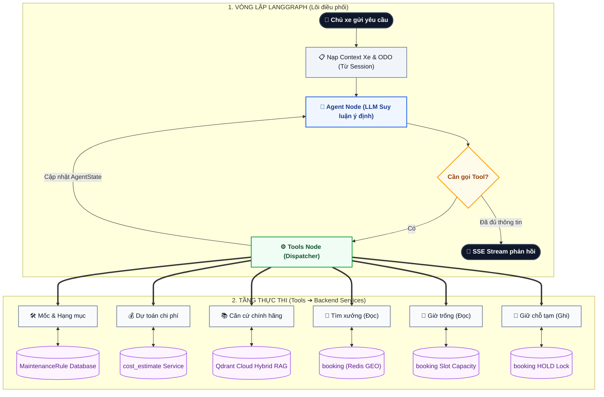
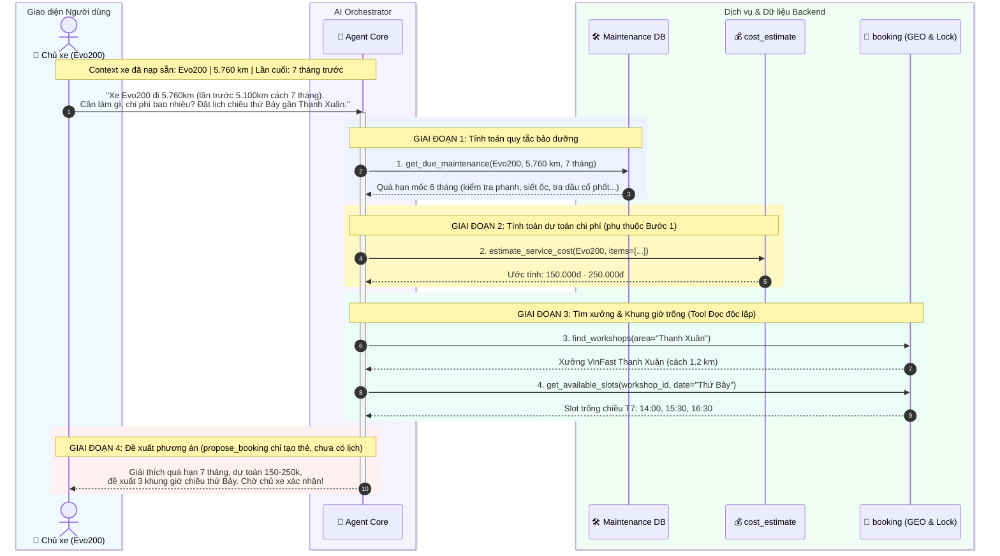

# EV Care — AI Agent Orchestrator

Tài liệu thiết kế kiến trúc, cấu trúc thư mục, danh mục Tools nghiệp vụ và luồng hoạt động chi tiết của **Trợ lý AI EV Care (Agent Core)**.

---

## 1. Triết lý Thiết kế & Phạm vi (Design Philosophy & Scope)

Hệ thống AI Agent của EV Care được xây dựng dựa trên triết lý:
* **Single Orchestrator + Tools rõ ràng + Deterministic State Machine**: Không sử dụng kiến trúc Multi-Agent phức tạp ở giai đoạn này để tránh rủi ro vòng lặp vô tận (infinite loop), chi phí token cao, độ trễ lớn và khó kiểm soát dữ liệu giao dịch.
* **Deterministic kết hợp Generative**: Các tác vụ tính toán hạn bảo dưỡng, tra cứu xưởng, dự toán chi phí và giữ chỗ được giao cho các **Service & Rule Engine nghiệp vụ** của backend. LLM chịu trách nhiệm phân tích ý định, điều phối gọi tool theo thứ tự hợp lý và sinh câu trả lời tự nhiên, có trích dẫn.
* **Phạm vi giai đoạn hiện tại (Agent Core)**: 
  * Tập trung vào vòng lặp thực thi **ReAct (Reasoning + Acting)** hoàn chỉnh thông qua LangGraph.
  * Tạm hoãn cơ chế Human-In-The-Loop (HITL) phức tạp và xử lý lỗi đa tầng sang phiên bản tiếp theo để ưu tiên hoàn thành luồng nghiệp vụ chạy được ngay (runnable & testable).

---

## 2. Cấu trúc Thư mục (Directory Structure)

Toàn bộ mã nguồn của Agent được tổ chức tinh gọn trong thư mục `backend/src/agents/`:

```text
backend/src/agents/
├── README.md                      # Tài liệu kiến trúc và luồng hoạt động (file này)
├── state.py                       # Schema AgentState (messages, context xe, draft booking...)
├── prompts.py                     # System Prompts định hướng nghiệp vụ xe điện EV Care
├── graph.py                       # LangGraph StateGraph (vòng lặp: agent ⇆ tools ➔ respond)
├── orchestrator.py                # Entrypoint điều phối (run_agent_turn stream SSE)
├── dependency.py                  # Composition root: graph + AgentOrchestrator dùng chung
└── tools/                         # Bộ công cụ nghiệp vụ kết nối với Service Layer backend
    ├── __init__.py                # Registry tập hợp và xuất danh sách tools cho Agent
    ├── dependency.py              # AgentToolServices + factory tạo tools được inject
    ├── _services.py               # Lấy chủ xe + xe từ RunnableConfig của phiên chat, dựng service thật
    ├── maintenance_tools.py       # Tình trạng bảo dưỡng của xe (UserVehicleService, TOOL-VEH-001)
    ├── cost_tools.py              # Ước tính chi phí một mốc tại một xưởng (CostEstimationService, TOOL-301)
    ├── booking_tools.py           # find_workshops, get_available_slots (Đọc) & propose_booking (chỉ tạo đề xuất, us-061)
    └── RAG/                       # [Có sẵn] Engine RAG chuyên sâu trên Qdrant Cloud
        ├── ingestion/             # Luồng nạp sổ bảo dưỡng, chunking, embedding lên Qdrant
        └── query/                 # Luồng Hybrid Search (Dense+BM25), Reranker, và rag_tool.py
```

---

## 3. Danh mục Tools Nghiệp vụ (Agent Tools)

> **💡 Nguyên tắc Kiến trúc quan trọng:**
> 1. **Nạp ngữ cảnh trước Agent (Pre-loaded Context):** Thông tin xe (`model`, `current_odo`, `last_service_date`, `months_since_last`) được backend nạp trực tiếp vào `AgentState` từ phiên đăng nhập/session trước khi gọi node `agent`. Không tạo tool `get_vehicle_context` để tránh lãng phí 1 vòng lặp LLM và loại bỏ nguy cơ LLM quên gọi hoặc đoán sai thông tin xe.
> 2. **Dữ liệu thật, danh tính từ phiên chat:** Mọi tool gọi đúng service mà các endpoint HTTP dùng (BR-011, BR-1006). Chủ xe và xe lấy từ `RunnableConfig["configurable"]` (`user_id`, `user_vehicle_id`) do `run_agent_turn` truyền vào, không phải từ tham số LLM sinh ra, nên LLM không thể thao tác trên xe của tài khoản khác. Lỗi nghiệp vụ trả về dạng `{"status": "ERROR", "error_code", "message"}` để LLM giải thích cho chủ xe.
> 3. **Phân tách Đọc / Ghi (CQRS):** Tách bạch rõ các tool tra cứu (`find_workshops`, `get_available_slots`) với `propose_booking`. Không tool nào tạo lịch: `propose_booking` chỉ tạo thẻ đề xuất, lịch được tạo khi chủ xe bấm "Xác nhận đặt lịch" (API-QB-02, us-061 BR-1514). Đó là cổng HITL do backend kiểm chứng.

| Tên Tool | Loại | Đầu vào chính (Inputs) | Đầu ra chính (Outputs) | Module Backend liên kết | Trách nhiệm |
| :--- | :--- | :--- | :--- | :--- | :--- |
| `get_due_maintenance` | **Đọc** | (không có, xe lấy từ phiên chat) | `due_status`, `next_milestone` (mốc km, hạn ngày, hạng mục), `remaining_km`, `odometer` | `modules/user_vehicle` (`get_maintenance_status`) | Tình trạng bảo dưỡng theo ODO thật và lịch sử dịch vụ. |
| `estimate_service_cost` | **Đọc** | `odo_milestone`, `workshop_id` (đều tùy chọn) | Hạng mục, giá, `price_source`, `chargeable_total`, `has_reference_price` | `modules/cost_estimate` (`estimate_for_request`) | Ước tính theo bảng giá xưởng / giá tham khảo; chọn xưởng theo BR-1003 nếu bỏ trống. |
| `search_ev_knowledge` | **Đọc** | `query`, `model`, `category` | Đoạn trích cẩm nang kỹ thuật + Citation nguồn | `agents/tools/RAG` (Qdrant Cloud) | Tra cứu sổ tay bảo hành, hướng dẫn kỹ thuật chính hãng VinFast. |
| `find_workshops` | **Đọc** | `area_or_address` (tùy chọn), `limit` | `workshops`: `workshop_id`, tên, địa chỉ, khu vực, `distance_km` | `modules/booking` (`find_nearby`, API-BK-01) | Gợi ý xưởng đang hoạt động; bỏ trống khu vực thì tìm quanh vị trí hồ sơ / xưởng ưu tiên. |
| `get_available_slots` | **Đọc** | `workshop_id`, `target_date` (YYYY-MM-DD) | `slots`: `time_slot`, `available`, `remaining` | `modules/booking` (`check_availability`, API-BK-02) | Khung giờ theo giờ mở cửa, trừ chỗ đã đặt và slot bị khóa. |
| `propose_booking` | **Đề xuất** | `workshop_id`, `booking_date`, `time_slot` (HH:MM), `odo_milestone` | `status: PROPOSED`, `proposal_id`; card `BOOKING_PROPOSAL` trong `artifact` (LLM không thấy); lỗi `SLOT_FULL` kèm `alternatives` | `modules/quick_booking` (`propose_from_agent`) | Tạo đề xuất (không booking, không giữ chỗ). Booking chỉ tạo qua nút Xác nhận (API-QB-02). |

---

## 4. Luồng Hoạt động Tổng thể (StateGraph Architecture)

Agent hoạt động theo mô hình **ReAct (Reasoning + Action)** trên nền tảng LangGraph StateGraph:

### 📊 Sơ đồ trực quan (ASCII Diagram — Căn chỉnh chuẩn)

```text
+------------------------------------------------------+
|            LUỒNG ĐIỀU PHỐI AGENT EV CARE             |
+------------------------------------------------------+

              [ 1. CHỦ XE GỬI YÊU CẦU ]
                          │
                          ▼
         [ Nạp ngữ cảnh xe & ODO từ Session ]
                          │
                          ▼
+──────────────────────────────────────────────────────+
| 2. LANGGRAPH RE-ACT LOOP                             |
|                                                      |
|  [Node: agent] LLM đọc Context xe & phân tích query  |
|       │                                              |
|       ├─► Cần tra cứu? ──► [Node: tools] Điều phối   |
|       │                               │              |
|       │    ┌──────────────────────────┘              |
|       │    ▼                                         |
|       │  [Tầng Công cụ: Đọc & Ghi độc lập]           |
|       │    • get_due_maintenance (quy tắc mốc)      |
|       │    • estimate_service_cost (chi phí)        |
|       │    • search_ev_knowledge (Qdrant RAG)       |
|       │    • find_workshops (tìm xưởng - Đọc)       |
|       │    • get_available_slots (giờ trống - Đọc)  |
|       │    • propose_booking (đề xuất, không ghi)   |
|       │                               │              |
|       │    ┌──────────────────────────┘              |
|       │    ▼                                         |
|       │  [Tầng Dịch vụ & DB Backend]                 |
|       │    • MaintenanceRule DB / cost_estimate     |
|       │    • Qdrant Hybrid RAG / Redis GEO & Lock   |
|       │                               │              |
|       │    └─► Trả kết quả ➔ Cập nhật State          |
|       │                               │              |
|       └◄────── (Lặp lại ReAct) ◄──────┘              |
|                                                      |
|  [Đã đủ dữ liệu]                                     |
|       │                                              |
|       ▼                                              |
|  [Node: respond] Tạo câu trả lời có trích dẫn        |
+──────────────────────────────────────────────────────+
                          │
                          ▼
            [ 3. PHẢN HỒI CHO CHỦ XE (SSE) ]
              • Giải thích nguyên nhân quá hạn
              • Dự toán chi phí theo mốc
              • Đề xuất 2-3 khung giờ chiều thứ Bảy
```

---

<details>
<summary><b>📈 Bấm để mở Sơ đồ Mermaid đồ họa (Dành cho GitHub / Trình duyệt hỗ trợ Mermaid)</b></summary>


</details>

### Giải thích 3 phân vùng chính:
1. **Lõi điều phối (`LangGraph State Machine`)**:
   * `Preload`: Tự động nạp thông tin xe đang kích hoạt vào state trước khi LLM bắt đầu suy luận.
   * `agent`: Node gọi LLM. LLM nhận lịch sử chat, context xe và danh sách tools được bind.
   * `Router`: Bộ định tuyến điều kiện (`tools_condition`). Nếu LLM trả về yêu cầu `tool_calls` thì chuyển sang `tools`; nếu là câu trả lời hoàn chỉnh thì kết thúc vòng lặp để stream về UI.
   * `tools`: Node thực thi tool (`ToolNode`) và ghi nhận kết quả (ToolMessage) vào `AgentState`.
2. **Tầng Công cụ (`src/agents/tools/`)**:
   * Đóng vai trò là các Adapter chuẩn hóa dữ liệu: chuyển đổi tham số từ LLM thành các lệnh gọi hàm Python nội bộ của backend.
3. **Tầng Dịch vụ Backend (`src/modules/` & Database)**:
   * Chứa toàn bộ business logic cốt lõi (tính ODO, kiểm tra Redis GEO, trừ slot booking, tìm kiếm vector). Đảm bảo tính toán chính xác tuyệt đối (Deterministic).

---

## 5. Kịch bản Demo Chi tiết (Walkthrough Flow)

### 📌 Tình huống kiểm thử:
> **Chủ xe hỏi**: *“Xe Evo200 của tôi đi 5.760 km, lần bảo dưỡng trước là 5.100 km cách đây 7 tháng. Tôi cần làm gì và chi phí bao nhiêu? Đặt giúp lịch chiều thứ Bảy ở gần Thanh Xuân.”*

### 📊 Trình tự xử lý trực quan (ASCII Flow — Căn chỉnh chuẩn)

```text
+------------------------------------------------------+
|          KỊCH BẢN XỬ LÝ: XE EVO200 (DEMO FLOW)       |
+------------------------------------------------------+

 [CHỦ XE]: "Xe Evo200 đi 5.760km (cách lần trước 7th).  
            Cần làm gì, giá bao nhiêu? Đặt lịch chiều  
            thứ Bảy ở gần khu vực Thanh Xuân."         
     │                                                  
     ▼                                                  
 [Nạp sẵn Context]: Evo200 | ODO 5.760km | Lần cuối: 7th
     │                                                  
     ▼                                                  
+──────────────────────────────────────────────────────+
| GIAI ĐOẠN 1: TÍNH TOÁN QUY TẮC BẢO DƯỠNG ĐẾN HẠN     |
|                                                      |
|  [Agent] ──► get_due_maintenance(Evo200, 5760km, 7th)|
|               └─► Kết luận: Quá hạn mốc 6 THÁNG      |
|                   Hạng mục: Phanh, siết ốc, pin...   |
+──────────────────────────┬───────────────────────────+
                           │                            
                           ▼                            
+──────────────────────────────────────────────────────+
| GIAI ĐOẠN 2: DỰ TOÁN CHI PHÍ (RÀNG BUỘC HẠNG MỤC)    |
|                                                      |
|  [Agent] ──► estimate_service_cost(Evo200, items)    |
|               (Bắt buộc lấy item_codes từ Bước 1)    |
|               └─► Ước tính: 150.000đ - 250.000đ      |
|                   (Miễn phí tiền công mốc 6 tháng)   |
+──────────────────────────┬───────────────────────────+
                           │                            
                           ▼                            
+──────────────────────────────────────────────────────+
| GIAI ĐOẠN 3: TÌM XƯỞNG & LỌC SLOT (TÁCH BIỆT READ)   |
|                                                      |
|  [Agent] ──► find_workshops("Thanh Xuân")            |
|               └─► Xưởng VinFast Thanh Xuân (1.2 km)  |
|                                                      |
|  [Agent] ──► get_available_slots(xưởng, "Thứ Bảy")   |
|               └─► Slot trống: 14:00, 15:30, 16:30    |
+──────────────────────────┬───────────────────────────+
                           │                            
                           ▼                            
+──────────────────────────────────────────────────────+
| GIAI ĐOẠN 4: ĐỀ XUẤT LỊCH (AN TOÀN - CHƯA GHI ĐƠN)   |
|                                                      |
|  [Agent] ──► Gửi phản hồi SSE cho Chủ xe:            |
|               1. Giải thích lý do quá hạn 7 tháng    |
|               2. Chi phí dự kiến 150.000đ - 250.000đ |
|               3. Gợi ý 3 slot chiều thứ Bảy          |
|               👉 Chỉ gọi create_booking khi đã chọn! |
+──────────────────────────────────────────────────────+
```

<details>
<summary><b>📈 Bấm để mở Sơ đồ Sequence Mermaid đồ họa (Dành cho GitHub / Trình duyệt hỗ trợ Mermaid)</b></summary>


</details>

---

## 6. Giao tiếp với Module Hội thoại (`conversation`) — [Đã hoàn thành ✅]

Agent được inject vào [ChatService](../modules/conversation/service.py) qua [conversation/dependency.py](../modules/conversation/dependency.py). `ChatService` điều phối lượt chat, chuyển event của agent thành SSE và gọi `MessageService` để lưu/phát tin nhắn.

Luồng dependency:

```text
get_chat_service()
  ├── get_message_service() → MessageService (lưu + publish + index)
  └── get_agent_orchestrator() → AgentOrchestrator
        ├── get_agent_graph() → graph với LLM, tools, checkpointer
        │     └── get_agent_tools() → build_customer_agent_tools(AgentToolServices)
        └── vehicle_context_loader → session factory của AgentToolServices
```

`AgentToolServices` chứa factory mở session và dựng các service nghiệp vụ (`user_vehicle`, `cost_estimate`, `booking`, `quick_booking`) cùng provider RAG khởi tạo khi cần. Tools được bind với bundle này qua closure; dependency không xuất hiện trong schema gửi cho LLM. Mỗi lần gọi tool mở/đóng session riêng, không dùng chung session giữa các tool chạy đồng thời. Danh tính chủ xe/xe vẫn lấy từ `RunnableConfig` của lượt chat.

Graph và orchestrator mặc định được cache theo process, khởi tạo khi lấy dependency. Import module không dựng graph hoặc LLM. Các entrypoint `run_agent_turn`, `confirm_booking_turn` và export `agent` vẫn dùng cùng graph từ dependency để giữ tương thích với script hiện có.

```python
# Trong ChatService: orchestrator nhận qua constructor.
async for event in self._orchestrator.run_agent_turn(
    conversation_id=conversation_id,
    user_id=user_id,
    vehicle_id=vehicle.id,
    message=content,
    vehicle_context=vehicle_context,
    history_messages=history_messages,
    source_message_id=user_result.message.id,
    operation_key=str(client_message_id),
):
    if event["type"] == "token":
        yield SseFrame(event="token", data={"delta": event["delta"]})
    elif event["type"] == "tool_start":
        yield SseFrame(event="status", data={"stage": f"Đang tra cứu {event['tool']}..."})
    elif event["type"] == "completed":
        collected_citations = event["message_data"]["citations"]
# ChatService lưu câu trả lời qua MessageService rồi phát message.completed.
```

Để kiểm thử hoặc dùng runtime riêng, tạo `AgentToolServices` với các factory thay thế, gọi `build_customer_agent_tools(services)` rồi truyền tools vào `build_graph`. Tạo `AgentOrchestrator(graph, vehicle_context_loader)` và truyền `orchestrator=` vào `ChatService`; không cần thay đổi provider toàn cục. Coverage offline nằm ở `test_agent_dependencies.py`, `test_ev_care_tools.py` và `test_conversation_agent_stream.py`.

---

## 7. Lộ trình Nâng cấp Phiên bản tiếp theo (Roadmap to Post-Core)

Sau khi hoàn thiện Core Agent chạy được kịch bản trên, các tính năng tiếp theo sẽ được bổ sung:
1. **Trigger Nhắc bảo dưỡng Chủ động (Outbound Trigger từ Celery Beat)**:
   * Ở phiên bản hiện tại, Agent tập trung xử lý luồng **Inbound Chat (Chủ xe nhắn tin trước)**.
   * Ở phiên bản sau, Celery Beat hằng ngày sẽ kích hoạt Agent chạy ngầm để quét mốc ODO/thời gian của các xe ➔ tự động soạn nội dung nhắc nhở cá nhân hóa và đưa vào feed Thông báo (sau này thêm Zalo qua Notification Service).
2. **Human-In-The-Loop (HITL) Gate**: Tích hợp cơ chế ngắt nhịp (interrupt/breakpoint) của LangGraph (đã thay bằng nút "Xác nhận đặt lịch" do backend kiểm chứng, us-061).
3. **Structured Audit Log**: Ghi log chi tiết từng lệnh gọi tool vào bảng `agent_audit_log` của PostgreSQL để phục vụ phân tích chất lượng phản hồi và kiểm toán giao dịch.

