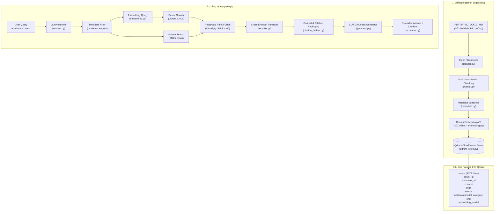

# EV Care — Advanced RAG Engine (Qdrant Cloud & Hybrid Serving)

Tài liệu kiến trúc, sơ đồ kỹ thuật và hướng dẫn vận hành toàn diện cho hệ thống **Retrieval-Augmented Generation (RAG)** chuyên biệt về dịch vụ hậu mãi, bảo hành và bảo dưỡng xe điện VinFast.

---

## 1. Sơ đồ Kiến trúc Toàn diện (System Architecture)

Hệ thống được tổ chức thành 2 luồng độc lập, đối xứng và tối ưu hóa cao:
1. **Luồng Ingestion (Ngoại tuyến - Offline)**: Đọc, làm sạch, cắt đoạn, trích xuất metadata và số hóa tài liệu lên Qdrant Cloud.
2. **Luồng Query (Trực tuyến - Online)**: Tiếp nhận câu hỏi người dùng, làm rõ ngữ cảnh, lọc metadata chống nhiễm chéo xe, truy vấn Hybrid (Dense + Sparse), Rerank và sinh câu trả lời có trích dẫn nguồn.

### 1.1. Sơ đồ khối tổng thể (ASCII Diagram)

```
                    INGESTION (Offline Pipeline)
                          [ingestion/]
                               │
                       PDF / HTML / DOCX / MD
                               │
                               ▼
                        Clean / Normalize               → cleaner.py
                               │
                               ▼
                            Chunking                    → chunker.py
                               │
                               ▼
                      Metadata Extraction               → metadata.py
                               │
                               ▼
                         Embedding API                  → embedding.py
                   (Google Gemini 3072 dims)
                               │
                               ▼
                          Qdrant Cloud                  → qdrant_store.py
               ┌───────────────────────────────┐
               │ vector: [float x 3072]        │
               │ chunk_id: str                 │
               │ document_id: str              │
               │ content: str                  │
               │ page: int | None              │
               │ source: str                   │
               │ metadata: dict                │
               │   ├── model (VF3..VF9, ALL)   │
               │   ├── category (maint/warr..) │
               │   └── milestone_km (int)      │
               │ embedding_model: str          │
               └───────────────────────────────┘


                      QUERY (Online Pipeline)
                             [query/]
                               │
                           User Query
                               │
                               ▼
                         Query Rewrite                  → rewriter.py
                 (Khử đại từ, trích ODO/Model, BM25 keywords)
                               │
                               ▼
                        Metadata Filter                 → hybrid.py
                 (model == Target_Model OR "ALL")
                               │
                               ▼
                         Embedding API                  → embedding.py
                               │
                               ▼
                          Qdrant Cloud                  → qdrant_store.py
                               │
                               ▼
                          Top-K Chunks                  → hybrid.py (RRF Fusion)
                     (Dense Vector + BM25 Sparse)
                               │
                               ▼
                            Reranker                    → reranker.py
                      (Cross-Encoder / FlashRank)
                               │
                               ▼
                       Context + Citation               → citation_builder.py
                     ([Tài liệu 1]... + Thẻ nguồn)
                               │
                               ▼
                              LLM                       → generator.py
                     (Gemini Grounded Generator)
                               │
                               ▼
                             Answer                     → schemas.py (GroundedResponse)
```

---

### 1.2. Sơ đồ tương tác luồng dữ liệu (Mermaid Flowchart)



---

## 2. Cấu trúc Thư mục RAG (Folder Structure)

Toàn bộ mã nguồn RAG được phân chia tường minh thành hai package con `ingestion/` và `query/` theo đúng sơ đồ kiến trúc:

```text
backend/src/agents/tools/RAG/
├── __init__.py                # Facade API xuất toàn bộ Ingestion & Query components
├── README.md                  # Tài liệu kiến trúc & hướng dẫn vận hành này
│
├── ingestion/                 # LUỒNG INGESTION: Xử lý dữ liệu & nạp Vector Store
│   ├── __init__.py            # Export: TextCleaner, DocumentChunker, QdrantVectorStore...
│   ├── cleaner.py             # Làm sạch Unicode dựng sẵn, bỏ mã rác HTML, bảng Markdown
│   ├── chunker.py             # Section-based chunking theo Markdown header & bảo toàn bảng
│   ├── metadata.py            # Trích xuất model xe (VF3..VF9), danh mục, mốc km bảo dưỡng
│   ├── config.py              # Tham số: chunk_size=512, chunk_overlap=64, collection_name
│   ├── embedding.py           # Provider Gemini Embedding (3072 dims) & Local fallback
│   ├── qdrant_store.py        # Lưu trữ Vector & Payload trên Qdrant Cloud / Local
│   └── pipeline.py            # Đọc tài liệu đa định dạng (PDF/HTML/DOCX) & Orchestrator
│
└── query/                     # LUỒNG QUERY: Tiếp nhận, lọc, truy vấn & sinh câu trả lời
    ├── __init__.py            # Export: RAGPipeline, HybridRetriever, QueryRewriter...
    ├── schemas.py             # Pydantic models: RetrievalCandidate, CitationItem, GroundedResponse
    ├── rewriter.py            # Khử đại từ "xe tôi", bóc tách model/km, tạo từ khóa BM25
    ├── bm25_searcher.py       # Sparse Keyword Search (BM25Okapi) có lọc metadata
    ├── hybrid.py              # Kết hợp Dense Qdrant + Sparse BM25 với thuật toán RRF (k=60)
    ├── reranker.py            # Đánh giá lại Top-K bằng Cross-Encoder / FlashRank
    ├── citation_builder.py    # Đóng gói ngữ cảnh [Tài liệu X] và xây dựng danh sách trích dẫn
    ├── generator.py           # Sinh câu trả lời nghiêm ngặt bằng Gemini với System Prompt chống ảo giác
    ├── rag_pipeline.py        # Lớp điều phối cấp cao kết nối toàn bộ 7 bước truy vấn
    └── rag_tool.py            # Đóng gói LangChain @tool cung cấp cho StateGraph Agent
```

---

## 3. Cấu trúc Payload & Vector trong Qdrant Cloud

Mỗi vector point lưu trữ trong Qdrant Cloud tuân thủ đúng 100% schema đã thỏa thuận:

| Trường | Kiểu dữ liệu | Index Type | Mô tả |
|---|---|---|---|
| `vector` | `list[float]` (3072 dims) | HNSW Cosine | Vector ngữ nghĩa sinh bởi `models/gemini-embedding-001` |
| `chunk_id` | `str` | Keyword | Định danh duy nhất của chunk (e.g. `warranty_maintenance_VF8#chunk_024`) |
| `document_id` | `str` | Keyword | Mã tài liệu gốc (e.g. `warranty_maintenance_VF8`) |
| `content` | `str` | Full-text | Nội dung văn bản tiếng Việt của đoạn trích |
| `page` | `int \| None` | Integer | Số trang tài liệu PDF gốc |
| `source` | `str` | Keyword | Đường dẫn file hoặc URL nguồn chính hãng |
| `metadata` | `dict` | - | Từ điển metadata chi tiết: `model`, `category`, `milestone_km` |
| `embedding_model` | `str` | Keyword | Tên mô hình vector (`models/gemini-embedding-001`) |

> [!NOTE]
> Hiện trạng trên cụm **Qdrant Cloud** chính thức:
> - **Collection**: `ev_care_knowledge_base`
> - **Số lượng Vector hiện hữu**: **810 chunks** từ 27 tài liệu trong `data/knowledge/raw/` (cập nhật 03/10/2026)
> - **Phạm vi**: sổ bảo hành & bảo dưỡng VF3, VF5, VF6, VF7, VF8, VFe34, MPV7; chính sách bảo hành, lịch bảo dưỡng, FAQ chung (ALL); sạc pin theo dòng xe, sạc tại nhà, cứu hộ pin, quy định sử dụng pin (`battery`); bảng giá dịch vụ, phụ kiện VF5/VF8, thiết bị sạc, trạm sạc (`pricing`); quy trình trên ứng dụng (`procedure`).

---

## 4. Quy chuẩn Hợp đồng Dữ liệu Đầu ra (Output JSON Contract)

Kết quả trả về qua `GroundedResponse` (`schemas.py`) được thiết kế đồng bộ với Frontend:

```json
{
  "answer": "Theo cẩm nang bảo dưỡng chính hãng VinFast VF8, ở mốc 24.000 km hoặc 12 tháng, xe cần thực hiện bảo dưỡng Cấp 2 với các hạng mục chính...",
  "citations": [
    {
      "document_id": "warranty_maintenance_VF8",
      "title": "Cẩm nang bảo dưỡng định kỳ VinFast VF8",
      "section": "Hạng mục kiểm tra và bảo dưỡng mốc 24.000 km (Cấp 2)",
      "source_url": "data/knowledge/raw/warranty_maintenance_VF8.pdf",
      "page": 18,
      "chunk_id": "warranty_maintenance_VF8#chunk_024",
      "score": 0.94
    }
  ],
  "confidence": "high",
  "fallback_required": false
}
```

---

## 5. Các Nguyên tắc Phòng vệ Hallucination

1. **Zero Cross-Model Hallucination (Chống nhiễm chéo dòng xe)**:
   - Metadata Filter tại `hybrid.py` áp dụng quy tắc lọc nghiêm ngặt: chỉ cho phép chunk có `model in [target_model, "ALL"]`.
   - Ngăn chặn hoàn toàn việc mang quy chuẩn xe máy điện (Feliz, Klara) hoặc xe ô tô khác áp vào xe đang hỏi.
2. **Hybrid Search (Dense + Sparse with RRF)**:
   - Dense Vector nắm bắt ngữ cảnh, câu hỏi tự nhiên mượt mà.
   - BM25 bắt chính xác thuật ngữ kỹ thuật, mã phụ tùng, mốc số km.
   - Kết hợp bảng xếp hạng bằng công thức: $RRF(d) = \sum_{m \in \{dense, sparse\}} \frac{1}{60 + rank_m(d)}$.
3. **Cross-Encoder Reranker**:
   - Sắp xếp lại danh sách Top Chunks để đưa thông tin liên quan nhất lên đầu ngữ cảnh LLM.
4. **Trích dẫn minh bạch (Strict Citations)**:
   - LLM bắt buộc phải gắn nguồn `[Tài liệu X]` cho từng khẳng định về thông số kỹ thuật hoặc chính sách giá.

---

## 6. Hướng dẫn Vận hành & Kiểm thử

### 6.1. Cấu hình biến môi trường (`.env`)

```env
# Google Gemini API
GOOGLE_API_KEY=AIzaSy...

# Qdrant Cloud
QDRANT_URL=https://xxxxxxxx-xxxx-xxxx-xxxx-xxxxxxxxxxxx.australia-southeast1-0.gcp.cloud.qdrant.io
QDRANT_API_KEY=thq...your_qdrant_api_key_here...
QDRANT_COLLECTION_NAME=ev_care_knowledge_base
```

### 6.2. Nạp thêm tài liệu mới (Ingestion)

Đặt tài liệu mới (PDF/HTML/MD/TXT) vào `data/knowledge/raw/` (thư mục `data/` ở gốc repo, ngang cấp `backend/`, không commit). Tên file theo dạng `<chủ_đề>_<MODEL|ALL>` để metadata model/category được suy ra đúng, ví dụ `battery_sac_VF5.md`, `pricing_tram_sac_ALL.md`. Sau đó chạy từ gốc repo:

```powershell
python backend/scripts/ingest_knowledge.py --dry-run   # xem tài liệu nào mới/thay đổi, không ghi
python backend/scripts/ingest_knowledge.py             # embed và upsert phần mới/thay đổi
```

Script so nội dung từng chunk với Qdrant: chunk không đổi được giữ nguyên (không tốn lượt gọi Embedding API), chunk mới hoặc sửa nội dung được embed lại, chunk thừa sau khi re-chunk bị xóa. `--prune` xóa thêm tài liệu không còn trong `raw/`, `--force` embed lại toàn bộ. Báo cáo ghi vào `data/knowledge/processed/last_pipeline_run.json`. Khởi động lại backend để BM25 nạp lại corpus từ Qdrant.

`backend/scripts/migrate_to_qdrant.py` chỉ dùng cho lần chuyển dữ liệu cũ từ ChromaDB (`data/chroma`) sang Qdrant.

### 6.3. Chạy kiểm thử tự động

```powershell
# 1. Kiểm tra 6 bước Retrieval Pipeline (Rewriter -> BM25 -> Hybrid -> Rerank -> Citation -> Generator)
python backend/tests/test_agents/test_rag_retrieval_flow.py

# 2. Kiểm thử End-to-End truy vấn Qdrant Cloud thực tế
python backend/tests/test_agents/test_qdrant_rag.py

# 3. Chạy toàn bộ test suite bằng pytest
pytest backend/tests/test_agents
```
