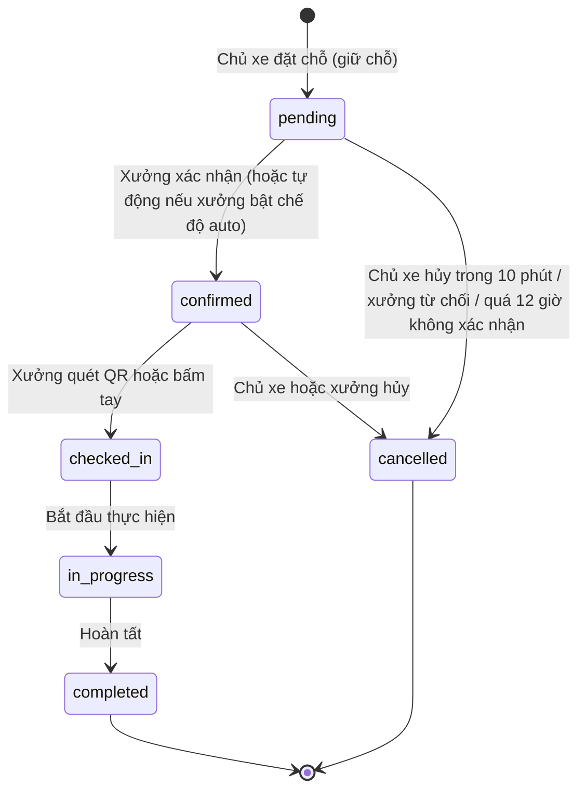
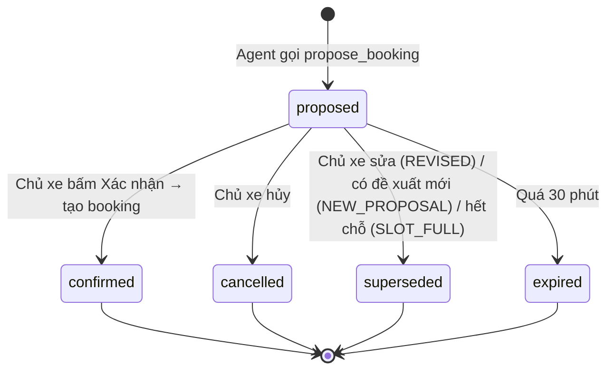
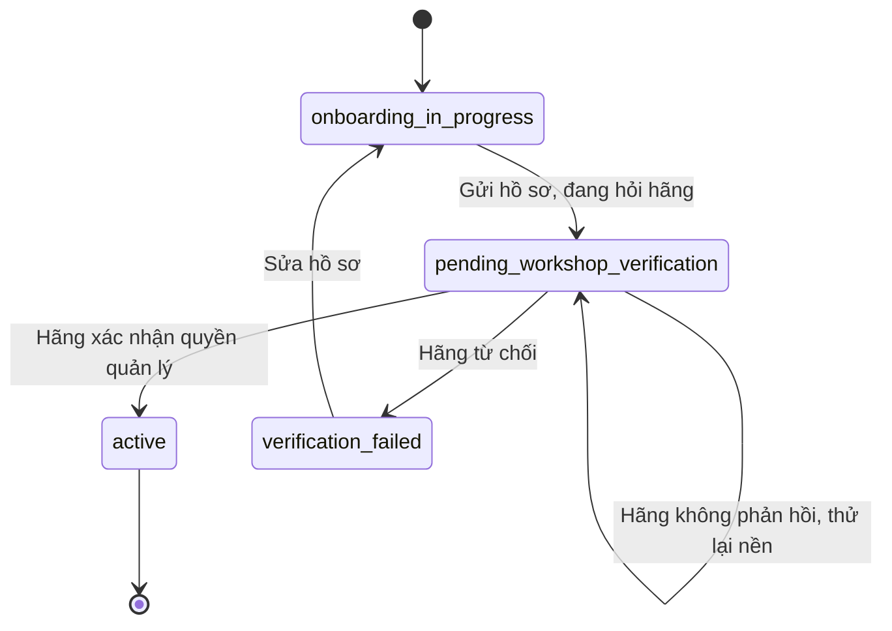
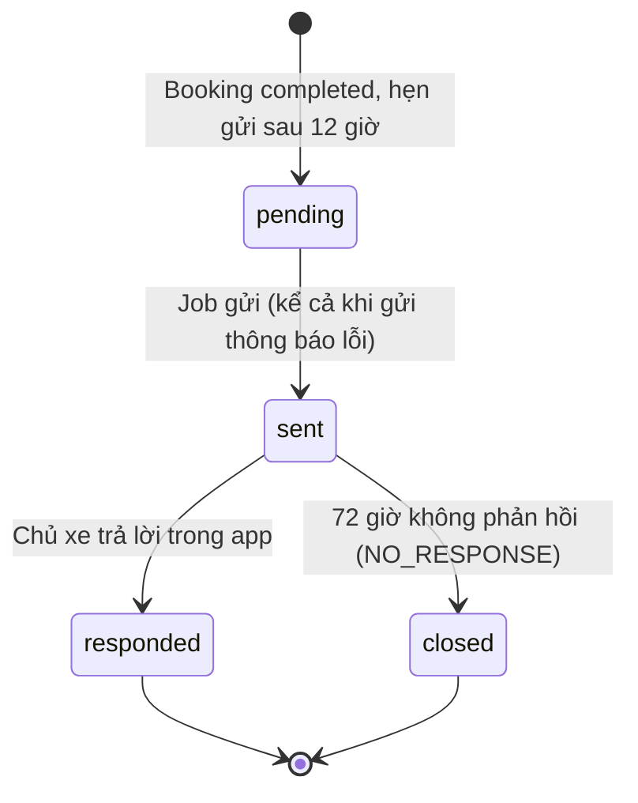

# EV Care — Kiến trúc chi tiết: bảo mật, chất lượng, vòng đời, độ tin cậy và lộ trình

> Cập nhật: 2026-10-04. Tài liệu bổ sung cho [architecture.md](architecture.md) (bức tranh tổng thể). Viết cho người **chưa biết dự án**: kỹ sư mới, người đánh giá kỹ thuật, đối tác tích hợp, người duyệt bảo mật.
> Mọi nội dung đối chiếu với code ở `backend/src`, `frontend/src` và `docs/specs`. Chỗ nào chưa kiểm chứng được thì ghi rõ "chưa kiểm chứng".

## Mục lục

1. [Hệ thống này là gì (tóm tắt 1 phút)](#0-hệ-thống-này-là-gì-tóm-tắt-1-phút)
2. [Bảo mật và phân quyền](#1-bảo-mật-và-phân-quyền)
3. [Yêu cầu phi chức năng](#2-yêu-cầu-phi-chức-năng)
4. [Vòng đời trạng thái](#3-vòng-đời-trạng-thái)
5. [Độ tin cậy và xử lý lỗi](#4-độ-tin-cậy-và-xử-lý-lỗi)
6. [Khoảng trống và hướng phát triển](#5-khoảng-trống-và-hướng-phát-triển)
7. [Thuật ngữ và tài liệu liên quan](#6-thuật-ngữ-và-tài-liệu-liên-quan)

---

## 0. Hệ thống này là gì (tóm tắt 1 phút)

**EV Care** là nền tảng chăm sóc xe điện sau bán hàng, phục vụ hai nhóm người dùng:

- **Chủ xe**: liên kết xe với hãng, xem khi nào đến hạn bảo dưỡng, xem chi phí ước tính, đặt lịch tại xưởng, nhận nhắc lịch, hỏi trợ lý AI.
- **Chủ xưởng**: nhận và điều phối lịch hẹn trên một bảng điều phối (Workshop Board), check-in xe bằng mã QR, cập nhật tiến độ sửa chữa.

Thành phần chính: giao diện web (React), máy chủ API (FastAPI, Python), bộ xử lý nền (Celery), cơ sở dữ liệu PostgreSQL, Redis, một trợ lý AI (LangGraph + mô hình ngôn ngữ lớn, gọi tắt **LLM**), và một hệ thống bên ngoài của hãng xe (**OEM**; khi phát triển dùng bản giả lập `mock-ev-system`). Đăng nhập dùng Firebase Authentication.

Nguyên tắc thiết kế xuyên suốt, giúp đọc hiểu các phần sau:

1. **Số liệu do code tất định tính, AI chỉ diễn giải.** Hạn bảo dưỡng, giá, sức chứa xưởng, việc tạo lịch đều do dịch vụ backend xử lý; LLM chỉ gọi công cụ (tool) và giải thích kết quả.
2. **Không có hành động có hậu quả nếu người dùng chưa bấm xác nhận.** Trợ lý AI chỉ *đề xuất* lịch hẹn; lịch chỉ được tạo khi chủ xe bấm nút trên giao diện.
3. **Odometer (ODO, số km) chỉ lấy từ hãng**, không cho nhập tay.
4. **PostgreSQL là nguồn dữ liệu chuẩn**; Redis chỉ hỗ trợ (khóa, bộ nhớ đệm, giới hạn tần suất, phát tin thời gian thực).

---

## 1. Bảo mật và phân quyền

### 1.1 Ai gọi hệ thống, và xác thực bằng gì

| Tác nhân | Vào bằng | Cách xác thực | Phạm vi được phép |
| --- | --- | --- | --- |
| Chủ xe | Giao diện web, API `/api/v1/*` | Firebase ID token (header `Authorization: Bearer`), backend xác minh chữ ký + hạn token, đối chiếu `firebase_uid` với bảng `VehicleUser`; tài khoản phải ở trạng thái `ACTIVE` | Chỉ dữ liệu của chính mình (xe, lịch hẹn, hội thoại, thông báo) |
| Chủ xưởng | Cổng `/technician`, API `/api/v1/workshop-owner/*` | Firebase ID token **kèm kiểm tra thu hồi phiên** (`check_revoked`); phải là chủ xưởng `ACTIVE` đã qua xác minh với hãng | Chỉ xưởng của mình; thao tác ghi yêu cầu xưởng đang hoạt động |
| Hệ thống hãng (OEM) | `POST /integrations/oem/webhooks` | **Chữ ký HMAC** trên nội dung thô + dấu thời gian trong cửa sổ cho phép (mặc định 300 giây) để chống phát lại; không dùng Firebase | Chỉ đẩy sự kiện ODO / lịch sử dịch vụ |
| Tác vụ nền (Celery) | Không có cổng HTTP | Chạy nội bộ cùng mã nguồn, cùng DB | Đồng bộ OEM, nhắc lịch, dọn dữ liệu |
| Trợ lý AI | Gọi từ `ChatService` trong tiến trình backend | Danh tính (`user_id`, `user_vehicle_id`) lấy từ phiên chat qua `RunnableConfig`, **không** do LLM sinh ra | Chỉ công cụ đã đăng ký; mỗi công cụ gọi đúng dịch vụ mà API HTTP dùng |
| Công cụ cục bộ (Swagger, script) | Header `X-User-Id` | Không xác thực; **bị chặn khi `APP_ENV=production`** | Chỉ dùng phát triển |

Kiểm thử thủ công dùng **Firebase Auth Emulator**, không có cơ chế bỏ qua đăng nhập.

### 1.2 Nguyên tắc phân quyền

- **Theo chủ sở hữu dữ liệu:** chủ xe chỉ thấy xe/lịch/hội thoại của mình; chủ xưởng chỉ thấy lịch và cấu hình của xưởng mình (`get_owner_workshop` luôn lọc theo `owner_id`).
- **Chủ xưởng xem hội thoại của khách có giới hạn:** chỉ "trích đoạn hội thoại" gắn với một lịch hẹn của xưởng (`/workshop/bookings/{id}/conversation-excerpt`, tối đa 20 tin), không đọc toàn bộ hội thoại.
- **Cổng xác nhận cho hành động có hậu quả:** tạo lịch từ chat chỉ xảy ra qua `POST .../booking-proposals/{id}/confirm`; thẻ đề xuất có token ngắn hạn (mặc định 600 giây) do backend kiểm chứng. Gõ chữ "xác nhận" trong chat không có tác dụng.
- **Giới hạn số lần xác minh sai** (xe và xưởng: tối đa 5 lần) để chống dò thông tin.
- **Một lịch hẹn mở cho mỗi xe** (BR-013) và khóa phân tán để chống thao tác trùng.

### 1.3 Bảo vệ dữ liệu và quyền riêng tư

| Chủ đề | Biện pháp |
| --- | --- |
| Bí mật cấu hình | Khóa API, secret webhook, thông tin DB đọc từ biến môi trường / `.env` qua Pydantic Settings; không ghi vào mã nguồn |
| Nhật ký | Log có cấu trúc (JSON), **che dữ liệu cá nhân** (`LOG_REDACT_PII`), không ghi nội dung request/response; mỗi request có `X-Request-ID` làm mã truy vết |
| Kiểm toán (audit) | Mỗi request HTTP ghi một bản ghi audit (phương thức, đường dẫn, mã trạng thái, thời gian, `user_id`); sự kiện đăng nhập/đăng xuất của chủ xưởng lưu **60 ngày** |
| Nội dung gửi cho LLM | Không đưa số CCCD/VIN vào prompt khi không cần; lịch sử chat mặc định lưu **180 ngày** kể từ tin cuối (PQ-09) |
| Nội dung nhắc | Thông báo nhắc dùng mẫu cố định, không chứa dữ liệu nhạy cảm |
| Đăng xuất | Thu hồi phiên Firebase qua tác vụ nền (`auth.revoke_session`); chủ xưởng kiểm tra thu hồi ở mỗi request |
| CORS | Chỉ cho phép một origin (`FRONTEND_URL`); giá trị `*` chỉ dùng khi phát triển |
| Chống lạm dụng chat | Tin nhắn ≤ 2000 ký tự; 10 tin/phút và 200 tin/ngày/người dùng; mỗi hội thoại chỉ chạy 1 lượt trả lời tại một thời điểm |

### 1.4 Lỗ hổng đã biết (chưa đủ để lên production)

| Lỗ hổng | Rủi ro | Hướng xử lý |
| --- | --- | --- |
| WebSocket hội thoại nhận `userId` trong khung `auth` đầu tiên, **không kiểm tra Firebase token** | Kẻ biết/đoán `userId` có thể nghe tin nhắn của người khác | Xác minh ID token trong khung `auth` và kiểm quyền sở hữu hội thoại (Q-621) |
| Client còn được gửi tin với `role` tùy ý ở một số đường | Giả mạo tin nhắn "trợ lý" | Chỉ cho client gửi tin vai trò `USER` qua use case chat (Q-620) |
| Chủ xe không bị kiểm tra thu hồi phiên ở mọi request (chỉ chủ xưởng có) | Phiên bị thu hồi vẫn dùng được tới khi token hết hạn | Cân nhắc `check_revoked` cho API nhạy cảm của chủ xe |
| Chưa có quét phụ thuộc/SAST trong CI | Lỗ hổng thư viện | Thêm bước quét vào GitHub Actions |

---

## 2. Yêu cầu phi chức năng

Chỉ tiêu lấy từ PRD §8. Cột "Cơ chế" cho biết hệ thống đáp ứng bằng cách nào; cột "Kiểm chứng" cho biết đã có phép đo hay chưa.

| Nhóm | Chỉ tiêu | Cơ chế trong hệ thống | Kiểm chứng |
| --- | --- | --- | --- |
| Hiệu năng chat | Token đầu ≤ 1,5 s (p50); trả lời đầy đủ ≤ 8 s (p90) | Phát luồng SSE từng token; thời gian chạy một lượt tối đa 30 s (`chat_run_timeout_seconds`) | Chưa có phép đo tự động |
| Hiệu năng API | API nghiệp vụ ≤ 500 ms (p90); tải 50 tin gần nhất ≤ 300 ms (p90) | Phân trang, Redis cache (TTL mặc định 300 s), index DB | Chưa có phép đo tự động |
| Tính đúng khi đặt lịch | Kiểm tra sức chứa và tạo lịch phải nguyên tử, không vượt sức chứa | Ba lớp: khóa Redis theo xe → khóa Redis theo xưởng + khung giờ → **trigger DB** `booking_capacity_guard` kiểm tra lại công thức sức chứa (lớp chốt chặn cuối) | Có test dịch vụ đặt lịch; chưa thấy test đồng thời 20 yêu cầu (AC-F6-01) |
| Bảo mật | Mọi API xác minh Firebase ID token; phân quyền theo chủ dữ liệu | Mục 1 | Có test auth; xem lỗ hổng 1.4 |
| Riêng tư | Chỉ lưu dữ liệu cần thiết; xóa chat theo yêu cầu | Xóa hội thoại (`DELETE /conversations/{id}`), job dọn dữ liệu, `chat_retention_days=180` | Chưa kiểm chứng job xóa theo hạn lưu chat |
| Quan sát | Có mã truy vết cho mỗi phiên chat và tool call; lưu nguồn trích dẫn | `X-Request-ID`/`traceId`, `agent_run_id` và `trace_id` lưu trên tin trợ lý, trích dẫn lưu cùng tin | Một phần: chưa log từng tool call có cấu trúc, chưa có metric/tracing |
| Chi phí | Ưu tiên free tier; giới hạn tần suất chat; cảnh báo chi tiêu LLM | Rate limit sliding window trên Redis | Chưa có cảnh báo chi tiêu |
| Khả dụng | Pilot trên staging, không cam kết SLA | Healthcheck `/health`, `/api/v1/health/dependencies` | — |
| Ngôn ngữ | Tiếng Việt; km, VNĐ; múi giờ `Asia/Ho_Chi_Minh`, lưu UTC | Cấu hình múi giờ cho lịch Celery (nhắc 08:00 giờ Việt Nam) | Chưa có test múi giờ |

Các tham số điều chỉnh được qua cấu hình (giá trị mặc định):

| Tham số | Mặc định | Ý nghĩa |
| --- | --- | --- |
| `slot_minutes` | 60 | Độ dài một khung giờ đặt lịch |
| `hold_minutes` | 10 | Thời gian chủ xe được hủy lịch vừa giữ chỗ |
| `booking_ws_confirm_deadline_hours` | 12 | Hạn xưởng (chế độ thủ công) phải xác nhận |
| `booking_lock_ttl_seconds` | 10 | Thời gian sống của khóa đặt lịch |
| `quick_booking_proposal_ttl_minutes` | 30 | Đề xuất lịch từ chat hết hạn sau |
| `reschedule_max_count` / `reschedule_min_lead_minutes` | 2 / 60 | Số lần đổi lịch tối đa / báo trước tối thiểu |
| `booking_reminder_lead_hours` | 24 | Nhắc lịch hẹn trước giờ hẹn |
| `follow_up_delay_hours` / `follow_up_response_window_hours` | 12 / 72 | Gửi hỏi thăm sau khi hoàn tất / hạn trả lời |
| `oem_api_timeout_seconds` / `oem_sync_interval_seconds` | 8 / 7200 | Hết hạn gọi hãng / chu kỳ đồng bộ |
| `chat_rate_limit_per_minute` / `_per_day` | 10 / 200 | Giới hạn tin nhắn chat |

---

## 3. Vòng đời trạng thái

Các thực thể có trạng thái đều chuyển qua một máy trạng thái rõ ràng; chuyển không hợp lệ bị từ chối (mã lỗi `INVALID_STATUS_TRANSITION`, HTTP 409).

### 3.1 Lịch hẹn (`booking`)



- Chỉ các chuyển trạng thái trong sơ đồ được phép (định nghĩa trong `modules/booking/state_machine.py`); mỗi lần chuyển ghi một bản ghi `BookingStatusEvent` (ai, từ đâu, lúc nào) **trong cùng giao dịch**.
- **Đổi lịch** không đổi trạng thái; lịch sử đổi lưu ở `BookingReschedule`. Tối đa 2 lần, báo trước ít nhất 60 phút.
- Khi `in_progress`, xưởng ghi tiến độ chi tiết qua `ServiceProgress` (mục 3.4); chủ xe xem được.
- Khi `completed`, hệ thống lên lịch một lượt hỏi thăm (3.5).

### 3.2 Đề xuất đặt lịch từ trợ lý AI (`BookingProposal`)



Đề xuất **không** giữ chỗ và không tạo booking. Xác nhận, sửa, hủy cùng một đề xuất được tuần tự hóa bằng khóa Redis; ai giữ khóa trước thì quyết định.

### 3.3 Đăng ký xưởng (`WorkshopOwner.onboarding_status`)



Khi hãng không phản hồi (hết hạn 8 giây hoặc lỗi 5xx), hệ thống coi là "đang chờ" và thử lại nền sau 60 → 120 → 300 → 600 → 720 giây (tổng khoảng 30 phút). Hồ sơ dở dang quá hạn (mặc định 15 ngày) bị dọn hằng ngày. Chuyển `verification_failed → onboarding_in_progress` là suy ra từ nghiệp vụ "sửa hồ sơ", chưa kiểm chứng trong code.

### 3.4 Tiến độ dịch vụ (`ServiceProgress`)

Sáu mốc hiển thị cho chủ xe: `checked_in` → `inspecting` → `servicing` → (`waiting_parts`, khi chờ phụ tùng) → `quality_check` → `ready_for_pickup`. Thứ tự và điều kiện chuyển chính xác nằm trong spec us-057; code ở `modules/service_progress`.

### 3.5 Hỏi thăm sau dịch vụ (`FollowUp`)



Mỗi booking tối đa một hỏi thăm. Phản hồi "có vấn đề" chỉ được phân loại và ghi cờ `has_issue`; app hiện lời khuyên an toàn và số hotline xưởng (không có phiếu hỗ trợ).

### 3.6 Nhắc nhở

| Đối tượng | Trạng thái |
| --- | --- |
| Nhắc mốc bảo dưỡng (`Reminder.level`) | `early` → `warning` → `urgent` → `expired` (mức độ tăng dần theo độ gần hạn) |
| Nhắc lịch hẹn 24h (`BookingReminder.status`) | `scheduled` → `sent` / `failed` / `skipped` |
| Gửi qua kênh (`*Delivery`) | Ghi từng lần gửi; lỗi tạm thời (`TIMEOUT`, `RATE_LIMITED`, `UNAVAILABLE`) được thử lại tối đa 3 lần |

---

## 4. Độ tin cậy và xử lý lỗi

### 4.1 Quy ước lỗi chung

Mọi lỗi trả về cùng một dạng:

```json
{ "error": { "code": "SLOT_FULL", "message": "...", "details": {}, "traceId": "..." } }
```

`traceId` trùng với header `X-Request-ID` và xuất hiện trong log, giúp truy vết một yêu cầu xuyên qua API → dịch vụ → agent. Mỗi module có lỗi riêng (`errors.py`) và bảng ánh xạ sang mã HTTP.

### 4.2 Hành vi khi một phụ thuộc gặp sự cố

| Phụ thuộc | Sự cố | Hệ thống làm gì | Người dùng thấy |
| --- | --- | --- | --- |
| **LLM / agent** | Lỗi hoặc quá 30 giây | Gửi sự kiện SSE `error` (`AGENT_ERROR`, kèm `traceId`), **không** lưu câu trả lời dở | "Trợ lý tạm thời không trả lời được"; gửi lại được |
| **Client chat** | Ngắt kết nối giữa luồng | Bỏ lượt trả lời đang chạy | Gửi lại cùng `clientMessageId` thì phát lại câu trả lời đã có, không gọi LLM lần nữa |
| **Redis** (khóa đặt lịch) | Không lấy được khóa trong 2 giây | Báo `SLOT_FULL` (kèm gợi ý khung giờ khác) hoặc `OPEN_BOOKING_EXISTS` | Đặt lại hoặc chọn giờ khác |
| **Redis** (đề xuất từ chat) | Redis lỗi kết nối | Trả `SERVICE_UNAVAILABLE`, không tạo booking | "Thử lại sau" |
| **Redis** (đặt lịch qua API thường) | Redis lỗi kết nối | Chưa có xử lý riêng; lỗi chưa bắt sẽ ra HTTP 500 và **không tạo lịch** (chưa kiểm chứng bằng test) | Lỗi chung |
| **Redis** (pub/sub) | Mất kết nối | Bộ lắng nghe tự kết nối lại với backoff tăng dần; tin hỏng bị bỏ và ghi log | Thiết bị khác có thể chậm nhận tin, đồng bộ lại qua REST (dữ liệu vẫn nằm ở PostgreSQL) |
| **PostgreSQL** | Hai yêu cầu vượt sức chứa | Trigger `booking_capacity_guard` từ chối, dịch thành `SLOT_FULL` | Gợi ý khung giờ khác |
| **OEM** | Quá 8 giây / lỗi mạng / 5xx | Quy về `OemTimeoutError`: xác minh xe/xưởng ở trạng thái "đang chờ", thử lại nền; đồng bộ ODO thử lại 30 → 120 → 600 giây | "Đang xác minh" thay vì lỗi cứng |
| **OEM** (webhook) | Sai chữ ký / dấu thời gian lệch | Từ chối, không xử lý | — (phía hãng thấy lỗi) |
| **Đồng bộ OEM** | Lỗi liên tiếp ≥ 3 lần | Cảnh báo; ODO quá 30 ngày được đánh dấu cũ | Hiển thị dữ liệu cũ kèm nhãn |
| **Firebase** | Không gọi được khi kiểm tra thu hồi phiên | Trả lỗi `AuthProviderUnavailable` (có thể thử lại), khác với token sai (`INVALID_TOKEN`) | Yêu cầu thử lại, không bị đăng xuất oan |
| **Kênh thông báo** | Lỗi tạm thời | Thử lại ở lần chạy sau, tối đa 3 lần, giãn cách tăng dần | Vẫn thấy nhắc trong app |
| **Qdrant** (RAG) | Không có/không truy cập được | Công cụ tra cứu báo không có nguồn; theo nguyên tắc "không có nguồn thì không khẳng định" | Trợ lý nói chưa có dữ liệu chính hãng và gợi ý liên hệ xưởng |

### 4.3 Tính nhất quán và chống trùng

- **Idempotency khi chat:** tin nhắn người dùng có `clientMessageId`; gửi lại không tạo bản ghi mới.
- **Một nơi ghi tin nhắn:** `MessageService` thực hiện theo thứ tự cố định *lưu DB → phát Redis → (tùy chọn) xếp hàng embedding*; Redis hoặc embedding lỗi không làm mất tin.
- **Giao dịch + sự kiện:** mỗi lần đổi trạng thái lịch hẹn ghi `BookingStatusEvent` cùng giao dịch, nên lịch sử không lệch trạng thái hiện tại.
- **Khóa theo thứ tự cố định** (khóa xe, rồi khóa khung giờ; khi đổi lịch thì khóa hai khung theo thứ tự ổn định) để tránh deadlock.
- **Tác vụ nền bền vững:** các task chính dùng `acks_late` (chỉ xác nhận sau khi chạy xong) và giới hạn số lần thử lại; job "reconcile" định kỳ 5 phút đưa lại vào hàng các xác minh xưởng bị mất lần thử lại.

### 4.4 Điểm cần kiểm chứng thêm

- Hai bộ lập lịch Celery beat chạy cùng lúc (khi nhân bản instance) có gửi nhắc trùng không; hiện nên chạy **một** beat duy nhất.
- Hành vi của đặt lịch qua API thường khi Redis hoàn toàn không kết nối (xem bảng 4.2).
- Có nên chuyển khóa Redis sang "đóng cửa an toàn" (từ chối đặt lịch) hay "mở cửa" (dựa riêng vào trigger DB) khi Redis lỗi — hiện trigger DB đảm bảo không vượt sức chứa nên đây là bài toán trải nghiệm hơn là tính đúng.

---

## 5. Khoảng trống và hướng phát triển

Mức ưu tiên: **P0** = chặn production; **P1** = nên xong trước demo/pilot; **P2** = dọn nợ kỹ thuật.

### 5.1 Khoảng trống trong MVP

| # | Khoảng trống | Hiện trạng | Cần làm | Ưu tiên | Tham chiếu |
| --- | --- | --- | --- | --- | --- |
| 1 | WebSocket hội thoại chưa xác thực token | Khung `auth` mang `userId` (`conversation/ws.py`) | Xác minh Firebase ID token, kiểm chủ sở hữu hội thoại | P0 | Q-621 |
| 2 | Fallback `X-User-Id` | Chỉ tắt khi `APP_ENV=production` | Thêm test chặn ở production; cân nhắc bỏ hẳn | P0 | Q-621 |
| 3 | Client ghi tin với `role` tùy ý | `MessageService` là nơi ghi duy nhất nhưng còn đường nhận role từ client | Chỉ cho client gửi tin `USER` qua use case chat | P0 | Q-620 |
| 4 | Graph agent lệch spec | Một graph ReAct; nhánh `hitl` còn tham chiếu `create_booking_draft` cũ; chưa có checkpoint LangGraph (`TODO(AI-001)` ở `conversation/service.py`) | Đồng bộ HITL với `propose_booking`; chốt một graph hay sub-graph và cập nhật spec AI-001 | P1 | AI-001, AI-004 |
| 5 | Hai kho vector song song | Qdrant (RAG của agent) và pgvector (embedding tin nhắn, `document_chunk`); `VECTOR_STORE` mặc định `qdrant` trong `config.py` trong khi ghi chú roadmap cũ nói `pgvector` | Chốt một kho tri thức, ghi rõ trong tài liệu và `.env.example` | P1 | ADR-01 |
| 6 | Chưa đo chất lượng AI trong CI | PRD yêu cầu bộ eval RAG ≥ 60 câu (≥ 15 câu bẫy) và eval đặt lịch; chỉ có script đánh giá RAG rời ở `tests/test_agents/test_rag/evaluation`, CI chỉ chạy `ruff` + `pytest` | Đưa eval vào GitHub Actions, đặt ngưỡng đạt/không đạt | P1 | PRD §10, Q-A07 |
| 7 | Chưa có kiểm thử giao diện trong CI | Frontend có `vitest` nhưng CI chỉ chạy `typecheck` + `build` | Thêm `npm test` vào CI | P1 | — |
| 8 | Quan sát chưa đủ sâu | Đã có log JSON, che dữ liệu cá nhân, audit từng request, `X-Request-ID`; **chưa** có tracing phân tán, metric, log từng tool call, `TODO(observability)` ở route chat | Gắn `agent_run_id` + tên tool + thời gian vào log; đếm token/chi phí LLM; thêm metric | P1 | PRD §8 |
| 9 | Tài liệu chính hãng để ingest | Phụ thuộc danh sách PQ-06 | Chốt model hỗ trợ và nguồn; thiếu thì giới hạn model | P1 | PQ-06 |
| 10 | Chưa có kênh thông báo ngoài app | `NotificationService` có adapter nhưng chưa đăng ký kênh | Viết adapter đầu tiên khi chốt kênh (Zalo/Telegram/SMS/Email) | P2 | US-021 |
| 11 | Mốc bảo dưỡng sau bảng định mức | Tăng theo bước cố định (12.000 km / 12 tháng) trong `.env`; chưa có cửa sổ "làm sớm" | PO chốt chu kỳ theo model và dung sai làm sớm | P2 | Q-301, Q-302 |
| 12 | Lệch spec giao diện ↔ API | Vài `TODO(spec)` ở frontend: lý do xác minh thất bại, trường CCCD, regex VIN, ngưỡng km trong cài đặt nhắc | Cập nhật spec cho khớp | P2 | us-001, Q-FE-NOTI-03 |
| 13 | Mã thừa sau khi gỡ tính năng | `modules/quote` chỉ còn thư mục rỗng; `examples` vẫn được đăng ký router; `agents/nodes/example_node.py`, `tools/example_tool.py` còn TODO | Xóa hoặc không đăng ký ở production | P2 | — |
| 14 | Tìm xưởng gần chỉ so khớp khu vực | Đã tách interface riêng | Nâng cấp geocoding / khoảng cách thật khi cần | P2 | us-029 Q-401 |

### 5.2 Rủi ro kỹ thuật cần theo dõi

| Rủi ro | Ảnh hưởng | Giảm thiểu hiện có / đề xuất |
| --- | --- | --- |
| LLM bịa thông tin bảo hành hoặc giá | Sai nghiệp vụ, mất tin cậy | "Không có nguồn thì không khẳng định"; giá qua công cụ tất định; thêm eval vào CI |
| Đặt trùng lịch khi nhiều người cùng đặt | Vượt sức chứa xưởng | Đã có khóa Redis + trigger DB; thêm test đồng thời |
| Redis ngừng hoạt động | Mất khóa, pub/sub, giới hạn tần suất | PostgreSQL vẫn là nguồn chuẩn; quyết định rõ hành vi khi Redis lỗi (mục 4.4) |
| Chi phí LLM tăng đột biến | Vượt free tier | Rate limit đã có; thêm cảnh báo chi tiêu |
| OEM chậm hoặc lỗi | Dữ liệu ODO cũ | Thử lại có backoff, đánh dấu dữ liệu cũ |
| Nhân bản Celery beat | Nhắc hoặc hỏi thăm gửi trùng | Chỉ chạy một beat; kiểm tra job idempotent |
| Giới hạn gói miễn phí (Qdrant, Supabase, Firebase) | Nghẽn băng thông/lưu trữ | Theo dõi hạn mức; chuẩn bị đường chuyển sang pgvector |

### 5.3 Sau MVP

Nguyên tắc: không over-engineer cho lộ trình, nhưng giữ các "điểm nối" rẻ (port/adapter, pub/sub, dependency injection). Chi tiết ở `personal/tungld-03005/tech-notes-and-roadmap.md`.

| # | Hướng phát triển | Điểm bám sẵn trong code | Lưu ý khi làm |
| --- | --- | --- | --- |
| 1 | Chuyển hạ tầng sang GCP; CI/CD build image và deploy (Cloud Run/Functions) | `.github/workflows/ci.yml`, `dockerfiles/` | Mở rộng pipeline sang deploy |
| 2 | Tách microservice từ modular monolith | Ranh giới `modules/*`, port/adapter | Tách trước các module ít phụ thuộc chéo (ví dụ `oem_integration`, `notification`) |
| 3 | Thay Celery bằng Cloud Functions + Pub/Sub + Cloud Scheduler | `infrastructure/redis/pubsub.py`, hook `index_dispatch` của `MessageService` | Cần connection pooling cho DB; lịch beat chuyển sang Cloud Scheduler; WebSocket phải chạy trên Cloud Run, không chạy được trên Functions |
| 4 | Embedding tin nhắn bất đồng bộ trong worker | Task `embedding.index_message`, cờ `message.embedded` | Provider `local` (sentence-transformers) không hợp serverless, dùng OpenAI/Gemini |
| 5 | Observability: tracing, metric, log JSON đầy đủ | `traceId`, `AuditLogMiddleware`, structlog | Xem khoảng trống #8 |
| 6 | Agent phân tán qua A2A | `src/agents` (một graph) | A2A (agent↔agent) và MCP (agent↔công cụ) là hai lớp bổ trợ |
| 7 | Kết nối OEM qua MCP thay REST | Port `OemVehicleDataGateway`, chỉ thay adapter | ODO vẫn chỉ đến từ OEM |
| 8 | Chat nhiều bên: chủ xe ↔ xưởng/kỹ thuật viên, agent như một thành viên | `conversation.user_vehicle_id` đang bắt buộc (Q-622) | Bảng thành viên, loại người gửi theo tin, agent chỉ trả lời khi được thêm/nhắc; xác thực REST + WS bắt buộc |
| 9 | Khách chưa đăng ký chat với agent về lịch bảo dưỡng, dẫn vào onboarding | RAG trên tài liệu chính hãng | Phiên khách, rate limit chặt, công cụ chỉ đọc, chính sách lưu tin |
| 10 | Redis vector search + semantic cache cho LLM | Interface `VectorStore` | Chỉnh ngưỡng giống nhau; tách cache theo người dùng/xe/model; không cache câu trả lời phụ thuộc dữ liệu sống |
| 11 | Calendar widget, ứng dụng mobile | Frontend React | — |
| 12 | Kênh thông báo ngoài app | `NotificationService` + adapter | Giữ nội dung không chứa dữ liệu nhạy cảm |

---

## 6. Thuật ngữ và tài liệu liên quan

### 6.1 Thuật ngữ

| Thuật ngữ | Nghĩa |
| --- | --- |
| **OEM** | Nhà sản xuất xe (ở đây là hệ thống của hãng). Nguồn duy nhất của ODO và lịch sử dịch vụ chính thức. |
| **ODO** | Số km đã đi của xe (odometer). |
| **Mốc bảo dưỡng** | Cột mốc km/tháng theo bảng định mức của hãng (ví dụ 12.000 km hoặc 12 tháng). |
| **Đến hạn (`due status`)** | Trạng thái tính từ ODO và ngày: sắp đến hạn (còn ≤ 500 km hoặc ≤ 14 ngày), đến hạn, quá hạn. |
| **Workshop Board** | Bảng điều phối lịch hẹn dành cho chủ xưởng. |
| **Slot** | Một khung giờ đặt lịch (mặc định 60 phút) với sức chứa theo số kỹ thuật viên. |
| **Giữ chỗ (hold)** | Lịch ở trạng thái `pending`, chủ xe còn 10 phút để hủy. |
| **LLM** | Mô hình ngôn ngữ lớn (OpenAI, Anthropic, Gemini, Grok, DeepSeek tùy cấu hình). |
| **Agent / tool** | Trợ lý AI quyết định gọi *công cụ* (hàm nghiệp vụ) nào để trả lời. |
| **RAG** | Truy hồi tài liệu rồi sinh câu trả lời kèm trích dẫn nguồn. |
| **HITL** | Có con người trong vòng lặp: người dùng phải xác nhận trước khi hệ thống thực hiện hành động. |
| **SSE** | Server-Sent Events: máy chủ đẩy từng đoạn trả lời về trình duyệt qua một request. |
| **Celery beat / worker** | Bộ lập lịch / bộ thực thi tác vụ nền. |
| **Idempotent** | Thực hiện nhiều lần cho kết quả như một lần. |
| **ADR** | Architecture Decision Record: bản ghi một quyết định kiến trúc. |

### 6.2 Mã định danh trong specs

| Tiền tố | Ý nghĩa | Ví dụ |
| --- | --- | --- |
| `US-xxx` | User story | US-061 đặt lịch nhanh từ trợ lý AI |
| `FEAT-xxx` | Tính năng trong functional spec | `FEAT-BOOK-001` đặt lịch theo sức chứa |
| `F1…F9` | Tính năng trong PRD | F6 đặt lịch, F8 Workshop Board |
| `AI-00x` | Đặc tả agent | AI-004 Booking Agent |
| `ENT-xxx` | Thực thể dữ liệu | ENT-426 `BookingStatusEvent` |
| `BR-/EDGE-/AC-` | Quy tắc nghiệp vụ / trường hợp biên / tiêu chí nghiệm thu | BR-013 một lịch mở mỗi xe |
| `Q-xxx`, `PQ-xx` | Câu hỏi mở | Q-621 xác thực WebSocket |

### 6.3 Module → tính năng → spec

| Module (`backend/src/modules`) | Tính năng | Spec chính |
| --- | --- | --- |
| `vehicle_owner_onboarding`, `auth`, `oauth` | Đăng ký, đăng nhập chủ xe | `specs/sprint-1` (us-001, us-005) |
| `workshop_owner_onboarding`, `workshop_owner_auth` | Đăng ký, đăng nhập chủ xưởng | `specs/sprint-1` (us-009, us-013) |
| `user_vehicle`, `oem_integration` | Hồ sơ xe, đồng bộ OEM | `specs/sprint-2` (us-017) |
| `notification` | Cài đặt và nhắc bảo dưỡng | `specs/sprint-2` (us-021) |
| `conversation` | Chat với trợ lý | `specs/sprint-2` (us-025), `specs/platform` |
| `cost_estimate` | Dự toán chi phí | `specs/sprint-2` (us-045) |
| `booking` | Đặt lịch, vé QR, đổi/hủy | `specs/sprint-3` (us-029, us-053) |
| `workshop_board` | Workshop Board | `specs/sprint-3` (us-037) |
| `follow_up` | Hỏi thăm sau dịch vụ | `specs/sprint-4` (us-041) |
| `service_progress` | Tiến độ dịch vụ 6 bước | `specs/sprint-4` (us-057) |
| `quick_booking`, `agents/*` | Đặt lịch nhanh từ AI, agent | `specs/sprint-4` (us-061), `specs/ai-agent` |

Đã loại khỏi phạm vi từ 02/10/2026: báo giá có duyệt (us-049, AI-005), phiếu hỗ trợ, kết nối Discord.

### 6.4 Tài liệu liên quan

- [architecture.md](architecture.md): kiến trúc tổng thể, sơ đồ, danh sách module và luồng chính.
- [product/PRD_EV_Care_MVP.md](product/PRD_EV_Care_MVP.md): yêu cầu sản phẩm và nguyên tắc kiểm soát AI.
- [specs/INSTRUCTION.MD](specs/INSTRUCTION.MD): cách đọc ba loại tài liệu (PRD, Functional Spec, API/Frontend Spec).
- [specs/sprint-2/pending-questions.md](specs/sprint-2/pending-questions.md): các câu hỏi hoãn xử lý.
- [specs/ai-agent/00-ai-agents-proposal.md](specs/ai-agent/00-ai-agents-proposal.md): đề xuất danh mục agent.
- `backend/src/agents/README.md`: thiết kế agent và danh mục công cụ.
- [RUN_LOCAL_BACKEND.md](RUN_LOCAL_BACKEND.md): chạy backend cục bộ.
