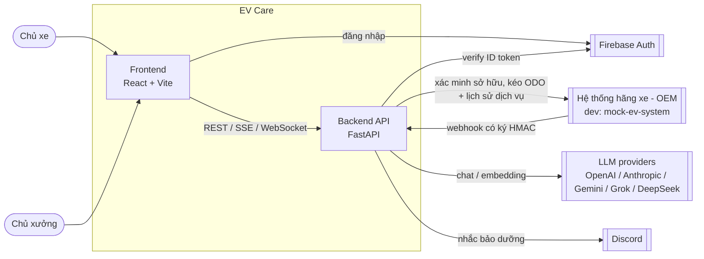
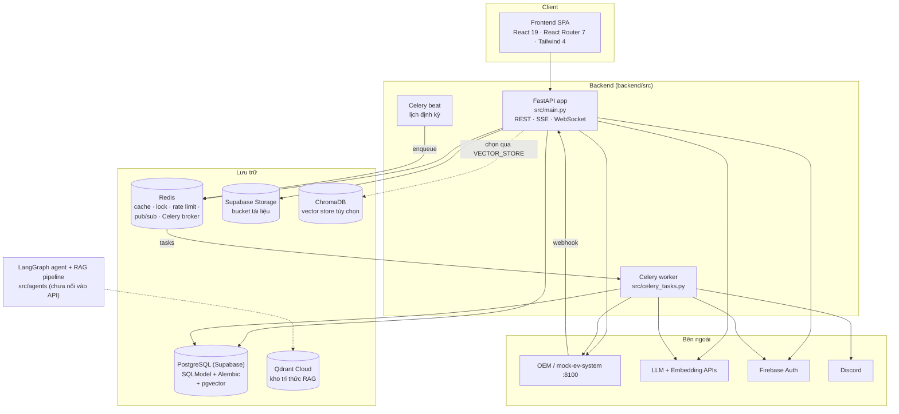
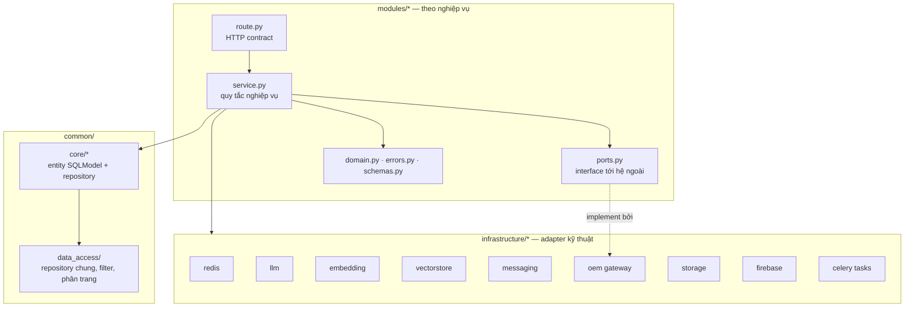
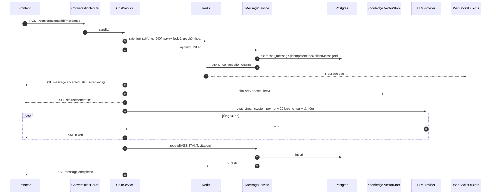
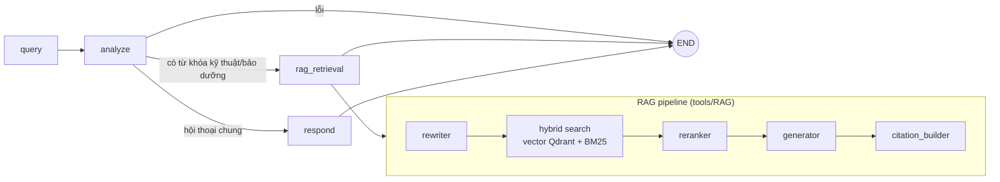
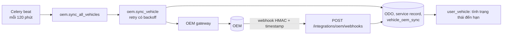

# EV Care — Kiến trúc hệ thống

> Cập nhật: 2026-09-29. Tài liệu mô tả kiến trúc **đang chạy trong code** (`backend/src`, `frontend/src`, các file compose) và đánh dấu rõ phần chưa nối/đang dự kiến.
> Tài liệu cũ `docs/architecture/README.md` và `docs/architecture_diagram.md` mô tả cấu trúc `backend/app` trước tái cấu trúc — đã lỗi thời, dùng tài liệu này làm chuẩn.

## 1. Tổng quan

EV Care là nền tảng chăm sóc xe điện cho hai nhóm người dùng:

- **Chủ xe (vehicle owner)** — liên kết xe với hãng, theo dõi hạn bảo dưỡng, nhận nhắc lịch, đặt lịch xưởng, hỏi đáp với trợ lý AI.
- **Chủ xưởng (workshop owner)** — đăng ký xưởng (xác minh với hãng), nhận và xác nhận lịch hẹn, xem hội thoại của khách.

Hệ thống là **modular monolith**: một ứng dụng FastAPI chia module theo nghiệp vụ, kèm Celery worker/beat chạy tác vụ nền. Chưa tách microservice (xem `post-MVP roadmap`).

## 2. Sơ đồ ngữ cảnh (System Context)

## 3. Sơ đồ container

| Container | Công nghệ | Vai trò |
| --- | --- | --- |
| Frontend | React 19, Vite 8, Tailwind 4, TypeScript | 12 màn hình (dashboard, xe, bảo dưỡng, báo giá, đặt lịch, thông báo, trợ lý). **Hiện dùng dữ liệu mock** (`frontend/src/mocks`); `shared/api/client.ts` và `features/assistant/api.ts` đã sẵn sàng gọi API. |
| Backend API | FastAPI, SQLModel, Pydantic Settings | Cổng HTTP duy nhất; đăng ký router các module, chuẩn hóa lỗi, CORS, lifespan khởi động Redis toolkit. |
| Celery worker + beat | Celery, broker/backend Redis (DB 0/1) | Đồng bộ OEM, nhắc bảo dưỡng, retry xác minh xưởng, dọn dữ liệu hết hạn, index embedding tin nhắn, hủy lịch không được xác nhận. |
| PostgreSQL | Supabase Postgres, Alembic migrations, pgvector | Nguồn dữ liệu chuẩn (source of truth) cho mọi entity; pgvector là vector store mặc định (`VECTOR_STORE=pgvector`). Không cấu hình DB thì rơi về SQLite `data/app.db`. |
| Redis | Redis 7 | Cache, distributed lock, rate limit (sliding window), pub/sub realtime, geo, bloom filter, queue; broker Celery. |
| Supabase Storage | bucket `documents` | Lưu file tài liệu, cấp signed URL (`infrastructure/storage`). |
| Qdrant | Qdrant Cloud | Kho tri thức tài liệu kỹ thuật cho pipeline RAG trong `src/agents`. |
| mock-ev-system | FastAPI riêng (`backend/mock-ev-system`) | Giả lập hệ thống hãng: tra cứu xe, xác minh sở hữu/quản lý xưởng, usage (ODO), lịch sử bảo dưỡng, bảo hành; tự bắn webhook. Dùng chung schema với backend qua gói `backend/shared/ev-contracts`. |

## 4. Kiến trúc bên trong backend

### 4.1 Phân lớp

Quy tắc phụ thuộc:

- **Route** chỉ nhận request, lấy dependency (`dependency.py`), gọi service, trả response. Lỗi nghiệp vụ là exception riêng của module (`errors.py`), được `main.py` dịch sang một **envelope lỗi chung** `{error: {code, message, details, traceId}}`.
- **Service** giữ quy tắc nghiệp vụ; truy cập DB qua repository trong `common/core`, gọi hệ ngoài qua **port** (ví dụ `OemVehicleGateway`) để test có thể thay bằng fake.
- **Infrastructure** là adapter kỹ thuật có interface chuẩn hóa và factory chọn provider theo cấu hình (`LLM_PROVIDER`, `EMBEDDING_PROVIDER`, `VECTOR_STORE`, `FILE_STORAGE`).
- Cấu hình tập trung ở `src/config.py` (Pydantic Settings, đọc `.env`).

### 4.2 Các module nghiệp vụ (`backend/src/modules`)

| Module | Chức năng | Endpoint chính (`/api/v1`) |
| --- | --- | --- |
| `vehicle_owner_onboarding` | Chủ xe đăng ký: đăng nhập Google/Firebase, khai báo xe, xác minh sở hữu với OEM, đồng ý điều khoản; giới hạn số lần xác minh sai. | `/oauth/sign-in`, `/onboarding/*` |
| `auth`, `oauth` | Đăng xuất / thu hồi phiên chủ xe, đọc profile từ Firebase token. | `/oauth/*` |
| `workshop_owner_onboarding` | Chủ xưởng đăng ký xưởng, xác minh quyền quản lý với OEM; timeout thì retry nền (60s→720s) qua `scheduler.py` + Celery. | `/workshop-owner/onboarding/*` |
| `workshop_owner_auth` | Đăng xuất, kiểm tra phiên, audit sự kiện đăng nhập của chủ xưởng (lưu 60 ngày). | `/workshop-owner/oauth/logout`, `/workshop-owner/oauth/session` |
| `authorization` | Mô hình phân quyền (role/permission). | — |
| `user_vehicle` | Hồ sơ xe, trạng thái đến hạn bảo dưỡng (theo km và ngày: 500 km / 14 ngày trước hạn; chu kỳ 12.000 km / 12 tháng). | `/user-vehicles/*` |
| `oem_integration` | Nhận webhook từ hãng (xác thực chữ ký + chống replay), đồng bộ ODO và lịch sử dịch vụ. **ODO chỉ đến từ OEM, không nhập tay.** | `/integrations/oem/webhooks` |
| `notification` | Cài đặt nhắc lịch theo người dùng (số ngày báo trước, kênh). Lớp adapter kênh; hiện có Discord. | `/notification-settings` |
| `booking` | Tìm xưởng gần theo vị trí (Redis geo), xem khung giờ trống theo sức chứa, giữ chỗ bằng Redis lock, hủy trong thời gian hold, xưởng xác nhận trong 12h. | `/workshops/nearby`, `/workshops/{id}/availability`, `/bookings`, `/bookings/{id}/hold` |
| `conversation` | Chat với trợ lý AI: tạo/liệt kê/xóa hội thoại, lịch sử, gửi tin (SSE stream), tìm kiếm, semantic search, WebSocket realtime; xưởng xem trích đoạn hội thoại gắn với lịch hẹn/báo giá. | `/conversations/*`, WS `/conversations/{id}/stream`, `/workshop/{bookings\|quotes}/{id}/conversation-excerpt` |
| `health` | Kiểm tra trạng thái phụ thuộc. | `/health/dependencies` (và `/health` ở gốc app) |
| `examples` | Module mẫu (CRUD xe) tham khảo cách viết module; vẫn được đăng ký router. | `/vehicles/*` |

### 4.3 Mô hình dữ liệu (`backend/src/common/core`)

| Nhóm | Entity |
| --- | --- |
| `identity` | `VehicleUser`, `WorkshopOwner`, `UserDiscordLink` |
| `vehicle` | `UserVehicle`, `VehicleOdometerReading`, `VehicleServiceRecord`, `VehicleOemSync` |
| `maintenance` | `MaintenanceRule`, `Reminder`, `Booking`, `Quote`, `QuoteItem`, `ServiceProgress` |
| `workshop` | `Workshop`, `ServicePrice`, `WorkshopSlotBlock` |
| `notification` | `UserNotificationSetting`, `UserNotificationChannel`, `ReminderDelivery` |
| `conversation` | `Conversation`, `ChatMessage` |
| `knowledge` | `OfficialDocument`, `DocumentChunk`, `MaintenanceRuleSource` |
| `crm` | `CustomerProfileCdp`, `FollowUp`, `SupportTicket` |

Schema được quản lý bằng Alembic (`backend/alembic/versions`), dữ liệu mẫu ở `backend/seed.sql`.

### 4.4 Lớp hạ tầng (`backend/src/infrastructure`)

| Package | Nội dung |
| --- | --- |
| `redis` | `RedisToolkit` khởi động trong lifespan; gồm cache, lock (critical section), rate limit, pub/sub, sorted set, geo, bloom, queue; key có prefix `p146`. |
| `llm` | Interface `LLMProvider` (`chat`, `chat_stream`) + provider Anthropic, Gemini, và OpenAI-compatible (OpenAI, Grok, DeepSeek). |
| `embedding` | Interface embedding đa provider: OpenAI, Gemini, HuggingFace, local (sentence-transformers). Kích thước vector cấu hình qua `EMBEDDING_DIMENSIONS`. |
| `vectorstore` | Interface `VectorStore` với 2 backend `pgvector` (mặc định) và `chroma`; `knowledge_store` cho tài liệu chính hãng, `record_policy` quyết định bản ghi nào được embed. |
| `messaging` | `MessageService` — **nơi ghi duy nhất** vào `chat_message`: commit DB → publish Redis pub/sub → (tùy chọn) enqueue index embedding. |
| `oem` | Adapter httpx tới hệ thống hãng; lỗi mạng/5xx quy về `OemTimeoutError` để service xử lý như trạng thái "pending". |
| `storage` | Interface lưu file + Supabase Storage (signed upload/download URL). |
| `firebase`, `firestore` | Khởi tạo Firebase Admin để verify ID token. |
| `qdrant`, `chromadb` | Client dịch vụ vector chuyên dụng. |
| `celery/tasks` | Tác vụ nền (xem mục 6). |

## 5. Các luồng chính

### 5.1 Chat với trợ lý AI (US-025)

Stream token dùng **SSE** trên chính request gửi tin; **WebSocket** chỉ để đẩy tin đã lưu tới mọi thiết bị đang mở hội thoại.

Điểm quan trọng:

- Gửi lại cùng `clientMessageId` sẽ phát lại câu trả lời đã có, không gọi LLM lần nữa.
- Client ngắt kết nối giữa chừng thì lượt trả lời bị bỏ.
- Lỗi LLM trả về SSE `error` với mã `LLM_UNAVAILABLE`.
- Embedding tin nhắn và semantic search mặc định **tắt** (`CONVERSATION_SEMANTIC_INDEX_ENABLED=false`).
- Hiện REST và WS của conversation **chưa xác thực** (WS nhận `userId` trong frame `auth`) — phải bổ sung Firebase token trước production.

### 5.2 Agent LangGraph và RAG (`backend/src/agents`) — chưa nối vào API

- **Indexing** (`tools/RAG/indexing`): ingestion → cleaning → chunking → embedding → lưu Qdrant.
- **Retrieval** (`tools/RAG/retrieval`): viết lại câu hỏi, tìm kiếm lai vector + BM25, rerank, sinh câu trả lời kèm trích dẫn, độ tin cậy và cờ `fallback_required`; có ngữ cảnh xe (model, ODO).
- `ChatService` hiện tự gọi LLM + vector store; đây là "seam" để thay bằng graph khi spec AI-001 hoàn tất. Khi nối, tool của agent phải gọi service của module (ví dụ booking) thay vì truy cập DB trực tiếp.

### 5.3 Đồng bộ dữ liệu xe từ OEM (FEAT-VEH-001)

Hai đường cập nhật: **pull** định kỳ và **push** qua webhook. Lỗi liên tiếp ≥ 3 lần thì cảnh báo. ODO quá 30 ngày được đánh dấu cũ.

### 5.4 Nhắc bảo dưỡng (FEAT-NOTI-001)

Celery beat chạy `reminder.send_all` lúc 08:00 (Asia/Ho_Chi_Minh) → với mỗi xe sắp đến hạn theo `lead days` của người dùng → `NotificationService` chọn adapter theo kênh (hiện là Discord) → ghi `ReminderDelivery`. Lỗi `TIMEOUT`, `RATE_LIMITED`, `UNAVAILABLE` được thử lại ở lần chạy sau, tối đa 3 lần. Nội dung nhắc không chứa dữ liệu nhạy cảm. Thêm kênh mới chỉ cần viết adapter và đăng ký.

### 5.5 Đặt lịch theo sức chứa (FEAT-BOOK-001)

1. Tìm tối đa 5 xưởng gần nhất (Redis geo) và khung giờ trống trong 7 ngày tới (slot 60 phút, trừ `WorkshopSlotBlock`).
2. Đặt chỗ: lấy Redis lock theo xưởng + slot (TTL 10s) để kiểm tra sức chứa, tránh overbooking. Slot đầy thì trả `SLOT_FULL` kèm gợi ý thay thế.
3. Chủ xe được hủy trong 10 phút giữ chỗ.
4. Xưởng phải xác nhận trong 12 giờ; `booking.cancel_unconfirmed` (mỗi 5 phút) tự hủy nếu quá hạn.

## 6. Tác vụ nền (Celery)

| Task / lịch | Tần suất | Mục đích |
| --- | --- | --- |
| `oem.sync_all_vehicles` | mỗi 7200s | Kéo ODO + lịch sử dịch vụ tất cả xe |
| `reminder.send_all` | 08:00 hằng ngày | Gửi nhắc bảo dưỡng |
| `booking.cancel_unconfirmed` | mỗi 300s | Hủy lịch xưởng không xác nhận |
| `workshop.reconcile_verifications` | mỗi 300s | Enqueue lại các xác minh xưởng bị mất retry |
| `workshop.purge_expired_onboarding` | 02:00 hằng ngày | Xóa hồ sơ đăng ký xưởng dở dang quá hạn |
| `workshop_auth.purge_events` | 02:30 hằng ngày | Xóa audit đăng nhập > 60 ngày |
| `embedding.index_message` | theo sự kiện | Embed tin nhắn (khi bật semantic index) |
| `auth_tasks`, `workshop_auth_tasks` | theo sự kiện | Thu hồi phiên Firebase khi đăng xuất |

## 7. Triển khai và môi trường

| Môi trường | Cách chạy |
| --- | --- |
| Local — full container | `docker-compose.local.yaml` / `docker-compose.dev.yaml` (script `scripts/dev-stack.*`, `compose.local.*`). |
| Local — debug backend | `docker-compose.infra.yaml` chạy mock-ev-system (:8100), Redis (:6379), Chroma (:8001); backend chạy trực tiếp `uv run uvicorn src.main:app --reload` (script `scripts/infra-stack.*`). Xem [RUN_LOCAL_BACKEND.md](RUN_LOCAL_BACKEND.md). |
| Hạ tầng dev trên Railway | `scripts/railway-infra.sh` dựng Redis + mock-ev-system trên Railway, backend chạy local; webhook trỏ về backend qua public URL. Xem [RUN_LOCAL_BACKEND_RAILWAY.md](RUN_LOCAL_BACKEND_RAILWAY.md). |
| Image backend | `dockerfiles/Dockerfile`, compose gốc `docker-compose.yml` expose :8000, healthcheck `/health`. |
| Dịch vụ managed | Supabase (Postgres + Storage), Qdrant Cloud, Firebase Auth, LLM API. |

Kiểm thử thủ công qua Swagger dùng **Firebase Auth Emulator**, không có cơ chế bypass auth.

## 8. Quyết định kiến trúc chính

| Quyết định | Lý do |
| --- | --- |
| Modular monolith + Celery | Phát triển nhanh cho MVP, ranh giới module rõ để tách service sau. |
| Port/adapter cho hệ ngoài (OEM, LLM, embedding, vector store, storage, kênh thông báo) | Đổi provider bằng cấu hình, test bằng fake, mock-ev-system thay OEM thật khi dev. |
| Postgres là nguồn dữ liệu chuẩn; Redis chỉ là phụ trợ | Pub/sub/cache lỗi không làm mất dữ liệu; client đồng bộ lại qua REST. |
| Một nơi ghi duy nhất cho tin nhắn (`MessageService`) | Thứ tự commit → publish → index nhất quán cho mọi kênh. |
| SSE cho token, WebSocket cho fan-out | Stream một chiều đơn giản; WebSocket phục vụ đa thiết bị. |
| Redis lock khi đặt lịch | Chống overbooking khi nhiều người đặt cùng slot. |
| ODO chỉ từ OEM (pull + webhook) | Đảm bảo độ tin cậy của mốc bảo dưỡng. |

## 9. Khoảng trống và hướng phát triển

### Chưa hoàn thiện trong MVP

- Frontend còn dùng mock, chưa gọi API thật.
- LangGraph agent + RAG Qdrant chưa nối vào `ChatService`; hai kho tri thức (pgvector cho chat, Qdrant cho RAG) cần hợp nhất.
- Endpoint conversation (REST + WS) chưa xác thực.
- Adapter Discord hiện ở dạng logging; chưa có kênh khác (email, push, Zalo...).
- Module `quotes` (báo giá) mới có entity, chưa có API.

### Sau MVP

Chi tiết trong `personal/tungld-03005/tech-notes-and-roadmap.md`.

- Chuyển sang GCP; tách microservice; Cloud Functions + pub/sub cho tác vụ nền; observability; ứng dụng mobile.
- Chat nhiều bên: chủ xe ↔ xưởng/kỹ thuật viên, agent AI tham gia như một participant.
- Khách chưa đăng ký chat với agent về lịch bảo dưỡng; hội thoại dẫn vào luồng onboarding.
