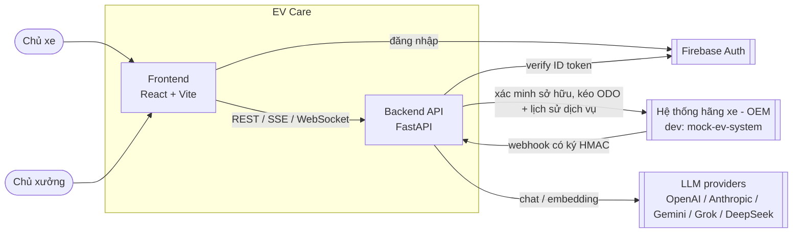
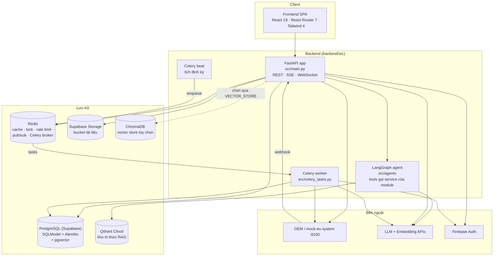
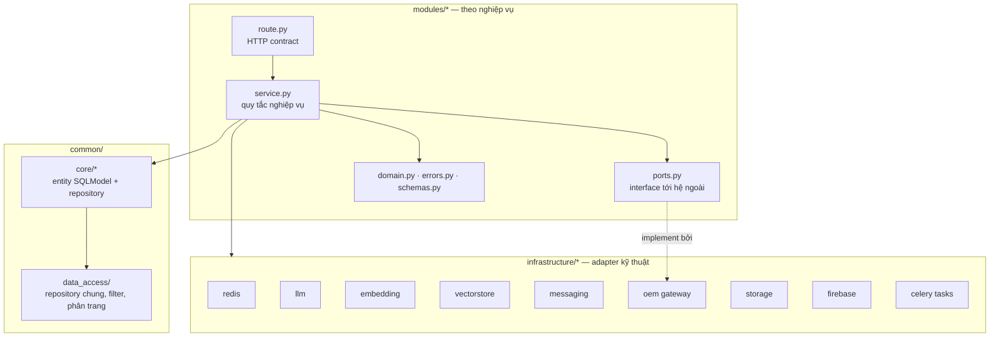
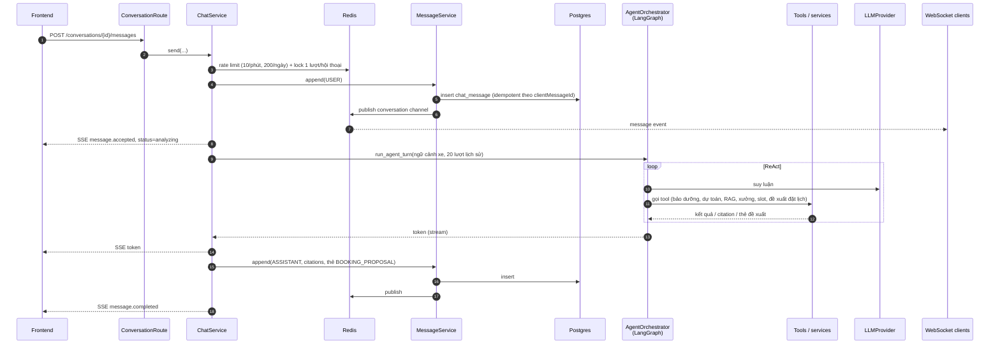
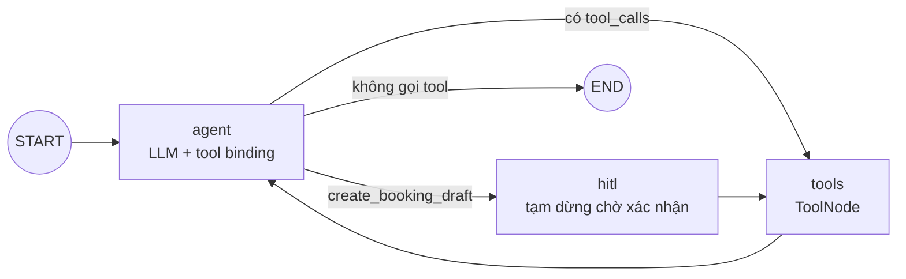
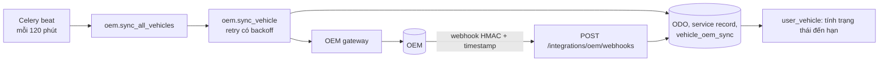
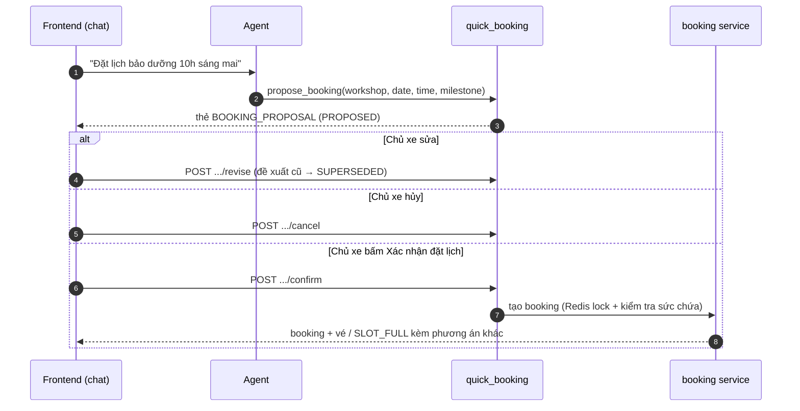

# EV Care — Kiến trúc hệ thống

> Cập nhật: 2026-10-04. Tài liệu mô tả kiến trúc **đang chạy trong code** (`backend/src`, `frontend/src`, các file compose), đối chiếu với `docs/specs` (sprint 1–4, `ai-agent`) và đánh dấu rõ phần chưa nối/đang dự kiến.
> Tài liệu cũ `docs/architecture/README.md` và `docs/architecture_diagram.md` mô tả cấu trúc `backend/app` trước tái cấu trúc — đã lỗi thời, dùng tài liệu này làm chuẩn.
> Chi tiết bảo mật, yêu cầu phi chức năng, vòng đời trạng thái, xử lý lỗi và lộ trình: [architecture-deep-dive.md](architecture-deep-dive.md).
> Phạm vi đã thu hẹp ngày 02/10/2026: **bỏ** báo giá/duyệt báo giá (`quote`, us-049, AI-005), phiếu hỗ trợ (`support_ticket`) và kết nối Discord (`user_discord_link`); migration `a3c7e9f1b2d4_drop_quote_support_ticket_discord` đã xóa các bảng này.

## 1. Tổng quan

EV Care là nền tảng chăm sóc xe điện cho hai nhóm người dùng:

- **Chủ xe (vehicle owner)** — liên kết xe với hãng, theo dõi hạn bảo dưỡng, xem dự toán chi phí, nhận nhắc lịch, đặt lịch xưởng (qua form hoặc ngay trong chat), theo dõi tiến độ, trả lời hỏi thăm sau dịch vụ, hỏi đáp với trợ lý AI.
- **Chủ xưởng (workshop owner)** — đăng ký xưởng (xác minh với hãng), điều phối lịch hẹn trên **Workshop Board** (xác nhận/từ chối, check-in QR, chuyển trạng thái, cập nhật tiến độ), cấu hình sức chứa và khóa slot, xem trích đoạn hội thoại của khách.

Hệ thống là **modular monolith**: một ứng dụng FastAPI chia module theo nghiệp vụ, kèm Celery worker/beat chạy tác vụ nền. Chưa tách microservice (xem `post-MVP roadmap`).

## 2. Sơ đồ ngữ cảnh (System Context)

## 3. Sơ đồ container

| Container | Công nghệ | Vai trò |
| --- | --- | --- |
| Frontend | React 19, Vite 8, Tailwind 4, TypeScript | Cổng chủ xe (dashboard, xe, lịch sử, dự toán + so sánh, đặt lịch 3 bước, vé booking + QR, đổi lịch, hỏi thăm, thông báo, trợ lý AI) và cổng chủ xưởng `/technician` (dashboard, board, check-in, sức chứa, cài đặt đặt lịch, thông báo). Gọi API thật qua `shared/api/client.ts` (Firebase ID token, envelope lỗi chuẩn). Mock trong trình duyệt (`src/mocks`, `VITE_API_MOCKS`) **mặc định tắt**; chế độ demo (`DEMO_MODE`) mock toàn bộ để chạy không cần backend. |
| Backend API | FastAPI, SQLModel, Pydantic Settings | Cổng HTTP duy nhất; đăng ký router các module, chuẩn hóa lỗi, CORS, lifespan khởi động Redis toolkit. |
| LangGraph agent | LangGraph, LangChain | Orchestrator ReAct duy nhất cho trợ lý AI, được `ChatService` gọi qua `AgentOrchestrator`. Chi tiết ở mục 5.2. |
| Celery worker + beat | Celery, broker/backend Redis (DB 0/1) | Đồng bộ OEM, nhắc bảo dưỡng và nhắc lịch hẹn, hỏi thăm sau dịch vụ, retry xác minh xưởng, dọn dữ liệu hết hạn, index embedding tin nhắn, hủy lịch không được xác nhận. |
| PostgreSQL | Supabase Postgres, Alembic migrations, pgvector | Nguồn dữ liệu chuẩn (source of truth) cho mọi entity; pgvector lưu embedding tin nhắn/semantic search. Không cấu hình DB thì rơi về SQLite `data/app.db`. |
| Redis | Redis 7 | Cache, distributed lock, rate limit (sliding window), pub/sub realtime, geo, bloom filter, queue; broker Celery. |
| Supabase Storage | bucket `documents` | Lưu file tài liệu, cấp signed URL (`infrastructure/storage`). |
| Qdrant | Qdrant Cloud, collection `ev_care_knowledge_base` | Kho tri thức tài liệu kỹ thuật cho tool RAG của agent. `VECTOR_STORE` mặc định trong `config.py` là `qdrant` (có thể đổi `pgvector`/`chroma`). |
| mock-ev-system | FastAPI riêng (`backend/mock-ev-system`) | Giả lập hệ thống hãng: tra cứu xe, xác minh sở hữu/quản lý xưởng, usage (ODO), lịch sử bảo dưỡng, bảo hành; tự bắn webhook. Dùng chung schema với backend qua gói `backend/shared/ev-contracts`. |

## 4. Kiến trúc bên trong backend

### 4.1 Phân lớp

Quy tắc phụ thuộc:

- **Route** chỉ nhận request, lấy dependency (`dependency.py`), gọi service, trả response. Lỗi nghiệp vụ là exception riêng của module (`errors.py`), được `main.py` dịch sang một **envelope lỗi chung** `{error: {code, message, details, traceId}}`.
- **Service** giữ quy tắc nghiệp vụ; truy cập DB qua repository trong `common/core`, gọi hệ ngoài qua **port** (ví dụ `OemVehicleGateway`) để test có thể thay bằng fake.
- **Infrastructure** là adapter kỹ thuật có interface chuẩn hóa và factory chọn provider theo cấu hình (`LLM_PROVIDER`, `EMBEDDING_PROVIDER`, `VECTOR_STORE`, `FILE_STORAGE`).
- **Agent tool** không truy cập DB trực tiếp: mỗi tool dựng đúng service mà endpoint HTTP dùng (BR-011, BR-1006), nên quy tắc nghiệp vụ chỉ có một nơi.
- Cấu hình tập trung ở `src/config.py` (Pydantic Settings, đọc `.env`).

### 4.2 Các module nghiệp vụ (`backend/src/modules`)

| Module | Chức năng | Endpoint chính (`/api/v1`) |
| --- | --- | --- |
| `vehicle_owner_onboarding` | Chủ xe đăng ký: đăng nhập Google/Firebase, khai báo xe, xác minh sở hữu với OEM, đồng ý điều khoản; giới hạn số lần xác minh sai. | `/oauth/sign-in`, `/onboarding/*` |
| `auth`, `oauth` | Đăng xuất / thu hồi phiên chủ xe, đọc profile từ Firebase token. | `/oauth/*` |
| `workshop_owner_onboarding` | Chủ xưởng đăng ký xưởng, xác minh quyền quản lý với OEM; timeout thì retry nền (60s→720s) qua `scheduler.py` + Celery. | `/workshop-owner/onboarding/*` |
| `workshop_owner_auth` | Đăng xuất, kiểm tra phiên, audit sự kiện đăng nhập của chủ xưởng (lưu 60 ngày). | `/workshop-owner/oauth/logout`, `/workshop-owner/oauth/session` |
| `authorization` | Mô hình phân quyền (role/permission). | — |
| `user_vehicle` | Hồ sơ xe, trạng thái đến hạn bảo dưỡng (theo km và ngày: 500 km / 14 ngày trước hạn; chu kỳ 12.000 km / 12 tháng). | `/user-vehicles/*` |
| `oem_integration` | Nhận webhook từ hãng (xác thực chữ ký + chống replay), đồng bộ ODO và lịch sử dịch vụ. **ODO chỉ đến từ OEM, không nhập tay.** | `/integrations/oem/webhooks` |
| `cost_estimate` | Dự toán chi phí theo mốc bảo dưỡng: ghép `maintenance_rule` × `service_price` của xưởng, thiếu giá thì dùng giá tham khảo; mọi con số gắn nhãn **"Chi phí ước tính"** (chi phí cuối do xưởng xác nhận khi kiểm tra xe). Do service tất định tính, LLM không tự cộng số. | `/user-vehicles/{id}/maintenance-milestones`, `/cost-estimate`, `/cost-estimate/compare` |
| `notification` | Cài đặt nhắc lịch theo người dùng (số ngày báo trước, kênh); feed thông báo trong app (nhắc bảo dưỡng, nhắc lịch hẹn, hỏi thăm). Lớp adapter kênh ngoài (`channels.py`, `NotificationService`); hiện chưa có kênh nào (Zalo / Telegram / SMS / Email đều "Sắp có"). | `/notification-settings`, `/notifications` |
| `booking` | Tìm xưởng gần theo vị trí (Redis geo), xem khung giờ trống theo sức chứa, giữ chỗ bằng Redis lock, hủy trong thời gian hold; vé booking (tra theo mã, QR), xác nhận sẽ đến, hủy, đổi lịch, xem tiến độ. | `/workshops/nearby`, `/workshops/{id}/availability`, `/bookings`, `/bookings/{id}/hold`, `/bookings/by-code/{code}`, `/bookings/{id}/attendance-confirmation`, `/cancel`, `/qr`, `/reschedule`, `/progress` |
| `quick_booking` | Đặt lịch nhanh từ chat (us-061): tạo **đề xuất** (`BookingProposal`), chủ xe sửa/hủy/xác nhận; chỉ nút **Xác nhận đặt lịch** trên thẻ mới tạo booking, gõ chữ "xác nhận" không tính. | `/conversations/{id}/quick-booking`, `/booking-proposals/{pid}/confirm`, `/revise`, `/cancel` |
| `workshop_board` | Workshop Board (F8): danh sách lịch hẹn, tra theo mã, chuyển trạng thái (xác nhận/từ chối, check-in, in progress, completed), sức chứa, khóa slot, chế độ đặt lịch auto/manual, cập nhật tiến độ dịch vụ. | `/workshop-owner/bookings*`, `/capacity`, `/slot-blocks`, `/booking-settings`, `/bookings/{id}/progress` |
| `service_progress` | Tiến độ dịch vụ chi tiết 6 bước (F8b, us-057): domain, lỗi, service; được `workshop_board` (ghi) và `booking` (đọc) dùng, không có router riêng. | — |
| `follow_up` | Hỏi thăm sau dịch vụ (F9, us-041): chủ xe xem và gửi phản hồi (điểm hài lòng + nhận xét); phản hồi có vấn đề chỉ được phân loại, ghi `has_issue` trên `follow_up`, app hiện lời khuyên an toàn + hotline xưởng (không có phiếu hỗ trợ). Job gửi và tự đóng nằm ở `jobs.py`. | `/follow-ups/{id}`, `/follow-ups/{id}/response` |
| `conversation` | Chat với trợ lý AI: tạo/liệt kê/xóa hội thoại, lịch sử, gửi tin (SSE stream), tìm kiếm, semantic search, WebSocket realtime; xưởng xem trích đoạn hội thoại gắn với lịch hẹn. | `/conversations/*`, WS `/conversations/{id}/stream`, `/workshop/bookings/{id}/conversation-excerpt` |
| `health` | Kiểm tra trạng thái phụ thuộc. | `/health/dependencies` (và `/health` ở gốc app) |
| `examples` | Module mẫu (CRUD xe) tham khảo cách viết module; vẫn được đăng ký router. | `/vehicles/*` |

### 4.3 Mô hình dữ liệu (`backend/src/common/core`)

| Nhóm | Entity |
| --- | --- |
| `identity` | `VehicleUser`, `WorkshopOwner` |
| `vehicle` | `UserVehicle`, `VehicleOdometerReading`, `VehicleServiceRecord`, `VehicleOemSync` |
| `maintenance` | `MaintenanceRule`, `Reminder`, `Booking`, `BookingStatusEvent`, `BookingReschedule`, `BookingProposal`, `ServiceProgress` |
| `workshop` | `Workshop`, `ServicePrice`, `WorkshopSlotBlock` |
| `notification` | `UserNotificationSetting`, `UserNotificationChannel`, `ReminderDelivery`, `BookingReminder`, `BookingReminderDelivery`, `FollowUpDelivery` |
| `conversation` | `Conversation`, `ChatMessage` |
| `knowledge` | `OfficialDocument`, `DocumentChunk`, `MaintenanceRuleSource` |
| `crm` | `CustomerProfileCdp`, `FollowUp` |

Đã **loại bỏ**: `Quote`, `QuoteItem`, `SupportTicket`, `UserDiscordLink`. Schema được quản lý bằng Alembic (`backend/alembic/versions`), dữ liệu mẫu ở `backend/seed.sql`.

### 4.4 Lớp hạ tầng (`backend/src/infrastructure`)

| Package | Nội dung |
| --- | --- |
| `redis` | `RedisToolkit` khởi động trong lifespan; gồm cache, lock (critical section), rate limit, pub/sub, sorted set, geo, bloom, queue; key có prefix `p146`. |
| `llm` | Interface `LLMProvider` (`chat`, `chat_stream`) + provider Anthropic, Gemini, và OpenAI-compatible (OpenAI, Grok, DeepSeek). |
| `embedding` | Interface embedding đa provider: OpenAI, Gemini, HuggingFace, local (sentence-transformers). Kích thước vector cấu hình qua `EMBEDDING_DIMENSIONS`. |
| `vectorstore` | Interface `VectorStore` với backend `qdrant`, `pgvector`, `chroma`; `knowledge_store` cho tài liệu chính hãng, `record_policy` quyết định bản ghi nào được embed. |
| `messaging` | `MessageService` — **nơi ghi duy nhất** vào `chat_message`: commit DB → publish Redis pub/sub → (tùy chọn) enqueue index embedding. |
| `oem` | Adapter httpx tới hệ thống hãng; lỗi mạng/5xx quy về `OemTimeoutError` để service xử lý như trạng thái "pending". |
| `storage`, `supabase` | Interface lưu file + Supabase Storage (signed upload/download URL). |
| `firebase`, `firestore` | Khởi tạo Firebase Admin để verify ID token. |
| `qdrant`, `chromadb` | Client dịch vụ vector chuyên dụng. |
| `fastapi`, `logging` | Middleware (request id, lỗi) và cấu hình log. |
| `celery/tasks` | Tác vụ nền (xem mục 6). |

## 5. Các luồng chính

### 5.1 Chat với trợ lý AI (US-025, US-061)

Stream token dùng **SSE** trên chính request gửi tin; **WebSocket** chỉ để đẩy tin đã lưu tới mọi thiết bị đang mở hội thoại. `ChatService` lo rate limit, lock, lưu tin và SSE; việc suy luận + gọi tool giao cho `AgentOrchestrator.run_agent_turn`.

Điểm quan trọng:

- Gửi lại cùng `clientMessageId` sẽ phát lại câu trả lời đã có, không gọi LLM lần nữa.
- Client ngắt kết nối giữa chừng thì lượt trả lời bị bỏ.
- Lỗi LLM trả về SSE `error` với mã `AGENT_ERROR`.
- Embedding tin nhắn và semantic search mặc định **tắt** (`CONVERSATION_SEMANTIC_INDEX_ENABLED=false`).
- REST của conversation xác thực bằng **Firebase ID token** (`get_current_user_id`); header `X-User-Id` chỉ dùng cho công cụ cục bộ và bị chặn khi `APP_ENV=production`. **WebSocket vẫn chưa dùng token**: frame `auth` đầu tiên mang `userId` (TODO Q-621) — phải đổi sang Firebase token trước production.

### 5.2 Agent LangGraph và RAG (`backend/src/agents`)

Một **orchestrator duy nhất + tool rõ ràng + nghiệp vụ tất định** (không multi-agent): LLM hiểu ý định, chọn tool và diễn giải; số liệu (đến hạn, giá, sức chứa, tạo booking) do service backend tính. Ngữ cảnh xe (model, ODO, lần bảo dưỡng gần nhất) được nạp vào `AgentState` trước khi gọi LLM; `user_id`, `user_vehicle_id` lấy từ `RunnableConfig` của phiên chat, không do LLM sinh ra, nên không thể thao tác trên xe của tài khoản khác.

| Tool | Loại | Module/service gọi tới |
| --- | --- | --- |
| `get_due_maintenance` | Đọc | `user_vehicle` (`get_maintenance_status`) |
| `estimate_service_cost` | Đọc | `cost_estimate` (`estimate_for_request`) |
| `search_ev_knowledge` | Đọc | `tools/RAG` (Qdrant: viết lại câu hỏi → hybrid vector + BM25 → rerank → trích dẫn) |
| `find_workshops` | Đọc | `booking` (`find_nearby`) |
| `get_available_slots` | Đọc | `booking` (`check_availability`) |
| `propose_booking` | Đề xuất | `quick_booking` (`propose_from_agent`) — chỉ tạo `BookingProposal` + thẻ `BOOKING_PROPOSAL`, **không** tạo booking, không giữ chỗ |

- **Cổng xác nhận (HITL):** booking chỉ được tạo khi chủ xe bấm "Xác nhận đặt lịch" (API-QB-02); backend kiểm chứng token của thẻ. Đây là thay đổi so với AI-004: câu chữ "xác nhận" không còn được tính (us-061, quyết định 03/10/2026).
- **Indexing RAG** (`tools/RAG/ingestion`): nạp tài liệu → làm sạch → chunk → embedding → lưu Qdrant.
- Không có tool nào cho báo giá hay phiếu hỗ trợ (đã bỏ khỏi phạm vi).
- `ChatService` vẫn giữ `knowledge_store`/`vector_store` cho trích dẫn và semantic search; chi tiết kiến trúc agent ở `backend/src/agents/README.md`.
- Còn lệch spec: AI-001 mô tả orchestrator + sub-graph; code hiện là một graph ReAct với tool. Nhánh `hitl` trong `graph.py` vẫn tham chiếu `create_booking_draft` cũ, cần đồng bộ với `propose_booking`.

### 5.3 Đồng bộ dữ liệu xe từ OEM (FEAT-VEH-001)

Hai đường cập nhật: **pull** định kỳ và **push** qua webhook. Lỗi liên tiếp ≥ 3 lần thì cảnh báo. ODO quá 30 ngày được đánh dấu cũ.

### 5.4 Nhắc bảo dưỡng và nhắc lịch hẹn (FEAT-NOTI-001, FEAT-NOTI-002)

- **Nhắc mốc bảo dưỡng:** Celery beat chạy `reminder.send_all` lúc 08:00 (Asia/Ho_Chi_Minh) → với mỗi xe sắp đến hạn theo `lead days` của người dùng → ghi `Reminder` (hiện trong feed Thông báo của app) → nếu chủ xe bật kênh ngoài, `NotificationService` chọn adapter theo kênh → ghi `ReminderDelivery` (hiện chưa có adapter nào).
- **Nhắc lịch hẹn 24h:** `booking_reminder.send_due` (chu kỳ cấu hình theo phút) nhắc booking `confirmed` trước giờ hẹn, ghi `BookingReminder`/`BookingReminderDelivery`; chủ xe xác nhận sẽ đến / đổi / hủy ngay từ lời nhắc.
- Lỗi `TIMEOUT`, `RATE_LIMITED`, `UNAVAILABLE` được thử lại ở lần chạy sau, tối đa 3 lần. Nội dung nhắc không chứa dữ liệu nhạy cảm (nội dung dùng template, không do LLM soạn). Thêm kênh mới chỉ cần viết adapter và đăng ký.

### 5.5 Đặt lịch theo sức chứa (FEAT-BOOK-001/002)

1. Tìm tối đa 5 xưởng gần nhất và khung giờ trống trong 7 ngày tới (slot 60 phút, trừ `WorkshopSlotBlock`). MVP so khớp theo vị trí/khu vực qua một interface tìm xưởng tách riêng để sau nâng cấp geocoding.
2. Đặt chỗ: lấy Redis lock theo xưởng + slot (TTL 10s) để kiểm tra sức chứa, tránh overbooking. Slot đầy thì trả `SLOT_FULL` kèm gợi ý thay thế.
3. Chủ xe được hủy trong 10 phút giữ chỗ (`hold_minutes`).
4. Xưởng chế độ thủ công phải xác nhận trong 12 giờ (`booking_ws_confirm_deadline_hours`); `booking.cancel_unconfirmed` (mỗi 5 phút) tự hủy nếu quá hạn.
5. Sau khi `confirmed`: vé có mã + QR; xưởng check-in bằng QR/mã (`/c/{bookingCode}`) hoặc bấm tay; chủ xe có thể đổi/hủy lịch.

Vòng đời `booking.status`: `pending → confirmed → checked_in → in_progress → completed`, hoặc `cancelled`; mỗi lần đổi ghi `BookingStatusEvent`. Trong giai đoạn xe ở xưởng, `ServiceProgress` ghi tiến độ chi tiết 6 bước mà chủ xe xem được.

### 5.6 Đặt lịch nhanh từ trợ lý AI (US-061)

`BookingProposal` có trạng thái `proposed → confirmed | cancelled | superseded | expired`; nguồn `QUICK_BOOKING` hoặc `CHAT_AGENT`.

### 5.7 Hỏi thăm sau dịch vụ (FEAT-CRM-001)

Khi booking `completed`, job `follow_up.send_due` (mỗi 15 phút) mở `FollowUp` và gửi **một** câu hỏi thăm qua `NotificationService` (ghi `FollowUpDelivery`, retry lỗi tạm thời, tối đa 3 lần). Chủ xe trả lời trong app tại `/follow-ups/{id}`. Phản hồi có vấn đề được phân loại và ghi `has_issue`; app hiện lời khuyên an toàn và hotline xưởng. `follow_up.close_expired` (mỗi giờ, phút 5) tự đóng follow-up không phản hồi sau 72 giờ (`NO_RESPONSE`).

## 6. Tác vụ nền (Celery)

| Task / lịch | Tần suất | Mục đích |
| --- | --- | --- |
| `oem.sync_all_vehicles` | mỗi 7200s | Kéo ODO + lịch sử dịch vụ tất cả xe |
| `reminder.send_all` | 08:00 hằng ngày | Gửi nhắc bảo dưỡng |
| `booking_reminder.send_due` | mỗi `BOOKING_REMINDER_JOB_INTERVAL_MINUTES` phút | Nhắc lịch hẹn 24h |
| `booking.cancel_unconfirmed` | mỗi 300s | Hủy lịch xưởng không xác nhận |
| `follow_up.send_due` | mỗi 900s | Gửi hỏi thăm sau dịch vụ |
| `follow_up.close_expired` | hằng giờ (phút 5) | Đóng hỏi thăm quá 72h không phản hồi |
| `workshop.reconcile_verifications` | mỗi 300s | Enqueue lại các xác minh xưởng bị mất retry |
| `workshop.purge_expired_onboarding` | 02:00 hằng ngày | Xóa hồ sơ đăng ký xưởng dở dang quá hạn |
| `workshop_auth.purge_events` | 02:30 hằng ngày | Xóa audit đăng nhập > 60 ngày |
| `embedding.index_message` | theo sự kiện | Embed tin nhắn (khi bật semantic index) |
| `reminder.remind_vehicle`, `oem.sync_vehicle`, `workshop.retry_verification` | theo sự kiện | Tác vụ con do job tổng hợp enqueue |
| `auth.revoke_session`, `workshop_auth.revoke_session` | theo sự kiện | Thu hồi phiên Firebase khi đăng xuất |

## 7. Triển khai và môi trường

| Môi trường | Cách chạy |
| --- | --- |
| Local — full container | `docker-compose.local.yaml` / `docker-compose.dev.yaml` (script `scripts/dev-stack.*`, `compose.local.*`). |
| Local — debug backend | `docker-compose.infra.yaml` chạy mock-ev-system (:8100), Redis (:6379), Chroma (:8001); backend chạy trực tiếp `uv run uvicorn src.main:app --reload` (script `scripts/infra-stack.*`). Xem [RUN_LOCAL_BACKEND.md](RUN_LOCAL_BACKEND.md). |
| Hạ tầng dev trên Railway | `scripts/railway-infra.sh` dựng Redis + mock-ev-system trên Railway, backend chạy local; webhook trỏ về backend qua public URL. Xem [RUN_LOCAL_BACKEND_RAILWAY.md](RUN_LOCAL_BACKEND_RAILWAY.md). |
| Frontend | Vite dev server; cấu hình `vercel.json` để deploy lên Vercel. Chế độ demo chạy hoàn toàn bằng mock trong trình duyệt. |
| Image backend | `dockerfiles/Dockerfile`, compose gốc `docker-compose.yml` expose :8000, healthcheck `/health`. |
| Dịch vụ managed | Supabase (Postgres + Storage), Qdrant Cloud, Firebase Auth, LLM API. |

Kiểm thử thủ công qua Swagger dùng **Firebase Auth Emulator**; `X-User-Id` chỉ là lối đi cục bộ cho tool/script và bị tắt ở production.

## 8. Quyết định kiến trúc chính

| Quyết định | Lý do |
| --- | --- |
| Modular monolith + Celery | Phát triển nhanh cho MVP, ranh giới module rõ để tách service sau. |
| Port/adapter cho hệ ngoài (OEM, LLM, embedding, vector store, storage, kênh thông báo) | Đổi provider bằng cấu hình, test bằng fake, mock-ev-system thay OEM thật khi dev. |
| Một orchestrator ReAct + tool gọi service thật | Kiểm soát trace/guardrail tập trung, tránh multi-agent khó kiểm soát ở MVP; số liệu do backend tính, LLM chỉ diễn giải. |
| Agent chỉ **đề xuất**, người dùng bấm nút mới tạo booking | Không side effect khi chưa xác nhận rõ; cổng HITL do backend kiểm chứng. |
| Mọi con số chi phí là "ước tính", không có báo giá | Bỏ quy trình duyệt báo giá; chi phí cuối do xưởng xác nhận khi kiểm tra xe. |
| Postgres là nguồn dữ liệu chuẩn; Redis chỉ là phụ trợ | Pub/sub/cache lỗi không làm mất dữ liệu; client đồng bộ lại qua REST. |
| Một nơi ghi duy nhất cho tin nhắn (`MessageService`) | Thứ tự commit → publish → index nhất quán cho mọi kênh. |
| SSE cho token, WebSocket cho fan-out | Stream một chiều đơn giản; WebSocket phục vụ đa thiết bị. |
| Redis lock khi đặt lịch | Chống overbooking khi nhiều người đặt cùng slot. |
| ODO chỉ từ OEM (pull + webhook) | Đảm bảo độ tin cậy của mốc bảo dưỡng. |
| Nhắc/hỏi thăm hiện trong app, kênh ngoài là adapter cắm thêm | Bỏ Discord; thêm kênh sau không đổi nghiệp vụ. |

## 9. Khoảng trống và hướng phát triển

Phần này đã được tách sang [architecture-deep-dive.md](architecture-deep-dive.md#5-khoảng-trống-và-hướng-phát-triển), cùng với bảo mật, yêu cầu phi chức năng, vòng đời trạng thái và xử lý lỗi. Các khoảng trống chính:

- **P0 (chặn production):** WebSocket conversation chưa xác thực token; cần siết đường ghi tin nhắn chỉ cho vai trò `USER`.
- **P1:** đồng bộ graph agent với spec; thống nhất kho vector (Qdrant ↔ pgvector); đưa eval AI và test frontend vào CI; bổ sung tracing/metric.
- **Sau MVP:** GCP + microservice, Cloud Functions/Pub/Sub, agent A2A, OEM qua MCP, chat nhiều bên, chat cho khách chưa đăng ký.
