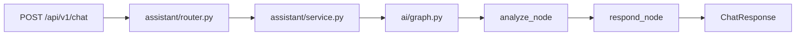

# Kiến trúc EV Care

## Cập nhật lưu trữ vector

Vector store mặc định hiện là **Qdrant**, cấu hình tại `.env` gốc qua
`VECTOR_STORE=qdrant`, `QDRANT_URL`, `QDRANT_API_KEY` và `QDRANT_COLLECTION_NAME`.
RAG và truy xuất kiến thức trong chat cùng đọc collection Qdrant; vector tin nhắn
dùng collection `conversation_messages` riêng khi bật tìm kiếm ngữ nghĩa.
PostgreSQL/Supabase tiếp tục lưu dữ liệu nghiệp vụ. Xem [hướng dẫn Qdrant](../../backend/guide/qdrant.md).

Các mục bên dưới mô tả cấu trúc ở giai đoạn đầu, chưa phản ánh đầy đủ mã nguồn hiện tại trong `backend/src/`.

## Phạm vi hiện tại

Một repository chứa frontend React và một ứng dụng backend FastAPI. Backend chia module theo nghiệp vụ; chưa tách thành nhiều service triển khai riêng.

Frontend đã có 12 màn hình nhưng sử dụng mock và state trong bộ nhớ. Backend có health, status và chat. Graph hiện chạy `analyze → respond` bằng các node mẫu. Database, RAG, đăng nhập thật và API nghiệp vụ chưa được triển khai.

## Ranh giới mã nguồn

| Khu vực | Trách nhiệm |
| --- | --- |
| `frontend/src/app` | Router và providers cấp ứng dụng |
| `frontend/src/features` | Màn hình, component, kiểu dữ liệu và API của từng nghiệp vụ |
| `frontend/src/shared` | Thành phần dùng chung không phụ thuộc một feature cụ thể |
| `frontend/src/mocks` | Bộ dữ liệu minh họa; không dùng làm dữ liệu thực tế |
| `backend/app/core` | Settings, các thành phần nền tảng |
| `backend/app/modules` | HTTP contract, service và persistence theo nghiệp vụ |
| `backend/app/ai` | Điều phối AI, prompt, tool, retrieval và LLM client |
| `backend/app/db` | Kết nối và transaction khi có database |
| `knowledge/sources` | Metadata và nguồn gốc tài liệu |
| `data` | File và chỉ mục cục bộ, không commit |

## Quy tắc phụ thuộc

- Router nhận request, kiểm tra quyền khi có auth thật, gọi service và trả response.
- Service sở hữu quy tắc nghiệp vụ. Repository tách truy vấn database khi cần.
- AI tools gọi service của module tương ứng. API đặt lịch và chat đặt lịch phải dùng chung logic kiểm tra chỗ trống.
- Module `assistant` gọi graph; `ai` không import router hoặc service của `assistant`, tránh vòng phụ thuộc.
- Frontend chia feature theo nghiệp vụ, không theo vai trò. Chủ xe và kỹ thuật viên dùng chung feature lịch hẹn.
- `shared` không import ngược vào `features`; kiểu dữ liệu riêng của từng feature ở trong feature đó.
- Chỉ thêm model, repository, component hoặc endpoint khi có chức năng cần triển khai.

## Các module

`assistant` đã có `router.py`, `schemas.py`, `service.py` và được đăng ký trong `main.py`.
Các package `auth`, `vehicles`, `maintenance`, `bookings`, `notifications` là khung để phát triển tiếp. Danh sách trách nhiệm nằm tại [modules/README.md](../../backend/app/modules/README.md).

`bookings` quản lý cả xưởng và khung giờ ở giai đoạn đầu. `maintenance` quản lý quy tắc bảo dưỡng và lịch sử dịch vụ. Dự toán chi phí của chủ xe nằm ở `cost_estimate`; không có bước duyệt báo giá.

## Luồng chat hiện tại

API và cấu trúc response được giữ nguyên. Adapter `frontend/src/features/assistant/api.ts` sẵn sàng gọi API, nhưng các trang demo vẫn dùng mock để giữ hành vi giao diện hiện có.

## Chạy và kiểm thử

Lệnh phát triển chạy từ root: `python -m uvicorn app.main:app --app-dir backend --reload`. Python package là `app`; `--app-dir backend` đưa thư mục backend vào đường dẫn import. `pytest.ini` cấu hình cùng đường dẫn cho kiểm thử. `ruff.toml` đánh dấu backend là source root.

Backend tests chuyển đến `backend/tests/unit` và `backend/tests/integration`. `tests/e2e` dành cho luồng xuyên hệ thống, chưa có test runner. CI kiểm tra Ruff, pytest, TypeScript và frontend build.

Docker build từ root với `backend/Dockerfile`, chỉ copy mã backend. Dependencies nằm trong `/opt/venv`; runtime dùng user `appuser`. Compose hiện chỉ chạy backend, không tự phục vụ frontend.

## Bảng chuyển đường dẫn

| Trước | Sau |
| --- | --- |
| `src/frontend/` | `frontend/` |
| `src/frontend/src/App.tsx` | `frontend/src/app/App.tsx` |
| `src/frontend/src/pages/` | `frontend/src/features/<nghiệp vụ>/pages/` |
| `src/frontend/src/context/AppContext.tsx` | `frontend/src/features/auth/context/AuthContext.tsx` |
| `src/frontend/src/index.css` | `frontend/src/styles/index.css` |
| `src/frontend/docs/` | `docs/design/` |
| `src/main.py` | `backend/app/main.py` |
| `src/config.py` | `backend/app/core/config.py` |
| `src/api/routes.py` | `backend/app/modules/assistant/router.py` |
| `src/models/schemas.py` | `backend/app/modules/assistant/schemas.py` |
| `src/agents/` | `backend/app/ai/` |
| `src/services/llm.py` | `backend/app/ai/llm.py` |
| `tests/test_agents/` | `backend/tests/unit/ai/` |
| `tests/test_api/` | `backend/tests/integration/assistant/` |
| `requirements.txt`, `Dockerfile` | `backend/requirements.txt`, `backend/Dockerfile` |

Tài liệu khóa học trong `docs/guide`, README boilerplate và các nhật ký lịch sử có thể nhắc đường dẫn cũ. Dùng bảng trên để đối chiếu; chúng không phải cấu hình chạy hiện tại.

## Thứ tự phát triển tiếp

1. Thêm database và API thông tin xe, hạn bảo dưỡng.
2. Triển khai dự toán và luồng kỹ thuật viên duyệt, kèm phân quyền backend.
3. Triển khai xưởng, khung giờ và lưu lịch hẹn.
4. Nối giao diện với API theo từng feature.
5. Thêm tra cứu tài liệu, nguồn trích dẫn, AI tools và bộ đánh giá trong `eval/datasets`.

Các bước trên là công việc phát triển tiếp, không nằm trong lần tái cấu trúc này.
