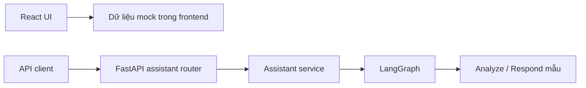
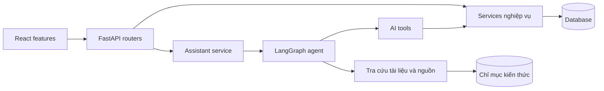

# EV Care — Sơ đồ kiến trúc

## Luồng đang hoạt động

Các trang UI hiện chưa gọi API. API client trong sơ đồ là bên gọi HTTP độc lập, ví dụ Swagger.

## Hướng phát triển

Database, retrieval và các service nghiệp vụ ngoài assistant mới có vị trí tổ chức, chưa được triển khai.
Xem [tài liệu kiến trúc](architecture/README.md).
