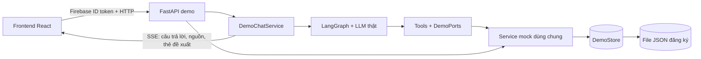

# Tóm tắt nối Agent, Backend và Frontend cho demo EV Care

Cập nhật: **04/10/2026**. Đây là tài liệu duy nhất trong `docs/plans`, tổng hợp kiến trúc, chức năng đã nối, cách chạy, kiểm thử và việc còn thiếu. Các kế hoạch và báo cáo cũ đã được gộp vào bản này.

## 1. Phạm vi và kiến trúc

Frontend React gọi backend FastAPI demo qua HTTP. Backend chạy agent LangGraph với LLM thật; tool của agent và API giao diện cùng đọc các service mock và một DemoStore. Nghiệp vụ demo không cần database SQL hoặc Redis. Entrypoint demo là `src.demo.main:app`, tách với backend production `src.main:app`.



| Thành phần | File chính và vai trò |
|---|---|
| API và đăng nhập | `backend/src/demo/main.py`, `dependency.py`: xác minh Firebase token, tạo context, mở API |
| Agent và chat | `backend/src/demo/chat_service.py`, `backend/src/agents/graph.py`: chạy graph, lưu hội thoại, trả SSE |
| Tool và adapter | `backend/src/demo/adapters.py`, `ports.py`: nối tool vào service, lấy danh tính từ AgentCtx |
| Nghiệp vụ chung | `backend/src/demo/services.py`, `store.py`, `fixtures.py`: xe, bảo dưỡng, giá, xưởng, slot, booking |
| Đăng ký | `backend/src/demo/registration.py`, `persistence.py`: hồ sơ, xác thực và lưu trạng thái theo Firebase UID |
| Chủ xưởng | `backend/src/demo/workshop.py`: phân quyền, lịch hẹn, sức chứa và chuyển trạng thái |
| Frontend HTTP/SSE | `frontend/src/shared/api/client.ts`, `features/assistant/transport/httpTransport.ts` |
| UI chat và đặt lịch | `frontend/src/features/assistant/`, `features/bookings/`, `features/workshop-board/` |

## 2. Luồng đã nối end to end

1. **Đăng nhập:** Firebase xác thực danh tính; frontend gửi Bearer token cho backend. Tài khoản mới nhập hồ sơ → thông tin xe/xưởng → xác thực. Tài khoản đăng ký dở tiếp tục bước đã lưu; tài khoản ACTIVE vào dashboard.
2. **Mở xe:** dashboard, thông tin xe, bảo dưỡng và dự toán tải qua API; không lấy số liệu từ mock độc lập trong trình duyệt.
3. **Chat:** frontend tạo hội thoại và gửi câu hỏi qua HTTP; backend nạp context xe và gọi graph/LLM.
4. **Tool:** agent tra hạn bảo dưỡng, dự toán, xưởng, slot và tài liệu qua service chung. Tổng giá do service tính; danh tính và quyền sở hữu do backend quyết định.
5. **SSE:** backend trả `message.accepted`, `status`, `token`, `message.completed` hoặc `error`. UI hiển thị câu trả lời, nguồn và thẻ đề xuất lịch hẹn.
6. **Xác nhận:** thẻ đề xuất chưa tạo booking/chưa giữ chỗ. Chủ xe mở wizard, backend kiểm lại slot và cấp confirmation token; chỉ nút Xác nhận mới gọi API tạo booking.
7. **Đọc lại:** ticket, lịch hẹn và chat tải lại được từ backend sau reload. Booking liên kết với hội thoại, tin nhắn và proposal đã tạo.
8. **Chủ xưởng:** tài khoản đúng quyền thấy cùng booking → check-in → bắt đầu → hoàn tất và ghi chi phí thực tế. Ticket, chat, tiến độ và lịch sử dịch vụ của chủ xe phản ánh kết quả này.

### Tool của agent

`read_maintenance`, `estimate_service_cost`, `find_workshops`, `get_available_slots`, `propose_booking`, `search_ev_knowledge`.

Tool `propose_booking` chỉ chuẩn bị đề xuất. Agent không tự tạo booking hoặc tự sinh confirmation token. Nguồn kiến thức lấy từ corpus nhỏ tại `knowledge/demo/`; ngoài corpus trả thiếu bằng chứng, không tự tạo citation.

### API chính

Các đường dẫn dưới đây đều có prefix `/api/v1`. Response thường dùng `{data: ...}`; danh sách tin nhắn có thêm thông tin phân trang.

| Nhóm | Endpoint |
|---|---|
| Đăng nhập/đăng ký chủ xe | `POST /oauth/sign-in`, `GET /onboarding`, `PUT /onboarding/profile`, `POST /onboarding/vehicle-verification` |
| Xe và bảo dưỡng | `GET /user-vehicles`, `GET /user-vehicles/{id}`, `GET /user-vehicles/{id}/maintenance-status`, `GET /user-vehicles/{id}/cost-estimate` |
| Hội thoại | `POST /conversations`, `GET /conversations`, `GET /conversations/{id}/messages`, `POST /conversations/{id}/messages` (SSE) |
| Xưởng và slot | `GET /workshops/nearby`, `GET /workshops/{id}/availability` |
| Đề xuất/booking | `GET /booking-proposals/{id}`, `POST /bookings`, `GET /bookings`, `GET /bookings/{id}` |
| Chủ xưởng | `POST /workshop-owner/oauth/sign-in`, `GET /workshop-owner/onboarding`, `GET /workshop-owner/bookings`, `POST /workshop-owner/bookings/{id}/transitions` |
| Reset lượt demo | `POST /demo/reset`: xóa chat/booking/proposal/token của chủ xe hiện tại; giữ đăng ký và dữ liệu tài khoản khác |

Backend kiểm quyền sở hữu của xe, hội thoại, proposal và booking. `POST /bookings` yêu cầu `Idempotency-Key`: gửi lại cùng key/payload trả booking cũ; khác payload trả lỗi. Kiểm sức chứa và ghi booking dùng cùng khóa để tránh hai người lấy slot cuối.

## 3. Tài khoản, fixture và cách lưu dữ liệu

| Vai trò | URL | Email demo |
|---|---|---|
| Chủ xe | http://127.0.0.1:5173/ | `demo@example.com` |
| Chủ xưởng 1 | http://127.0.0.1:5173/workshop/login | `workshop1@example.com` |
| Chủ xưởng 2 | Cùng cổng xưởng | `workshop2@example.com`, tạo trong emulator nếu cần |

Trong môi trường hiện tại, hai tài khoản đầu đã hoàn tất đăng ký. Trên máy mới cần tạo danh tính và hoàn tất đăng ký lần đầu. Quyền xưởng mặc định chỉ cấp cho hai email xưởng; có thể cấu hình ánh xạ email → UUID xưởng bằng `DEMO_WORKSHOP_OWNERS`. Tài khoản chủ xe không tự có quyền xưởng.

**Hai form khác nhau:** “Add new account” trong popup Auth Emulator tạo danh tính Google giả. Sau khi bấm “Sign in with Google.com”, popup đóng; ứng dụng mới mở form EV Care tại `/onboarding/profile` nếu danh tính này chưa đăng ký. Hiện nút Google dùng chung cho đăng nhập và đăng ký, chưa có nút Đăng ký EV Care riêng.

Fixture chủ xe: **VF6 Eco**, VIN `VF6ECO20240000001`, biển `51A-11111`, model `MDL-02`, năm 2024, ODO **38.210 km**. Snapshot đối chiếu OEM `VEH-003`; mốc minh họa 24.000 km, dự toán xưởng 1 là **400.000 ₫**, xưởng 2 là **420.000 ₫**. Khi đăng ký dùng hồ sơ giả, CCCD 12 chữ số và số điện thoại hợp lệ. Quy tắc, giá và xác thực xe là dữ liệu demo, không gọi hãng production.

- **Lưu vào file:** hồ sơ đăng ký, consent, kết quả xác thực xe, thông tin vận hành xưởng và trạng thái onboarding tại `data/demo/registration.json`, theo Firebase UID. Backend tự khôi phục khi restart. File đã được gitignore; đổi đường dẫn bằng `DEMO_REGISTRATION_FILE`.
- **Lưu trong RAM:** chat, checkpoint MemorySaver, booking, proposal và confirmation token. Reload trang giữ dữ liệu; restart backend mất các dữ liệu này.
- **Firebase Auth Emulator:** quản lý danh tính riêng, không nằm trong file đăng ký EV Care. File JSON không thay thế emulator.

Dùng hai profile trình duyệt hoặc một cửa sổ thường và một cửa sổ ẩn danh cho hai vai trò; hai tab cùng profile chia sẻ phiên Firebase.

## 4. Cách chạy trên Windows

Cài dependency từ root:

```powershell
npm --prefix frontend ci
npm --prefix tools/demo ci
```

Backend dùng Python environment đã có tại `.venv` ở root trên máy hiện tại. Nếu cài môi trường mới, chạy `uv sync` từ `backend/` và dùng interpreter tương ứng.

Giữ key LLM trong `.env` root, không đưa vào frontend. Có thể chọn provider bằng `DEMO_LLM_PROVIDER=gemini|openai` và model bằng `DEMO_LLM_MODEL`. Thiếu cấu hình LLM thì chat báo lỗi, không trả câu trả lời giả.

**Terminal 1 — từ root, Firebase Auth Emulator:**

```powershell
npm --prefix tools/demo run auth
```

**Terminal 2 — từ `backend/`, backend demo:**

```powershell
$env:FIREBASE_AUTH_EMULATOR_HOST = '127.0.0.1:9099'
$env:VITE_FIREBASE_PROJECT_ID = 'demo-ev-care'
# Đặt đồng hồ demo lúc 09:00 hôm nay nếu cần đặt lịch/check-in trong ngày.
$env:DEMO_NOW = (Get-Date -Format 'yyyy-MM-dd') + 'T09:00:00+07:00'
..\.venv\Scripts\python.exe -m uvicorn src.demo.main:app --host 127.0.0.1 --port 8000
```

**Terminal 3 — từ root, frontend:**

```powershell
$env:VITE_FIREBASE_API_KEY = 'demo-api-key'
$env:VITE_FIREBASE_AUTH_DOMAIN = 'demo-ev-care.firebaseapp.com'
$env:VITE_FIREBASE_PROJECT_ID = 'demo-ev-care'
$env:VITE_FIREBASE_APP_ID = 'demo-app'
$env:VITE_FIREBASE_AUTH_EMULATOR_URL = 'http://127.0.0.1:9099'
$env:VITE_BACKEND_URL = 'http://127.0.0.1:8000'
$env:VITE_CHAT_TRANSPORT = 'http'
$env:VITE_API_MOCKS = 'off'
npm --prefix frontend run dev -- --host 127.0.0.1
```

Vite proxy `/api` tới backend. Chỉ chạy một backend trên cổng 8000, một worker, không auto-reload giữa lượt đặt lịch. Đồng hồ `DEMO_NOW` tiếp tục chạy từ mốc đã đặt; bỏ biến này để dùng giờ thật. Swagger: http://127.0.0.1:8000/docs.

## 5. Kịch bản trình diễn

1. Chủ xe đăng nhập, mở dashboard/xe và xem hạn bảo dưỡng.
2. Hỏi AI: “Xe tôi đến hạn bảo dưỡng gì? Dự toán ở xưởng demo 1 bao nhiêu?” Đối chiếu kết quả với màn dự toán.
3. Hỏi câu về bảo hành và mở nguồn tài liệu; thử câu ngoài corpus để thấy phản hồi thiếu bằng chứng.
4. Chọn xưởng demo 1, **hôm nay 14:00** khi dùng đồng hồ demo 09:00. Agent tạo thẻ; chủ xe mở wizard và bấm Xác nhận. Ghi lại mã lịch hẹn.
5. Chủ xưởng 1 đăng nhập ở profile khác, thấy cùng lịch → check-in → bắt đầu → hoàn tất, nhập chi phí thực tế.
6. Chủ xe reload ticket và chat, xem trạng thái hoàn tất, chi phí thực tế và lịch sử dịch vụ. Check-in chỉ mở đúng ngày hẹn; lịch ngày mai chưa thể check-in hôm nay.

## 6. Kiểm tra đã thực hiện và lệnh tái kiểm tra

Lần kiểm tra gần nhất: **24 test backend demo**, **129 test frontend**, Ruff, typecheck và build đạt. Kiểm tra trên trình duyệt sau restart thật: cả chủ xe và chủ xưởng vào dashboard; tài khoản ACTIVE mở đường dẫn form profile được chuyển về dashboard. Test backend kiểm tra cả đăng ký dở và hoàn tất sau restart, replay và phân quyền.

Trong phiên triển khai cũng đã chạy luồng LLM thật → đề xuất → xác nhận → ticket/chat reload và luồng hai vai trò → hoàn tất dịch vụ. Việc lưu JSON gần nhất được kiểm tra tập trung vào đăng ký/restart; không tuyên bố đã chạy lại toàn bộ LLM E2E sau mỗi chỉnh sửa.

```powershell
# Từ backend/
..\.venv\Scripts\python.exe -m pytest tests/test_demo -q
..\.venv\Scripts\python.exe -m ruff check src/demo tests/test_demo

# Từ root
npm --prefix frontend run typecheck
npm --prefix frontend test
npm --prefix frontend run build

# Từ tools/demo/, sau khi ba server đã chạy
node browser-smoke.mjs
node workshop-smoke.mjs
node showroom-smoke.mjs
node registration-smoke.mjs
```

Ảnh, video và JSON kết quả ở `tools/demo/artifacts/` (gitignore). Các script có thể tạo tài khoản giả/reset booking của tài khoản kiểm thử; chạy ngoài buổi trình diễn và dọn tài khoản thử sau đó. Script trình duyệt dùng Chrome; có thể đặt `DEMO_BROWSER_CHANNEL=msedge` nếu dùng Edge.

## 7. Giới hạn và phần phát triển tiếp

### Kiểm tra tích hợp với main ngày 05/10/2026

- Nhánh `integration/agent-demo-main` tích hợp `origin/main` vào bản demo, xử lý 18 file conflict. Giữ Firebase thật/emulator, HTTP/SSE và dữ liệu backend; không tự bật mock trình duyệt khi dùng `dev:demo`.
- Giữ cơ chế dependency và lazy graph mới của main, đồng thời giữ khả năng tiêm LLM/tools/checkpointer riêng cho demo. Đồng bộ yêu cầu `langchain-google-genai>=4.4.0` và lockfile.
- Frontend: typecheck, 129 test và build đạt. Backend: 41 test cục bộ đạt; Ruff đạt.
- Hai test agent production lỗi checkpointer nhận `_AsyncGeneratorContextManager`; đoạn gây lỗi cũng có trên main. Chưa sửa lifecycle Postgres trong lần xử lý conflict này.
- Đã chạy lại E2E với LLM thật sau merge khi người dùng cho phép, trên backend/frontend riêng ở cổng 8001/5174, Firebase Auth Emulator và dữ liệu demo; không reset backend đang dùng ở cổng 8000.
- `workshop-smoke.mjs` đạt: đăng nhập popup chủ xưởng, reload phiên, agent đề xuất lịch → chủ xe xác nhận → CONFIRMED → CHECKED_IN → IN_PROGRESS → COMPLETED. Chi phí thực tế 350.000 đ và trạng thái đồng bộ sang ticket/chat của chủ xe; tra cứu mã lịch và lịch sử dịch vụ đạt, không có lỗi JavaScript trình duyệt.
- `browser-smoke.mjs` đạt: ba lượt LLM đề xuất/đặt lịch liên tiếp, ticket/chat sau reload, hai câu trả lời có nguồn và một câu hỏi thiếu bằng chứng, giao diện chi phí dự kiến. Kết quả/ảnh/video lưu trong `tools/demo/artifacts/`; tài khoản test mới được dọn sau kiểm tra.


- Chưa lưu bền vững booking/chat/checkpoint; bước tiếp theo là thay DemoStore bằng repository/database và mở lifecycle checkpointer production đúng cách.
- Demo đặt lịch dùng AUTO; chưa nối duyệt/từ chối lịch PENDING, duyệt báo giá, đổi lịch, khóa slot, thay đổi cài đặt nhắc hạn hoặc gửi nhắc hạn thật.
- QR mở đường dẫn ticket/tra cứu đã có; chưa demo quét camera thật. Hoàn tất chưa tính lại mốc bảo dưỡng tiếp theo hoặc lên lịch khảo sát/Discord.
- Retrieval local là corpus nhỏ; chưa nghiệm thu pipeline vector/RAG đầy đủ. SSE hiện trả text hoàn chỉnh sau lượt agent, chưa stream từng token của provider.
- Google production chưa được kiểm thử; kết quả hiện tại dùng Firebase Auth Emulator. Toàn bộ backend production không nằm trong phạm vi nghiệm thu này; lifecycle AsyncPostgresSaver của đường agent production cần kiểm tra trước khi chuyển sang DB thật.
- Frontend build còn cảnh báo bundle trên 500 kB.
- Hai bảng hướng dẫn “Demo 0/9”, “Bước 1/9” mới được xem trước; chưa khôi phục vào ứng dụng trong phiên này.

Tài liệu này mô tả bản nối demo hiện có. Không cần bật mock trình duyệt để đi end to end, và không cần đổi UI sang một giao diện khác khi thay service mock bằng backend thật.
