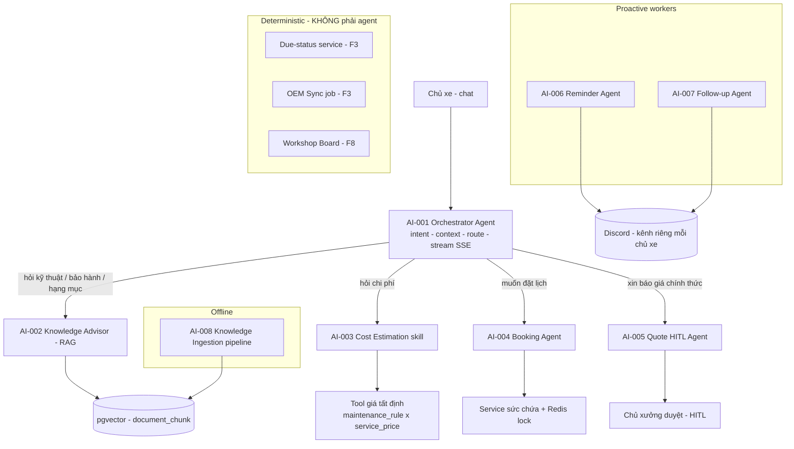

# Đề xuất danh mục AI-Agent — EV Care MVP

> Tài liệu **đề xuất** (Proposal), chưa phải spec chính thức. Mục tiêu: chốt xem hệ thống EV Care có **những AI-Agent nào**, ranh giới trách nhiệm của từng agent, và agent nào cần viết đặc tả đầy đủ theo template [`aa-xxx-sprint-x-spec.agent.md`](../templates/aa-xxx-sprint-x-spec.agent.md).
>
> **Nguồn chuẩn:** [PRD_EV_Care_MVP.md](../../product/PRD_EV_Care_MVP.md) (v3.5) và `docs/specs/**`. Khi tài liệu này khác PRD/specs thì PRD/specs là chuẩn.

---

## 0. Thông tin tài liệu

| Field | Value |
| --- | --- |
| Loại | Proposal — Danh mục AI-Agent |
| Version | v0.1 (Draft) |
| Status | Draft — chờ PO/Tech Lead/AI Team duyệt |
| Ngày | 2026-09-28 |
| Liên quan | [PRD v3.5](../../product/PRD_EV_Care_MVP.md), [core.entity.md](../entity/core.entity.md), [template agent spec](../templates/aa-xxx-sprint-x-spec.agent.md), [backend/guide/agent.md](../../../backend/guide/agent.md) |

---

## 1. Nguyên tắc phân tách agent

Trước khi liệt kê agent, cần tách rõ **cái gì là AI-Agent** và **cái gì là service tất định (deterministic)**. PRD §7 đã quy định:

> *Deterministic rules — Trạng thái đến hạn, giá, sức chứa, tạo booking do backend/tool xử lý. LLM chỉ gọi tool và diễn giải.*

Vì vậy tài liệu này dùng ba nhóm:

1. **AI-Agent (có LLM):** hiểu ý định người dùng, truy hồi tri thức, quyết định gọi tool nào, diễn giải kết quả, sinh ngôn ngữ.
2. **Deterministic service / tool (không LLM):** tính đến hạn, tính giá, kiểm sức chứa, tạo booking, đồng bộ OEM. Agent **gọi** chúng nhưng không tự suy ra con số.
3. **Pipeline offline:** ingest tài liệu, chunk, embed — chạy batch, không trong luồng hội thoại.

Ranh giới này là điểm quan trọng nhất của đề xuất: **nhiều "feature" trong PRD không phải agent** mà là service tất định được agent điều phối. Điều đó giữ đúng nguyên tắc no-hallucination về số liệu.

---

## 2. Tổng quan kiến trúc đề xuất

Đề xuất cho MVP (team 4 người, ưu tiên đơn giản và kiểm soát được):

**Một đồ thị hội thoại trung tâm (Orchestrator) + các sub-graph/skill chuyên biệt + hai worker chủ động + một pipeline ingest.**

Lý do chọn **orchestrator + sub-graph** thay vì nhiều agent độc lập handoff tự do:

- Dễ kiểm soát guardrail và trace tập trung (PRD §8 quan sát: trace id cho mỗi phiên và tool call).
- Một nơi nạp ngữ cảnh xe, một nơi giữ checkpoint LangGraph, một nơi stream SSE.
- Phù hợp quy mô team và mốc Demo 1/Demo 2.

Đây là **điểm cần chốt** — xem [§6 Câu hỏi mở](#6-câu-hỏi-mở-cần-chốt), Q-A01.

---

## 3. Danh mục AI-Agent đề xuất

| ID | Agent | Tên file đề xuất (theo `backend/guide/agent.md`) | Loại | Feature PRD | Cần .agent.md? |
| --- | --- | --- | --- | --- | --- |
| **AI-001** | Orchestrator / Điều phối hội thoại | `orchestrator_agent` (hoặc `care_graph`) | Conversational graph | F3–F6 (routing), F4 lưu hội thoại | Có — ưu tiên cao |
| **AI-002** | Knowledge Advisor (RAG có trích nguồn) | `knowledge_agent` | Conversational sub-graph / tool | F4, phần bảo hành của F5 | Có — ưu tiên cao |
| **AI-003** | Cost Estimation (dự toán) | `cost_estimation_agent` | Skill + tool tất định | F5 | Có |
| **AI-004** | Booking (đặt lịch hội thoại) | `booking_agent` | Conversational sub-graph + HITL nhẹ | F6, F6b | Có — ưu tiên cao |
| **AI-005** | Quote HITL (báo giá có người duyệt) | `quote_agent` | Conversational + HITL | F5b | Có |
| **AI-006** | Reminder (nhắc chủ động) | `reminder_agent` | Proactive worker (job) | F7 | Có |
| **AI-007** | Follow-up / CRM sau dịch vụ | `follow_up_agent` | Proactive worker (job) | F9 | Nên có |
| **AI-008** | Knowledge Ingestion | `ingestion_agent` (pipeline) | Batch offline | Hạ tầng cho F4 | Nên có (dạng pipeline spec) |

**Không phải AI-Agent** (ghi lại để tránh nhầm khi lập spec): Due-status service (F3), OEM Sync job (F3, theo memory *ODO chỉ đồng bộ từ hãng*), Capacity-check service (F6), Workshop Board (F8) — đều là logic tất định/CRUD.

---

## 4. Mô tả từng agent (rút gọn theo template)

Mỗi mục dưới đây tóm tắt các phần cốt lõi của [template](../templates/aa-xxx-sprint-x-spec.agent.md): Objective, Responsibilities, Intent, Knowledge/RAG, Tools, HITL, Guardrails. Khi được duyệt, mỗi agent tách thành một file `.agent.md` riêng.

### AI-001 — Orchestrator Agent

- **Objective:** Là điểm vào duy nhất của mọi tin nhắn chat. Nhận diện ý định, nạp ngữ cảnh xe, định tuyến đến agent chuyên biệt, giữ checkpoint hội thoại, stream câu trả lời qua SSE, ghi `chat_message`.
- **Responsibilities:** intent routing; nạp context (model, ODO, trạng thái bảo hành, trạng thái đến hạn) một lần cho cả phiên; quản lý bộ nhớ hội thoại (LangGraph checkpoint trên Postgres); áp guardrail chung (privacy, confirm-before-side-effect).
- **Non-responsibilities:** không tự trả lời khẳng định kỹ thuật (đẩy sang AI-002); không tự tính giá/sức chứa.
- **Supported intents (đề xuất):** `ASK_MAINTENANCE_KNOWLEDGE`, `ASK_WARRANTY`, `ASK_COST`, `BOOK_APPOINTMENT`, `REQUEST_QUOTE`, `MANAGE_BOOKING` (huỷ/đổi), `SMALL_TALK / OUT_OF_SCOPE`.
- **Tools/handoff:** gọi AI-002/003/004/005 như sub-graph; tool đọc ngữ cảnh xe; tool ghi/đọc hội thoại.
- **HITL:** không trực tiếp; ủy quyền cho AI-005.
- **Guardrails:** chủ xe chỉ thấy dữ liệu của mình (AC-F4-05); không đưa VIN/CCCD vào prompt khi không cần; ý định ngoài phạm vi → lịch sự từ chối, gợi ý liên hệ xưởng.
- **Trace:** `conversation_id`, `agent_run_id`, `intent`, `status`.

### AI-002 — Knowledge Advisor (RAG)

- **Objective:** Trả lời câu hỏi kỹ thuật/bảo hành/hạng mục **chỉ dựa trên tài liệu chính hãng đã ingest**, luôn kèm trích dẫn.
- **Knowledge/RAG:** `official_document` → `document_chunk` (pgvector 1024 chiều, `bge-m3`); filter theo `model_id`, loại tài liệu, phiên bản.
- **Guardrails (cốt lõi của MVP):** *No source = no claim* — không tìm thấy đoạn đủ liên quan thì không khẳng định, nói rõ chưa có dữ liệu chính hãng, gợi ý liên hệ xưởng (AC-F4-02). Không tự nêu grace period / ngưỡng km mất bảo hành nếu tài liệu không ghi (PQ-07). Mỗi khẳng định ≥ 1 trích dẫn hợp lệ (AC-F4-01).
- **Response:** câu trả lời + trích dẫn (tên tài liệu, phiên bản, đoạn) + gợi ý hành động tiếp theo.
- **Eval:** bộ ≥ 60 câu có đáp án chuẩn, ≥ 15 câu "bẫy" để đo tỉ lệ từ chối đúng (PRD §10).

### AI-003 — Cost Estimation

- **Objective:** Đưa ra dự toán chi phí theo model + mốc ODO. **LLM không tự cộng số** — chỉ gọi tool và diễn giải.
- **Tool tất định:** ghép `maintenance_rule` (hạng mục theo mốc) × `service_price` (giá theo xưởng, `model_id` + `item_code`); thiếu giá xưởng → `maintenance_rule.estimated_cost` gắn nhãn "giá tham khảo" (EDGE-004).
- **Guardrails:** tách hạng mục trong bảo hành / tính phí; mọi con số gắn nhãn **"Chi phí ước tính"** (trừ báo giá đã duyệt); tổng đúng bằng tổng tool trả về (AC-F5-01).
- **Ghi chú kiến trúc:** có thể triển khai như **tool của AI-001** thay vì agent LLM riêng; giữ ID riêng để dễ viết spec và eval. Xem Q-A02.

### AI-004 — Booking Agent

- **Objective:** Dẫn dắt chủ xe đặt lịch qua chat theo sức chứa xưởng, **chỉ tạo booking khi có xác nhận rõ**.
- **Flow:** thu thập xưởng/ngày/giờ (mặc định xưởng ưa thích, hạng mục từ mốc đến hạn) → gọi service sức chứa → nếu hết chỗ đề xuất 2–3 phương án → hiển thị thẻ tóm tắt → chờ bấm Xác nhận → tạo booking + QR.
- **Tool tất định (dùng chung với UI):** capacity-check + tạo booking với **Redis lock + kiểm tra lại trong transaction** (AC-F6-01: 20 request đồng thời, đúng 1 thành công). Giữ chỗ `pending` với `hold_expires_at`, hết hạn → `cancelled`.
- **HITL / confirm:** *confirm before side effect* — không tạo/huỷ/đổi khi chưa xác nhận (AC-F6-02). Huỷ/đổi lịch (F6b) theo cùng agent.
- **Guardrails:** chỉ đặt cho xe thuộc chủ xe; chỉ khung trong giờ hoạt động xưởng.
- **Eval:** ≥ 50 câu đặt lịch, đo trích xuất đúng xưởng/ngày/giờ ≥ 90%.

### AI-005 — Quote HITL Agent

- **Objective:** Lập báo giá nháp từ dự toán và đưa vào quy trình **chủ xưởng duyệt** (Human-in-the-Loop).
- **Flow:** AI lập `quote` nháp → chủ xe "Gửi xưởng duyệt" → `pending_approval` → chủ xưởng duyệt/sửa/từ chối kèm `reviewer_note`.
- **HITL states:** `PENDING_REVIEW` → `APPROVED` / `REJECTED` / `MODIFIED`; báo giá có `expires_at` (AC-F5b-01: chỉ `approved` còn hạn mới gắn được booking).
- **Guardrails:** đặt lịch không bắt buộc có báo giá (AF-001); báo giá bị từ chối hiển thị lý do (AC-F5b-02).
- **Ghi chú:** "Should" trong PRD (S3) — ưu tiên sau nhóm F4/F5/F6.

### AI-006 — Reminder Agent (chủ động)

- **Objective:** Nhắc mốc bảo dưỡng và nhắc lịch hẹn 24h, gửi qua **Discord — kênh riêng mỗi chủ xe** ([[notification-channels-roadmap]]: MVP chỉ Discord).
- **Trigger:** job hằng ngày (nhắc mốc, cấp `early/warning/urgent/expired`, tối đa 1 lần/xe/tuần, dừng khi mốc đã có booking); job 24h trước hẹn.
- **Guardrails nội dung:** không VIN/SĐT/email/CCCD; biển số che một phần; kèm link mở app. Chưa kết nối Discord → ghi "chưa có nơi nhận", không đổi kênh khác. Gửi lỗi → retry backoff rồi ghi nhận thất bại.
- **LLM hay template?** Nội dung bị ràng buộc chặt (không dữ liệu nhạy cảm) nên có thể dùng template tĩnh; LLM chỉ để cá nhân hoá câu chữ nếu cần — xem Q-A03.
- **Dùng chung `NotificationService`** có adapter theo kênh (NOTI-01) để phase sau thêm Email/SMS/Telegram/Slack.

### AI-007 — Follow-up Agent (chủ động)

- **Objective:** 12h sau khi booking `completed`, gửi 1 câu hỏi thăm; phản hồi có vấn đề → tạo `support_ticket` giao chủ xưởng.
- **Constraint:** mỗi booking tối đa 1 follow-up (BR-006); tự đóng sau 72h nếu không phản hồi (PQ-05). Kênh: Discord (dùng chung AI-006).
- **Ghi chú:** "Could" (S4) — làm sau khi Must đạt Demo 2.

### AI-008 — Knowledge Ingestion (pipeline offline)

- **Objective:** Ingest PDF tài liệu chính hãng → chunk → embed `bge-m3` (1024) → ghi `document_chunk` (pgvector, HNSW). Là hạ tầng cho AI-002.
- **Không trong luồng hội thoại.** ChromaDB chỉ dùng thử nghiệm chunking/eval offline; pgvector là nguồn duy nhất lúc chạy.
- **Ghi chú:** có thể coi là pipeline hơn là "agent"; viết spec dạng pipeline/ingestion.

---

## 5. Lộ trình viết đặc tả `.agent.md`

Ưu tiên theo mốc phát hành PRD §11:

| Mốc | Agent cần spec đầy đủ |
| --- | --- |
| M3–M4 (Demo 1) | AI-001, AI-002, AI-003 |
| M5 (Demo 2 chuẩn bị) | AI-004, AI-005 |
| M6 (Demo 2) | AI-006 |
| M7–M8 | AI-007, AI-008 |

Đặt file tại `docs/specs/ai-agent/`, đặt tên theo template `ai-xxx-sprint-x-spec.agent.md`:

| Agent | Spec |
| --- | --- |
| AI-001 | [ai-001-sprint-2-spec.agent.md](ai-001-sprint-2-spec.agent.md) |
| AI-002 | [ai-002-sprint-2-spec.agent.md](ai-002-sprint-2-spec.agent.md) |
| AI-003 | [ai-003-sprint-2-spec.agent.md](ai-003-sprint-2-spec.agent.md) |
| AI-004 | [ai-004-sprint-3-spec.agent.md](ai-004-sprint-3-spec.agent.md) |
| AI-005 | [ai-005-sprint-3-spec.agent.md](ai-005-sprint-3-spec.agent.md) |
| AI-006 | [ai-006-sprint-2-spec.agent.md](ai-006-sprint-2-spec.agent.md) |
| AI-007 | [ai-007-sprint-4-spec.agent.md](ai-007-sprint-4-spec.agent.md) |
| AI-008 | [ai-008-sprint-2-spec.agent.md](ai-008-sprint-2-spec.agent.md) |

---

## 6. Câu hỏi mở (cần chốt)

| ID | Câu hỏi | Đề xuất của tôi |
| --- | --- | --- |
| Q-A01 | **Kiến trúc:** một orchestrator + sub-graph (đề xuất §2), hay nhiều agent độc lập handoff tự do? | Orchestrator + sub-graph cho MVP — kiểm soát trace/guardrail tập trung, hợp quy mô team. |
| Q-A02 | Cost Estimation (AI-003) và Booking (AI-004) là **agent LLM riêng** hay chỉ là **tool/sub-graph của AI-001**? | Cost = tool của AI-001; Booking = sub-graph riêng (vì có nhiều lượt thu thập slot + HITL nhẹ). |
| Q-A03 | Reminder/Follow-up: nội dung Discord dùng **template tĩnh** hay **LLM soạn**? | Template tĩnh cho MVP (nội dung bị ràng buộc, tránh chi phí + rủi ro lộ dữ liệu); LLM để phase sau. |
| Q-A04 | Agent có được **ghi** `customer_profile_cdp` không, hay chỉ đọc? (PRD ghi "CDP hành vi" out-of-scope) | Chỉ đọc trong MVP; không cá nhân hoá bằng CDP hành vi. |
| Q-A05 | Có tách riêng một **Warranty agent** khỏi Knowledge Advisor không? | Không — gộp vào AI-002 vì cùng nguồn tài liệu và cùng guardrail no-source-no-claim. |
| Q-A06 | Chốt **model LLM** (Gemini Flash-tier) và giới hạn token/latency cho từng agent? | Theo Tech Spec; đề xuất áp NFR chat của PRD §8 làm trần cho AI-001/002/004. |
| Q-A07 | Ai sở hữu **bộ eval + guardrail CI** cho từng agent (PRD §10 yêu cầu eval RAG/NLU/giá)? | AI Team; gắn eval vào CI trước Demo 1. |

---

## 7. Truy vết

| Mục | Nguồn |
| --- | --- |
| Feature F1–F9 | [PRD §5, §6](../../product/PRD_EV_Care_MVP.md) |
| Nguyên tắc kiểm soát AI | [PRD §7](../../product/PRD_EV_Care_MVP.md) |
| Template agent spec | [aa-xxx-sprint-x-spec.agent.md](../templates/aa-xxx-sprint-x-spec.agent.md) |
| Quy ước đặt tên agent | [backend/guide/agent.md](../../../backend/guide/agent.md) |
| Entity liên quan | [core.entity.md §14.5](../entity/core.entity.md) |
| Kênh thông báo | PRD F7, NOTI-01 |
