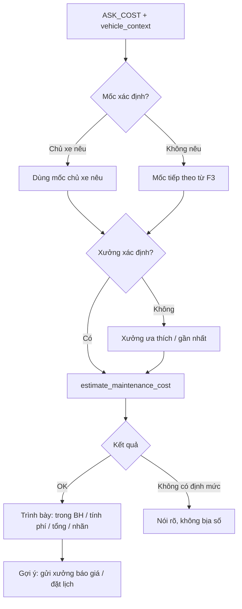
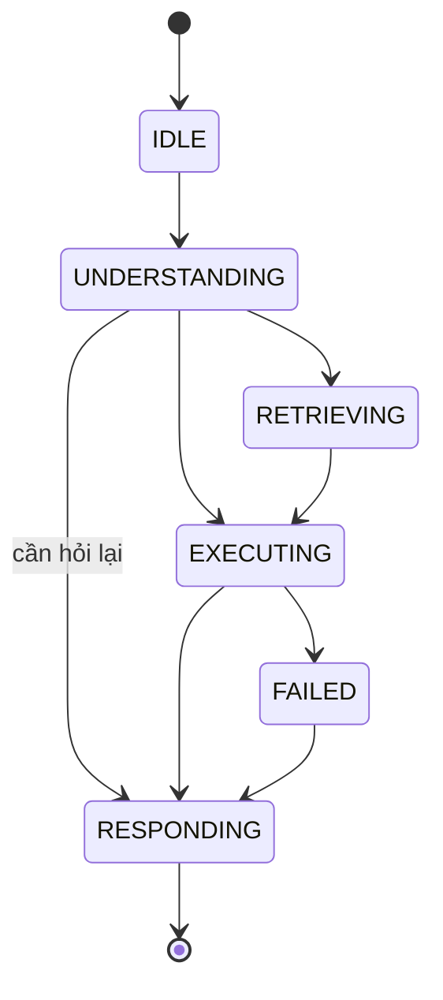

# AI-Agent Specification — AI-003 Cost Estimation

> **Cập nhật phạm vi (02/10/2026):** các phần dưới đây trong tài liệu này không còn áp dụng.
>
> - Báo giá / duyệt báo giá (`quote`, `quote_item`, us-049): **đã bỏ**. Đặt lịch không gắn báo giá; mọi con số chi phí là ước tính (F5), chi phí cuối cùng do xưởng xác nhận khi kiểm tra xe.

> Đặc tả hành vi của **Cost Estimation** — đưa ra dự toán chi phí bảo dưỡng theo model + mốc ODO. **LLM không tự cộng số**: tool tất định tính, LLM chỉ gọi tool và diễn giải.
>
> **Nguồn:** [00-ai-agents-proposal.md](00-ai-agents-proposal.md) (AI-003), [PRD v3.5 §F5, §7](../../product/PRD_EV_Care_MVP.md). Khi tài liệu này khác PRD/FF thì PRD/FF là chuẩn.
>
> **Kiến trúc `[Đề xuất]` (Q-A02):** triển khai như **skill/tool của AI-001**, không phải agent LLM riêng. Giữ ID `AI-003` để viết spec và eval độc lập.
>
> **Quy ước mã:** dải `3xx`.

---

# 1. Document Information

| Field                           | Value |
| ------------------------------- | ----- |
| Agent Spec ID                   | `AI-003` |
| Agent Name                      | Cost Estimation (`cost_estimation_agent`) |
| Feature / Use Case              | F5 — Dự toán chi phí theo model + mốc |
| Document Version                | `v1.0` |
| Status                          | `Draft` |
| Product / Project               | EV Care — AI Agent Chăm sóc sau bán & lịch bảo dưỡng xe điện |
| Agent Owner                     | AI Team |
| Author                          | Team 4 Người |
| Reviewer                        | Tech Lead |
| Stakeholders                    | PO, Backend, AI Team, Chủ xưởng |
| Created Date                    | `2026-09-28` |
| Updated Date                    | `2026-09-28` |
| Related Functional Spec         | [us-045 FF](../sprint-2/feature-functional/us-045-sprint-2-spec.ff.md) · [us-017 FF (mốc tiếp theo)](../sprint-2/feature-functional/us-017-sprint-2-spec.ff.md) |
| Related API Spec                | [us-045 API](../sprint-2/api/us-045-sprint-2-spec.api.md) |
| Related Entity Spec             | [maintenance_rule](../entity/maintenance/maintenance_rule.entity.md) · [service_price](../entity/workshop/service_price.entity.md) · [workshop](../entity/workshop/workshop.entity.md) |
| Related PRD                     | [PRD §F5, §7](../../product/PRD_EV_Care_MVP.md) |
| Related Architecture            | [00-ai-agents-proposal.md §2, Q-A02](00-ai-agents-proposal.md) |
| Related Prompt / Knowledge Spec | [AI-002](ai-002-sprint-2-spec.agent.md) (trích dẫn hạng mục) |

---

# 2. Agent Overview

## 2.1 Agent Description

Khi chủ xe hỏi chi phí, AI-001 gọi skill Cost Estimation. Skill gọi tool tất định `estimate_maintenance_cost`: ghép hạng mục của mốc (`maintenance_rule`) với giá của xưởng (`service_price`, theo `model_id` + `item_code`). LLM chỉ trình bày kết quả tool, tách hạng mục **trong bảo hành** và **tính phí**, gắn nhãn "Chi phí ước tính".

## 2.2 Agent Objective

Chủ xe nhận dự toán có tổng **đúng bằng** tổng tool trả về, phân rõ miễn phí / tính phí, và biết con số là ước tính.

## 2.3 User Objective

Biết trước lần bảo dưỡng tới gồm những gì và tốn khoảng bao nhiêu ở xưởng mình định đến.

## 2.4 Business Value

- Giải quyết PP-03 (G2).
- Giảm cuộc gọi hỏi giá tới xưởng (PP-05).
- Là đầu vào cho báo giá HITL (AI-005) và chi phí ước tính của booking (AI-004).

## 2.5 Agent Responsibilities

- Xác định mốc cần dự toán (mặc định mốc tiếp theo từ F3).
- Xác định xưởng (mặc định xưởng ưa thích).
- Gọi tool tính giá và trình bày đúng kết quả.
- Gắn nhãn ước tính / giá tham khảo.
- Gợi ý bước tiếp theo: gửi xưởng báo giá (AI-005), đặt lịch (AI-004).

## 2.6 Agent Non-Responsibilities

- Không tự cộng, làm tròn, giảm giá hay sửa số.
- Không khẳng định quyền lợi bảo hành cho trường hợp cá nhân — chỉ nêu cờ `is_covered_by_warranty` của định mức.
- Không lập báo giá chính thức (AI-005).
- Không báo giá sửa chữa ngoài định mức bảo dưỡng.

---

# 3. Scope

## 3.1 In Scope

- Dự toán theo mốc tiếp theo hoặc mốc chủ xe nêu.
- Dự toán tại xưởng ưa thích hoặc xưởng chủ xe nêu.
- So sánh dự toán giữa 2–3 xưởng khi chủ xe yêu cầu `[Đề xuất]`.

## 3.2 Out of Scope

- Chi phí sửa chữa, phụ tùng ngoài định mức, va chạm.
- Khuyến mãi, gói dịch vụ, thanh toán.
- Chi phí thực tế sau kiểm tra (do xưởng quyết định).

---

# 4. Actors & Systems

## 4.1 Actors

| Actor | Type | Responsibility |
| --- | --- | --- |
| Chủ xe | User | Hỏi chi phí |
| AI-001 Orchestrator | Agent | Gọi skill, gộp phản hồi |
| Chủ xưởng | Human | Sở hữu bảng giá `service_price` |

## 4.2 Supporting Systems

| System | Purpose | Read / Write |
| --- | --- | --- |
| `maintenance_rule` | Hạng mục theo mốc, `is_covered_by_warranty`, `estimated_cost` | Read |
| `service_price` | Giá theo xưởng, `valid_from`/`valid_to` | Read |
| `workshop` | Xưởng, trạng thái `active` | Read |
| `MaintenanceStatusService` (F3) | Mốc tiếp theo | Read |
| `vehicle_warranty` | Bảo hành còn hiệu lực | Read |
| AI-002 / `maintenance_rule_source` | Trích dẫn hạng mục | Read |

---

# 5. Agent Use Case

## UC-AI-301 — Dự toán chi phí mốc bảo dưỡng

### 5.1 Trigger

AI-001 định tuyến intent `ASK_COST`.

### 5.2 Preconditions

- Xe có `model_id`.
- `maintenance_rule` có định mức cho model (nếu không → EDGE-003).

### 5.3 Expected Outcome

Dự toán gồm danh sách hạng mục, giá từng mục, cờ bảo hành, nguồn giá, tổng tính phí.

### 5.4 Postconditions

- Kết quả dự toán lưu trong state phiên (AI-005/AI-004 dùng lại) và `message.meta.estimate`.
- Không ghi DB nghiệp vụ.

---

# 6. Agent Interaction Flow

## 6.1 Main Agent Flow



## 6.2 Agent Step Definition

| Step | Agent Action | Input | Output | Decision |
| --- | --- | --- | --- | --- |
| 1 | Trích mốc, xưởng từ câu hỏi | Tin nhắn | `milestone?`, `workshop?` | Thiếu → mặc định |
| 2 | Gọi tool giá | `model_id`, mốc, `workshop_id` | `estimate` | Lỗi → 10.3 |
| 3 | Lấy trích dẫn hạng mục | `model_id`, mốc | nguồn | Không bắt buộc |
| 4 | Trình bày | `estimate` | Câu trả lời | Chỉ dùng số tool trả |

---

# 7. Intent & Task Definition

## 7.1 Supported Intents

| Intent ID | Intent | Description | Example |
| --- | --- | --- | --- |
| `INT-301` | `ESTIMATE_NEXT_MILESTONE` | Chi phí mốc tiếp theo | "Bảo dưỡng lần tới hết bao nhiêu?" |
| `INT-302` | `ESTIMATE_SPECIFIC_MILESTONE` | Chi phí một mốc cụ thể | "Mốc 24.000 km bao nhiêu tiền?" |
| `INT-303` | `COMPARE_WORKSHOPS` | So sánh giữa xưởng `[Đề xuất]` | "Smart City với Mỹ Đình chỗ nào rẻ hơn?" |
| `INT-304` | `WARRANTY_COVERAGE_OF_ITEMS` | Hạng mục nào miễn phí | "Cái nào được miễn phí?" |

## 7.2 Intent Routing Rules

### Rule

- Có số km trong câu ("24.000", "24k") → `INT-302`, chuẩn hoá về mốc gần nhất trong `maintenance_rule`.
- Có ≥ 2 tên xưởng → `INT-303`.
- Không có mốc → `INT-301`.

### Examples

**User input:**

> Mốc 24k ở Mỹ Đình hết bao nhiêu?

**Detected intent:**

`INT-302`

**Reason / evidence:**

"24k" → 24.000 km; "Mỹ Đình" → tra `workshop` theo tên.

---

# 8. Context Requirements

## 8.1 Required Context

| Context | Required | Source | Description |
| --- | ---: | --- | --- |
| Vehicle model | Yes | `vehicle_context.model_id` | Khoá ghép giá |
| Next milestone | Yes | F3 | Mốc mặc định |
| Preferred workshop | No | Cấu hình chủ xe | Xưởng mặc định |
| Warranty | No | `vehicle_warranty` | Xe hết bảo hành → mọi mục tính phí? (AI-Q-302) |

## 8.2 Context Priority

1. Mốc/xưởng chủ xe nêu trong câu hỏi.
2. Mốc tiếp theo (F3), xưởng ưa thích.
3. Xưởng gần nhất theo khu vực.

## 8.3 Missing Context Handling

| Missing Context | Agent Behavior |
| --- | --- |
| Mốc tiếp theo (`UNKNOWN`) | Hỏi chủ xe muốn xem mốc nào, liệt kê các mốc có định mức |
| Xưởng | Dùng xưởng gần nhất và nói rõ; mời chọn xưởng khác |
| Không có định mức cho model | Không đưa số; nói rõ chưa có định mức (EDGE-003 `[Cần xác nhận]`) |

---

# 9. Knowledge & RAG

## 9.1 Knowledge Sources

| Knowledge Source | Type | Authority | Usage |
| --- | --- | --- | --- |
| `maintenance_rule` | Structured Data | Official | Hạng mục, cờ bảo hành, giá tham khảo |
| `service_price` | Structured Data | Xưởng | Giá thực tế của xưởng |
| `maintenance_rule_source` | Structured Data | Official | Trích dẫn hạng mục (qua AI-002) |

## 9.2 Knowledge Priority

1. `service_price` của xưởng còn hiệu lực (`valid_from ≤ today ≤ valid_to`).
2. `maintenance_rule.estimated_cost` → nhãn "giá tham khảo" (EDGE-004).

## 9.3 Retrieval Requirement

Không vector search. Truy vấn có cấu trúc theo (`model_id`, `odo_milestone`) và (`workshop_id`, `model_id`, `item_code`).

## 9.4 Evidence Requirement

- Mọi con số lấy từ tool.
- Mỗi hạng mục ghi nguồn giá: `WORKSHOP_PRICE` hoặc `REFERENCE_PRICE`.

## 9.5 No-Evidence Behavior

> Hiện EV Care chưa có định mức bảo dưỡng cho mốc này của VF6, nên mình chưa thể dự toán. Bạn có thể liên hệ xưởng để được báo giá.

---

# 10. Tool / Function Specification

## 10.1 Tool Inventory

| Tool ID | Tool Name | Purpose | Input | Output | Required |
| --- | --- | --- | --- | --- | ---: |
| `TOOL-301` | `estimate_maintenance_cost` | Tính dự toán tất định | `model_id`, `odo_milestone`, `workshop_id` | `items[]`, `chargeable_total`, `covered_count`, `currency`, `computed_at` | Yes |
| `TOOL-302` | `find_workshop` | Tra xưởng theo tên / gần nhất | `name?`, `region?` | `[{workshop_id, name, address}]` | No |
| `TOOL-303` | `get_rule_sources` | Trích dẫn hạng mục (dùng chung AI-002) | `model_id`, `odo_milestone` | nguồn | No |

**`items[]` của TOOL-301:** `{item_code, item_name, is_covered_by_warranty, price, price_source: WORKSHOP_PRICE | REFERENCE_PRICE, maintenance_rule_id}`.

**Công thức (backend, không phải LLM):** `chargeable_total = Σ price` của các mục `is_covered_by_warranty = false`; mục trong bảo hành có `price = 0` khi hiển thị trong tổng.

## 10.2 Tool Calling Rules

### TOOL-301 — `estimate_maintenance_cost`

**When to use**

Mọi câu hỏi chi phí có mốc + xưởng xác định.

**When not to use**

Câu hỏi hạng mục không hỏi giá (→ AI-002).

**Required parameters**

- `model_id` (từ context, không từ tin nhắn).
- `odo_milestone` (mốc có trong `maintenance_rule`).
- `workshop_id` (`status = active`).

**Validation before call**

- Mốc chủ xe nêu được chuẩn hoá về mốc tồn tại; không có → hỏi lại, liệt kê mốc hợp lệ.
- Xưởng `active`.

**Expected result**

Dự toán đầy đủ; tool dùng chung với API dự toán trên UI.

## 10.3 Tool Failure Handling

| Failure | Agent Behavior |
| --- | --- |
| Timeout | Thử lại 1 lần; vẫn lỗi → báo tạm thời chưa tính được, không đưa số |
| Invalid input | Mốc không tồn tại → liệt kê mốc hợp lệ; xưởng không tìm thấy → gợi ý xưởng gần |
| Business rejection | Xưởng `inactive` → nói rõ, gợi ý xưởng khác |
| Tool unavailable | Như timeout |

---

# 11. Agent Decision Logic

## 11.1 Decision Rules

### DEC-301 — Nguồn giá

**IF**

Xưởng có `service_price` còn hiệu lực cho (`model_id`, `item_code`).

**THEN**

Dùng giá xưởng.

**ELSE**

Dùng `maintenance_rule.estimated_cost`, gắn nhãn "giá tham khảo" (EDGE-004).

### DEC-302 — Gợi ý tiếp theo

**IF**

Dự toán thành công.

**THEN**

Gợi ý "Gửi xưởng báo giá" (AI-005) và "Đặt lịch" (AI-004); nói rõ đặt lịch không bắt buộc có báo giá (AF-001).

## 11.2 Decision Priority

| Priority | Decision |
| --- | --- |
| 1 | Số liệu chỉ từ tool |
| 2 | Nhãn ước tính / tham khảo |
| 3 | Mốc/xưởng chủ xe nêu |

---

# 12. Response Specification

## 12.1 Response Objectives

- Số khớp tuyệt đối với tool.
- Tách miễn phí / tính phí rõ ràng.
- Có nhãn "Chi phí ước tính".

## 12.2 Response Structure

```text
Dự toán mốc [X] km cho [model] tại [xưởng]:

Trong bảo hành (miễn phí):
- [hạng mục]

Tính phí:
- [hạng mục]: [giá] VNĐ  (giá tham khảo)*

Tổng chi phí ước tính: [chargeable_total] VNĐ

* Xưởng chưa có giá cho hạng mục này; đây là giá tham khảo của hãng.
Chi phí thực tế có thể thay đổi sau khi xưởng kiểm tra xe.

[Gợi ý: Gửi xưởng báo giá / Đặt lịch]
```

UI có thể render thẻ `card: estimate` từ `meta.estimate` thay vì văn bản.

## 12.3 Response Tone

Rõ ràng, trung lập, không khuyến mãi.

## 12.4 Response Language

Tiếng Việt; tiền VNĐ định dạng `1.250.000`.

## 12.5 Required Information

- Mốc, model, xưởng.
- Từng hạng mục + giá + nguồn giá.
- Tổng tính phí.
- Nhãn "Chi phí ước tính" và câu lưu ý chi phí thực tế.

## 12.6 Prohibited Response

Agent không được:

- Tự cộng, làm tròn, chiết khấu, ước lượng khoảng giá không từ tool.
- Bỏ nhãn "ước tính".
- Gọi dự toán là "báo giá" (báo giá chỉ khi chủ xưởng duyệt).
- Khẳng định cá nhân "xe bạn chắc chắn được miễn phí".

---

# 13. Memory & Personalization

## 13.1 Memory Types

| Memory | Description | Source | Retention |
| --- | --- | --- | --- |
| Vehicle Profile | `model_id`, mốc | AI-001 | Phiên |
| Conversation Memory | Dự toán gần nhất | State | Phiên; lưu trong `message.meta` |
| Preference | Xưởng ưa thích | Cấu hình | Theo tài khoản |

## 13.2 Conversation Context

- `last_estimate` (để AI-005 lập quote nháp, AI-004 điền chi phí ước tính).

## 13.3 Long-term Memory

Agent được phép lưu: dự toán trong `message.meta`.

Agent không được lưu: không ghi bảng nghiệp vụ.

## 13.4 Cold Start Behavior

Không áp dụng.

---

# 14. Guardrails & Safety

## 14.1 Knowledge Guardrails

- Giá chỉ từ `service_price` / `maintenance_rule`.
- Hạng mục có nguồn thì gắn trích dẫn; không có thì ghi "chưa có nguồn chính hãng".

## 14.2 Business Guardrails

- Nhãn "Chi phí ước tính" trên mọi con số (PRD §7).
- Tổng = tổng tool (AC-F5-01).
- Không dùng giá đã hết hiệu lực.

## 14.3 User Data Guardrails

- `model_id`, `user_vehicle_id` lấy từ context, không từ tin nhắn.

## 14.4 Technical Advice Guardrails

Không khuyên bỏ qua hạng mục để tiết kiệm.

## 14.5 Hallucination Handling

Bước hậu kiểm: so khớp mọi số trong câu trả lời với `estimate`; có số lạ → thay bằng bản render từ template.

> Mình chưa có đủ dữ liệu giá để dự toán mốc này.

---

# 15. Confidence & Uncertainty

## 15.1 Confidence Levels

| Level | Meaning | Behavior |
| --- | --- | --- |
| High | Mọi mục có giá xưởng | Trả dự toán |
| Medium | Một số mục dùng giá tham khảo | Trả dự toán + đánh dấu `*` |
| Low | Không có định mức | Không đưa số |

## 15.2 Uncertainty Statement

> Đây là chi phí ước tính dựa trên dữ liệu hiện có. Chi phí thực tế có thể thay đổi sau khi xưởng kiểm tra xe.

---

# 16. Human-in-the-Loop (HITL)

## 16.1 HITL Required Scenarios

| Scenario | Trigger | Human Role | Agent Behavior |
| --- | --- | --- | --- |
| Cần giá chính thức | Chủ xe muốn báo giá | Chủ xưởng | Chuyển AI-005 |

## 16.2 HITL Flow

Dự toán không cần duyệt. Báo giá chính thức theo [AI-005 §16](ai-005-sprint-3-spec.agent.md).

## 16.3 Human Decision States

Không áp dụng.

---

# 17. Fallback & Recovery

## 17.1 Fallback Scenarios

| Scenario | Fallback |
| --- | --- |
| No knowledge found | 9.5 |
| Tool unavailable | Không đưa số, gợi ý thử lại / liên hệ xưởng |
| Missing vehicle context | Không dự toán |
| Ambiguous intent | Hỏi mốc/xưởng |
| Low confidence | Không đưa số |

## 17.2 Recovery Strategy

Retry 1 lần → từ chối đưa số. Không bao giờ để LLM ước lượng giá.

---

# 18. Agent State

## 18.1 State List

| State | Meaning | Entry Condition | Exit Condition |
| --- | --- | --- | --- |
| `IDLE` | Chờ gọi | — | Được gọi |
| `UNDERSTANDING` | Trích mốc, xưởng | Được gọi | Đủ tham số / cần hỏi |
| `RETRIEVING` | Tra xưởng, mốc | Thiếu tham số | Đủ |
| `EXECUTING` | Gọi TOOL-301 | Đủ tham số | Có kết quả |
| `WAITING_HITL` | Không dùng | — | — |
| `RESPONDING` | Trình bày | Có kết quả | Xong |
| `FAILED` | Tool lỗi | Sau retry | Trả fallback |

## 18.2 State Transition



---

# 19. AI Business Rules

## BR-AI-301 — LLM không tính số

**Rule**

Mọi con số do TOOL-301 tính; LLM chỉ trình bày.

**Condition**

Mọi dự toán.

**Agent Behavior**

Hậu kiểm số; lệch → dùng template.

**Priority**

High

---

## BR-AI-302 — Nhãn ước tính

**Rule**

Mọi con số gắn "Chi phí ước tính"; giá từ `maintenance_rule` gắn thêm "giá tham khảo".

**Condition**

Có con số.

**Agent Behavior**

Gắn nhãn (AC-F5-02).

**Priority**

High

---

## BR-AI-303 — Tách bảo hành / tính phí

**Rule**

Tổng = tổng các mục tính phí (`is_covered_by_warranty = false`).

**Condition**

Mọi dự toán.

**Agent Behavior**

Hiển thị hai nhóm riêng.

**Priority**

High

---

# 20. Input / Output Contract

## 20.1 Agent Input

| Input | Required | Source | Description |
| --- | ---: | --- | --- |
| User Message | Yes | AI-001 | Câu hỏi |
| `vehicle_context` | Yes | AI-001 | `model_id`, mốc tiếp theo |
| `workshop_id` | No | Tin nhắn / cấu hình | Xưởng |

## 20.2 Agent Output

| Output | Required | Description |
| --- | ---: | --- |
| Response | Yes | Dự toán dạng văn bản |
| `estimate` | Yes | JSON kết quả TOOL-301 (cho `card` và AI-005) |
| `citations[]` | No | Nguồn hạng mục |
| Confidence | Yes | `HIGH / MEDIUM / LOW` |

---

# 21. Prompt / Instruction Specification

## 21.1 System Instruction

Bạn trình bày dự toán chi phí bảo dưỡng. Chỉ dùng số trong `<estimate>`. Không cộng, làm tròn hay sửa số. Luôn ghi "Chi phí ước tính".

## 21.2 Agent Role

Người trình bày số liệu chính xác.

## 21.3 Behavioral Instructions

- Nhóm "Trong bảo hành" và "Tính phí".
- Đánh dấu mục giá tham khảo.
- Kết thúc bằng gợi ý gửi báo giá / đặt lịch.

## 21.4 Tool Instructions

Gọi `estimate_maintenance_cost` đúng một lần cho mỗi (mốc, xưởng); `find_workshop` khi chủ xe nêu tên xưởng.

## 21.5 Knowledge Instructions

Không dùng kiến thức giá bên ngoài.

## 21.6 Prompt Variables

| Variable | Source | Required |
| --- | --- | ---: |
| `{vehicle_model}` | Context | Yes |
| `{milestone}` | F3 / tin nhắn | Yes |
| `{workshop_name}` | `workshop` | Yes |
| `{estimate}` | TOOL-301 | Yes |

---

# 22. AI-specific Error & Edge Cases

| Case ID | Scenario | Agent Behavior | User Outcome |
| --- | --- | --- | --- |
| `AI-EDGE-301` | Chủ xe nêu mốc không tồn tại (13.000 km) | Liệt kê mốc hợp lệ gần nhất | Chọn lại |
| `AI-EDGE-302` | Xưởng thiếu giá một số mục | Giá tham khảo + nhãn | Biết giới hạn |
| `AI-EDGE-303` | Không có định mức cho model | 9.5 | Liên hệ xưởng |
| `AI-EDGE-304` | Chủ xe hỏi "giảm giá được không" | Nói EV Care không quyết định giá, gợi ý hỏi xưởng khi gửi báo giá | Chuyển AI-005 |
| `AI-EDGE-305` | Xe hết bảo hành | Theo AI-Q-302 | — |
| `AI-EDGE-306` | Giá xưởng hết hiệu lực | Coi như không có giá xưởng | Giá tham khảo |

---

# 23. AI Evaluation Criteria

## 23.1 Functional Evaluation

| Metric | Expected |
| --- | --- |
| Dự toán khớp công thức | 100% (unit test tool — PRD §10) |
| Số trong câu trả lời khớp tool | 100% |
| Trích mốc/xưởng đúng | ≥ 95% |
| Nhãn ước tính có mặt | 100% |

## 23.2 Quality Evaluation

| Metric | Expected |
| --- | --- |
| Relevance | ≥ 4/5 |
| Hallucination Rate (số lạ) | 0% |

## 23.3 Evaluation Dataset

| Dataset | Purpose | Source |
| --- | --- | --- |
| Unit test `estimate_maintenance_cost` | Công thức, EDGE-004, giá hết hiệu lực | Backend |
| `eval/cost_questions.jsonl` `[Đề xuất]` | ≥ 30 câu hỏi giá, kiểm tra số + nhãn | AI Team |

---

# 24. Observability & Logging

## 24.1 Events to Log

- `cost.params_extracted`, `cost.tool_called`, `cost.reference_price_used`, `cost.number_mismatch` (hậu kiểm), `fallback.triggered`.

## 24.2 Trace Information

| Field | Description |
| --- | --- |
| `conversation_id` | Hội thoại |
| `agent_run_id` | Lượt |
| `intent` | `INT-30x` |
| `tool` | TOOL-301 + tham số |
| `knowledge_source` | `service_price` / `maintenance_rule` |
| `status` | `ok / no_rule / failed` |

---

# 25. Dependencies

| Dependency | Purpose | Owner | Required | Related Document |
| --- | --- | --- | ---: | --- |
| Service dự toán tất định | Tính giá | Backend | Yes | [us-045 FF](../sprint-2/feature-functional/us-045-sprint-2-spec.ff.md) |
| `maintenance_rule` đủ mốc | Hạng mục | PO / Backend | Yes | [entity](../entity/maintenance/maintenance_rule.entity.md) |
| `service_price` 3–5 xưởng mock | Giá | Backend | Yes | [entity](../entity/workshop/service_price.entity.md) |
| F3 | Mốc tiếp theo | Backend | Yes | [us-017 FF](../sprint-2/feature-functional/us-017-sprint-2-spec.ff.md) |

---

# 26. Assumptions

- Mỗi model hỗ trợ có đủ `maintenance_rule` theo mốc (PRD §13).
- `item_code` nhất quán giữa `maintenance_rule` và `service_price`.
- Tiền tệ duy nhất VNĐ.

---

# 27. AI Constraints

- Official source: hạng mục từ định mức hãng.
- Privacy: không cần dữ liệu cá nhân.
- Cost / token: một lần gọi LLM để trình bày; có thể render template không cần LLM.
- Latency: tool ≤ 500 ms p90 (PRD §8).

---

# 28. Terminology / Glossary

| Term ID | Term | Vietnamese Name | Definition | Example / Notes |
| --- | --- | --- | --- | --- |
| `AI-TERM-301` | Estimate | Dự toán | Chi phí ước tính do tool tính, chưa được xưởng duyệt | Khác báo giá |
| `AI-TERM-302` | Reference price | Giá tham khảo | `maintenance_rule.estimated_cost` khi xưởng thiếu giá | EDGE-004 |
| `AI-TERM-303` | Chargeable total | Tổng tính phí | Tổng giá các mục ngoài bảo hành | — |

---

# 29. Open Questions

| ID | Question | Owner | Status | Decision / Due Date |
| --- | --- | --- | --- | --- |
| `AI-Q-301` | Cost là tool của AI-001 hay agent riêng (Q-A02) | Tech Lead | Open | `[Đề xuất]` tool |
| `AI-Q-302` | Xe hết bảo hành: mục `is_covered_by_warranty = true` có chuyển sang tính phí không, giá lấy từ đâu? | PO | Open | — |
| `AI-Q-303` | Có hỗ trợ so sánh nhiều xưởng (`INT-303`) trong MVP? | PO | Open | `[Đề xuất]` tối đa 3 xưởng |
| `AI-Q-304` | EDGE-003 "quy định chung cho mẫu xe tương đương" mâu thuẫn no-source-no-claim; đề xuất không đưa số | PO | Open | — |

---

# 30. Acceptance Criteria

## AC-AI-301 — Tổng khớp tool

**Given**

Xưởng có đủ giá cho mốc 12.000 km của VF6.

**When**

Chủ xe hỏi chi phí.

**Then**

Tổng trong câu trả lời bằng đúng `chargeable_total` của tool (AC-F5-01).

---

## AC-AI-302 — Giá tham khảo có nhãn

**Given**

Xưởng thiếu giá một hạng mục.

**When**

Dự toán.

**Then**

Hạng mục đó hiển thị giá tham khảo kèm nhãn (AC-F5-02).

---

## AC-AI-303 — Không có định mức thì không đưa số

**Given**

Model chưa có `maintenance_rule`.

**When**

Chủ xe hỏi chi phí.

**Then**

Không có con số VNĐ trong câu trả lời.

---

# 31. Traceability

| Item | Reference |
| --- | --- |
| PRD | [F5, §7](../../product/PRD_EV_Care_MVP.md) |
| Functional Specification | [us-045 FF](../sprint-2/feature-functional/us-045-sprint-2-spec.ff.md) |
| User Story | `[Chưa đánh số]` |
| Use Case | UC-A (PRD §4) |
| Business Rules | EDGE-003, EDGE-004, AC-F5-01, AC-F5-02 |
| Agent Rules | BR-AI-301 … BR-AI-303 |
| Tool Specification | TOOL-301 … TOOL-303 |
| Acceptance Criteria | AC-AI-301 … AC-AI-303 |
| API Specification | [us-045 API](../sprint-2/api/us-045-sprint-2-spec.api.md) |
| Entity Specification | ENT-401, ENT-409, ENT-008 |
| Prompt Specification | `[Chưa có]` |
| Evaluation Dataset | `eval/cost_questions.jsonl` `[Đề xuất]` |
| Test Cases | `[Chưa có]` |
| GitHub Issue / Epic | `[Cần điền]` |

---

# 32. Related Documents

- [PRD](../../product/PRD_EV_Care_MVP.md)
- [Proposal AI-Agent](00-ai-agents-proposal.md)
- [AI-001](ai-001-sprint-2-spec.agent.md) · [AI-002](ai-002-sprint-2-spec.agent.md) · [AI-004](ai-004-sprint-3-spec.agent.md) · [AI-005](ai-005-sprint-3-spec.agent.md)

---

# 33. Change Log

| Version | Date | Author | Change |
| --- | --- | --- | --- |
| `v1.0` | `2026-09-28` | Team 4 Người | Initial version từ proposal AI-003 |

---

# 34. Approval

| Role | Name | Status | Date |
| --- | --- | --- | --- |
| Product Owner | Lê Đức Tùng | Pending | — |
| AI Owner | AI Team | Pending | — |
| Business Stakeholder | Mai Văn Trung | Pending | — |
| Technical Owner | Tech Lead | Pending | — |

---

# Appendix A — Example

### Input

```text
User: "Bảo dưỡng lần tới hết bao nhiêu?"
Context: VF6, mốc tiếp theo 12.000 km, xưởng ưa thích Smart City
```

### Agent Process

```text
1. INT-301 → mốc 12.000 (F3), xưởng Smart City
2. estimate_maintenance_cost(model=VF6, milestone=12000, workshop=smart-city)
   → 4 mục: 2 trong bảo hành, 2 tính phí (1 giá tham khảo)
3. Trình bày theo template; hậu kiểm số khớp
```

### Example Response

```text
Dự toán mốc 12.000 km cho VF6 tại xưởng Smart City:

Trong bảo hành (miễn phí):
- Kiểm tra hệ thống pin
- Kiểm tra hệ thống phanh

Tính phí:
- Thay lọc gió điều hoà: … VNĐ
- Thay dầu phanh: … VNĐ (giá tham khảo)*

Tổng chi phí ước tính: … VNĐ

* Xưởng chưa có giá cho hạng mục này; đây là giá tham khảo của hãng.
Chi phí thực tế có thể thay đổi sau khi xưởng kiểm tra xe.

Bạn muốn gửi xưởng báo giá chính thức, hay đặt lịch luôn?
```
