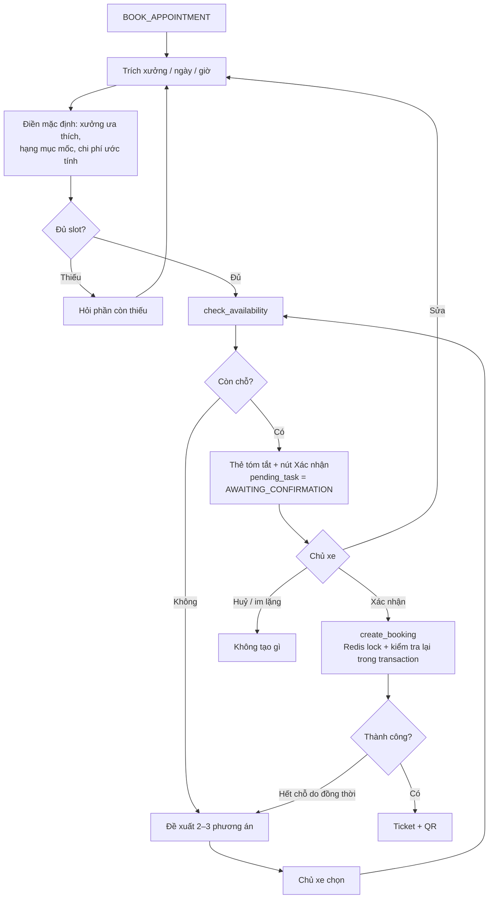
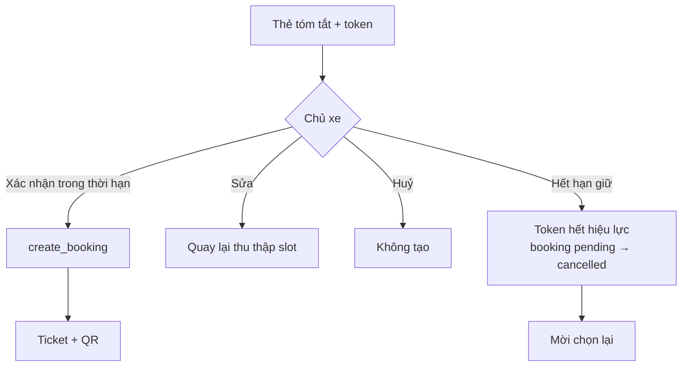
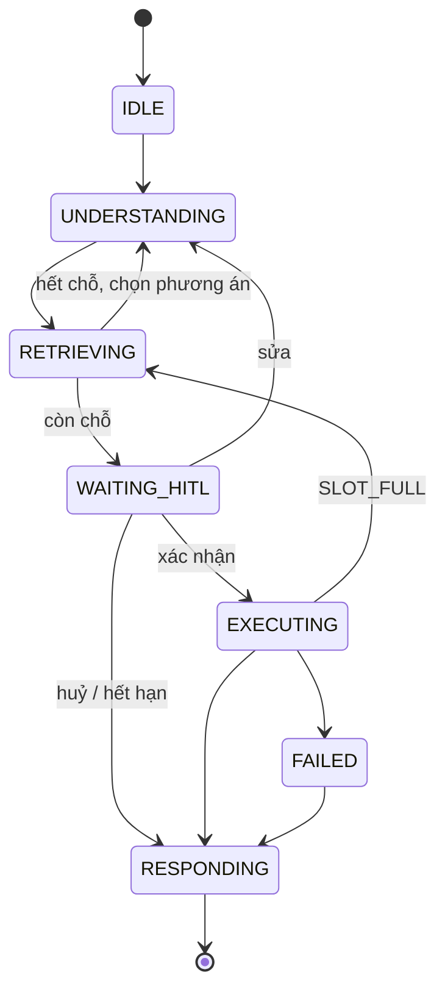

# AI-Agent Specification — AI-004 Booking Agent

> **Cập nhật phạm vi (02/10/2026):** các phần dưới đây trong tài liệu này không còn áp dụng.
>
> - Báo giá / duyệt báo giá (`quote`, `quote_item`, us-049): **đã bỏ**. Đặt lịch không gắn báo giá; mọi con số chi phí là ước tính (F5), chi phí cuối cùng do xưởng xác nhận khi kiểm tra xe.
> - Kết nối Discord (`user_discord_link`, ENT-417): **đã bỏ**. Nhắc bảo dưỡng, nhắc lịch hẹn và hỏi thăm hiện trong mục **Thông báo** của app; danh sách kênh ngoài (Zalo / Telegram / SMS / Email) vẫn có nhưng đều "Sắp có", bật nhắc không bắt buộc chọn kênh.

> **Cập nhật xác nhận đặt lịch (03/10/2026, [us-061](../sprint-4/feature-functional/us-061-sprint-4-spec.ff.md)):** chỉ nút **"Xác nhận đặt lịch"** trên thẻ đề xuất tạo booking (`API-QB-02`, backend kiểm chứng đề xuất / chủ xe / hội thoại / xe). Thay cho §7.2 và TOOL-403: câu gõ "xác nhận", "đồng ý đặt" **không** còn là `INT-403`; agent không có tool tạo / huỷ / đổi booking. Tool ghi duy nhất là `propose_booking` (chỉ tạo đề xuất, thẻ `BOOKING_PROPOSAL` thay cho `booking_summary`). Trạng thái HITL §16.3 ánh xạ sang `booking_proposal.status` (us-061 FF §12).

> Đặc tả hành vi của **Booking Agent** — dẫn dắt chủ xe đặt / huỷ / đổi lịch qua chat theo sức chứa xưởng, **chỉ tạo side effect khi có xác nhận rõ**.
>
> **Nguồn:** [00-ai-agents-proposal.md](00-ai-agents-proposal.md) (AI-004), [PRD v3.5 §F6, §F6b, §7](../../product/PRD_EV_Care_MVP.md). Khi tài liệu này khác PRD/FF thì PRD/FF là chuẩn.
>
> **Kiến trúc `[Đề xuất]` (Q-A02):** sub-graph riêng của AI-001 vì cần nhiều lượt thu thập slot và bước xác nhận.
>
> **Quy ước mã:** dải `4xx`.

---

# 1. Document Information

| Field                           | Value |
| ------------------------------- | ----- |
| Agent Spec ID                   | `AI-004` |
| Agent Name                      | Booking Agent (`booking_agent`) |
| Feature / Use Case              | F6 — Đặt lịch hội thoại theo sức chứa; F6b — Ticket, QR, huỷ/đổi |
| Document Version                | `v1.0` |
| Status                          | `Draft` |
| Product / Project               | EV Care — AI Agent Chăm sóc sau bán & lịch bảo dưỡng xe điện |
| Agent Owner                     | AI Team |
| Author                          | Team 4 Người |
| Reviewer                        | Tech Lead |
| Stakeholders                    | PO, Backend, Frontend, AI Team, Chủ xưởng |
| Created Date                    | `2026-09-28` |
| Updated Date                    | `2026-09-28` |
| Related Functional Spec         | [us-029 FF](../sprint-3/feature-functional/us-029-sprint-3-spec.ff.md) · [us-053 FF](../sprint-3/feature-functional/us-053-sprint-3-spec.ff.md) |
| Related API Spec                | [us-029 API](../sprint-3/api/us-029-sprint-3-spec.api.md) · [us-053 API](../sprint-3/api/us-053-sprint-3-spec.api.md) |
| Related Entity Spec             | [booking](../entity/maintenance/booking.entity.md) · [workshop](../entity/workshop/workshop.entity.md) · [quote](../entity/maintenance/quote.entity.md) |
| Related PRD                     | [PRD §F6, §F6b, §7, §10](../../product/PRD_EV_Care_MVP.md) |
| Related Architecture            | [00-ai-agents-proposal.md §2](00-ai-agents-proposal.md) |
| Related Prompt / Knowledge Spec | `[Chưa có]` |

---

# 2. Agent Overview

## 2.1 Agent Description

Sub-graph của [AI-001](ai-001-sprint-2-spec.agent.md). Thu thập xưởng, ngày, giờ; gọi service sức chứa (dùng chung với API đặt lịch trên UI); khi hết chỗ đề xuất 2–3 phương án; hiển thị thẻ tóm tắt; **chỉ tạo booking khi chủ xe bấm Xác nhận**. Cũng xử lý xem / huỷ / đổi lịch (F6b).

## 2.2 Agent Objective

Tạo booking đúng xưởng/ngày/giờ chủ xe muốn, không vượt sức chứa, không có side effect nào khi chưa xác nhận.

## 2.3 User Objective

Đặt được lịch bảo dưỡng 24/7 qua vài câu chat, không phải gọi nhiều xưởng.

## 2.4 Business Value

- Giải quyết PP-02, PP-06 (G3); huỷ/đổi sớm giải phóng slot (G5, PP-07).
- Chỉ số: median từ ý định tới xác nhận < 2 phút; hoàn tất ≥ 60% (PRD §10).

## 2.5 Agent Responsibilities

- Trích xuất xưởng/ngày/giờ từ tiếng Việt tự nhiên ("sáng thứ 7", "9h", "Smart City").
- Điền mặc định: xưởng ưa thích, hạng mục từ mốc đến hạn, chi phí ước tính (AI-003).
- Gọi service sức chứa; đề xuất phương án thay thế.
- Hiển thị thẻ tóm tắt và chờ xác nhận.
- Gắn báo giá `approved` còn hạn vào booking nếu chủ xe có.
- Huỷ / đổi lịch theo cùng nguyên tắc xác nhận.

## 2.6 Agent Non-Responsibilities

- Không tự tính sức chứa hay quyết định slot còn trống.
- Không tạo booking khi chưa xác nhận.
- Không xử lý check-in / trạng thái sau `confirmed` (Workshop Board F8).
- Không bắt buộc báo giá (AF-001).

---

# 3. Scope

## 3.1 In Scope

- Đặt lịch mới (1 xe, 1 xưởng, 1 khung giờ).
- Đề xuất khung gần nhất cùng xưởng hoặc xưởng khác cùng khu vực.
- Xem lịch sắp tới, huỷ, đổi lịch.
- Trả Booking Ticket + QR sau xác nhận.

## 3.2 Out of Scope

- Nhiều xe, đặt hộ người khác.
- Thanh toán / đặt cọc.
- Lịch theo thời lượng từng hạng mục (phase sau), nhiều ca/ngày, nghỉ lễ.
- Nút tương tác trên Discord (phase sau).

---

# 4. Actors & Systems

## 4.1 Actors

| Actor | Type | Responsibility |
| --- | --- | --- |
| Chủ xe | User | Cung cấp yêu cầu, bấm Xác nhận |
| Chủ xưởng | Human | Khoá chỗ thủ công, xử lý booking trên Board |
| AI-001 | Agent | Định tuyến, giữ `pending_task` |

## 4.2 Supporting Systems

| System | Purpose | Read / Write |
| --- | --- | --- |
| Capacity service (dùng chung UI) | Kiểm tra chỗ trống, phương án thay thế | Read |
| Booking service | Tạo `pending` + `hold_expires_at`, xác nhận, huỷ, đổi | Read / Write |
| Redis | Khoá giữ chỗ (TTL = thời gian giữ) | Write |
| `workshop`, `workshop_operating_hour` | Xưởng, giờ hoạt động, `total_technicians`, `emergency_slots_reserved` | Read |
| `quote` | Báo giá `approved` còn hạn | Read |
| AI-003 | Chi phí ước tính | Read |
| F3 | Hạng mục mốc đến hạn | Read |

---

# 5. Agent Use Case

## UC-AI-401 — Đặt lịch qua chat

### 5.1 Trigger

Intent `BOOK_APPOINTMENT`.

### 5.2 Preconditions

- Xe `verified` + `active` thuộc chủ xe.
- Có ít nhất một xưởng `active`.

### 5.3 Expected Outcome

Booking `confirmed` với mã booking + QR; hoặc chủ xe dừng mà không có booking nào được tạo.

### 5.4 Postconditions

- `booking` được tạo (khi xác nhận), `message.meta.booking_id` trỏ về tin nhắn xác nhận (AC-F4-06).
- Slot giữ tạm được giải phóng nếu hết hạn / chủ xe huỷ.

## UC-AI-402 — Huỷ / đổi lịch

### 5.1 Trigger

Intent `MANAGE_BOOKING`.

### 5.2 Preconditions

Chủ xe có booking `pending` hoặc `confirmed`.

### 5.3 Expected Outcome

Huỷ → giải phóng chỗ ngay. Đổi → kiểm tra sức chứa khung mới rồi mới giải phóng khung cũ (F6b).

### 5.4 Postconditions

Booking cũ `cancelled` / cập nhật; chủ xe nhận ticket mới khi đổi.

---

# 6. Agent Interaction Flow

## 6.1 Main Agent Flow



## 6.2 Agent Step Definition

| Step | Agent Action | Input | Output | Decision |
| --- | --- | --- | --- | --- |
| 1 | Trích slot | Tin nhắn + ngày hiện tại (Asia/Ho_Chi_Minh) | `workshop`, `date`, `time` | Mơ hồ → hỏi lại |
| 2 | Mặc định | Context | Slot đầy đủ | Không có xưởng ưa thích → hỏi |
| 3 | Kiểm tra chỗ | Slot | `available`, `alternatives[]` | Hết → phương án |
| 4 | Thẻ xác nhận | Slot + chi phí | `card: booking_summary` | Chờ chủ xe |
| 5 | Tạo booking | Xác nhận | `booking_id`, `booking_code`, QR | Xung đột → phương án |

---

# 7. Intent & Task Definition

## 7.1 Supported Intents

| Intent ID | Intent | Description | Example |
| --- | --- | --- | --- |
| `INT-401` | `CREATE_BOOKING` | Đặt lịch mới | "Đặt lịch 9h sáng thứ 7 ở Smart City" |
| `INT-402` | `CHOOSE_ALTERNATIVE` | Chọn phương án đề xuất | "Lấy 14h" / "cái thứ 2" |
| `INT-403` | `CONFIRM_BOOKING` | Xác nhận thẻ tóm tắt | Bấm "Xác nhận" |
| `INT-404` | `VIEW_BOOKING` | Xem lịch sắp tới | "Lịch của tôi khi nào?" |
| `INT-405` | `CANCEL_BOOKING` | Huỷ lịch | "Huỷ lịch thứ 7" |
| `INT-406` | `RESCHEDULE_BOOKING` | Đổi lịch | "Dời sang chủ nhật" |

## 7.2 Intent Routing Rules

### Rule

- `INT-403` **chỉ** được ghi nhận từ sự kiện UI bấm nút Xác nhận (có `confirmation_token` gắn với thẻ) **hoặc** câu xác nhận rõ ("xác nhận", "đồng ý đặt") ngay sau thẻ tóm tắt còn hiệu lực. Câu mơ hồ ("ok nhé", "được") khi chưa có thẻ **không** được coi là xác nhận.
- `INT-402` chỉ hợp lệ khi có danh sách phương án ở lượt trước.

### Examples

**User input:**

> Đặt lịch 9h sáng thứ 7 ở Smart City

**Detected intent:**

`INT-401`

**Reason / evidence:**

Có động từ đặt + xưởng + ngày + giờ. "Thứ 7" → thứ 7 gần nhất sau hôm nay; "9h sáng" → 09:00.

---

# 8. Context Requirements

## 8.1 Required Context

| Context | Required | Source | Description |
| --- | ---: | --- | --- |
| Vehicle | Yes | Context | `user_vehicle_id` |
| Next milestone + hạng mục | Yes | F3 | Hạng mục của booking |
| Preferred workshop | No | Cấu hình / gần nhất | Mặc định |
| Estimate | No | AI-003 | `estimated_cost` |
| Approved quote | No | `quote` | `approved`, chưa hết `expires_at` |
| Existing bookings | Yes | `booking` | Tránh đặt trùng, phục vụ huỷ/đổi |
| Current datetime | Yes | Hệ thống | Asia/Ho_Chi_Minh |

## 8.2 Context Priority

1. Thông tin chủ xe nêu trong lượt hiện tại.
2. Slot đã thu thập trong phiên.
3. Mặc định từ cấu hình.

## 8.3 Missing Context Handling

| Missing Context | Agent Behavior |
| --- | --- |
| Xưởng | Gợi ý xưởng ưa thích / gần nhất, hỏi xác nhận |
| Ngày | Hỏi ngày; gợi ý 3 ngày gần nhất còn chỗ |
| Giờ | Liệt kê khung còn chỗ trong ngày |
| Hạng mục (`UNKNOWN`) | Đặt "Bảo dưỡng định kỳ" chung, ghi chú xưởng kiểm tra |

---

# 9. Knowledge & RAG

## 9.1 Knowledge Sources

Không dùng RAG. Dữ liệu có cấu trúc: `workshop`, `workshop_operating_hour`, `booking`, `quote`.

## 9.2 Knowledge Priority

Không áp dụng.

## 9.3 Retrieval Requirement

Không áp dụng.

## 9.4 Evidence Requirement

Mọi thông tin chỗ trống, giờ hoạt động, mã booking lấy từ tool.

## 9.5 No-Evidence Behavior

Không có xưởng khả dụng trong 7 ngày `[Đề xuất]` → nói rõ, gợi ý liên hệ xưởng.

---

# 10. Tool / Function Specification

## 10.1 Tool Inventory

| Tool ID | Tool Name | Purpose | Input | Output | Required |
| --- | --- | --- | --- | --- | ---: |
| `TOOL-401` | `find_workshop` | Tra xưởng theo tên / khu vực | `name?`, `region?` | danh sách xưởng | No |
| `TOOL-402` | `check_availability` | Kiểm tra chỗ + phương án | `workshop_id`, `date`, `time_slot` | `available`, `remaining`, `alternatives[]` (≤ 3) | Yes |
| `TOOL-403` | `create_booking` | Tạo booking sau xác nhận | `user_vehicle_id`, `workshop_id`, `date`, `time_slot`, `quote_id?`, `confirmation_token` | `booking_id`, `booking_code`, `status`, `qr_url` | Yes |
| `TOOL-404` | `list_my_bookings` | Lịch sắp tới | `user_id` | bookings | No |
| `TOOL-405` | `cancel_booking` | Huỷ | `booking_id`, `confirmation_token` | trạng thái | No |
| `TOOL-406` | `reschedule_booking` | Đổi lịch | `booking_id`, slot mới, `confirmation_token` | booking mới | No |

## 10.2 Tool Calling Rules

### TOOL-402 — `check_availability`

**When to use**

Khi đủ xưởng + ngày + giờ, và lại ngay trước khi hiển thị thẻ xác nhận.

**When not to use**

Khi thiếu slot — hỏi trước.

**Required parameters**

- `workshop_id`, `date`, `time_slot`.

**Validation before call**

- Ngày ≥ hôm nay; khung giờ nằm trong giờ hoạt động xưởng.

**Expected result**

Quy tắc sức chứa do service tính: số booking `pending | confirmed | checked_in | in_progress` < `total_technicians − emergency_slots_reserved − số chỗ khoá` (PRD F6).

### TOOL-403 — `create_booking`

**When to use**

**Chỉ** sau `INT-403` với `confirmation_token` hợp lệ.

**When not to use**

Mọi trường hợp khác. LLM không được tự gọi tool này trong cùng lượt với việc hiển thị thẻ.

**Required parameters**

- `user_vehicle_id` từ context; `confirmation_token` do backend cấp khi render thẻ, gắn với đúng slot.

**Validation before call**

- Token chưa dùng, chưa hết hạn, slot trùng thẻ.
- `quote_id` (nếu có) `approved` và `expires_at` > now (AC-F5b-01, EDGE-006).

**Expected result**

Service lấy Redis lock, kiểm tra lại trong transaction, tạo booking `pending` với `hold_expires_at` rồi xác nhận `confirmed` `[Đề xuất: xác nhận ngay khi chủ xe bấm Xác nhận]`. Xung đột → `SLOT_FULL` + phương án.

## 10.3 Tool Failure Handling

| Failure | Agent Behavior |
| --- | --- |
| Timeout | Không khẳng định đã đặt; gọi `list_my_bookings` kiểm tra; báo trạng thái thật |
| Invalid input | Ngoài giờ hoạt động / ngày quá khứ → giải thích, đề xuất khung hợp lệ |
| Business rejection | `SLOT_FULL` → phương án; `QUOTE_EXPIRED` → đặt không kèm báo giá hoặc lập báo giá mới |
| Tool unavailable | Báo tạm thời không đặt được, gợi ý thử lại / gọi xưởng |

---

# 11. Agent Decision Logic

## 11.1 Decision Rules

### DEC-401 — Confirm before side effect

**IF**

Chưa có `INT-403` với token hợp lệ.

**THEN**

Không gọi `create_booking` / `cancel_booking` / `reschedule_booking`.

**ELSE**

Gọi tool tương ứng.

### DEC-402 — Hết chỗ

**IF**

`available = false`.

**THEN**

Đề xuất 2–3 phương án theo thứ tự: khung gần nhất cùng xưởng cùng ngày → cùng xưởng ngày kế → xưởng khác cùng khu vực cùng khung.

### DEC-403 — Đã có lịch

**IF**

Chủ xe đã có booking `pending/confirmed` sắp tới.

**THEN**

Hỏi muốn đổi lịch đó hay đặt thêm `[Đề xuất: MVP chỉ 1 booking mở/xe]`.

### DEC-404 — Đổi lịch

**IF**

`INT-406` được xác nhận.

**THEN**

Kiểm tra và giữ khung mới trước; thành công mới huỷ khung cũ (F6b).

## 11.2 Decision Priority

| Priority | Decision |
| --- | --- |
| 1 | Confirm before side effect |
| 2 | Kết quả service sức chứa |
| 3 | Mong muốn của chủ xe |
| 4 | Mặc định |

---

# 12. Response Specification

## 12.1 Response Objectives

- Ngắn, từng bước, mỗi lượt hỏi tối đa một thông tin thiếu.
- Luôn hiển thị rõ đã đặt hay chưa.

## 12.2 Response Structure

Thẻ tóm tắt (`card: booking_summary`):

```text
Xưởng: [tên] — [địa chỉ]
Thời gian: [thứ, dd/mm/yyyy, HH:mm]
Xe: [model] — [biển số che một phần]
Hạng mục: [mốc X km: ...]
Chi phí ước tính: [...] VNĐ
Báo giá: [mã / Không]
Giữ chỗ trong: 10 phút

[Xác nhận]  [Sửa]  [Huỷ]
```

Sau khi đặt: mã booking, QR, giấy tờ cần mang.

## 12.3 Response Tone

Thân thiện, gọn, chủ động đề xuất.

## 12.4 Response Language

Tiếng Việt; ngày dạng "Thứ 7, 04/10/2026"; giờ 24h.

## 12.5 Required Information

- Trạng thái: "Chưa đặt — chờ bạn xác nhận" hoặc "Đã đặt thành công".
- Thời hạn giữ chỗ.
- Mã booking sau khi đặt.

## 12.6 Prohibited Response

Agent không được:

- Nói "đã đặt" khi tool chưa trả thành công.
- Hứa khung giờ còn trống khi chưa gọi `check_availability`.
- Đặt cho xe không thuộc chủ xe.
- Đưa khung giờ ngoài giờ hoạt động.

---

# 13. Memory & Personalization

## 13.1 Memory Types

| Memory | Description | Source | Retention |
| --- | --- | --- | --- |
| Conversation Memory | Slot đang thu thập, phương án, `confirmation_token` | Checkpoint | Đến khi đặt xong / hết hạn giữ |
| Preference | Xưởng ưa thích | Cấu hình | Theo tài khoản |

## 13.2 Conversation Context

- `slots`: xưởng, ngày, giờ.
- `alternatives[]` của lượt trước.
- `pending_task = AWAITING_CONFIRMATION` + thời hạn.

## 13.3 Long-term Memory

Agent được phép lưu: `booking_id` trong `message.meta`.

Agent không được lưu: tự động đổi xưởng ưa thích từ hành vi `[Đề xuất: chỉ đổi khi chủ xe yêu cầu]`.

## 13.4 Cold Start Behavior

Không có xưởng ưa thích → gợi ý 3 xưởng gần nhất theo khu vực của chủ xe.

---

# 14. Guardrails & Safety

## 14.1 Knowledge Guardrails

Mọi thông tin chỗ trống từ service.

## 14.2 Business Guardrails

- Không tạo/huỷ/đổi khi chưa xác nhận (AC-F6-02).
- Chỉ khung trong giờ hoạt động xưởng.
- Tool và UI dùng chung service sức chứa (PRD F6).
- Chỉ gắn báo giá `approved` còn hạn.

## 14.3 User Data Guardrails

- Chỉ đặt/huỷ/đổi booking của xe thuộc chủ xe.
- Biển số che một phần trong thẻ.

## 14.4 Technical Advice Guardrails

Không áp dụng.

## 14.5 Hallucination Handling

Mọi khung giờ và mã booking lấy từ tool; nếu tool không trả → không hiển thị.

> Mình chưa đặt được lịch này. Bạn muốn thử khung khác không?

---

# 15. Confidence & Uncertainty

## 15.1 Confidence Levels

| Level | Meaning | Behavior |
| --- | --- | --- |
| High | Trích slot rõ | Kiểm tra chỗ ngay |
| Medium | Ngày/giờ tương đối ("cuối tuần") | Diễn giải cụ thể và hỏi xác nhận trong thẻ |
| Low | Không trích được | Hỏi lại |

## 15.2 Uncertainty Statement

> Ý bạn là Thứ 7, 04/10 lúc 09:00 đúng không?

---

# 16. Human-in-the-Loop (HITL)

## 16.1 HITL Required Scenarios

| Scenario | Trigger | Human Role | Agent Behavior |
| --- | --- | --- | --- |
| Tạo booking | Thẻ tóm tắt | Chủ xe xác nhận | Chờ `INT-403` |
| Huỷ / đổi | `INT-405/406` | Chủ xe xác nhận | Thẻ xác nhận huỷ/đổi |
| Khoá chỗ | Chủ xưởng khoá trên Board | Chủ xưởng | Service tự phản ánh (AC-F8-02) |

## 16.2 HITL Flow



## 16.3 Human Decision States

| State | Meaning |
| --- | --- |
| `PENDING_REVIEW` | Thẻ đang chờ chủ xe xác nhận |
| `APPROVED` | Chủ xe xác nhận → booking tạo |
| `REJECTED` | Chủ xe huỷ / hết hạn |
| `MODIFIED` | Chủ xe sửa slot → thẻ mới |

---

# 17. Fallback & Recovery

## 17.1 Fallback Scenarios

| Scenario | Fallback |
| --- | --- |
| No knowledge found | Không có xưởng khả dụng → gợi ý liên hệ xưởng |
| Tool unavailable | Không khẳng định; gợi ý thử lại |
| Missing vehicle context | Không đặt |
| Ambiguous intent | Hỏi lại |
| Low confidence | Diễn giải + hỏi xác nhận |
| Xung đột đồng thời | Phương án thay thế (AC-F6-01) |

## 17.2 Recovery Strategy

Timeout khi tạo → kiểm tra trạng thái thật qua `list_my_bookings` trước khi trả lời; idempotency theo `confirmation_token` để không tạo trùng khi retry.

---

# 18. Agent State

## 18.1 State List

| State | Meaning | Entry Condition | Exit Condition |
| --- | --- | --- | --- |
| `IDLE` | Chờ | — | Được gọi |
| `UNDERSTANDING` | Thu thập slot | `INT-401/406` | Đủ slot |
| `RETRIEVING` | Kiểm tra chỗ | Đủ slot | Có kết quả |
| `EXECUTING` | Tạo/huỷ/đổi | Xác nhận hợp lệ | Tool trả |
| `WAITING_HITL` | Chờ xác nhận | Thẻ hiển thị | Xác nhận / sửa / hết hạn |
| `RESPONDING` | Trả kết quả | — | Xong |
| `FAILED` | Lỗi | Tool lỗi | Fallback |

## 18.2 State Transition



---

# 19. AI Business Rules

## BR-AI-401 — Confirm before side effect

**Rule**

Không tạo/huỷ/đổi booking khi chưa có xác nhận rõ gắn với thẻ.

**Condition**

Mọi tool ghi.

**Agent Behavior**

Yêu cầu `confirmation_token`; backend từ chối nếu thiếu.

**Priority**

High

---

## BR-AI-402 — Sức chứa do service quyết định

**Rule**

Agent không tự suy ra slot trống; dùng chung service với UI.

**Condition**

Mọi đề xuất khung giờ.

**Agent Behavior**

Chỉ hiển thị khung do `check_availability` trả.

**Priority**

High

---

## BR-AI-403 — Giữ chỗ có thời hạn

**Rule**

Booking `pending` có `hold_expires_at` (10 phút, PQ-02); hết hạn → `cancelled` (EF-001).

**Condition**

Thẻ đang chờ.

**Agent Behavior**

Nêu thời hạn; hết hạn thì mời chọn lại.

**Priority**

High

---

## BR-AI-404 — Đổi lịch an toàn

**Rule**

Giữ khung mới trước khi giải phóng khung cũ.

**Condition**

`INT-406`.

**Agent Behavior**

DEC-404.

**Priority**

High

---

# 20. Input / Output Contract

## 20.1 Agent Input

| Input | Required | Source | Description |
| --- | ---: | --- | --- |
| User Message / UI action | Yes | AI-001 / UI | Tin nhắn hoặc sự kiện nút |
| `vehicle_context` | Yes | AI-001 | Xe, mốc |
| `confirmation_token` | No | UI | Khi bấm Xác nhận |
| Estimate | No | AI-003 | Chi phí |

## 20.2 Agent Output

| Output | Required | Description |
| --- | ---: | --- |
| Response | Yes | Văn bản |
| `card` | No | `booking_summary` / `alternatives` / `booking_ticket` |
| `pending_task` | No | `AWAITING_CONFIRMATION` + `expires_at` |
| `booking_id` | No | Sau khi tạo |
| Extracted slots | Yes | Cho eval NLU |

---

# 21. Prompt / Instruction Specification

## 21.1 System Instruction

Bạn giúp chủ xe đặt lịch bảo dưỡng. Chỉ đề xuất khung giờ do công cụ trả về. Không bao giờ tạo, huỷ, đổi lịch khi chủ xe chưa bấm Xác nhận.

## 21.2 Agent Role

Người điều phối lịch: hỏi đủ, đề xuất phương án, chờ xác nhận.

## 21.3 Behavioral Instructions

- Mỗi lượt hỏi tối đa một thông tin.
- Diễn giải ngày tương đối thành ngày cụ thể.
- Luôn nói rõ trạng thái "chưa đặt" / "đã đặt".

## 21.4 Tool Instructions

`check_availability` trước mọi đề xuất; `create_booking` chỉ khi có `confirmation_token`.

## 21.5 Knowledge Instructions

Không dùng kiến thức ngoài về xưởng.

## 21.6 Prompt Variables

| Variable | Source | Required |
| --- | --- | ---: |
| `{now}` | Hệ thống (Asia/Ho_Chi_Minh) | Yes |
| `{preferred_workshop}` | Cấu hình | No |
| `{next_milestone_items}` | F3 | Yes |
| `{estimate_total}` | AI-003 | No |
| `{slots}` | State | Yes |

---

# 22. AI-specific Error & Edge Cases

| Case ID | Scenario | Agent Behavior | User Outcome |
| --- | --- | --- | --- |
| `AI-EDGE-401` | "Thứ 7" khi hôm nay là thứ 7 | Hỏi hôm nay hay tuần sau | Làm rõ |
| `AI-EDGE-402` | Giờ ngoài giờ hoạt động | Nêu giờ hoạt động, đề xuất khung hợp lệ | Chọn lại |
| `AI-EDGE-403` | 20 người cùng đặt khung còn 1 chỗ | 1 thành công, 19 nhận phương án (AC-F6-01) | Không overbook |
| `AI-EDGE-404` | Chủ xe nói "ok" trước khi có thẻ | Không coi là xác nhận | Thấy thẻ |
| `AI-EDGE-405` | Hết hạn giữ chỗ rồi mới xác nhận | Token hết hạn, kiểm tra lại chỗ, thẻ mới | Chọn lại |
| `AI-EDGE-406` | Báo giá hết hạn | Đặt không kèm báo giá hoặc lập báo giá mới (EDGE-006) | Tiếp tục |
| `AI-EDGE-407` | Chủ xưởng vừa khoá chỗ | Service phản ánh ngay; agent đề xuất phương án | Không overbook |

---

# 23. AI Evaluation Criteria

## 23.1 Functional Evaluation

| Metric | Expected |
| --- | --- |
| Trích xuất đúng xưởng/ngày/giờ | ≥ 90% trên ≥ 50 câu (PRD §10) |
| Tool Selection | 100% `check_availability` trước thẻ |
| Booking không xác nhận | 0 (AC-F6-02) |
| Vượt sức chứa | 0 lần (AC-F6-01) |

## 23.2 Quality Evaluation

| Metric | Expected |
| --- | --- |
| Thời gian từ ý định tới xác nhận (median) | < 2 phút |
| Hoàn tất khi có ý định đặt | ≥ 60% |
| Số lượt trung bình | ≤ 4 `[Đề xuất]` |

## 23.3 Evaluation Dataset

| Dataset | Purpose | Source |
| --- | --- | --- |
| `eval/booking_nlu.jsonl` `[Đề xuất]` | ≥ 50 câu đặt lịch có slot chuẩn | AI Team |
| Test tải đồng thời | AC-F6-01 | Backend |
| Log phiên 15–30 người thử | Hoàn tất, thời gian | QA |

---

# 24. Observability & Logging

## 24.1 Events to Log

- `booking.slots_extracted`, `booking.availability_checked`, `booking.alternatives_offered`, `booking.card_shown`, `booking.confirmed`, `booking.created`, `booking.slot_conflict`, `booking.hold_expired`, `booking.cancelled`, `booking.rescheduled`.

## 24.2 Trace Information

| Field | Description |
| --- | --- |
| `conversation_id` | Hội thoại |
| `agent_run_id` | Lượt |
| `intent` | `INT-40x` |
| `tool` | Tool + tham số (không PII) |
| `booking_id` | Khi có |
| `status` | `awaiting / created / conflict / failed` |
| `time_to_confirm_ms` | Từ ý định đầu tới xác nhận |

---

# 25. Dependencies

| Dependency | Purpose | Owner | Required | Related Document |
| --- | --- | --- | ---: | --- |
| Capacity + booking service | Sức chứa, tạo booking | Backend | Yes | [us-029 FF](../sprint-3/feature-functional/us-029-sprint-3-spec.ff.md) |
| Redis | Lock giữ chỗ | Backend | Yes | PRD §9 |
| Job hết hạn giữ chỗ | `pending → cancelled` | Backend | Yes | EF-001 |
| Workshop Board | Khoá chỗ | Backend/FE | Yes | PRD F8 |
| AI-003 | Chi phí ước tính | AI Team | No | [AI-003](ai-003-sprint-2-spec.agent.md) |

---

# 26. Assumptions

- 1 khung giờ = 60 phút (PQ-03); 1 booking chiếm 1 thợ.
- Giữ chỗ 10 phút (PQ-02).
- 1 khung hoạt động/ngày mỗi xưởng (FEAT-AUTH-003).

---

# 27. AI Constraints

- Official source: dữ liệu xưởng từ hệ thống.
- Privacy: biển số che; không VIN.
- Cost / token: slot extraction bằng structured output.
- Latency: `check_availability` ≤ 500 ms p90.
- HITL: xác nhận bắt buộc cho mọi side effect.

---

# 28. Terminology / Glossary

| Term ID | Term | Vietnamese Name | Definition | Example / Notes |
| --- | --- | --- | --- | --- |
| `AI-TERM-401` | Slot | Khung giờ | Một khung 60 phút tại một xưởng | 09:00–10:00 |
| `AI-TERM-402` | Hold | Giữ chỗ | Booking `pending` có `hold_expires_at` | 10 phút |
| `AI-TERM-403` | Confirmation token | Mã xác nhận | Token backend cấp cho thẻ tóm tắt, dùng một lần | Chống side effect ngoài ý muốn |

---

# 29. Open Questions

| ID | Question | Owner | Status | Decision / Due Date |
| --- | --- | --- | --- | --- |
| `AI-Q-401` | Booking chuyển `pending → confirmed` ngay khi chủ xe bấm Xác nhận, hay chờ xưởng? | PO | Open | `[Đề xuất]` ngay khi chủ xe xác nhận |
| `AI-Q-402` | Giữ chỗ tạm lúc hiển thị thẻ hay chỉ khi bấm Xác nhận? | Tech Lead | Open | `[Đề xuất]` giữ khi hiển thị thẻ, TTL 10 phút |
| `AI-Q-403` | Cho phép nhiều booking mở / xe? | PO | Open | `[Đề xuất]` 1 |
| `AI-Q-404` | Phạm vi "xưởng khác cùng khu vực" xác định bằng `region`? | PO | Open | — |

---

# 30. Acceptance Criteria

## AC-AI-401 — Không có booking khi chưa xác nhận

**Given**

Chủ xe đã thấy thẻ tóm tắt.

**When**

Chủ xe không bấm Xác nhận (hoặc chỉ nhắn "ok" trước khi có thẻ).

**Then**

Không có `booking` nào ở trạng thái `confirmed` được tạo (AC-F6-02).

---

## AC-AI-402 — Không vượt sức chứa khi đồng thời

**Given**

Khung giờ còn 1 chỗ.

**When**

20 phiên chat xác nhận đồng thời.

**Then**

Đúng 1 booking thành công; 19 phiên nhận phương án thay thế (AC-F6-01).

---

## AC-AI-403 — Phương án khi hết chỗ

**Given**

Smart City 9h thứ 7 đã đủ thợ.

**When**

Chủ xe yêu cầu khung đó.

**Then**

Agent đề xuất 2–3 phương án đều còn chỗ theo `check_availability`.

---

## AC-AI-404 — Truy vết booking

**Given**

Booking tạo từ chat.

**When**

Tra `message.meta.booking_id`.

**Then**

Tìm được tin nhắn xác nhận của chủ xe (AC-F4-06).

---

# 31. Traceability

| Item | Reference |
| --- | --- |
| PRD | [F6, F6b, §7, §10](../../product/PRD_EV_Care_MVP.md) |
| Functional Specification | [us-029 FF](../sprint-3/feature-functional/us-029-sprint-3-spec.ff.md) |
| User Story | `[Chưa đánh số]` |
| Use Case | UC-B (PRD §4) |
| Business Rules | EF-001, EDGE-002, EDGE-006, AF-001 |
| Agent Rules | BR-AI-401 … BR-AI-404 |
| Tool Specification | TOOL-401 … TOOL-406 |
| Acceptance Criteria | AC-AI-401 … AC-AI-404 |
| API Specification | [us-029 API](../sprint-3/api/us-029-sprint-3-spec.api.md) · [us-053 API](../sprint-3/api/us-053-sprint-3-spec.api.md) |
| Entity Specification | ENT-402, ENT-008, ENT-009, ENT-410 |
| Prompt Specification | `[Chưa có]` |
| Evaluation Dataset | `eval/booking_nlu.jsonl` `[Đề xuất]` |
| Test Cases | `[Chưa có]` |
| GitHub Issue / Epic | `[Cần điền]` |

---

# 32. Related Documents

- [PRD](../../product/PRD_EV_Care_MVP.md)
- [Proposal AI-Agent](00-ai-agents-proposal.md)
- [AI-001](ai-001-sprint-2-spec.agent.md) · [AI-003](ai-003-sprint-2-spec.agent.md) · [AI-005](ai-005-sprint-3-spec.agent.md) · [AI-006](ai-006-sprint-2-spec.agent.md)
- [booking.entity.md](../entity/maintenance/booking.entity.md)

---

# 33. Change Log

| Version | Date | Author | Change |
| --- | --- | --- | --- |
| `v1.0` | `2026-09-28` | Team 4 Người | Initial version từ proposal AI-004 |

---

# 34. Approval

| Role | Name | Status | Date |
| --- | --- | --- | --- |
| Product Owner | Lê Đức Tùng | Pending | — |
| AI Owner | AI Team | Pending | — |
| Business Stakeholder | Mai Văn Trung | Pending | — |
| Technical Owner | Tech Lead | Pending | — |

---

# Appendix A — Example

### Input

```text
User: "Đặt lịch 9h sáng thứ 7 ở Smart City"
Context: hôm nay Thứ 2, 29/09/2026; VF6, mốc 12.000 km
```

### Agent Process

```text
1. INT-401 → workshop=Smart City, date=04/10/2026, time=09:00
2. check_availability → available=false
   alternatives: [Smart City 14:00 04/10, Mỹ Đình 09:30 04/10, Smart City 09:00 05/10]
3. Chủ xe: "lấy 14h" → INT-402 → check_availability → available
4. Thẻ tóm tắt + confirmation_token (TTL 10 phút)
5. Chủ xe bấm Xác nhận → create_booking → booking_code EVC-7K2M, QR
```

### Example Response

```text
Khung 9h sáng Thứ 7 (04/10) ở Smart City đã kín. Bạn có thể chọn:
1. Smart City — 14:00, Thứ 7 04/10
2. Mỹ Đình — 09:30, Thứ 7 04/10
3. Smart City — 09:00, Chủ nhật 05/10

---

Đặt lịch thành công. Mã lịch hẹn: EVC-7K2M
Smart City — 14:00, Thứ 7 04/10/2026
Mang theo: đăng ký xe, sổ bảo hành.
[QR check-in]
```
