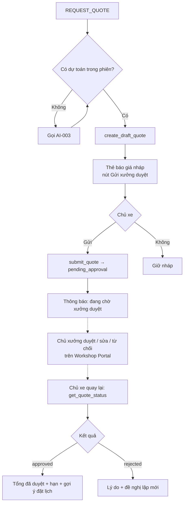
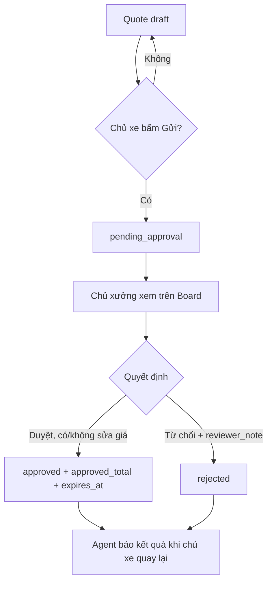
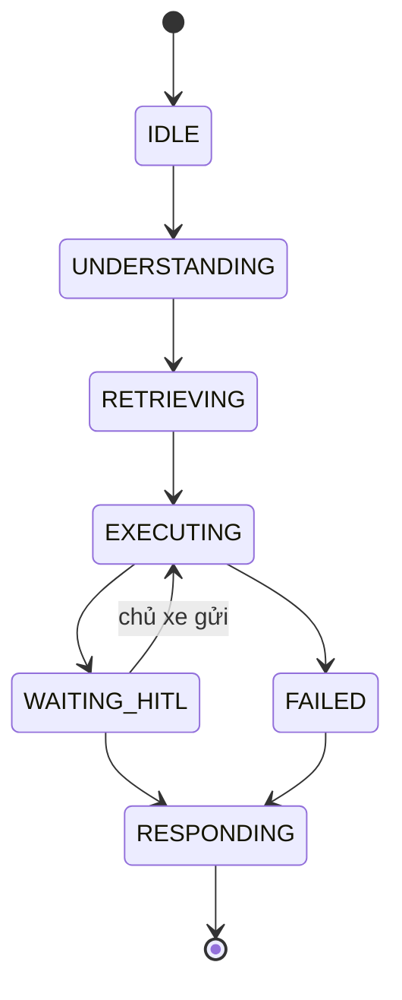

# AI-Agent Specification — AI-005 Quote HITL Agent

> **Đã loại khỏi phạm vi (02/10/2026).** Chức năng báo giá có chủ xưởng duyệt (F5b, us-049, AI-005) đã bị bỏ khỏi sản phẩm: code backend/frontend đã gỡ, bảng `quote`, `quote_item` được xoá bởi migration `backend/alembic/versions/a3c7e9f1b2d4_drop_quote_support_ticket_discord.py`. Tài liệu giữ lại để tham khảo lịch sử, **không dùng để triển khai**.

> Đặc tả hành vi của **Quote HITL Agent** — lập báo giá nháp từ dự toán và đưa vào quy trình **chủ xưởng duyệt** (Human-in-the-Loop).
>
> **Nguồn:** [00-ai-agents-proposal.md](00-ai-agents-proposal.md) (AI-005), [PRD v3.5 §F5b, §7](../../product/PRD_EV_Care_MVP.md), [quote.entity.md](../entity/maintenance/quote.entity.md). Khi tài liệu này khác PRD/FF/Entity thì các tài liệu đó là chuẩn.
>
> **Ưu tiên:** Should (S3) — làm sau nhóm F4/F5/F6.
>
> **Quy ước mã:** dải `5xx`.

---

# 1. Document Information

| Field                           | Value |
| ------------------------------- | ----- |
| Agent Spec ID                   | `AI-005` |
| Agent Name                      | Quote HITL Agent (`quote_agent`) |
| Feature / Use Case              | F5b — Báo giá HITL |
| Document Version                | `v1.0` |
| Status                          | `Draft` |
| Product / Project               | EV Care — AI Agent Chăm sóc sau bán & lịch bảo dưỡng xe điện |
| Agent Owner                     | AI Team |
| Author                          | Team 4 Người |
| Reviewer                        | Tech Lead |
| Stakeholders                    | PO, Backend, Frontend (Workshop Portal), Chủ xưởng |
| Created Date                    | `2026-09-28` |
| Updated Date                    | `2026-09-28` |
| Related Functional Spec         | [us-049 FF](../sprint-3/feature-functional/us-049-sprint-3-spec.ff.md) |
| Related API Spec                | [us-049 API](../sprint-3/api/us-049-sprint-3-spec.api.md) |
| Related Entity Spec             | [quote](../entity/maintenance/quote.entity.md) · [quote_item](../entity/maintenance/quote_item.entity.md) |
| Related PRD                     | [PRD §F5b, §F8, §7](../../product/PRD_EV_Care_MVP.md) |
| Related Architecture            | [00-ai-agents-proposal.md §2](00-ai-agents-proposal.md) |
| Related Prompt / Knowledge Spec | [AI-003](ai-003-sprint-2-spec.agent.md) |

---

# 2. Agent Overview

## 2.1 Agent Description

Sub-graph của [AI-001](ai-001-sprint-2-spec.agent.md). Từ dự toán của [AI-003](ai-003-sprint-2-spec.agent.md), agent lập `quote` **nháp** (`draft`) kèm `quote_item`. Chủ xe xem và bấm "Gửi xưởng duyệt" → `pending_approval`. Chủ xưởng duyệt (có thể sửa giá từng dòng) hoặc từ chối kèm `reviewer_note` trên Workshop Portal. Khi chủ xe quay lại chat, agent thông báo kết quả.

## 2.2 Agent Objective

Chủ xe có báo giá chính thức được chủ xưởng xác nhận; AI không bao giờ tự "duyệt" giá.

## 2.3 User Objective

Có con số chắc chắn hơn dự toán trước khi mang xe tới xưởng; biết lý do nếu bị từ chối.

## 2.4 Business Value

- Giải quyết PP-04 một phần; tăng niềm tin về chi phí.
- Chủ xưởng duyệt trên một màn hình, giảm trao đổi điện thoại (G4, PP-05).
- Đáp ứng BR-004 (core): báo giá do AI lập chỉ dùng được khi chủ xưởng duyệt.

## 2.5 Agent Responsibilities

- Lập quote nháp từ dự toán (không tự sửa số).
- Hiển thị nháp, chờ chủ xe bấm "Gửi xưởng duyệt".
- Theo dõi trạng thái và thông báo kết quả trong chat.
- Hiển thị lý do từ chối; đề nghị lập báo giá mới.
- Cho phép gắn báo giá `approved` còn hạn vào booking (qua AI-004).

## 2.6 Agent Non-Responsibilities

- Không duyệt, sửa giá thay chủ xưởng.
- Không bắt buộc báo giá khi đặt lịch (AF-001).
- Không gửi thông báo đẩy qua Discord cho kết quả duyệt `[Đề xuất: phase sau]`.

---

# 3. Scope

## 3.1 In Scope

- Tạo quote nháp từ dự toán mốc tiếp theo tại 1 xưởng.
- Gửi duyệt, xem trạng thái, xem lý do từ chối.
- Lập lại báo giá sau khi bị từ chối / hết hạn.

## 3.2 Out of Scope

- Hạng mục phát sinh ngoài định mức do chủ xe tự thêm.
- Thương lượng giá qua chat với chủ xưởng.
- Thanh toán.

---

# 4. Actors & Systems

## 4.1 Actors

| Actor | Type | Responsibility |
| --- | --- | --- |
| Chủ xe | User | Yêu cầu, xem nháp, bấm gửi duyệt |
| Chủ xưởng | Human | Duyệt / sửa giá / từ chối kèm ghi chú (BR-ENT-413) |
| AI-003 | Agent | Nguồn dự toán |
| AI-004 | Agent | Gắn báo giá vào booking |

## 4.2 Supporting Systems

| System | Purpose | Read / Write |
| --- | --- | --- |
| Quote service | Tạo `draft`, chuyển `pending_approval`, đọc trạng thái | Read / Write |
| `quote`, `quote_item` | Lưu báo giá | Read / Write (qua service) |
| Workshop Portal | Chủ xưởng duyệt | — |
| AI-003 estimate | Dữ liệu dòng báo giá | Read |

---

# 5. Agent Use Case

## UC-AI-501 — Lập và gửi báo giá để xưởng duyệt

### 5.1 Trigger

Intent `REQUEST_QUOTE`, hoặc chủ xe bấm "Gửi xưởng báo giá" dưới thẻ dự toán.

### 5.2 Preconditions

- Có dự toán thành công (AI-003) cho mốc + xưởng `active`.
- Chủ xe chưa có quote `pending_approval` cho cùng xe + xưởng + mốc `[Đề xuất]`.

### 5.3 Expected Outcome

Quote ở `pending_approval`, chủ xe biết đang chờ xưởng duyệt.

### 5.4 Postconditions

- `quote` + `quote_item` tạo; `estimated_total = SUM(estimated_price)` (BR-ENT-414).
- `message.meta.quote_id` lưu.

## UC-AI-502 — Thông báo kết quả duyệt

### 5.1 Trigger

Chủ xe mở chat / hỏi trạng thái sau khi chủ xưởng xử lý.

### 5.2 Preconditions

Quote đã `approved` hoặc `rejected`.

### 5.3 Expected Outcome

Chủ xe thấy tổng đã duyệt, dòng bị sửa, hạn hiệu lực; hoặc lý do từ chối.

### 5.4 Postconditions

Không đổi dữ liệu.

---

# 6. Agent Interaction Flow

## 6.1 Main Agent Flow



## 6.2 Agent Step Definition

| Step | Agent Action | Input | Output | Decision |
| --- | --- | --- | --- | --- |
| 1 | Lấy dự toán | State / AI-003 | `estimate` | Không có → gọi AI-003 |
| 2 | Tạo nháp | `estimate` | `quote_id` (`draft`) | Lỗi → 10.3 |
| 3 | Chờ gửi | Thẻ | Sự kiện nút | Không gửi → giữ nháp |
| 4 | Gửi duyệt | `quote_id`, token | `pending_approval` | — |
| 5 | Báo kết quả | `quote_id` | Trạng thái | approved / rejected / pending |

---

# 7. Intent & Task Definition

## 7.1 Supported Intents

| Intent ID | Intent | Description | Example |
| --- | --- | --- | --- |
| `INT-501` | `CREATE_QUOTE` | Lập báo giá | "Gửi xưởng báo giá giúp tôi" |
| `INT-502` | `SUBMIT_QUOTE` | Gửi duyệt (nút) | Bấm "Gửi xưởng duyệt" |
| `INT-503` | `QUOTE_STATUS` | Xem trạng thái | "Xưởng duyệt báo giá chưa?" |
| `INT-504` | `USE_QUOTE_FOR_BOOKING` | Đặt lịch theo báo giá | "Đặt lịch theo báo giá này" → AI-004 |

## 7.2 Intent Routing Rules

### Rule

- `INT-502` chỉ từ sự kiện nút có `confirmation_token` (confirm before side effect — gửi báo giá là side effect, PRD §7).
- `INT-504` chuyển AI-004 kèm `quote_id`.

### Examples

**User input:**

> Xưởng duyệt báo giá chưa?

**Detected intent:**

`INT-503`

**Reason / evidence:**

Hỏi trạng thái; có quote gần nhất trong `message.meta`.

---

# 8. Context Requirements

## 8.1 Required Context

| Context | Required | Source | Description |
| --- | ---: | --- | --- |
| Estimate | Yes | AI-003 | Dòng + giá |
| Vehicle | Yes | Context | `user_vehicle_id` |
| Workshop | Yes | Estimate | `workshop_id` |
| Existing quotes | Yes | Quote service | Tránh trùng, báo trạng thái |

## 8.2 Context Priority

1. Quote đang mở của xe.
2. Dự toán mới nhất trong phiên.

## 8.3 Missing Context Handling

| Missing Context | Agent Behavior |
| --- | --- |
| Không có dự toán | Gọi AI-003 trước |
| Dự toán cũ (> 24h hoặc giá đổi) `[Đề xuất]` | Tính lại trước khi tạo nháp |
| Không có xưởng | Hỏi xưởng |

---

# 9. Knowledge & RAG

## 9.1 Knowledge Sources

Không dùng RAG; dữ liệu từ AI-003 và quote service.

## 9.2 Knowledge Priority

Không áp dụng.

## 9.3 Retrieval Requirement

Không áp dụng.

## 9.4 Evidence Requirement

Mọi số trong báo giá lấy từ `quote` / `quote_item`.

## 9.5 No-Evidence Behavior

Không có dự toán hợp lệ → không lập báo giá; nói rõ lý do (vd. chưa có định mức).

---

# 10. Tool / Function Specification

## 10.1 Tool Inventory

| Tool ID | Tool Name | Purpose | Input | Output | Required |
| --- | --- | --- | --- | --- | ---: |
| `TOOL-501` | `create_draft_quote` | Tạo quote `draft` từ dự toán | `user_vehicle_id`, `workshop_id`, `odo_milestone`, `items[]` | `quote_id`, `estimated_total` | Yes |
| `TOOL-502` | `submit_quote` | `draft → pending_approval` | `quote_id`, `confirmation_token` | trạng thái | Yes |
| `TOOL-503` | `get_quote_status` | Trạng thái + chi tiết | `quote_id` hoặc `user_vehicle_id` | status, `approved_total`, dòng sửa, `reviewer_note`, `expires_at` | Yes |

## 10.2 Tool Calling Rules

### TOOL-501 — `create_draft_quote`

**When to use**

Khi có dự toán hợp lệ và chủ xe muốn báo giá.

**When not to use**

Khi đã có quote `pending_approval` cùng xe + xưởng + mốc → báo trạng thái quote đó.

**Required parameters**

- `items[]` lấy nguyên từ `estimate.items` (`maintenance_rule_id`, `item_code`, `item_name`, `estimated_price`).

**Validation before call**

- ≥ 1 dòng (BR-ENT-416); xưởng `active`.

**Expected result**

Quote `draft`; tạo nháp **không** phải side effect ra bên ngoài (xưởng chưa thấy).

### TOOL-502 — `submit_quote`

**When to use**

Chỉ khi chủ xe bấm "Gửi xưởng duyệt".

**When not to use**

Mọi trường hợp khác.

**Required parameters**

- `quote_id`, `confirmation_token`.

**Validation before call**

- Quote `draft`, thuộc xe của chủ xe.

**Expected result**

`pending_approval`; xuất hiện trên Workshop Board.

## 10.3 Tool Failure Handling

| Failure | Agent Behavior |
| --- | --- |
| Timeout | Kiểm tra lại trạng thái bằng TOOL-503 trước khi trả lời |
| Invalid input | Dự toán rỗng → không tạo |
| Business rejection | Quote không còn `draft` → báo trạng thái hiện tại |
| Tool unavailable | Báo tạm thời không gửi được, giữ nháp |

---

# 11. Agent Decision Logic

## 11.1 Decision Rules

### DEC-501 — Tránh trùng

**IF**

Đã có quote `pending_approval` cùng xe + xưởng + mốc.

**THEN**

Báo đang chờ duyệt, không tạo mới.

**ELSE**

Tạo nháp.

### DEC-502 — Dùng cho booking

**IF**

Quote `approved` và `now < expires_at`.

**THEN**

Cho phép gắn vào booking (AI-004).

**ELSE**

Nói rõ đã hết hạn / chưa duyệt; đặt lịch không kèm báo giá vẫn được (AF-001); đề nghị lập báo giá mới (EDGE-006).

### DEC-503 — Hiển thị chỉnh sửa của chủ xưởng

**IF**

Có dòng `approved_price ≠ estimated_price`.

**THEN**

Hiển thị cả giá dự toán và giá đã duyệt cho dòng đó.

## 11.2 Decision Priority

| Priority | Decision |
| --- | --- |
| 1 | AI không duyệt thay người |
| 2 | Confirm before side effect |
| 3 | Hạn hiệu lực |

---

# 12. Response Specification

## 12.1 Response Objectives

- Trạng thái rõ: Nháp / Chờ duyệt / Đã duyệt / Bị từ chối / Hết hạn.
- Phân biệt "Chi phí ước tính" (nháp, chờ duyệt) và "Báo giá đã duyệt".

## 12.2 Response Structure

```text
Báo giá [mã] — [xưởng] — [trạng thái]

[Danh sách dòng: tên — giá dự toán → giá duyệt (nếu sửa)]

Tổng: [estimated_total] (ước tính) / [approved_total] (đã duyệt)
Hiệu lực đến: [expires_at] (khi đã duyệt)
Ghi chú xưởng: [reviewer_note]

[Gợi ý: Đặt lịch theo báo giá / Lập báo giá mới]
```

## 12.3 Response Tone

Rõ ràng, trung lập.

## 12.4 Response Language

Tiếng Việt; VNĐ.

## 12.5 Required Information

- Trạng thái; tổng; hạn hiệu lực (khi `approved`); lý do (khi `rejected`, AC-F5b-02).

## 12.6 Prohibited Response

Agent không được:

- Nói "đã duyệt" khi trạng thái chưa `approved`.
- Bỏ nhãn "ước tính" với nháp / chờ duyệt.
- Hứa thời gian duyệt cụ thể.
- Tự sửa giá.

---

# 13. Memory & Personalization

## 13.1 Memory Types

| Memory | Description | Source | Retention |
| --- | --- | --- | --- |
| Conversation Memory | `quote_id` gần nhất | `message.meta` | Theo AI-001 |

## 13.2 Conversation Context

- `last_estimate`, `open_quote_id`.

## 13.3 Long-term Memory

Agent được phép lưu: `quote_id` trong `message.meta`.

Agent không được lưu: dữ liệu ngoài quote.

## 13.4 Cold Start Behavior

Không áp dụng.

---

# 14. Guardrails & Safety

## 14.1 Knowledge Guardrails

Số liệu từ quote service.

## 14.2 Business Guardrails

- Gửi duyệt cần xác nhận (PRD §7).
- Chỉ `approved` còn hạn mới gắn booking (AC-F5b-01, BR-ENT-426).
- Quote sau duyệt bị khoá (BR-ENT-415).

## 14.3 User Data Guardrails

- Chủ xe chỉ thấy quote của xe mình; chủ xưởng chỉ thấy quote của xưởng mình.

## 14.4 Technical Advice Guardrails

Không áp dụng.

## 14.5 Hallucination Handling

Luôn gọi `get_quote_status` trước khi nói về trạng thái; không suy ra trạng thái từ lịch sử chat.

---

# 15. Confidence & Uncertainty

## 15.1 Confidence Levels

| Level | Meaning | Behavior |
| --- | --- | --- |
| High | Trạng thái lấy từ tool | Báo trực tiếp |
| Low | Tool lỗi | Không báo trạng thái, đề nghị thử lại |

## 15.2 Uncertainty Statement

> Mình chưa kiểm tra được trạng thái báo giá lúc này. Bạn thử lại sau ít phút nhé.

---

# 16. Human-in-the-Loop (HITL)

## 16.1 HITL Required Scenarios

| Scenario | Trigger | Human Role | Agent Behavior |
| --- | --- | --- | --- |
| Gửi báo giá | Chủ xe muốn báo giá chính thức | Chủ xe (xác nhận gửi) | Chờ nút |
| Duyệt báo giá | `pending_approval` | Chủ xưởng | Không can thiệp; chờ |
| Sửa giá | Chủ xưởng sửa `approved_price` | Chủ xưởng | Hiển thị khác biệt |
| Từ chối | Chủ xưởng từ chối | Chủ xưởng | Hiển thị `reviewer_note`, đề nghị lập mới |

## 16.2 HITL Flow



## 16.3 Human Decision States

| State (agent) | Trạng thái `quote` | Meaning |
| --- | --- | --- |
| `PENDING_REVIEW` | `pending_approval` | Chờ chủ xưởng |
| `APPROVED` | `approved`, không dòng nào sửa giá | Duyệt nguyên dự toán |
| `MODIFIED` | `approved`, có dòng `approved_price ≠ estimated_price` | Duyệt có sửa giá |
| `REJECTED` | `rejected` | Từ chối kèm ghi chú |

`quote_status_enum` không có `modified`; `MODIFIED` là trạng thái suy ra ở tầng agent.

---

# 17. Fallback & Recovery

## 17.1 Fallback Scenarios

| Scenario | Fallback |
| --- | --- |
| No knowledge found | Không có dự toán → không lập |
| Tool unavailable | Giữ nháp, thử lại sau |
| Missing vehicle context | Không lập |
| Ambiguous intent | Hỏi muốn xem dự toán hay gửi báo giá |
| Quote hết hạn | Đề nghị lập mới |

## 17.2 Recovery Strategy

Idempotent theo `confirmation_token` khi gửi; kiểm tra trạng thái thật trước khi trả lời sau lỗi.

---

# 18. Agent State

## 18.1 State List

| State | Meaning | Entry Condition | Exit Condition |
| --- | --- | --- | --- |
| `IDLE` | Chờ | — | Được gọi |
| `UNDERSTANDING` | Xác định yêu cầu | Được gọi | Có intent |
| `RETRIEVING` | Lấy dự toán / trạng thái | — | Có dữ liệu |
| `EXECUTING` | Tạo nháp / gửi | — | Tool trả |
| `WAITING_HITL` | Chờ chủ xe gửi / chờ xưởng duyệt | Nháp hiển thị / `pending_approval` | Gửi / duyệt / từ chối |
| `RESPONDING` | Trả lời | — | Xong |
| `FAILED` | Lỗi | Tool lỗi | Fallback |

## 18.2 State Transition



---

# 19. AI Business Rules

## BR-AI-501 — AI không duyệt

**Rule**

Chỉ chủ xưởng của đúng xưởng chuyển quote sang `approved` / `rejected` (BR-ENT-413).

**Condition**

Mọi quote.

**Agent Behavior**

Agent không có tool duyệt.

**Priority**

High

---

## BR-AI-502 — Gửi duyệt cần xác nhận

**Rule**

`draft → pending_approval` chỉ khi chủ xe bấm gửi.

**Condition**

`INT-502`.

**Agent Behavior**

Yêu cầu `confirmation_token`.

**Priority**

High

---

## BR-AI-503 — Hạn hiệu lực

**Rule**

Chỉ `approved` còn hạn mới gắn booking (BR-ENT-426).

**Condition**

`INT-504`.

**Agent Behavior**

DEC-502.

**Priority**

High

---

# 20. Input / Output Contract

## 20.1 Agent Input

| Input | Required | Source | Description |
| --- | ---: | --- | --- |
| User Message / UI action | Yes | AI-001 / UI | Yêu cầu / nút gửi |
| Estimate | Yes | AI-003 | Dòng báo giá |
| `vehicle_context` | Yes | AI-001 | Xe |

## 20.2 Agent Output

| Output | Required | Description |
| --- | ---: | --- |
| Response | Yes | Văn bản |
| `card` | No | `quote_draft` / `quote_status` |
| `quote_id` | No | Khi tạo |
| HITL Request | No | `pending_approval` |

---

# 21. Prompt / Instruction Specification

## 21.1 System Instruction

Bạn giúp chủ xe gửi báo giá cho xưởng duyệt. Bạn không có quyền duyệt hay sửa giá. Chỉ báo trạng thái lấy từ công cụ.

## 21.2 Agent Role

Người chuẩn bị hồ sơ và báo tin.

## 21.3 Behavioral Instructions

- Nêu rõ trạng thái hiện tại.
- Phân biệt ước tính và đã duyệt.
- Bị từ chối: nêu lý do nguyên văn từ `reviewer_note`.

## 21.4 Tool Instructions

`submit_quote` chỉ với token; `get_quote_status` trước khi nói về trạng thái.

## 21.5 Knowledge Instructions

Không áp dụng.

## 21.6 Prompt Variables

| Variable | Source | Required |
| --- | --- | ---: |
| `{estimate}` | AI-003 | Yes |
| `{quote_status}` | TOOL-503 | No |
| `{workshop_name}` | `workshop` | Yes |

---

# 22. AI-specific Error & Edge Cases

| Case ID | Scenario | Agent Behavior | User Outcome |
| --- | --- | --- | --- |
| `AI-EDGE-501` | Gửi hai lần | Idempotent, báo đang chờ | Không trùng |
| `AI-EDGE-502` | Chủ xe hỏi trạng thái khi chưa có quote | Đề nghị lập báo giá | — |
| `AI-EDGE-503` | Báo giá hết hạn khi đặt lịch | DEC-502 | Đặt không kèm / lập mới |
| `AI-EDGE-504` | Chủ xưởng sửa giá tăng | Hiển thị khác biệt rõ | Biết thay đổi |
| `AI-EDGE-505` | Chủ xe muốn "xin giảm giá" | Ghi chú không hỗ trợ thương lượng qua chat, gợi ý trao đổi với xưởng | — |

---

# 23. AI Evaluation Criteria

## 23.1 Functional Evaluation

| Metric | Expected |
| --- | --- |
| Quote nháp khớp dự toán | 100% |
| Gửi duyệt không có xác nhận | 0 |
| Trạng thái báo đúng | 100% |

## 23.2 Quality Evaluation

| Metric | Expected |
| --- | --- |
| Thời gian duyệt (median) | Đo, chưa đặt mục tiêu (PRD §10) |
| Hiển thị lý do từ chối | 100% (AC-F5b-02) |

## 23.3 Evaluation Dataset

| Dataset | Purpose | Source |
| --- | --- | --- |
| Test tích hợp quote flow | Trạng thái, hạn, idempotency | Backend |
| Kịch bản Demo 2 | Luồng xuyên suốt | QA |

---

# 24. Observability & Logging

## 24.1 Events to Log

- `quote.draft_created`, `quote.submitted`, `quote.status_checked`, `quote.approved_seen`, `quote.rejected_seen`, `quote.expired_used_attempt`.

## 24.2 Trace Information

| Field | Description |
| --- | --- |
| `conversation_id` | Hội thoại |
| `agent_run_id` | Lượt |
| `intent` | `INT-50x` |
| `tool` | TOOL-50x |
| `quote_id` | Báo giá |
| `status` | Trạng thái quote |

---

# 25. Dependencies

| Dependency | Purpose | Owner | Required | Related Document |
| --- | --- | --- | ---: | --- |
| AI-003 | Dự toán | AI Team | Yes | [AI-003](ai-003-sprint-2-spec.agent.md) |
| Quote service + Workshop Board | Duyệt | Backend/FE | Yes | PRD F8 |
| AI-004 | Gắn booking | AI Team | No | [AI-004](ai-004-sprint-3-spec.agent.md) |

---

# 26. Assumptions

- Chủ xưởng duyệt trên Workshop Portal; không duyệt qua chat.
- Hạn hiệu lực mặc định 7 ngày `[Đề xuất]` (quote.entity.md).

---

# 27. AI Constraints

- HITL: chỉ chủ xưởng duyệt.
- Privacy: chủ xưởng chỉ thấy quote xưởng mình.
- Cost / token: phần lớn là thẻ/template, ít gọi LLM.

---

# 28. Terminology / Glossary

| Term ID | Term | Vietnamese Name | Definition | Example / Notes |
| --- | --- | --- | --- | --- |
| `AI-TERM-501` | Draft quote | Báo giá nháp | Quote `draft` do AI lập, xưởng chưa thấy | — |
| `AI-TERM-502` | Approved quote | Báo giá đã duyệt | Quote `approved` có `approved_total`, `expires_at` | Không còn nhãn "ước tính" |
| `AI-TERM-503` | Reviewer note | Ghi chú người duyệt | Lý do/ghi chú của chủ xưởng | Hiển thị khi từ chối |

---

# 29. Open Questions

| ID | Question | Owner | Status | Decision / Due Date |
| --- | --- | --- | --- | --- |
| `AI-Q-501` | Có thông báo Discord khi báo giá được duyệt/từ chối? | PO | Open | `[Đề xuất]` phase sau; MVP thông báo trong app |
| `AI-Q-502` | Quote nháp không gửi có tự xoá sau bao lâu? | PO | Open | — |
| `AI-Q-503` | Chặn trùng quote `pending_approval` theo (xe, xưởng, mốc)? | PO | Open | `[Đề xuất]` có |

---

# 30. Acceptance Criteria

## AC-AI-501 — Không gửi khi chưa xác nhận

**Given**

Quote nháp đã hiển thị.

**When**

Chủ xe không bấm "Gửi xưởng duyệt".

**Then**

Quote vẫn `draft`, không xuất hiện trên Workshop Board.

---

## AC-AI-502 — Chỉ quote còn hạn gắn booking

**Given**

Quote `approved` đã quá `expires_at`.

**When**

Chủ xe đặt lịch theo báo giá đó.

**Then**

Agent từ chối gắn, đề nghị đặt không kèm hoặc lập báo giá mới (AC-F5b-01).

---

## AC-AI-503 — Hiển thị lý do từ chối

**Given**

Chủ xưởng từ chối với `reviewer_note`.

**When**

Chủ xe hỏi trạng thái.

**Then**

Câu trả lời chứa nguyên văn `reviewer_note` (AC-F5b-02).

---

# 31. Traceability

| Item | Reference |
| --- | --- |
| PRD | [F5b, §7](../../product/PRD_EV_Care_MVP.md) |
| Functional Specification | [us-049 FF](../sprint-3/feature-functional/us-049-sprint-3-spec.ff.md) |
| User Story | `[Chưa đánh số]` |
| Use Case | — |
| Business Rules | BR-004 (core), BR-ENT-413 … 416, BR-ENT-426, EF-002, EDGE-006, AF-001 |
| Agent Rules | BR-AI-501 … BR-AI-503 |
| Tool Specification | TOOL-501 … TOOL-503 |
| Acceptance Criteria | AC-AI-501 … AC-AI-503 |
| API Specification | [us-049 API](../sprint-3/api/us-049-sprint-3-spec.api.md) |
| Entity Specification | ENT-410, ENT-411 |
| Prompt Specification | `[Chưa có]` |
| Evaluation Dataset | — |
| Test Cases | `[Chưa có]` |
| GitHub Issue / Epic | `[Cần điền]` |

---

# 32. Related Documents

- [PRD](../../product/PRD_EV_Care_MVP.md)
- [Proposal AI-Agent](00-ai-agents-proposal.md)
- [AI-003](ai-003-sprint-2-spec.agent.md) · [AI-004](ai-004-sprint-3-spec.agent.md)
- [quote.entity.md](../entity/maintenance/quote.entity.md) · [quote_item.entity.md](../entity/maintenance/quote_item.entity.md)

---

# 33. Change Log

| Version | Date | Author | Change |
| --- | --- | --- | --- |
| `v1.0` | `2026-09-28` | Team 4 Người | Initial version từ proposal AI-005 |

---

# 34. Approval

| Role | Name | Status | Date |
| --- | --- | --- | --- |
| Product Owner | Lê Đức Tùng | Pending | — |
| AI Owner | AI Team | Pending | — |
| Business Stakeholder | Mai Văn Trung | Pending | — |
| Technical Owner | Tech Lead | Pending | — |

---

# Appendix A — Example

### Input

```text
User: (bấm "Gửi xưởng báo giá" dưới thẻ dự toán mốc 12.000 km, Smart City)
... 3 giờ sau ...
User: "Xưởng duyệt báo giá chưa?"
```

### Agent Process

```text
1. INT-501 → create_draft_quote(items từ estimate) → quote Q-1043 draft
2. Thẻ nháp → chủ xe bấm Gửi → submit_quote → pending_approval
3. (Chủ xưởng duyệt, sửa giá dầu phanh, expires_at = +7 ngày)
4. INT-503 → get_quote_status → approved, 1 dòng sửa → MODIFIED
```

### Example Response

```text
Báo giá Q-1043 — Smart City — Đã duyệt (có điều chỉnh)

- Thay lọc gió điều hoà: … VNĐ
- Thay dầu phanh: … VNĐ → … VNĐ (xưởng điều chỉnh)

Tổng đã duyệt: … VNĐ
Hiệu lực đến: 12/10/2026
Ghi chú xưởng: "Giá dầu phanh theo loại DOT4 chính hãng."

Bạn có muốn đặt lịch theo báo giá này không?
```
