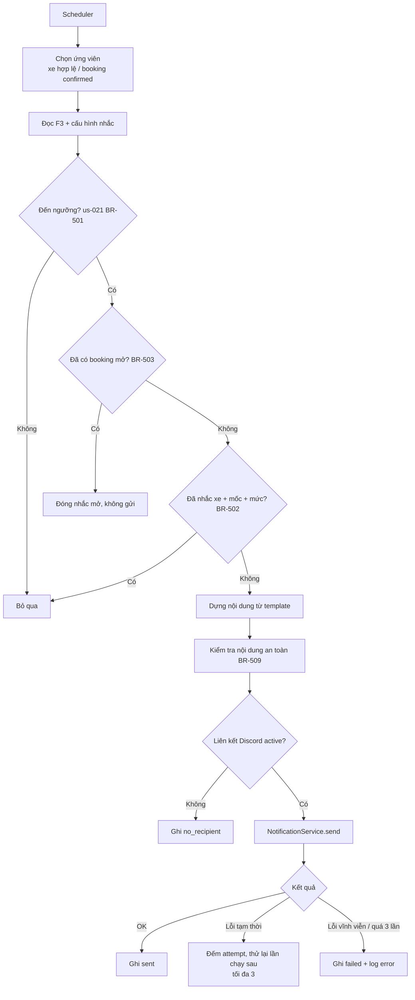
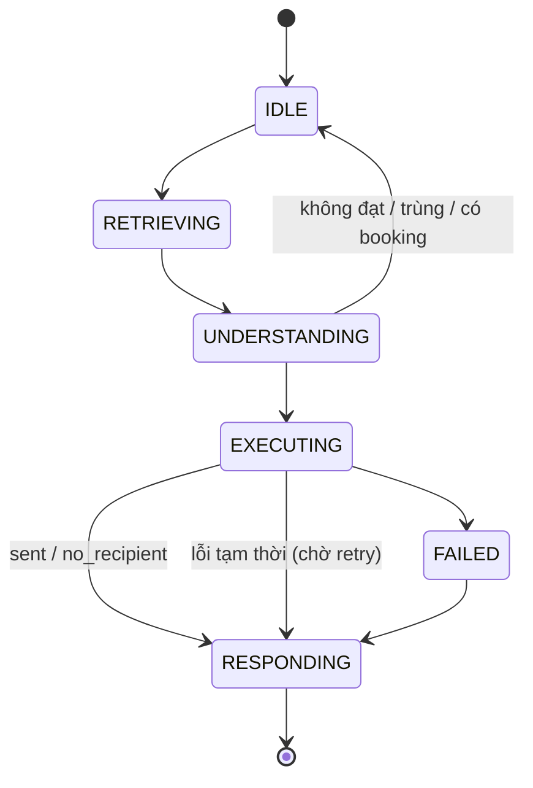

# AI-Agent Specification — AI-006 Reminder Agent

> Đặc tả hành vi của **Reminder Agent** — worker chủ động nhắc mốc bảo dưỡng và nhắc lịch hẹn 24h qua **Discord (kênh riêng mỗi chủ xe)**.
>
> **Nguồn:** [00-ai-agents-proposal.md](00-ai-agents-proposal.md) (AI-006), [PRD v3.6 §F7](../../product/PRD_EV_Care_MVP.md), [us-021 FF](../sprint-2/feature-functional/us-021-sprint-2-spec.ff.md). **Luật nhắc mốc (BR-501 … BR-511) định nghĩa trong us-021; tài liệu này không định nghĩa lại**, chỉ đặc tả phần "agent": nội dung, guardrail, quan sát.
>
> **Quyết định `[Đề xuất]` (Q-A03):** MVP dùng **template tĩnh**, **không gọi LLM**. Agent là worker tất định; LLM cá nhân hoá câu chữ để phase sau.
>
> **Quy ước mã:** dải `6xx`.

---

# 1. Document Information

| Field                           | Value |
| ------------------------------- | ----- |
| Agent Spec ID                   | `AI-006` |
| Agent Name                      | Reminder Agent (`reminder_agent`) |
| Feature / Use Case              | F7 — Nhắc mốc bảo dưỡng + nhắc lịch hẹn 24h |
| Document Version                | `v1.0` |
| Status                          | `Draft` |
| Product / Project               | EV Care — AI Agent Chăm sóc sau bán & lịch bảo dưỡng xe điện |
| Agent Owner                     | AI Team + Backend |
| Author                          | Team 4 Người |
| Reviewer                        | Tech Lead |
| Stakeholders                    | PO, Backend, Chủ xe, Chủ xưởng |
| Created Date                    | `2026-09-28` |
| Updated Date                    | `2026-09-28` |
| Related Functional Spec         | [us-021 FF](../sprint-2/feature-functional/us-021-sprint-2-spec.ff.md) (nhắc mốc) · [us-033 FF](../sprint-3/feature-functional/us-033-sprint-3-spec.ff.md) (nhắc hẹn 24h) |
| Related API Spec                | [us-021 API](../sprint-2/api/us-021-sprint-2-spec.api.md) |
| Related Entity Spec             | [reminder](../entity/maintenance/reminder.entity.md) · [user_discord_link](../entity/identity/user_discord_link.entity.md) · [us-021 entity](../sprint-2/entity/us-021-sprint-2-spec.entity.md) |
| Related PRD                     | [PRD §F7, Phụ lục B NOTI-01](../../product/PRD_EV_Care_MVP.md) |
| Related Architecture            | [00-ai-agents-proposal.md §2](00-ai-agents-proposal.md) |
| Related Prompt / Knowledge Spec | Không (template tĩnh) |

---

# 2. Agent Overview

## 2.1 Agent Description

Worker chạy theo lịch (Redis/Celery queue). Hai job:

1. **Nhắc mốc** — hằng ngày 08:00 `[Đề xuất]` Asia/Ho_Chi_Minh; chọn xe đến ngưỡng nhắc theo us-021 BR-501, dựng nội dung từ template, gửi qua `NotificationService` (adapter Discord).
2. **Nhắc lịch hẹn** — 24h trước giờ hẹn của booking `confirmed`, gửi link Xác nhận / Đổi / Huỷ (mở app).

Không có hội thoại; không gọi LLM trong MVP.

## 2.2 Agent Objective

Mỗi chủ xe đủ điều kiện nhận đúng một thông báo cho mỗi (xe, mốc, mức) và một nhắc hẹn cho mỗi booking, với nội dung an toàn, không lộ dữ liệu nhạy cảm.

## 2.3 User Objective

Không phải tự nhớ mốc bảo dưỡng và lịch hẹn; đổi/huỷ lịch sớm khi bận.

## 2.4 Business Value

- Giải quyết PP-01 (G1), PP-07 no-show (G5).
- Kéo chủ xe quay lại app để đặt lịch (AI-004).

## 2.5 Agent Responsibilities

- Chọn đối tượng nhắc theo kết quả F3 và us-021 (không tự tính).
- Dựng nội dung từ template đã duyệt.
- Gửi qua `NotificationService`, ghi nhận kết quả, thử lại theo BR-508.
- Đóng nhắc khi mốc đã có booking (BR-503).

## 2.6 Agent Non-Responsibilities

- Không tính trạng thái đến hạn (F3).
- Không gửi qua kênh khác khi Discord lỗi (PRD F7).
- Không nhận phản hồi trong Discord (nút tương tác là phase sau).
- Không hỏi thăm sau dịch vụ (AI-007).

---

# 3. Scope

## 3.1 In Scope

- Nhắc mốc mức `early` và `expired` (us-021 BR-501).
- Nhắc lịch hẹn 24h.
- Ghi nhận `no_recipient`, `failed`, retry.

## 3.2 Out of Scope

- Email / SMS / Telegram / Slack / Zalo (NOTI-01 — chờ adapter).
- Mức `warning`, `urgent` (dành mở rộng).
- Nội dung do LLM soạn (phase sau).
- Gửi bù khi chủ xe kết nối Discord muộn (Q-505 — đề xuất không bù).

---

# 4. Actors & Systems

## 4.1 Actors

| Actor | Type | Responsibility |
| --- | --- | --- |
| Scheduler | System | Kích hoạt job |
| Chủ xe | User | Nhận thông báo, bấm link mở app |
| Vận hành | Human | Theo dõi metric lỗi gửi |

## 4.2 Supporting Systems

| System | Purpose | Read / Write |
| --- | --- | --- |
| `MaintenanceStatusService` (F3) | Mốc tiếp theo, ngày/km còn lại | Read |
| Cấu hình nhắc của chủ xe (us-021) | `reminders_enabled`, `reminder_lead_days`, kênh bật | Read |
| `reminder` | Bản ghi nhắc, khoá chống trùng | Read / Write |
| `booking` | Dừng nhắc mốc; nguồn nhắc 24h | Read |
| `user_discord_link` | Kênh riêng, trạng thái liên kết | Read |
| `NotificationService` + Discord adapter | Gửi | Write |

---

# 5. Agent Use Case

## UC-AI-601 — Nhắc mốc bảo dưỡng

### 5.1 Trigger

Job hằng ngày.

### 5.2 Preconditions

- Xe hợp lệ (us-021 BR-510); nhắc đang bật.
- F3 không trả `UNKNOWN`.

### 5.3 Expected Outcome

Xe đến ngưỡng và chưa có booking nhận đúng một thông báo cho (mốc, mức).

### 5.4 Postconditions

- `reminder` tạo với kết quả gửi (`sent` / `no_recipient` / `failed`).

## UC-AI-602 — Nhắc lịch hẹn 24h

### 5.1 Trigger

Job theo giờ `[Đề xuất: mỗi 15 phút]` chọn booking `confirmed` có giờ hẹn trong 24h tới và chưa nhắc.

### 5.2 Preconditions

Booking `confirmed`.

### 5.3 Expected Outcome

Chủ xe nhận nhắc kèm link Xác nhận / Đổi / Huỷ.

### 5.4 Postconditions

Đánh dấu booking đã nhắc; huỷ từ link giải phóng chỗ ngay (AC-F7-02, qua API booking).

---

# 6. Agent Interaction Flow

## 6.1 Main Agent Flow



## 6.2 Agent Step Definition

| Step | Agent Action | Input | Output | Decision |
| --- | --- | --- | --- | --- |
| 1 | Chọn ứng viên | DB | Danh sách xe/booking | Theo BR-510 |
| 2 | Đánh giá ngưỡng | F3 + cấu hình | `level` | Không đạt → bỏ |
| 3 | Chống trùng | `reminder` | Có/không | Trùng → bỏ |
| 4 | Dựng nội dung | Template + dữ liệu | Message | Kiểm tra an toàn |
| 5 | Gửi | Adapter | Kết quả | Retry / failed |

---

# 7. Intent & Task Definition

## 7.1 Supported Intents

Không có intent người dùng. Các loại tác vụ:

| Intent ID | Intent | Description | Example |
| --- | --- | --- | --- |
| `INT-601` | `MILESTONE_REMINDER_EARLY` | Nhắc trước hạn | "Xe VF6 (30A-***.45) sắp đến mốc 12.000 km" |
| `INT-602` | `MILESTONE_REMINDER_EXPIRED` | Nhắc quá hạn | "Xe đã quá mốc 12.000 km" |
| `INT-603` | `APPOINTMENT_REMINDER_24H` | Nhắc lịch hẹn | "Lịch hẹn 14:00 ngày mai tại Smart City" |

## 7.2 Intent Routing Rules

### Rule

`INT-601` khi chưa `OVERDUE`; `INT-602` khi `OVERDUE` (us-021 BR-501). `INT-603` do job riêng.

### Examples

**Input:** xe VF6, `remaining_days = 2`, `lead_days = 2`, chưa booking → `INT-601`.

---

# 8. Context Requirements

## 8.1 Required Context

| Context | Required | Source | Description |
| --- | ---: | --- | --- |
| Due status | Yes | F3 | Mốc, ngày/km còn lại, `due_status` |
| Reminder settings | Yes | us-021 | Bật/tắt, `lead_days`, kênh |
| Discord link | Yes | `user_discord_link` | `active` + `channel_id` |
| Booking | Yes | `booking` | Dừng nhắc / nhắc 24h |
| Warranty | No | `vehicle_warranty` | Hết bảo hành → bỏ câu cảnh báo bảo hành |
| Vehicle display | Yes | `user_vehicle` | Tên model + biển số đã che |

## 8.2 Context Priority

1. Kết quả F3 mới nhất.
2. Cấu hình của chủ xe.
3. Giá trị mặc định `.env`.

## 8.3 Missing Context Handling

| Missing Context | Agent Behavior |
| --- | --- |
| F3 `UNKNOWN` | Bỏ qua xe |
| Không ODO | Chỉ điều kiện ngày (EDGE-506) |
| Chưa kết nối Discord | `no_recipient` (EF-501); Home hiện lời mời kết nối |
| Liên kết hết hiệu lực | `no_recipient`; đánh dấu mời kết nối lại |

---

# 9. Knowledge & RAG

## 9.1 Knowledge Sources

| Knowledge Source | Type | Authority | Usage |
| --- | --- | --- | --- |
| Template thông báo | Static text | Đã duyệt bởi PO | Nội dung |

## 9.2 Knowledge Priority

Không áp dụng.

## 9.3 Retrieval Requirement

Không áp dụng.

## 9.4 Evidence Requirement

Mọi số liệu (km, ngày, mốc, giờ hẹn) lấy từ F3 / `booking` (us-021 BR-509).

## 9.5 No-Evidence Behavior

Thiếu dữ liệu cần cho template → không gửi, ghi log.

---

# 10. Tool / Function Specification

## 10.1 Tool Inventory

| Tool ID | Tool Name | Purpose | Input | Output | Required |
| --- | --- | --- | --- | --- | ---: |
| `TOOL-601` | `get_due_status` | Kết quả F3 | `user_vehicle_id` | mốc, còn lại, trạng thái | Yes |
| `TOOL-602` | `render_notification` | Dựng nội dung từ template | `template_id`, `vars` | text + link | Yes |
| `TOOL-603` | `send_notification` | Gửi qua adapter | `user_id`, `channel`, `payload` | `sent / no_recipient / transient_error / permanent_error` | Yes |
| `TOOL-604` | `record_reminder` | Ghi / cập nhật `reminder` | xe, mốc, mức, kết quả | `reminder_id` | Yes |

## 10.2 Tool Calling Rules

### TOOL-603 — `send_notification`

**When to use**

Sau khi qua chống trùng và kiểm tra an toàn.

**When not to use**

Liên kết Discord không `active` → ghi `no_recipient`, không gọi.

**Required parameters**

- `user_id`, `channel = discord`, `payload` đã render.

**Validation before call**

- Payload qua bộ lọc PII (BR-AI-602).

**Expected result**

Kết quả gửi phân loại được để retry.

## 10.3 Tool Failure Handling

| Failure | Agent Behavior |
| --- | --- |
| Timeout | Coi là lỗi tạm thời; retry lần chạy sau |
| Invalid input | Không gửi; log `error` |
| Business rejection (bot bị chặn, kênh xoá) | Lỗi vĩnh viễn → `failed`; đánh dấu liên kết hết hiệu lực |
| Tool unavailable (Discord down) | Retry theo backoff, tối đa 3 (BR-508); không đổi kênh |

---

# 11. Agent Decision Logic

## 11.1 Decision Rules

### DEC-601 — Điều kiện nhắc

Theo us-021 BR-501 … BR-503, BR-510.

### DEC-602 — Nội dung bảo hành

**IF**

Xe hết bảo hành.

**THEN**

Dùng template không có câu cảnh báo bảo hành (PRD F7).

**ELSE**

Template có câu "Bảo dưỡng đúng hạn giúp duy trì quyền lợi bảo hành theo chính sách của hãng" — **không** nêu ngưỡng km/ngày (PQ-07).

## 11.2 Decision Priority

| Priority | Decision |
| --- | --- |
| 1 | Nội dung an toàn (PII) |
| 2 | Không gửi trùng |
| 3 | Dừng khi đã có booking |
| 4 | Cấu hình chủ xe |

---

# 12. Response Specification

## 12.1 Response Objectives

- Ngắn, 1 hành động chính (mở app đặt lịch / xác nhận hẹn).
- Không PII.

## 12.2 Response Structure

Nhắc mốc (`early`):

```text
🔧 Xe {model} ({plate_masked}) sắp đến mốc bảo dưỡng {milestone_km} km
Còn khoảng {remaining_km} km hoặc {remaining_days} ngày.
{warranty_line}
Đặt lịch: {app_link}
```

Nhắc mốc (`expired`):

```text
⚠️ Xe {model} ({plate_masked}) đã quá mốc bảo dưỡng {milestone_km} km.
{warranty_line}
Đặt lịch sớm: {app_link}
```

Nhắc hẹn 24h:

```text
📅 Nhắc lịch hẹn: {time} {date} tại {workshop_name}
Mã lịch hẹn: {booking_code}
Xác nhận / Đổi / Huỷ: {app_link}
```

## 12.3 Response Tone

Ngắn, lịch sự, không gây hoảng.

## 12.4 Response Language

Tiếng Việt.

## 12.5 Required Information

- Model + biển số che; mốc; còn lại; link app.
- Nhắc hẹn: giờ, ngày, xưởng, mã booking, link.

## 12.6 Prohibited Response

Nội dung không được chứa:

- VIN, SĐT, email, CCCD, biển số đầy đủ (BR-509).
- Ngưỡng km/ngày mất bảo hành.
- Giá (tránh nhầm với báo giá) `[Đề xuất]`.

---

# 13. Memory & Personalization

## 13.1 Memory Types

| Memory | Description | Source | Retention |
| --- | --- | --- | --- |
| Reminder history | Đã nhắc gì, kết quả | `reminder` | Theo entity |
| Preference | `lead_days`, kênh | us-021 | Theo tài khoản |

## 13.2 Conversation Context

Không áp dụng.

## 13.3 Long-term Memory

Agent được phép lưu: bản ghi `reminder` và kết quả gửi.

Agent không được lưu: nội dung đã render có dữ liệu cá nhân ngoài cần thiết.

## 13.4 Cold Start Behavior

Chủ xe chưa cấu hình → mặc định bật, `lead_days = 2`, kênh Discord (us-021 BR-504, BR-505).

---

# 14. Guardrails & Safety

## 14.1 Knowledge Guardrails

Số liệu chỉ từ F3 / booking.

## 14.2 Business Guardrails

- Tối đa 2 thông báo/mốc (`early`, `expired`), thoả ≤ 1 lần/xe/tuần (PQ-04, BR-502).
- Dừng khi có booking (BR-503).
- Không đổi kênh khi lỗi.

## 14.3 User Data Guardrails

- Gửi vào kênh Discord **riêng** của chủ xe (PQ-11); không bao giờ kênh chung.
- Bộ lọc PII trước khi gửi.

## 14.4 Technical Advice Guardrails

Không đưa lời khuyên kỹ thuật trong thông báo.

## 14.5 Hallucination Handling

Không áp dụng (không LLM). Nếu phase sau dùng LLM: số liệu vẫn chèn từ biến template, LLM chỉ viết câu dẫn, hậu kiểm PII.

---

# 15. Confidence & Uncertainty

## 15.1 Confidence Levels

Không áp dụng (tất định).

## 15.2 Uncertainty Statement

Xe không có ODO: câu "Còn khoảng {remaining_days} ngày (hãng chưa có dữ liệu ODO)".

---

# 16. Human-in-the-Loop (HITL)

## 16.1 HITL Required Scenarios

| Scenario | Trigger | Human Role | Agent Behavior |
| --- | --- | --- | --- |
| Lỗi gửi kéo dài | `failed` vượt ngưỡng `[Đề xuất: > 5% / lần chạy]` | Vận hành | Metric + log `error` |

## 16.2 HITL Flow

Không có duyệt nội dung từng lần; template được PO duyệt một lần trước khi phát hành.

## 16.3 Human Decision States

Không áp dụng.

---

# 17. Fallback & Recovery

## 17.1 Fallback Scenarios

| Scenario | Fallback |
| --- | --- |
| No knowledge found | Không gửi |
| Tool unavailable | Retry lần chạy sau (≤ 3) |
| Missing vehicle context | Bỏ qua xe |
| Chưa kết nối Discord | `no_recipient` |
| Job không chạy nhiều ngày | Lần chạy sau nhắc theo trạng thái hiện tại, không bù (EDGE-504) |

## 17.2 Recovery Strategy

Job idempotent theo khoá (xe, mốc, mức) và (booking, `24h`); chạy lại an toàn.

---

# 18. Agent State

## 18.1 State List

| State | Meaning | Entry Condition | Exit Condition |
| --- | --- | --- | --- |
| `IDLE` | Chờ lịch | — | Scheduler kích hoạt |
| `UNDERSTANDING` | Đánh giá ngưỡng | Có ứng viên | Đạt / không |
| `RETRIEVING` | Đọc F3, cấu hình, liên kết | — | Đủ dữ liệu |
| `EXECUTING` | Render + gửi | Đạt ngưỡng, không trùng | Kết quả gửi |
| `WAITING_HITL` | Không dùng | — | — |
| `RESPONDING` | Ghi `reminder` | Có kết quả | Xong |
| `FAILED` | `failed` cuối | Quá 3 lần / lỗi vĩnh viễn | — |

## 18.2 State Transition



Trạng thái delivery chi tiết: [us-021 FF §13](../sprint-2/feature-functional/us-021-sprint-2-spec.ff.md).

---

# 19. AI Business Rules

## BR-AI-601 — Tuân theo us-021

**Rule**

Điều kiện, chống trùng, dừng, retry theo us-021 BR-501 … BR-511.

**Condition**

Nhắc mốc.

**Agent Behavior**

Không thêm luật riêng.

**Priority**

High

---

## BR-AI-602 — Bộ lọc PII

**Rule**

Payload không được khớp mẫu VIN (17 ký tự), SĐT, email, CCCD (9/12 số), biển số đầy đủ.

**Condition**

Trước mỗi lần gửi.

**Agent Behavior**

Khớp → không gửi, log `error` (lỗi template/dữ liệu).

**Priority**

High

---

## BR-AI-603 — Không nêu ngưỡng mất bảo hành

**Rule**

Câu bảo hành trong template không chứa số km/ngày ân hạn (PQ-07).

**Condition**

Template có `warranty_line`.

**Agent Behavior**

Chỉ dùng câu chung đã duyệt.

**Priority**

High

---

# 20. Input / Output Contract

## 20.1 Agent Input

| Input | Required | Source | Description |
| --- | ---: | --- | --- |
| Scheduler tick | Yes | Scheduler | Thời điểm chạy |
| Due status | Yes | F3 | Theo xe |
| Settings | Yes | us-021 | Theo chủ xe |
| Booking | Yes | `booking` | Nhắc 24h / dừng |

## 20.2 Agent Output

| Output | Required | Description |
| --- | ---: | --- |
| Notification | No | Tin Discord |
| `reminder` record | Yes | Kết quả gửi |
| Metrics | Yes | Số gửi / no_recipient / failed |

---

# 21. Prompt / Instruction Specification

## 21.1 System Instruction

Không áp dụng (không LLM trong MVP).

## 21.2 Agent Role

Worker gửi thông báo tất định.

## 21.3 Behavioral Instructions

Template lưu trong `agents/reminder_agent/prompt/` `[Đề xuất]` theo [agent guide](../../../backend/guide/agent.md), version hoá cùng code.

## 21.4 Tool Instructions

Thứ tự bắt buộc: `get_due_status` → chống trùng → `render_notification` → lọc PII → `send_notification` → `record_reminder`.

## 21.5 Knowledge Instructions

Không áp dụng.

## 21.6 Prompt Variables

| Variable | Source | Required |
| --- | --- | ---: |
| `{model}` | `user_vehicle` | Yes |
| `{plate_masked}` | `user_vehicle` (che) | Yes |
| `{milestone_km}` | F3 | Yes |
| `{remaining_km}` | F3 | No |
| `{remaining_days}` | F3 | Yes |
| `{warranty_line}` | Template theo DEC-602 | No |
| `{app_link}` | Cấu hình | Yes |
| `{booking_code}`, `{time}`, `{date}`, `{workshop_name}` | `booking` | Nhắc 24h |

---

# 22. AI-specific Error & Edge Cases

| Case ID | Scenario | Agent Behavior | User Outcome |
| --- | --- | --- | --- |
| `AI-EDGE-601` | Job chạy 2 lần/ngày | Không gửi trùng (EDGE-501) | 1 thông báo |
| `AI-EDGE-602` | Đổi `lead_days` | Áp dụng lần chạy sau (EDGE-502/503) | — |
| `AI-EDGE-603` | Vừa hoàn tất bảo dưỡng | Mốc mới, khoá mới (EDGE-507) | — |
| `AI-EDGE-604` | Chủ xe rời Discord server | Lỗi vĩnh viễn → liên kết hết hiệu lực | Mời kết nối lại trong app |
| `AI-EDGE-605` | Booking bị huỷ sau khi đã nhắc 24h | Không nhắc lại | — |
| `AI-EDGE-606` | Booking đặt < 24h trước giờ hẹn | Không gửi nhắc 24h `[Đề xuất]` | — |

---

# 23. AI Evaluation Criteria

## 23.1 Functional Evaluation

| Metric | Expected |
| --- | --- |
| Xe `DUE_SOON` chưa booking nhận nhắc lần chạy kế | 100% (AC-F7-01) |
| Gửi trùng | 0 |
| Payload có PII | 0 |
| Huỷ từ nhắc 24h giải phóng chỗ ngay | 100% (AC-F7-02) |

## 23.2 Quality Evaluation

| Metric | Expected |
| --- | --- |
| Tỷ lệ `failed` | < 2% `[Đề xuất]` |
| Tỷ lệ xác nhận có mặt sau nhắc | Không đo trong MVP (PRD §10) |

## 23.3 Evaluation Dataset

| Dataset | Purpose | Source |
| --- | --- | --- |
| Test us-021 AC-501 … AC-511 | Luật nhắc | Backend |
| Test bộ lọc PII | Template + dữ liệu biên | Backend |

---

# 24. Observability & Logging

## 24.1 Events to Log

- `reminder.job_started`, `reminder.candidate_evaluated`, `reminder.skipped` (lý do), `reminder.sent`, `reminder.no_recipient`, `reminder.retry`, `reminder.failed`, `reminder.pii_blocked`.

## 24.2 Trace Information

| Field | Description |
| --- | --- |
| `job_run_id` | Lần chạy job |
| `user_vehicle_id` | Xe (không log VIN) |
| `intent` | `INT-60x` |
| `tool` | Adapter |
| `reminder_id` | Bản ghi |
| `status` | Kết quả gửi |

---

# 25. Dependencies

| Dependency | Purpose | Owner | Required | Related Document |
| --- | --- | --- | ---: | --- |
| F3 | Trạng thái đến hạn | Backend | Yes | [us-017 FF](../sprint-2/feature-functional/us-017-sprint-2-spec.ff.md) |
| us-021 | Luật nhắc + cấu hình | Backend | Yes | [us-021 FF](../sprint-2/feature-functional/us-021-sprint-2-spec.ff.md) |
| Discord bot + liên kết | Kênh riêng | Backend | Yes | [user_discord_link](../entity/identity/user_discord_link.entity.md) |
| `NotificationService` | Adapter | Backend | Yes | PRD F7, NOTI-01 |
| Queue / scheduler | Chạy job | Backend | Yes | PRD §9 |

---

# 26. Assumptions

- MVP chỉ Discord; kênh khác là adapter tương lai.
- Link Xác nhận / Đổi / Huỷ mở app (không nút Discord).

---

# 27. AI Constraints

- Privacy: không PII trong nội dung.
- Cost: không gọi LLM.
- HITL: template duyệt trước.

---

# 28. Terminology / Glossary

| Term ID | Term | Vietnamese Name | Definition | Example / Notes |
| --- | --- | --- | --- | --- |
| `AI-TERM-601` | Lead days | Số ngày nhắc trước | Số ngày trước hạn bắt đầu nhắc | Mặc định 2 |
| `AI-TERM-602` | No recipient | Chưa có nơi nhận | Chưa kết nối / liên kết hết hiệu lực | EF-501 |
| `AI-TERM-603` | Masked plate | Biển số che | Biển số ẩn một phần | `30A-***.45` |

---

# 29. Open Questions

| ID | Question | Owner | Status | Decision / Due Date |
| --- | --- | --- | --- | --- |
| `AI-Q-601` | Template tĩnh hay LLM (Q-A03) | PO | Open | `[Đề xuất]` template tĩnh |
| `AI-Q-602` | Q-501 … Q-506 của us-021 | PO | Open | Theo us-021 |
| `AI-Q-603` | Nhắc hẹn 24h chưa có FF riêng | PO | Open | Cần FF trước S3 |
| `AI-Q-604` | Định dạng che biển số chuẩn | PO | Open | `[Đề xuất]` giữ 3 ký tự đầu + 2 số cuối |

---

# 30. Acceptance Criteria

## AC-AI-601 — Nhắc đúng đối tượng

**Given**

Xe `DUE_SOON`, `remaining_days ≤ lead_days`, chưa booking, Discord `active`.

**When**

Job chạy.

**Then**

Đúng 1 thông báo `early` vào kênh riêng của chủ xe (AC-F7-01, AC-501).

---

## AC-AI-602 — Nội dung an toàn

**Given**

Mọi thông báo được gửi.

**When**

Kiểm tra payload.

**Then**

Không có VIN, SĐT, email, CCCD, biển số đầy đủ; có link app (AC-511).

---

## AC-AI-603 — Chưa kết nối Discord

**Given**

Chủ xe chưa kết nối Discord.

**When**

Xe đến ngưỡng.

**Then**

Ghi `no_recipient`, không gửi kênh khác (AC-507).

---

# 31. Traceability

| Item | Reference |
| --- | --- |
| PRD | [F7, NOTI-01](../../product/PRD_EV_Care_MVP.md) |
| Functional Specification | [us-021 FF](../sprint-2/feature-functional/us-021-sprint-2-spec.ff.md) |
| User Story | US-021 |
| Use Case | — |
| Business Rules | BR-501 … BR-511 (us-021) |
| Agent Rules | BR-AI-601 … BR-AI-603 |
| Tool Specification | TOOL-601 … TOOL-604 |
| Acceptance Criteria | AC-AI-601 … AC-AI-603; AC-F7-01, AC-F7-02 |
| API Specification | [us-021 API](../sprint-2/api/us-021-sprint-2-spec.api.md) |
| Entity Specification | ENT-405, ENT-417 |
| Prompt Specification | Template `[Đề xuất]` |
| Evaluation Dataset | — |
| Test Cases | `[Chưa có]` |
| GitHub Issue / Epic | `[Cần điền]` |

---

# 32. Related Documents

- [PRD](../../product/PRD_EV_Care_MVP.md)
- [Proposal AI-Agent](00-ai-agents-proposal.md)
- [us-021 FF](../sprint-2/feature-functional/us-021-sprint-2-spec.ff.md)
- [AI-004 Booking](ai-004-sprint-3-spec.agent.md) · [AI-007 Follow-up](ai-007-sprint-4-spec.agent.md)

---

# 33. Change Log

| Version | Date | Author | Change |
| --- | --- | --- | --- |
| `v1.0` | `2026-09-28` | Team 4 Người | Initial version từ proposal AI-006 |

---

# 34. Approval

| Role | Name | Status | Date |
| --- | --- | --- | --- |
| Product Owner | Lê Đức Tùng | Pending | — |
| AI Owner | AI Team | Pending | — |
| Business Stakeholder | Mai Văn Trung | Pending | — |
| Technical Owner | Tech Lead | Pending | — |

---

# Appendix A — Example

### Input

```text
Job 08:00, 02/10/2026
Xe VF6 30A-123.45: mốc 12.000 km, ODO 11.700, remaining_days = 2, lead_days = 2
Chưa có booking; Discord active; bảo hành còn hiệu lực
```

### Agent Process

```text
1. BR-501: remaining_days 2 ≤ 2 → early
2. BR-503: không booking → tiếp
3. BR-502: chưa có (xe, 12000, early) → tiếp
4. render template early, warranty_line có
5. Bộ lọc PII: OK
6. send_notification → sent → record_reminder
```

### Example Response

```text
🔧 Xe VF6 (30A-***.45) sắp đến mốc bảo dưỡng 12.000 km
Còn khoảng 300 km hoặc 2 ngày.
Bảo dưỡng đúng hạn giúp duy trì quyền lợi bảo hành theo chính sách của hãng.
Đặt lịch: <app_link>/booking
```
