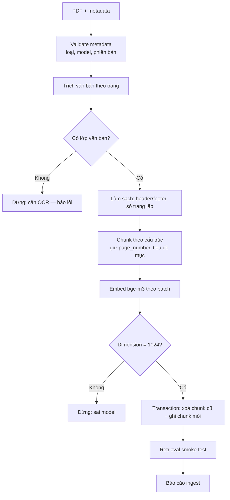
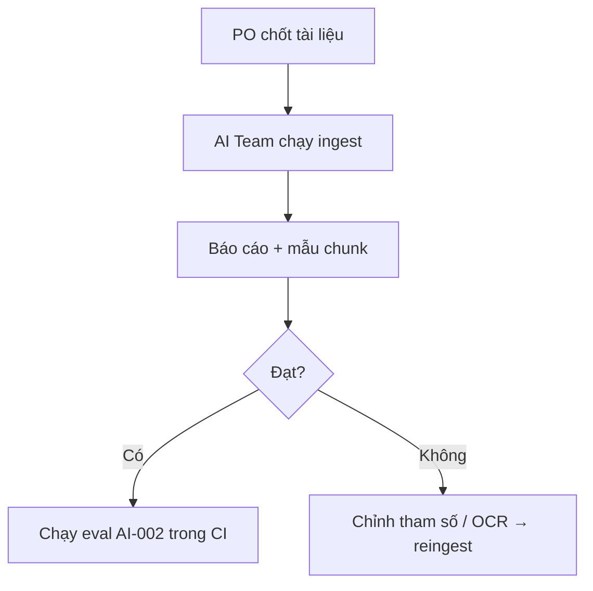
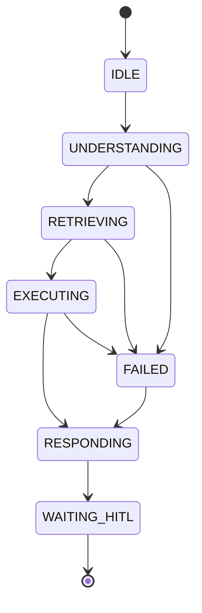

# AI-Agent Specification — AI-008 Knowledge Ingestion Pipeline

> Đặc tả **pipeline offline** ingest tài liệu chính hãng: PDF → trích văn bản → chunk → embed `bge-m3` (1024) → ghi `document_chunk` (pgvector, HNSW). Là hạ tầng cho [AI-002](ai-002-sprint-2-spec.agent.md).
>
> **Nguồn:** [00-ai-agents-proposal.md](00-ai-agents-proposal.md) (AI-008), [PRD v3.5 §F4, §9](../../product/PRD_EV_Care_MVP.md), [official_document](../entity/knowledge/official_document.entity.md), [document_chunk](../entity/knowledge/document_chunk.entity.md).
>
> **Lưu ý:** đây là **pipeline**, không phải agent hội thoại. Các mục của template không áp dụng (intent, response, HITL hội thoại…) được ghi "Không áp dụng" hoặc diễn giải cho ngữ cảnh pipeline. Không có LLM trong đường chính `[Đề xuất]`.
>
> **Quy ước mã:** dải `8xx`.

---

# 1. Document Information

| Field                           | Value |
| ------------------------------- | ----- |
| Agent Spec ID                   | `AI-008` |
| Agent Name                      | Knowledge Ingestion (`ingestion_agent` — pipeline) |
| Feature / Use Case              | Hạ tầng cho F4 (RAG) |
| Document Version                | `v1.0` |
| Status                          | `Draft` |
| Product / Project               | EV Care — AI Agent Chăm sóc sau bán & lịch bảo dưỡng xe điện |
| Agent Owner                     | AI Team |
| Author                          | Team 4 Người |
| Reviewer                        | Tech Lead |
| Stakeholders                    | PO (chọn tài liệu), AI Team, Backend |
| Created Date                    | `2026-09-28` |
| Updated Date                    | `2026-09-28` |
| Related Functional Spec         | [us-025 FF](../sprint-2/feature-functional/us-025-sprint-2-spec.ff.md) |
| Related API Spec                | `[Chưa có]` |
| Related Entity Spec             | [official_document](../entity/knowledge/official_document.entity.md) · [document_chunk](../entity/knowledge/document_chunk.entity.md) · [maintenance_rule_source](../entity/knowledge/maintenance_rule_source.entity.md) |
| Related PRD                     | [PRD §F4, §9, §12, PQ-06](../../product/PRD_EV_Care_MVP.md) |
| Related Architecture            | [00-ai-agents-proposal.md §2](00-ai-agents-proposal.md) · `backend/src/infrastructure/embedding`, `backend/src/infrastructure/vectorstore` |
| Related Prompt / Knowledge Spec | [AI-002](ai-002-sprint-2-spec.agent.md) |

---

# 2. Agent Overview

## 2.1 Agent Description

Pipeline batch chạy bằng lệnh/CLI hoặc task Celery do AI Team kích hoạt khi có tài liệu mới hoặc phiên bản mới. Đọc PDF từ Supabase Storage, trích văn bản theo trang, chia chunk, embed bằng `bge-m3`, ghi `document_chunk`. Re-ingest một tài liệu thay **toàn bộ** chunk của tài liệu đó (BR-ENT-409).

ChromaDB chỉ dùng để thử nghiệm chiến lược chunking / eval offline; **pgvector là nguồn duy nhất lúc chạy**.

## 2.2 Agent Objective

Mọi tài liệu chính hãng đã chốt (PQ-06) có trong `document_chunk` với chunk chất lượng đủ để AI-002 đạt chỉ số eval (PRD §10) và trích dẫn được tới trang.

## 2.3 User Objective

(Gián tiếp) Chủ xe nhận câu trả lời có nguồn chính xác.

## 2.4 Business Value

Giảm rủi ro "thiếu tài liệu chính hãng" và "AI bịa thông tin" (PRD §12).

## 2.5 Agent Responsibilities

- Đăng ký metadata `official_document` (loại, model, phiên bản, ngày hiệu lực, nguồn).
- Trích văn bản, giữ `page_number`.
- Chunk theo cấu trúc (tiêu đề, mục, bảng).
- Embed với đúng một model cho toàn kho (BR-ENT-410).
- Ghi chunk trong một transaction theo tài liệu; tạo/duy trì index HNSW.
- Báo cáo kết quả ingest (số trang, số chunk, lỗi).

## 2.6 Agent Non-Responsibilities

- Không trả lời câu hỏi (AI-002).
- Không tự chọn tài liệu nào là chính hãng — PO chốt.
- Không tạo `maintenance_rule_source` tự động trong MVP `[Đề xuất: làm tay / bán tự động]`.

---

# 3. Scope

## 3.1 In Scope

- PDF có lớp văn bản (text-based).
- 4 loại tài liệu: `owner_manual`, `maintenance_manual`, `warranty_policy`, `service_bulletin`.
- Ingest mới, re-ingest phiên bản, xoá tài liệu.
- Chạy eval truy hồi sau ingest.

## 3.2 Out of Scope

- OCR PDF scan `[Đề xuất: phase sau; nếu cần thì dùng skill PDF/OCR offline]`.
- Crawl web, tài liệu không chính hãng.
- Ingest tài liệu do chủ xe tải lên.
- Ingest tin nhắn chat (luồng `index_message_task` hiện có là chức năng khác — AI-Q-803).

---

# 4. Actors & Systems

## 4.1 Actors

| Actor | Type | Responsibility |
| --- | --- | --- |
| PO | Human | Chốt danh sách tài liệu + model (PQ-06) |
| AI Team | Human | Chạy pipeline, duyệt kết quả chunk, chạy eval |

## 4.2 Supporting Systems

| System | Purpose | Read / Write |
| --- | --- | --- |
| Supabase Storage | PDF nguồn | Read |
| `official_document` | Metadata | Read / Write |
| `document_chunk` | Chunk + embedding | Write |
| Embedding provider (`bge-m3`) | Vector 1024 | — |
| Celery / Redis | Chạy batch | — |
| ChromaDB | Thử nghiệm offline | Read / Write (không dùng lúc chạy) |

---

# 5. Agent Use Case

## UC-AI-801 — Ingest tài liệu mới

### 5.1 Trigger

AI Team chạy lệnh ingest với file + metadata.

### 5.2 Preconditions

- Tài liệu nằm trong danh sách đã chốt (PQ-06).
- Chưa có (`title`, `version`) trùng.

### 5.3 Expected Outcome

`official_document` + đủ `document_chunk` có embedding.

### 5.4 Postconditions

- Báo cáo ingest; AI-002 truy hồi được ngay.

## UC-AI-802 — Re-ingest phiên bản mới

### 5.1 Trigger

Hãng phát hành phiên bản mới hoặc đổi chiến lược chunk.

### 5.2 Preconditions

Tài liệu đã tồn tại.

### 5.3 Expected Outcome

Phiên bản mới = bản ghi `official_document` mới (unique `title` + `version`). Đổi chiến lược chunk cùng phiên bản → xoá và ghi lại toàn bộ chunk (BR-ENT-409).

### 5.4 Postconditions

Không tồn tại chunk "trộn" giữa hai lần ingest.

---

# 6. Agent Interaction Flow

## 6.1 Main Agent Flow



## 6.2 Agent Step Definition

| Step | Agent Action | Input | Output | Decision |
| --- | --- | --- | --- | --- |
| 1 | Validate | Metadata | OK / lỗi | Thiếu loại/model → dừng |
| 2 | Trích | PDF | Văn bản/trang | Rỗng → cần OCR |
| 3 | Chunk | Văn bản | Chunk[] | Theo tham số 9.3 |
| 4 | Embed | Chunk[] | Vector[] | Sai chiều → dừng |
| 5 | Ghi | Chunk + vector | Rows | Lỗi → rollback |
| 6 | Smoke test | Câu hỏi mẫu | Top-k | Không tìm thấy → cảnh báo |

---

# 7. Intent & Task Definition

## 7.1 Supported Intents

| Intent ID | Intent | Description | Example |
| --- | --- | --- | --- |
| `INT-801` | `INGEST_NEW` | Ingest tài liệu mới | `ingest --file vf6_maintenance_v1.2.pdf --type maintenance_manual --model VF6` |
| `INT-802` | `REINGEST` | Ghi lại chunk của tài liệu | `reingest --document-id …` |
| `INT-803` | `DELETE` | Xoá tài liệu + chunk | `delete --document-id …` |
| `INT-804` | `EVAL` | Chạy eval truy hồi | `eval --dataset rag_qa` |

## 7.2 Intent Routing Rules

Lệnh CLI tường minh; không phân loại ngôn ngữ tự nhiên.

---

# 8. Context Requirements

## 8.1 Required Context

| Context | Required | Source | Description |
| --- | ---: | --- | --- |
| `title` | Yes | Người chạy | Tên tài liệu |
| `document_type` | Yes | Người chạy | Enum 4 loại |
| `model_id` | No | Người chạy | Null = tài liệu chung |
| `version` | Yes `[Đề xuất]` | Người chạy | Bắt buộc để trích dẫn phiên bản |
| `effective_date` | No | Người chạy | Ngày hiệu lực |
| `source_url` | No | Người chạy | Nguồn gốc |

## 8.2 Context Priority

Metadata do người chạy khai là chuẩn; pipeline không suy đoán từ nội dung.

## 8.3 Missing Context Handling

| Missing Context | Agent Behavior |
| --- | --- |
| `document_type` | Dừng |
| `version` | Dừng `[Đề xuất]` |
| `model_id` | Cảnh báo, ghi là tài liệu chung |

---

# 9. Knowledge & RAG

## 9.1 Knowledge Sources

| Knowledge Source | Type | Authority | Usage |
| --- | --- | --- | --- |
| PDF tài liệu hãng (PQ-06) | Document | Official | Nguồn ingest duy nhất |

## 9.2 Knowledge Priority

Không áp dụng.

## 9.3 Retrieval Requirement

Tham số chunk mặc định `[Đề xuất — chốt bằng thử nghiệm Chroma]`:

| Tham số | Giá trị |
| --- | --- |
| Đơn vị chia | Theo tiêu đề mục → đoạn; không cắt giữa bảng |
| Kích thước | 400–600 token (theo tokenizer của `bge-m3`) |
| Overlap | 80 token |
| Tiền tố chunk | `"{title} — {section_heading}"` để tăng ngữ cảnh |
| Bảng | Chuyển thành dòng văn bản "Cột: giá trị", giữ nguyên số |
| `page_number` | Trang bắt đầu của chunk |

Index: HNSW cosine trên `document_chunk.embedding` `[Đề xuất: m=16, ef_construction=64]`.

## 9.4 Evidence Requirement

Mỗi chunk truy ngược được về `document_id` + `page_number`; nội dung chunk giữ nguyên số liệu của tài liệu (không paraphrase).

## 9.5 No-Evidence Behavior

Trang không trích được văn bản → ghi vào báo cáo; không tạo chunk rỗng.

---

# 10. Tool / Function Specification

## 10.1 Tool Inventory

| Tool ID | Tool Name | Purpose | Input | Output | Required |
| --- | --- | --- | --- | --- | ---: |
| `TOOL-801` | `extract_pdf_text` | Trích văn bản theo trang | file | `[{page, text}]` | Yes |
| `TOOL-802` | `chunk_document` | Chia chunk | pages, tham số | `[{chunk_index, content, page_number}]` | Yes |
| `TOOL-803` | `embed_chunks` | Embed batch | contents | vectors (1024) | Yes |
| `TOOL-804` | `write_chunks` | Transaction xoá cũ + ghi mới | `document_id`, chunks | số dòng | Yes |
| `TOOL-805` | `run_retrieval_eval` | Eval / smoke test | dataset | recall@k, MRR | No |

## 10.2 Tool Calling Rules

### TOOL-803 — `embed_chunks`

**When to use**

Sau chunk.

**When not to use**

Khi cấu hình provider/model khác model của kho hiện tại (BR-ENT-410).

**Required parameters**

- `contents[]`, batch size theo `embedding_batch_size`.

**Validation before call**

- Provider = model đã chốt (`BAAI/bge-m3`); `embedding_dimensions = 1024`.

**Expected result**

Vector 1024 chiều, chuẩn hoá L2.

### TOOL-804 — `write_chunks`

**When to use**

Sau embed thành công toàn bộ tài liệu.

**When not to use**

Embed lỗi một phần — không ghi một phần.

**Required parameters**

- `document_id`, danh sách chunk.

**Validation before call**

- `chunk_index` liên tục từ 0; unique (`document_id`, `chunk_index`).

**Expected result**

Một transaction: xoá toàn bộ chunk cũ của tài liệu, ghi chunk mới.

## 10.3 Tool Failure Handling

| Failure | Agent Behavior |
| --- | --- |
| Timeout (embed) | Retry batch 3 lần, backoff; vẫn lỗi → dừng, không ghi |
| Invalid input | PDF hỏng / không có văn bản → dừng, báo lỗi |
| Business rejection | Trùng (`title`, `version`) → dừng, gợi ý `reingest` |
| Tool unavailable (DB) | Rollback, báo lỗi |

---

# 11. Agent Decision Logic

## 11.1 Decision Rules

### DEC-801 — Cùng model embedding

**IF**

Model embedding khác model của chunk hiện có trong kho.

**THEN**

Dừng; chỉ cho phép khi re-ingest **toàn bộ** kho (migration có kế hoạch).

### DEC-802 — Chất lượng trích xuất

**IF**

> 20% trang không có văn bản `[Đề xuất]`.

**THEN**

Dừng, đánh dấu cần OCR.

## 11.2 Decision Priority

| Priority | Decision |
| --- | --- |
| 1 | Nhất quán embedding |
| 2 | Không ghi một phần |
| 3 | Chất lượng chunk |

---

# 12. Response Specification

## 12.1 Response Objectives

Báo cáo ingest đủ để AI Team quyết định công bố hay chạy lại.

## 12.2 Response Structure

```text
Ingest: {title} v{version} ({document_type}, {model_id})
Trang: {pages_total} (không có văn bản: {pages_empty})
Chunk: {chunk_count} (TB {avg_tokens} token)
Embedding: {model}, dim {dim}, {duration}s
Smoke test: {hits}/{queries} câu tìm thấy trong top-5
Trạng thái: OK / FAILED ({reason})
```

## 12.3 Response Tone

Kỹ thuật.

## 12.4 Response Language

Log/CLI bằng tiếng Anh (quy ước code); báo cáo tổng hợp có thể tiếng Việt.

## 12.5 Required Information

Số trang, số chunk, lỗi, kết quả smoke test.

## 12.6 Prohibited Response

Không báo OK khi có batch embed lỗi hoặc ghi một phần.

---

# 13. Memory & Personalization

Không áp dụng — pipeline không có bộ nhớ người dùng. Trạng thái nằm trong `official_document` / `document_chunk`.

---

# 14. Guardrails & Safety

## 14.1 Knowledge Guardrails

- Chỉ tài liệu trong danh sách PO chốt (PQ-06).
- Không paraphrase / tóm tắt nội dung khi chunk (giữ nguyên văn để trích dẫn).

## 14.2 Business Guardrails

- Unique (`title`, `version`) (Q-407).
- Re-ingest thay toàn bộ chunk (BR-ENT-409).

## 14.3 User Data Guardrails

Tài liệu hãng không chứa dữ liệu cá nhân; nếu phát hiện (vd. mẫu điền sẵn) → loại trang đó.

## 14.4 Technical Advice Guardrails

Không áp dụng.

## 14.5 Hallucination Handling

Không dùng LLM trong đường chính → không sinh nội dung mới. Nếu phase sau dùng LLM để sinh tiêu đề mục/tóm tắt, phải lưu ở trường riêng, không trộn vào `content`.

---

# 15. Confidence & Uncertainty

Không áp dụng. Chất lượng đo bằng eval truy hồi (mục 23).

---

# 16. Human-in-the-Loop (HITL)

## 16.1 HITL Required Scenarios

| Scenario | Trigger | Human Role | Agent Behavior |
| --- | --- | --- | --- |
| Chọn tài liệu | Trước ingest | PO | Pipeline chỉ nhận danh sách đã chốt |
| Duyệt kết quả | Sau ingest | AI Team | Xem báo cáo + mẫu chunk trước khi chạy eval CI |

## 16.2 HITL Flow



## 16.3 Human Decision States

Không áp dụng.

---

# 17. Fallback & Recovery

## 17.1 Fallback Scenarios

| Scenario | Fallback |
| --- | --- |
| PDF không có văn bản | Dừng, đánh dấu cần OCR |
| Embedding provider lỗi | Retry; dừng không ghi |
| DB lỗi | Rollback |
| Thiếu tài liệu cho model | Giới hạn model hỗ trợ (PRD §12) |

## 17.2 Recovery Strategy

Idempotent theo `document_id`: chạy lại cho kết quả giống nhau với cùng tham số.

---

# 18. Agent State

## 18.1 State List

| State | Meaning | Entry Condition | Exit Condition |
| --- | --- | --- | --- |
| `IDLE` | Chờ lệnh | — | Có lệnh |
| `UNDERSTANDING` | Validate metadata | Có lệnh | OK / lỗi |
| `RETRIEVING` | Trích văn bản | Metadata OK | Có văn bản |
| `EXECUTING` | Chunk + embed + ghi | Có văn bản | Ghi xong |
| `WAITING_HITL` | Chờ AI Team duyệt báo cáo | Ghi xong | Duyệt |
| `RESPONDING` | Báo cáo | — | Xong |
| `FAILED` | Lỗi | Bất kỳ bước | Rollback + báo cáo |

## 18.2 State Transition



---

# 19. AI Business Rules

## BR-AI-801 — Một model embedding cho toàn kho

**Rule**

Mọi chunk dùng cùng model và số chiều (BR-ENT-410): `bge-m3`, 1024.

**Condition**

Mọi lần embed.

**Agent Behavior**

DEC-801.

**Priority**

High

---

## BR-AI-802 — Ghi nguyên tử theo tài liệu

**Rule**

Không tồn tại trạng thái tài liệu có chunk một phần.

**Condition**

Ghi chunk.

**Agent Behavior**

Một transaction xoá + ghi.

**Priority**

High

---

## BR-AI-803 — Giữ nguyên văn

**Rule**

`content` của chunk là nguyên văn tài liệu (sau làm sạch định dạng), không paraphrase.

**Condition**

Chunk.

**Agent Behavior**

Chỉ loại header/footer, ký tự rác.

**Priority**

High

---

# 20. Input / Output Contract

## 20.1 Agent Input

| Input | Required | Source | Description |
| --- | ---: | --- | --- |
| PDF | Yes | Supabase Storage | File nguồn |
| Metadata | Yes | CLI | Mục 8.1 |
| Chunk params | No | Config | Mục 9.3 |

## 20.2 Agent Output

| Output | Required | Description |
| --- | ---: | --- |
| `official_document` | Yes | Metadata |
| `document_chunk[]` | Yes | Chunk + embedding |
| Ingest report | Yes | Mục 12.2 |
| Eval report | No | Recall@k, MRR |

---

# 21. Prompt / Instruction Specification

Không áp dụng (không LLM). Code đặt tại `agents/ingestion_agent/tools/rag/` theo [agent guide](../../../backend/guide/agent.md) `[Đề xuất]`, tái sử dụng `infrastructure/embedding` và `infrastructure/vectorstore`.

---

# 22. AI-specific Error & Edge Cases

| Case ID | Scenario | Agent Behavior | User Outcome |
| --- | --- | --- | --- |
| `AI-EDGE-801` | PDF scan | Dừng, cần OCR | AI Team xử lý |
| `AI-EDGE-802` | Bảng nhiều trang | Nối bảng, lặp tiêu đề cột | Chunk đúng số |
| `AI-EDGE-803` | Tài liệu song ngữ | Giữ cả hai; `bge-m3` đa ngôn ngữ | — |
| `AI-EDGE-804` | Đổi provider trong `.env` | DEC-801 chặn | Không trộn vector |
| `AI-EDGE-805` | Hai phiên bản cùng tài liệu | Hai bản ghi; AI-002 lọc bản mới nhất | — |

---

# 23. AI Evaluation Criteria

## 23.1 Functional Evaluation

| Metric | Expected |
| --- | --- |
| Tài liệu PQ-06 đã ingest | 100% trước Demo 1 |
| Chunk có `page_number` | 100% |
| Recall@8 trên `rag_qa` | ≥ 90% `[Đề xuất]` |

## 23.2 Quality Evaluation

| Metric | Expected |
| --- | --- |
| Chunk cắt giữa bảng | 0 trên mẫu review |
| MRR | ≥ 0.7 `[Đề xuất]` |

## 23.3 Evaluation Dataset

| Dataset | Purpose | Source |
| --- | --- | --- |
| `eval/rag_qa.jsonl` (dùng chung AI-002) | Recall, MRR | AI Team |
| Thử nghiệm Chroma | So sánh chiến lược chunk | AI Team (offline) |

---

# 24. Observability & Logging

## 24.1 Events to Log

- `ingest.started`, `ingest.extracted`, `ingest.chunked`, `ingest.embedded`, `ingest.written`, `ingest.failed`, `ingest.eval_done`.

## 24.2 Trace Information

| Field | Description |
| --- | --- |
| `ingest_run_id` | Lần chạy |
| `document_id` | Tài liệu |
| `embedding_model` | Model + dim |
| `chunk_count` | Số chunk |
| `status` | `ok / failed` |
| `duration_ms` | Thời gian |

---

# 25. Dependencies

| Dependency | Purpose | Owner | Required | Related Document |
| --- | --- | --- | ---: | --- |
| Danh sách tài liệu (PQ-06) | Phạm vi | PO | Yes | PRD §14 |
| Supabase Storage | PDF | Backend | Yes | PRD §9 |
| pgvector + HNSW | Lưu vector | Backend | Yes | [document_chunk](../entity/knowledge/document_chunk.entity.md) |
| `bge-m3` provider | Embed | AI Team | Yes | `backend/src/infrastructure/embedding` |

---

# 26. Assumptions

- Tài liệu hãng dạng PDF có lớp văn bản.
- Kho nhỏ (vài chục tài liệu) → ingest đồng bộ theo lệnh là đủ.

---

# 27. AI Constraints

- Official source: chỉ tài liệu PO chốt.
- Consistency: một model embedding.
- Cost: `bge-m3` chạy local/HuggingFace → không tốn API LLM.

---

# 28. Terminology / Glossary

| Term ID | Term | Vietnamese Name | Definition | Example / Notes |
| --- | --- | --- | --- | --- |
| `AI-TERM-801` | Chunk | Đoạn | Đơn vị văn bản được embed và truy hồi | 400–600 token |
| `AI-TERM-802` | Re-ingest | Ingest lại | Xoá và ghi lại toàn bộ chunk của tài liệu | BR-ENT-409 |
| `AI-TERM-803` | HNSW | Chỉ mục HNSW | Chỉ mục ANN của pgvector | cosine |

---

# 29. Open Questions

| ID | Question | Owner | Status | Decision / Due Date |
| --- | --- | --- | --- | --- |
| `AI-Q-801` | `config.py` mặc định `embedding_provider = "openai"` (`text-embedding-3-small`) trong khi PRD chốt `bge-m3`. Đổi mặc định sang `huggingface`/`local`? | Tech Lead | Open | `[Đề xuất]` đổi trước khi ingest lần đầu |
| `AI-Q-802` | Tham số chunk cuối cùng | AI Team | Open | Chốt qua thử nghiệm Chroma trước 04/10 |
| `AI-Q-803` | `index_message_task` (embed tin nhắn chat) có ghi chung kho `document_chunk`? Phải tách để AI-002 không truy hồi tin nhắn chat như nguồn chính hãng | AI Team | Open | `[Đề xuất]` tách collection/bảng |
| `AI-Q-804` | Tự động gợi ý `maintenance_rule_source` bằng similarity? | AI Team | Open | Phase sau |
| `AI-Q-805` | Có cần OCR trong MVP? | PO | Open | Phụ thuộc PQ-06 |

---

# 30. Acceptance Criteria

## AC-AI-801 — Ingest thành công

**Given**

PDF có lớp văn bản, metadata đủ.

**When**

Chạy `ingest`.

**Then**

`official_document` tạo; mọi chunk có `page_number`, embedding 1024 chiều; báo cáo OK.

---

## AC-AI-802 — Không ghi một phần

**Given**

Embedding lỗi ở batch thứ 3.

**When**

Ingest.

**Then**

Không có chunk nào của tài liệu được ghi; báo cáo FAILED.

---

## AC-AI-803 — Chặn sai model

**Given**

Kho đang dùng `bge-m3`.

**When**

Chạy ingest với provider khác.

**Then**

Pipeline dừng trước khi ghi.

---

# 31. Traceability

| Item | Reference |
| --- | --- |
| PRD | [F4, §9, §12, PQ-06](../../product/PRD_EV_Care_MVP.md) |
| Functional Specification | [us-025 FF](../sprint-2/feature-functional/us-025-sprint-2-spec.ff.md) |
| User Story | — |
| Use Case | — |
| Business Rules | BR-ENT-409, BR-ENT-410, Q-407 |
| Agent Rules | BR-AI-801 … BR-AI-803 |
| Tool Specification | TOOL-801 … TOOL-805 |
| Acceptance Criteria | AC-AI-801 … AC-AI-803 |
| API Specification | — |
| Entity Specification | ENT-406, ENT-407 |
| Prompt Specification | — |
| Evaluation Dataset | `eval/rag_qa.jsonl` `[Đề xuất]` |
| Test Cases | `[Chưa có]` |
| GitHub Issue / Epic | `[Cần điền]` |

---

# 32. Related Documents

- [PRD](../../product/PRD_EV_Care_MVP.md)
- [Proposal AI-Agent](00-ai-agents-proposal.md)
- [AI-002 Knowledge Advisor](ai-002-sprint-2-spec.agent.md)
- [official_document](../entity/knowledge/official_document.entity.md) · [document_chunk](../entity/knowledge/document_chunk.entity.md)

---

# 33. Change Log

| Version | Date | Author | Change |
| --- | --- | --- | --- |
| `v1.0` | `2026-09-28` | Team 4 Người | Initial version từ proposal AI-008 |

---

# 34. Approval

| Role | Name | Status | Date |
| --- | --- | --- | --- |
| Product Owner | Lê Đức Tùng | Pending | — |
| AI Owner | AI Team | Pending | — |
| Business Stakeholder | Mai Văn Trung | Pending | — |
| Technical Owner | Tech Lead | Pending | — |

---

# Appendix A — Example

### Input

```text
ingest --file vf6_maintenance_manual_v1.2.pdf \
       --type maintenance_manual --model VF6 --version 1.2 --effective-date 2026-01-01
```

### Agent Process

```text
1. Validate metadata → OK, (title, version) chưa tồn tại
2. extract_pdf_text → 48 trang, 0 trang rỗng
3. chunk_document → 112 chunk, TB 480 token, bảng mốc bảo dưỡng giữ nguyên
4. embed_chunks (bge-m3, batch 128) → 112 × 1024
5. write_chunks (transaction)
6. Smoke test 10 câu → 10/10 trong top-5
```

### Example Report

```text
Ingest: Sổ tay bảo dưỡng VF6 v1.2 (maintenance_manual, VF6)
Pages: 48 (empty: 0)
Chunks: 112 (avg 480 tokens)
Embedding: BAAI/bge-m3, dim 1024, 41s
Smoke test: 10/10 found in top-5
Status: OK
```
