# EV Care AI Agent — Entity Specifications

# EV Care AI Agent — Entity Specifications

Generated from:
- Entity specification template: `uk-xxx-sprint-x-spec.entity.md`
- ERD & table schema: `ERD_Table_Schema_EV_Care_AI_Agent.docx`

Generated date: 2026-09-27

## Entities
- `users.entity.md`
- `vehicles.entity.md`
- `maintenance_rules.entity.md`
- `maintenance_rule_items.entity.md`
- `official_documents.entity.md`
- `document_chunks.entity.md`
- `maintenance_rule_sources.entity.md`
- `service_centers.entity.md`
- `service_prices.entity.md`
- `quotes.entity.md`
- `quote_items.entity.md`
- `appointments.entity.md`
- `follow_ups.entity.md`
- `support_tickets.entity.md`

## Source handling
The specifications preserve the supplied schema terminology and do not invent unsupported API, authorization, retention, security, or database-specific index details. Where the source does not define a value, the specification marks it as `Not specified in source` or `TBD`.

---

# users.entity

# Entity Specification
## 1. Entity Information
| Field | Value |
| --- | --- |
| Entity ID | `ENT-001` |
| Entity Name | `User` |
| Business Name | Người dùng |
| Version | v1.0 |
| Status | Draft |
| Owner | TBD |
| Created Date | 2026-09-27 |
| Updated Date | 2026-09-27 |
---
# 2. Entity Overview
## 2.1 Description
Đại diện cho tài khoản người dùng trong hệ thống EV Care AI Agent và lưu vai trò Owner / Technician.

## 2.2 Business Purpose

Quản lý tài khoản và phân quyền Owner / Technician.

## 2.3 Scope

**In Scope**

* Thông tin định danh tài khoản: id, full_name, email.
* Thông tin xác thực và vai trò.
* Thời điểm tạo và cập nhật.

**Out of Scope**

* Chi tiết hồ sơ xe và các giao dịch dịch vụ liên quan.

---

# 3. Business Meaning

## Definition

Tài khoản người dùng có thể đóng vai trò OWNER hoặc TECHNICIAN theo schema hiện tại.

## Example

Một user có email đăng nhập, mật khẩu đã băm và role OWNER để sở hữu các vehicle.

## Terminology

* Related term: `Owner`
* Related term: `Technician`
* Related term: `User`
* See glossary: `Not provided in source`

---

# 4. Identity & Keys

## 4.1 Primary Key

| Field | Type | Description |
| --- | --- | --- |
| id | UUID | Định danh người dùng |

### Rules

* Unique.
* Not null.
* UUID.

## 4.2 Candidate / Unique Keys

| Field | Unique | Description |
| --- | --- | --- |
| email | Yes | Email đăng nhập được đánh dấu UNIQUE. |

---

# 5. Attributes

| Field | Type | Required | Nullable | Default | Description | Constraints |
| --- | --- | --- | --- | --- | --- | --- |
| id | UUID | Yes | No | Not specified | Định danh người dùng | PK |
| full_name | VARCHAR(100) | Yes | No | Not specified | Họ tên hiển thị | Max 100 chars |
| email | VARCHAR(150) | Yes | No | Not specified | Email đăng nhập | UNIQUE; Max 150 chars |
| password_hash | TEXT | Yes | No | Not specified | Mật khẩu đã băm | Hash value |
| role | VARCHAR(20) | Yes | No | Not specified | Vai trò người dùng | OWNER hoặc TECHNICIAN theo source |
| created_at | TIMESTAMP | Yes | No | Not specified | Thời điểm tạo | - |
| updated_at | TIMESTAMP | Yes | No | Not specified | Thời điểm cập nhật | - |

---

# 6. Attribute Details

## `id`

| Property | Value |
| --- | --- |
| Type | `UUID` |
| Required | Yes |
| Nullable | No |
| Format | PK |
| Default | Not specified |
| Min Length | Not specified |
| Max Length | Not specified |

### Business Meaning

Định danh người dùng

### Constraints

* PK
## `full_name`

| Property | Value |
| --- | --- |
| Type | `VARCHAR(100)` |
| Required | Yes |
| Nullable | No |
| Format | Max 100 chars |
| Default | Not specified |
| Min Length | Not specified |
| Max Length | Not specified |

### Business Meaning

Họ tên hiển thị

### Constraints

* Max 100 chars
## `email`

| Property | Value |
| --- | --- |
| Type | `VARCHAR(150)` |
| Required | Yes |
| Nullable | No |
| Format | UNIQUE; Max 150 chars |
| Default | Not specified |
| Min Length | Not specified |
| Max Length | Not specified |

### Business Meaning

Email đăng nhập

### Constraints

* UNIQUE; Max 150 chars
## `password_hash`

| Property | Value |
| --- | --- |
| Type | `TEXT` |
| Required | Yes |
| Nullable | No |
| Format | Hash value |
| Default | Not specified |
| Min Length | Not specified |
| Max Length | Not specified |

### Business Meaning

Mật khẩu đã băm

### Constraints

* Hash value
## `role`

| Property | Value |
| --- | --- |
| Type | `VARCHAR(20)` |
| Required | Yes |
| Nullable | No |
| Format | OWNER hoặc TECHNICIAN theo source |
| Default | Not specified |
| Min Length | Not specified |
| Max Length | Not specified |

### Business Meaning

Vai trò người dùng

### Constraints

* OWNER hoặc TECHNICIAN theo source
## `created_at`

| Property | Value |
| --- | --- |
| Type | `TIMESTAMP` |
| Required | Yes |
| Nullable | No |
| Format | - |
| Default | Not specified |
| Min Length | Not specified |
| Max Length | Not specified |

### Business Meaning

Thời điểm tạo

### Constraints

* -
## `updated_at`

| Property | Value |
| --- | --- |
| Type | `TIMESTAMP` |
| Required | Yes |
| Nullable | No |
| Format | - |
| Default | Not specified |
| Min Length | Not specified |
| Max Length | Not specified |

### Business Meaning

Thời điểm cập nhật

### Constraints

* -

---

# 7. Relationships

## 7.1 Relationship Overview

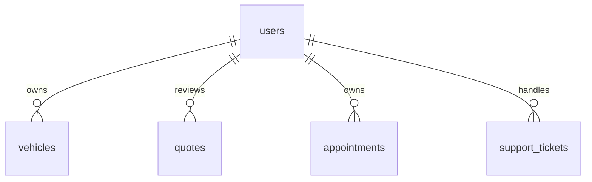

## 7.2 Relationship Details

| Related Entity | Relationship | Cardinality | Description |
| --- | --- | --- | --- |
| Vehicle | owns | 1:N | Một user có thể liên kết với nhiều vehicles. |
| Quote | reviews | 1:N | User có thể là technician duyệt quote. |
| Appointment | owns | 1:N | User có thể là owner của nhiều appointments. |
| Support Ticket | handles | 1:N | Technician có thể được gán xử lý ticket. |

### Relationship Rules

* User có thể đóng vai trò Owner hoặc Technician.
* Các FK cụ thể nằm ở các bảng liên quan theo schema.

---

# 8. Entity Lifecycle / State

## 8.1 States

| State | Meaning |
| --- | --- |
| Not defined | Schema không có trường trạng thái cho users. |

## 8.2 State Transition

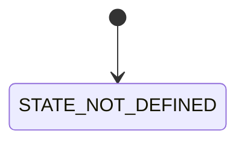

## 8.3 Transition Rules

* Không có state transition được định nghĩa trong source.

---

# 9. Business Rules & Constraints

## BR-ENT-001

**Rule**

Role chỉ cho phép các giá trị OWNER hoặc TECHNICIAN theo mô tả schema.

**Condition**

Khi tạo/cập nhật role.

**Expected Behavior**

Giá trị role phải thuộc tập giá trị nêu trong source.

---

# 10. Data Integrity

## Required Relationships

Vehicle tham chiếu owner_id tới users.id; quotes có thể tham chiếu technician_id; appointments tham chiếu owner_id; support_tickets có thể tham chiếu technician_id.

## Referential Integrity

* User có thể đóng vai trò Owner hoặc Technician.
* Các FK cụ thể nằm ở các bảng liên quan theo schema.

## Uniqueness

* email must be unique.

## Validation

* email bắt buộc và tối đa 150 ký tự.
* full_name bắt buộc và tối đa 100 ký tự.
* role phải là OWNER hoặc TECHNICIAN theo source.

---

# 11. Index & Query Requirements

> Mô tả nhu cầu truy vấn ở mức logical. Chi tiết database-specific index được triển khai trong technical design.

| Query | Fields | Frequency | Required Index |
| --- | --- | --- | --- |
| Find by ID | id | High | Primary Key |
| Find by email | email | Not specified | Yes |
| Find by role | role | Not specified | Not specified |

### Important Query Patterns

```text
1. Find user by id
2. Find user by unique email
3. Find users by role
```

---

# 12. Ownership & Authorization

| Actor / Role | Read | Create | Update | Delete |
| --- | --- | --- | --- | --- |
| OWNER | Not specified | Not specified | Not specified | Not specified |
| TECHNICIAN | Not specified | Not specified | Not specified | Not specified |

## Ownership Rule

User entity represents an application account. Specific authorization semantics beyond OWNER / TECHNICIAN are not specified in source.

## Authorization Rules

* Role-based permission matrix is not specified in source.

---

# 13. Audit Fields

| Field | Type | Description |
| --- | --- | --- |
| created_at | TIMESTAMP | Creation timestamp |
| updated_at | TIMESTAMP | Last update |

---

# 14. Data Source & Ownership

| Data | Source System | Owner | Sync Type |
| --- | --- | --- | --- |
| Account data | EV Care AI Agent database | Not specified | Not specified |

## Source of Truth

Not specified in source.

---

# 15. Data Sensitivity & Security

| Field | Classification | Notes |
| --- | --- | --- |
| password_hash | Not specified | Schema states that the field stores a hashed password. |

## Security Rules

* Detailed encryption, masking, and access rules are not specified in source.

---

# 16. Retention & Deletion

## Retention

Not specified in source.

## Deletion Strategy

Not specified in source.

## Deletion Rules

* Dependency handling is not specified in source.

---

# 17. Example Data

```json
{
  "id": "<UUID>",
  "full_name": "<Full Name>",
  "email": "<email>",
  "password_hash": "<hash>",
  "role": "OWNER",
  "created_at": "<timestamp>",
  "updated_at": "<timestamp>"
}
```

---

# 18. API References

## Used By

* `Not specified in source.`

## Related API Specification

* `Not provided in source`

---

# 19. Related Entities

| Entity | Relationship | Reference |
| --- | --- | --- |
| Vehicle | owns |  |
| Quote | technician |  |
| Appointment | owner |  |
| SupportTicket | technician |  |

---

# 20. Related Functional Specifications

* `Not specified in source.`

---

# 21. Open Questions

| ID | Question | Owner | Status |
| --- | --- | --- | --- |
| Q-001 | Authorization permissions for OWNER vs TECHNICIAN? | TBD | Open |
| Q-002 | Account deletion / deactivation policy? | TBD | Open |

---

# 22. Change Log

| Version | Date | Author | Changes |
| --- | --- | --- | --- |
| v1.0 | 2026-09-27 | OpenAI | Initial entity specification exported from the supplied template and ERD/table schema. |

---

# 23. Approval

| Role | Name | Status | Date |
| --- | --- | --- | --- |
| Product / Business | TBD | Pending | 2026-09-27 |
| Technical Owner | TBD | Pending | 2026-09-27 |
| Data Owner | TBD | Pending | 2026-09-27 |


---

# vehicles.entity

# Entity Specification
## 1. Entity Information
| Field | Value |
| --- | --- |
| Entity ID | `ENT-002` |
| Entity Name | `Vehicle` |
| Business Name | Xe |
| Version | v1.0 |
| Status | Draft |
| Owner | TBD |
| Created Date | 2026-09-27 |
| Updated Date | 2026-09-27 |
---
# 2. Entity Overview
## 2.1 Description
Đại diện cho hồ sơ xe và số km hiện tại của xe trong hệ thống.

## 2.2 Business Purpose

Lưu hồ sơ xe và số km hiện tại.

## 2.3 Scope

**In Scope**

* Thông tin sở hữu, VIN, biển số, model.
* Ngày mua/nhận xe nếu có.
* Số km hiện tại và timestamps.

**Out of Scope**

* Chi tiết giá dịch vụ, báo giá và booking; các nghiệp vụ này tham chiếu vehicle.

---

# 3. Business Meaning

## Definition

Bản ghi xe thuộc một user, nhận diện bằng UUID và VIN.

## Example

Một vehicle của một owner có VIN, biển số, model và current_mileage.

## Terminology

* Related term: `Vehicle`
* Related term: `VIN`
* Related term: `Current mileage`
* Related term: `Owner`
* See glossary: `Not provided in source`

---

# 4. Identity & Keys

## 4.1 Primary Key

| Field | Type | Description |
| --- | --- | --- |
| id | UUID | Định danh xe |

### Rules

* Unique.
* Not null.
* UUID.

## 4.2 Candidate / Unique Keys

| Field | Unique | Description |
| --- | --- | --- |
| vin | Yes | Mã VIN được đánh dấu UNIQUE. |

---

# 5. Attributes

| Field | Type | Required | Nullable | Default | Description | Constraints |
| --- | --- | --- | --- | --- | --- | --- |
| id | UUID | Yes | No | Not specified | Định danh xe | PK |
| owner_id | UUID | Yes | No | Not specified | Chủ sở hữu xe | FK users.id |
| vin | VARCHAR(50) | Yes | No | Not specified | Mã VIN | UNIQUE; Max 50 chars |
| plate_number | VARCHAR(30) | Yes | No | Not specified | Biển số xe | Max 30 chars |
| model | VARCHAR(50) | Yes | No | Not specified | Model xe | Max 50 chars |
| purchase_date | DATE | No | No | Not specified | Ngày mua / nhận xe | - |
| current_mileage | INT | Yes | No | Not specified | Số km hiện tại | Integer |
| created_at | TIMESTAMP | Yes | No | Not specified | Thời điểm tạo | - |
| updated_at | TIMESTAMP | Yes | No | Not specified | Thời điểm cập nhật | - |

---

# 6. Attribute Details

## `id`

| Property | Value |
| --- | --- |
| Type | `UUID` |
| Required | Yes |
| Nullable | No |
| Format | PK |
| Default | Not specified |
| Min Length | Not specified |
| Max Length | Not specified |

### Business Meaning

Định danh xe

### Constraints

* PK
## `owner_id`

| Property | Value |
| --- | --- |
| Type | `UUID` |
| Required | Yes |
| Nullable | No |
| Format | FK users.id |
| Default | Not specified |
| Min Length | Not specified |
| Max Length | Not specified |

### Business Meaning

Chủ sở hữu xe

### Constraints

* FK users.id
## `vin`

| Property | Value |
| --- | --- |
| Type | `VARCHAR(50)` |
| Required | Yes |
| Nullable | No |
| Format | UNIQUE; Max 50 chars |
| Default | Not specified |
| Min Length | Not specified |
| Max Length | Not specified |

### Business Meaning

Mã VIN

### Constraints

* UNIQUE; Max 50 chars
## `plate_number`

| Property | Value |
| --- | --- |
| Type | `VARCHAR(30)` |
| Required | Yes |
| Nullable | No |
| Format | Max 30 chars |
| Default | Not specified |
| Min Length | Not specified |
| Max Length | Not specified |

### Business Meaning

Biển số xe

### Constraints

* Max 30 chars
## `model`

| Property | Value |
| --- | --- |
| Type | `VARCHAR(50)` |
| Required | Yes |
| Nullable | No |
| Format | Max 50 chars |
| Default | Not specified |
| Min Length | Not specified |
| Max Length | Not specified |

### Business Meaning

Model xe

### Constraints

* Max 50 chars
## `purchase_date`

| Property | Value |
| --- | --- |
| Type | `DATE` |
| Required | No |
| Nullable | No |
| Format | - |
| Default | Not specified |
| Min Length | Not specified |
| Max Length | Not specified |

### Business Meaning

Ngày mua / nhận xe

### Constraints

* -
## `current_mileage`

| Property | Value |
| --- | --- |
| Type | `INT` |
| Required | Yes |
| Nullable | No |
| Format | Integer |
| Default | Not specified |
| Min Length | Not specified |
| Max Length | Not specified |

### Business Meaning

Số km hiện tại

### Constraints

* Integer
## `created_at`

| Property | Value |
| --- | --- |
| Type | `TIMESTAMP` |
| Required | Yes |
| Nullable | No |
| Format | - |
| Default | Not specified |
| Min Length | Not specified |
| Max Length | Not specified |

### Business Meaning

Thời điểm tạo

### Constraints

* -
## `updated_at`

| Property | Value |
| --- | --- |
| Type | `TIMESTAMP` |
| Required | Yes |
| Nullable | No |
| Format | - |
| Default | Not specified |
| Min Length | Not specified |
| Max Length | Not specified |

### Business Meaning

Thời điểm cập nhật

### Constraints

* -

---

# 7. Relationships

## 7.1 Relationship Overview

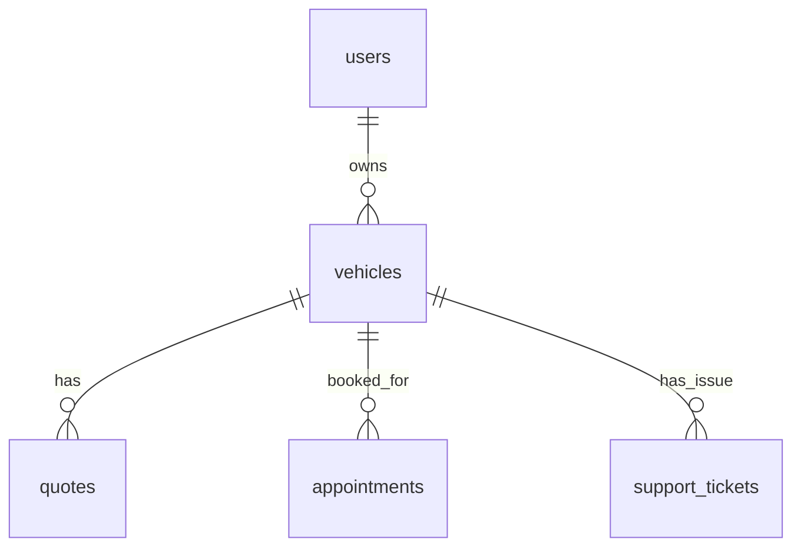

## 7.2 Relationship Details

| Related Entity | Relationship | Cardinality | Description |
| --- | --- | --- | --- |
| User | belongs to | N:1 | Vehicle thuộc một user qua owner_id. |
| Quote | referenced by | 1:N | Một vehicle có thể có nhiều quotes. |
| Appointment | referenced by | 1:N | Một vehicle có thể có nhiều appointments. |
| Support Ticket | referenced by | 1:N | Một vehicle có thể có nhiều support tickets. |

### Relationship Rules

* owner_id tham chiếu users.id.
* Vehicle được tham chiếu bởi quotes, appointments và support_tickets theo source.

---

# 8. Entity Lifecycle / State

## 8.1 States

| State | Meaning |
| --- | --- |
| Not defined | Schema không có trường status cho vehicles. |

## 8.2 State Transition


## 8.3 Transition Rules

* Không có state transition được định nghĩa trong source.

---

# 9. Business Rules & Constraints

## BR-ENT-002

**Rule**

VIN phải unique.

**Condition**

Khi tạo vehicle.

**Expected Behavior**

Không cho phép trùng VIN theo schema.

---

# 10. Data Integrity

## Required Relationships

owner_id phải tham chiếu users.id theo schema.

## Referential Integrity

* owner_id tham chiếu users.id.
* Vehicle được tham chiếu bởi quotes, appointments và support_tickets theo source.

## Uniqueness

* vin must be unique.

## Validation

* vin bắt buộc, tối đa 50 ký tự.
* plate_number bắt buộc, tối đa 30 ký tự.
* model bắt buộc, tối đa 50 ký tự.
* current_mileage bắt buộc và kiểu INT.

---

# 11. Index & Query Requirements

> Mô tả nhu cầu truy vấn ở mức logical. Chi tiết database-specific index được triển khai trong technical design.

| Query | Fields | Frequency | Required Index |
| --- | --- | --- | --- |
| Find by owner | owner_id | High | Yes |
| Find by VIN | vin | High | Unique index / constraint |
| Find by ID | id | High | Primary Key |

### Important Query Patterns

```text
1. Find vehicles by owner_id
2. Find vehicle by VIN
3. Find vehicle by id
```

---

# 12. Ownership & Authorization

| Actor / Role | Read | Create | Update | Delete |
| --- | --- | --- | --- | --- |
| OWNER | Not specified | Not specified | Not specified | Not specified |
| TECHNICIAN | Not specified | Not specified | Not specified | Not specified |

## Ownership Rule

Vehicle thuộc một user thông qua owner_id.

## Authorization Rules

* Authorization details are not specified in source.

---

# 13. Audit Fields

| Field | Type | Description |
| --- | --- | --- |
| created_at | TIMESTAMP | Creation timestamp |
| updated_at | TIMESTAMP | Last update |

---

# 14. Data Source & Ownership

| Data | Source System | Owner | Sync Type |
| --- | --- | --- | --- |
| Vehicle profile | EV Care AI Agent database | Not specified | Not specified |
| Current mileage | Vehicle profile data | Not specified | Not specified |

## Source of Truth

Not specified in source.

---

# 15. Data Sensitivity & Security

| Field | Classification | Notes |
| --- | --- | --- |
| vin | Not specified | Vehicle identifier. |
| owner_id | Not specified | Links vehicle to user. |

## Security Rules

* Detailed protection and masking rules are not specified in source.

---

# 16. Retention & Deletion

## Retention

Not specified in source.

## Deletion Strategy

Not specified in source.

## Deletion Rules

* Dependency handling is not specified in source.

---

# 17. Example Data

```json
{
  "id": "<UUID>",
  "owner_id": "<UUID>",
  "vin": "<VIN>",
  "plate_number": "<PLATE>",
  "model": "VF6",
  "purchase_date": "<date>",
  "current_mileage": 20000,
  "created_at": "<timestamp>",
  "updated_at": "<timestamp>"
}
```

---

# 18. API References

## Used By

* `Not specified in source.`

## Related API Specification

* `Not provided in source`

---

# 19. Related Entities

| Entity | Relationship | Reference |
| --- | --- | --- |
| User | owner |  |
| Quote | has |  |
| Appointment | referenced by |  |
| SupportTicket | has issue |  |

---

# 20. Related Functional Specifications

* `Not specified in source.`

---

# 21. Open Questions

| ID | Question | Owner | Status |
| --- | --- | --- | --- |
| Q-001 | Có cần unique cho plate_number không? | TBD | Open |
| Q-002 | Có quy tắc kiểm tra hợp lệ VIN / biển số? | TBD | Open |

---

# 22. Change Log

| Version | Date | Author | Changes |
| --- | --- | --- | --- |
| v1.0 | 2026-09-27 | OpenAI | Initial entity specification exported from the supplied template and ERD/table schema. |

---

# 23. Approval

| Role | Name | Status | Date |
| --- | --- | --- | --- |
| Product / Business | TBD | Pending | 2026-09-27 |
| Technical Owner | TBD | Pending | 2026-09-27 |
| Data Owner | TBD | Pending | 2026-09-27 |


---

# maintenance_rules.entity

# Entity Specification
## 1. Entity Information
| Field | Value |
| --- | --- |
| Entity ID | `ENT-003` |
| Entity Name | `Maintenance Rule` |
| Business Name | Quy tắc bảo dưỡng |
| Version | v1.0 |
| Status | Draft |
| Owner | TBD |
| Created Date | 2026-09-27 |
| Updated Date | 2026-09-27 |
---
# 2. Entity Overview
## 2.1 Description
Đại diện cho một mốc bảo dưỡng áp dụng theo model xe.

## 2.2 Business Purpose

Lưu các mốc bảo dưỡng theo model xe.

## 2.3 Scope

**In Scope**

* Model xe áp dụng.
* Mốc km bảo dưỡng.
* Tên và mô tả mốc.

**Out of Scope**

* Chi tiết các hạng mục thuộc rule được lưu ở maintenance_rule_items.

---

# 3. Business Meaning

## Definition

Một maintenance rule mô tả một milestone bảo dưỡng cho một vehicle model.

## Example

Rule 20.000 km cho model VF6 với title mô tả gói bảo dưỡng.

## Terminology

* Related term: `Maintenance rule`
* Related term: `Milestone`
* Related term: `Vehicle model`
* See glossary: `Not provided in source`

---

# 4. Identity & Keys

## 4.1 Primary Key

| Field | Type | Description |
| --- | --- | --- |
| id | UUID | Định danh rule |

### Rules

* Unique.
* Not null.
* UUID.

## 4.2 Candidate / Unique Keys

No candidate / unique key is explicitly specified in the source.

---

# 5. Attributes

| Field | Type | Required | Nullable | Default | Description | Constraints |
| --- | --- | --- | --- | --- | --- | --- |
| id | UUID | Yes | No | Not specified | Định danh rule | PK |
| vehicle_model | VARCHAR(50) | Yes | No | Not specified | Model áp dụng | Max 50 chars |
| milestone_km | INT | Yes | No | Not specified | Mốc km bảo dưỡng | Integer |
| title | VARCHAR(200) | Yes | No | Not specified | Tên mốc bảo dưỡng | Max 200 chars |
| description | TEXT | No | Yes | Not specified | Mô tả | - |
| created_at | TIMESTAMP | Yes | No | Not specified | Thời điểm tạo | - |
| updated_at | TIMESTAMP | Yes | No | Not specified | Thời điểm cập nhật | - |

---

# 6. Attribute Details

## `id`

| Property | Value |
| --- | --- |
| Type | `UUID` |
| Required | Yes |
| Nullable | No |
| Format | PK |
| Default | Not specified |
| Min Length | Not specified |
| Max Length | Not specified |

### Business Meaning

Định danh rule

### Constraints

* PK
## `vehicle_model`

| Property | Value |
| --- | --- |
| Type | `VARCHAR(50)` |
| Required | Yes |
| Nullable | No |
| Format | Max 50 chars |
| Default | Not specified |
| Min Length | Not specified |
| Max Length | Not specified |

### Business Meaning

Model áp dụng

### Constraints

* Max 50 chars
## `milestone_km`

| Property | Value |
| --- | --- |
| Type | `INT` |
| Required | Yes |
| Nullable | No |
| Format | Integer |
| Default | Not specified |
| Min Length | Not specified |
| Max Length | Not specified |

### Business Meaning

Mốc km bảo dưỡng

### Constraints

* Integer
## `title`

| Property | Value |
| --- | --- |
| Type | `VARCHAR(200)` |
| Required | Yes |
| Nullable | No |
| Format | Max 200 chars |
| Default | Not specified |
| Min Length | Not specified |
| Max Length | Not specified |

### Business Meaning

Tên mốc bảo dưỡng

### Constraints

* Max 200 chars
## `description`

| Property | Value |
| --- | --- |
| Type | `TEXT` |
| Required | No |
| Nullable | Yes |
| Format | - |
| Default | Not specified |
| Min Length | Not specified |
| Max Length | Not specified |

### Business Meaning

Mô tả

### Constraints

* -
## `created_at`

| Property | Value |
| --- | --- |
| Type | `TIMESTAMP` |
| Required | Yes |
| Nullable | No |
| Format | - |
| Default | Not specified |
| Min Length | Not specified |
| Max Length | Not specified |

### Business Meaning

Thời điểm tạo

### Constraints

* -
## `updated_at`

| Property | Value |
| --- | --- |
| Type | `TIMESTAMP` |
| Required | Yes |
| Nullable | No |
| Format | - |
| Default | Not specified |
| Min Length | Not specified |
| Max Length | Not specified |

### Business Meaning

Thời điểm cập nhật

### Constraints

* -

---

# 7. Relationships

## 7.1 Relationship Overview

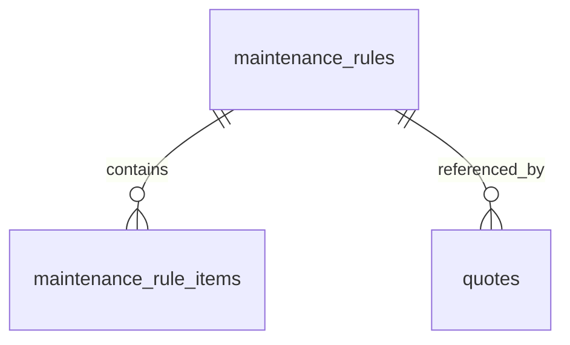

## 7.2 Relationship Details

| Related Entity | Relationship | Cardinality | Description |
| --- | --- | --- | --- |
| Maintenance Rule Item | contains | 1:N | Một rule có nhiều rule items. |
| Quote | referenced by | 1:N | Quote có thể tham chiếu maintenance_rule. |

### Relationship Rules

* Rule là cha của maintenance_rule_items.
* maintenance_rule_id trong quotes là nullable.

---

# 8. Entity Lifecycle / State

## 8.1 States

| State | Meaning |
| --- | --- |
| Not defined | Schema không có trường status. |

## 8.2 State Transition


## 8.3 Transition Rules

* Không có state transition được định nghĩa trong source.

---

# 9. Business Rules & Constraints

## BR-ENT-003

**Rule**

Rule phải gắn với một vehicle_model và milestone_km.

**Condition**

Khi tạo rule.

**Expected Behavior**

Lưu rule theo model và mốc km.

---

# 10. Data Integrity

## Required Relationships

maintenance_rule_items.rule_id tham chiếu maintenance_rules.id; quotes.maintenance_rule_id có thể tham chiếu maintenance_rules.id.

## Referential Integrity

* Rule là cha của maintenance_rule_items.
* maintenance_rule_id trong quotes là nullable.

## Uniqueness

* No explicit UNIQUE constraint is specified in source.

## Validation

* vehicle_model bắt buộc, tối đa 50 ký tự.
* milestone_km bắt buộc, kiểu INT.
* title bắt buộc, tối đa 200 ký tự.

---

# 11. Index & Query Requirements

> Mô tả nhu cầu truy vấn ở mức logical. Chi tiết database-specific index được triển khai trong technical design.

| Query | Fields | Frequency | Required Index |
| --- | --- | --- | --- |
| Find by vehicle model | vehicle_model | High | Yes |
| Find by milestone | vehicle_model + milestone_km | High | Not specified |
| Find by ID | id | High | Primary Key |

### Important Query Patterns

```text
1. Find maintenance rules by vehicle model
2. Find rule for a milestone
3. Find rule by id
```

---

# 12. Ownership & Authorization

| Actor / Role | Read | Create | Update | Delete |
| --- | --- | --- | --- | --- |
| OWNER | Not specified | Not specified | Not specified | Not specified |
| TECHNICIAN | Not specified | Not specified | Not specified | Not specified |

## Ownership Rule

Không có trường owner_id; rule là dữ liệu dùng theo model xe.

## Authorization Rules

* Authorization details are not specified in source.

---

# 13. Audit Fields

| Field | Type | Description |
| --- | --- | --- |
| created_at | TIMESTAMP | Creation timestamp |
| updated_at | TIMESTAMP | Last update |

---

# 14. Data Source & Ownership

| Data | Source System | Owner | Sync Type |
| --- | --- | --- | --- |
| Maintenance rule | EV Care AI Agent database | Not specified | Not specified |

## Source of Truth

Not specified in source.

---

# 15. Data Sensitivity & Security

| Field | Classification | Notes |
| --- | --- | --- |
| vehicle_model | Not specified | Business/vehicle rule data. |

## Security Rules

* Detailed security rules are not specified in source.

---

# 16. Retention & Deletion

## Retention

Not specified in source.

## Deletion Strategy

Not specified in source.

## Deletion Rules

* Dependency handling is not specified in source.

---

# 17. Example Data

```json
{
  "id": "<UUID>",
  "vehicle_model": "VF6",
  "milestone_km": 20000,
  "title": "<Maintenance milestone>",
  "description": "<Description>",
  "created_at": "<timestamp>",
  "updated_at": "<timestamp>"
}
```

---

# 18. API References

## Used By

* `Not specified in source.`

## Related API Specification

* `Not provided in source`

---

# 19. Related Entities

| Entity | Relationship | Reference |
| --- | --- | --- |
| MaintenanceRuleItem | contains |  |
| Quote | referenced by |  |

---

# 20. Related Functional Specifications

* `Not specified in source.`

---

# 21. Open Questions

| ID | Question | Owner | Status |
| --- | --- | --- | --- |
| Q-003 | Có cần unique theo vehicle_model + milestone_km? | TBD | Open |

---

# 22. Change Log

| Version | Date | Author | Changes |
| --- | --- | --- | --- |
| v1.0 | 2026-09-27 | OpenAI | Initial entity specification exported from the supplied template and ERD/table schema. |

---

# 23. Approval

| Role | Name | Status | Date |
| --- | --- | --- | --- |
| Product / Business | TBD | Pending | 2026-09-27 |
| Technical Owner | TBD | Pending | 2026-09-27 |
| Data Owner | TBD | Pending | 2026-09-27 |


---

# maintenance_rule_items.entity

# Entity Specification
## 1. Entity Information
| Field | Value |
| --- | --- |
| Entity ID | `ENT-004` |
| Entity Name | `Maintenance Rule Item` |
| Business Name | Hạng mục quy tắc bảo dưỡng |
| Version | v1.0 |
| Status | Draft |
| Owner | TBD |
| Created Date | 2026-09-27 |
| Updated Date | 2026-09-27 |
---
# 2. Entity Overview
## 2.1 Description
Đại diện cho một hạng mục thuộc một mốc bảo dưỡng.

## 2.2 Business Purpose

Lưu các hạng mục thuộc từng mốc bảo dưỡng.

## 2.3 Scope

**In Scope**

* Rule cha.
* Mã, tên và mô tả hạng mục.
* Cờ is_required.

**Out of Scope**

* Nguồn RAG được lưu ở maintenance_rule_sources.

---

# 3. Business Meaning

## Definition

Một item cụ thể thuộc một maintenance rule và có thể được chứng minh bằng nhiều document chunks.

## Example

Item thay dầu/phụ tùng tương ứng với một maintenance rule; source không quy định giá ở entity này.

## Terminology

* Related term: `Rule item`
* Related term: `Item code`
* Related term: `Required item`
* See glossary: `Not provided in source`

---

# 4. Identity & Keys

## 4.1 Primary Key

| Field | Type | Description |
| --- | --- | --- |
| id | UUID | Định danh hạng mục |

### Rules

* Unique.
* Not null.
* UUID.

## 4.2 Candidate / Unique Keys

No candidate / unique key is explicitly specified in the source.

---

# 5. Attributes

| Field | Type | Required | Nullable | Default | Description | Constraints |
| --- | --- | --- | --- | --- | --- | --- |
| id | UUID | Yes | No | Not specified | Định danh hạng mục | PK |
| rule_id | UUID | Yes | No | Not specified | Rule cha | FK maintenance_rules.id |
| item_code | VARCHAR(50) | Yes | No | Not specified | Mã hạng mục | Max 50 chars |
| item_name | VARCHAR(200) | Yes | No | Not specified | Tên hạng mục | Max 200 chars |
| description | TEXT | No | Yes | Not specified | Mô tả | - |
| is_required | BOOLEAN | Yes | No | Not specified | Có bắt buộc theo rule hay không | Boolean |
| created_at | TIMESTAMP | No | No | Not specified | Thời điểm tạo | - |
| updated_at | TIMESTAMP | No | No | Not specified | Thời điểm cập nhật | - |

---

# 6. Attribute Details

## `id`

| Property | Value |
| --- | --- |
| Type | `UUID` |
| Required | Yes |
| Nullable | No |
| Format | PK |
| Default | Not specified |
| Min Length | Not specified |
| Max Length | Not specified |

### Business Meaning

Định danh hạng mục

### Constraints

* PK
## `rule_id`

| Property | Value |
| --- | --- |
| Type | `UUID` |
| Required | Yes |
| Nullable | No |
| Format | FK maintenance_rules.id |
| Default | Not specified |
| Min Length | Not specified |
| Max Length | Not specified |

### Business Meaning

Rule cha

### Constraints

* FK maintenance_rules.id
## `item_code`

| Property | Value |
| --- | --- |
| Type | `VARCHAR(50)` |
| Required | Yes |
| Nullable | No |
| Format | Max 50 chars |
| Default | Not specified |
| Min Length | Not specified |
| Max Length | Not specified |

### Business Meaning

Mã hạng mục

### Constraints

* Max 50 chars
## `item_name`

| Property | Value |
| --- | --- |
| Type | `VARCHAR(200)` |
| Required | Yes |
| Nullable | No |
| Format | Max 200 chars |
| Default | Not specified |
| Min Length | Not specified |
| Max Length | Not specified |

### Business Meaning

Tên hạng mục

### Constraints

* Max 200 chars
## `description`

| Property | Value |
| --- | --- |
| Type | `TEXT` |
| Required | No |
| Nullable | Yes |
| Format | - |
| Default | Not specified |
| Min Length | Not specified |
| Max Length | Not specified |

### Business Meaning

Mô tả

### Constraints

* -
## `is_required`

| Property | Value |
| --- | --- |
| Type | `BOOLEAN` |
| Required | Yes |
| Nullable | No |
| Format | Boolean |
| Default | Not specified |
| Min Length | Not specified |
| Max Length | Not specified |

### Business Meaning

Có bắt buộc theo rule hay không

### Constraints

* Boolean
## `created_at`

| Property | Value |
| --- | --- |
| Type | `TIMESTAMP` |
| Required | No |
| Nullable | No |
| Format | - |
| Default | Not specified |
| Min Length | Not specified |
| Max Length | Not specified |

### Business Meaning

Thời điểm tạo

### Constraints

* -
## `updated_at`

| Property | Value |
| --- | --- |
| Type | `TIMESTAMP` |
| Required | No |
| Nullable | No |
| Format | - |
| Default | Not specified |
| Min Length | Not specified |
| Max Length | Not specified |

### Business Meaning

Thời điểm cập nhật

### Constraints

* -

---

# 7. Relationships

## 7.1 Relationship Overview

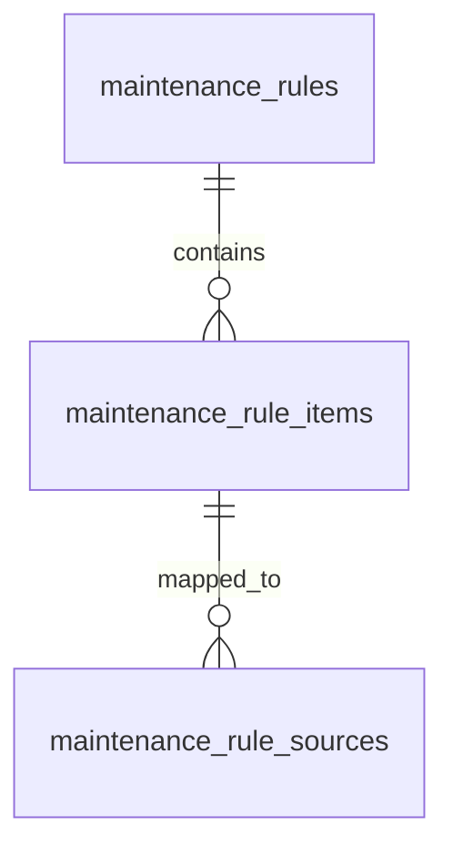

## 7.2 Relationship Details

| Related Entity | Relationship | Cardinality | Description |
| --- | --- | --- | --- |
| Maintenance Rule | belongs to | N:1 | Mỗi item thuộc một rule. |
| Maintenance Rule Source | has mappings | 1:N | Một item có thể nối tới nhiều source mappings. |

### Relationship Rules

* rule_id tham chiếu maintenance_rules.id.
* Item có thể có nhiều nguồn RAG qua maintenance_rule_sources.

---

# 8. Entity Lifecycle / State

## 8.1 States

| State | Meaning |
| --- | --- |
| Not defined | Không có trường status. |

## 8.2 State Transition


## 8.3 Transition Rules

* Không có state transition được định nghĩa trong source.

---

# 9. Business Rules & Constraints

## BR-ENT-004

**Rule**

is_required biểu diễn item có bắt buộc theo rule hay không.

**Condition**

Khi tạo/cập nhật item.

**Expected Behavior**

Giá trị là boolean.

---

# 10. Data Integrity

## Required Relationships

rule_id must reference maintenance_rules.id.

## Referential Integrity

* rule_id tham chiếu maintenance_rules.id.
* Item có thể có nhiều nguồn RAG qua maintenance_rule_sources.

## Uniqueness

* No explicit UNIQUE constraint is specified.

## Validation

* item_code bắt buộc, tối đa 50 ký tự.
* item_name bắt buộc, tối đa 200 ký tự.
* is_required bắt buộc và kiểu BOOLEAN.

---

# 11. Index & Query Requirements

> Mô tả nhu cầu truy vấn ở mức logical. Chi tiết database-specific index được triển khai trong technical design.

| Query | Fields | Frequency | Required Index |
| --- | --- | --- | --- |
| Find items by rule | rule_id | High | Yes |
| Find by item code | item_code | Not specified | Not specified |
| Find by ID | id | High | Primary Key |

### Important Query Patterns

```text
1. Find items of a maintenance rule
2. Find item by code
3. Find item by id
```

---

# 12. Ownership & Authorization

| Actor / Role | Read | Create | Update | Delete |
| --- | --- | --- | --- | --- |
| OWNER | Not specified | Not specified | Not specified | Not specified |
| TECHNICIAN | Not specified | Not specified | Not specified | Not specified |

## Ownership Rule

Không có owner field; item thuộc maintenance rule.

## Authorization Rules

* Authorization details are not specified in source.

---

# 13. Audit Fields

| Field | Type | Description |
| --- | --- | --- |
| created_at | TIMESTAMP | Creation timestamp |
| updated_at | TIMESTAMP | Last update |

---

# 14. Data Source & Ownership

| Data | Source System | Owner | Sync Type |
| --- | --- | --- | --- |
| Maintenance rule item | EV Care AI Agent database | Not specified | Not specified |

## Source of Truth

Not specified in source.

---

# 15. Data Sensitivity & Security

| Field | Classification | Notes |
| --- | --- | --- |
| item_code | Not specified | Business maintenance item code. |

## Security Rules

* Detailed security rules are not specified in source.

---

# 16. Retention & Deletion

## Retention

Not specified in source.

## Deletion Strategy

Not specified in source.

## Deletion Rules

* Dependency handling is not specified in source.

---

# 17. Example Data

```json
{
  "id": "<UUID>",
  "rule_id": "<UUID>",
  "item_code": "<ITEM_CODE>",
  "item_name": "<Item Name>",
  "description": "<Description>",
  "is_required": true,
  "created_at": "<timestamp>",
  "updated_at": "<timestamp>"
}
```

---

# 18. API References

## Used By

* `Not specified in source.`

## Related API Specification

* `Not provided in source`

---

# 19. Related Entities

| Entity | Relationship | Reference |
| --- | --- | --- |
| MaintenanceRule | belongs to |  |
| MaintenanceRuleSource | mapped to |  |

---

# 20. Related Functional Specifications

* `Not specified in source.`

---

# 21. Open Questions

| ID | Question | Owner | Status |
| --- | --- | --- | --- |
| Q-004 | Có cần unique item_code trong cùng một rule? | TBD | Open |

---

# 22. Change Log

| Version | Date | Author | Changes |
| --- | --- | --- | --- |
| v1.0 | 2026-09-27 | OpenAI | Initial entity specification exported from the supplied template and ERD/table schema. |

---

# 23. Approval

| Role | Name | Status | Date |
| --- | --- | --- | --- |
| Product / Business | TBD | Pending | 2026-09-27 |
| Technical Owner | TBD | Pending | 2026-09-27 |
| Data Owner | TBD | Pending | 2026-09-27 |


---

# official_documents.entity

# Entity Specification
## 1. Entity Information
| Field | Value |
| --- | --- |
| Entity ID | `ENT-005` |
| Entity Name | `Official Document` |
| Business Name | Tài liệu chính hãng |
| Version | v1.0 |
| Status | Draft |
| Owner | TBD |
| Created Date | 2026-09-27 |
| Updated Date | 2026-09-27 |
---
# 2. Entity Overview
## 2.1 Description
Đại diện cho metadata của tài liệu chính hãng được ingest làm nguồn RAG.

## 2.2 Business Purpose

Lưu metadata tài liệu chính hãng dùng làm nguồn RAG.

## 2.3 Scope

**In Scope**

* Tiêu đề, model áp dụng, loại tài liệu.
* Phiên bản, URL và ngày hiệu lực nếu có.
* Timestamps ingest/cập nhật.

**Out of Scope**

* Nội dung chunk cụ thể được lưu ở document_chunks.

---

# 3. Business Meaning

## Definition

Metadata record của tài liệu nguồn được dùng để truy xuất và truy vết RAG.

## Example

Một tài liệu chính hãng cho VF6, có version và effective_date.

## Terminology

* Related term: `Official document`
* Related term: `RAG source`
* Related term: `Document version`
* See glossary: `Not provided in source`

---

# 4. Identity & Keys

## 4.1 Primary Key

| Field | Type | Description |
| --- | --- | --- |
| id | UUID | Định danh tài liệu |

### Rules

* Unique.
* Not null.
* UUID.

## 4.2 Candidate / Unique Keys

No candidate / unique key is explicitly specified in the source.

---

# 5. Attributes

| Field | Type | Required | Nullable | Default | Description | Constraints |
| --- | --- | --- | --- | --- | --- | --- |
| id | UUID | Yes | No | Not specified | Định danh tài liệu | PK |
| title | VARCHAR(255) | Yes | No | Not specified | Tên tài liệu | Max 255 chars |
| vehicle_model | VARCHAR(50) | No | Yes | Not specified | Model áp dụng | Max 50 chars |
| document_type | VARCHAR(50) | Yes | No | Not specified | Loại tài liệu | Max 50 chars |
| version | VARCHAR(50) | No | Yes | Not specified | Phiên bản | Max 50 chars |
| source_url | TEXT | No | Yes | Not specified | URL nguồn | - |
| effective_date | DATE | No | Yes | Not specified | Ngày hiệu lực | - |
| created_at | TIMESTAMP | Yes | No | Not specified | Thời điểm ingest | - |
| updated_at | TIMESTAMP | No | Yes | Not specified | Thời điểm cập nhật | - |

---

# 6. Attribute Details

## `id`

| Property | Value |
| --- | --- |
| Type | `UUID` |
| Required | Yes |
| Nullable | No |
| Format | PK |
| Default | Not specified |
| Min Length | Not specified |
| Max Length | Not specified |

### Business Meaning

Định danh tài liệu

### Constraints

* PK
## `title`

| Property | Value |
| --- | --- |
| Type | `VARCHAR(255)` |
| Required | Yes |
| Nullable | No |
| Format | Max 255 chars |
| Default | Not specified |
| Min Length | Not specified |
| Max Length | Not specified |

### Business Meaning

Tên tài liệu

### Constraints

* Max 255 chars
## `vehicle_model`

| Property | Value |
| --- | --- |
| Type | `VARCHAR(50)` |
| Required | No |
| Nullable | Yes |
| Format | Max 50 chars |
| Default | Not specified |
| Min Length | Not specified |
| Max Length | Not specified |

### Business Meaning

Model áp dụng

### Constraints

* Max 50 chars
## `document_type`

| Property | Value |
| --- | --- |
| Type | `VARCHAR(50)` |
| Required | Yes |
| Nullable | No |
| Format | Max 50 chars |
| Default | Not specified |
| Min Length | Not specified |
| Max Length | Not specified |

### Business Meaning

Loại tài liệu

### Constraints

* Max 50 chars
## `version`

| Property | Value |
| --- | --- |
| Type | `VARCHAR(50)` |
| Required | No |
| Nullable | Yes |
| Format | Max 50 chars |
| Default | Not specified |
| Min Length | Not specified |
| Max Length | Not specified |

### Business Meaning

Phiên bản

### Constraints

* Max 50 chars
## `source_url`

| Property | Value |
| --- | --- |
| Type | `TEXT` |
| Required | No |
| Nullable | Yes |
| Format | - |
| Default | Not specified |
| Min Length | Not specified |
| Max Length | Not specified |

### Business Meaning

URL nguồn

### Constraints

* -
## `effective_date`

| Property | Value |
| --- | --- |
| Type | `DATE` |
| Required | No |
| Nullable | Yes |
| Format | - |
| Default | Not specified |
| Min Length | Not specified |
| Max Length | Not specified |

### Business Meaning

Ngày hiệu lực

### Constraints

* -
## `created_at`

| Property | Value |
| --- | --- |
| Type | `TIMESTAMP` |
| Required | Yes |
| Nullable | No |
| Format | - |
| Default | Not specified |
| Min Length | Not specified |
| Max Length | Not specified |

### Business Meaning

Thời điểm ingest

### Constraints

* -
## `updated_at`

| Property | Value |
| --- | --- |
| Type | `TIMESTAMP` |
| Required | No |
| Nullable | Yes |
| Format | - |
| Default | Not specified |
| Min Length | Not specified |
| Max Length | Not specified |

### Business Meaning

Thời điểm cập nhật

### Constraints

* -

---

# 7. Relationships

## 7.1 Relationship Overview

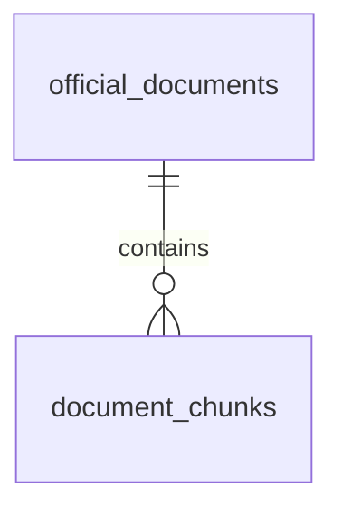

## 7.2 Relationship Details

| Related Entity | Relationship | Cardinality | Description |
| --- | --- | --- | --- |
| Document Chunk | contains | 1:N | Một official document có nhiều chunks. |

### Relationship Rules

* document_chunks.document_id references official_documents.id.

---

# 8. Entity Lifecycle / State

## 8.1 States

| State | Meaning |
| --- | --- |
| Not defined | Không có status field. |

## 8.2 State Transition


## 8.3 Transition Rules

* Không có state transition được định nghĩa.

---

# 9. Business Rules & Constraints

## BR-ENT-005

**Rule**

Tài liệu là nguồn metadata cho các document chunks dùng trong RAG.

**Condition**

Khi ingest tài liệu.

**Expected Behavior**

Tài liệu được liên kết với các chunks.

---

# 10. Data Integrity

## Required Relationships

document_chunks.document_id must reference official_documents.id.

## Referential Integrity

* document_chunks.document_id references official_documents.id.

## Uniqueness

* No explicit UNIQUE constraint is specified.

## Validation

* title bắt buộc, tối đa 255 ký tự.
* document_type bắt buộc, tối đa 50 ký tự.

---

# 11. Index & Query Requirements

> Mô tả nhu cầu truy vấn ở mức logical. Chi tiết database-specific index được triển khai trong technical design.

| Query | Fields | Frequency | Required Index |
| --- | --- | --- | --- |
| Find by model | vehicle_model | Not specified | Not specified |
| Find by document type | document_type | Not specified | Not specified |
| Find by ID | id | High | Primary Key |

### Important Query Patterns

```text
1. Find official documents by vehicle model
2. Find documents by type
3. Find document by id
```

---

# 12. Ownership & Authorization

| Actor / Role | Read | Create | Update | Delete |
| --- | --- | --- | --- | --- |
| OWNER | Not specified | Not specified | Not specified | Not specified |
| TECHNICIAN | Not specified | Not specified | Not specified | Not specified |

## Ownership Rule

Không có owner field; đây là dữ liệu nguồn RAG.

## Authorization Rules

* Authorization details are not specified in source.

---

# 13. Audit Fields

| Field | Type | Description |
| --- | --- | --- |
| created_at | TIMESTAMP | Ingest timestamp |
| updated_at | TIMESTAMP | Last update |

---

# 14. Data Source & Ownership

| Data | Source System | Owner | Sync Type |
| --- | --- | --- | --- |
| Official document metadata | Official source / ingest pipeline | Not specified | Not specified |

## Source of Truth

Source system/owner is not explicitly specified beyond the document being an official source for RAG.

---

# 15. Data Sensitivity & Security

| Field | Classification | Notes |
| --- | --- | --- |
| source_url | Not specified | Source URL field. |

## Security Rules

* Detailed security rules are not specified in source.

---

# 16. Retention & Deletion

## Retention

Not specified in source.

## Deletion Strategy

Not specified in source.

## Deletion Rules

* Dependency handling is not specified in source.

---

# 17. Example Data

```json
{
  "id": "<UUID>",
  "title": "<Official document>",
  "vehicle_model": "VF6",
  "document_type": "<type>",
  "version": "<version>",
  "source_url": "<url>",
  "effective_date": "<date>",
  "created_at": "<timestamp>",
  "updated_at": "<timestamp>"
}
```

---

# 18. API References

## Used By

* `Not specified in source.`

## Related API Specification

* `Not provided in source`

---

# 19. Related Entities

| Entity | Relationship | Reference |
| --- | --- | --- |
| DocumentChunk | contains |  |

---

# 20. Related Functional Specifications

* `Not specified in source.`

---

# 21. Open Questions

| ID | Question | Owner | Status |
| --- | --- | --- | --- |
| Q-005 | Có cần unique version/source_url để tránh ingest trùng? | TBD | Open |

---

# 22. Change Log

| Version | Date | Author | Changes |
| --- | --- | --- | --- |
| v1.0 | 2026-09-27 | OpenAI | Initial entity specification exported from the supplied template and ERD/table schema. |

---

# 23. Approval

| Role | Name | Status | Date |
| --- | --- | --- | --- |
| Product / Business | TBD | Pending | 2026-09-27 |
| Technical Owner | TBD | Pending | 2026-09-27 |
| Data Owner | TBD | Pending | 2026-09-27 |


---

# document_chunks.entity

# Entity Specification
## 1. Entity Information
| Field | Value |
| --- | --- |
| Entity ID | `ENT-006` |
| Entity Name | `Document Chunk` |
| Business Name | Chunk tài liệu |
| Version | v1.0 |
| Status | Draft |
| Owner | TBD |
| Created Date | 2026-09-27 |
| Updated Date | 2026-09-27 |
---
# 2. Entity Overview
## 2.1 Description
Đại diện cho một đoạn văn đã được chunk để semantic search bằng pgvector.

## 2.2 Business Purpose

Lưu các đoạn văn đã chunk để semantic search bằng pgvector.

## 2.3 Scope

**In Scope**

* Tài liệu nguồn, nội dung chunk, số trang và thứ tự chunk.
* Embedding vector.

**Out of Scope**

* Metadata tài liệu cha được lưu ở official_documents.

---

# 3. Business Meaning

## Definition

Một đơn vị nội dung được tách từ official document để phục vụ semantic search và truy vết nguồn.

## Example

Chunk thứ 10 của một tài liệu, có page_number và embedding.

## Terminology

* Related term: `Chunk`
* Related term: `Embedding`
* Related term: `Semantic search`
* Related term: `pgvector`
* See glossary: `Not provided in source`

---

# 4. Identity & Keys

## 4.1 Primary Key

| Field | Type | Description |
| --- | --- | --- |
| id | UUID | Định danh chunk |

### Rules

* Unique.
* Not null.
* UUID.

## 4.2 Candidate / Unique Keys

No candidate / unique key is explicitly specified in the source.

---

# 5. Attributes

| Field | Type | Required | Nullable | Default | Description | Constraints |
| --- | --- | --- | --- | --- | --- | --- |
| id | UUID | Yes | No | Not specified | Định danh chunk | PK |
| document_id | UUID | Yes | No | Not specified | Tài liệu nguồn | FK official_documents.id |
| content | TEXT | Yes | No | Not specified | Nội dung chunk | - |
| page_number | INT | No | Yes | Not specified | Trang nguồn | Integer |
| chunk_index | INT | Yes | No | Not specified | Vị trí chunk | Integer |
| embedding | VECTOR | Yes | No | Not specified | Vector embedding | pgvector / VECTOR |
| created_at | TIMESTAMP | Yes | No | Not specified | Thời điểm tạo | - |

---

# 6. Attribute Details

## `id`

| Property | Value |
| --- | --- |
| Type | `UUID` |
| Required | Yes |
| Nullable | No |
| Format | PK |
| Default | Not specified |
| Min Length | Not specified |
| Max Length | Not specified |

### Business Meaning

Định danh chunk

### Constraints

* PK
## `document_id`

| Property | Value |
| --- | --- |
| Type | `UUID` |
| Required | Yes |
| Nullable | No |
| Format | FK official_documents.id |
| Default | Not specified |
| Min Length | Not specified |
| Max Length | Not specified |

### Business Meaning

Tài liệu nguồn

### Constraints

* FK official_documents.id
## `content`

| Property | Value |
| --- | --- |
| Type | `TEXT` |
| Required | Yes |
| Nullable | No |
| Format | - |
| Default | Not specified |
| Min Length | Not specified |
| Max Length | Not specified |

### Business Meaning

Nội dung chunk

### Constraints

* -
## `page_number`

| Property | Value |
| --- | --- |
| Type | `INT` |
| Required | No |
| Nullable | Yes |
| Format | Integer |
| Default | Not specified |
| Min Length | Not specified |
| Max Length | Not specified |

### Business Meaning

Trang nguồn

### Constraints

* Integer
## `chunk_index`

| Property | Value |
| --- | --- |
| Type | `INT` |
| Required | Yes |
| Nullable | No |
| Format | Integer |
| Default | Not specified |
| Min Length | Not specified |
| Max Length | Not specified |

### Business Meaning

Vị trí chunk

### Constraints

* Integer
## `embedding`

| Property | Value |
| --- | --- |
| Type | `VECTOR` |
| Required | Yes |
| Nullable | No |
| Format | pgvector / VECTOR |
| Default | Not specified |
| Min Length | Not specified |
| Max Length | Not specified |

### Business Meaning

Vector embedding

### Constraints

* pgvector / VECTOR
## `created_at`

| Property | Value |
| --- | --- |
| Type | `TIMESTAMP` |
| Required | Yes |
| Nullable | No |
| Format | - |
| Default | Not specified |
| Min Length | Not specified |
| Max Length | Not specified |

### Business Meaning

Thời điểm tạo

### Constraints

* -

---

# 7. Relationships

## 7.1 Relationship Overview

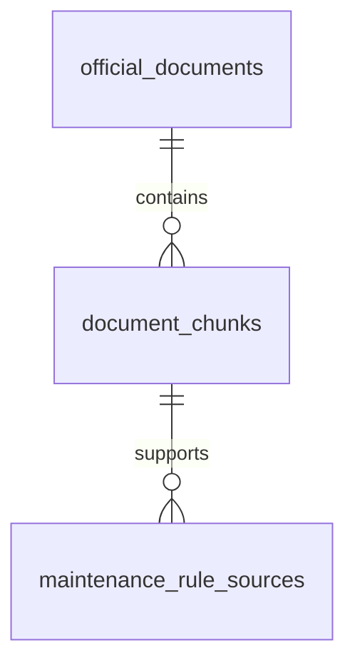

## 7.2 Relationship Details

| Related Entity | Relationship | Cardinality | Description |
| --- | --- | --- | --- |
| Official Document | belongs to | N:1 | Chunk thuộc một tài liệu. |
| Maintenance Rule Source | supports | 1:N | Chunk có thể được dùng làm bằng chứng cho nhiều rule items thông qua bridge. |

### Relationship Rules

* document_id references official_documents.id.
* Một chunk có thể hỗ trợ nhiều rule items qua maintenance_rule_sources.

---

# 8. Entity Lifecycle / State

## 8.1 States

| State | Meaning |
| --- | --- |
| Not defined | Không có status field. |

## 8.2 State Transition


## 8.3 Transition Rules

* Không có state transition được định nghĩa.

---

# 9. Business Rules & Constraints

## BR-ENT-006

**Rule**

Chunk phải thuộc một official document.

**Condition**

Khi tạo chunk.

**Expected Behavior**

document_id bắt buộc.

---

# 10. Data Integrity

## Required Relationships

document_id must reference official_documents.id.

## Referential Integrity

* document_id references official_documents.id.
* Một chunk có thể hỗ trợ nhiều rule items qua maintenance_rule_sources.

## Uniqueness

* No explicit UNIQUE constraint is specified.

## Validation

* content bắt buộc.
* chunk_index bắt buộc, kiểu INT.
* embedding bắt buộc theo source.

---

# 11. Index & Query Requirements

> Mô tả nhu cầu truy vấn ở mức logical. Chi tiết database-specific index được triển khai trong technical design.

| Query | Fields | Frequency | Required Index |
| --- | --- | --- | --- |
| Vector search | embedding | High | Vector index requirement not specified |
| Find by document | document_id | High | Yes |
| Find by chunk position | document_id + chunk_index | Not specified | Not specified |

### Important Query Patterns

```text
1. Semantic search by embedding
2. Find chunks of a document
3. Find chunk by id
```

---

# 12. Ownership & Authorization

| Actor / Role | Read | Create | Update | Delete |
| --- | --- | --- | --- | --- |
| OWNER | Not specified | Not specified | Not specified | Not specified |
| TECHNICIAN | Not specified | Not specified | Not specified | Not specified |

## Ownership Rule

Chunk thuộc official document.

## Authorization Rules

* Authorization details are not specified in source.

---

# 13. Audit Fields

| Field | Type | Description |
| --- | --- | --- |
| created_at | TIMESTAMP | Creation timestamp |

---

# 14. Data Source & Ownership

| Data | Source System | Owner | Sync Type |
| --- | --- | --- | --- |
| Chunk content / embedding | RAG ingest pipeline | Not specified | Not specified |

## Source of Truth

Official document is the referenced source of the chunk.

---

# 15. Data Sensitivity & Security

| Field | Classification | Notes |
| --- | --- | --- |
| content | Not specified | Source-derived document content. |
| embedding | Not specified | Vector representation of content. |

## Security Rules

* Detailed security rules are not specified in source.

---

# 16. Retention & Deletion

## Retention

Not specified in source.

## Deletion Strategy

Not specified in source.

## Deletion Rules

* Dependency handling is not specified in source.

---

# 17. Example Data

```json
{
  "id": "<UUID>",
  "document_id": "<UUID>",
  "content": "<chunk text>",
  "page_number": 12,
  "chunk_index": 10,
  "embedding": "<VECTOR>",
  "created_at": "<timestamp>"
}
```

---

# 18. API References

## Used By

* `Not specified in source.`

## Related API Specification

* `Not provided in source`

---

# 19. Related Entities

| Entity | Relationship | Reference |
| --- | --- | --- |
| OfficialDocument | belongs to |  |
| MaintenanceRuleSource | supports |  |

---

# 20. Related Functional Specifications

* `Not specified in source.`

---

# 21. Open Questions

| ID | Question | Owner | Status |
| --- | --- | --- | --- |
| Q-006 | Embedding dimension/index strategy chưa được nêu trong schema. | TBD | Open |

---

# 22. Change Log

| Version | Date | Author | Changes |
| --- | --- | --- | --- |
| v1.0 | 2026-09-27 | OpenAI | Initial entity specification exported from the supplied template and ERD/table schema. |

---

# 23. Approval

| Role | Name | Status | Date |
| --- | --- | --- | --- |
| Product / Business | TBD | Pending | 2026-09-27 |
| Technical Owner | TBD | Pending | 2026-09-27 |
| Data Owner | TBD | Pending | 2026-09-27 |


---

# maintenance_rule_sources.entity

# Entity Specification
## 1. Entity Information
| Field | Value |
| --- | --- |
| Entity ID | `ENT-007` |
| Entity Name | `Maintenance Rule Source` |
| Business Name | Nguồn chứng minh cho hạng mục bảo dưỡng |
| Version | v1.0 |
| Status | Draft |
| Owner | TBD |
| Created Date | 2026-09-27 |
| Updated Date | 2026-09-27 |
---
# 2. Entity Overview
## 2.1 Description
Đại diện cho mapping giữa maintenance_rule_items và document_chunks để truy vết nguồn RAG.

## 2.2 Business Purpose

Lưu bằng chứng nguồn cho từng hạng mục bảo dưỡng.

## 2.3 Scope

**In Scope**

* Liên kết rule item và document chunk.
* Ghi chú giải thích mapping nếu có.
* Thời điểm tạo mapping.

**Out of Scope**

* Nội dung tài liệu thuộc document_chunks.

---

# 3. Business Meaning

## Definition

Bridge entity biểu diễn quan hệ many-to-many giữa rule items và document chunks.

## Example

Một rule item được chứng minh bởi hai chunks từ tài liệu chính hãng.

## Terminology

* Related term: `RAG source`
* Related term: `Evidence mapping`
* Related term: `Bridge table`
* See glossary: `Not provided in source`

---

# 4. Identity & Keys

## 4.1 Primary Key

| Field | Type | Description |
| --- | --- | --- |
| id | UUID | Định danh mapping |

### Rules

* Unique.
* Not null.
* UUID.

## 4.2 Candidate / Unique Keys

No candidate / unique key is explicitly specified in the source.

---

# 5. Attributes

| Field | Type | Required | Nullable | Default | Description | Constraints |
| --- | --- | --- | --- | --- | --- | --- |
| id | UUID | Yes | No | Not specified | Định danh mapping | PK |
| rule_item_id | UUID | Yes | No | Not specified | Hạng mục bảo dưỡng được chứng minh | FK maintenance_rule_items.id |
| document_chunk_id | UUID | Yes | No | Not specified | Chunk dùng làm bằng chứng | FK document_chunks.id |
| note | TEXT | No | Yes | Not specified | Giải thích vì sao chunk hỗ trợ rule item | - |
| created_at | TIMESTAMP | Yes | No | Not specified | Thời điểm tạo mapping | - |

---

# 6. Attribute Details

## `id`

| Property | Value |
| --- | --- |
| Type | `UUID` |
| Required | Yes |
| Nullable | No |
| Format | PK |
| Default | Not specified |
| Min Length | Not specified |
| Max Length | Not specified |

### Business Meaning

Định danh mapping

### Constraints

* PK
## `rule_item_id`

| Property | Value |
| --- | --- |
| Type | `UUID` |
| Required | Yes |
| Nullable | No |
| Format | FK maintenance_rule_items.id |
| Default | Not specified |
| Min Length | Not specified |
| Max Length | Not specified |

### Business Meaning

Hạng mục bảo dưỡng được chứng minh

### Constraints

* FK maintenance_rule_items.id
## `document_chunk_id`

| Property | Value |
| --- | --- |
| Type | `UUID` |
| Required | Yes |
| Nullable | No |
| Format | FK document_chunks.id |
| Default | Not specified |
| Min Length | Not specified |
| Max Length | Not specified |

### Business Meaning

Chunk dùng làm bằng chứng

### Constraints

* FK document_chunks.id
## `note`

| Property | Value |
| --- | --- |
| Type | `TEXT` |
| Required | No |
| Nullable | Yes |
| Format | - |
| Default | Not specified |
| Min Length | Not specified |
| Max Length | Not specified |

### Business Meaning

Giải thích vì sao chunk hỗ trợ rule item

### Constraints

* -
## `created_at`

| Property | Value |
| --- | --- |
| Type | `TIMESTAMP` |
| Required | Yes |
| Nullable | No |
| Format | - |
| Default | Not specified |
| Min Length | Not specified |
| Max Length | Not specified |

### Business Meaning

Thời điểm tạo mapping

### Constraints

* -

---

# 7. Relationships

## 7.1 Relationship Overview

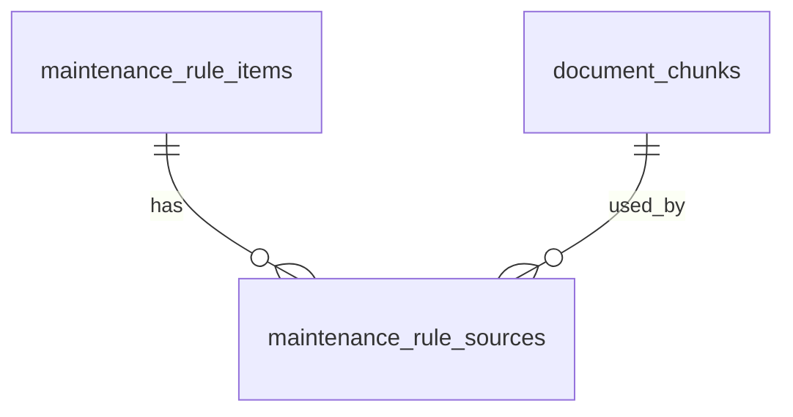

## 7.2 Relationship Details

| Related Entity | Relationship | Cardinality | Description |
| --- | --- | --- | --- |
| Maintenance Rule Item | maps from | N:1 | Mapping tham chiếu một rule item. |
| Document Chunk | maps from | N:1 | Mapping tham chiếu một document chunk. |

### Relationship Rules

* rule_item_id references maintenance_rule_items.id.
* document_chunk_id references document_chunks.id.
* Source mô tả đây là many-to-many bridge.

---

# 8. Entity Lifecycle / State

## 8.1 States

| State | Meaning |
| --- | --- |
| Not defined | Không có status field. |

## 8.2 State Transition


## 8.3 Transition Rules

* Không có state transition được định nghĩa.

---

# 9. Business Rules & Constraints

## BR-ENT-007

**Rule**

Một rule item có thể nối tới nhiều document chunks và ngược lại.

**Condition**

Khi tạo mapping.

**Expected Behavior**

Bridge hỗ trợ quan hệ many-to-many.

---

# 10. Data Integrity

## Required Relationships

Both foreign keys must reference their parent entities.

## Referential Integrity

* rule_item_id references maintenance_rule_items.id.
* document_chunk_id references document_chunks.id.
* Source mô tả đây là many-to-many bridge.

## Uniqueness

* No composite UNIQUE constraint is specified in source.

## Validation

* rule_item_id bắt buộc.
* document_chunk_id bắt buộc.

---

# 11. Index & Query Requirements

> Mô tả nhu cầu truy vấn ở mức logical. Chi tiết database-specific index được triển khai trong technical design.

| Query | Fields | Frequency | Required Index |
| --- | --- | --- | --- |
| Find sources by rule item | rule_item_id | High | Yes |
| Find rule items supported by chunk | document_chunk_id | High | Yes |
| Find mapping by ID | id | Not specified | Primary Key |

### Important Query Patterns

```text
1. Find evidence chunks for a rule item
2. Find rule items supported by a chunk
```

---

# 12. Ownership & Authorization

| Actor / Role | Read | Create | Update | Delete |
| --- | --- | --- | --- | --- |
| OWNER | Not specified | Not specified | Not specified | Not specified |
| TECHNICIAN | Not specified | Not specified | Not specified | Not specified |

## Ownership Rule

Bridge entity không có owner field.

## Authorization Rules

* Authorization details are not specified in source.

---

# 13. Audit Fields

| Field | Type | Description |
| --- | --- | --- |
| created_at | TIMESTAMP | Creation timestamp |

---

# 14. Data Source & Ownership

| Data | Source System | Owner | Sync Type |
| --- | --- | --- | --- |
| RAG mapping | EV Care AI Agent database | Not specified | Not specified |

## Source of Truth

Not specified in source.

---

# 15. Data Sensitivity & Security

| Field | Classification | Notes |
| --- | --- | --- |
| note | Not specified | Optional explanation for evidence mapping. |

## Security Rules

* Detailed security rules are not specified in source.

---

# 16. Retention & Deletion

## Retention

Not specified in source.

## Deletion Strategy

Not specified in source.

## Deletion Rules

* Dependency handling is not specified in source.

---

# 17. Example Data

```json
{
  "id": "<UUID>",
  "rule_item_id": "<UUID>",
  "document_chunk_id": "<UUID>",
  "note": "<Why this chunk supports the rule item>",
  "created_at": "<timestamp>"
}
```

---

# 18. API References

## Used By

* `Not specified in source.`

## Related API Specification

* `Not provided in source`

---

# 19. Related Entities

| Entity | Relationship | Reference |
| --- | --- | --- |
| MaintenanceRuleItem | supports |  |
| DocumentChunk | supports from |  |

---

# 20. Related Functional Specifications

* `Not specified in source.`

---

# 21. Open Questions

| ID | Question | Owner | Status |
| --- | --- | --- | --- |
| Q-007 | Có cần unique(rule_item_id, document_chunk_id)? | TBD | Open |

---

# 22. Change Log

| Version | Date | Author | Changes |
| --- | --- | --- | --- |
| v1.0 | 2026-09-27 | OpenAI | Initial entity specification exported from the supplied template and ERD/table schema. |

---

# 23. Approval

| Role | Name | Status | Date |
| --- | --- | --- | --- |
| Product / Business | TBD | Pending | 2026-09-27 |
| Technical Owner | TBD | Pending | 2026-09-27 |
| Data Owner | TBD | Pending | 2026-09-27 |


---

# service_centers.entity

# Entity Specification
## 1. Entity Information
| Field | Value |
| --- | --- |
| Entity ID | `ENT-008` |
| Entity Name | `Service Center` |
| Business Name | Trung tâm dịch vụ / xưởng |
| Version | v1.0 |
| Status | Draft |
| Owner | TBD |
| Created Date | 2026-09-27 |
| Updated Date | 2026-09-27 |
---
# 2. Entity Overview
## 2.1 Description
Đại diện cho một xưởng hoặc trung tâm dịch vụ dùng cho booking.

## 2.2 Business Purpose

Lưu danh sách xưởng / trung tâm dịch vụ dùng cho booking.

## 2.3 Scope

**In Scope**

* Tên, địa chỉ và thông tin liên hệ.
* Tọa độ nếu có.
* Trạng thái hoạt động.

**Out of Scope**

* Bảng giá chi tiết được lưu ở service_prices; lịch hẹn ở appointments.

---

# 3. Business Meaning

## Definition

Địa điểm dịch vụ mà appointment có thể lựa chọn và service_prices có thể gắn vào.

## Example

Một service center đang hoạt động có tên, địa chỉ, thành phố và số điện thoại.

## Terminology

* Related term: `Service center`
* Related term: `Workshop`
* Related term: `Booking`
* See glossary: `Not provided in source`

---

# 4. Identity & Keys

## 4.1 Primary Key

| Field | Type | Description |
| --- | --- | --- |
| id | UUID | Định danh xưởng |

### Rules

* Unique.
* Not null.
* UUID.

## 4.2 Candidate / Unique Keys

No candidate / unique key is explicitly specified in the source.

---

# 5. Attributes

| Field | Type | Required | Nullable | Default | Description | Constraints |
| --- | --- | --- | --- | --- | --- | --- |
| id | UUID | Yes | No | Not specified | Định danh xưởng | PK |
| name | VARCHAR(200) | Yes | No | Not specified | Tên xưởng | Max 200 chars |
| address | TEXT | Yes | No | Not specified | Địa chỉ | - |
| city | VARCHAR(100) | No | Yes | Not specified | Thành phố | Max 100 chars |
| latitude | DECIMAL | No | Yes | Not specified | Vĩ độ | Decimal |
| longitude | DECIMAL | No | Yes | Not specified | Kinh độ | Decimal |
| phone | VARCHAR(30) | No | Yes | Not specified | Số điện thoại | Max 30 chars |
| is_active | BOOLEAN | Yes | No | Not specified | Trạng thái hoạt động | Boolean |
| created_at | TIMESTAMP | Yes | No | Not specified | Thời điểm tạo | - |
| updated_at | TIMESTAMP | No | Yes | Not specified | Thời điểm cập nhật | - |

---

# 6. Attribute Details

## `id`

| Property | Value |
| --- | --- |
| Type | `UUID` |
| Required | Yes |
| Nullable | No |
| Format | PK |
| Default | Not specified |
| Min Length | Not specified |
| Max Length | Not specified |

### Business Meaning

Định danh xưởng

### Constraints

* PK
## `name`

| Property | Value |
| --- | --- |
| Type | `VARCHAR(200)` |
| Required | Yes |
| Nullable | No |
| Format | Max 200 chars |
| Default | Not specified |
| Min Length | Not specified |
| Max Length | Not specified |

### Business Meaning

Tên xưởng

### Constraints

* Max 200 chars
## `address`

| Property | Value |
| --- | --- |
| Type | `TEXT` |
| Required | Yes |
| Nullable | No |
| Format | - |
| Default | Not specified |
| Min Length | Not specified |
| Max Length | Not specified |

### Business Meaning

Địa chỉ

### Constraints

* -
## `city`

| Property | Value |
| --- | --- |
| Type | `VARCHAR(100)` |
| Required | No |
| Nullable | Yes |
| Format | Max 100 chars |
| Default | Not specified |
| Min Length | Not specified |
| Max Length | Not specified |

### Business Meaning

Thành phố

### Constraints

* Max 100 chars
## `latitude`

| Property | Value |
| --- | --- |
| Type | `DECIMAL` |
| Required | No |
| Nullable | Yes |
| Format | Decimal |
| Default | Not specified |
| Min Length | Not specified |
| Max Length | Not specified |

### Business Meaning

Vĩ độ

### Constraints

* Decimal
## `longitude`

| Property | Value |
| --- | --- |
| Type | `DECIMAL` |
| Required | No |
| Nullable | Yes |
| Format | Decimal |
| Default | Not specified |
| Min Length | Not specified |
| Max Length | Not specified |

### Business Meaning

Kinh độ

### Constraints

* Decimal
## `phone`

| Property | Value |
| --- | --- |
| Type | `VARCHAR(30)` |
| Required | No |
| Nullable | Yes |
| Format | Max 30 chars |
| Default | Not specified |
| Min Length | Not specified |
| Max Length | Not specified |

### Business Meaning

Số điện thoại

### Constraints

* Max 30 chars
## `is_active`

| Property | Value |
| --- | --- |
| Type | `BOOLEAN` |
| Required | Yes |
| Nullable | No |
| Format | Boolean |
| Default | Not specified |
| Min Length | Not specified |
| Max Length | Not specified |

### Business Meaning

Trạng thái hoạt động

### Constraints

* Boolean
## `created_at`

| Property | Value |
| --- | --- |
| Type | `TIMESTAMP` |
| Required | Yes |
| Nullable | No |
| Format | - |
| Default | Not specified |
| Min Length | Not specified |
| Max Length | Not specified |

### Business Meaning

Thời điểm tạo

### Constraints

* -
## `updated_at`

| Property | Value |
| --- | --- |
| Type | `TIMESTAMP` |
| Required | No |
| Nullable | Yes |
| Format | - |
| Default | Not specified |
| Min Length | Not specified |
| Max Length | Not specified |

### Business Meaning

Thời điểm cập nhật

### Constraints

* -

---

# 7. Relationships

## 7.1 Relationship Overview

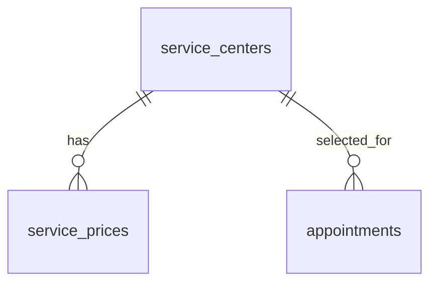

## 7.2 Relationship Details

| Related Entity | Relationship | Cardinality | Description |
| --- | --- | --- | --- |
| Service Price | has | 1:N | Một service center có nhiều service prices. |
| Appointment | referenced by | 1:N | Service center được tham chiếu bởi appointments. |

### Relationship Rules

* service_prices.service_center_id references service_centers.id.
* appointments.service_center_id references service_centers.id.

---

# 8. Entity Lifecycle / State

## 8.1 States

| State | Meaning |
| --- | --- |
| ACTIVE | is_active = true |
| INACTIVE | is_active = false |

## 8.2 State Transition

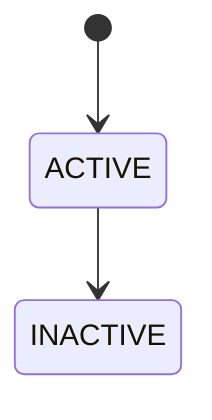

## 8.3 Transition Rules

* ACTIVE → INACTIVE: điều kiện thay đổi is_active không được nêu.
* INACTIVE → ACTIVE: điều kiện thay đổi is_active không được nêu.

---

# 9. Business Rules & Constraints

## BR-ENT-008

**Rule**

is_active biểu diễn trạng thái hoạt động của service center.

**Condition**

Khi service center không/đang hoạt động.

**Expected Behavior**

Các appointment mới nên tham chiếu service center phù hợp; rule chi tiết chưa được nêu.

---

# 10. Data Integrity

## Required Relationships

Referenced by service_prices and appointments through service_center_id.

## Referential Integrity

* service_prices.service_center_id references service_centers.id.
* appointments.service_center_id references service_centers.id.

## Uniqueness

* No explicit UNIQUE constraint is specified.

## Validation

* name bắt buộc, tối đa 200 ký tự.
* address bắt buộc.
* phone tối đa 30 ký tự nếu có.

---

# 11. Index & Query Requirements

> Mô tả nhu cầu truy vấn ở mức logical. Chi tiết database-specific index được triển khai trong technical design.

| Query | Fields | Frequency | Required Index |
| --- | --- | --- | --- |
| Find active service centers | is_active | High | Yes |
| Find by city | city | Medium | Not specified |
| Find by ID | id | High | Primary Key |

### Important Query Patterns

```text
1. Find active service centers
2. Find service centers by city
3. Find service center by id
```

---

# 12. Ownership & Authorization

| Actor / Role | Read | Create | Update | Delete |
| --- | --- | --- | --- | --- |
| OWNER | Not specified | Not specified | Not specified | Not specified |
| TECHNICIAN | Not specified | Not specified | Not specified | Not specified |

## Ownership Rule

Không có owner field; service center là dữ liệu dùng cho booking.

## Authorization Rules

* Authorization details are not specified in source.

---

# 13. Audit Fields

| Field | Type | Description |
| --- | --- | --- |
| created_at | TIMESTAMP | Creation timestamp |
| updated_at | TIMESTAMP | Last update |

---

# 14. Data Source & Ownership

| Data | Source System | Owner | Sync Type |
| --- | --- | --- | --- |
| Service center directory | EV Care AI Agent database | Not specified | Not specified |

## Source of Truth

Not specified in source.

---

# 15. Data Sensitivity & Security

| Field | Classification | Notes |
| --- | --- | --- |
| phone | Not specified | Service center contact information. |

## Security Rules

* Detailed security rules are not specified in source.

---

# 16. Retention & Deletion

## Retention

Not specified in source.

## Deletion Strategy

Not specified in source.

## Deletion Rules

* Dependency handling is not specified in source.

---

# 17. Example Data

```json
{
  "id": "<UUID>",
  "name": "<Service Center Name>",
  "address": "<Address>",
  "city": "<City>",
  "latitude": 21.0,
  "longitude": 105.8,
  "phone": "<Phone>",
  "is_active": true,
  "created_at": "<timestamp>",
  "updated_at": "<timestamp>"
}
```

---

# 18. API References

## Used By

* `Not specified in source.`

## Related API Specification

* `Not provided in source`

---

# 19. Related Entities

| Entity | Relationship | Reference |
| --- | --- | --- |
| ServicePrice | has |  |
| Appointment | selected for |  |

---

# 20. Related Functional Specifications

* `Not specified in source.`

---

# 21. Open Questions

| ID | Question | Owner | Status |
| --- | --- | --- | --- |
| Q-008 | Có cần quản lý giờ mở cửa, năng lực xưởng và slot booking? | TBD | Open |

---

# 22. Change Log

| Version | Date | Author | Changes |
| --- | --- | --- | --- |
| v1.0 | 2026-09-27 | OpenAI | Initial entity specification exported from the supplied template and ERD/table schema. |

---

# 23. Approval

| Role | Name | Status | Date |
| --- | --- | --- | --- |
| Product / Business | TBD | Pending | 2026-09-27 |
| Technical Owner | TBD | Pending | 2026-09-27 |
| Data Owner | TBD | Pending | 2026-09-27 |


---

# service_prices.entity

# Entity Specification
## 1. Entity Information
| Field | Value |
| --- | --- |
| Entity ID | `ENT-009` |
| Entity Name | `Service Price` |
| Business Name | Bảng giá dịch vụ |
| Version | v1.0 |
| Status | Draft |
| Owner | TBD |
| Created Date | 2026-09-27 |
| Updated Date | 2026-09-27 |
---
# 2. Entity Overview
## 2.1 Description
Đại diện cho một mức giá dịch vụ tại một service center theo model và item code.

## 2.2 Business Purpose

Lưu bảng giá dùng bởi Cost Estimate Tool.

## 2.3 Scope

**In Scope**

* Xưởng áp dụng.
* Model xe và item code.
* Giá ước tính và thời gian hiệu lực.

**Out of Scope**

* Báo giá cụ thể cho vehicle được lưu ở quotes và quote_items.

---

# 3. Business Meaning

## Definition

Một bản ghi giá tham chiếu để ước tính chi phí dịch vụ.

## Example

Giá của một item_code cho model VF6 tại một service center, có valid_from/valid_to.

## Terminology

* Related term: `Service price`
* Related term: `Estimated price`
* Related term: `Validity period`
* See glossary: `Not provided in source`

---

# 4. Identity & Keys

## 4.1 Primary Key

| Field | Type | Description |
| --- | --- | --- |
| id | UUID | Định danh giá |

### Rules

* Unique.
* Not null.
* UUID.

## 4.2 Candidate / Unique Keys

No candidate / unique key is explicitly specified in the source.

---

# 5. Attributes

| Field | Type | Required | Nullable | Default | Description | Constraints |
| --- | --- | --- | --- | --- | --- | --- |
| id | UUID | Yes | No | Not specified | Định danh giá | PK |
| service_center_id | UUID | Yes | No | Not specified | Xưởng áp dụng | FK service_centers.id |
| vehicle_model | VARCHAR(50) | Yes | No | Not specified | Model áp dụng | Max 50 chars |
| item_code | VARCHAR(50) | Yes | No | Not specified | Mã hạng mục | Max 50 chars |
| item_name | VARCHAR(200) | Yes | No | Not specified | Tên hạng mục | Max 200 chars |
| price | DECIMAL(12,2) | Yes | No | Not specified | Giá ước tính | Decimal(12,2) |
| valid_from | DATE | No | Yes | Not specified | Ngày bắt đầu hiệu lực | - |
| valid_to | DATE | No | Yes | Not specified | Ngày kết thúc hiệu lực | - |
| created_at | TIMESTAMP | Yes | No | Not specified | Thời điểm tạo | - |
| updated_at | TIMESTAMP | No | Yes | Not specified | Thời điểm cập nhật | - |

---

# 6. Attribute Details

## `id`

| Property | Value |
| --- | --- |
| Type | `UUID` |
| Required | Yes |
| Nullable | No |
| Format | PK |
| Default | Not specified |
| Min Length | Not specified |
| Max Length | Not specified |

### Business Meaning

Định danh giá

### Constraints

* PK
## `service_center_id`

| Property | Value |
| --- | --- |
| Type | `UUID` |
| Required | Yes |
| Nullable | No |
| Format | FK service_centers.id |
| Default | Not specified |
| Min Length | Not specified |
| Max Length | Not specified |

### Business Meaning

Xưởng áp dụng

### Constraints

* FK service_centers.id
## `vehicle_model`

| Property | Value |
| --- | --- |
| Type | `VARCHAR(50)` |
| Required | Yes |
| Nullable | No |
| Format | Max 50 chars |
| Default | Not specified |
| Min Length | Not specified |
| Max Length | Not specified |

### Business Meaning

Model áp dụng

### Constraints

* Max 50 chars
## `item_code`

| Property | Value |
| --- | --- |
| Type | `VARCHAR(50)` |
| Required | Yes |
| Nullable | No |
| Format | Max 50 chars |
| Default | Not specified |
| Min Length | Not specified |
| Max Length | Not specified |

### Business Meaning

Mã hạng mục

### Constraints

* Max 50 chars
## `item_name`

| Property | Value |
| --- | --- |
| Type | `VARCHAR(200)` |
| Required | Yes |
| Nullable | No |
| Format | Max 200 chars |
| Default | Not specified |
| Min Length | Not specified |
| Max Length | Not specified |

### Business Meaning

Tên hạng mục

### Constraints

* Max 200 chars
## `price`

| Property | Value |
| --- | --- |
| Type | `DECIMAL(12,2)` |
| Required | Yes |
| Nullable | No |
| Format | Decimal(12,2) |
| Default | Not specified |
| Min Length | Not specified |
| Max Length | Not specified |

### Business Meaning

Giá ước tính

### Constraints

* Decimal(12,2)
## `valid_from`

| Property | Value |
| --- | --- |
| Type | `DATE` |
| Required | No |
| Nullable | Yes |
| Format | - |
| Default | Not specified |
| Min Length | Not specified |
| Max Length | Not specified |

### Business Meaning

Ngày bắt đầu hiệu lực

### Constraints

* -
## `valid_to`

| Property | Value |
| --- | --- |
| Type | `DATE` |
| Required | No |
| Nullable | Yes |
| Format | - |
| Default | Not specified |
| Min Length | Not specified |
| Max Length | Not specified |

### Business Meaning

Ngày kết thúc hiệu lực

### Constraints

* -
## `created_at`

| Property | Value |
| --- | --- |
| Type | `TIMESTAMP` |
| Required | Yes |
| Nullable | No |
| Format | - |
| Default | Not specified |
| Min Length | Not specified |
| Max Length | Not specified |

### Business Meaning

Thời điểm tạo

### Constraints

* -
## `updated_at`

| Property | Value |
| --- | --- |
| Type | `TIMESTAMP` |
| Required | No |
| Nullable | Yes |
| Format | - |
| Default | Not specified |
| Min Length | Not specified |
| Max Length | Not specified |

### Business Meaning

Thời điểm cập nhật

### Constraints

* -

---

# 7. Relationships

## 7.1 Relationship Overview

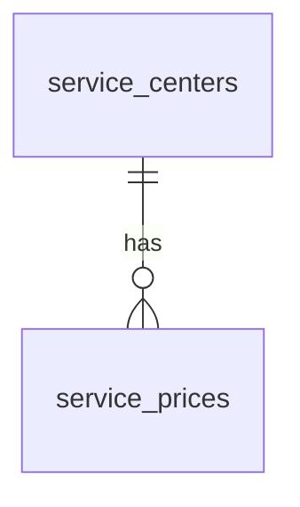

## 7.2 Relationship Details

| Related Entity | Relationship | Cardinality | Description |
| --- | --- | --- | --- |
| Service Center | belongs to | N:1 | Mỗi service price thuộc một service center. |

### Relationship Rules

* service_center_id references service_centers.id.

---

# 8. Entity Lifecycle / State

## 8.1 States

| State | Meaning |
| --- | --- |
| Not defined | Validity is represented by valid_from / valid_to, not status. |

## 8.2 State Transition


## 8.3 Transition Rules

* Không có state transition được định nghĩa.

---

# 9. Business Rules & Constraints

## BR-ENT-009

**Rule**

Giá thuộc một service center, model và item code.

**Condition**

Khi tạo bảng giá.

**Expected Behavior**

Lưu price và validity period nếu có.

---

# 10. Data Integrity

## Required Relationships

service_center_id must reference service_centers.id.

## Referential Integrity

* service_center_id references service_centers.id.

## Uniqueness

* No explicit UNIQUE constraint is specified.

## Validation

* vehicle_model tối đa 50 ký tự.
* item_code tối đa 50 ký tự.
* item_name tối đa 200 ký tự.
* price DECIMAL(12,2).

---

# 11. Index & Query Requirements

> Mô tả nhu cầu truy vấn ở mức logical. Chi tiết database-specific index được triển khai trong technical design.

| Query | Fields | Frequency | Required Index |
| --- | --- | --- | --- |
| Find prices by service center | service_center_id | High | Yes |
| Find applicable price | service_center_id + vehicle_model + item_code | High | Not specified |
| Find by validity | valid_from + valid_to | High | Not specified |

### Important Query Patterns

```text
1. Find service prices for a center
2. Find current price for model + item
3. Find price by id
```

---

# 12. Ownership & Authorization

| Actor / Role | Read | Create | Update | Delete |
| --- | --- | --- | --- | --- |
| OWNER | Not specified | Not specified | Not specified | Not specified |
| TECHNICIAN | Not specified | Not specified | Not specified | Not specified |

## Ownership Rule

Không có owner field; thuộc service center.

## Authorization Rules

* Authorization details are not specified in source.

---

# 13. Audit Fields

| Field | Type | Description |
| --- | --- | --- |
| created_at | TIMESTAMP | Creation timestamp |
| updated_at | TIMESTAMP | Last update |

---

# 14. Data Source & Ownership

| Data | Source System | Owner | Sync Type |
| --- | --- | --- | --- |
| Service price | EV Care AI Agent database | Not specified | Not specified |

## Source of Truth

Not specified in source.

---

# 15. Data Sensitivity & Security

| Field | Classification | Notes |
| --- | --- | --- |
| price | Not specified | Business pricing data. |

## Security Rules

* Detailed security rules are not specified in source.

---

# 16. Retention & Deletion

## Retention

Not specified in source.

## Deletion Strategy

Not specified in source.

## Deletion Rules

* Dependency handling is not specified in source.

---

# 17. Example Data

```json
{
  "id": "<UUID>",
  "service_center_id": "<UUID>",
  "vehicle_model": "VF6",
  "item_code": "<ITEM_CODE>",
  "item_name": "<Item Name>",
  "price": 1500000.0,
  "valid_from": "<date>",
  "valid_to": "<date>",
  "created_at": "<timestamp>",
  "updated_at": "<timestamp>"
}
```

---

# 18. API References

## Used By

* `Not specified in source.`

## Related API Specification

* `Not provided in source`

---

# 19. Related Entities

| Entity | Relationship | Reference |
| --- | --- | --- |
| ServiceCenter | belongs to |  |

---

# 20. Related Functional Specifications

* `Not specified in source.`

---

# 21. Open Questions

| ID | Question | Owner | Status |
| --- | --- | --- | --- |
| Q-009 | Có cần unique theo service_center_id + vehicle_model + item_code + valid_from? | TBD | Open |

---

# 22. Change Log

| Version | Date | Author | Changes |
| --- | --- | --- | --- |
| v1.0 | 2026-09-27 | OpenAI | Initial entity specification exported from the supplied template and ERD/table schema. |

---

# 23. Approval

| Role | Name | Status | Date |
| --- | --- | --- | --- |
| Product / Business | TBD | Pending | 2026-09-27 |
| Technical Owner | TBD | Pending | 2026-09-27 |
| Data Owner | TBD | Pending | 2026-09-27 |


---

# quotes.entity

# Entity Specification
## 1. Entity Information
| Field | Value |
| --- | --- |
| Entity ID | `ENT-010` |
| Entity Name | `Quote` |
| Business Name | Báo giá |
| Version | v1.0 |
| Status | Draft |
| Owner | TBD |
| Created Date | 2026-09-27 |
| Updated Date | 2026-09-27 |
---
# 2. Entity Overview
## 2.1 Description
Đại diện cho một báo giá gắn với vehicle, có thể tham chiếu maintenance rule và technician duyệt.

## 2.2 Business Purpose

Lưu báo giá và trạng thái HITL.

## 2.3 Scope

**In Scope**

* Vehicle, maintenance rule và technician liên quan.
* Status HITL.
* Tổng ước tính, tổng được duyệt và ghi chú kỹ thuật viên.

**Out of Scope**

* Chi tiết từng hạng mục được lưu ở quote_items.

---

# 3. Business Meaning

## Definition

Một báo giá được tạo cho vehicle và có thể đi qua quy trình DRAFT → PENDING_APPROVAL → APPROVED/REJECTED theo status được mô tả.

## Example

Một quote cho vehicle, estimated_total ban đầu và approved_total sau khi technician duyệt.

## Terminology

* Related term: `Quote`
* Related term: `HITL`
* Related term: `Technician approval`
* Related term: `Approved total`
* See glossary: `Not provided in source`

---

# 4. Identity & Keys

## 4.1 Primary Key

| Field | Type | Description |
| --- | --- | --- |
| id | UUID | Định danh báo giá |

### Rules

* Unique.
* Not null.
* UUID.

## 4.2 Candidate / Unique Keys

No candidate / unique key is explicitly specified in the source.

---

# 5. Attributes

| Field | Type | Required | Nullable | Default | Description | Constraints |
| --- | --- | --- | --- | --- | --- | --- |
| id | UUID | Yes | No | Not specified | Định danh báo giá | PK |
| vehicle_id | UUID | Yes | No | Not specified | Xe được báo giá | FK vehicles.id |
| maintenance_rule_id | UUID | No | Yes | Not specified | Mốc bảo dưỡng liên quan | FK maintenance_rules.id |
| technician_id | UUID | No | Yes | Not specified | Kỹ thuật viên duyệt | FK users.id |
| status | VARCHAR(30) | Yes | No | Not specified | Trạng thái HITL | DRAFT / PENDING_APPROVAL / APPROVED / REJECTED |
| estimated_total | DECIMAL(12,2) | Yes | No | Not specified | Tổng giá ước tính | Decimal(12,2) |
| approved_total | DECIMAL(12,2) | No | Yes | Not specified | Tổng sau kỹ thuật viên duyệt | Decimal(12,2) |
| technician_note | TEXT | No | Yes | Not specified | Ghi chú kỹ thuật viên | - |
| created_at | TIMESTAMP | Yes | No | Not specified | Thời điểm tạo | - |
| updated_at | TIMESTAMP | No | Yes | Not specified | Thời điểm cập nhật | - |
| approved_at | TIMESTAMP | No | Yes | Not specified | Thời điểm duyệt | - |

---

# 6. Attribute Details

## `id`

| Property | Value |
| --- | --- |
| Type | `UUID` |
| Required | Yes |
| Nullable | No |
| Format | PK |
| Default | Not specified |
| Min Length | Not specified |
| Max Length | Not specified |

### Business Meaning

Định danh báo giá

### Constraints

* PK
## `vehicle_id`

| Property | Value |
| --- | --- |
| Type | `UUID` |
| Required | Yes |
| Nullable | No |
| Format | FK vehicles.id |
| Default | Not specified |
| Min Length | Not specified |
| Max Length | Not specified |

### Business Meaning

Xe được báo giá

### Constraints

* FK vehicles.id
## `maintenance_rule_id`

| Property | Value |
| --- | --- |
| Type | `UUID` |
| Required | No |
| Nullable | Yes |
| Format | FK maintenance_rules.id |
| Default | Not specified |
| Min Length | Not specified |
| Max Length | Not specified |

### Business Meaning

Mốc bảo dưỡng liên quan

### Constraints

* FK maintenance_rules.id
## `technician_id`

| Property | Value |
| --- | --- |
| Type | `UUID` |
| Required | No |
| Nullable | Yes |
| Format | FK users.id |
| Default | Not specified |
| Min Length | Not specified |
| Max Length | Not specified |

### Business Meaning

Kỹ thuật viên duyệt

### Constraints

* FK users.id
## `status`

| Property | Value |
| --- | --- |
| Type | `VARCHAR(30)` |
| Required | Yes |
| Nullable | No |
| Format | DRAFT / PENDING_APPROVAL / APPROVED / REJECTED |
| Default | Not specified |
| Min Length | Not specified |
| Max Length | Not specified |

### Business Meaning

Trạng thái HITL

### Constraints

* DRAFT / PENDING_APPROVAL / APPROVED / REJECTED
## `estimated_total`

| Property | Value |
| --- | --- |
| Type | `DECIMAL(12,2)` |
| Required | Yes |
| Nullable | No |
| Format | Decimal(12,2) |
| Default | Not specified |
| Min Length | Not specified |
| Max Length | Not specified |

### Business Meaning

Tổng giá ước tính

### Constraints

* Decimal(12,2)
## `approved_total`

| Property | Value |
| --- | --- |
| Type | `DECIMAL(12,2)` |
| Required | No |
| Nullable | Yes |
| Format | Decimal(12,2) |
| Default | Not specified |
| Min Length | Not specified |
| Max Length | Not specified |

### Business Meaning

Tổng sau kỹ thuật viên duyệt

### Constraints

* Decimal(12,2)
## `technician_note`

| Property | Value |
| --- | --- |
| Type | `TEXT` |
| Required | No |
| Nullable | Yes |
| Format | - |
| Default | Not specified |
| Min Length | Not specified |
| Max Length | Not specified |

### Business Meaning

Ghi chú kỹ thuật viên

### Constraints

* -
## `created_at`

| Property | Value |
| --- | --- |
| Type | `TIMESTAMP` |
| Required | Yes |
| Nullable | No |
| Format | - |
| Default | Not specified |
| Min Length | Not specified |
| Max Length | Not specified |

### Business Meaning

Thời điểm tạo

### Constraints

* -
## `updated_at`

| Property | Value |
| --- | --- |
| Type | `TIMESTAMP` |
| Required | No |
| Nullable | Yes |
| Format | - |
| Default | Not specified |
| Min Length | Not specified |
| Max Length | Not specified |

### Business Meaning

Thời điểm cập nhật

### Constraints

* -
## `approved_at`

| Property | Value |
| --- | --- |
| Type | `TIMESTAMP` |
| Required | No |
| Nullable | Yes |
| Format | - |
| Default | Not specified |
| Min Length | Not specified |
| Max Length | Not specified |

### Business Meaning

Thời điểm duyệt

### Constraints

* -

---

# 7. Relationships

## 7.1 Relationship Overview

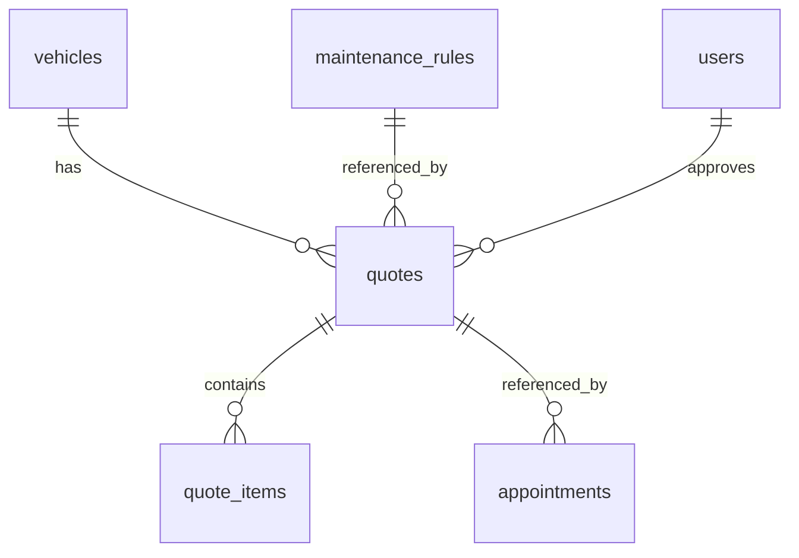

## 7.2 Relationship Details

| Related Entity | Relationship | Cardinality | Description |
| --- | --- | --- | --- |
| Vehicle | belongs to | N:1 | Quote thuộc một vehicle. |
| Maintenance Rule | references | N:1 | Quote có thể gắn một maintenance rule. |
| User | technician | N:1 | Quote có thể gắn một technician duyệt. |
| Quote Item | contains | 1:N | Một quote có nhiều quote items. |
| Appointment | referenced by | 1:N | Appointment có thể tham chiếu quote. |

### Relationship Rules

* vehicle_id bắt buộc.
* maintenance_rule_id và technician_id nullable.
* Quote có nhiều quote_items.

---

# 8. Entity Lifecycle / State

## 8.1 States

| State | Meaning |
| --- | --- |
| DRAFT | Bản nháp |
| PENDING_APPROVAL | Chờ kỹ thuật viên duyệt |
| APPROVED | Đã duyệt |
| REJECTED | Bị từ chối |

## 8.2 State Transition

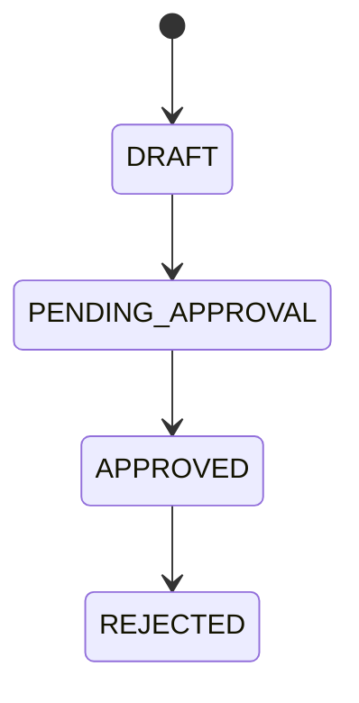

## 8.3 Transition Rules

* Các state tồn tại trong source; điều kiện chuyển trạng thái chi tiết không được nêu.
* approved_at chỉ có ý nghĩa khi có phê duyệt theo mô tả schema.

---

# 9. Business Rules & Constraints

## BR-ENT-010

**Rule**

Quote có trạng thái HITL DRAFT / PENDING_APPROVAL / APPROVED / REJECTED.

**Condition**

Khi quote đi qua quy trình duyệt.

**Expected Behavior**

Lưu trạng thái tương ứng.

## BR-ENT-011

**Rule**

technician_id là kỹ thuật viên duyệt quote và nullable.

**Condition**

Khi quote chưa được gán/duyệt.

**Expected Behavior**

Có thể để null.

---

# 10. Data Integrity

## Required Relationships

vehicle_id references vehicles.id; maintenance_rule_id references maintenance_rules.id when present; technician_id references users.id when present; quote_items.quote_id references quotes.id.

## Referential Integrity

* vehicle_id bắt buộc.
* maintenance_rule_id và technician_id nullable.
* Quote có nhiều quote_items.

## Uniqueness

* No explicit UNIQUE constraint is specified.

## Validation

* status phải thuộc các giá trị được source liệt kê.
* estimated_total bắt buộc DECIMAL(12,2).
* approved_total nullable DECIMAL(12,2).

---

# 11. Index & Query Requirements

> Mô tả nhu cầu truy vấn ở mức logical. Chi tiết database-specific index được triển khai trong technical design.

| Query | Fields | Frequency | Required Index |
| --- | --- | --- | --- |
| Find quotes by vehicle | vehicle_id | High | Yes |
| Find pending approvals | status | High | Yes |
| Find quotes by technician | technician_id | Medium | Yes |
| Find by ID | id | High | Primary Key |

### Important Query Patterns

```text
1. Find quotes for a vehicle
2. Find quotes pending approval
3. Find quote by id
```

---

# 12. Ownership & Authorization

| Actor / Role | Read | Create | Update | Delete |
| --- | --- | --- | --- | --- |
| OWNER | Not specified | Not specified | Not specified | Not specified |
| TECHNICIAN | Not specified | Not specified | Not specified | Not specified |

## Ownership Rule

Quote thuộc vehicle; technician có thể là người duyệt.

## Authorization Rules

* Exact permissions for viewing/creating/approving quotes are not specified in source.

---

# 13. Audit Fields

| Field | Type | Description |
| --- | --- | --- |
| created_at | TIMESTAMP | Creation timestamp |
| updated_at | TIMESTAMP | Last update |
| approved_at | TIMESTAMP | Approval timestamp when present |

---

# 14. Data Source & Ownership

| Data | Source System | Owner | Sync Type |
| --- | --- | --- | --- |
| Quote | Cost Estimate / HITL flow in EV Care AI Agent | Not specified | Not specified |

## Source of Truth

Not specified in source.

---

# 15. Data Sensitivity & Security

| Field | Classification | Notes |
| --- | --- | --- |
| technician_note | Not specified | Technician note may contain service information. |

## Security Rules

* Detailed security rules are not specified in source.

---

# 16. Retention & Deletion

## Retention

Not specified in source.

## Deletion Strategy

Not specified in source.

## Deletion Rules

* Dependency handling is not specified in source.

---

# 17. Example Data

```json
{
  "id": "<UUID>",
  "vehicle_id": "<UUID>",
  "maintenance_rule_id": "<UUID>",
  "technician_id": "<UUID>",
  "status": "PENDING_APPROVAL",
  "estimated_total": 3000000.0,
  "approved_total": null,
  "technician_note": "<Note>",
  "created_at": "<timestamp>",
  "updated_at": "<timestamp>",
  "approved_at": null
}
```

---

# 18. API References

## Used By

* `Not specified in source.`

## Related API Specification

* `Not provided in source`

---

# 19. Related Entities

| Entity | Relationship | Reference |
| --- | --- | --- |
| Vehicle | quote for |  |
| MaintenanceRule | related to |  |
| User | technician |  |
| QuoteItem | contains |  |
| Appointment | referenced by |  |

---

# 20. Related Functional Specifications

* `Not specified in source.`

---

# 21. Open Questions

| ID | Question | Owner | Status |
| --- | --- | --- | --- |
| Q-010 | Ai được phép chuyển từng quote status? | TBD | Open |
| Q-011 | Có cần lưu lý do REJECTED bắt buộc không? | TBD | Open |

---

# 22. Change Log

| Version | Date | Author | Changes |
| --- | --- | --- | --- |
| v1.0 | 2026-09-27 | OpenAI | Initial entity specification exported from the supplied template and ERD/table schema. |

---

# 23. Approval

| Role | Name | Status | Date |
| --- | --- | --- | --- |
| Product / Business | TBD | Pending | 2026-09-27 |
| Technical Owner | TBD | Pending | 2026-09-27 |
| Data Owner | TBD | Pending | 2026-09-27 |


---

# quote_items.entity

# Entity Specification
## 1. Entity Information
| Field | Value |
| --- | --- |
| Entity ID | `ENT-011` |
| Entity Name | `Quote Item` |
| Business Name | Chi tiết báo giá |
| Version | v1.0 |
| Status | Draft |
| Owner | TBD |
| Created Date | 2026-09-27 |
| Updated Date | 2026-09-27 |
---
# 2. Entity Overview
## 2.1 Description
Đại diện cho một dòng hạng mục trong báo giá.

## 2.2 Business Purpose

Lưu chi tiết từng hạng mục trong báo giá.

## 2.3 Scope

**In Scope**

* Quote cha, item code/name.
* Giá ước tính và giá được technician xác nhận.
* Ghi chú.

**Out of Scope**

* Tổng báo giá và trạng thái HITL thuộc quotes.

---

# 3. Business Meaning

## Definition

Một line item thuộc một quote.

## Example

Một quote item có estimated_price và optional approved_price.

## Terminology

* Related term: `Quote item`
* Related term: `Estimated price`
* Related term: `Approved price`
* See glossary: `Not provided in source`

---

# 4. Identity & Keys

## 4.1 Primary Key

| Field | Type | Description |
| --- | --- | --- |
| id | UUID | Định danh dòng |

### Rules

* Unique.
* Not null.
* UUID.

## 4.2 Candidate / Unique Keys

No candidate / unique key is explicitly specified in the source.

---

# 5. Attributes

| Field | Type | Required | Nullable | Default | Description | Constraints |
| --- | --- | --- | --- | --- | --- | --- |
| id | UUID | Yes | No | Not specified | Định danh dòng | PK |
| quote_id | UUID | Yes | No | Not specified | Báo giá cha | FK quotes.id |
| item_code | VARCHAR(50) | Yes | No | Not specified | Mã hạng mục | Max 50 chars |
| item_name | VARCHAR(200) | Yes | No | Not specified | Tên hạng mục | Max 200 chars |
| estimated_price | DECIMAL(12,2) | Yes | No | Not specified | Giá ước tính | Decimal(12,2) |
| approved_price | DECIMAL(12,2) | No | Yes | Not specified | Giá kỹ thuật viên xác nhận | Decimal(12,2) |
| note | TEXT | No | Yes | Not specified | Ghi chú | - |
| created_at | TIMESTAMP | No | No | Not specified | Thời điểm tạo | - |

---

# 6. Attribute Details

## `id`

| Property | Value |
| --- | --- |
| Type | `UUID` |
| Required | Yes |
| Nullable | No |
| Format | PK |
| Default | Not specified |
| Min Length | Not specified |
| Max Length | Not specified |

### Business Meaning

Định danh dòng

### Constraints

* PK
## `quote_id`

| Property | Value |
| --- | --- |
| Type | `UUID` |
| Required | Yes |
| Nullable | No |
| Format | FK quotes.id |
| Default | Not specified |
| Min Length | Not specified |
| Max Length | Not specified |

### Business Meaning

Báo giá cha

### Constraints

* FK quotes.id
## `item_code`

| Property | Value |
| --- | --- |
| Type | `VARCHAR(50)` |
| Required | Yes |
| Nullable | No |
| Format | Max 50 chars |
| Default | Not specified |
| Min Length | Not specified |
| Max Length | Not specified |

### Business Meaning

Mã hạng mục

### Constraints

* Max 50 chars
## `item_name`

| Property | Value |
| --- | --- |
| Type | `VARCHAR(200)` |
| Required | Yes |
| Nullable | No |
| Format | Max 200 chars |
| Default | Not specified |
| Min Length | Not specified |
| Max Length | Not specified |

### Business Meaning

Tên hạng mục

### Constraints

* Max 200 chars
## `estimated_price`

| Property | Value |
| --- | --- |
| Type | `DECIMAL(12,2)` |
| Required | Yes |
| Nullable | No |
| Format | Decimal(12,2) |
| Default | Not specified |
| Min Length | Not specified |
| Max Length | Not specified |

### Business Meaning

Giá ước tính

### Constraints

* Decimal(12,2)
## `approved_price`

| Property | Value |
| --- | --- |
| Type | `DECIMAL(12,2)` |
| Required | No |
| Nullable | Yes |
| Format | Decimal(12,2) |
| Default | Not specified |
| Min Length | Not specified |
| Max Length | Not specified |

### Business Meaning

Giá kỹ thuật viên xác nhận

### Constraints

* Decimal(12,2)
## `note`

| Property | Value |
| --- | --- |
| Type | `TEXT` |
| Required | No |
| Nullable | Yes |
| Format | - |
| Default | Not specified |
| Min Length | Not specified |
| Max Length | Not specified |

### Business Meaning

Ghi chú

### Constraints

* -
## `created_at`

| Property | Value |
| --- | --- |
| Type | `TIMESTAMP` |
| Required | No |
| Nullable | No |
| Format | - |
| Default | Not specified |
| Min Length | Not specified |
| Max Length | Not specified |

### Business Meaning

Thời điểm tạo

### Constraints

* -

---

# 7. Relationships

## 7.1 Relationship Overview

```mermaid
erDiagram
    quotes ||--o{ quote_items : contains
```

## 7.2 Relationship Details

| Related Entity | Relationship | Cardinality | Description |
| --- | --- | --- | --- |
| Quote | belongs to | N:1 | Mỗi quote item thuộc một quote. |

### Relationship Rules

* quote_id references quotes.id.

---

# 8. Entity Lifecycle / State

## 8.1 States

| State | Meaning |
| --- | --- |
| Not defined | Không có trường status. |

## 8.2 State Transition

```mermaid
stateDiagram-v2
    [*] --> STATE_NOT_DEFINED
```

## 8.3 Transition Rules

* Không có state transition được định nghĩa.

---

# 9. Business Rules & Constraints

## BR-ENT-012

**Rule**

Quote item lưu cả giá ước tính và giá được technician xác nhận nếu có.

**Condition**

Trong quá trình HITL.

**Expected Behavior**

approved_price có thể null trước khi duyệt.

---

# 10. Data Integrity

## Required Relationships

quote_id must reference quotes.id.

## Referential Integrity

* quote_id references quotes.id.

## Uniqueness

* No explicit UNIQUE constraint is specified.

## Validation

* item_code bắt buộc, tối đa 50 ký tự.
* item_name bắt buộc, tối đa 200 ký tự.
* estimated_price bắt buộc DECIMAL(12,2).

---

# 11. Index & Query Requirements

> Mô tả nhu cầu truy vấn ở mức logical. Chi tiết database-specific index được triển khai trong technical design.

| Query | Fields | Frequency | Required Index |
| --- | --- | --- | --- |
| Find items by quote | quote_id | High | Yes |
| Find by item code | item_code | Not specified | Not specified |
| Find by ID | id | High | Primary Key |

### Important Query Patterns

```text
1. Find quote items for a quote
2. Find quote item by id
```

---

# 12. Ownership & Authorization

| Actor / Role | Read | Create | Update | Delete |
| --- | --- | --- | --- | --- |
| OWNER | Not specified | Not specified | Not specified | Not specified |
| TECHNICIAN | Not specified | Not specified | Not specified | Not specified |

## Ownership Rule

Quote item thuộc quote.

## Authorization Rules

* Authorization details are not specified in source.

---

# 13. Audit Fields

| Field | Type | Description |
| --- | --- | --- |
| created_at | TIMESTAMP | Creation timestamp |

---

# 14. Data Source & Ownership

| Data | Source System | Owner | Sync Type |
| --- | --- | --- | --- |
| Quote item | Cost Estimate / HITL flow | Not specified | Not specified |

## Source of Truth

Not specified in source.

---

# 15. Data Sensitivity & Security

| Field | Classification | Notes |
| --- | --- | --- |
| note | Not specified | Optional note. |

## Security Rules

* Detailed security rules are not specified in source.

---

# 16. Retention & Deletion

## Retention

Not specified in source.

## Deletion Strategy

Not specified in source.

## Deletion Rules

* Dependency handling is not specified in source.

---

# 17. Example Data

```json
{
  "id": "<UUID>",
  "quote_id": "<UUID>",
  "item_code": "<ITEM_CODE>",
  "item_name": "<Item Name>",
  "estimated_price": 1000000.0,
  "approved_price": 950000.0,
  "note": "<Note>",
  "created_at": "<timestamp>"
}
```

---

# 18. API References

## Used By

* `Not specified in source.`

## Related API Specification

* `Not provided in source`

---

# 19. Related Entities

| Entity | Relationship | Reference |
| --- | --- | --- |
| Quote | belongs to |  |

---

# 20. Related Functional Specifications

* `Not specified in source.`

---

# 21. Open Questions

| ID | Question | Owner | Status |
| --- | --- | --- | --- |
| Q-012 | Có cần lưu quantity / unit price / currency ở quote item không? | TBD | Open |

---

# 22. Change Log

| Version | Date | Author | Changes |
| --- | --- | --- | --- |
| v1.0 | 2026-09-27 | OpenAI | Initial entity specification exported from the supplied template and ERD/table schema. |

---

# 23. Approval

| Role | Name | Status | Date |
| --- | --- | --- | --- |
| Product / Business | TBD | Pending | 2026-09-27 |
| Technical Owner | TBD | Pending | 2026-09-27 |
| Data Owner | TBD | Pending | 2026-09-27 |


---

# appointments.entity

# Entity Specification
## 1. Entity Information
| Field | Value |
| --- | --- |
| Entity ID | `ENT-012` |
| Entity Name | `Appointment` |
| Business Name | Lịch hẹn bảo dưỡng |
| Version | v1.0 |
| Status | Draft |
| Owner | TBD |
| Created Date | 2026-09-27 |
| Updated Date | 2026-09-27 |
---
# 2. Entity Overview
## 2.1 Description
Đại diện cho một lịch hẹn bảo dưỡng và vòng đời booking.

## 2.2 Business Purpose

Lưu lịch hẹn bảo dưỡng và vòng đời booking.

## 2.3 Scope

**In Scope**

* Vehicle, owner, quote và service center liên quan.
* Thời gian lịch hẹn.
* Trạng thái booking.

**Out of Scope**

* Khả năng slot chi tiết, technician schedule và inventory không được mô tả trong schema này.

---

# 3. Business Meaning

## Definition

Một booking dịch vụ cho một vehicle tại một service center.

## Example

Một appointment được CONFIRMED tại một service center, scheduled_at là thời gian đã chọn.

## Terminology

* Related term: `Appointment`
* Related term: `Booking`
* Related term: `Service center`
* Related term: `Scheduled at`
* See glossary: `Not provided in source`

---

# 4. Identity & Keys

## 4.1 Primary Key

| Field | Type | Description |
| --- | --- | --- |
| id | UUID | Định danh lịch hẹn |

### Rules

* Unique.
* Not null.
* UUID.

## 4.2 Candidate / Unique Keys

No candidate / unique key is explicitly specified in the source.

---

# 5. Attributes

| Field | Type | Required | Nullable | Default | Description | Constraints |
| --- | --- | --- | --- | --- | --- | --- |
| id | UUID | Yes | No | Not specified | Định danh lịch hẹn | PK |
| vehicle_id | UUID | Yes | No | Not specified | Xe đi bảo dưỡng | FK vehicles.id |
| owner_id | UUID | Yes | No | Not specified | Chủ xe | FK users.id |
| quote_id | UUID | No | Yes | Not specified | Báo giá liên quan | FK quotes.id |
| service_center_id | UUID | Yes | No | Not specified | Xưởng được chọn | FK service_centers.id |
| scheduled_at | TIMESTAMP | Yes | No | Not specified | Thời gian đặt lịch | Timestamp |
| status | VARCHAR(30) | Yes | No | Not specified | Trạng thái booking | CONFIRMED / IN_SERVICE / COMPLETED / CANCELLED |
| created_at | TIMESTAMP | Yes | No | Not specified | Thời điểm tạo | - |
| updated_at | TIMESTAMP | Yes | No | Not specified | Thời điểm cập nhật | - |

---

# 6. Attribute Details

## `id`

| Property | Value |
| --- | --- |
| Type | `UUID` |
| Required | Yes |
| Nullable | No |
| Format | PK |
| Default | Not specified |
| Min Length | Not specified |
| Max Length | Not specified |

### Business Meaning

Định danh lịch hẹn

### Constraints

* PK
## `vehicle_id`

| Property | Value |
| --- | --- |
| Type | `UUID` |
| Required | Yes |
| Nullable | No |
| Format | FK vehicles.id |
| Default | Not specified |
| Min Length | Not specified |
| Max Length | Not specified |

### Business Meaning

Xe đi bảo dưỡng

### Constraints

* FK vehicles.id
## `owner_id`

| Property | Value |
| --- | --- |
| Type | `UUID` |
| Required | Yes |
| Nullable | No |
| Format | FK users.id |
| Default | Not specified |
| Min Length | Not specified |
| Max Length | Not specified |

### Business Meaning

Chủ xe

### Constraints

* FK users.id
## `quote_id`

| Property | Value |
| --- | --- |
| Type | `UUID` |
| Required | No |
| Nullable | Yes |
| Format | FK quotes.id |
| Default | Not specified |
| Min Length | Not specified |
| Max Length | Not specified |

### Business Meaning

Báo giá liên quan

### Constraints

* FK quotes.id
## `service_center_id`

| Property | Value |
| --- | --- |
| Type | `UUID` |
| Required | Yes |
| Nullable | No |
| Format | FK service_centers.id |
| Default | Not specified |
| Min Length | Not specified |
| Max Length | Not specified |

### Business Meaning

Xưởng được chọn

### Constraints

* FK service_centers.id
## `scheduled_at`

| Property | Value |
| --- | --- |
| Type | `TIMESTAMP` |
| Required | Yes |
| Nullable | No |
| Format | Timestamp |
| Default | Not specified |
| Min Length | Not specified |
| Max Length | Not specified |

### Business Meaning

Thời gian đặt lịch

### Constraints

* Timestamp
## `status`

| Property | Value |
| --- | --- |
| Type | `VARCHAR(30)` |
| Required | Yes |
| Nullable | No |
| Format | CONFIRMED / IN_SERVICE / COMPLETED / CANCELLED |
| Default | Not specified |
| Min Length | Not specified |
| Max Length | Not specified |

### Business Meaning

Trạng thái booking

### Constraints

* CONFIRMED / IN_SERVICE / COMPLETED / CANCELLED
## `created_at`

| Property | Value |
| --- | --- |
| Type | `TIMESTAMP` |
| Required | Yes |
| Nullable | No |
| Format | - |
| Default | Not specified |
| Min Length | Not specified |
| Max Length | Not specified |

### Business Meaning

Thời điểm tạo

### Constraints

* -
## `updated_at`

| Property | Value |
| --- | --- |
| Type | `TIMESTAMP` |
| Required | Yes |
| Nullable | No |
| Format | - |
| Default | Not specified |
| Min Length | Not specified |
| Max Length | Not specified |

### Business Meaning

Thời điểm cập nhật

### Constraints

* -

---

# 7. Relationships

## 7.1 Relationship Overview

```mermaid
erDiagram
    vehicles ||--o{ appointments : has
    users ||--o{ appointments : owner
    quotes ||--o{ appointments : references
    service_centers ||--o{ appointments : hosts
    appointments ||--o| follow_ups : generates
```

## 7.2 Relationship Details

| Related Entity | Relationship | Cardinality | Description |
| --- | --- | --- | --- |
| Vehicle | references | N:1 | Appointment gắn với một vehicle. |
| User | owner | N:1 | Appointment gắn với một owner. |
| Quote | references | N:1 | Appointment có thể gắn quote. |
| Service Center | scheduled at | N:1 | Appointment chọn một service center. |
| Follow-up | generates | 1:0..1 | Khi COMPLETED có thể sinh follow-up; source nói 1 appointment 1 follow-up chính. |

### Relationship Rules

* vehicle_id, owner_id, service_center_id bắt buộc.
* quote_id nullable.
* Appointment có thể sinh follow-up khi COMPLETED.

---

# 8. Entity Lifecycle / State

## 8.1 States

| State | Meaning |
| --- | --- |
| CONFIRMED | Đã xác nhận |
| IN_SERVICE | Đang thực hiện dịch vụ |
| COMPLETED | Đã hoàn tất |
| CANCELLED | Đã hủy |

## 8.2 State Transition

```mermaid
stateDiagram-v2
    [*] --> CONFIRMED
    CONFIRMED --> IN_SERVICE
    IN_SERVICE --> COMPLETED
    COMPLETED --> CANCELLED
```

## 8.3 Transition Rules

* Các state được source liệt kê; điều kiện chuyển trạng thái chi tiết không được nêu.
* Khi COMPLETED, appointment có thể sinh follow-up.

---

# 9. Business Rules & Constraints

## BR-ENT-013

**Rule**

Appointment phải tham chiếu vehicle, owner và service center.

**Condition**

Khi tạo booking.

**Expected Behavior**

Các FK tương ứng phải có giá trị.

## BR-ENT-014

**Rule**

Appointment COMPLETED có thể sinh follow-up.

**Condition**

Khi booking hoàn tất.

**Expected Behavior**

Follow-up được gắn bằng appointment_id.

---

# 10. Data Integrity

## Required Relationships

vehicle_id → vehicles.id; owner_id → users.id; quote_id → quotes.id when present; service_center_id → service_centers.id.

## Referential Integrity

* vehicle_id, owner_id, service_center_id bắt buộc.
* quote_id nullable.
* Appointment có thể sinh follow-up khi COMPLETED.

## Uniqueness

* No explicit UNIQUE constraint is specified.

## Validation

* status must be one of CONFIRMED / IN_SERVICE / COMPLETED / CANCELLED.
* scheduled_at required.

---

# 11. Index & Query Requirements

> Mô tả nhu cầu truy vấn ở mức logical. Chi tiết database-specific index được triển khai trong technical design.

| Query | Fields | Frequency | Required Index |
| --- | --- | --- | --- |
| Find appointments by owner | owner_id | High | Yes |
| Find appointments by vehicle | vehicle_id | High | Yes |
| Find by service center | service_center_id | High | Yes |
| Find by status | status | High | Yes |

### Important Query Patterns

```text
1. Find appointments for an owner
2. Find appointments for a vehicle
3. Find active bookings by status
```

---

# 12. Ownership & Authorization

| Actor / Role | Read | Create | Update | Delete |
| --- | --- | --- | --- | --- |
| OWNER | Not specified | Not specified | Not specified | Not specified |
| TECHNICIAN | Not specified | Not specified | Not specified | Not specified |

## Ownership Rule

Appointment thuộc owner và vehicle; service center là địa điểm thực hiện.

## Authorization Rules

* Exact booking permissions are not specified in source.

---

# 13. Audit Fields

| Field | Type | Description |
| --- | --- | --- |
| created_at | TIMESTAMP | Creation timestamp |
| updated_at | TIMESTAMP | Last update |

---

# 14. Data Source & Ownership

| Data | Source System | Owner | Sync Type |
| --- | --- | --- | --- |
| Appointment | Booking flow | Not specified | Not specified |

## Source of Truth

Not specified in source.

---

# 15. Data Sensitivity & Security

| Field | Classification | Notes |
| --- | --- | --- |
| owner_id | Not specified | Links booking to customer account. |
| scheduled_at | Not specified | Booking time. |

## Security Rules

* Detailed security rules are not specified in source.

---

# 16. Retention & Deletion

## Retention

Not specified in source.

## Deletion Strategy

Not specified in source.

## Deletion Rules

* Dependency handling is not specified in source.

---

# 17. Example Data

```json
{
  "id": "<UUID>",
  "vehicle_id": "<UUID>",
  "owner_id": "<UUID>",
  "quote_id": "<UUID>",
  "service_center_id": "<UUID>",
  "scheduled_at": "<timestamp>",
  "status": "CONFIRMED",
  "created_at": "<timestamp>",
  "updated_at": "<timestamp>"
}
```

---

# 18. API References

## Used By

* `Not specified in source.`

## Related API Specification

* `Not provided in source`

---

# 19. Related Entities

| Entity | Relationship | Reference |
| --- | --- | --- |
| Vehicle | for |  |
| User | owner |  |
| Quote | references |  |
| ServiceCenter | at |  |
| FollowUp | may generate |  |

---

# 20. Related Functional Specifications

* `Not specified in source.`

---

# 21. Open Questions

| ID | Question | Owner | Status |
| --- | --- | --- | --- |
| Q-013 | Quy tắc chuyển trạng thái và hủy booking là gì? | TBD | Open |
| Q-014 | Có cần chống trùng slot booking không? | TBD | Open |

---

# 22. Change Log

| Version | Date | Author | Changes |
| --- | --- | --- | --- |
| v1.0 | 2026-09-27 | OpenAI | Initial entity specification exported from the supplied template and ERD/table schema. |

---

# 23. Approval

| Role | Name | Status | Date |
| --- | --- | --- | --- |
| Product / Business | TBD | Pending | 2026-09-27 |
| Technical Owner | TBD | Pending | 2026-09-27 |
| Data Owner | TBD | Pending | 2026-09-27 |


---

# follow_ups.entity

# Entity Specification
## 1. Entity Information
| Field | Value |
| --- | --- |
| Entity ID | `ENT-013` |
| Entity Name | `Follow-up` |
| Business Name | Chăm sóc sau dịch vụ |
| Version | v1.0 |
| Status | Draft |
| Owner | TBD |
| Created Date | 2026-09-27 |
| Updated Date | 2026-09-27 |
---
# 2. Entity Overview
## 2.1 Description
Đại diện cho hoạt động chăm sóc sau dịch vụ sau khi appointment hoàn tất.

## 2.2 Business Purpose

Chăm sóc sau dịch vụ sau khi appointment = COMPLETED.

## 2.3 Scope

**In Scope**

* Appointment nguồn.
* Tin nhắn hỏi thăm và phản hồi khách.
* Cờ phát hiện vấn đề và trạng thái follow-up.
* Timestamp gửi/phản hồi.

**Out of Scope**

* Support ticket xử lý vấn đề được lưu ở support_tickets.

---

# 3. Business Meaning

## Definition

Một follow-up chính gắn với một appointment để hỏi thăm khách sau dịch vụ.

## Example

Follow-up được SENT sau appointment COMPLETED; khách phản hồi và status chuyển RESPONDED.

## Terminology

* Related term: `Follow-up`
* Related term: `Customer response`
* Related term: `Post-service care`
* See glossary: `Not provided in source`

---

# 4. Identity & Keys

## 4.1 Primary Key

| Field | Type | Description |
| --- | --- | --- |
| id | UUID | Định danh follow-up |

### Rules

* Unique.
* Not null.
* UUID.

## 4.2 Candidate / Unique Keys

No candidate / unique key is explicitly specified in the source.

---

# 5. Attributes

| Field | Type | Required | Nullable | Default | Description | Constraints |
| --- | --- | --- | --- | --- | --- | --- |
| id | UUID | Yes | No | Not specified | Định danh follow-up | PK |
| appointment_id | UUID | Yes | No | Not specified | Lịch hẹn nguồn | FK appointments.id |
| message | TEXT | Yes | No | Not specified | Tin nhắn hỏi thăm | - |
| customer_response | TEXT | No | Yes | Not specified | Phản hồi của khách | - |
| has_issue | BOOLEAN | Yes | No | Not specified | Có phát hiện vấn đề hay không | Boolean |
| status | VARCHAR(30) | Yes | No | Not specified | Trạng thái follow-up | PENDING / SENT / RESPONDED / CLOSED |
| sent_at | TIMESTAMP | No | Yes | Not specified | Thời điểm gửi | - |
| responded_at | TIMESTAMP | No | Yes | Not specified | Thời điểm phản hồi | - |
| created_at | TIMESTAMP | No | No | Not specified | Thời điểm tạo | - |

---

# 6. Attribute Details

## `id`

| Property | Value |
| --- | --- |
| Type | `UUID` |
| Required | Yes |
| Nullable | No |
| Format | PK |
| Default | Not specified |
| Min Length | Not specified |
| Max Length | Not specified |

### Business Meaning

Định danh follow-up

### Constraints

* PK
## `appointment_id`

| Property | Value |
| --- | --- |
| Type | `UUID` |
| Required | Yes |
| Nullable | No |
| Format | FK appointments.id |
| Default | Not specified |
| Min Length | Not specified |
| Max Length | Not specified |

### Business Meaning

Lịch hẹn nguồn

### Constraints

* FK appointments.id
## `message`

| Property | Value |
| --- | --- |
| Type | `TEXT` |
| Required | Yes |
| Nullable | No |
| Format | - |
| Default | Not specified |
| Min Length | Not specified |
| Max Length | Not specified |

### Business Meaning

Tin nhắn hỏi thăm

### Constraints

* -
## `customer_response`

| Property | Value |
| --- | --- |
| Type | `TEXT` |
| Required | No |
| Nullable | Yes |
| Format | - |
| Default | Not specified |
| Min Length | Not specified |
| Max Length | Not specified |

### Business Meaning

Phản hồi của khách

### Constraints

* -
## `has_issue`

| Property | Value |
| --- | --- |
| Type | `BOOLEAN` |
| Required | Yes |
| Nullable | No |
| Format | Boolean |
| Default | Not specified |
| Min Length | Not specified |
| Max Length | Not specified |

### Business Meaning

Có phát hiện vấn đề hay không

### Constraints

* Boolean
## `status`

| Property | Value |
| --- | --- |
| Type | `VARCHAR(30)` |
| Required | Yes |
| Nullable | No |
| Format | PENDING / SENT / RESPONDED / CLOSED |
| Default | Not specified |
| Min Length | Not specified |
| Max Length | Not specified |

### Business Meaning

Trạng thái follow-up

### Constraints

* PENDING / SENT / RESPONDED / CLOSED
## `sent_at`

| Property | Value |
| --- | --- |
| Type | `TIMESTAMP` |
| Required | No |
| Nullable | Yes |
| Format | - |
| Default | Not specified |
| Min Length | Not specified |
| Max Length | Not specified |

### Business Meaning

Thời điểm gửi

### Constraints

* -
## `responded_at`

| Property | Value |
| --- | --- |
| Type | `TIMESTAMP` |
| Required | No |
| Nullable | Yes |
| Format | - |
| Default | Not specified |
| Min Length | Not specified |
| Max Length | Not specified |

### Business Meaning

Thời điểm phản hồi

### Constraints

* -
## `created_at`

| Property | Value |
| --- | --- |
| Type | `TIMESTAMP` |
| Required | No |
| Nullable | No |
| Format | - |
| Default | Not specified |
| Min Length | Not specified |
| Max Length | Not specified |

### Business Meaning

Thời điểm tạo

### Constraints

* -

---

# 7. Relationships

## 7.1 Relationship Overview

```mermaid
erDiagram
    appointments ||--o| follow_ups : generates
    follow_ups ||--o{ support_tickets : may_create
```

## 7.2 Relationship Details

| Related Entity | Relationship | Cardinality | Description |
| --- | --- | --- | --- |
| Appointment | source | 1:1 (main follow-up) | Source mô tả 1 appointment 1 follow-up chính. |
| Support Ticket | may create | 1:N | Follow-up có thể tạo support ticket. |

### Relationship Rules

* appointment_id bắt buộc.
* Source nêu 1 appointment → 1 follow-up chính; database UNIQUE chưa được ghi trong schema.

---

# 8. Entity Lifecycle / State

## 8.1 States

| State | Meaning |
| --- | --- |
| PENDING | Chờ gửi |
| SENT | Đã gửi |
| RESPONDED | Đã phản hồi |
| CLOSED | Đã đóng |

## 8.2 State Transition

```mermaid
stateDiagram-v2
    [*] --> PENDING
    PENDING --> SENT
    SENT --> RESPONDED
    RESPONDED --> CLOSED
```

## 8.3 Transition Rules

* Các state được source liệt kê; điều kiện chuyển cụ thể không được nêu.
* has_issue có thể dẫn tới support ticket theo source.

---

# 9. Business Rules & Constraints

## BR-ENT-015

**Rule**

Follow-up phục vụ chăm sóc sau appointment COMPLETED.

**Condition**

Khi appointment hoàn tất.

**Expected Behavior**

Tạo follow-up gắn appointment_id.

## BR-ENT-016

**Rule**

Follow-up có thể tạo support ticket khi phát hiện vấn đề.

**Condition**

Khi has_issue = true.

**Expected Behavior**

Tạo ticket tham chiếu follow_up_id.

---

# 10. Data Integrity

## Required Relationships

appointment_id must reference appointments.id.

## Referential Integrity

* appointment_id bắt buộc.
* Source nêu 1 appointment → 1 follow-up chính; database UNIQUE chưa được ghi trong schema.

## Uniqueness

* Business relationship indicates one main follow-up per appointment, but no DB UNIQUE constraint is specified.

## Validation

* message required.
* has_issue required BOOLEAN.
* status must be PENDING / SENT / RESPONDED / CLOSED.

---

# 11. Index & Query Requirements

> Mô tả nhu cầu truy vấn ở mức logical. Chi tiết database-specific index được triển khai trong technical design.

| Query | Fields | Frequency | Required Index |
| --- | --- | --- | --- |
| Find follow-up by appointment | appointment_id | High | Yes |
| Find by status | status | Medium | Yes |
| Find issue follow-ups | has_issue | High | Not specified |

### Important Query Patterns

```text
1. Find follow-up for an appointment
2. Find pending follow-ups
3. Find follow-ups with issues
```

---

# 12. Ownership & Authorization

| Actor / Role | Read | Create | Update | Delete |
| --- | --- | --- | --- | --- |
| OWNER | Not specified | Not specified | Not specified | Not specified |
| TECHNICIAN | Not specified | Not specified | Not specified | Not specified |

## Ownership Rule

Follow-up thuộc appointment.

## Authorization Rules

* Authorization details are not specified in source.

---

# 13. Audit Fields

| Field | Type | Description |
| --- | --- | --- |
| created_at | TIMESTAMP | Creation timestamp |

---

# 14. Data Source & Ownership

| Data | Source System | Owner | Sync Type |
| --- | --- | --- | --- |
| Follow-up | Post-service care flow | Not specified | Not specified |

## Source of Truth

Not specified in source.

---

# 15. Data Sensitivity & Security

| Field | Classification | Notes |
| --- | --- | --- |
| customer_response | Not specified | May contain customer-provided issue information. |

## Security Rules

* Detailed security rules are not specified in source.

---

# 16. Retention & Deletion

## Retention

Not specified in source.

## Deletion Strategy

Not specified in source.

## Deletion Rules

* Dependency handling is not specified in source.

---

# 17. Example Data

```json
{
  "id": "<UUID>",
  "appointment_id": "<UUID>",
  "message": "<Message>",
  "customer_response": null,
  "has_issue": false,
  "status": "PENDING",
  "sent_at": null,
  "responded_at": null,
  "created_at": "<timestamp>"
}
```

---

# 18. API References

## Used By

* `Not specified in source.`

## Related API Specification

* `Not provided in source`

---

# 19. Related Entities

| Entity | Relationship | Reference |
| --- | --- | --- |
| Appointment | source |  |
| SupportTicket | may create |  |

---

# 20. Related Functional Specifications

* `Not specified in source.`

---

# 21. Open Questions

| ID | Question | Owner | Status |
| --- | --- | --- | --- |
| Q-017 | Có bắt buộc unique appointment_id cho follow-up chính không? | TBD | Open |

---

# 22. Change Log

| Version | Date | Author | Changes |
| --- | --- | --- | --- |
| v1.0 | 2026-09-27 | OpenAI | Initial entity specification exported from the supplied template and ERD/table schema. |

---

# 23. Approval

| Role | Name | Status | Date |
| --- | --- | --- | --- |
| Product / Business | TBD | Pending | 2026-09-27 |
| Technical Owner | TBD | Pending | 2026-09-27 |
| Data Owner | TBD | Pending | 2026-09-27 |


---

# support_tickets.entity

# Entity Specification
## 1. Entity Information
| Field | Value |
| --- | --- |
| Entity ID | `ENT-014` |
| Entity Name | `Support Ticket` |
| Business Name | Phiếu hỗ trợ |
| Version | v1.0 |
| Status | Draft |
| Owner | TBD |
| Created Date | 2026-09-27 |
| Updated Date | 2026-09-27 |
---
# 2. Entity Overview
## 2.1 Description
Đại diện cho ticket phát sinh khi follow-up phát hiện vấn đề.

## 2.2 Business Purpose

Ticket phát sinh khi follow-up phát hiện vấn đề.

## 2.3 Scope

**In Scope**

* Follow-up nguồn và vehicle liên quan.
* Technician xử lý nếu được gán.
* Tóm tắt vấn đề và trạng thái.
* Thời điểm giải quyết.

**Out of Scope**

* Chi tiết follow-up gốc được lưu ở follow_ups.

---

# 3. Business Meaning

## Definition

Một ticket hỗ trợ sau dịch vụ được tạo từ follow-up và gắn với vehicle.

## Example

Một ticket OPEN cho vehicle, có issue_summary và technician có thể được assign.

## Terminology

* Related term: `Support ticket`
* Related term: `Issue summary`
* Related term: `Technician`
* See glossary: `Not provided in source`

---

# 4. Identity & Keys

## 4.1 Primary Key

| Field | Type | Description |
| --- | --- | --- |
| id | UUID | Định danh ticket |

### Rules

* Unique.
* Not null.
* UUID.

## 4.2 Candidate / Unique Keys

No candidate / unique key is explicitly specified in the source.

---

# 5. Attributes

| Field | Type | Required | Nullable | Default | Description | Constraints |
| --- | --- | --- | --- | --- | --- | --- |
| id | UUID | Yes | No | Not specified | Định danh ticket | PK |
| follow_up_id | UUID | Yes | No | Not specified | Follow-up nguồn | FK follow_ups.id |
| vehicle_id | UUID | Yes | No | Not specified | Xe có vấn đề | FK vehicles.id |
| technician_id | UUID | No | Yes | Not specified | Kỹ thuật viên xử lý | FK users.id |
| issue_summary | TEXT | Yes | No | Not specified | Tóm tắt vấn đề | - |
| status | VARCHAR(30) | Yes | No | Not specified | Trạng thái ticket | OPEN / IN_PROGRESS / RESOLVED |
| created_at | TIMESTAMP | Yes | No | Not specified | Thời điểm tạo | - |
| resolved_at | TIMESTAMP | No | Yes | Not specified | Thời điểm xử lý xong | - |

---

# 6. Attribute Details

## `id`

| Property | Value |
| --- | --- |
| Type | `UUID` |
| Required | Yes |
| Nullable | No |
| Format | PK |
| Default | Not specified |
| Min Length | Not specified |
| Max Length | Not specified |

### Business Meaning

Định danh ticket

### Constraints

* PK
## `follow_up_id`

| Property | Value |
| --- | --- |
| Type | `UUID` |
| Required | Yes |
| Nullable | No |
| Format | FK follow_ups.id |
| Default | Not specified |
| Min Length | Not specified |
| Max Length | Not specified |

### Business Meaning

Follow-up nguồn

### Constraints

* FK follow_ups.id
## `vehicle_id`

| Property | Value |
| --- | --- |
| Type | `UUID` |
| Required | Yes |
| Nullable | No |
| Format | FK vehicles.id |
| Default | Not specified |
| Min Length | Not specified |
| Max Length | Not specified |

### Business Meaning

Xe có vấn đề

### Constraints

* FK vehicles.id
## `technician_id`

| Property | Value |
| --- | --- |
| Type | `UUID` |
| Required | No |
| Nullable | Yes |
| Format | FK users.id |
| Default | Not specified |
| Min Length | Not specified |
| Max Length | Not specified |

### Business Meaning

Kỹ thuật viên xử lý

### Constraints

* FK users.id
## `issue_summary`

| Property | Value |
| --- | --- |
| Type | `TEXT` |
| Required | Yes |
| Nullable | No |
| Format | - |
| Default | Not specified |
| Min Length | Not specified |
| Max Length | Not specified |

### Business Meaning

Tóm tắt vấn đề

### Constraints

* -
## `status`

| Property | Value |
| --- | --- |
| Type | `VARCHAR(30)` |
| Required | Yes |
| Nullable | No |
| Format | OPEN / IN_PROGRESS / RESOLVED |
| Default | Not specified |
| Min Length | Not specified |
| Max Length | Not specified |

### Business Meaning

Trạng thái ticket

### Constraints

* OPEN / IN_PROGRESS / RESOLVED
## `created_at`

| Property | Value |
| --- | --- |
| Type | `TIMESTAMP` |
| Required | Yes |
| Nullable | No |
| Format | - |
| Default | Not specified |
| Min Length | Not specified |
| Max Length | Not specified |

### Business Meaning

Thời điểm tạo

### Constraints

* -
## `resolved_at`

| Property | Value |
| --- | --- |
| Type | `TIMESTAMP` |
| Required | No |
| Nullable | Yes |
| Format | - |
| Default | Not specified |
| Min Length | Not specified |
| Max Length | Not specified |

### Business Meaning

Thời điểm xử lý xong

### Constraints

* -

---

# 7. Relationships

## 7.1 Relationship Overview

```mermaid
erDiagram
    follow_ups ||--o{ support_tickets : creates
    vehicles ||--o{ support_tickets : has_issue
    users ||--o{ support_tickets : handles
```

## 7.2 Relationship Details

| Related Entity | Relationship | Cardinality | Description |
| --- | --- | --- | --- |
| Follow-up | source | N:1 | Ticket thuộc follow-up nguồn. |
| Vehicle | issue vehicle | N:1 | Ticket gắn vehicle có vấn đề. |
| User | technician | N:1 | Technician có thể được gán xử lý. |

### Relationship Rules

* follow_up_id và vehicle_id bắt buộc.
* technician_id nullable.
* Ticket có thể được tạo từ follow-up.

---

# 8. Entity Lifecycle / State

## 8.1 States

| State | Meaning |
| --- | --- |
| OPEN | Ticket mới mở |
| IN_PROGRESS | Đang xử lý |
| RESOLVED | Đã xử lý |

## 8.2 State Transition

```mermaid
stateDiagram-v2
    [*] --> OPEN
    OPEN --> IN_PROGRESS
    IN_PROGRESS --> RESOLVED
```

## 8.3 Transition Rules

* Các state được source liệt kê; điều kiện chuyển cụ thể không được nêu.
* resolved_at là timestamp xử lý xong khi có.

---

# 9. Business Rules & Constraints

## BR-ENT-018

**Rule**

Ticket phát sinh khi follow-up phát hiện vấn đề.

**Condition**

Khi follow-up có issue.

**Expected Behavior**

Tạo support ticket tham chiếu follow_up_id và vehicle_id.

## BR-ENT-019

**Rule**

Technician có thể được gán để xử lý ticket.

**Condition**

Khi cần xử lý bởi technician.

**Expected Behavior**

Lưu technician_id nếu được gán.

---

# 10. Data Integrity

## Required Relationships

follow_up_id → follow_ups.id; vehicle_id → vehicles.id; technician_id → users.id when present.

## Referential Integrity

* follow_up_id và vehicle_id bắt buộc.
* technician_id nullable.
* Ticket có thể được tạo từ follow-up.

## Uniqueness

* No explicit UNIQUE constraint is specified.

## Validation

* issue_summary required.
* status must be OPEN / IN_PROGRESS / RESOLVED.
* technician_id nullable.

---

# 11. Index & Query Requirements

> Mô tả nhu cầu truy vấn ở mức logical. Chi tiết database-specific index được triển khai trong technical design.

| Query | Fields | Frequency | Required Index |
| --- | --- | --- | --- |
| Find tickets by vehicle | vehicle_id | High | Yes |
| Find open tickets | status | High | Yes |
| Find tickets by technician | technician_id | High | Yes |
| Find by ID | id | High | Primary Key |

### Important Query Patterns

```text
1. Find support tickets for a vehicle
2. Find unresolved tickets
3. Find tickets assigned to a technician
```

---

# 12. Ownership & Authorization

| Actor / Role | Read | Create | Update | Delete |
| --- | --- | --- | --- | --- |
| OWNER | Not specified | Not specified | Not specified | Not specified |
| TECHNICIAN | Not specified | Not specified | Not specified | Not specified |

## Ownership Rule

Ticket thuộc follow-up và vehicle; technician là người xử lý khi được gán.

## Authorization Rules

* Exact permissions for ticket handling are not specified in source.

---

# 13. Audit Fields

| Field | Type | Description |
| --- | --- | --- |
| created_at | TIMESTAMP | Creation timestamp |
| resolved_at | TIMESTAMP | Resolution timestamp when resolved |

---

# 14. Data Source & Ownership

| Data | Source System | Owner | Sync Type |
| --- | --- | --- | --- |
| Support ticket | Post-service support flow | Not specified | Not specified |

## Source of Truth

Not specified in source.

---

# 15. Data Sensitivity & Security

| Field | Classification | Notes |
| --- | --- | --- |
| issue_summary | Not specified | Issue description related to a vehicle/customer support case. |

## Security Rules

* Detailed security rules are not specified in source.

---

# 16. Retention & Deletion

## Retention

Not specified in source.

## Deletion Strategy

Not specified in source.

## Deletion Rules

* Dependency handling is not specified in source.

---

# 17. Example Data

```json
{
  "id": "<UUID>",
  "follow_up_id": "<UUID>",
  "vehicle_id": "<UUID>",
  "technician_id": "<UUID>",
  "issue_summary": "<Issue summary>",
  "status": "OPEN",
  "created_at": "<timestamp>",
  "resolved_at": null
}
```

---

# 18. API References

## Used By

* `Not specified in source.`

## Related API Specification

* `Not provided in source`

---

# 19. Related Entities

| Entity | Relationship | Reference |
| --- | --- | --- |
| FollowUp | created from |  |
| Vehicle | has issue |  |
| User | technician |  |

---

# 20. Related Functional Specifications

* `Not specified in source.`

---

# 21. Open Questions

| ID | Question | Owner | Status |
| --- | --- | --- | --- |
| Q-020 | Có cần reason/priority/SLA cho support ticket không? | TBD | Open |

---

# 22. Change Log

| Version | Date | Author | Changes |
| --- | --- | --- | --- |
| v1.0 | 2026-09-27 | OpenAI | Initial entity specification exported from the supplied template and ERD/table schema. |

---

# 23. Approval

| Role | Name | Status | Date |
| --- | --- | --- | --- |
| Product / Business | TBD | Pending | 2026-09-27 |
| Technical Owner | TBD | Pending | 2026-09-27 |
| Data Owner | TBD | Pending | 2026-09-27 |


---
