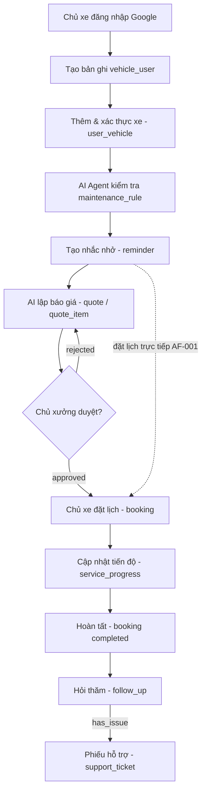
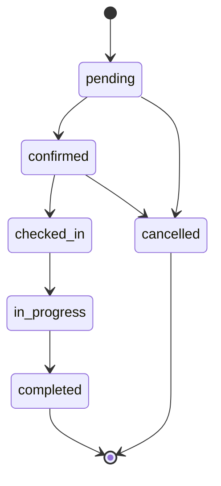
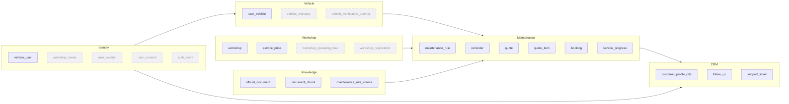
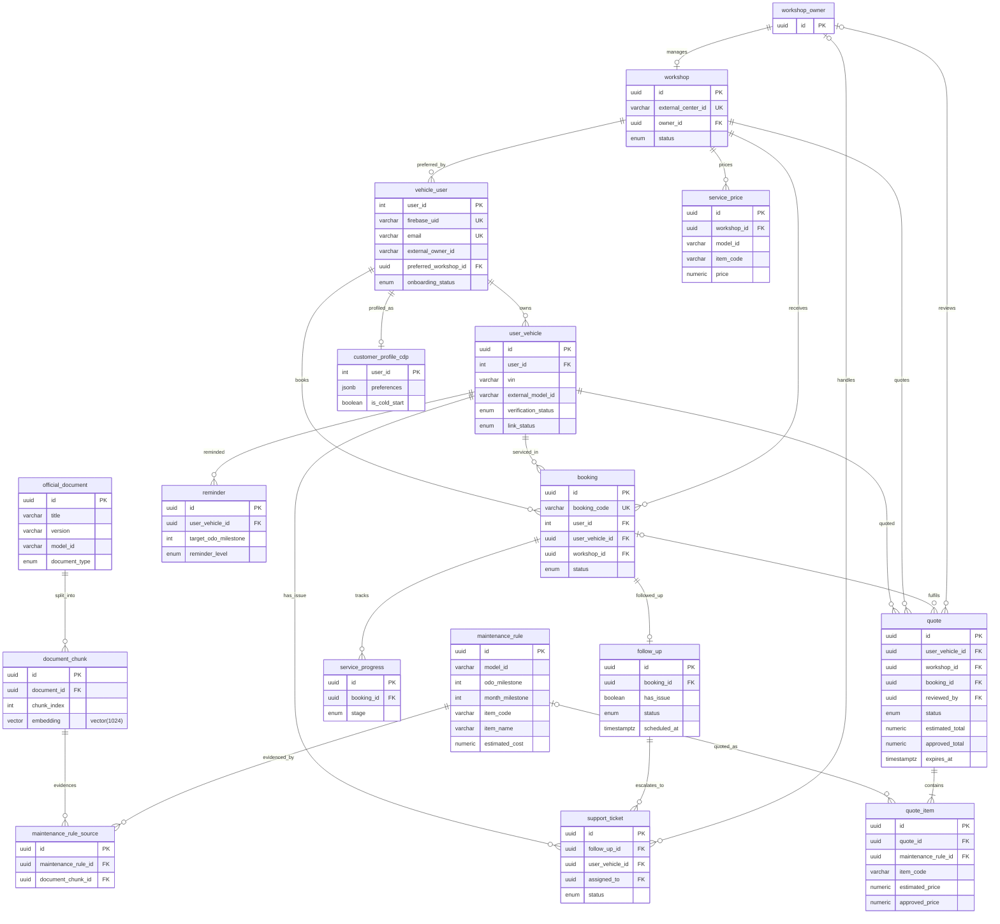
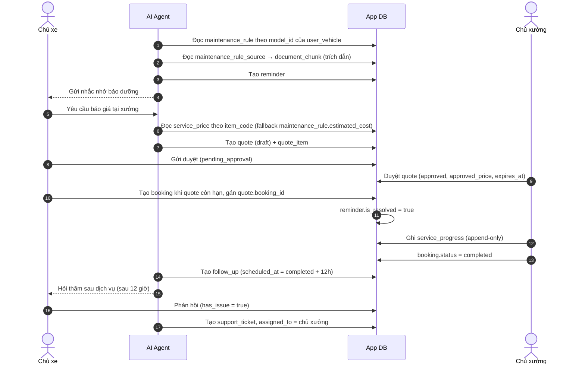
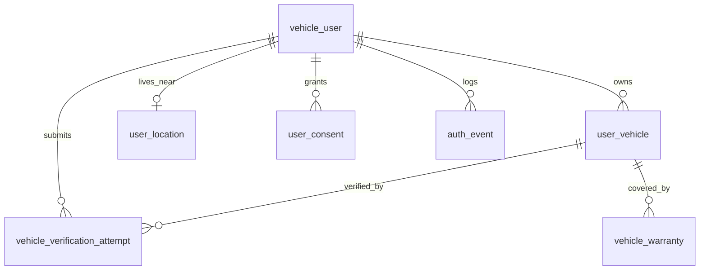
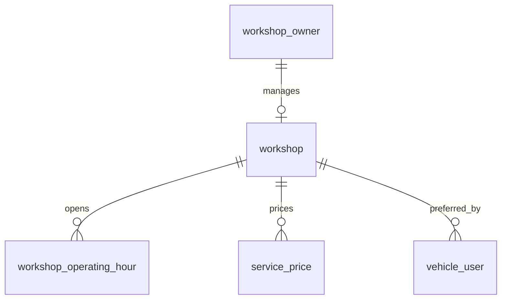
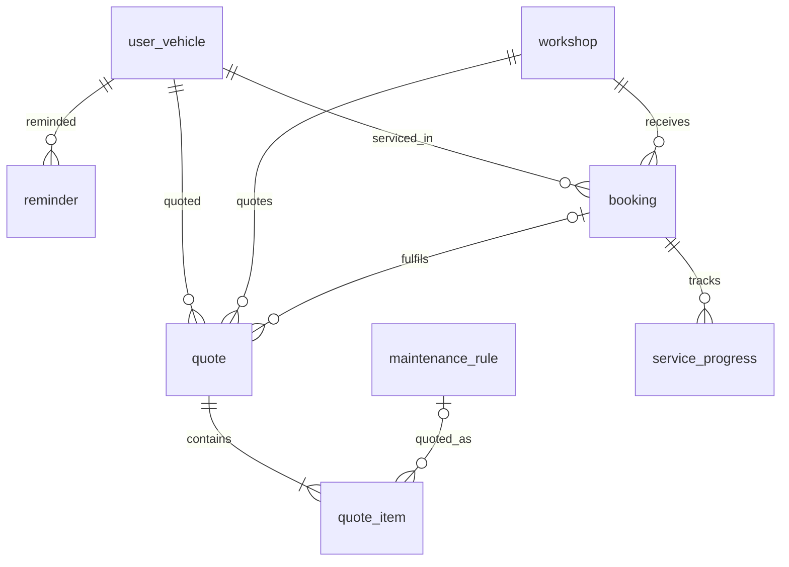
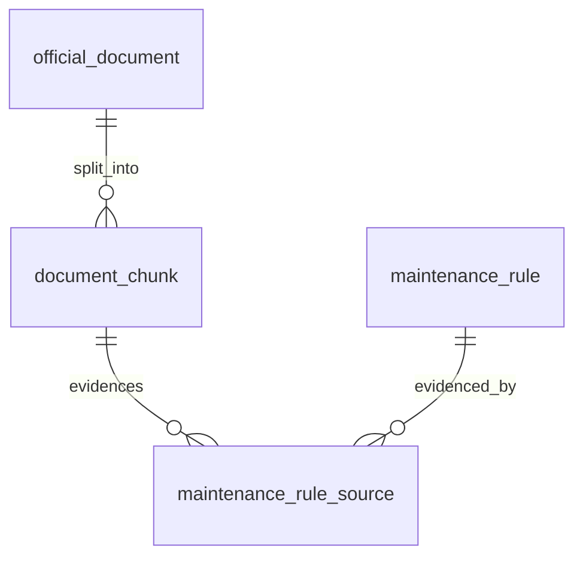
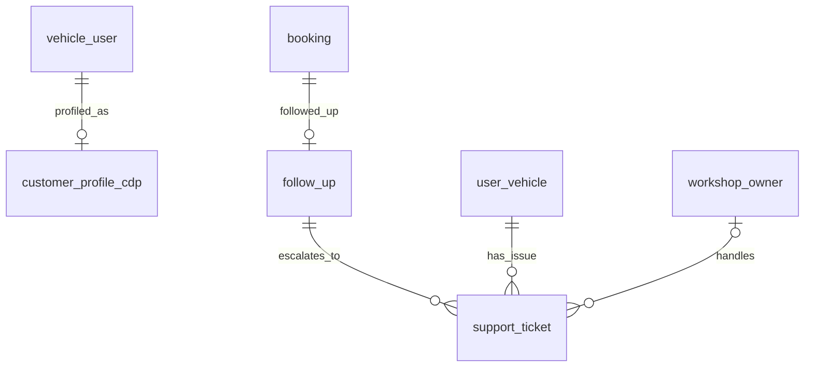

# Lược đồ Cơ sở dữ liệu cốt lõi (Core Entity) — AI MVP PRD - TEAM 4 NGƯỜI

> **Cập nhật phạm vi (02/10/2026):** các phần dưới đây trong tài liệu này không còn áp dụng.
>
> - Báo giá / duyệt báo giá (`quote`, `quote_item`, us-049): **đã bỏ**. Đặt lịch không gắn báo giá; mọi con số chi phí là ước tính (F5), chi phí cuối cùng do xưởng xác nhận khi kiểm tra xe.
> - Phiếu hỗ trợ (`support_ticket`): **đã bỏ**. Phản hồi hỏi thăm có vấn đề chỉ được phân loại và ghi trên `follow_up` (`has_issue`); app hiện lời khuyên an toàn và hotline xưởng, không tạo phiếu, không có màn phiếu cho chủ xe hay xưởng.
> - Kết nối Discord (`user_discord_link`, ENT-417): **đã bỏ**. Nhắc bảo dưỡng, nhắc lịch hẹn và hỏi thăm hiện trong mục **Thông báo** của app; danh sách kênh ngoài (Zalo / Telegram / SMS / Email) vẫn có nhưng đều "Sắp có", bật nhắc không bắt buộc chọn kênh.

> **Tài liệu tổng quan.** Mô tả chung lược đồ, quy ước, diagram và danh mục entity. Định nghĩa chi tiết từng bảng nằm trong file riêng theo domain (mục [14.5](#145-danh-mục-entity-theo-domain)).
>
> **Nguồn sự thật:**
>
> - `vehicle_user`, `user_vehicle`: dựng theo [us-001-sprint-1-spec.entity.md](../sprint-1/entity/us-001-sprint-1-spec.entity.md) (ENT-001, ENT-003) và [us-005-sprint-1-spec.entity.md](../sprint-1/entity/us-005-sprint-1-spec.entity.md) (`last_logout_at`). Khi có mâu thuẫn, tài liệu sprint-1 là chuẩn.
> - `workshop`: căn theo `ServiceCenter` trong [proposed_erd.latest.md](../mock-system/proposed_erd.latest.md), bổ sung các field vận hành của app; phần mở rộng theo [ENT-008](../sprint-1/entity/us-009-sprint-1-spec.entity.md).
> - Quy ước đặt tên, kiểu dữ liệu, enum: theo mục **3. Quy ước chung** của [us-001 entity spec](../sprint-1/entity/us-001-sprint-1-spec.entity.md#3-quy-ước-chung).
> - Các bảng mới của v1.2 (Knowledge, báo giá, bảng giá, CRM sau dịch vụ) lấy ý tưởng từ bản ERD sinh tự động ([archive/core.entity.generated.md](./archive/core.entity.generated.md)) và đã được chỉnh theo quy ước trên. Bản sinh tự động **không phải** nguồn sự thật.

---

# 1. Document Information

| Field | Value |
| --- | --- |
| Feature ID | `FEAT-DB-SCHEMA` |
| Feature Name | `Lược đồ Cơ sở dữ liệu (Database Schemas)` |
| Document Version | `v1.6` |
| Status | `Draft` |
| Product / Project | `AI Agent Chăm sóc sau bán & lịch bảo dưỡng xe điện` |
| Business Owner | `Team 4 Người` |
| Author | `Team 4 Người` |
| Reviewer | `Team 4 Người` |
| Stakeholders | `Product, Frontend, Backend, AI Team` |
| Database | PostgreSQL (Supabase), schema `public`, migration bằng Alembic; extension `pgvector` cho domain Knowledge |
| Created Date | `2026-09-27` |
| Updated Date | `2026-09-27` |
| Related PRD | `AI MVP PRD - TEAM 4 NGƯỜI` |
| Related Entity Spec | [ENT-SPEC-AUTH-001](../sprint-1/entity/us-001-sprint-1-spec.entity.md), [ENT-SPEC-AUTH-002](../sprint-1/entity/us-005-sprint-1-spec.entity.md), [ENT-SPEC-AUTH-003](../sprint-1/entity/us-009-sprint-1-spec.entity.md), [us-013](../sprint-1/entity/us-013-sprint-1-spec.entity.md) |
| Related External ERD | [proposed_erd.latest.md](../mock-system/proposed_erd.latest.md) |
| Related API Spec | `N/A` |
| Related GitHub Issue | `N/A` |

---

# 2. Feature Overview

## 2.1 Feature Description

Hệ thống quản lý cơ sở dữ liệu cho MVP "AI Agent Chăm sóc sau bán & lịch bảo dưỡng xe điện". Cung cấp cấu trúc lưu trữ cho người dùng, thông tin xe, xưởng dịch vụ, quy định bảo dưỡng, đặt lịch hẹn, tiến độ dịch vụ, dữ liệu CDP cá nhân hóa AI và nhắc nhở tự động. Từ v1.2 bổ sung: tri thức chính hãng cho RAG, báo giá có người duyệt (HITL), bảng giá theo xưởng, chăm sóc và hỗ trợ sau dịch vụ.

## 2.2 Business Objective

Thiết lập cấu trúc dữ liệu chuẩn hóa giúp theo dõi toàn bộ vòng đời chăm sóc xe điện, quản lý lịch hẹn bảo dưỡng, cá nhân hóa trải nghiệm khách hàng thông qua AI và tự động hóa các thông báo nhắc nhở.

## 2.3 User Objective

Chủ xe có thể lưu trữ hồ sơ xe, theo dõi chi phí/lịch trình bảo dưỡng, nhận tư vấn cá nhân hóa từ AI Agent và đặt lịch dịch vụ dễ dàng.

## 2.4 Business Value

Tăng tỷ lệ giữ chân khách hàng sau bán hàng, tối ưu hóa công suất hoạt động của các xưởng dịch vụ và nâng cao độ chính xác trong việc tư vấn cá nhân hóa nhờ CDP.

---

# 3. Scope

## 3.1 In Scope

* **8 bảng core (v1.1, giữ nguyên):** `vehicle_user`, `user_vehicle`, `workshop`, `maintenance_rule`, `booking`, `service_progress`, `customer_profile_cdp`, `reminder`. Ngoại lệ duy nhất (v1.3): `maintenance_rule` bổ sung cột `item_code` và unique (`model_id`, `odo_milestone`, `item_name`) — Q-401, Q-402.
* **8 bảng bổ sung (v1.2):** `official_document`, `document_chunk`, `maintenance_rule_source`, `service_price`, `quote`, `quote_item`, `follow_up`, `support_ticket`.
* Phân nhóm theo 6 domain: Identity, Vehicle, Maintenance, Knowledge, Workshop, CRM.
* Quy định kiểu dữ liệu, các ràng buộc (Primary Key, Foreign Key, Unique, Enum, Nullable) và mô tả chi tiết cho từng trường — trong file entity riêng.

## 3.2 Out of Scope

* Các bảng quản lý kho phụ tùng chi tiết, thanh toán điện tử nâng cao và quản lý ca làm việc cụ thể của từng kỹ thuật viên.
* Các bảng phụ của onboarding/đăng nhập (`user_location`, `vehicle_warranty`, `vehicle_verification_attempt`, `user_consent`, `auth_event`, `workshop_owner`, `workshop_operating_hour`, `workshop_registration`, `workshop_verification_attempt`, `workshop_owner_consent`, `workshop_owner_auth_event`) — đã định nghĩa ở entity spec sprint-1, không định nghĩa lại ở đây; chỉ xuất hiện trong diagram để thể hiện quan hệ.

---

# 4. Actors & Stakeholders

## 4.1 Actors

| Actor | Type | Responsibility |
| --- | --- | --- |
| Vehicle Owner (Chủ xe) | User | Quản lý thông tin cá nhân, hồ sơ xe, đặt lịch hẹn và tương tác với AI Agent. |
| Service Advisor / Technician (Cố vấn / KTV) | User | Cập nhật tiến độ dịch vụ và quản lý slot tại xưởng. Trong MVP vai trò này do **chủ xưởng** (`workshop_owner`) đảm nhận (W-11). |
| Workshop Owner (Chủ xưởng) | User | Duyệt báo giá, quản lý bảng giá, xử lý phiếu hỗ trợ. |
| AI Agent | System | Phân tích dữ liệu CDP, đưa ra gợi ý cá nhân hóa, tự động tạo/gửi nhắc nhở, lập báo giá nháp, truy xuất tài liệu chính hãng (RAG), gửi follow-up. |

## 4.2 Stakeholders

| Stakeholder | Organization / Team | Interest / Responsibility |
| --- | --- | --- |
| Engineering Team | Internal | Thiết kế, triển khai và tối ưu hóa hệ thống CSDL. |
| Product Team | Internal | Đảm bảo cấu trúc dữ liệu đáp ứng đầy đủ yêu cầu nghiệp vụ của PRD. |
| AI Team | Internal | Pipeline ingest tài liệu, embedding, CDP. |

---

# 5. User Story

## US-001

**As a** Backend Developer

**I want to** có một lược đồ CSDL chuẩn hóa cho MVP

**So that** tôi có thể phát triển API và tích hợp với hệ thống AI Agent một cách đồng bộ.

---

# 6. Use Case

## UC-001 — Quản lý & Truy vấn dữ liệu bảo dưỡng xe

### 6.1 Use Case Description

Hệ thống lưu trữ và kết nối dữ liệu giữa người dùng, xe, quy định bảo dưỡng và lịch hẹn để phục vụ việc chăm sóc tự động.

### 6.2 Primary Actor

System / AI Agent

### 6.3 Supporting Actors / Systems

Database Server, hệ thống hãng xe (mock theo [proposed_erd.latest.md](../mock-system/proposed_erd.latest.md))

### 6.4 Trigger

Người dùng truy cập ứng dụng, đặt lịch hẹn hoặc hệ thống chạy job định kỳ kiểm tra lịch bảo dưỡng.

### 6.5 Preconditions

Tài khoản người dùng (`vehicle_user.onboarding_status = active`) và ít nhất một xe đã xác thực (`user_vehicle.verification_status = verified`) đã tồn tại trong CSDL.

### 6.6 Postconditions

Dữ liệu lịch hẹn, tiến độ hoặc nhắc nhở được lưu trữ và cập nhật trạng thái chính xác.

---

# 7. User Flow

## 7.1 Main User Flow

---

# 8. Screen / UI Flow

*(Phần này không áp dụng trực tiếp cho cấu trúc Lược đồ CSDL Backend)*

---

# 9. Main Flow

## 9.1 Happy Path

1. Người dùng đăng nhập Google, hệ thống tạo tài khoản (`vehicle_user`) và hoàn tất onboarding.
2. Thêm và xác thực xe điện với hãng (`user_vehicle`).
3. Hệ thống quét định mức bảo dưỡng (`maintenance_rule`) và lưu trữ ngữ cảnh tương tác (`customer_profile_cdp`).
4. Hệ thống phát nhắc nhở bảo dưỡng (`reminder`), trích dẫn nguồn chính hãng qua `maintenance_rule_source` → `document_chunk`.
5. AI Agent lập báo giá (`quote`, `quote_item`) từ `service_price` của xưởng (hoặc `maintenance_rule.estimated_cost`); chủ xưởng duyệt.
6. Người dùng thực hiện đặt lịch (`booking`), gắn với báo giá đã duyệt (`quote.booking_id`).
7. Xưởng dịch vụ tiếp nhận xe và cập nhật tiến độ (`service_progress`).
8. Sau khi hoàn tất, hệ thống gửi hỏi thăm (`follow_up`); nếu có vấn đề mở `support_ticket`.

---

# 10. Alternative Flow

## AF-001 — Đặt lịch không qua nhắc nhở tự động

**Condition:** Người dùng chủ động đặt lịch bảo dưỡng trực tiếp trên ứng dụng.

**Flow:**

1. Người dùng chọn xưởng (`workshop`, mặc định gợi ý `vehicle_user.preferred_workshop_id`) và khung giờ.
2. Hệ thống kiểm tra điều kiện và tạo bản ghi trong `booking` (không bắt buộc có `quote`).

---

# 11. Exception Flow

## EF-001 — Lịch hẹn hết hạn giữ slot (Hold slot expiration)

**Condition:** Lịch hẹn ở trạng thái `pending` vượt quá thời gian `hold_expires_at`.

**System Behavior:** Hệ thống chuyển `booking.status` sang `cancelled`.

**User Experience:** Hiển thị thông báo slot đặt tạm thời đã hết hạn, mời người dùng chọn lại khung giờ.

## EF-002 — Báo giá bị từ chối

**Condition:** Chủ xưởng từ chối `quote` (`pending_approval → rejected`).

**System Behavior:** Quote giữ trạng thái `rejected` (cuối); AI Agent có thể lập quote mới.

**User Experience:** Chủ xe thấy lý do (`reviewer_note`) và báo giá mới (nếu có).

---

# 12. Business Rules

## BR-001 — Unique Firebase UID, Email, Phone & CCCD

**Rule:** `firebase_uid`, `email`, `phone`, `national_id` của `vehicle_user` là duy nhất giữa các tài khoản (BR-ENT-001, BR-ENT-002, D-03 — ENT-001).

## BR-002 — Vehicle Identification

**Rule:** Một VIN chỉ được liên kết với **một** tài khoản đang Active (`link_status = active`) — BR-ENT-020. `license_plate` được chuẩn hoá và đối chiếu với hãng, không đặt unique toàn cục.

## BR-003 — Maintenance Rule Mapping

**Rule:** Định mức bảo dưỡng trong `maintenance_rule` áp dụng theo mã model của hãng (`model_id` — `VehicleModel` trong [proposed_erd.latest.md](../mock-system/proposed_erd.latest.md)) và mốc km/thời gian.

## BR-004 — Báo giá có người duyệt (HITL)

**Rule:** Báo giá do AI lập chỉ được dùng để đặt lịch khi chủ xưởng đã duyệt (`quote.status = approved`) — BR-ENT-413 … BR-ENT-416.

## BR-005 — Truy vết nguồn tri thức

**Rule:** Mỗi hạng mục `maintenance_rule` nên có ít nhất một `maintenance_rule_source` trỏ tới tài liệu chính hãng để AI trích dẫn — BR-ENT-419.

## BR-006 — Chăm sóc sau dịch vụ

**Rule:** Mỗi `booking` hoàn tất có tối đa một `follow_up`; follow-up có vấn đề sinh `support_ticket` — BR-ENT-421 … BR-ENT-423.

---

# 13. State / Status

> Theo quy ước chung: enum lưu **lowercase** trong DB, API trả **UPPER_SNAKE_CASE** (`pending` ↔ `PENDING`).

## 13.1 `booking.status`

| State (DB) | API | Meaning | Entry Condition | Exit Condition |
| --- | --- | --- | --- | --- |
| `pending` | `PENDING` | Chờ xác nhận/giữ slot tạm thời | Khách hàng mới gửi yêu cầu đặt lịch | Chuyển sang `confirmed` hoặc `cancelled` khi hết `hold_expires_at` |
| `confirmed` | `CONFIRMED` | Đã xác nhận lịch hẹn | Xưởng/Hệ thống xác nhận lịch đặt | Khách hàng check-in tại xưởng (`checked_in`) hoặc hủy (`cancelled`) |
| `checked_in` | `CHECKED_IN` | Xe đã đến xưởng | Cố vấn dịch vụ xác nhận xe đã đến | Bắt đầu làm dịch vụ (`in_progress`) |
| `in_progress` | `IN_PROGRESS` | Đang thực hiện dịch vụ | KTV bắt đầu tiến trình bảo dưỡng | Hoàn thành dịch vụ (`completed`) |
| `completed` | `COMPLETED` | Hoàn tất bảo dưỡng | KTV/Cố vấn dịch vụ nghiệm thu xe | Kết thúc quy trình |
| `cancelled` | `CANCELLED` | Đã hủy lịch hẹn | Khách hàng hủy hoặc hết hạn hold slot | Kết thúc quy trình |

## 13.2 State Transition

## 13.3 Các enum trạng thái khác

| Enum | Giá trị (DB) | Định nghĩa |
| --- | --- | --- |
| `quote_status_enum` | `draft / pending_approval / approved / rejected` | [quote.entity.md §8](./maintenance/quote.entity.md) |
| `official_document_type_enum` | `owner_manual / maintenance_manual / warranty_policy / service_bulletin` | [official_document.entity.md §6](./knowledge/official_document.entity.md) |
| `follow_up_status_enum` | `pending / sent / responded / closed` | [follow_up.entity.md §8](./crm/follow_up.entity.md) |
| `support_ticket_status_enum` | `open / in_progress / resolved` | [support_ticket.entity.md §8](./crm/support_ticket.entity.md) |
| `service_stage_enum` | `checked_in / inspecting / servicing / waiting_parts / quality_check / ready_for_pickup` | [service_progress.entity.md](./maintenance/service_progress.entity.md) |
| `reminder_level_enum`, `reminder_channel_enum` | `early / warning / urgent / expired`; `discord / email / sms / telegram / slack` (MVP chỉ `discord`; `in_app / push / sms_zalo` deprecated — BR-ENT-408) | [reminder.entity.md](./maintenance/reminder.entity.md) |
| `workshop_status_enum` | `active / inactive` | [workshop.entity.md](./workshop/workshop.entity.md) |
| `user_status_enum`, `onboarding_status_enum` | xem ENT-001 | [vehicle_user.entity.md](./identity/vehicle_user.entity.md) |
| `vehicle_verification_status_enum`, `vehicle_link_status_enum` | xem ENT-003 | [user_vehicle.entity.md](./vehicle/user_vehicle.entity.md) |

---

# 14. Data Requirements

## 14.0 Quy ước chung

| Chủ đề | Quy ước |
| --- | --- |
| Tên bảng / cột | `snake_case`, số ít (theo bảng có sẵn `vehicle_user`). |
| Tên field ở API | `camelCase`. Mapping thực hiện ở Pydantic schema. |
| Primary key | `vehicle_user.user_id` giữ `integer` identity. Các bảng khác dùng `uuid` (sinh ở app bằng `uuid4`). |
| Enum | Lưu **lowercase** trong DB; API trả **UPPER_SNAKE_CASE**. |
| Thời gian | `timestamptz`, lưu UTC. `date` cho ngày. |
| Audit | Bảng thường có `created_at`, `updated_at` (`server_default now()`, `onupdate now()`); bảng append-only (`service_progress`, `document_chunk`, `maintenance_rule_source`) chỉ có `created_at`. |
| Chuẩn hoá dữ liệu | `email` lowercase; `phone` E.164; `national_id` chỉ chữ số; `vin` uppercase; `license_plate` uppercase, bỏ khoảng trắng, `.` và `-`. |
| Tham chiếu hãng | Dữ liệu của hãng được trỏ bằng cột `external_*_id` kiểu `varchar(64)` (id của hãng là string, ví dụ `OWN-001`). Mã model dùng `model_id varchar(64)`. |
| Tiền | `numeric(12,2)`, VNĐ, `>= 0`. |
| Vector | `vector(1024)` (pgvector) — Q-408. |
| Mã hạng mục | `item_code varchar(50)`, uppercase `^[A-Z0-9_]{2,50}$`; khoá ghép giữa `maintenance_rule`, `service_price`, `quote_item`. |
| Model code | Mỗi entity core là một file `backend/src/common/core/<domain>/<table>.py`, cùng cấu trúc domain với thư mục tài liệu này. `import src.common.core` đăng ký mọi bảng core. Migration: `backend/alembic/versions/e5b1c7d9f2a3_add_core_domain_tables.py`. |
| Entity ID | Giữ ID sprint-1 cho entity đã có (`ENT-001`, `ENT-003`, `ENT-008`); các entity còn lại của tài liệu này dùng dải `ENT-4xx`, business rule dùng dải `BR-ENT-4xx`. |

## 14.1 Bản đồ domain

Sáu domain và các bảng thuộc mỗi domain. Nét liền: bảng định nghĩa trong tài liệu này. Nét đứt: bảng sprint-1 (tham chiếu).

## 14.2 ER Diagram — toàn bộ lược đồ

Chỉ thể hiện PK/FK và cột chính. Cột đầy đủ: xem file entity.

## 14.3 Luồng dữ liệu theo vòng đời chăm sóc xe

## 14.4 ER Diagram theo domain

### Identity & Vehicle

### Workshop

### Maintenance

### Knowledge

### CRM

## 14.5 Danh mục entity theo domain

| Domain | Entity ID | Table | Nguồn | Spec |
| --- | --- | --- | --- | --- |
| Identity | `ENT-001` | `vehicle_user` | Core v1.1 / sprint-1 | [identity/vehicle_user.entity.md](./identity/vehicle_user.entity.md) |
| Vehicle | `ENT-003` | `user_vehicle` | Core v1.1 / sprint-1 | [vehicle/user_vehicle.entity.md](./vehicle/user_vehicle.entity.md) |
| Workshop | `ENT-008` | `workshop` | Core v1.1 + ENT-008 | [workshop/workshop.entity.md](./workshop/workshop.entity.md) |
| Workshop | `ENT-409` | `service_price` | Mới v1.2 | [workshop/service_price.entity.md](./workshop/service_price.entity.md) |
| Maintenance | `ENT-401` | `maintenance_rule` | Core v1.1 | [maintenance/maintenance_rule.entity.md](./maintenance/maintenance_rule.entity.md) |
| Maintenance | `ENT-405` | `reminder` | Core v1.1 | [maintenance/reminder.entity.md](./maintenance/reminder.entity.md) |
| Maintenance | `ENT-410` | `quote` | Mới v1.2 | [maintenance/quote.entity.md](./maintenance/quote.entity.md) |
| Maintenance | `ENT-411` | `quote_item` | Mới v1.2 | [maintenance/quote_item.entity.md](./maintenance/quote_item.entity.md) |
| Maintenance | `ENT-402` | `booking` | Core v1.1 | [maintenance/booking.entity.md](./maintenance/booking.entity.md) |
| Maintenance | `ENT-403` | `service_progress` | Core v1.1 | [maintenance/service_progress.entity.md](./maintenance/service_progress.entity.md) |
| Knowledge | `ENT-406` | `official_document` | Mới v1.2 | [knowledge/official_document.entity.md](./knowledge/official_document.entity.md) |
| Knowledge | `ENT-407` | `document_chunk` | Mới v1.2 | [knowledge/document_chunk.entity.md](./knowledge/document_chunk.entity.md) |
| Knowledge | `ENT-408` | `maintenance_rule_source` | Mới v1.2 | [knowledge/maintenance_rule_source.entity.md](./knowledge/maintenance_rule_source.entity.md) |
| CRM | `ENT-404` | `customer_profile_cdp` | Core v1.1 | [crm/customer_profile_cdp.entity.md](./crm/customer_profile_cdp.entity.md) |
| CRM | `ENT-412` | `follow_up` | Mới v1.2 | [crm/follow_up.entity.md](./crm/follow_up.entity.md) |
| CRM | `ENT-413` | `support_ticket` | Mới v1.2 | [crm/support_ticket.entity.md](./crm/support_ticket.entity.md) |
| Identity | `ENT-417` | `user_discord_link` | Mới v1.6 | [identity/user_discord_link.entity.md](./identity/user_discord_link.entity.md) — kênh Discord riêng của chủ xe (PQ-11) |

**Bảng sprint-1 được tham chiếu (không định nghĩa lại):**

| Domain | Entity ID | Table | Spec |
| --- | --- | --- | --- |
| Identity | `ENT-002` | `user_location` | [us-001](../sprint-1/entity/us-001-sprint-1-spec.entity.md) |
| Identity | `ENT-006` | `user_consent` | [us-001](../sprint-1/entity/us-001-sprint-1-spec.entity.md) |
| Identity | `ENT-101` | `auth_event` | [us-005](../sprint-1/entity/us-005-sprint-1-spec.entity.md) |
| Identity | `ENT-007` | `workshop_owner` | [us-009](../sprint-1/entity/us-009-sprint-1-spec.entity.md) |
| Identity | `ENT-012` | `workshop_owner_consent` | [us-009](../sprint-1/entity/us-009-sprint-1-spec.entity.md) |
| Identity | `ENT-301` | `workshop_owner_auth_event` | [us-013](../sprint-1/entity/us-013-sprint-1-spec.entity.md) |
| Vehicle | `ENT-004` | `vehicle_warranty` | [us-001](../sprint-1/entity/us-001-sprint-1-spec.entity.md) |
| Vehicle | `ENT-005` | `vehicle_verification_attempt` | [us-001](../sprint-1/entity/us-001-sprint-1-spec.entity.md) |
| Workshop | `ENT-009` | `workshop_operating_hour` | [us-009](../sprint-1/entity/us-009-sprint-1-spec.entity.md) |
| Workshop | `ENT-010` | `workshop_registration` | [us-009](../sprint-1/entity/us-009-sprint-1-spec.entity.md) |
| Workshop | `ENT-011` | `workshop_verification_attempt` | [us-009](../sprint-1/entity/us-009-sprint-1-spec.entity.md) |

**Bảng sprint-2 được tham chiếu (không định nghĩa lại):**

| Domain | Entity ID | Table | Spec |
| --- | --- | --- | --- |
| Vehicle | `ENT-414` | `vehicle_odometer_reading` | [us-017](../sprint-2/entity/us-017-sprint-2-spec.entity.md) — lịch sử ODO đồng bộ từ hãng (F3) |
| Vehicle | `ENT-415` | `vehicle_service_record` | [us-017](../sprint-2/entity/us-017-sprint-2-spec.entity.md) — lịch sử bảo dưỡng đồng bộ từ hãng + hoàn tất qua EV Care (F3, F8) |
| Vehicle | `ENT-416` | `vehicle_oem_sync` | [us-017](../sprint-2/entity/us-017-sprint-2-spec.entity.md) — trạng thái đồng bộ dữ liệu hãng theo xe (F3) |

## 14.6 Đối chiếu với bản ERD sinh tự động

Bản [archive/core.entity.generated.md](./archive/core.entity.generated.md) được đối chiếu như sau. Entity trùng với bảng đã có ⇒ **giữ bảng cũ**, bỏ định nghĩa của bản sinh tự động.

| Bản sinh tự động | Kết quả v1.2 | Ghi chú |
| --- | --- | --- |
| `users` | → `vehicle_user` (giữ nguyên) | Bỏ `password_hash` (G-04), bỏ `role` (D-05, W-04) |
| `vehicles` | → `user_vehicle` (giữ nguyên) | Bỏ `current_mileage` (đọc từ hãng), bỏ `purchase_date` |
| `service_centers` | → `workshop` (giữ nguyên) | `is_active` → `status`; `phone` → `hotline`; `city` → `region` |
| `maintenance_rules` | → `maintenance_rule` (giữ nguyên + `item_code` v1.3) | `vehicle_model` → `model_id`; `milestone_km` → `odo_milestone` |
| `maintenance_rule_items` | Gộp vào `maintenance_rule` | Bảng core đã ở mức hạng mục |
| `appointments` | → `booking` (giữ nguyên) | Quan hệ báo giá chuyển sang `quote.booking_id` |
| `official_documents` | `official_document` | `document_type` → enum; unique (`title`, `version`) |
| `document_chunks` | `document_chunk` | `vector(1024)`, unique (`document_id`, `chunk_index`) |
| `maintenance_rule_sources` | `maintenance_rule_source` | `rule_item_id` → `maintenance_rule_id` |
| `service_prices` | `service_price` | `service_center_id` → `workshop_id`; ghép theo (`model_id`, `item_code`) |
| `quotes` | `quote` | Thêm `workshop_id`, `booking_id`, `expires_at`; `technician_id` → `reviewed_by` (FK `workshop_owner`); sửa state transition |
| `quote_items` | `quote_item` | Thêm `maintenance_rule_id`; `item_code` giữ làm snapshot |
| `follow_ups` | `follow_up` | `appointment_id` → `booking_id` (unique) |
| `support_tickets` | `support_ticket` | `technician_id` → `assigned_to` (FK `workshop_owner`) |

---

# 15. Business Error & Edge Cases

| Case ID | Scenario | Expected Business Behavior | User Outcome |
| --- | --- | --- | --- |
| `EDGE-001` | Xe chưa có ODO từ hãng (`VehicleUsage` rỗng) | Không suy ra mốc bảo dưỡng theo km, chỉ dùng mốc thời gian | Hiển thị "hãng chưa có dữ liệu ODO"; chủ xe không nhập ODO — ODO chỉ đồng bộ từ hãng (F3) |
| `EDGE-002` | Khung giờ xưởng chọn đã đầy slot | Kiểm tra `workshop.total_technicians` và `workshop.emergency_slots_reserved` | Thông báo khung giờ hết chỗ, gợi ý khung giờ khác |
| `EDGE-003` | Xe không tìm thấy định mức bảo dưỡng phù hợp | Trả về quy định chung cho mẫu xe tương đương | Hiển thị chi phí dự kiến tham khảo |
| `EDGE-004` | Xưởng chưa có `service_price` cho hạng mục | Dùng `maintenance_rule.estimated_cost` (BR-ENT-411) | Báo giá hiển thị giá tham khảo |
| `EDGE-005` | Hạng mục chưa có nguồn tài liệu (`maintenance_rule_source` rỗng) | AI không trích dẫn, ghi rõ "chưa có nguồn chính hãng" | Người dùng vẫn nhận nhắc nhở |
| `EDGE-006` | Đặt lịch từ báo giá đã quá `quote.expires_at` | Từ chối gán `booking_id` (BR-ENT-426) | AI đề nghị lập báo giá mới |

---

# 16. Permissions & Access

## 16.1 Access Matrix

| Role / Actor | View | Create | Update | Delete | Notes |
| --- | --- | --- | --- | --- | --- |
| `USER` | ✅ | ✅ | ✅ | ❌ | Chỉ được truy cập dữ liệu của chính mình (`Users`, `Vehicles`, `Bookings`) |
| `SERVICE_ADVISOR` | ✅ | ✅ | ✅ | ❌ | Được xem và cập nhật `Service_Progress`, `Bookings` tại xưởng quản lý |
| `ADMIN` | ✅ | ✅ | ✅ | ✅ | Quyền toàn cục trên mọi bảng |

> Lưu ý: trong MVP chưa có role `SERVICE_ADVISOR` / `ADMIN` (D-05, W-11); quyền phía xưởng do chủ xưởng (`workshop_owner`) nắm. Ma trận chi tiết theo từng bảng: mục 12 của mỗi file entity.

## 16.2 Bảng bổ sung v1.2

| Bảng | Chủ xe | Chủ xưởng | AI Agent / Hệ thống |
| --- | --- | --- | --- |
| `quote`, `quote_item` | Xem, gửi duyệt (xe của mình) | Duyệt / từ chối (xưởng mình) | Lập bản nháp |
| `service_price` | Xem | Tạo / sửa (xưởng mình) | Xem |
| `official_document`, `document_chunk`, `maintenance_rule_source` | Qua trích dẫn AI | Qua trích dẫn AI | Pipeline ingest ghi; AI đọc |
| `follow_up` | Xem, phản hồi | Xem (xưởng mình) | Tạo, gửi |
| `support_ticket` | Xem (xe của mình) | Cập nhật (được giao) | Tạo |

---

# 17. Acceptance Criteria

## AC-001 — Khởi tạo bảng dữ liệu thành công

**Given** Hệ thống CSDL được khởi tạo

**When** Chạy Alembic migration

**Then** Tất cả 8 bảng dữ liệu (`vehicle_user`, `user_vehicle`, `workshop`, `maintenance_rule`, `booking`, `service_progress`, `customer_profile_cdp`, `reminder`) phải được tạo lập đúng cấu trúc, ràng buộc khóa chính, khóa ngoại và kiểu dữ liệu.

## AC-002 — Khởi tạo bảng bổ sung v1.2

**Given** AC-001 đã đạt và extension `pgvector` đã bật

**When** Chạy Alembic migration v1.2

**Then** 8 bảng `official_document`, `document_chunk`, `maintenance_rule_source`, `service_price`, `quote`, `quote_item`, `follow_up`, `support_ticket` được tạo đúng cấu trúc, FK, unique và CHECK trong file entity; 8 bảng core không đổi, **trừ** `maintenance_rule` có thêm `item_code` (NOT NULL sau backfill) và unique (`model_id`, `odo_milestone`, `item_name`).

---

# 18. Non-functional Expectations

| Requirement | Expected Behavior |
| --- | --- |
| Data Integrity | Đảm bảo tính toàn vẹn dữ liệu thông qua các ràng buộc Foreign Key, Unique và CHECK. |
| Scalability | Hỗ trợ lưu trữ dạng `jsonb` đối với dữ liệu CDP nhằm linh hoạt mở rộng thông tin tương tác AI. |
| Retrieval | Semantic search trên `document_chunk.embedding` dùng ANN index (HNSW / IVFFlat). |

---

# 19. Dependencies

| Dependency | Purpose | Owner | Required | Related Document |
| --- | --- | --- | --- | --- |
| PostgreSQL (Supabase) | Lưu trữ CSDL quan hệ & hỗ trợ kiểu `jsonb` | Backend Team | Yes | N/A |
| `pgvector` | Lưu và tìm kiếm embedding | AI Team | Yes (v1.2) | N/A |
| Hệ thống hãng xe (mock) | Nguồn dữ liệu `Owner`, `Vehicle`, `VehicleModel`, `VehicleUsage`, `ServiceCenter`, `ServiceHistory` | Backend Team | Yes | [proposed_erd.latest.md](../mock-system/proposed_erd.latest.md) |

---

# 20. Assumptions

* `vehicle_user.user_id` dùng `integer` identity (bảng có sẵn); các bảng còn lại dùng `uuid`.
* CSDL hỗ trợ dữ liệu kiểu `jsonb` và enum type của PostgreSQL.
* Người duyệt báo giá và xử lý phiếu hỗ trợ trong MVP là chủ xưởng (`workshop_owner`), do chưa có tài khoản kỹ thuật viên (W-11).

---

# 21. Business Constraints

* Dữ liệu ODO phải là số nguyên dương.
* Enum lưu lowercase trong DB, tuân thủ đúng giá trị đã thiết kế.
* Mọi FK mới nằm ở bảng mới. Thay đổi duy nhất trên bảng core: `maintenance_rule.item_code` + unique (Q-401, Q-402).

---

# 22. Terminology / Glossary

| Term ID | Term | Vietnamese Name | Definition | Example / Notes |
| --- | --- | --- | --- | --- |
| `TERM-001` | `ODO` | Số km đã đi | Tổng quãng đường xe điện đã di chuyển tính bằng kilomet. | `12000` |
| `TERM-002` | `CDP` | Nền tảng dữ liệu khách hàng | Lưu trữ ngữ cảnh, sở thích và lịch sử tương tác để phục vụ AI Agent. | `customer_profile_cdp` |
| `TERM-003` | `HITL` | Con người duyệt | AI đề xuất, con người xác nhận trước khi dùng. | `quote.status = pending_approval` |
| `TERM-004` | `RAG` | Truy xuất tăng cường | AI truy xuất đoạn tài liệu liên quan trước khi trả lời. | `document_chunk` |
| `TERM-005` | `Chunk` | Đoạn tài liệu | Một đoạn văn tách từ tài liệu, kèm embedding. | `document_chunk.chunk_index` |

---

# 23. Open Questions (tổng hợp)

| ID | Question | Status | Answer | Spec |
| --- | --- | --- | --- | --- |
| Q-401 | Unique (`model_id`, `odo_milestone`, `item_name`) cho `maintenance_rule`? | Resolved | Có | [maintenance_rule](./maintenance/maintenance_rule.entity.md) |
| Q-402 | Bổ sung `item_code` cho `maintenance_rule` để ghép với `service_price`? | Resolved | Có — `item_code varchar(50)` ở `maintenance_rule`, `service_price`, `quote_item` | [maintenance_rule](./maintenance/maintenance_rule.entity.md) |
| Q-403 | `service_progress.updated_by` (`integer`) vs `workshop_owner.id` (`uuid`)? | Resolved | Giữ nguyên | [service_progress](./maintenance/service_progress.entity.md) |
| Q-406 | Chốt enum `document_type`? | Resolved | `owner_manual / maintenance_manual / warranty_policy / service_bulletin` | [official_document](./knowledge/official_document.entity.md) |
| Q-407 | Unique (`title`, `version`) cho `official_document`? | Resolved | Có (`NULLS NOT DISTINCT`) | [official_document](./knowledge/official_document.entity.md) |
| Q-408 | Số chiều vector embedding? | Resolved | 1024 | [document_chunk](./knowledge/document_chunk.entity.md) |
| Q-410 | Hạn hiệu lực báo giá? | Resolved | Có — `quote.expires_at`, BR-ENT-426 | [quote](./maintenance/quote.entity.md) |
| Q-411 | Xác nhận người duyệt báo giá là chủ xưởng? | Resolved | Người duyệt là chủ xưởng | [quote](./maintenance/quote.entity.md) |
| Q-412 | Gửi follow-up sau bao lâu kể từ `completed`? | Resolved | Sau 12 giờ — `follow_up.scheduled_at` | [follow_up](./crm/follow_up.entity.md) |
| Q-413 | Kênh gửi follow-up; tự đóng khi khách không phản hồi? | Open | - | [follow_up](./crm/follow_up.entity.md) |

---

# 24. Change Log

| Version | Date | Author | Change |
| --- | --- | --- | --- |
| `v1.0` | `2026-09-27` | `Team 4 Người` | Chuyển đổi dữ liệu CSDL sang chuẩn Functional Specification Template |
| `v1.1` | `2026-09-27` | `Team 4 Người` | Dựng lại `vehicle_user`, `user_vehicle` theo entity spec sprint-1; căn `workshop` theo `ServiceCenter`; đổi quy ước đặt tên (snake_case số ít, enum lowercase, `timestamptz`, `uuid`); giữ `preferred_workshop_id` |
| `v1.2` | `2026-09-27` | `Team 4 Người` | Tách chi tiết từng bảng ra file entity riêng theo 6 domain; bổ sung bản đồ domain, ER toàn cục, ER theo domain, sequence vòng đời; thêm 8 bảng mới (Knowledge, `service_price`, `quote`, `quote_item`, `follow_up`, `support_ticket`) chỉnh từ bản ERD sinh tự động; 8 bảng core giữ nguyên; sửa link `proposed_erd` |
| `v1.3` | `2026-09-27` | `Team 4 Người` | Chốt Q-401…Q-411: `maintenance_rule.item_code` + unique; `service_price` / `quote_item` ghép theo `item_code`; `official_document_type_enum`, unique (`title`, `version`); `vector(1024)`; `quote.expires_at` (BR-ENT-426); người duyệt báo giá là chủ xưởng. Sửa link Base Definition trong ENT-008 (us-009) |
| `v1.4` | `2026-09-27` | `Team 4 Người` | Q-412: follow-up gửi sau 12 giờ (`follow_up.scheduled_at`), mở Q-413; model code tổ chức lại theo domain trong `backend/src/common/core/`, `user_vehicle` chuyển vào core; migration `e5b1c7d9f2a3` tạo 13 bảng + `vehicle_user.preferred_workshop_id` |
| `v1.5` | `2026-09-28` | `Team 4 Người` | Tham chiếu ENT-414…416 (sprint-2, F3: ODO và lịch sử bảo dưỡng đồng bộ từ hãng); EDGE-001 bỏ gợi ý chủ xe nhập ODO; `reminder_channel_enum` → `discord / email / sms / telegram / slack`, MVP chỉ Discord |
| `v1.6` | `2026-09-28` | `Team 4 Người` | Thêm ENT-417 `user_discord_link` (PQ-11: kênh Discord riêng cho mỗi chủ xe); tham chiếu ENT-416; migration `f6c3a8d1b2e4` cho `reminder_channel_enum` |
