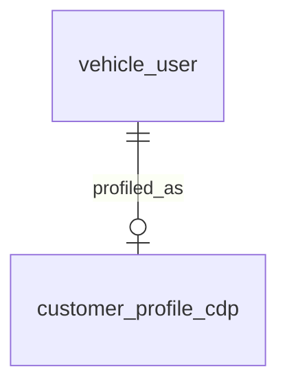

# Entity Specification — `customer_profile_cdp` (Hồ sơ ngữ cảnh & Lịch sử AI)

> **Domain:** CRM · **Tổng quan lược đồ:** [core.entity.md](../core.entity.md)
>
> **Nguồn sự thật:** `core.entity.md` v1.1 §14.2 bảng 7. Cấu trúc bảng **giữ nguyên**.

## 1. Entity Information

| Field | Value |
| --- | --- |
| Entity ID | `ENT-404` |
| Entity Name | `CustomerProfileCdp` |
| Business Name | Hồ sơ ngữ cảnh khách hàng (CDP) |
| Table | `customer_profile_cdp` |
| Domain | CRM |
| Version | `v1.1` |
| Status | `Draft` |
| Owner | AI Team |
| Created Date | `2026-09-27` |
| Updated Date | `2026-09-27` |

---

# 2. Entity Overview

## 2.1 Description

Lưu trữ thông tin thu thập qua các phiên chat để AI cá nhân hóa tư vấn.

## 2.2 Business Purpose

Cá nhân hoá lời nhắc, gợi ý khung giờ / kênh liên lạc; xử lý cold start cho người dùng mới.

## 2.3 Scope

**In Scope:** tóm tắt lịch sử tương tác, sở thích, lần hoạt động gần nhất, cờ cold start.

**Out of Scope:** nội dung hội thoại đầy đủ; dữ liệu định danh (nằm ở `vehicle_user`).

---

# 3. Business Meaning

Quan hệ 1–1 với `vehicle_user`: mỗi chủ xe có tối đa một hồ sơ CDP.

**Terminology:** `CDP` — TERM-002.

---

# 4. Identity & Keys

| Field | Type | Description |
| --- | --- | --- |
| `user_id` | `integer` | PK, đồng thời FK → `vehicle_user.user_id` |

---

# 5. Attributes

| Tên trường (Field) | Kiểu dữ liệu (Data Type) | Required | Nullable | Default | Ràng buộc (Constraints) | Mô tả (Description) |
| --- | --- | ---: | ---: | --- | --- | --- |
| `user_id` | `integer` | Yes | No | - | PK, FK → `vehicle_user.user_id` `ON DELETE CASCADE` | ID người dùng |
| `interaction_history` | `jsonb` | No | Yes | - | | Tóm tắt lịch sử hỏi đáp, mối quan tâm gần đây |
| `preferences` | `jsonb` | No | Yes | - | | Sở thích/thói quen (Khung giờ thích hợp, kênh liên lạc ưu tiên) |
| `last_active_at` | `timestamptz` | No | Yes | - | | Thời gian tương tác gần nhất |
| `is_cold_start` | `boolean` | Yes | No | `true` | | Đánh dấu người dùng mới/chưa đủ dữ liệu cá nhân hóa |
| `created_at` | `timestamptz` | Yes | No | `now()` | | |
| `updated_at` | `timestamptz` | Yes | No | `now()` | | |

---

# 7. Relationships

| Related Entity | Relationship | Cardinality | Description |
| --- | --- | --- | --- |
| [`vehicle_user`](../identity/vehicle_user.entity.md) | profile of | 1:1 | Chủ xe |

---

# 8. Entity Lifecycle / State

`is_cold_start`: `true` khi tạo; chuyển `false` khi đủ dữ liệu cá nhân hoá (ngưỡng do AI Team định nghĩa).

---

# 9. Business Rules & Constraints

## BR-ENT-408 — Không lưu PII trong jsonb

**Rule:** `interaction_history`, `preferences` không chứa CCCD, SĐT, email; chỉ tóm tắt nhu cầu và sở thích.

---

# 12. Ownership & Authorization

| Actor / Role | Read | Create | Update | Delete |
| --- | ---: | ---: | ---: | ---: |
| Chủ xe | ❌ | ❌ | ❌ | ❌ |
| AI Agent / Hệ thống | ✅ | ✅ | ✅ | ❌ (cascade theo `vehicle_user`) |

---

# 22. Change Log

| Version | Date | Author | Changes |
| --- | --- | --- | --- |
| `v1.1` | `2026-09-27` | Team 4 Người | Tách từ `core.entity.md` v1.1 §14.2 bảng 7, cấu trúc giữ nguyên |
