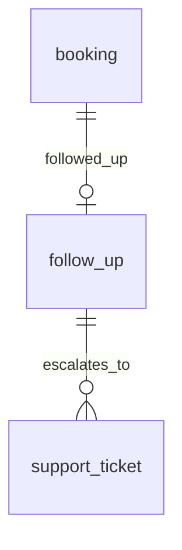
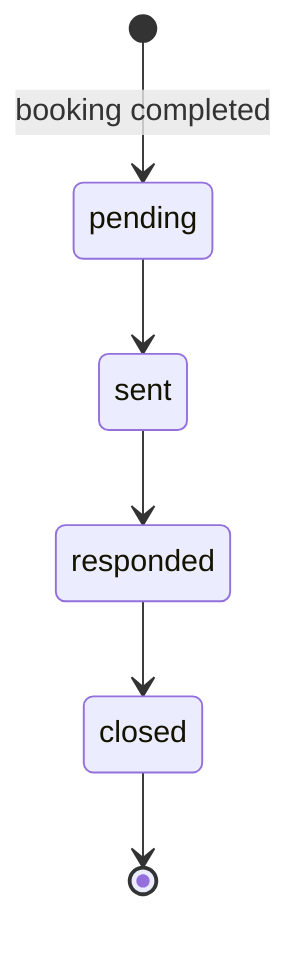

# Entity Specification — `follow_up` (Chăm sóc sau dịch vụ)

> **Cập nhật phạm vi (02/10/2026):** các phần dưới đây trong tài liệu này không còn áp dụng.
>
> - Phiếu hỗ trợ (`support_ticket`): **đã bỏ**. Phản hồi hỏi thăm có vấn đề chỉ được phân loại và ghi trên `follow_up` (`has_issue`); app hiện lời khuyên an toàn và hotline xưởng, không tạo phiếu, không có màn phiếu cho chủ xe hay xưởng.
> - Kết nối Discord (`user_discord_link`, ENT-417): **đã bỏ**. Nhắc bảo dưỡng, nhắc lịch hẹn và hỏi thăm hiện trong mục **Thông báo** của app; danh sách kênh ngoài (Zalo / Telegram / SMS / Email) vẫn có nhưng đều "Sắp có", bật nhắc không bắt buộc chọn kênh.

> **Domain:** CRM · **Tổng quan lược đồ:** [core.entity.md](../core.entity.md)
>
> **Nguồn:** entity `follow_ups` (ENT-013) trong bản ERD sinh tự động ([archive/core.entity.generated.md](../archive/core.entity.generated.md)), đã **chỉnh theo quy ước core v1.1** và bảng `booking` đã có. Thay đổi: xem §21.

## 1. Entity Information

| Field | Value |
| --- | --- |
| Entity ID | `ENT-412` |
| Entity Name | `FollowUp` |
| Business Name | Chăm sóc sau dịch vụ |
| Table | `follow_up` |
| Domain | CRM |
| Version | `v1.1` |
| Status | `Draft` |
| Owner | Backend Team |
| Created Date | `2026-09-27` |
| Updated Date | `2026-09-27` |

---

# 2. Entity Overview

## 2.1 Description

Tin nhắn hỏi thăm chủ xe **sau** khi lịch hẹn hoàn tất, và phản hồi của khách.

## 2.2 Business Purpose

Đo mức hài lòng, phát hiện sớm vấn đề sau bảo dưỡng để mở `support_ticket`.

## 2.3 Scope

**In Scope:** lịch hẹn nguồn, tin nhắn, phản hồi, cờ có vấn đề, trạng thái, thời điểm gửi/phản hồi.

**Out of Scope:** nhắc bảo dưỡng **trước** dịch vụ — `reminder`; xử lý vấn đề — `support_ticket`.

---

# 3. Business Meaning

**Example:** 2 ngày sau booking `completed`, AI gửi "Xe của anh chạy ổn không?"; khách trả lời "Phanh kêu" ⇒ `has_issue = true`.

---

# 4. Identity & Keys

| Field | Unique | Description |
| --- | ---: | --- |
| `id` (`uuid`) | Yes | PK |
| `booking_id` | Yes | Mỗi booking tối đa một follow-up |

---

# 5. Attributes

| Tên trường (Field) | Kiểu dữ liệu (Data Type) | Required | Nullable | Default | Ràng buộc (Constraints) | Mô tả (Description) |
| --- | --- | ---: | ---: | --- | --- | --- |
| `id` | `uuid` | Yes | No | `uuid4` | PK | ID follow-up |
| `booking_id` | `uuid` | Yes | No | - | FK → `booking.id` `ON DELETE CASCADE`; Unique | Lịch hẹn nguồn |
| `message` | `text` | Yes | No | - | | Tin nhắn hỏi thăm |
| `customer_response` | `text` | No | Yes | - | | Phản hồi của khách |
| `has_issue` | `boolean` | Yes | No | `false` | | Có phát hiện vấn đề hay không |
| `status` | `follow_up_status_enum` | Yes | No | `pending` | `pending / sent / responded / closed` | Trạng thái follow-up |
| `scheduled_at` | `timestamptz` | Yes | No | - | = thời điểm booking `completed` + 12 giờ | Thời điểm dự kiến gửi (Q-412) |
| `sent_at` | `timestamptz` | No | Yes | - | | Thời điểm gửi |
| `responded_at` | `timestamptz` | No | Yes | - | | Thời điểm phản hồi |
| `created_at` | `timestamptz` | Yes | No | `now()` | | |
| `updated_at` | `timestamptz` | Yes | No | `now()` | | |

---

# 7. Relationships

| Related Entity | Relationship | Cardinality | Description |
| --- | --- | --- | --- |
| [`booking`](../maintenance/booking.entity.md) | for | 1:0..1 | Lịch hẹn nguồn |
| [`support_ticket`](./support_ticket.entity.md) | escalates to | 1:N | Phiếu hỗ trợ khi có vấn đề |

---

# 8. Entity Lifecycle / State

## 8.1 States

| State (DB) | API | Meaning |
| --- | --- | --- |
| `pending` | `PENDING` | Chờ gửi |
| `sent` | `SENT` | Đã gửi |
| `responded` | `RESPONDED` | Khách đã phản hồi |
| `closed` | `CLOSED` | Đã đóng |

## 8.2 State Transition

---

# 9. Business Rules & Constraints

## BR-ENT-421 — Tạo khi booking hoàn tất

**Rule:** Chỉ tạo follow-up cho `booking.status = completed`; mỗi booking tối đa một follow-up. Follow-up được tạo ngay khi booking hoàn tất với `scheduled_at = thời điểm completed + 12 giờ`; job gửi khi `now() >= scheduled_at` và chuyển `pending → sent` (Q-412).

## BR-ENT-422 — Có vấn đề ⇒ mở ticket

**Rule:** Khi `has_issue = true` ⇒ tạo `support_ticket` tham chiếu `follow_up_id`.

---

# 10. Data Integrity

* Unique `booking_id`.
* `CHECK (status = 'pending' OR sent_at IS NOT NULL)`.
* `CHECK (status <> 'responded' OR (responded_at IS NOT NULL AND customer_response IS NOT NULL))`.

---

# 11. Index & Query Requirements

| Query | Fields | Frequency | Required Index |
| --- | --- | --- | --- |
| Job gửi follow-up đến hạn | `scheduled_at` WHERE `status = 'pending'` | Định kỳ | Partial `ix_follow_up_pending_scheduled` |

---

# 12. Ownership & Authorization

| Actor / Role | Read | Create | Update | Delete |
| --- | ---: | ---: | ---: | ---: |
| Chủ xe | ✅ (của mình) | ❌ | ✅ (phản hồi) | ❌ |
| Chủ xưởng | ✅ (booking tại xưởng mình) | ❌ | ❌ | ❌ |
| Hệ thống / AI Agent | ✅ | ✅ | ✅ | ❌ |

---

# 21. Open Questions

| ID | Question | Owner | Status |
| --- | --- | --- | --- |
| Q-412 | Gửi follow-up sau bao lâu kể từ `completed`? | Product | **Resolved** — Sau 12 giờ (`scheduled_at`) |
| Q-413 | Gửi follow-up qua kênh nào? Khách không phản hồi thì có tự `sent → closed` sau N ngày không? | Product | Open — kênh: **Discord** trong MVP (PRD v3.4, PQ-05); tự đóng: chờ chốt (đề xuất 72h) |

**Thay đổi so với bản sinh tự động (`follow_ups`):** đổi tên bảng số ít; `appointment_id` → `booking_id` (unique, để khớp quan hệ 1:0..1); status enum lowercase; thêm default `has_issue = false`; thêm `scheduled_at` (Q-412); thêm `updated_at`; `created_at` NOT NULL; `TIMESTAMP` → `timestamptz`.

---

# 22. Change Log

| Version | Date | Author | Changes |
| --- | --- | --- | --- |
| `v1.0` | `2026-09-27` | Team 4 Người | Tạo mới từ bản ERD sinh tự động, chỉnh theo quy ước core v1.1 |
| `v1.1` | `2026-09-27` | Team 4 Người | Thêm `scheduled_at`, gửi sau 12 giờ kể từ booking `completed` (Q-412); tách câu hỏi kênh / tự đóng thành Q-413 |
