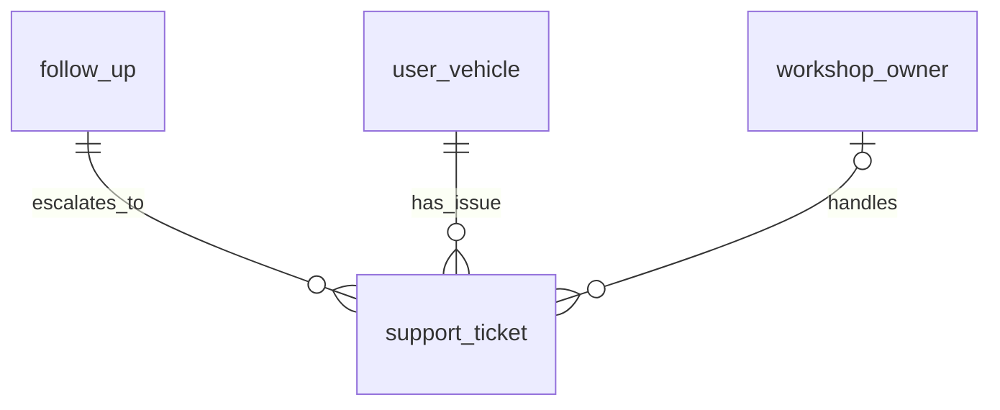
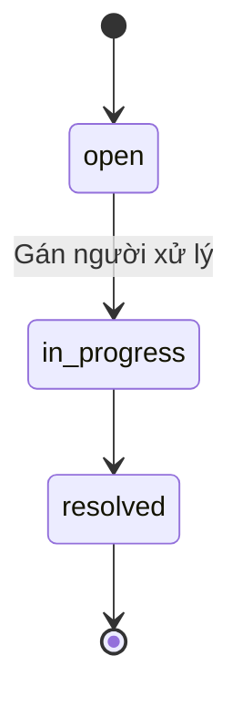

# Entity Specification — `support_ticket` (Phiếu hỗ trợ)

> **Đã loại khỏi phạm vi (02/10/2026).** Chức năng phiếu hỗ trợ sau dịch vụ (phần phiếu của us-041) đã bị bỏ khỏi sản phẩm: code backend/frontend đã gỡ, bảng `support_ticket` được xoá bởi migration `backend/alembic/versions/a3c7e9f1b2d4_drop_quote_support_ticket_discord.py`. Tài liệu giữ lại để tham khảo lịch sử, **không dùng để triển khai**.

> **Domain:** CRM · **Tổng quan lược đồ:** [core.entity.md](../core.entity.md)
>
> **Nguồn:** entity `support_tickets` (ENT-014) trong bản ERD sinh tự động ([archive/core.entity.generated.md](../archive/core.entity.generated.md)), đã **chỉnh theo quy ước core v1.1** và các entity đã có. Thay đổi: xem §21.

## 1. Entity Information

| Field | Value |
| --- | --- |
| Entity ID | `ENT-413` |
| Entity Name | `SupportTicket` |
| Business Name | Phiếu hỗ trợ |
| Table | `support_ticket` |
| Domain | CRM |
| Version | `v1.0` |
| Status | `Draft` |
| Owner | Backend Team |
| Created Date | `2026-09-27` |
| Updated Date | `2026-09-27` |

---

# 2. Entity Overview

## 2.1 Description

Phiếu xử lý vấn đề phát sinh sau dịch vụ, được mở từ một `follow_up` có `has_issue = true`.

## 2.2 Business Purpose

Đảm bảo vấn đề khách báo sau bảo dưỡng được giao cho xưởng xử lý và theo dõi tới khi xong.

---

# 3. Business Meaning

**Example:** "Phanh trước kêu khi dừng" — xe VF6, giao cho chủ xưởng VinFast Cầu Giấy, `in_progress`.

---

# 4. Identity & Keys

| Field | Type | Description |
| --- | --- | --- |
| `id` | `uuid` | PK |

---

# 5. Attributes

| Tên trường (Field) | Kiểu dữ liệu (Data Type) | Required | Nullable | Default | Ràng buộc (Constraints) | Mô tả (Description) |
| --- | --- | ---: | ---: | --- | --- | --- |
| `id` | `uuid` | Yes | No | `uuid4` | PK | ID ticket |
| `follow_up_id` | `uuid` | Yes | No | - | FK → `follow_up.id` `ON DELETE CASCADE` | Follow-up nguồn |
| `user_vehicle_id` | `uuid` | Yes | No | - | FK → `user_vehicle.id` `ON DELETE CASCADE` | Xe có vấn đề |
| `assigned_to` | `uuid` | No | Yes | - | FK → `workshop_owner.id` `ON DELETE SET NULL` | Người xử lý |
| `issue_summary` | `text` | Yes | No | - | | Tóm tắt vấn đề |
| `status` | `support_ticket_status_enum` | Yes | No | `open` | `open / in_progress / resolved` | Trạng thái ticket |
| `resolved_at` | `timestamptz` | No | Yes | - | | Thời điểm xử lý xong |
| `created_at` | `timestamptz` | Yes | No | `now()` | | |
| `updated_at` | `timestamptz` | Yes | No | `now()` | | |

---

# 6. Attribute Details

## `assigned_to`

Thay cho `technician_id → users.id`. Theo W-11 chưa có tài khoản kỹ thuật viên, nên người xử lý là chủ xưởng (`workshop_owner`, ENT-007) của xưởng đã làm booking.

## `user_vehicle_id`

Dư thừa có chủ đích (suy được qua `follow_up → booking`) để truy vấn ticket theo xe nhanh; phải khớp `booking.user_vehicle_id` (BR-ENT-423).

---

# 7. Relationships

| Related Entity | Relationship | Cardinality | Description |
| --- | --- | --- | --- |
| [`follow_up`](./follow_up.entity.md) | from | N:1 | Follow-up nguồn |
| [`user_vehicle`](../vehicle/user_vehicle.entity.md) | about | N:1 | Xe |
| `workshop_owner` (ENT-007) | handled by | N:0..1 | Người xử lý |

---

# 8. Entity Lifecycle / State

| State (DB) | API | Meaning |
| --- | --- | --- |
| `open` | `OPEN` | Ticket mới mở |
| `in_progress` | `IN_PROGRESS` | Đang xử lý |
| `resolved` | `RESOLVED` | Đã xử lý |

---

# 9. Business Rules & Constraints

## BR-ENT-423 — Nhất quán với follow-up

**Rule:** Chỉ tạo khi `follow_up.has_issue = true`; `user_vehicle_id` phải bằng `booking.user_vehicle_id` của follow-up đó.

## BR-ENT-424 — Người xử lý thuộc đúng xưởng

**Rule:** `assigned_to` phải là `workshop.owner_id` của xưởng đã thực hiện booking.

---

# 10. Data Integrity

* `CHECK (status <> 'resolved' OR resolved_at IS NOT NULL)`.
* `CHECK (status = 'open' OR assigned_to IS NOT NULL)`.

---

# 11. Index & Query Requirements

| Query | Fields | Frequency | Required Index |
| --- | --- | --- | --- |
| Ticket đang mở của người xử lý | `assigned_to`, `status` | Cao | Yes |
| Ticket theo xe | `user_vehicle_id` | Trung bình | Yes |

---

# 12. Ownership & Authorization

| Actor / Role | Read | Create | Update | Delete |
| --- | ---: | ---: | ---: | ---: |
| Chủ xe | ✅ (xe của mình) | ❌ | ❌ | ❌ |
| Chủ xưởng | ✅ (được giao) | ❌ | ✅ (trạng thái) | ❌ |
| Hệ thống / AI Agent | ✅ | ✅ | ✅ | ❌ |

---

# 21. Open Questions

**Thay đổi so với bản sinh tự động (`support_tickets`):** đổi tên bảng số ít; `vehicle_id` → `user_vehicle_id`; `technician_id` → `assigned_to` (FK `workshop_owner`); status enum lowercase; thêm `updated_at` và CHECK; `TIMESTAMP` → `timestamptz`.

---

# 22. Change Log

| Version | Date | Author | Changes |
| --- | --- | --- | --- |
| `v1.0` | `2026-09-27` | Team 4 Người | Tạo mới từ bản ERD sinh tự động, chỉnh theo quy ước core v1.1 |
