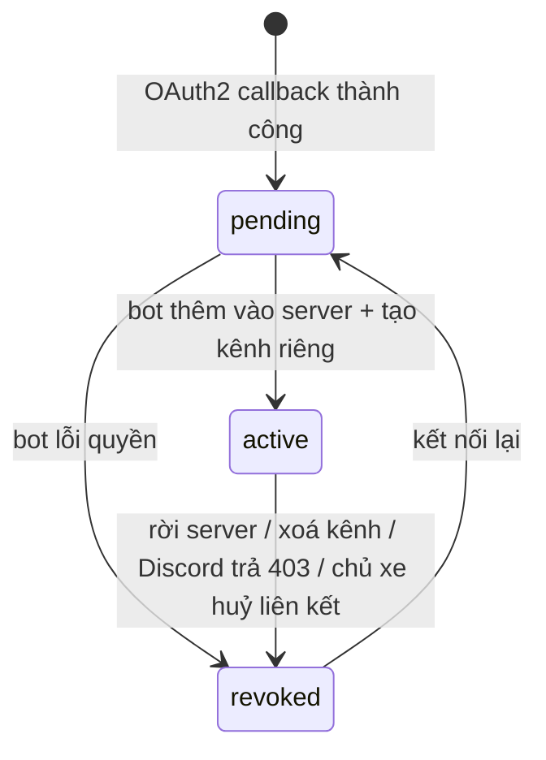

# Entity Specification — `user_discord_link` (Liên kết Discord của chủ xe)

> **Đã loại khỏi phạm vi (02/10/2026).** Chức năng kết nối Discord (ENT-417) đã bị bỏ khỏi sản phẩm: code backend/frontend đã gỡ, bảng `user_discord_link` được xoá bởi migration `backend/alembic/versions/a3c7e9f1b2d4_drop_quote_support_ticket_discord.py`. Tài liệu giữ lại để tham khảo lịch sử, **không dùng để triển khai**.

> **Domain:** Identity · **Tổng quan lược đồ:** [core.entity.md](../core.entity.md)
>
> **Nguồn nghiệp vụ:** [PRD v3.5 §F7](../../../product/PRD_EV_Care_MVP.md) — PQ-11: mỗi chủ xe nhận thông báo ở **kênh Discord riêng**.

## 1. Entity Information

| Field | Value |
| --- | --- |
| Entity ID | `ENT-417` |
| Entity Name | `UserDiscordLink` |
| Business Name | Liên kết Discord của chủ xe |
| Table | `user_discord_link` |
| Domain | Identity |
| Version | `v1.0` |
| Status | `Draft` |
| Owner | Backend Team |
| Created Date | `2026-09-28` |
| Updated Date | `2026-09-28` |

---

# 2. Entity Overview

## 2.1 Description

Một dòng / chủ xe: tài khoản Discord đã liên kết và **kênh riêng** bot đã tạo cho chủ xe đó trong server EV Care.

## 2.2 Business Purpose

Discord là kênh thông báo duy nhất của MVP (BR-ENT-408). Để nhắc mốc, nhắc lịch hẹn, hỏi thăm sau dịch vụ đến đúng người mà không lộ cho người khác, mỗi chủ xe có một kênh text riêng tư (chỉ chủ xe và bot thấy).

## 2.3 Scope

**In Scope:** Discord user id, kênh riêng, trạng thái liên kết.

**Out of Scope:**

* Chọn / thêm kênh khác (Email, SMS, Telegram, Slack) — NOTI-01, sẽ cần entity tổng quát hơn (vd. `user_notification_channel`) và có thể thay thế bảng này.
* Thông báo cho chủ xưởng — chưa có trong MVP.
* Lưu OAuth access / refresh token của Discord (chỉ dùng một lần lúc liên kết, không lưu).

---

# 3. Business Meaning

"Chủ xe U là người dùng Discord D; thông báo của U gửi vào kênh C."

**Example:** `user_id = 42`, `discord_user_id = 1122334455667788990`, `discord_channel_id = 1200000000000000001` (`#evcare-42`), `status = active`.

---

# 4. Identity & Keys

| Field | Unique | Description |
| --- | ---: | --- |
| `user_id` | PK | Một chủ xe có tối đa một liên kết |
| `discord_user_id` | Yes (WHERE `status = active`) | `ux_user_discord_link_discord_user_active` — một tài khoản Discord chỉ liên kết với một chủ xe đang active |
| `discord_channel_id` | Yes | Kênh riêng không dùng chung |

---

# 5. Attributes

| Tên trường (Field) | Kiểu dữ liệu (Data Type) | Required | Nullable | Default | Ràng buộc (Constraints) | Mô tả (Description) |
| --- | --- | ---: | ---: | --- | --- | --- |
| `user_id` | `integer` | Yes | No | - | PK, FK → `vehicle_user.user_id` `ON DELETE CASCADE` | Chủ xe |
| `discord_user_id` | `varchar(32)` | Yes | No | - | Snowflake, chỉ chữ số | ID người dùng Discord |
| `discord_username` | `varchar(64)` | No | Yes | - | | Tên hiển thị lúc liên kết (chỉ để hiển thị trên app) |
| `discord_channel_id` | `varchar(32)` | No | Yes | - | Snowflake; set khi bot tạo kênh xong | Kênh riêng |
| `status` | `discord_link_status_enum` | Yes | No | `pending` | `pending / active / revoked` | Trạng thái liên kết |
| `revoked_reason` | `varchar(64)` | No | Yes | - | `left_guild / channel_deleted / user_unlinked / delivery_forbidden` | Lý do hết hiệu lực |
| `linked_at` | `timestamptz` | No | Yes | - | Set khi `active` | |
| `last_delivered_at` | `timestamptz` | No | Yes | - | | Lần gửi thành công gần nhất |
| `created_at` | `timestamptz` | Yes | No | `now()` | | |
| `updated_at` | `timestamptz` | Yes | No | `now()` | | |

---

# 8. Entity Lifecycle / State

| State | Meaning |
| --- | --- |
| `pending` | OAuth2 xong, bot đang thêm vào server / tạo kênh |
| `active` | Có kênh riêng, gửi được |
| `revoked` | Liên kết hết hiệu lực; cần kết nối lại |



---

# 9. Business Rules & Constraints

## BR-ENT-440 — Kênh riêng tư

**Rule:** Kênh được tạo với permission overwrite: `@everyone` không xem được; chỉ `discord_user_id` và bot có `VIEW_CHANNEL`. Tên kênh không chứa tên thật, SĐT, biển số (vd. `evcare-<user_id>`).

## BR-ENT-441 — Chỉ gửi khi `active`

**Rule:** Thông báo chỉ gửi khi `status = active`. Không có liên kết hoặc `revoked` ⇒ lần gửi được ghi nhận "chưa có nơi nhận", không thử kênh khác (PRD F7).

## BR-ENT-442 — Tự thu hồi khi mất quyền gửi

**Rule:** Discord trả `403 Missing Access` / `404 Unknown Channel` khi gửi, hoặc bot nhận sự kiện `GUILD_MEMBER_REMOVE` của chủ xe ⇒ `status = revoked` với `revoked_reason` tương ứng.

## BR-ENT-443 — Không lưu token OAuth

**Rule:** Access token Discord chỉ dùng trong request callback để lấy `discord_user_id` và thêm vào server (`guilds.join`), sau đó bỏ đi.

---

# 10. Data Integrity

```sql
CHECK (discord_user_id ~ '^[0-9]{5,32}$')
CHECK (discord_channel_id IS NULL OR discord_channel_id ~ '^[0-9]{5,32}$')
CHECK (status <> 'active' OR (discord_channel_id IS NOT NULL AND linked_at IS NOT NULL))
```

---

# 11. Index & Query Requirements

| Query | Fields | Frequency | Required Index |
| --- | --- | --- | --- |
| Nơi gửi của một chủ xe | `user_id` | Cao (mỗi lần gửi) | PK |
| Sự kiện Discord → chủ xe | `discord_user_id` | Thấp | Unique partial |

---

# 12. Ownership & Authorization

| Actor / Role | Read | Create | Update | Delete |
| --- | ---: | ---: | ---: | ---: |
| Chủ xe | ✅ (của mình: đã kết nối chưa, tên Discord) | ✅ (kết nối) | ✅ (huỷ liên kết) | ❌ |
| Hệ thống (bot, NotificationService) | ✅ | ✅ | ✅ | ❌ |

---

# 15. Data Sensitivity & Security

| Field | Classification | Notes |
| --- | --- | --- |
| `discord_user_id`, `discord_username` | Personal Data | Không trả `discord_user_id` ra API của chủ xe; không log kèm `user_id` ở mức info |
| `discord_channel_id` | Internal | |

Secret cấu hình qua biến môi trường: `DISCORD_BOT_TOKEN`, `DISCORD_GUILD_ID`, `DISCORD_OAUTH_CLIENT_ID`, `DISCORD_OAUTH_CLIENT_SECRET`, `DISCORD_OAUTH_REDIRECT_URI`.

---

# 16. Retention & Deletion

Cascade khi xoá `vehicle_user`. Khi xoá, bot xoá kênh riêng tương ứng (best effort). `revoked` giữ lại để hiển thị "đã ngắt kết nối".

---

# 21. Open Questions

| ID | Question | Owner | Status |
| --- | --- | --- | --- |
| `Q-414` | Bước "Kết nối Discord" đặt ở cuối onboarding hay chỉ ở Home/hồ sơ? | PO | Open |
| `Q-415` | Server Discord của EV Care: một server cho mọi chủ xe (giới hạn 500 kênh/server của Discord) — đủ cho pilot 15–30 người; mở rộng cần chia server hoặc chuyển sang DM | Backend | Open |

---

# 22. Change Log

| Version | Date | Author | Changes |
| --- | --- | --- | --- |
| `v1.0` | `2026-09-28` | Team 4 Người | Initial version — PQ-11: kênh Discord riêng cho mỗi chủ xe |
