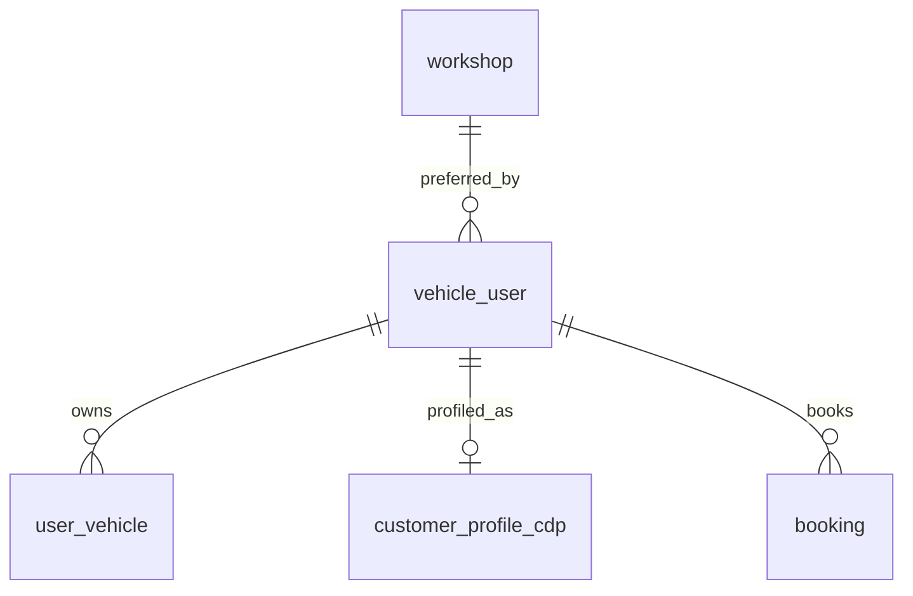

# Entity Specification — `vehicle_user` (Chủ xe / Người dùng)

> **Domain:** Identity · **Tổng quan lược đồ:** [core.entity.md](../core.entity.md)
>
> **Nguồn sự thật:** [ENT-001 — us-001-sprint-1-spec.entity.md](../../sprint-1/entity/us-001-sprint-1-spec.entity.md#ent-001--vehicleuser) và [ENT-SPEC-AUTH-002 — us-005](../../sprint-1/entity/us-005-sprint-1-spec.entity.md) (`last_logout_at`). Tài liệu này **không thay đổi** định nghĩa của sprint-1; khi có mâu thuẫn, sprint-1 là chuẩn.

## 1. Entity Information

| Field | Value |
| --- | --- |
| Entity ID | `ENT-001` |
| Entity Name | `VehicleUser` |
| Business Name | Chủ xe / Người dùng |
| Table | `vehicle_user` |
| Domain | Identity |
| Version | `v1.1` (giữ nguyên theo core v1.1) |
| Status | `Review` |
| Owner | Backend Team |
| Created Date | `2026-09-27` |
| Updated Date | `2026-09-27` |

---

# 2. Entity Overview

## 2.1 Description

Tài khoản chủ xe: định danh Firebase, hồ sơ cá nhân (gồm CCCD), trạng thái onboarding.

## 2.2 Business Purpose

Là chủ thể của mọi dữ liệu phía chủ xe: xe (`user_vehicle`), lịch hẹn (`booking`), hồ sơ CDP (`customer_profile_cdp`).

## 2.3 Scope

**In Scope**

* Định danh đăng nhập Google/Firebase, hồ sơ cá nhân, trạng thái tài khoản và onboarding.
* Liên kết với chủ xe bên hãng (`external_owner_id`) và xưởng ưu tiên.

**Out of Scope**

* Tài khoản chủ xưởng — bảng riêng `workshop_owner` (ENT-007, W-04).
* Role / phân quyền — phase 4 (D-05).
* Mật khẩu — đăng nhập chỉ qua Google OAuth; cột `password_hash` trong code là **deprecated** (G-04).

---

# 3. Business Meaning

## Definition

Một bản ghi `vehicle_user` ⇔ một tài khoản Firebase (Google) đã đăng nhập vào app với vai trò chủ xe.

## Example

Người dùng đăng nhập bằng `an.nguyen@gmail.com`, hoàn tất hồ sơ với CCCD và xác thực thành công xe VF6 ⇒ `onboarding_status = active`.

## Terminology

* Onboarding status, Firebase UID, CCCD — xem [us-001 FF](../../sprint-1/feature-functional/us-001-sprint-1-spec.ff.md).

---

# 4. Identity & Keys

## 4.1 Primary Key

| Field | Type | Description |
| --- | --- | --- |
| `user_id` | `integer` | Identity, auto increment (bảng có sẵn) |

## 4.2 Candidate / Unique Keys

| Field | Unique | Description |
| --- | ---: | --- |
| `firebase_uid` | Yes | Khoá tra cứu chính khi đăng nhập (BR-ENT-001) |
| `email` | Yes | BR-ENT-002 |
| `phone` | Yes | D-03 |
| `national_id` | Yes | D-01 |

---

# 5. Attributes

| Tên trường (Field) | Kiểu dữ liệu (Data Type) | Required | Nullable | Default | Ràng buộc (Constraints) | Mô tả (Description) |
| --- | --- | ---: | ---: | --- | --- | --- |
| `user_id` | `integer` | Yes | No | identity | PK | ID nội bộ, auto increment |
| `firebase_uid` | `varchar(128)` | Yes | No | - | Unique | Firebase UID — khoá tra cứu chính khi đăng nhập |
| `email` | `varchar(255)` | Yes | No | - | Unique, lowercase | Email Google đăng nhập — cũng là khoá xác thực chủ xe với hãng (D-01) |
| `email_verified` | `boolean` | Yes | No | `false` | | Email đã được Google xác minh |
| `auth_provider` | `varchar(32)` | Yes | No | `'google.com'` | | Provider đăng nhập |
| `display_name` | `varchar(255)` | No | Yes | - | | Tên hiển thị từ Google |
| `avatar_url` | `varchar(1024)` | No | Yes | - | | Ảnh đại diện từ Google |
| `full_name` | `varchar(150)` | Yes* | Yes | - | | Họ tên đầy đủ |
| `phone` | `varchar(20)` | Yes* | Yes | - | Unique, E.164 | SĐT liên hệ (D-03) |
| `national_id` | `varchar(12)` | Yes* | Yes | - | Unique, 12 chữ số | Số CCCD — đối chiếu với hãng (D-01) |
| `date_of_birth` | `date` | No | Yes | - | Ngày trong quá khứ | Ngày sinh |
| `external_owner_id` | `varchar(64)` | No | Yes | - | | `owner_id` bên hãng, gán ở lần xác thực xe thành công đầu tiên |
| `preferred_workshop_id` | `uuid` | No | Yes | - | FK → `workshop.id` `ON DELETE SET NULL` | Xưởng dịch vụ ưu tiên |
| `status` | `user_status_enum` | Yes | No | `active` | `active / inactive / suspended` | Trạng thái tài khoản (khoá/mở) |
| `onboarding_status` | `onboarding_status_enum` | Yes | No | `onboarding_in_progress` | `onboarding_in_progress / pending_vehicle_verification / verification_failed / active` | Trạng thái onboarding |
| `profile_completed_at` | `timestamptz` | No | Yes | - | | Thời điểm hoàn tất bước hồ sơ |
| `onboarding_completed_at` | `timestamptz` | No | Yes | - | | Thời điểm chuyển `active` |
| `last_login_at` | `timestamptz` | No | Yes | - | | Lần đăng nhập gần nhất |
| `last_logout_at` | `timestamptz` | No | Yes | - | | Lần đăng xuất gần nhất (ENT-SPEC-AUTH-002) |
| `created_at` | `timestamptz` | Yes | No | `now()` | | Thời điểm tạo tài khoản = bắt đầu onboarding |
| `updated_at` | `timestamptz` | Yes | No | `now()` | | Thời điểm cập nhật gần nhất |

> `*` Bắt buộc khi hoàn tất bước hồ sơ (SCR-002); được phép `NULL` trong lúc onboarding. Cột `password_hash` đang có trong code là **deprecated** (G-04), không dùng.

---

# 6. Attribute Details

Chi tiết `firebase_uid`, `email`, `national_id`, `status`, `onboarding_status`, `phone`: xem [ENT-001 §6](../../sprint-1/entity/us-001-sprint-1-spec.entity.md#ent-001--vehicleuser).

---

# 7. Relationships

## 7.1 Relationship Overview

## 7.2 Relationship Details

| Related Entity | Relationship | Cardinality | Description |
| --- | --- | --- | --- |
| [`user_vehicle`](../vehicle/user_vehicle.entity.md) | owns | 1:N | Một tài khoản có nhiều xe, cùng một chủ xe bên hãng (D-06) |
| [`workshop`](../workshop/workshop.entity.md) | prefers | N:0..1 | Xưởng ưu tiên, gợi ý mặc định khi đặt lịch |
| [`customer_profile_cdp`](../crm/customer_profile_cdp.entity.md) | profiled as | 1:0..1 | Hồ sơ ngữ cảnh AI |
| [`booking`](../maintenance/booking.entity.md) | books | 1:N | Lịch hẹn của chủ xe |
| `user_location`, `user_consent`, `vehicle_verification_attempt`, `auth_event` | sprint-1 | 1:N | Xem [us-001](../../sprint-1/entity/us-001-sprint-1-spec.entity.md), [us-005](../../sprint-1/entity/us-005-sprint-1-spec.entity.md) |

### Relationship Rules

* Các bảng con sprint-1 tham chiếu `vehicle_user.user_id` với `ON DELETE CASCADE` (phục vụ huỷ onboarding).

---

# 8. Entity Lifecycle / State

Xem [ENT-001 §8](../../sprint-1/entity/us-001-sprint-1-spec.entity.md#ent-001--vehicleuser) — `onboarding_status` và `status`.

---

# 9. Business Rules & Constraints

* **BR-001** (core) — `firebase_uid`, `email`, `phone`, `national_id` là duy nhất giữa các tài khoản (BR-ENT-001, BR-ENT-002, D-03).
* Chỉ tài khoản `onboarding_status = active` được dùng tính năng chính (BR-ENT-004): đặt lịch, nhắc nhở.
* Các rule còn lại: ENT-001 §9 (BR-ENT-001 … BR-ENT-006).

---

# 10. Data Integrity

Theo ENT-001 §10:

* `CHECK (onboarding_status <> 'active' OR onboarding_completed_at IS NOT NULL)`
* `CHECK (onboarding_status <> 'active' OR external_owner_id IS NOT NULL)`
* `CHECK (profile_completed_at IS NULL OR (full_name IS NOT NULL AND phone IS NOT NULL AND national_id IS NOT NULL))`
* `CHECK (national_id IS NULL OR national_id ~ '^[0-9]{12}$')`
* `CHECK (date_of_birth IS NULL OR date_of_birth < CURRENT_DATE)`

---

# 11–16. Index, Authorization, Audit, Data Source, Security, Retention

Không định nghĩa lại — xem ENT-001 §11–§16. Tóm tắt:

* Index chính: unique `firebase_uid`; `ix_vehicle_user_onboarding_created` cho job huỷ onboarding.
* Chủ xe chỉ truy cập bản ghi có `firebase_uid = token.uid`.
* `national_id` không bao giờ log; API trả dạng mask.
* Onboarding dang dở quá 15 ngày ⇒ hard delete, cascade các bảng con (D-04).

---

# 17. Example Data

Xem ENT-001 §17.

---

# 19. Related Entities

| Entity | Relationship | Reference |
| --- | --- | --- |
| `user_vehicle` | owns | [user_vehicle.entity.md](../vehicle/user_vehicle.entity.md) |
| `booking` | books | [booking.entity.md](../maintenance/booking.entity.md) |
| `customer_profile_cdp` | profiled as | [customer_profile_cdp.entity.md](../crm/customer_profile_cdp.entity.md) |
| `workshop` | prefers | [workshop.entity.md](../workshop/workshop.entity.md) |

---

# 22. Change Log

| Version | Date | Author | Changes |
| --- | --- | --- | --- |
| `v1.1` | `2026-09-27` | Team 4 Người | Tách từ `core.entity.md` v1.1 §14.2 bảng 1, nội dung giữ nguyên |
