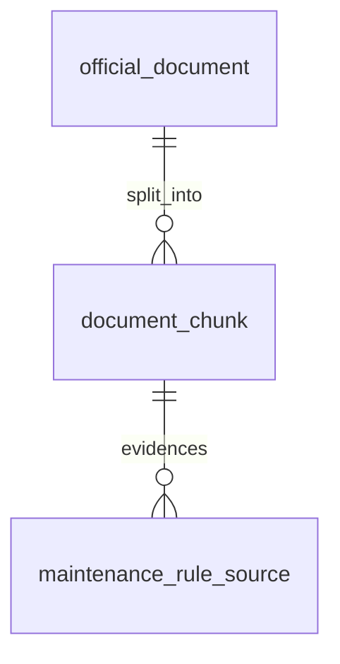

# Entity Specification — `document_chunk` (Chunk tài liệu)

> **Domain:** Knowledge · **Tổng quan lược đồ:** [core.entity.md](../core.entity.md)
>
> **Nguồn:** entity `document_chunks` (ENT-006) trong bản ERD sinh tự động ([archive/core.entity.generated.md](../archive/core.entity.generated.md)), đã **chỉnh theo quy ước core v1.1**. Thay đổi: xem §21.

## 1. Entity Information

| Field | Value |
| --- | --- |
| Entity ID | `ENT-407` |
| Entity Name | `DocumentChunk` |
| Business Name | Chunk tài liệu |
| Table | `document_chunk` |
| Domain | Knowledge |
| Version | `v1.1` |
| Status | `Draft` |
| Owner | AI Team |
| Created Date | `2026-09-27` |
| Updated Date | `2026-09-27` |

---

# 2. Entity Overview

## 2.1 Description

Một đoạn văn tách từ `official_document`, kèm embedding để semantic search bằng pgvector.

## 2.2 Business Purpose

Retrieval cho AI Agent (RAG) và làm bằng chứng cho định mức bảo dưỡng.

## 2.3 Scope

**In Scope:** tài liệu nguồn, nội dung, số trang, thứ tự, embedding.

**Out of Scope:** metadata tài liệu — `official_document`.

---

# 3. Business Meaning

**Example:** chunk thứ 10 của "Sổ tay bảo dưỡng VF6", trang 42, nội dung về chu kỳ thay dầu phanh.

---

# 4. Identity & Keys

| Field / Composite | Unique | Description |
| --- | ---: | --- |
| `id` (`uuid`) | Yes | PK |
| `document_id`, `chunk_index` | Yes | Thứ tự chunk trong một tài liệu |

---

# 5. Attributes

| Tên trường (Field) | Kiểu dữ liệu (Data Type) | Required | Nullable | Default | Ràng buộc (Constraints) | Mô tả (Description) |
| --- | --- | ---: | ---: | --- | --- | --- |
| `id` | `uuid` | Yes | No | `uuid4` | PK | ID chunk |
| `document_id` | `uuid` | Yes | No | - | FK → `official_document.id` `ON DELETE CASCADE` | Tài liệu nguồn |
| `chunk_index` | `integer` | Yes | No | - | `>= 0`; unique cùng `document_id` | Vị trí chunk trong tài liệu |
| `content` | `text` | Yes | No | - | | Nội dung chunk |
| `page_number` | `integer` | No | Yes | - | `> 0` | Trang nguồn |
| `embedding` | `vector(1024)` | Yes | No | - | pgvector, 1024 chiều (Q-408) | Vector embedding |
| `created_at` | `timestamptz` | Yes | No | `now()` | | Thời điểm tạo |

> Bảng **append-only** (re-ingest thay toàn bộ chunk — BR-ENT-409), nên không có `updated_at`.

---

# 7. Relationships

| Related Entity | Relationship | Cardinality | Description |
| --- | --- | --- | --- |
| [`official_document`](./official_document.entity.md) | belongs to | N:1 | Tài liệu nguồn |
| [`maintenance_rule_source`](./maintenance_rule_source.entity.md) | evidences | 1:N | Làm bằng chứng cho hạng mục bảo dưỡng |

---

# 8. Entity Lifecycle / State

Không có status.

---

# 9. Business Rules & Constraints

## BR-ENT-410 — Cùng một embedding model

**Rule:** Mọi chunk dùng cùng một embedding model với đầu ra 1024 chiều; đổi model ⇒ re-embed toàn bộ (và đổi kiểu cột nếu số chiều khác).

---

# 10. Data Integrity

* Unique (`document_id`, `chunk_index`).
* `CHECK (chunk_index >= 0)`, `CHECK (page_number IS NULL OR page_number > 0)`.

---

# 11. Index & Query Requirements

| Query | Fields | Frequency | Required Index |
| --- | --- | --- | --- |
| Semantic search | `embedding` | Rất cao | ANN index (HNSW / IVFFlat — technical design) |
| Chunk của tài liệu | `document_id`, `chunk_index` | Trung bình | Unique |

---

# 12. Ownership & Authorization

Chỉ backend / AI Agent đọc; chỉ pipeline ingest ghi. Không expose trực tiếp qua API.

---

# 21. Open Questions

| ID | Question | Owner | Status |
| --- | --- | --- | --- |
| Q-408 | Chốt số chiều của `embedding`. | AI Team | **Resolved** — 1024 chiều |

**Thay đổi so với bản sinh tự động (`document_chunks`):** đổi tên bảng số ít; FK trỏ `official_document`; `VECTOR` → `vector(1024)`; thêm unique (`document_id`, `chunk_index`) và CHECK; `TIMESTAMP` → `timestamptz`.

---

# 22. Change Log

| Version | Date | Author | Changes |
| --- | --- | --- | --- |
| `v1.0` | `2026-09-27` | Team 4 Người | Tạo mới từ bản ERD sinh tự động, chỉnh theo quy ước core v1.1 |
| `v1.1` | `2026-09-27` | Team 4 Người | Chốt `embedding vector(1024)` (Q-408) |
