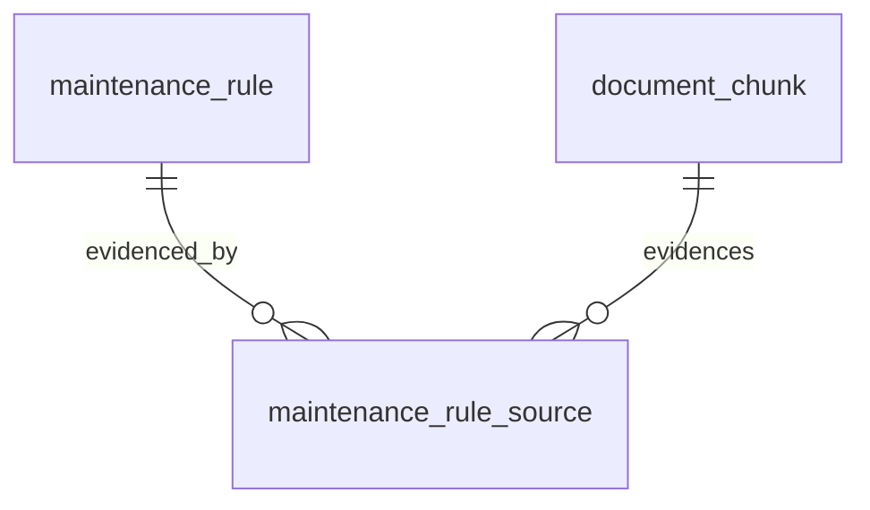

# Entity Specification — `maintenance_rule_source` (Nguồn chứng minh định mức bảo dưỡng)

> **Domain:** Knowledge · **Tổng quan lược đồ:** [core.entity.md](../core.entity.md)
>
> **Nguồn:** entity `maintenance_rule_sources` (ENT-007) trong bản ERD sinh tự động ([archive/core.entity.generated.md](../archive/core.entity.generated.md)), đã **chỉnh theo quy ước core v1.1** và bảng `maintenance_rule` đã có. Thay đổi: xem §21.

## 1. Entity Information

| Field | Value |
| --- | --- |
| Entity ID | `ENT-408` |
| Entity Name | `MaintenanceRuleSource` |
| Business Name | Nguồn chứng minh định mức bảo dưỡng |
| Table | `maintenance_rule_source` |
| Domain | Knowledge |
| Version | `v1.0` |
| Status | `Draft` |
| Owner | AI Team |
| Created Date | `2026-09-27` |
| Updated Date | `2026-09-27` |

---

# 2. Entity Overview

## 2.1 Description

Bảng nối N–N giữa `maintenance_rule` và `document_chunk`: chunk nào chứng minh hạng mục bảo dưỡng nào.

## 2.2 Business Purpose

AI Agent trích dẫn nguồn chính hãng khi nhắc bảo dưỡng / báo giá; đội vận hành kiểm tra định mức có căn cứ.

---

# 3. Business Meaning

**Example:** hạng mục "Thay dầu phanh — VF6 — 24 tháng" được chứng minh bởi chunk 10 và chunk 11 của "Sổ tay bảo dưỡng VF6".

---

# 4. Identity & Keys

| Field / Composite | Unique | Description |
| --- | ---: | --- |
| `id` (`uuid`) | Yes | PK |
| `maintenance_rule_id`, `document_chunk_id` | Yes | Không map trùng |

---

# 5. Attributes

| Tên trường (Field) | Kiểu dữ liệu (Data Type) | Required | Nullable | Default | Ràng buộc (Constraints) | Mô tả (Description) |
| --- | --- | ---: | ---: | --- | --- | --- |
| `id` | `uuid` | Yes | No | `uuid4` | PK | ID mapping |
| `maintenance_rule_id` | `uuid` | Yes | No | - | FK → `maintenance_rule.id` `ON DELETE CASCADE` | Hạng mục bảo dưỡng được chứng minh |
| `document_chunk_id` | `uuid` | Yes | No | - | FK → `document_chunk.id` `ON DELETE CASCADE` | Chunk dùng làm bằng chứng |
| `note` | `text` | No | Yes | - | | Giải thích vì sao chunk hỗ trợ hạng mục |
| `created_at` | `timestamptz` | Yes | No | `now()` | | Thời điểm tạo mapping |

---

# 6. Attribute Details

## `maintenance_rule_id`

Thay cho `rule_item_id → maintenance_rule_items.id`. Bảng core `maintenance_rule` đã ở mức hạng mục (mỗi dòng một hạng mục), nên không tạo bảng `maintenance_rule_items` riêng.

---

# 7. Relationships

| Related Entity | Relationship | Cardinality | Description |
| --- | --- | --- | --- |
| [`maintenance_rule`](../maintenance/maintenance_rule.entity.md) | proves | N:1 | Hạng mục |
| [`document_chunk`](./document_chunk.entity.md) | uses | N:1 | Chunk bằng chứng |

---

# 9. Business Rules & Constraints

## BR-ENT-419 — Model phải khớp

**Rule:** Nếu `official_document.model_id` không `NULL` thì phải bằng `maintenance_rule.model_id`.

## BR-ENT-420 — Append-only

**Rule:** Không sửa mapping; sai thì xoá và tạo lại.

---

# 10. Data Integrity

* Unique (`maintenance_rule_id`, `document_chunk_id`).

---

# 11. Index & Query Requirements

| Query | Fields | Frequency | Required Index |
| --- | --- | --- | --- |
| Nguồn của một hạng mục | `maintenance_rule_id` | Cao | Unique (cột đầu) |
| Hạng mục dùng một chunk | `document_chunk_id` | Thấp | Yes |

---

# 12. Ownership & Authorization

Chỉ pipeline ingest / quản trị dữ liệu ghi; AI Agent đọc.

---

# 21. Open Questions

**Thay đổi so với bản sinh tự động (`maintenance_rule_sources`):** đổi tên bảng số ít; `rule_item_id` → `maintenance_rule_id` (không có bảng `maintenance_rule_items`); thêm unique cặp và `ON DELETE CASCADE`; `TIMESTAMP` → `timestamptz`.

---

# 22. Change Log

| Version | Date | Author | Changes |
| --- | --- | --- | --- |
| `v1.0` | `2026-09-27` | Team 4 Người | Tạo mới từ bản ERD sinh tự động, chỉnh theo quy ước core v1.1 |
