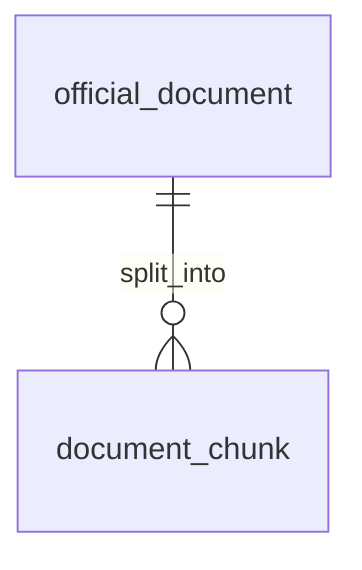

# Entity Specification — `official_document` (Tài liệu chính hãng)

> **Domain:** Knowledge · **Tổng quan lược đồ:** [core.entity.md](../core.entity.md)
>
> **Nguồn:** entity `official_documents` (ENT-005) trong bản ERD sinh tự động ([archive/core.entity.generated.md](../archive/core.entity.generated.md)), đã **chỉnh theo quy ước core v1.1**. Thay đổi: xem §21.

## 1. Entity Information

| Field | Value |
| --- | --- |
| Entity ID | `ENT-406` |
| Entity Name | `OfficialDocument` |
| Business Name | Tài liệu chính hãng |
| Table | `official_document` |
| Domain | Knowledge |
| Version | `v1.1` |
| Status | `Draft` |
| Owner | AI Team |
| Created Date | `2026-09-27` |
| Updated Date | `2026-09-27` |

---

# 2. Entity Overview

## 2.1 Description

Metadata của tài liệu chính hãng (sổ tay chủ xe, lịch bảo dưỡng, chính sách bảo hành, ...) được ingest làm nguồn RAG.

## 2.2 Business Purpose

AI Agent trả lời và trích dẫn nguồn chính thống; truy vết vì sao một định mức bảo dưỡng tồn tại.

## 2.3 Scope

**In Scope:** tiêu đề, model áp dụng, loại, phiên bản, URL nguồn, ngày hiệu lực.

**Out of Scope:** nội dung đã chunk — `document_chunk`.

---

# 3. Business Meaning

**Example:** "Sổ tay bảo dưỡng VF6", `model_id = VF6`, `document_type = maintenance_manual`, version `2026.1`, hiệu lực 01/01/2026.

---

# 4. Identity & Keys

| Field / Composite | Unique | Description |
| --- | ---: | --- |
| `id` (`uuid`) | Yes | PK |
| `title`, `version` | Yes | `ux_official_document_title_version` — `UNIQUE NULLS NOT DISTINCT` (PostgreSQL 15+) để hai bản ghi cùng `title` và cùng `version = NULL` cũng bị chặn (Q-407) |

---

# 5. Attributes

| Tên trường (Field) | Kiểu dữ liệu (Data Type) | Required | Nullable | Default | Ràng buộc (Constraints) | Mô tả (Description) |
| --- | --- | ---: | ---: | --- | --- | --- |
| `id` | `uuid` | Yes | No | `uuid4` | PK | ID tài liệu |
| `title` | `varchar(255)` | Yes | No | - | | Tên tài liệu |
| `model_id` | `varchar(64)` | No | Yes | - | Mã model của hãng | Model áp dụng; `NULL` = áp dụng chung mọi model |
| `document_type` | `official_document_type_enum` | Yes | No | - | `owner_manual / maintenance_manual / warranty_policy / service_bulletin` | Loại tài liệu (Q-406) |
| `version` | `varchar(50)` | No | Yes | - | | Phiên bản |
| `source_url` | `text` | No | Yes | - | | URL nguồn |
| `effective_date` | `date` | No | Yes | - | | Ngày hiệu lực |
| `created_at` | `timestamptz` | Yes | No | `now()` | | Thời điểm ingest |
| `updated_at` | `timestamptz` | Yes | No | `now()` | | Thời điểm cập nhật |

---

# 6. Attribute Details

## `document_type`

| Giá trị (DB) | API | Ý nghĩa |
| --- | --- | --- |
| `owner_manual` | `OWNER_MANUAL` | Sổ tay hướng dẫn sử dụng cho chủ xe |
| `maintenance_manual` | `MAINTENANCE_MANUAL` | Sổ tay / lịch bảo dưỡng định kỳ |
| `warranty_policy` | `WARRANTY_POLICY` | Chính sách, điều khoản bảo hành |
| `service_bulletin` | `SERVICE_BULLETIN` | Thông báo kỹ thuật / triệu hồi của hãng |

---

# 7. Relationships

| Related Entity | Relationship | Cardinality | Description |
| --- | --- | --- | --- |
| [`document_chunk`](./document_chunk.entity.md) | split into | 1:N | Các đoạn đã chunk |

---

# 8. Entity Lifecycle / State

Không có status. Phiên bản mới của cùng tài liệu ⇒ tạo bản ghi mới (giữ bản cũ để truy vết).

---

# 9. Business Rules & Constraints

## BR-ENT-409 — Re-ingest thay toàn bộ chunk

**Rule:** Khi ingest lại cùng một bản ghi tài liệu, xoá toàn bộ `document_chunk` cũ và tạo lại trong cùng transaction; các `maintenance_rule_source` trỏ tới chunk cũ bị xoá theo (cascade) và phải map lại.

---

# 10. Data Integrity

* `UNIQUE NULLS NOT DISTINCT (title, version)`.

---

# 11. Index & Query Requirements

| Query | Fields | Frequency | Required Index |
| --- | --- | --- | --- |
| Tài liệu theo model | `model_id`, `document_type` | Trung bình | Yes |

---

# 12. Ownership & Authorization

| Actor / Role | Read | Create | Update | Delete |
| --- | ---: | ---: | ---: | ---: |
| Chủ xe / Chủ xưởng | ✅ (qua trích dẫn AI) | ❌ | ❌ | ❌ |
| Hệ thống (pipeline ingest) | ✅ | ✅ | ✅ | ✅ |

---

# 21. Open Questions

| ID | Question | Owner | Status |
| --- | --- | --- | --- |
| Q-406 | Chốt danh sách `document_type` để chuyển sang enum? | AI Team | **Resolved** — enum `owner_manual / maintenance_manual / warranty_policy / service_bulletin` |
| Q-407 | Có unique (`title`, `version`) không? | AI Team | **Resolved** — Có |

**Thay đổi so với bản sinh tự động (`official_documents`):** đổi tên bảng số ít; `vehicle_model varchar(50)` → `model_id varchar(64)`; `document_type varchar(50)` → `official_document_type_enum`; thêm unique (`title`, `version`); `TIMESTAMP` → `timestamptz`; `updated_at` NOT NULL.

---

# 22. Change Log

| Version | Date | Author | Changes |
| --- | --- | --- | --- |
| `v1.0` | `2026-09-27` | Team 4 Người | Tạo mới từ bản ERD sinh tự động, chỉnh theo quy ước core v1.1 |
| `v1.1` | `2026-09-27` | Team 4 Người | `document_type` chuyển sang enum (Q-406); thêm unique (`title`, `version`) (Q-407) |
