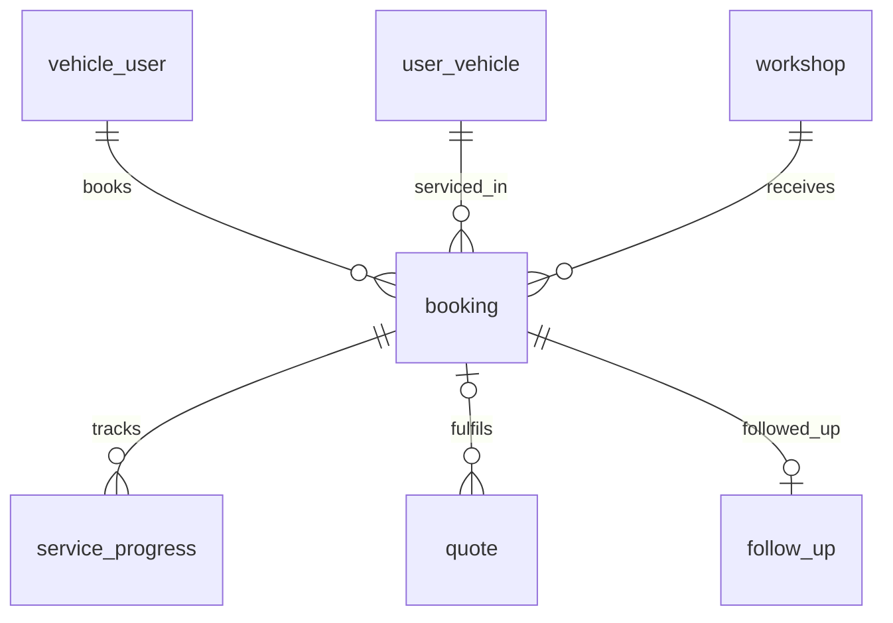
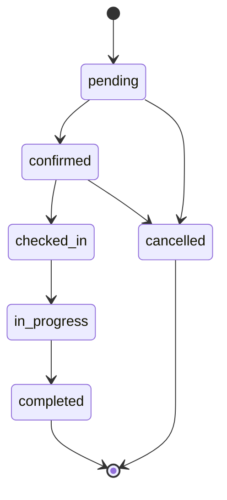

# Entity Specification — `booking` (Lịch hẹn bảo dưỡng)

> **Domain:** Maintenance · **Tổng quan lược đồ:** [core.entity.md](../core.entity.md)
>
> **Nguồn sự thật:** `core.entity.md` v1.1 §14.2 bảng 5, §11 (EF-001), §13 (State). Cấu trúc bảng **giữ nguyên**.

## 1. Entity Information

| Field | Value |
| --- | --- |
| Entity ID | `ENT-402` |
| Entity Name | `Booking` |
| Business Name | Lịch hẹn bảo dưỡng |
| Table | `booking` |
| Domain | Maintenance |
| Version | `v1.2` |
| Status | `Draft` |
| Owner | Backend Team |
| Created Date | `2026-09-27` |
| Updated Date | `2026-09-29` |

---

# 2. Entity Overview

## 2.1 Description

Quản lý các lượt đặt lịch hẹn giữa chủ xe và xưởng dịch vụ.

## 2.2 Business Purpose

Giữ slot tại xưởng, theo dõi trạng thái lịch hẹn từ lúc đặt đến khi hoàn tất, là gốc của `service_progress` và `follow_up`.

## 2.3 Scope

**In Scope**

* Khách hàng, xe, xưởng, ngày giờ hẹn, chi phí ước tính/thực tế, trạng thái, giữ slot tạm thời.

**Out of Scope**

* Chi tiết từng hạng mục báo giá — `quote` / `quote_item` (liên kết qua `quote.booking_id`).
* Tiến độ chi tiết tại xưởng — `service_progress`.

---

# 3. Business Meaning

## Definition

Một `booking` = một cam kết đưa một xe đến một xưởng vào một khung giờ.

## Example

`BK-20261003-0012`, xe VF6 của user 42, VinFast Cầu Giấy, 03/10/2026 09:00, `confirmed`.

---

# 4. Identity & Keys

| Field | Unique | Description |
| --- | ---: | --- |
| `id` (`uuid`) | Yes | PK |
| `booking_code` | Yes | Mã đặt lịch gửi cho khách hàng |

---

# 5. Attributes

| Tên trường (Field) | Kiểu dữ liệu (Data Type) | Required | Nullable | Default | Ràng buộc (Constraints) | Mô tả (Description) |
| --- | --- | ---: | ---: | --- | --- | --- |
| `id` | `uuid` | Yes | No | `uuid4` | PK | Mã định danh lịch hẹn |
| `booking_code` | `varchar(20)` | Yes | No | - | Unique | Mã đặt lịch gửi cho khách hàng |
| `user_id` | `integer` | Yes | No | - | FK → `vehicle_user.user_id` | Khách hàng đặt lịch |
| `user_vehicle_id` | `uuid` | Yes | No | - | FK → `user_vehicle.id` | Xe được mang đi bảo dưỡng |
| `workshop_id` | `uuid` | Yes | No | - | FK → `workshop.id` | Xưởng dịch vụ tiếp nhận |
| `booking_date` | `date` | Yes | No | - | | Ngày hẹn |
| `time_slot` | `time` | Yes | No | - | | Khung giờ hẹn |
| `estimated_cost` | `numeric(12,2)` | No | Yes | - | `>= 0` | Chi phí ước tính ban đầu |
| `actual_cost` | `numeric(12,2)` | No | Yes | - | `>= 0` | Chi phí thực tế sau khi kiểm tra/sửa chữa |
| `status` | `booking_status_enum` | Yes | No | `pending` | Xem §8 | Trạng thái lịch hẹn |
| `hold_expires_at` | `timestamptz` | No | Yes | - | | Thời gian hết hạn giữ slot tạm thời (Hold slot) |
| `created_at` | `timestamptz` | Yes | No | `now()` | | Thời gian khởi tạo lịch hẹn |
| `updated_at` | `timestamptz` | Yes | No | `now()` | | |

---

# 6. Attribute Details

## `estimated_cost`

Khi lịch hẹn được tạo từ một `quote` đã `approved` ⇒ gán bằng `quote.approved_total` (BR-ENT-404). Khi đặt lịch trực tiếp (AF-001) ⇒ lấy tổng `maintenance_rule.estimated_cost` / `service_price.price` của mốc tương ứng hoặc để `NULL`.

## `hold_expires_at`

Chỉ có ý nghĩa ở trạng thái `pending`: là **cửa sổ để chủ xe tự huỷ giữ chỗ** (mặc định 10'). Hết cửa sổ **không** tự huỷ khi đang chờ xưởng xác nhận — xem BR-ENT-402 (cập nhật theo F6). Ở chế độ xưởng `auto`, cột này được đặt `NULL` khi booking chuyển `confirmed`.

---

# 7. Relationships

## 7.1 Relationship Overview

## 7.2 Relationship Details

| Related Entity | Relationship | Cardinality | Description |
| --- | --- | --- | --- |
| [`vehicle_user`](../identity/vehicle_user.entity.md) | booked by | N:1 | Khách hàng |
| [`user_vehicle`](../vehicle/user_vehicle.entity.md) | for | N:1 | Xe |
| [`workshop`](../workshop/workshop.entity.md) | at | N:1 | Xưởng |
| [`service_progress`](./service_progress.entity.md) | tracks | 1:N | Tiến độ tại xưởng |
| [`quote`](./quote.entity.md) | fulfils | 1:N | Báo giá được thực hiện bởi lịch hẹn này (FK `quote.booking_id`) |
| [`follow_up`](../crm/follow_up.entity.md) | followed up | 1:0..1 | Chăm sóc sau dịch vụ (FK `follow_up.booking_id`, unique) |

### Relationship Rules

* `user_vehicle.user_id` phải bằng `booking.user_id`.
* Xe phải `verified` + `link_status = active`; xưởng phải `status = active`.

---

# 8. Entity Lifecycle / State

> Enum lưu **lowercase** trong DB, API trả **UPPER_SNAKE_CASE**.

## 8.1 States

| State (DB) | API | Meaning | Entry Condition | Exit Condition |
| --- | --- | --- | --- | --- |
| `pending` | `PENDING` | Giữ chỗ (chủ xe đã bấm Xác nhận), chờ tạo lịch chính thức | Chủ xe bấm Xác nhận + còn chỗ (F6 BR-007) | Chuyển `confirmed` (tự động hoặc xưởng chấp nhận — F6 BR-014) hoặc `cancelled` (chủ xe huỷ trong cửa sổ `hold_expires_at`, xưởng từ chối, hoặc quá hạn xưởng — F6 BR-015) |
| `confirmed` | `CONFIRMED` | Đã xác nhận lịch hẹn | Xưởng/Hệ thống xác nhận lịch đặt (F6 BR-014) | Khách hàng check-in tại xưởng (`checked_in`) hoặc hủy (`cancelled`) |
| `checked_in` | `CHECKED_IN` | Xe đã đến xưởng | Cố vấn dịch vụ xác nhận xe đã đến | Bắt đầu làm dịch vụ (`in_progress`) |
| `in_progress` | `IN_PROGRESS` | Đang thực hiện dịch vụ | KTV bắt đầu tiến trình bảo dưỡng | Hoàn thành dịch vụ (`completed`) |
| `completed` | `COMPLETED` | Hoàn tất bảo dưỡng | KTV/Cố vấn dịch vụ nghiệm thu xe | Kết thúc quy trình |
| `cancelled` | `CANCELLED` | Đã hủy lịch hẹn | Chủ xe huỷ giữ chỗ trong cửa sổ 10' (F6 BR-010), xưởng từ chối, hoặc quá hạn xưởng xác nhận (F6 BR-015) | Kết thúc quy trình |

## 8.2 State Transition

## 8.3 Transition Rules

* `pending → confirmed`: xưởng ở chế độ tự động (`workshop.booking_confirmation_mode = auto`) xác nhận ngay, hoặc chủ xưởng chấp nhận thủ công trên Board (F6 BR-014).
* `pending → cancelled`: chủ xe huỷ giữ chỗ trong cửa sổ `hold_expires_at`, xưởng từ chối, hoặc quá hạn chót xưởng xác nhận (F6 BR-010, BR-015). Xem BR-ENT-402.
* `completed`: kích hoạt tạo `follow_up` (BR-ENT-421).

---

# 9. Business Rules & Constraints

## BR-ENT-402 — Ý nghĩa `hold_expires_at` và huỷ giữ chỗ (F6 BR-007/010/014/015)

> **Cập nhật theo F6 (US-029, quyết định AI-Q-401/402):** `hold_expires_at` **không còn** là mốc tự huỷ vô điều kiện. Nó là **cửa sổ để chủ xe tự huỷ giữ chỗ**; việc thành lịch chính thức do chế độ xác nhận của xưởng quyết định.

**Rule:**

1. Chủ xe bấm Xác nhận ⇒ tạo `booking` `pending` với `hold_expires_at = now() + HOLD_MINUTES` (mặc định 10'). Đây là **giữ chỗ**, chưa phải lịch hẹn chính thức.
2. **Trong** cửa sổ `hold_expires_at`: chủ xe được huỷ giữ chỗ ⇒ `cancelled`, giải phóng chỗ. **Sau** `hold_expires_at`: chủ xe không còn tự huỷ qua luồng giữ chỗ tạm; booking `pending` **không** tự huỷ mà chờ xưởng xác nhận.
3. Tạo lịch chính thức (`confirmed`): xưởng `booking_confirmation_mode = auto` ⇒ chuyển ngay khi giữ chỗ; `manual` ⇒ chủ xưởng chấp nhận trên Board (F8). Xưởng từ chối ⇒ `cancelled`.
4. **Tự huỷ khi treo lâu (F6 BR-015):** booking `pending` chưa được xưởng xử lý quá `BOOKING_WS_CONFIRM_DEADLINE_HOURS` (mặc định 12h) **hoặc** đã qua giờ hẹn — lấy mốc đến trước — bị chuyển `cancelled`.

**Expected Behavior:** Chỗ đang giữ (`pending`) vẫn tính vào sức chứa (BR-ENT-403) cho tới khi `confirmed` hoặc `cancelled`. Khi huỷ, thông báo chủ xe chọn lại khung giờ.

> Chi tiết nghiệp vụ: [F6 FF](../../sprint-3/feature-functional/us-029-sprint-3-spec.ff.md) (BR-007, BR-010, BR-014, BR-015); cột `workshop.booking_confirmation_mode` và job tự huỷ ở [F6 Entity Spec](../../sprint-3/entity/us-029-sprint-3-spec.entity.md).

## BR-ENT-403 — Kiểm tra sức chứa (EDGE-002)

**Rule:** Không nhận đặt lịch khi khung giờ đã đầy theo `workshop.total_technicians` và `workshop.emergency_slots_reserved`.

## BR-ENT-404 — Đặt lịch từ báo giá

**Rule:** Khi đặt lịch từ một `quote` `approved` còn hạn (`now() < quote.expires_at` — BR-ENT-426), hệ thống gán `quote.booking_id = booking.id` và `booking.estimated_cost = quote.approved_total`. `quote.workshop_id`, `quote.user_vehicle_id` phải trùng với `booking`.

---

# 10. Data Integrity

* `CHECK (estimated_cost IS NULL OR estimated_cost >= 0)`, `CHECK (actual_cost IS NULL OR actual_cost >= 0)`.
* `booking_code` unique.

---

# 11. Index & Query Requirements

| Query | Fields | Frequency | Required Index |
| --- | --- | --- | --- |
| Lịch hẹn của tôi | `user_id` | Cao | Yes |
| Lịch của xưởng theo ngày | `workshop_id`, `booking_date` | Cao | Yes |
| Job huỷ hold hết hạn | `status`, `hold_expires_at` | Mỗi phút | Partial `WHERE status = 'pending'` |

---

# 12. Ownership & Authorization

| Actor / Role | Read | Create | Update | Delete |
| --- | ---: | ---: | ---: | ---: |
| Chủ xe | ✅ (của mình) | ✅ | ✅ (huỷ) | ❌ |
| Chủ xưởng | ✅ (xưởng mình) | ❌ | ✅ (xác nhận, check-in, tiến độ) | ❌ |
| Hệ thống | ✅ | ✅ | ✅ (huỷ hold hết hạn) | ❌ |

---

# 13–16. Audit, Data Source, Security, Retention

* Audit: `created_at`, `updated_at`.
* Source of truth: App DB.
* Không xoá cứng; huỷ bằng `status = cancelled`.

---

# 22. Change Log

| Version | Date | Author | Changes |
| --- | --- | --- | --- |
| `v1.1` | `2026-09-27` | Team 4 Người | Tách từ `core.entity.md` v1.1 §14.2 bảng 5 + §11 + §13, cấu trúc giữ nguyên; bổ sung quan hệ tới `quote`, `follow_up` (FK nằm ở bảng mới) |
| `v1.2` | `2026-09-29` | Team 4 Người | Cập nhật BR-ENT-402 theo F6 (US-029, AI-Q-401/402): `hold_expires_at` là cửa sổ chủ xe huỷ giữ chỗ, không tự huỷ vô điều kiện; lịch chính thức theo `workshop.booking_confirmation_mode` (auto/manual, BR-014); tự huỷ khi treo quá hạn (BR-015). Cập nhật §8.1/§8.3 và ghi chú `hold_expires_at`. Cấu trúc bảng `booking` **không đổi** |
