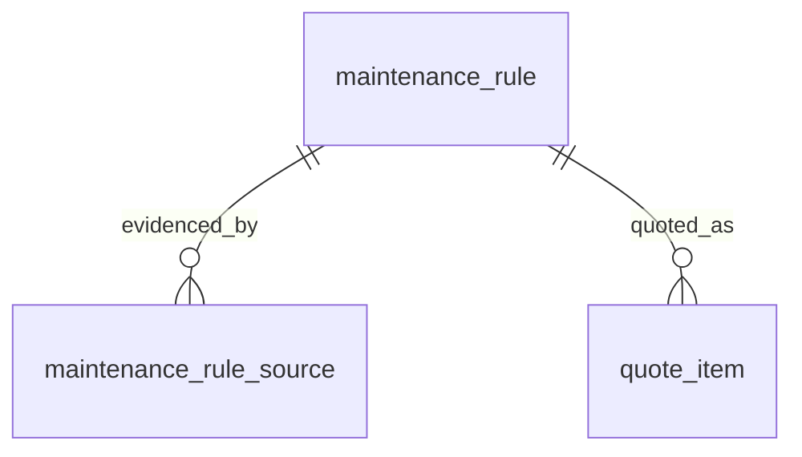

# Entity Specification — `maintenance_rule` (Quy định & Bảng giá bảo dưỡng chuẩn)

> **Cập nhật phạm vi (02/10/2026):** các phần dưới đây trong tài liệu này không còn áp dụng.
>
> - Báo giá / duyệt báo giá (`quote`, `quote_item`, us-049): **đã bỏ**. Đặt lịch không gắn báo giá; mọi con số chi phí là ước tính (F5), chi phí cuối cùng do xưởng xác nhận khi kiểm tra xe.

> **Domain:** Maintenance · **Tổng quan lược đồ:** [core.entity.md](../core.entity.md)
>
> **Nguồn sự thật:** `core.entity.md` v1.1 §14.2 bảng 4. Cấu trúc bảng giữ nguyên, **v1.2 bổ sung** cột `item_code` (Q-402) và unique (`model_id`, `odo_milestone`, `item_name`) (Q-401). Tương ứng với `MaintenanceSchedule` + `MaintenanceItem` của hãng ([proposed_erd.latest.md §3.5–3.6](../../mock-system/proposed_erd.latest.md)).

## 1. Entity Information

| Field | Value |
| --- | --- |
| Entity ID | `ENT-401` |
| Entity Name | `MaintenanceRule` |
| Business Name | Quy định bảo dưỡng chuẩn |
| Table | `maintenance_rule` |
| Domain | Maintenance |
| Version | `v1.2` |
| Status | `Draft` |
| Owner | Backend Team |
| Created Date | `2026-09-27` |
| Updated Date | `2026-09-27` |

---

# 2. Entity Overview

## 2.1 Description

Lưu trữ định mức bảo dưỡng, hạng mục và chi phí dự tính theo mốc km/thời gian. **Mỗi dòng là một hạng mục** tại một mốc của một model (bảng phẳng, không tách header/items).

## 2.2 Business Purpose

* AI Agent xác định mốc bảo dưỡng tiếp theo và sinh `reminder`.
* Nguồn hạng mục chuẩn và giá tham khảo khi lập `quote`.
* Được chứng minh nguồn bằng tài liệu chính hãng qua `maintenance_rule_source` (RAG).

## 2.3 Scope

**In Scope**

* Mốc ODO, mốc tháng, tên hạng mục, diện bảo hành, chi phí và thời gian dự tính.

**Out of Scope**

* Giá thực tế theo từng xưởng — `service_price`.
* Lịch sử bảo dưỡng thực tế — `ServiceHistory` của hãng.

---

# 3. Business Meaning

## Definition

Một dòng `maintenance_rule` = "Model X, tại mốc `odo_milestone` km hoặc `month_milestone` tháng (điều kiện nào đến trước), cần làm hạng mục Y, tốn khoảng Z đồng và W phút".

## Example

VF6, mốc 12.000 km / 12 tháng, "Kiểm tra hệ thống phanh", không thuộc bảo hành, 350.000 VNĐ, 30 phút.

## Terminology

* `ODO` — TERM-001.
* Mốc bảo dưỡng (milestone): cặp (`odo_milestone`, `month_milestone`) của một model.

---

# 4. Identity & Keys

## 4.1 Primary Key

| Field | Type | Description |
| --- | --- | --- |
| `id` | `uuid` | Sinh ở app bằng `uuid4` |

## 4.2 Candidate / Unique Keys

| Field / Composite | Unique | Description |
| --- | ---: | --- |
| `model_id`, `odo_milestone`, `item_name` | Yes | `ux_maintenance_rule_model_milestone_item` — một hạng mục chỉ xuất hiện một lần tại một mốc của một model (Q-401) |
| `model_id`, `odo_milestone`, `item_code` | Yes | `ux_maintenance_rule_model_milestone_code` — hệ quả của BR-ENT-425 |
| `item_code` | No | Cùng một hạng mục lặp lại ở nhiều mốc / nhiều model |

---

# 5. Attributes

| Tên trường (Field) | Kiểu dữ liệu (Data Type) | Required | Nullable | Default | Ràng buộc (Constraints) | Mô tả (Description) |
| --- | --- | ---: | ---: | --- | --- | --- |
| `id` | `uuid` | Yes | No | `uuid4` | PK | ID quy trình bảo dưỡng |
| `model_id` | `varchar(64)` | Yes | No | - | Mã model của hãng | Mẫu xe áp dụng (VF3 - VF9) |
| `odo_milestone` | `integer` | Yes | No | - | `> 0` | Mốc ODO bảo dưỡng (VD: 12000, 20000, 30000 km) |
| `month_milestone` | `integer` | Yes | No | - | `> 0` | Mốc thời gian bảo dưỡng (VD: 6, 12, 24 tháng) |
| `item_code` | `varchar(50)` | Yes | No | - | Uppercase, `^[A-Z0-9_]{2,50}$` | Mã hạng mục chuẩn (VD: `BRAKE_INSPECTION`) — **mới v1.2** (Q-402) |
| `item_name` | `varchar(200)` | Yes | No | - | | Tên hạng mục (Thay lọc gió, kiểm tra pin, ...) |
| `is_covered_by_warranty` | `boolean` | Yes | No | `false` | | Thuộc diện bảo hành miễn phí hay không |
| `estimated_cost` | `numeric(12,2)` | Yes | No | - | `>= 0` | Chi phí ước tính (VNĐ) |
| `estimated_duration_minutes` | `integer` | Yes | No | - | `> 0` | Thời gian kỹ thuật viên thực hiện (Phút) |
| `created_at` | `timestamptz` | Yes | No | `now()` | | |
| `updated_at` | `timestamptz` | Yes | No | `now()` | | |

---

# 6. Attribute Details

## `model_id`

Mã `model_id` của `VehicleModel` bên hãng — cùng miền giá trị với `user_vehicle.external_model_id` / `declared_model_id`. Không có FK vì dữ liệu model nằm ở hệ thống hãng.

## `item_code` (mới v1.2)

Mã định danh **hạng mục**, độc lập với mốc: "Kiểm tra hệ thống phanh" có cùng `item_code = BRAKE_INSPECTION` ở mốc 12.000 km và 24.000 km. Dùng làm khoá ghép giá với `service_price.item_code` và snapshot ở `quote_item.item_code`, thay cho việc ghép theo `item_name`.

**Migration:** thêm cột nullable → backfill mã cho dữ liệu seed hiện có → đặt `NOT NULL` và tạo unique index.

## `estimated_cost`

Giá tham khảo chuẩn (tương ứng `MaintenanceItem.reference_price`). Giá thực tế của từng xưởng nằm ở `service_price` và được ưu tiên khi lập báo giá (BR-ENT-411).

---

# 7. Relationships

## 7.1 Relationship Overview

## 7.2 Relationship Details

| Related Entity | Relationship | Cardinality | Description |
| --- | --- | --- | --- |
| [`maintenance_rule_source`](../knowledge/maintenance_rule_source.entity.md) | evidenced by | 1:N | Chunk tài liệu chính hãng chứng minh hạng mục (FK nằm ở bảng mới) |
| [`quote_item`](./quote_item.entity.md) | quoted as | 1:N | Dòng báo giá lấy từ hạng mục chuẩn (FK nằm ở bảng mới) |
| [`service_price`](../workshop/service_price.entity.md) | priced by | logic | Ghép theo (`model_id`, `item_code`), không có FK |
| Hãng: `VehicleModel` | applies to | N:1 | Qua `model_id` |

---

# 8. Entity Lifecycle / State

Không có trạng thái. Dữ liệu cấu hình, cập nhật khi hãng thay đổi định mức.

---

# 9. Business Rules & Constraints

## BR-003 (core) — Maintenance Rule Mapping

Định mức bảo dưỡng áp dụng theo mã model của hãng (`model_id`) và mốc km/thời gian.

## BR-ENT-401 — Mốc đến trước được áp dụng

**Rule:** Mốc bảo dưỡng đến hạn khi ODO hiện tại ≥ `odo_milestone` **hoặc** số tháng kể từ lần bảo dưỡng gần nhất / ngày xuất xưởng ≥ `month_milestone`.

**Condition:** AI Agent tính mốc tiếp theo cho một xe.

**Expected Behavior:** Nếu xe chưa có ODO từ hãng (EDGE-001) ⇒ chỉ dùng `month_milestone`.

## BR-ENT-425 — Mã hạng mục nhất quán trong một model

**Rule:** Trong cùng một `model_id`, một `item_code` luôn ứng với cùng một `item_name` (và ngược lại).

**Condition:** Khi seed / cập nhật định mức.

**Expected Behavior:** Kiểm tra ở service / script seed; vi phạm ⇒ từ chối ghi.

---

# 10. Data Integrity

* `CHECK (odo_milestone > 0)`, `CHECK (month_milestone > 0)`, `CHECK (estimated_cost >= 0)`, `CHECK (estimated_duration_minutes > 0)`.
* `CHECK (item_code ~ '^[A-Z0-9_]{2,50}$')`.
* Unique (`model_id`, `odo_milestone`, `item_name`); unique (`model_id`, `odo_milestone`, `item_code`).

---

# 11. Index & Query Requirements

| Query | Fields | Frequency | Required Index |
| --- | --- | --- | --- |
| Lấy định mức theo model | `model_id` | Cao | Yes (index `model_id`) |
| Lấy hạng mục của một mốc | `model_id`, `odo_milestone` | Cao | Unique index (`model_id`, `odo_milestone`, `item_name`) |
| Ghép giá theo hạng mục | `model_id`, `item_code` | Cao | Yes |

---

# 12. Ownership & Authorization

| Actor / Role | Read | Create | Update | Delete |
| --- | ---: | ---: | ---: | ---: |
| Chủ xe | ✅ | ❌ | ❌ | ❌ |
| Chủ xưởng | ✅ | ❌ | ❌ | ❌ |
| Hệ thống (seed / đồng bộ) | ✅ | ✅ | ✅ | ✅ |

---

# 13–14. Audit & Data Source

| Data | Source System | Owner | Sync Type |
| --- | --- | --- | --- |
| Toàn bộ bảng | Tài liệu bảo dưỡng chính hãng / `MaintenanceSchedule` của hãng | Backend Team | Seed / batch |

---

# 15–16. Security & Retention

Dữ liệu công khai, không nhạy cảm. Không xoá cứng dòng đang được `quote_item` tham chiếu (FK `ON DELETE SET NULL` phía `quote_item`).

---

# 21. Open Questions

| ID | Question | Owner | Status |
| --- | --- | --- | --- |
| Q-401 | Có đặt unique (`model_id`, `odo_milestone`, `item_name`) không? | Backend Team | **Resolved** — Có |
| Q-402 | Có bổ sung `item_code` để ghép với `service_price` thay vì ghép theo `item_name` không? | Backend Team | **Resolved** — Có, thêm `item_code varchar(50)` |

---

# 22. Change Log

| Version | Date | Author | Changes |
| --- | --- | --- | --- |
| `v1.1` | `2026-09-27` | Team 4 Người | Tách từ `core.entity.md` v1.1 §14.2 bảng 4, cấu trúc giữ nguyên; bổ sung quan hệ tới `maintenance_rule_source`, `quote_item` |
| `v1.2` | `2026-09-27` | Team 4 Người | Thêm `item_code` (Q-402), BR-ENT-425; thêm unique (`model_id`, `odo_milestone`, `item_name`) (Q-401) |
