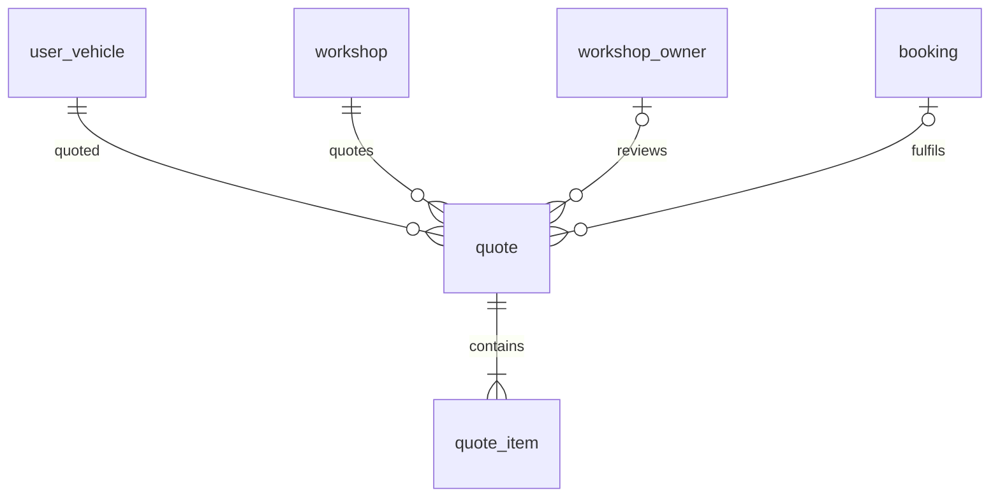
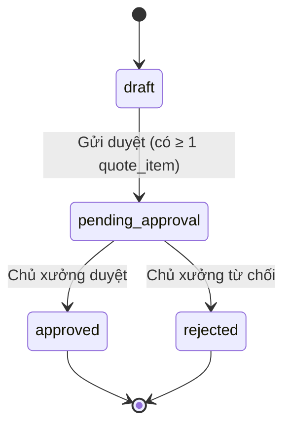

# Entity Specification — `quote` (Báo giá bảo dưỡng — HITL)

> **Đã loại khỏi phạm vi (02/10/2026).** Chức năng báo giá có chủ xưởng duyệt (F5b, us-049, AI-005) đã bị bỏ khỏi sản phẩm: code backend/frontend đã gỡ, bảng `quote`, `quote_item` được xoá bởi migration `backend/alembic/versions/a3c7e9f1b2d4_drop_quote_support_ticket_discord.py`. Tài liệu giữ lại để tham khảo lịch sử, **không dùng để triển khai**.

> **Domain:** Maintenance · **Tổng quan lược đồ:** [core.entity.md](../core.entity.md)
>
> **Nguồn:** entity `quotes` (ENT-010) trong bản ERD sinh tự động ([archive/core.entity.generated.md](../archive/core.entity.generated.md)), đã **chỉnh theo quy ước core v1.1** và các entity đã có. Các điểm thay đổi so với bản sinh tự động: xem §21. Đánh dấu `[Đề xuất]` là phần bổ sung chưa có trong nguồn nào, cần review.

## 1. Entity Information

| Field | Value |
| --- | --- |
| Entity ID | `ENT-410` |
| Entity Name | `Quote` |
| Business Name | Báo giá |
| Table | `quote` |
| Domain | Maintenance |
| Version | `v1.1` |
| Status | `Draft` |
| Owner | Backend Team |
| Created Date | `2026-09-27` |
| Updated Date | `2026-09-27` |

---

# 2. Entity Overview

## 2.1 Description

Báo giá bảo dưỡng cho một xe tại một xưởng. AI Agent lập bản nháp từ `maintenance_rule` và `service_price`; chủ xưởng duyệt hoặc từ chối (Human-in-the-loop — HITL).

## 2.2 Business Purpose

Đảm bảo chi phí báo cho chủ xe đã được con người xác nhận trước khi đặt lịch.

## 2.3 Scope

**In Scope**

* Xe, xưởng, mốc bảo dưỡng liên quan, trạng thái HITL, tổng ước tính, tổng được duyệt, người duyệt, ghi chú.

**Out of Scope**

* Từng dòng hạng mục — `quote_item`.
* Thanh toán.

---

# 3. Business Meaning

## Definition

Một `quote` = một đề xuất chi phí cho một lần bảo dưỡng của một xe tại một xưởng, đi qua `draft → pending_approval → approved | rejected`.

## Example

Xe VF6 mốc 12.000 km tại VinFast Cầu Giấy: AI ước tính 1.250.000 VNĐ, chủ xưởng duyệt 1.100.000 VNĐ.

## Terminology

* HITL — Human-in-the-loop: AI đề xuất, con người duyệt.

---

# 4. Identity & Keys

| Field | Type | Description |
| --- | --- | --- |
| `id` | `uuid` | PK, sinh bằng `uuid4` |

---

# 5. Attributes

| Tên trường (Field) | Kiểu dữ liệu (Data Type) | Required | Nullable | Default | Ràng buộc (Constraints) | Mô tả (Description) |
| --- | --- | ---: | ---: | --- | --- | --- |
| `id` | `uuid` | Yes | No | `uuid4` | PK | ID báo giá |
| `user_vehicle_id` | `uuid` | Yes | No | - | FK → `user_vehicle.id` `ON DELETE CASCADE` | Xe được báo giá |
| `workshop_id` | `uuid` | Yes | No | - | FK → `workshop.id` | Xưởng báo giá và duyệt `[Đề xuất]` |
| `odo_milestone` | `integer` | No | Yes | - | `> 0` | Mốc bảo dưỡng liên quan (khớp `maintenance_rule.odo_milestone`); `NULL` = báo giá ngoài mốc |
| `booking_id` | `uuid` | No | Yes | - | FK → `booking.id` `ON DELETE SET NULL` | Lịch hẹn thực hiện báo giá này |
| `status` | `quote_status_enum` | Yes | No | `draft` | `draft / pending_approval / approved / rejected` | Trạng thái HITL |
| `estimated_total` | `numeric(12,2)` | Yes | No | - | `>= 0` | Tổng giá ước tính (AI) |
| `approved_total` | `numeric(12,2)` | No | Yes | - | `>= 0` | Tổng sau khi chủ xưởng duyệt |
| `reviewed_by` | `uuid` | No | Yes | - | FK → `workshop_owner.id` `ON DELETE SET NULL` | Người duyệt / từ chối |
| `reviewer_note` | `text` | No | Yes | - | | Ghi chú của người duyệt |
| `reviewed_at` | `timestamptz` | No | Yes | - | | Thời điểm duyệt / từ chối |
| `expires_at` | `timestamptz` | No | Yes | - | Bắt buộc khi `approved`; `> reviewed_at` | Hạn hiệu lực của báo giá đã duyệt (Q-410) |
| `created_at` | `timestamptz` | Yes | No | `now()` | | |
| `updated_at` | `timestamptz` | Yes | No | `now()` | | |

---

# 6. Attribute Details

## `workshop_id` `[Đề xuất]`

Bản sinh tự động không có cột này. Cần vì (1) giá lấy từ `service_price` theo từng xưởng, (2) người duyệt là chủ của xưởng đó.

## `reviewed_by`

Thay cho `technician_id → users.id`. **Người duyệt là chủ xưởng** (`workshop_owner`, ENT-007) — đã chốt ở Q-411, phù hợp W-11 (chưa có tài khoản kỹ thuật viên / nhân viên xưởng).

## `expires_at`

Gán khi chủ xưởng duyệt: `expires_at = reviewed_at + thời hạn hiệu lực`. Chủ xưởng chọn thời hạn khi duyệt; mặc định 7 ngày `[Đề xuất]`. Báo giá quá hạn vẫn giữ `status = approved` nhưng không dùng để đặt lịch được (BR-ENT-426).

## `odo_milestone`

Thay cho `maintenance_rule_id`: `maintenance_rule` là bảng phẳng (mỗi dòng một hạng mục), nên một mốc gồm nhiều dòng. Liên kết từng hạng mục nằm ở `quote_item.maintenance_rule_id`.

## `booking_id`

Thay cho `appointments.quote_id` để **không thay đổi** bảng core `booking`. Chỉ gán khi `status = approved`.

---

# 7. Relationships

## 7.1 Relationship Overview

## 7.2 Relationship Details

| Related Entity | Relationship | Cardinality | Description |
| --- | --- | --- | --- |
| [`user_vehicle`](../vehicle/user_vehicle.entity.md) | for | N:1 | Xe |
| [`workshop`](../workshop/workshop.entity.md) | at | N:1 | Xưởng |
| `workshop_owner` (ENT-007) | reviewed by | N:0..1 | Người duyệt |
| [`booking`](./booking.entity.md) | fulfilled by | N:0..1 | Lịch hẹn |
| [`quote_item`](./quote_item.entity.md) | contains | 1:N (≥1 khi gửi duyệt) | Dòng hạng mục |

---

# 8. Entity Lifecycle / State

## 8.1 States

| State (DB) | API | Meaning |
| --- | --- | --- |
| `draft` | `DRAFT` | AI đang lập, chủ xe chưa gửi |
| `pending_approval` | `PENDING_APPROVAL` | Chờ chủ xưởng duyệt |
| `approved` | `APPROVED` | Đã duyệt, có thể đặt lịch |
| `rejected` | `REJECTED` | Bị từ chối |

## 8.2 State Transition

## 8.3 Transition Rules

* `approved`, `rejected` là trạng thái cuối. Muốn báo giá lại ⇒ tạo `quote` mới.
* Sửa bản sinh tự động: bỏ `APPROVED → REJECTED`, thay bằng `PENDING_APPROVAL → REJECTED`.

---

# 9. Business Rules & Constraints

## BR-ENT-413 — Chỉ chủ của xưởng được duyệt

**Rule:** `reviewed_by` phải là `workshop.owner_id` của `quote.workshop_id` tại thời điểm duyệt.

## BR-ENT-414 — Tổng tiền khớp chi tiết

**Rule:** `estimated_total = SUM(quote_item.estimated_price)`; khi `approved`: `approved_total = SUM(COALESCE(quote_item.approved_price, quote_item.estimated_price))`. Tính ở service trong cùng transaction.

## BR-ENT-415 — Khoá sau khi duyệt

**Rule:** Quote `approved` / `rejected` không được sửa tiền hoặc thêm/xoá `quote_item`.

## BR-ENT-416 — Điều kiện tạo

**Rule:** Xe phải `verified` + `link_status = active`; xưởng phải `status = active`.

## BR-ENT-426 — Hạn hiệu lực báo giá (Q-410)

**Rule:** Chỉ báo giá `approved` còn hạn (`now() < expires_at`) mới được dùng để đặt lịch (gán `booking_id`).

**Condition:** Chủ xe đặt lịch từ báo giá.

**Expected Behavior:** Quá hạn ⇒ từ chối, AI Agent đề nghị lập báo giá mới.

---

# 10. Data Integrity

* `CHECK (estimated_total >= 0)`, `CHECK (approved_total IS NULL OR approved_total >= 0)`.
* `CHECK (status NOT IN ('approved','rejected') OR (reviewed_by IS NOT NULL AND reviewed_at IS NOT NULL))`.
* `CHECK (status <> 'approved' OR (approved_total IS NOT NULL AND expires_at IS NOT NULL))`.
* `CHECK (expires_at IS NULL OR (reviewed_at IS NOT NULL AND expires_at > reviewed_at))`.
* `CHECK (booking_id IS NULL OR status = 'approved')`.

---

# 11. Index & Query Requirements

| Query | Fields | Frequency | Required Index |
| --- | --- | --- | --- |
| Báo giá chờ duyệt của xưởng | `workshop_id`, `status` | Cao | Yes |
| Báo giá của một xe | `user_vehicle_id`, `created_at` | Cao | Yes |

---

# 12. Ownership & Authorization

| Actor / Role | Read | Create | Update | Delete |
| --- | ---: | ---: | ---: | ---: |
| Chủ xe | ✅ (xe của mình) | ✅ (qua AI Agent) | ✅ (gửi duyệt khi `draft`) | ✅ (chỉ `draft`) |
| Chủ xưởng | ✅ (xưởng mình) | ❌ | ✅ (duyệt / từ chối) | ❌ |
| AI Agent | ✅ | ✅ | ✅ (khi `draft`) | ❌ |

---

# 13–16. Audit, Data Source, Security, Retention

* Audit: `created_at`, `updated_at`, `reviewed_by`, `reviewed_at`.
* Source of truth: App DB. Giá lấy từ `service_price` (ưu tiên) hoặc `maintenance_rule.estimated_cost`.
* Không xoá cứng quote đã gửi duyệt.

---

# 21. Open Questions

| ID | Question | Owner | Status |
| --- | --- | --- | --- |
| Q-410 | Có cần hạn hiệu lực báo giá (`expires_at`) không? | Product | **Resolved** — Có, thêm `expires_at`, BR-ENT-426 |
| Q-411 | Xác nhận người duyệt là chủ xưởng (W-11) cho MVP. | Product | **Resolved** — Người duyệt là chủ xưởng |

**Thay đổi so với bản sinh tự động (`quotes`):** đổi tên bảng số ít; `vehicle_id` → `user_vehicle_id`; bỏ `maintenance_rule_id`, thêm `odo_milestone`; thêm `workshop_id` `[Đề xuất]`, `booking_id`; `technician_id` → `reviewed_by` (FK `workshop_owner`); `technician_note` → `reviewer_note`; `approved_at` → `reviewed_at`; thêm `expires_at`; `VARCHAR` status → enum lowercase; `TIMESTAMP` → `timestamptz`; `updated_at` NOT NULL; sửa state transition.

---

# 22. Change Log

| Version | Date | Author | Changes |
| --- | --- | --- | --- |
| `v1.0` | `2026-09-27` | Team 4 Người | Tạo mới từ bản ERD sinh tự động, chỉnh theo quy ước core v1.1 |
| `v1.1` | `2026-09-27` | Team 4 Người | Thêm `expires_at`, BR-ENT-426 (Q-410); chốt người duyệt là chủ xưởng (Q-411) |
