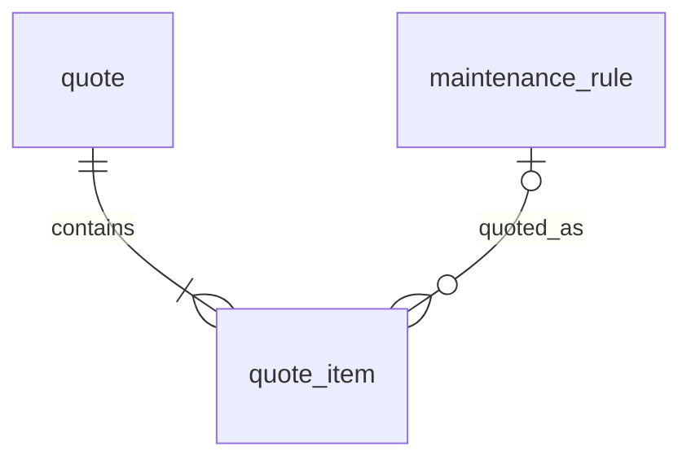

# Entity Specification — `quote_item` (Chi tiết báo giá)

> **Domain:** Maintenance · **Tổng quan lược đồ:** [core.entity.md](../core.entity.md)
>
> **Nguồn:** entity `quote_items` (ENT-011) trong bản ERD sinh tự động ([archive/core.entity.generated.md](../archive/core.entity.generated.md)), đã **chỉnh theo quy ước core v1.1**. Thay đổi: xem §21.

## 1. Entity Information

| Field | Value |
| --- | --- |
| Entity ID | `ENT-411` |
| Entity Name | `QuoteItem` |
| Business Name | Chi tiết báo giá |
| Table | `quote_item` |
| Domain | Maintenance |
| Version | `v1.1` |
| Status | `Draft` |
| Owner | Backend Team |
| Created Date | `2026-09-27` |
| Updated Date | `2026-09-27` |

---

# 2. Entity Overview

## 2.1 Description

Một dòng hạng mục trong báo giá: giá AI ước tính và giá chủ xưởng xác nhận.

## 2.2 Business Purpose

Cho phép duyệt/điều chỉnh giá từng hạng mục (HITL) và truy ngược về hạng mục chuẩn.

## 2.3 Scope

**In Scope:** quote cha, hạng mục chuẩn (nếu có), tên hạng mục, giá ước tính, giá duyệt, ghi chú.

**Out of Scope:** tổng tiền và trạng thái — `quote`.

---

# 3. Business Meaning

**Example:** "Thay lọc gió điều hoà" — ước tính 450.000, duyệt 400.000, ghi chú "Khách mang phụ tùng".

---

# 4. Identity & Keys

| Field | Type | Description |
| --- | --- | --- |
| `id` | `uuid` | PK |

---

# 5. Attributes

| Tên trường (Field) | Kiểu dữ liệu (Data Type) | Required | Nullable | Default | Ràng buộc (Constraints) | Mô tả (Description) |
| --- | --- | ---: | ---: | --- | --- | --- |
| `id` | `uuid` | Yes | No | `uuid4` | PK | ID dòng báo giá |
| `quote_id` | `uuid` | Yes | No | - | FK → `quote.id` `ON DELETE CASCADE` | Báo giá cha |
| `maintenance_rule_id` | `uuid` | No | Yes | - | FK → `maintenance_rule.id` `ON DELETE SET NULL` | Hạng mục chuẩn; `NULL` = hạng mục phát sinh ngoài định mức |
| `item_code` | `varchar(50)` | No | Yes | - | | Mã hạng mục (snapshot `maintenance_rule.item_code` / `service_price.item_code`); `NULL` = hạng mục phát sinh chưa có mã |
| `item_name` | `varchar(200)` | Yes | No | - | | Tên hạng mục (snapshot tại thời điểm báo giá) |
| `estimated_price` | `numeric(12,2)` | Yes | No | - | `>= 0` | Giá ước tính |
| `approved_price` | `numeric(12,2)` | No | Yes | - | `>= 0` | Giá chủ xưởng xác nhận |
| `note` | `text` | No | Yes | - | | Ghi chú |
| `created_at` | `timestamptz` | Yes | No | `now()` | | |
| `updated_at` | `timestamptz` | Yes | No | `now()` | | |

---

# 6. Attribute Details

## `maintenance_rule_id`

Trỏ tới đúng dòng hạng mục tại mốc được báo giá (mỗi dòng rule là một hạng mục cụ thể).

## `item_code`, `item_name`

Lưu snapshot để báo giá không đổi khi `maintenance_rule` / `service_price` thay đổi sau này. Khi có `maintenance_rule_id` thì `item_code` phải bằng `maintenance_rule.item_code` tại thời điểm tạo.

---

# 7. Relationships

| Related Entity | Relationship | Cardinality | Description |
| --- | --- | --- | --- |
| [`quote`](./quote.entity.md) | belongs to | N:1 | Báo giá cha |
| [`maintenance_rule`](./maintenance_rule.entity.md) | refers to | N:0..1 | Hạng mục chuẩn |

---

# 8. Entity Lifecycle / State

Không có trạng thái riêng; theo trạng thái `quote`.

---

# 9. Business Rules & Constraints

## BR-ENT-417 — Chỉ sửa khi quote chưa chốt

**Rule:** Thêm/sửa/xoá dòng khi `quote.status = draft`; `approved_price` chỉ ghi khi `quote.status = pending_approval` bởi người duyệt.

## BR-ENT-418 — Hạng mục chuẩn đúng model

**Rule:** Nếu có `maintenance_rule_id` thì `maintenance_rule.model_id` phải khớp model của xe (`user_vehicle.external_model_id`).

---

# 10. Data Integrity

* `CHECK (estimated_price >= 0)`, `CHECK (approved_price IS NULL OR approved_price >= 0)`.

---

# 11. Index & Query Requirements

| Query | Fields | Frequency | Required Index |
| --- | --- | --- | --- |
| Dòng của một báo giá | `quote_id` | Cao | Yes |

---

# 12. Ownership & Authorization

Theo `quote` cha.

---

# 21. Open Questions

**Thay đổi so với bản sinh tự động (`quote_items`):** đổi tên bảng số ít; thêm `maintenance_rule_id`; `item_code` giữ làm snapshot, cho phép `NULL` với hạng mục phát sinh; thêm `updated_at` (dòng được sửa `approved_price` khi duyệt); `created_at` NOT NULL; `TIMESTAMP` → `timestamptz`.

---

# 22. Change Log

| Version | Date | Author | Changes |
| --- | --- | --- | --- |
| `v1.0` | `2026-09-27` | Team 4 Người | Tạo mới từ bản ERD sinh tự động, chỉnh theo quy ước core v1.1 |
| `v1.1` | `2026-09-27` | Team 4 Người | Thêm `item_code` snapshot (Q-402) |
