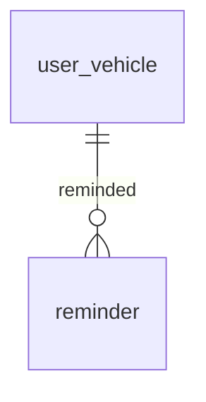

# Entity Specification — `reminder` (Lịch nhắc nhở AI)

> **Cập nhật phạm vi (02/10/2026):** các phần dưới đây trong tài liệu này không còn áp dụng.
>
> - Kết nối Discord (`user_discord_link`, ENT-417): **đã bỏ**. Nhắc bảo dưỡng, nhắc lịch hẹn và hỏi thăm hiện trong mục **Thông báo** của app; danh sách kênh ngoài (Zalo / Telegram / SMS / Email) vẫn có nhưng đều "Sắp có", bật nhắc không bắt buộc chọn kênh.

> **Domain:** Maintenance · **Tổng quan lược đồ:** [core.entity.md](../core.entity.md)
>
> **Nguồn sự thật:** `core.entity.md` v1.1 §14.2 bảng 8. Cấu trúc bảng **giữ nguyên**.

## 1. Entity Information

| Field | Value |
| --- | --- |
| Entity ID | `ENT-405` |
| Entity Name | `Reminder` |
| Business Name | Lịch nhắc nhở bảo dưỡng |
| Table | `reminder` |
| Domain | Maintenance |
| Version | `v1.1` |
| Status | `Draft` |
| Owner | Backend Team |
| Created Date | `2026-09-27` |
| Updated Date | `2026-09-27` |

---

# 2. Entity Overview

## 2.1 Description

Quản lý các thông báo/nhắc nhở bảo dưỡng tự động cho chủ xe — **trước** dịch vụ.

## 2.2 Business Purpose

AI Agent chủ động nhắc chủ xe khi xe sắp/đã đến mốc bảo dưỡng, dẫn tới đặt lịch.

## 2.3 Scope

**In Scope:** mốc km cần nhắc, mức độ khẩn, kênh gửi, số lần hoãn, trạng thái xử lý.

**Out of Scope:** chăm sóc **sau** dịch vụ — `follow_up`.

---

# 3. Business Meaning

Một `reminder` = "Nhắc xe V về mốc `target_odo_milestone` km, gửi qua kênh C vào thời điểm T".

**Example:** VF6, mốc 12.000 km, `warning`, `discord`, gửi 08:00 ngày 01/10/2026.

---

# 4. Identity & Keys

| Field | Type | Description |
| --- | --- | --- |
| `id` | `uuid` | PK |

---

# 5. Attributes

| Tên trường (Field) | Kiểu dữ liệu (Data Type) | Required | Nullable | Default | Ràng buộc (Constraints) | Mô tả (Description) |
| --- | --- | ---: | ---: | --- | --- | --- |
| `id` | `uuid` | Yes | No | `uuid4` | PK | ID nhắc nhở |
| `user_vehicle_id` | `uuid` | Yes | No | - | FK → `user_vehicle.id` `ON DELETE CASCADE` | Xe được nhắc |
| `target_odo_milestone` | `integer` | Yes | No | - | `> 0` | Mốc km cần nhắc (VD: 12000 km) |
| `reminder_level` | `reminder_level_enum` | Yes | No | `early` | `early / warning / urgent / expired` | Mức độ khẩn cấp |
| `channel` | `reminder_channel_enum` | Yes | No | `discord` | `discord / email / sms / telegram / slack` — MVP **chỉ** `discord` (BR-ENT-408) | Kênh gửi |
| `snooze_count` | `integer` | Yes | No | `0` | `>= 0` | Số lần hoãn/nhắc lại sau |
| `is_resolved` | `boolean` | Yes | No | `false` | | Đã xử lý (đặt lịch thành công) hay chưa |
| `scheduled_at` | `timestamptz` | Yes | No | - | | Thời gian dự kiến gửi nhắc nhở |
| `created_at` | `timestamptz` | Yes | No | `now()` | | |
| `updated_at` | `timestamptz` | Yes | No | `now()` | | |

---

# 7. Relationships

| Related Entity | Relationship | Cardinality | Description |
| --- | --- | --- | --- |
| [`user_vehicle`](../vehicle/user_vehicle.entity.md) | for | N:1 | Xe được nhắc |
| [`maintenance_rule`](./maintenance_rule.entity.md) | derived from | logic | `target_odo_milestone` lấy từ `maintenance_rule.odo_milestone` của model xe (không có FK) |

---

# 8. Entity Lifecycle / State

`reminder_level` tăng dần theo khoảng cách tới mốc: `early → warning → urgent → expired`. `is_resolved = true` khi chủ xe đặt lịch thành công cho mốc đó.

---

# 9. Business Rules & Constraints

## BR-ENT-406 — Chỉ nhắc xe hợp lệ

**Rule:** Chỉ tạo reminder cho xe `verified` + `link_status = active` của tài khoản `active`.

## BR-ENT-408 — Kênh gửi: mặc định Discord, cấu hình theo chủ xe

**Rule:** Kênh gửi do chủ xe cấu hình ([ENT-419](../../sprint-2/entity/us-021-sprint-2-spec.entity.md)); **mặc định Discord** khi chưa cấu hình. Kết quả gửi theo từng kênh ở `reminder_delivery` (ENT-420); cột `channel` của `reminder` chỉ giữ để tương thích, luôn `discord`. MVP mới có adapter Discord; `zalo / telegram / sms / email` chưa bật được.

**Expected Behavior:** Bot Discord gửi vào **kênh riêng** của chủ xe (PQ-11) lấy từ [`user_discord_link`](../identity/user_discord_link.entity.md) (ENT-417). Chủ xe chưa kết nối Discord hoặc liên kết `revoked` ⇒ không gửi, ghi nhận "chưa có nơi nhận" (BR-ENT-441). Nội dung không chứa VIN, SĐT, email, CCCD. `email / sms / telegram / slack` có trong enum để chuẩn bị cho tính năng cài đặt kênh (PRD Phụ lục B — NOTI-01), **chưa triển khai**.

**Migration:** `f6c3a8d1b2e4_reminder_channel_discord` (đã có) thêm `discord, email, sms, telegram, slack` vào `reminder_channel_enum`, chuyển dòng cũ sang `discord`, đổi default sang `discord`; model `ReminderChannel` đã cập nhật. Giá trị cũ `in_app / push / sms_zalo` **deprecated** — không ghi mới; PostgreSQL không xoá được giá trị enum nên giữ lại trong type.

## BR-ENT-407 — Đóng nhắc nhở khi đã đặt lịch

**Rule:** Khi có `booking` cho xe ở mốc tương ứng ⇒ `is_resolved = true`, không gửi thêm.

---

# 11. Index & Query Requirements

| Query | Fields | Frequency | Required Index |
| --- | --- | --- | --- |
| Job gửi nhắc nhở đến hạn | `scheduled_at` WHERE `is_resolved = false` | Mỗi phút | Partial |
| Nhắc nhở của một xe | `user_vehicle_id` | Cao | Yes |

---

# 12. Ownership & Authorization

| Actor / Role | Read | Create | Update | Delete |
| --- | ---: | ---: | ---: | ---: |
| Chủ xe | ✅ (xe của mình) | ❌ | ✅ (hoãn) | ❌ |
| Hệ thống / AI Agent | ✅ | ✅ | ✅ | ❌ |

---

# 22. Change Log

| Version | Date | Author | Changes |
| --- | --- | --- | --- |
| `v1.1` | `2026-09-27` | Team 4 Người | Tách từ `core.entity.md` v1.1 §14.2 bảng 8, cấu trúc giữ nguyên |
| `v1.2` | `2026-09-28` | Team 4 Người | `reminder_channel_enum` → `discord / email / sms / telegram / slack`, default `discord`; MVP chỉ Discord (BR-ENT-408, PRD v3.4); `in_app / push / sms_zalo` deprecated |
| `v1.3` | `2026-09-28` | Team 4 Người | BR-ENT-408: kênh theo cấu hình, mặc định Discord; unique (xe, mốc, mức); delivery theo kênh — xem [us-021 entity](../../sprint-2/entity/us-021-sprint-2-spec.entity.md) |
