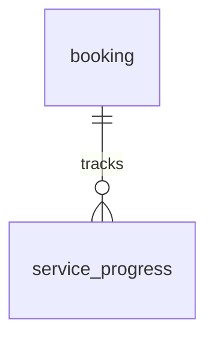
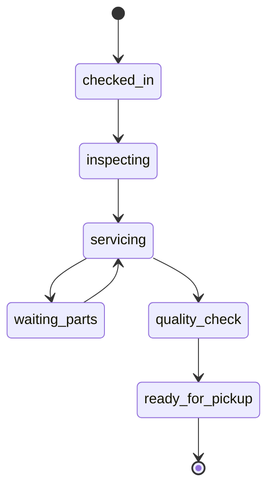

# Entity Specification — `service_progress` (Tiến độ dịch vụ tại xưởng)

> **Domain:** Maintenance · **Tổng quan lược đồ:** [core.entity.md](../core.entity.md)
>
> **Nguồn sự thật:** `core.entity.md` v1.1 §14.2 bảng 6. Cấu trúc bảng **giữ nguyên**.

## 1. Entity Information

| Field | Value |
| --- | --- |
| Entity ID | `ENT-403` |
| Entity Name | `ServiceProgress` |
| Business Name | Tiến độ dịch vụ tại xưởng |
| Table | `service_progress` |
| Domain | Maintenance |
| Version | `v1.1` |
| Status | `Draft` |
| Owner | Backend Team |
| Created Date | `2026-09-27` |
| Updated Date | `2026-09-27` |

---

# 2. Entity Overview

## 2.1 Description

Theo dõi trạng thái sửa chữa/bảo dưỡng xe theo thời gian thực khi xe đang ở xưởng. **Append-only**: mỗi lần cập nhật là một dòng mới.

## 2.2 Business Purpose

Cho chủ xe xem xe đang ở bước nào; lưu vết các mốc tại xưởng.

## 2.3 Scope

**In Scope:** mốc tiến độ, ghi chú, người cập nhật, thời điểm.

**Out of Scope:** trạng thái tổng của lịch hẹn — `booking.status`.

---

# 3. Business Meaning

Một dòng = "Tại thời điểm T, xe của booking B chuyển sang mốc S".

**Example:** booking `BK-20261003-0012`, `waiting_parts`, "Chờ má phanh trước, dự kiến 2 ngày".

---

# 4. Identity & Keys

| Field | Type | Description |
| --- | --- | --- |
| `id` | `uuid` | PK |

---

# 5. Attributes

| Tên trường (Field) | Kiểu dữ liệu (Data Type) | Required | Nullable | Default | Ràng buộc (Constraints) | Mô tả (Description) |
| --- | --- | ---: | ---: | --- | --- | --- |
| `id` | `uuid` | Yes | No | `uuid4` | PK | ID bản ghi tiến độ |
| `booking_id` | `uuid` | Yes | No | - | FK → `booking.id` `ON DELETE CASCADE` | Lịch hẹn tương ứng |
| `stage` | `service_stage_enum` | Yes | No | - | `checked_in / inspecting / servicing / waiting_parts / quality_check / ready_for_pickup` | Mốc trạng thái |
| `note` | `text` | No | Yes | - | | Ghi chú từ KTV/Cố vấn dịch vụ (VD: phát sinh thêm hạng mục) |
| `updated_by` | `integer` | No | Yes | - | | ID Cố vấn dịch vụ / KTV cập nhật |
| `created_at` | `timestamptz` | Yes | No | `now()` | | Thời gian cập nhật trạng thái |

---

# 7. Relationships

| Related Entity | Relationship | Cardinality | Description |
| --- | --- | --- | --- |
| [`booking`](./booking.entity.md) | belongs to | N:1 | Lịch hẹn |

---

# 8. Entity Lifecycle / State

Bản ghi không đổi trạng thái (append-only). Thứ tự mốc tham khảo:

---

# 9. Business Rules & Constraints

## BR-ENT-405 — Append-only, gắn với booking đang ở xưởng

**Rule:** Chỉ thêm dòng khi `booking.status IN ('checked_in', 'in_progress')`; không sửa/xoá dòng đã ghi.

---

# 11. Index & Query Requirements

| Query | Fields | Frequency | Required Index |
| --- | --- | --- | --- |
| Tiến độ của một booking | `booking_id`, `created_at` | Cao | Yes |

---

# 12. Ownership & Authorization

| Actor / Role | Read | Create | Update | Delete |
| --- | ---: | ---: | ---: | ---: |
| Chủ xe | ✅ (booking của mình) | ❌ | ❌ | ❌ |
| Chủ xưởng | ✅ (xưởng mình) | ✅ | ❌ | ❌ |

---

# 21. Open Questions

| ID | Question | Owner | Status |
| --- | --- | --- | --- |
| Q-403 | `updated_by` là `integer` (core v1.1) trong khi tài khoản xưởng `workshop_owner.id` là `uuid` (ENT-007). Có đổi kiểu và thêm FK không? | Backend Team | **Resolved** — Giữ nguyên `integer`, không FK |

---

# 22. Change Log

| Version | Date | Author | Changes |
| --- | --- | --- | --- |
| `v1.1` | `2026-09-27` | Team 4 Người | Tách từ `core.entity.md` v1.1 §14.2 bảng 6, cấu trúc giữ nguyên |
