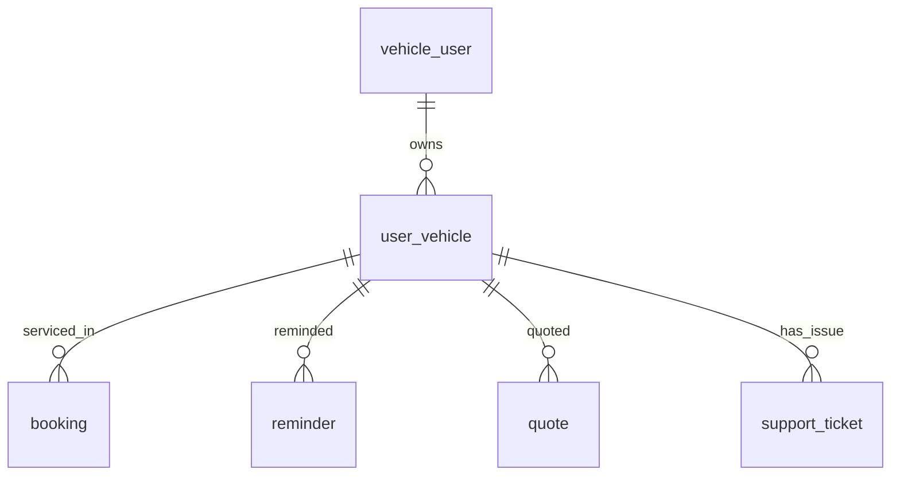

# Entity Specification — `user_vehicle` (Hồ sơ xe - Car Profile)

> **Domain:** Vehicle · **Tổng quan lược đồ:** [core.entity.md](../core.entity.md)
>
> **Nguồn sự thật:** [ENT-003 — us-001-sprint-1-spec.entity.md](../../sprint-1/entity/us-001-sprint-1-spec.entity.md#ent-003--uservehicle). Tài liệu này **không thay đổi** định nghĩa của sprint-1; khi có mâu thuẫn, sprint-1 là chuẩn.

## 1. Entity Information

| Field | Value |
| --- | --- |
| Entity ID | `ENT-003` |
| Entity Name | `UserVehicle` |
| Business Name | Hồ sơ xe |
| Table | `user_vehicle` |
| Domain | Vehicle |
| Version | `v1.1` (giữ nguyên theo core v1.1) |
| Status | `Review` |
| Owner | Backend Team |
| Created Date | `2026-09-27` |
| Updated Date | `2026-09-27` |

---

# 2. Entity Overview

## 2.1 Description

Các xe của tài khoản + snapshot kỹ thuật lấy từ hãng sau khi xác thực. Một tài khoản có thể có nhiều xe, mọi xe phải thuộc cùng một chủ xe bên hãng (D-06).

## 2.2 Business Purpose

Là đối tượng trung tâm của chăm sóc sau bán: nhắc nhở (`reminder`), báo giá (`quote`), lịch hẹn (`booking`), phiếu hỗ trợ (`support_ticket`) đều gắn với một `user_vehicle`.

## 2.3 Scope

**In Scope**

* Thông tin user khai báo (VIN, biển số, model), kết quả xác thực với hãng, snapshot kỹ thuật từ hãng, trạng thái liên kết.

**Out of Scope** (khác bản v1.0 — **không lưu** trên `user_vehicle`)

* ODO hiện tại → đồng bộ từ `VehicleUsage.current_km` của hãng vào `vehicle_odometer_reading` (ENT-414, [us-017](../../sprint-2/entity/us-017-sprint-2-spec.entity.md)). Chủ xe không nhập ODO.
* Ngày / ODO bảo dưỡng gần nhất → đồng bộ từ `ServiceHistory` của hãng vào `vehicle_service_record` (ENT-415).
* Hạn bảo hành → lưu theo từng component ở `vehicle_warranty` (ENT-004).

---

# 3. Business Meaning

## Definition

Một bản ghi `user_vehicle` ⇔ một lần chủ xe liên kết một VIN vào tài khoản của mình.

## Example

Xe VF6 Plus, VIN `LVVDB11B1PE000001`, biển `30A12345`, `verification_status = verified`, `link_status = active`.

---

# 4. Identity & Keys

## 4.1 Primary Key

| Field | Type | Description |
| --- | --- | --- |
| `id` | `uuid` | Sinh ở app bằng `uuid4` |

## 4.2 Candidate / Unique Keys

| Field / Composite | Unique | Description |
| --- | ---: | --- |
| `vin` WHERE liên kết Active | Yes | `ux_user_vehicle_vin_active` — BR-ENT-020 |
| `license_plate` | No | Chuẩn hoá và đối chiếu với hãng, không unique toàn cục (BR-002) |

---

# 5. Attributes

| Tên trường (Field) | Kiểu dữ liệu (Data Type) | Required | Nullable | Default | Ràng buộc (Constraints) | Mô tả (Description) |
| --- | --- | ---: | ---: | --- | --- | --- |
| `id` | `uuid` | Yes | No | `uuid4` | PK | ID xe trong app |
| `user_id` | `integer` | Yes | No | - | FK → `vehicle_user.user_id` `ON DELETE CASCADE` | Chủ tài khoản |
| `vin` | `varchar(17)` | Yes | No | - | `^[A-Z0-9]{17}$`, uppercase | Số VIN (user nhập) |
| `license_plate` | `varchar(20)` | Yes | No | - | Đã chuẩn hoá (`29A-444.44` → `29A44444`) | Biển số xe |
| `declared_model_id` | `varchar(64)` | Yes | No | - | Mã từ `GET /models` của hãng; phải khớp hãng (D-02) | Model user chọn |
| `declared_manufacture_year` | `smallint` | No | Yes | - | `2015..năm hiện tại + 1` | Năm SX user nhập — chỉ tham khảo |
| `external_vehicle_id` | `varchar(64)` | No | Yes | - | Set khi verified | `vehicle_id` bên hãng |
| `external_owner_id` | `varchar(64)` | No | Yes | - | Set khi verified; phải = `vehicle_user.external_owner_id` | `owner_id` bên hãng tại thời điểm xác thực |
| `external_model_id` | `varchar(64)` | No | Yes | - | Set khi verified | `model_id` bên hãng |
| `model_name` | `varchar(100)` | No | Yes | - | Từ hãng | VF3, VF5, VF6, VF7, VF8, VF9 |
| `trim` | `varchar(50)` | No | Yes | - | Từ hãng | Phiên bản xe (Eco / Plus / Premium) |
| `color` | `varchar(50)` | No | Yes | - | Từ hãng | Màu xe |
| `manufacture_date` | `date` | No | Yes | - | Từ hãng | Ngày xuất xưởng |
| `production_year` | `smallint` | No | Yes | - | Từ hãng | Năm sản xuất |
| `battery_capacity_kwh` | `numeric(6,2)` | No | Yes | - | Từ hãng | Dung lượng pin |
| `motor_power_kw` | `numeric(7,2)` | No | Yes | - | Từ hãng | Công suất động cơ |
| `verification_status` | `vehicle_verification_status_enum` | Yes | No | `pending` | `pending / verified / failed` | Trạng thái xác thực xe |
| `verification_failure_reason` | `varchar(64)` | No | Yes | - | Xem ENT-005 §6 | Lý do thất bại gần nhất |
| `verified_at` | `timestamptz` | No | Yes | - | | Thời điểm hãng xác thực |
| `link_status` | `vehicle_link_status_enum` | Yes | No | `active` | `active / unlinked` | Liên kết còn hiệu lực |
| `oem_synced_at` | `timestamptz` | No | Yes | - | | Lần đồng bộ dữ liệu hãng gần nhất |
| `created_at` | `timestamptz` | Yes | No | `now()` | | Thời điểm tạo hồ sơ xe |
| `updated_at` | `timestamptz` | Yes | No | `now()` | | Thời điểm cập nhật gần nhất |

---

# 6. Attribute Details

Xem [ENT-003 §6](../../sprint-1/entity/us-001-sprint-1-spec.entity.md#ent-003--uservehicle).

---

# 7. Relationships

## 7.1 Relationship Overview

## 7.2 Relationship Details

| Related Entity | Relationship | Cardinality | Description |
| --- | --- | --- | --- |
| [`vehicle_user`](../identity/vehicle_user.entity.md) | belongs to | N:1 | Chủ tài khoản |
| [`booking`](../maintenance/booking.entity.md) | serviced in | 1:N | Lịch hẹn bảo dưỡng của xe |
| [`reminder`](../maintenance/reminder.entity.md) | reminded | 1:N | Nhắc nhở bảo dưỡng |
| [`quote`](../maintenance/quote.entity.md) | quoted | 1:N | Báo giá cho xe (FK nằm ở `quote`) |
| [`support_ticket`](../crm/support_ticket.entity.md) | has issue | 1:N | Phiếu hỗ trợ sau dịch vụ (FK nằm ở `support_ticket`) |
| `vehicle_warranty`, `vehicle_verification_attempt` | sprint-1 | 1:N | Xem [us-001](../../sprint-1/entity/us-001-sprint-1-spec.entity.md) |
| Hãng: `Vehicle` | maps to | N:1 | Qua `external_vehicle_id` |

### Relationship Rules

* Chỉ xe `verification_status = verified` **và** `link_status = active` mới được tạo `reminder`, `quote`, `booking`.

---

# 8. Entity Lifecycle / State

Xem [ENT-003 §8](../../sprint-1/entity/us-001-sprint-1-spec.entity.md#ent-003--uservehicle) — `verification_status` (`pending → verified | failed`) và `link_status` (`active → unlinked`).

---

# 9. Business Rules & Constraints

* **BR-002** (core, BR-ENT-020) — Một VIN chỉ được liên kết với **một** tài khoản đang Active (`link_status = active`). `license_plate` được chuẩn hoá và đối chiếu với hãng, không đặt unique toàn cục.
* D-02 — Model khai báo khác model của hãng ⇒ xác thực thất bại (`model_mismatch`).
* D-06 — Mọi xe của một tài khoản phải thuộc cùng một chủ xe bên hãng.

---

# 10. Data Integrity

Theo ENT-003 §10:

* `CHECK (verification_status <> 'verified' OR (external_vehicle_id IS NOT NULL AND external_owner_id IS NOT NULL AND verified_at IS NOT NULL))`
* Unique partial `ux_user_vehicle_vin_active` trên `vin` với điều kiện liên kết Active (BR-ENT-020).

---

# 11–16. Index, Authorization, Audit, Data Source, Security, Retention

Không định nghĩa lại — xem ENT-003 §11–§16. Tóm tắt:

* Chủ xe chỉ đọc/ghi xe của chính mình (`user_id` lấy từ token, không nhận từ client).
* Gỡ liên kết bằng `link_status = unlinked`, không xoá bản ghi; hard delete chỉ khi huỷ onboarding (cascade từ `vehicle_user`).

---

# 19. Related Entities

| Entity | Relationship | Reference |
| --- | --- | --- |
| `vehicle_user` | belongs to | [vehicle_user.entity.md](../identity/vehicle_user.entity.md) |
| `booking` | serviced in | [booking.entity.md](../maintenance/booking.entity.md) |
| `reminder` | reminded | [reminder.entity.md](../maintenance/reminder.entity.md) |
| `quote` | quoted | [quote.entity.md](../maintenance/quote.entity.md) |
| `support_ticket` | has issue | [support_ticket.entity.md](../crm/support_ticket.entity.md) |

---

# 22. Change Log

| Version | Date | Author | Changes |
| --- | --- | --- | --- |
| `v1.1` | `2026-09-27` | Team 4 Người | Tách từ `core.entity.md` v1.1 §14.2 bảng 2, nội dung giữ nguyên; bổ sung quan hệ tới `quote`, `support_ticket` (FK nằm ở bảng mới) |
