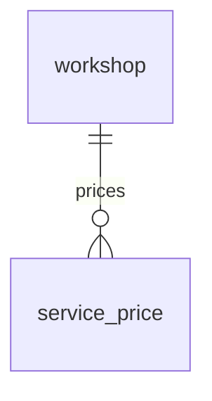

# Entity Specification — `service_price` (Bảng giá dịch vụ của xưởng)

> **Domain:** Workshop · **Tổng quan lược đồ:** [core.entity.md](../core.entity.md)
>
> **Nguồn:** entity `service_prices` (ENT-009) trong bản ERD sinh tự động ([archive/core.entity.generated.md](../archive/core.entity.generated.md)), đã **chỉnh theo quy ước core v1.1** và bảng `workshop` đã có. Thay đổi: xem §21.

## 1. Entity Information

| Field | Value |
| --- | --- |
| Entity ID | `ENT-409` |
| Entity Name | `ServicePrice` |
| Business Name | Bảng giá dịch vụ |
| Table | `service_price` |
| Domain | Workshop |
| Version | `v1.1` |
| Status | `Draft` |
| Owner | Backend Team |
| Created Date | `2026-09-27` |
| Updated Date | `2026-09-27` |

---

# 2. Entity Overview

## 2.1 Description

Giá một hạng mục dịch vụ tại một xưởng, theo model xe, có thời hạn hiệu lực.

## 2.2 Business Purpose

Nguồn giá cho Cost Estimate Tool của AI Agent khi lập `quote`.

## 2.3 Scope

**In Scope:** xưởng, model, tên hạng mục, giá, thời gian hiệu lực.

**Out of Scope:** báo giá cụ thể cho một xe — `quote` / `quote_item`.

---

# 3. Business Meaning

**Definition:** Một dòng = "Tại xưởng W, hạng mục I cho model M có giá P trong khoảng [`valid_from`, `valid_to`]".

**Example:** VinFast Cầu Giấy, VF6, "Kiểm tra hệ thống phanh", 320.000 VNĐ, từ 01/09/2026.

---

# 4. Identity & Keys

| Field / Composite | Unique | Description |
| --- | ---: | --- |
| `id` (`uuid`) | Yes | PK |
| `workshop_id`, `model_id`, `item_code`, khoảng hiệu lực | Không chồng lấn | BR-ENT-412 |

---

# 5. Attributes

| Tên trường (Field) | Kiểu dữ liệu (Data Type) | Required | Nullable | Default | Ràng buộc (Constraints) | Mô tả (Description) |
| --- | --- | ---: | ---: | --- | --- | --- |
| `id` | `uuid` | Yes | No | `uuid4` | PK | ID dòng giá |
| `workshop_id` | `uuid` | Yes | No | - | FK → `workshop.id` `ON DELETE CASCADE` | Xưởng áp dụng |
| `model_id` | `varchar(64)` | Yes | No | - | Mã model của hãng | Model áp dụng (cùng miền với `maintenance_rule.model_id`) |
| `item_code` | `varchar(50)` | Yes | No | - | Khớp `maintenance_rule.item_code` của cùng `model_id` nếu là hạng mục chuẩn | Mã hạng mục |
| `item_name` | `varchar(200)` | Yes | No | - | | Tên hạng mục hiển thị |
| `price` | `numeric(12,2)` | Yes | No | - | `>= 0` | Giá (VNĐ) |
| `valid_from` | `date` | No | Yes | - | | Ngày bắt đầu hiệu lực; `NULL` = không giới hạn đầu |
| `valid_to` | `date` | No | Yes | - | `>= valid_from` | Ngày kết thúc hiệu lực; `NULL` = đang hiệu lực |
| `created_at` | `timestamptz` | Yes | No | `now()` | | |
| `updated_at` | `timestamptz` | Yes | No | `now()` | | |

---

# 6. Attribute Details

## `model_id`

Thay cho `vehicle_model varchar(50)` để dùng cùng mã model của hãng như `maintenance_rule`, `user_vehicle`.

## `item_code`

Khoá ghép giá với hạng mục chuẩn: (`model_id`, `item_code`) ↔ `maintenance_rule` (Q-402 — `maintenance_rule.item_code` bổ sung ở v1.2). Hạng mục ngoài định mức vẫn được có giá, khi đó `item_code` không có trong `maintenance_rule`.

---

# 7. Relationships

| Related Entity | Relationship | Cardinality | Description |
| --- | --- | --- | --- |
| [`workshop`](./workshop.entity.md) | belongs to | N:1 | Xưởng |
| [`maintenance_rule`](../maintenance/maintenance_rule.entity.md) | matches | logic | Ghép theo (`model_id`, `item_code`), không có FK (một `item_code` ứng với nhiều dòng rule ở các mốc khác nhau) |

---

# 8. Entity Lifecycle / State

Không có status; hiệu lực xác định bằng `valid_from` / `valid_to`.

---

# 9. Business Rules & Constraints

## BR-ENT-411 — Thứ tự ưu tiên giá khi lập báo giá

**Rule:** Với mỗi hạng mục (`model_id`, `item_code`): dùng `service_price.price` đang hiệu lực của xưởng; nếu không có ⇒ dùng `maintenance_rule.estimated_cost`.

## BR-ENT-412 — Không chồng lấn hiệu lực

**Rule:** Với cùng (`workshop_id`, `model_id`, `item_code`), các khoảng [`valid_from`, `valid_to`] không được chồng lấn. Kiểm tra ở service (hoặc exclusion constraint — technical design).

---

# 10. Data Integrity

* `CHECK (price >= 0)`.
* `CHECK (valid_to IS NULL OR valid_from IS NULL OR valid_to >= valid_from)`.

---

# 11. Index & Query Requirements

| Query | Fields | Frequency | Required Index |
| --- | --- | --- | --- |
| Giá hiện hành của xưởng theo model / hạng mục | `workshop_id`, `model_id`, `item_code` | Cao | Yes |

---

# 12. Ownership & Authorization

| Actor / Role | Read | Create | Update | Delete |
| --- | ---: | ---: | ---: | ---: |
| Chủ xe | ✅ | ❌ | ❌ | ❌ |
| Chủ xưởng | ✅ | ✅ (xưởng mình) | ✅ (xưởng mình) | ❌ (đóng bằng `valid_to`) |
| AI Agent | ✅ | ❌ | ❌ | ❌ |

---

# 21. Open Questions

**Thay đổi so với bản sinh tự động (`service_prices`):** đổi tên bảng số ít; `service_center_id` → `workshop_id`; `vehicle_model` → `model_id varchar(64)`; giữ `item_code` làm khoá ghép với `maintenance_rule.item_code` (Q-402); `DECIMAL` → `numeric`; `TIMESTAMP` → `timestamptz`; `updated_at` NOT NULL; thêm CHECK hiệu lực.

---

# 22. Change Log

| Version | Date | Author | Changes |
| --- | --- | --- | --- |
| `v1.0` | `2026-09-27` | Team 4 Người | Tạo mới từ bản ERD sinh tự động, chỉnh theo quy ước core v1.1 |
| `v1.1` | `2026-09-27` | Team 4 Người | Thêm `item_code`, ghép giá theo (`model_id`, `item_code`) thay cho `item_name` (Q-402) |
