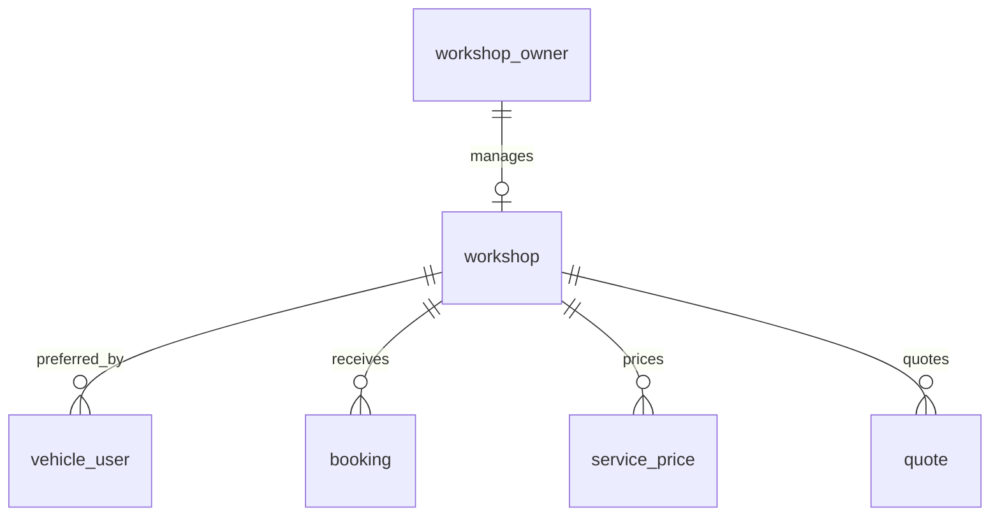
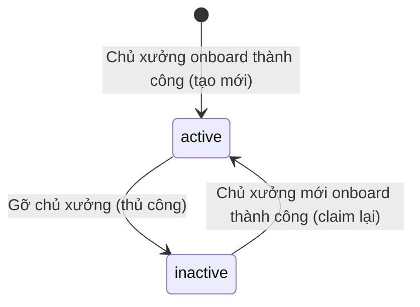

# Entity Specification — `workshop` (Xưởng dịch vụ)

> **Domain:** Workshop · **Tổng quan lược đồ:** [core.entity.md](../core.entity.md)
>
> **Nguồn sự thật:** cột core theo `core.entity.md` v1.1 §14.2 bảng 3 (căn theo `ServiceCenter` — [proposed_erd.latest.md §3.8](../../mock-system/proposed_erd.latest.md)); cột bổ sung và CHECK theo [ENT-008 — us-009-sprint-1-spec.entity.md](../../sprint-1/entity/us-009-sprint-1-spec.entity.md#ent-008--workshop-core--mở-rộng). Tài liệu này **không thay đổi** hai nguồn trên.

## 1. Entity Information

| Field | Value |
| --- | --- |
| Entity ID | `ENT-008` |
| Entity Name | `Workshop` |
| Business Name | Xưởng dịch vụ |
| Table | `workshop` |
| Domain | Workshop |
| Version | `v1.1` (core v1.1 + ENT-008 v1.1) |
| Status | `Review` |
| Owner | Backend Team |
| Created Date | `2026-09-27` |
| Updated Date | `2026-09-27` |

---

# 2. Entity Overview

## 2.1 Description

Xưởng dịch vụ trong app, tương ứng 1–1 với `ServiceCenter` của hãng. Các field `name`, `region`, `type` lấy từ hãng; các field vận hành (`address`, công suất, trạng thái) do app quản lý. ENT-008 bổ sung liên kết chủ xưởng, hotline, toạ độ.

## 2.2 Business Purpose

Nơi chủ xe đặt lịch (`booking`), xưởng ưu tiên của chủ xe, đơn vị công bố bảng giá (`service_price`) và duyệt báo giá (`quote`).

## 2.3 Scope

**In Scope**

* Thông tin xưởng từ hãng, thông tin vận hành, công suất, chủ xưởng.

**Out of Scope**

* Giờ hoạt động — `workshop_operating_hour` (ENT-009).
* Bản nháp đăng ký — `workshop_registration` (ENT-010).
* Ca làm việc từng kỹ thuật viên.

---

# 3. Business Meaning

## Definition

Một bản ghi `workshop` tồn tại ⇔ xưởng đã được một chủ xưởng onboard thành công. Xưởng hiển thị cho chủ xe khi `status = active`; `active` luôn đi kèm có chủ (W-09).

## Example

VinFast Cầu Giấy, `region = Hà Nội`, `type = dealer`, 8 kỹ thuật viên, 1 slot khẩn cấp.

---

# 4. Identity & Keys

| Field / Composite | Unique | Description |
| --- | ---: | --- |
| `id` (`uuid`) | Yes | PK |
| `external_center_id` | Yes | Một xưởng hãng ↔ một bản ghi (`BR-202`) |
| `owner_id` WHERE `owner_id IS NOT NULL` | Yes | `ux_workshop_owner`: một chủ một xưởng (W-05) |

---

# 5. Attributes

**Cột core** (core v1.1):

| Tên trường (Field) | Kiểu dữ liệu (Data Type) | Required | Nullable | Default | Ràng buộc (Constraints) | Mô tả (Description) |
| --- | --- | ---: | ---: | --- | --- | --- |
| `id` | `uuid` | Yes | No | `uuid4` | PK | ID xưởng trong app |
| `external_center_id` | `varchar(64)` | Yes | No | - | Unique | `center_id` của `ServiceCenter` bên hãng |
| `name` | `varchar(150)` | Yes | No | - | | Tên xưởng dịch vụ (VD: VinFast Cầu Giấy) — từ hãng |
| `region` | `varchar(50)` | Yes | No | - | Khớp `user_location.province` | Khu vực/Thành phố (VD: Hà Nội) — từ hãng |
| `type` | `service_center_type_enum` | Yes | No | - | `dealer / service_only` | Loại xưởng — từ hãng |
| `address` | `text` | Yes | No | - | | Địa chỉ xưởng dịch vụ |
| `total_technicians` | `integer` | Yes | No | - | `> 0` | Số lượng kỹ thuật viên khả dụng/ca |
| `emergency_slots_reserved` | `integer` | Yes | No | `0` | `>= 0`, `<= total_technicians` (W-08) | Số slot dự phòng cho trường hợp khẩn cấp |
| `status` | `workshop_status_enum` | Yes | No | `active` | `active / inactive` | Trạng thái xưởng |
| `created_at` | `timestamptz` | Yes | No | `now()` | | |
| `updated_at` | `timestamptz` | Yes | No | `now()` | | |

**Cột bổ sung** (ENT-008):

| Field | Type | Required | Nullable | Default | Constraints | Description |
| --- | --- | ---: | ---: | --- | --- | --- |
| `owner_id` | `uuid` | No | Yes | - | FK → `workshop_owner.id` `ON DELETE SET NULL`; partial unique | Chủ xưởng quản lý |
| `hotline` | `varchar(20)` | No | Yes | - | Đã chuẩn hoá | SĐT xưởng cho chủ xe |
| `latitude` | `numeric(9,6)` | No | Yes | - | `-90..90` | Vĩ độ |
| `longitude` | `numeric(9,6)` | No | Yes | - | `-180..180` | Kinh độ |
| `onboarded_at` | `timestamptz` | No | Yes | - | | Thời điểm gắn chủ xưởng gần nhất |
| `oem_synced_at` | `timestamptz` | No | Yes | - | | Lần lấy `name/region/type` từ hãng (chỉ lúc onboarding — W-10) |

---

# 6. Attribute Details

* `owner_id`, `region` vs `address`: xem ENT-008 §6.
* `total_technicians`, `emergency_slots_reserved`: dùng kiểm tra slot khi đặt lịch (EDGE-002).

---

# 7. Relationships

## 7.1 Relationship Overview

## 7.2 Relationship Details

| Related Entity | Relationship | Cardinality | Description |
| --- | --- | --- | --- |
| `workshop_owner` (ENT-007) | managed by | 1:0..1 | Chủ xưởng |
| `workshop_operating_hour` (ENT-009) | has | 1:7 | Giờ hoạt động |
| `workshop_registration` (ENT-010) | materialized from | 1:N | Bản nháp đăng ký |
| [`vehicle_user`](../identity/vehicle_user.entity.md) | preferred by | 1:N | `preferred_workshop_id` |
| [`booking`](../maintenance/booking.entity.md) | receives | 1:N | Lịch hẹn tại xưởng |
| [`service_price`](./service_price.entity.md) | prices | 1:N | Bảng giá của xưởng (FK nằm ở `service_price`) |
| [`quote`](../maintenance/quote.entity.md) | quotes | 1:N | Báo giá do xưởng duyệt (FK nằm ở `quote`) |
| Hãng: `ServiceCenter` | maps to | 1:1 | Qua `external_center_id` |

---

# 8. Entity Lifecycle / State

---

# 9. Business Rules & Constraints

* **BR-ENT-210 … BR-ENT-213** — xem ENT-008 §9 (claim, đồng bộ từ hãng, slot khẩn cấp, `active` ⇒ có chủ).
* Chỉ xưởng `status = active` được chọn khi đặt lịch mới và được công bố bảng giá.

---

# 10. Data Integrity

* `CHECK (total_technicians > 0)`, `CHECK (emergency_slots_reserved >= 0)` (core).
* `CHECK (emergency_slots_reserved <= total_technicians)` (W-08).
* `CHECK (status <> 'active' OR owner_id IS NOT NULL)` (W-09).
* `CHECK (owner_id IS NULL OR (hotline IS NOT NULL AND onboarded_at IS NOT NULL))`.
* `CHECK ((latitude IS NULL) = (longitude IS NULL))`.

---

# 11–16. Index, Authorization, Audit, Data Source, Security, Retention

Không định nghĩa lại — xem ENT-008 §11–§16.

---

# 19. Related Entities

| Entity | Relationship | Reference |
| --- | --- | --- |
| `booking` | receives | [booking.entity.md](../maintenance/booking.entity.md) |
| `service_price` | prices | [service_price.entity.md](./service_price.entity.md) |
| `quote` | quotes | [quote.entity.md](../maintenance/quote.entity.md) |
| `workshop_owner` | managed by | [ENT-007](../../sprint-1/entity/us-009-sprint-1-spec.entity.md#ent-007--workshopowner) |

---

# 22. Change Log

| Version | Date | Author | Changes |
| --- | --- | --- | --- |
| `v1.1` | `2026-09-27` | Team 4 Người | Tách từ `core.entity.md` v1.1 §14.2 bảng 3, gộp cột bổ sung ENT-008; nội dung giữ nguyên; bổ sung quan hệ tới `service_price`, `quote` (FK nằm ở bảng mới) |
