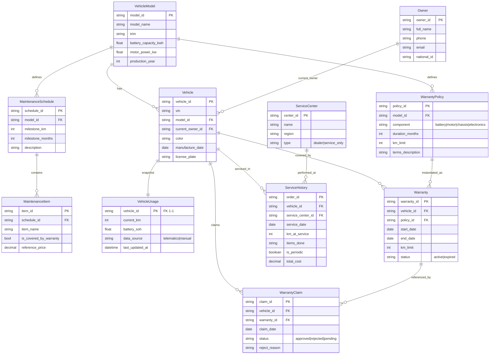

# ERD đề xuất — Mock hệ thống dữ liệu hãng xe điện (MVP-core)

> **Bối cảnh:** hệ thống hãng xe điện chạy như một hệ thống **bên ngoài** (`backend/mock-ev-system`, FastAPI + SQLModel + SQLite in-memory). EV Care backend chỉ gọi qua HTTP, không import code. Schema response dùng chung đặt ở `shared/ev-contracts`.
>
> Bản này hợp nhất tinh thần mock tối giản của [`erd_2`](../../../personal/tungld-03005/erd_2.md) với các bảng "nguồn sự thật" mà flow AI cần (theo [`external_erd.md`](./external_erd.md)), đồng thời loại phần ngoài scope so với [`erd_1`](../../../personal/tungld-03005/erd_1.md).

## 1. Nguyên tắc thiết kế

- **Mỗi bảng phục vụ ít nhất một flow AI** (nhắc lịch / ước tính chi phí / kiểm tra–giải thích bảo hành / đặt lịch). Không mock bảng không dùng tới.
- **Tách 3 tầng dữ liệu:** quy tắc gốc theo model (`WarrantyPolicy`, `MaintenanceSchedule`) → instance theo xe (`Warranty`, `ServiceHistory`) → snapshot hiện tại (`VehicleUsage`).
- **Giữ model flat** (gộp model + trim), bỏ tầng `VehicleVariant` — đủ cho MVP.
- **Bỏ ngoài scope maintenance:** `Insurance`, `Technician`, `VehicleVariant`.

## 2. ER Diagram

## 3. Thực thể

### 3.1. VehicleModel — Mẫu xe (Master)
Quy tắc gốc gắn theo model. Chỉ cần vài bản ghi cố định (VF3, VF5, VF6, VF7, VF8, VF9).

| Field | Kiểu | Mô tả |
|---|---|---|
| model_id | string (PK) | Mã model |
| model_name | string | VF6, VF7, VF8... |
| trim | string | Eco / Plus / Premium |
| battery_capacity_kwh | float | Dung lượng pin |
| motor_power_kw | float | Công suất động cơ |
| production_year | int | Năm sản xuất |

### 3.2. Owner — Chủ sở hữu
| Field | Kiểu | Mô tả |
|---|---|---|
| owner_id | string (PK) | Mã chủ xe |
| full_name | string | Họ tên |
| phone | string | Số điện thoại |
| email | string | Email |
| national_id | string | CCCD/CMND |

### 3.3. Vehicle — Xe (theo VIN)
| Field | Kiểu | Mô tả |
|---|---|---|
| vehicle_id | string (PK) | Mã xe |
| vin | string | Số khung |
| model_id | string (FK) | → VehicleModel |
| current_owner_id | string (FK) | → Owner (chủ hiện tại) |
| color | string | Màu xe |
| manufacture_date | date | Ngày xuất xưởng |
| license_plate | string | Biển số |

### 3.4. VehicleUsage — Snapshot sử dụng hiện tại (1–1)
Gộp odometer + tình trạng pin. Là input trực tiếp cho flow nhắc lịch và đánh giá bảo hành.

| Field | Kiểu | Mô tả |
|---|---|---|
| vehicle_id | string (PK, FK) | → Vehicle (1 xe – 1 snapshot) |
| current_km | int | Odometer hiện tại |
| battery_soh | float | State of Health của pin (%) |
| data_source | enum | telematics / manual |
| last_updated_at | datetime | Cập nhật gần nhất |

### 3.5. MaintenanceSchedule — Lịch bảo dưỡng chuẩn của hãng
"Nguồn sự thật" cho flow nhắc lịch — hãng định nghĩa mốc theo model.

| Field | Kiểu | Mô tả |
|---|---|---|
| schedule_id | string (PK) | Mã mốc |
| model_id | string (FK) | → VehicleModel |
| milestone_km | int | Mốc theo km |
| milestone_months | int | Mốc theo tháng |
| description | string | Mô tả mốc |

### 3.6. MaintenanceItem — Hạng mục trong 1 mốc
Dữ liệu cho flow ước tính chi phí.

| Field | Kiểu | Mô tả |
|---|---|---|
| item_id | string (PK) | Mã hạng mục |
| schedule_id | string (FK) | → MaintenanceSchedule |
| item_name | string | Thay lọc gió, kiểm tra phanh... |
| is_covered_by_warranty | bool | Trong/ngoài bảo hành |
| reference_price | decimal | Giá tham khảo |

### 3.7. ServiceHistory — Lịch sử bảo dưỡng thực tế
Nguồn để tính "mốc bảo dưỡng gần nhất" thực tế (không chỉ dựa lịch lý thuyết).

| Field | Kiểu | Mô tả |
|---|---|---|
| order_id | string (PK) | Mã lượt dịch vụ |
| vehicle_id | string (FK) | → Vehicle |
| service_center_id | string (FK) | → ServiceCenter |
| service_date | date | Ngày làm |
| km_at_service | int | Odometer lúc làm |
| items_done | string | Hạng mục đã làm (JSON/text ở MVP) |
| is_periodic | boolean | `true` = bảo dưỡng định kỳ (được tính làm mốc gốc); `false` = sửa chữa ngoài định kỳ. Mặc định `true` |
| total_cost | decimal | Chi phí thực tế |

### 3.8. ServiceCenter — Đại lý / xưởng dịch vụ
| Field | Kiểu | Mô tả |
|---|---|---|
| center_id | string (PK) | Mã xưởng |
| name | string | Tên |
| region | string | Khu vực |
| type | enum | dealer / service_only |

### 3.9. WarrantyPolicy — Quy tắc bảo hành gốc (theo model + component)
Bảo hành xe điện không đồng nhất: pin 8 năm/160.000km, động cơ 5 năm, khung gầm 3 năm...

| Field | Kiểu | Mô tả |
|---|---|---|
| policy_id | string (PK) | Mã chính sách |
| model_id | string (FK) | → VehicleModel |
| component | enum | battery / motor / chassis / electronics |
| duration_months | int | Thời hạn (tháng) |
| km_limit | int | Giới hạn km |
| terms_description | string | Điều khoản |

### 3.10. Warranty — Instance bảo hành áp cho 1 xe
| Field | Kiểu | Mô tả |
|---|---|---|
| warranty_id | string (PK) | Mã hợp đồng bảo hành |
| vehicle_id | string (FK) | → Vehicle |
| policy_id | string (FK) | → WarrantyPolicy |
| start_date | date | Bắt đầu hiệu lực |
| end_date | date | Hết hiệu lực |
| km_limit | int | Giới hạn km còn lại |
| status | enum | active / expired (derived) |

### 3.11. WarrantyClaim — Yêu cầu bảo hành
Trả lời trực tiếp pain point "không hiểu vì sao bị từ chối bảo hành".

| Field | Kiểu | Mô tả |
|---|---|---|
| claim_id | string (PK) | Mã yêu cầu |
| vehicle_id | string (FK) | → Vehicle |
| warranty_id | string (FK) | → Warranty |
| claim_date | date | Ngày yêu cầu |
| status | enum | approved / rejected / pending |
| reject_reason | string | Lý do từ chối |

## 4. Quan hệ

| Quan hệ | Cardinality | Ý nghĩa |
|---|---|---|
| VehicleModel → Vehicle | 1 – n | Một model có nhiều xe |
| VehicleModel → WarrantyPolicy | 1 – n | Mỗi model có nhiều chính sách theo component |
| VehicleModel → MaintenanceSchedule | 1 – n | Mỗi model có nhiều mốc bảo dưỡng |
| MaintenanceSchedule → MaintenanceItem | 1 – n | Mỗi mốc có nhiều hạng mục |
| Owner → Vehicle | 1 – n | Một chủ có thể có nhiều xe |
| Vehicle → VehicleUsage | 1 – 1 | Một xe có đúng một snapshot |
| Vehicle → Warranty | 1 – n | Một xe có nhiều hợp đồng bảo hành (theo component) |
| Vehicle → ServiceHistory | 1 – n | Một xe có nhiều lượt bảo dưỡng |
| Vehicle → WarrantyClaim | 1 – n | Một xe có nhiều lần yêu cầu bảo hành |
| WarrantyPolicy → Warranty | 1 – n | Một chính sách áp cho nhiều xe |
| Warranty → WarrantyClaim | 1 – n | Một hợp đồng có thể bị claim nhiều lần |
| ServiceCenter → ServiceHistory | 1 – n | Một xưởng thực hiện nhiều lượt dịch vụ |

## 5. Bảng phục vụ flow nào

| Flow AI | Bảng cần tra |
|---|---|
| Nhắc lịch bảo dưỡng | `MaintenanceSchedule` + `VehicleUsage.current_km` + `ServiceHistory` (mốc gần nhất) |
| Ước tính chi phí | `MaintenanceItem.reference_price` + `is_covered_by_warranty` |
| Kiểm tra / giải thích bảo hành | `WarrantyPolicy` + `Warranty` + `WarrantyClaim.reject_reason` |
| Đặt lịch | `ServiceCenter` |

## 6. Gợi ý sinh dữ liệu mock (deterministic seed)

- **VehicleModel:** 5–6 bản ghi cố định (VF3, VF5, VF6, VF7, VF8, VF9), không sinh ngẫu nhiên.
- **Owner : Vehicle** theo tỉ lệ 1 : 1–2 (đa số 1 xe, một phần có 2 xe).
- **VehicleUsage.current_km:** tương quan với `manufacture_date` (~15.000–20.000 km/năm) để dữ liệu thực tế hơn.
- **WarrantyPolicy:** mỗi model có 3–4 chính sách theo component (pin 8 năm/160.000km, động cơ 5 năm, khung gầm 3 năm/100.000km).
- **Warranty.status / VehicleUsage:** tính derived từ ngày + km so với hiện tại thay vì set cứng ngẫu nhiên, để logic nhất quán.
- **WarrantyClaim:** để một tỉ lệ xe có claim `rejected` kèm `reject_reason` (quá hạn km / ngoài điều khoản component) — để test được flow giải thích từ chối.
- **ServiceHistory:** một tỉ lệ xe "chưa từng bảo dưỡng" (0 bản ghi) để test case rỗng.

## 7. Hoãn sang phase 2 (chưa mock ở MVP)

- **OwnershipHistory** — hiện chỉ giữ `current_owner_id` trên `Vehicle`; thêm bảng khi cần lịch sử sang tên và chuyển tiếp bảo hành.
- **RecallCampaign** — chiến dịch triệu hồi theo model/lô.
- **BatteryInfo chi tiết** — serial pin, số chu kỳ sạc (hiện gộp `battery_soh` vào `VehicleUsage`).
- **PartCatalog** — danh mục phụ tùng chuẩn hóa + đơn giá (hiện dùng tạm `MaintenanceItem.reference_price`).
