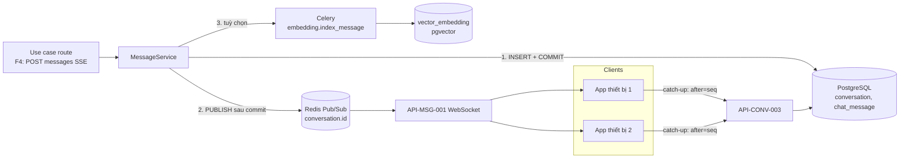

# API Technical Specification — Nền tảng Conversation & Messaging

> **Cập nhật phạm vi (02/10/2026):** các phần dưới đây trong tài liệu này không còn áp dụng.
>
> - Báo giá / duyệt báo giá (`quote`, `quote_item`, us-049): **đã bỏ**. Đặt lịch không gắn báo giá; mọi con số chi phí là ước tính (F5), chi phí cuối cùng do xưởng xác nhận khi kiểm tra xe.
> - Kết nối Discord (`user_discord_link`, ENT-417): **đã bỏ**. Nhắc bảo dưỡng, nhắc lịch hẹn và hỏi thăm hiện trong mục **Thông báo** của app; danh sách kênh ngoài (Zalo / Telegram / SMS / Email) vẫn có nhưng đều "Sắp có", bật nhắc không bắt buộc chọn kênh.

> Đặc tả API backend cho hai thành phần **nền tảng dùng chung**: **Conversation** (hội thoại) và **Messaging** (lưu tin nhắn, phát thời gian thực, lập chỉ mục vector). **Không gắn với một use case cụ thể** — các use case (F4, F5, F5b, F6, F8…) đứng trên nền tảng này.
>
> **Entity:** [conversation](../entity/conversation/conversation.entity.md) (`ENT-421`) · [chat_message](../entity/conversation/chat_message.entity.md) (`ENT-422`) · [vector_embedding](../entity/conversation/vector_embedding.entity.md) (`ENT-423`)
>
> **Use case đầu tiên dùng nền tảng:** [F4 — Chat RAG](../sprint-2/feature-functional/us-025-sprint-2-spec.ff.md) → [API F4](../sprint-2/api/us-025-sprint-2-spec.api.md) (gửi tin & stream câu trả lời, đoạn hội thoại cho chủ xưởng, xuất eval).
>
> **Thay thế** code PROVISIONAL: `backend/src/modules/conversation/route.py`, `backend/src/infrastructure/messaging/`, `backend/src/infrastructure/celery/tasks/embedding_tasks.py` — xem §12.
>
> Nghiệp vụ tham chiếu (BR-6xx, AC-6xx) do [FF F4](../sprint-2/feature-functional/us-025-sprint-2-spec.ff.md) định nghĩa; tài liệu này không định nghĩa lại. Điểm chưa chốt đánh dấu `[Đề xuất]`.

---

# 0. Document Information

| Field | Value |
| --- | --- |
| Document ID | `API-SPEC-PLATFORM-CONV-001` |
| Version | `v1.0` |
| Status | `Draft` |
| Owner | Backend Team |
| Base URL | `/api/v1` |
| Module | `backend/src/modules/conversation/` (route, service, schemas, dependency) · `backend/src/infrastructure/messaging/` (`MessageService`, realtime) · `backend/src/infrastructure/vectorstore/`, `embedding/` (đã có) |
| Created Date | `2026-09-29` |

## 0.1 API Catalog

| ID | Method | Endpoint / Name | Caller | Mục đích |
| --- | --- | --- | --- | --- |
| `API-CONV-001` | `POST` | `/api/v1/conversations` | App chủ xe | Tạo hội thoại |
| `API-CONV-002` | `GET` | `/api/v1/conversations` | App chủ xe | Liệt kê hội thoại theo xe, theo thời gian |
| `API-CONV-003` | `GET` | `/api/v1/conversations/{conversationId}/messages` | App chủ xe | Tải tin nhắn (keyset, có `before`/`after`) |
| `API-CONV-004` | `GET` | `/api/v1/conversations/search` | App chủ xe | Tìm từ khoá trong lịch sử của mình |
| `API-CONV-005` | `DELETE` | `/api/v1/conversations/{conversationId}` | App chủ xe | Xoá hội thoại + trạng thái Agent + vector |
| `API-CONV-006` | `GET` | `/api/v1/conversations/{conversationId}/semantic-search` | App chủ xe | Tìm ngữ nghĩa trong một hội thoại (**tuỳ chọn**, mặc định tắt) |
| `API-MSG-001` | `WS` | `/api/v1/conversations/{conversationId}/stream` | App (nhiều thiết bị) | Nhận tin nhắn mới theo thời gian thực |
| `SVC-MSG-001` | — | `MessageService.append` / `append_many` (nội bộ) | Use case (F4 …) | **Nơi duy nhất ghi `chat_message`**: lưu → publish → lập chỉ mục |
| `TASK-MSG-001` | — | `embedding.index_message` (Celery) | Worker | Embed tin nhắn, ghi `vector_embedding` |
| `JOB-CONV-001` | — | `purge_expired_conversations` (Celery beat) | Beat hằng ngày | Xoá hội thoại quá hạn lưu giữ |

**Không có** endpoint để client tự ghi tin nhắn (`POST` tin có `role` tuỳ ý). Ghi tin đi qua endpoint của từng use case (F4: [API-CHAT-004](../sprint-2/api/us-025-sprint-2-spec.api.md) — SSE) và luôn gọi `SVC-MSG-001`.

## 0.2 Use case dùng nền tảng

Nền tảng này là **xương sống**, không phải một use case. Đối chiếu với PRD:

| Use case | Dùng thế nào | Ghi chú |
| --- | --- | --- |
| **F4** Chat RAG có trích nguồn | Toàn bộ: hội thoại, tin nhắn, trích dẫn, phát realtime | Use case đầu tiên; FF/API/agent riêng |
| **F5** Dự toán chi phí | Diễn ra trong cùng hội thoại; kết quả là tin `assistant` có `card` | Không cần API nền tảng thêm |
| **F5b** Báo giá HITL | Báo giá tạo từ chat ghi `quote.source_message_id` | Cột liên kết — [entity spec F4](../sprint-2/entity/us-025-sprint-2-spec.entity.md) |
| **F6 / F6b** Đặt lịch hội thoại | Thu thập slot qua chat; booking ghi `booking.source_message_id` khi chủ xe xác nhận | Nhiều lượt + checkpoint |
| **F8** Workshop Board | Chủ xưởng đọc đoạn hội thoại dẫn tới booking/báo giá (chỉ đọc) | Endpoint riêng của F4 (API-CHAT-007/008) |
| Eval / phân tích | Xuất bản ẩn danh | JOB-CHAT-002 (F4) |
| Đa thiết bị | `API-MSG-001` cho cùng chủ xe mở nhiều thiết bị | Nice-to-have MVP `[Đề xuất]` |
| **Không dùng:** F7 nhắc, F9 hỏi thăm | Gửi qua Discord bằng `NotificationService`, không đi qua conversation | Tránh trộn hai kênh |
| **Ngoài MVP:** chat người–người (chủ xe ↔ chủ xưởng) | Cần thêm người tham gia, endpoint ghi và cân nhắc lại Firestore/Realtime (ADR-01) | Mô hình dữ liệu hiện tại **chưa** hỗ trợ |

Kết luận: không viết FF riêng cho nền tảng; hành vi nghiệp vụ nằm trong FF của từng use case, còn tài liệu này là hợp đồng API/kỹ thuật chung.

## 0.3 Kiến trúc



Nguyên tắc: **DB là nguồn sự thật**. Redis Pub/Sub chỉ để đẩy nhanh (fire-and-forget, tin có thể lỡ); client luôn có thể bắt kịp bằng REST `after`. Lập chỉ mục vector là hiệu ứng phụ, không bao giờ chặn lưu/phát.

## 0.4 SSE và WebSocket — mỗi kênh một mục đích

Hệ thống **giữ cả hai** kênh realtime, mỗi kênh một vai trò khác nhau, không thay thế nhau (Q-606):

| | **WebSocket** `API-MSG-001` | **SSE** (F4 `API-CHAT-004`) |
| --- | --- | --- |
| Mục đích | **Chatbot thời gian thực**: kênh sống của một hội thoại, đẩy tin nhắn mới (của chủ xe và câu trả lời hoàn chỉnh của trợ lý) tới **mọi thiết bị** đang mở hội thoại | **Nhận luồng của một lượt trả lời + thông báo**: stream từng token câu trả lời cho **đúng thiết bị vừa gửi**; về sau là kênh nhận thông báo đẩy khác của app |
| Hướng | Server → client, kết nối bền, nhiều thiết bị | Server → client, gắn với **một** request `POST /messages`, đóng khi lượt xong |
| Phạm vi | Cả vòng đời hội thoại (mở tới khi rời màn chat) | Một lượt hỏi–đáp |
| Ai nhận | Tất cả thiết bị của chủ xe đang mở hội thoại | Chỉ thiết bị đang gửi lượt đó |
| Nội dung | Tin nhắn **đã lưu** (`MessageEventDto`), không stream token | Token đang sinh + `message.completed` |
| Nếu thiếu | Thiết bị khác không thấy tin mới tức thì (phải tải lại REST) | Không xem được chữ hiện dần; vẫn nhận tin qua WebSocket/REST |

Vì sao cần cả hai: SSE gắn liền một request nên hợp để **stream câu trả lời** cho người vừa hỏi (và sau này đẩy thông báo một chiều), nhưng không phục vụ được thiết bị thứ hai hay các lượt do thiết bị khác tạo. WebSocket là kênh bền của hội thoại nên hợp làm **xương sống chatbot realtime/đa thiết bị** và nền cho chat nhiều bên (post-MVP), nhưng không dùng để bơm token của một lượt. Một thiết bị đơn có thể chỉ dùng SSE và bỏ qua WebSocket; đa thiết bị thì cần WebSocket để đồng bộ.

---

# 1. Quy ước chung

## 1.1 Authentication & Authorization

```http
Authorization: Bearer <Firebase ID token>
```

| Endpoint | Dependency (`backend/src/modules/...`) | Ai được gọi |
| --- | --- | --- |
| `API-CONV-001` → `005`, `API-MSG-001` | `require_active_vehicle_owner` (`vehicle_owner_onboarding`/`user_vehicle`) | Chủ xe đã onboarding, xe `active` |

Không có role Admin/nhân viên (PRD §4). Token thiếu/sai → `401 UNAUTHORIZED`.

**Quy tắc sở hữu (BR-605):** đọc/ghi hội thoại phải có `conversation.user_id = user.user_id`. Hội thoại không tồn tại **hoặc** thuộc người khác → cùng một phản hồi `404 CONVERSATION_NOT_FOUND` (không lộ sự tồn tại).

## 1.2 Định dạng chung

- Tên trường JSON: `camelCase`. Thời gian: ISO-8601 UTC (`2026-09-28T02:14:06Z`).
- Thành công: `{ "data": ... }`. Danh sách phân trang: `{ "data": [...], "page": { "nextCursor": "…" | null, "hasMore": true|false } }`.
- Lỗi:

```json
{
  "error": {
    "code": "CONVERSATION_NOT_FOUND",
    "message": "Conversation was not found.",
    "details": null,
    "traceId": "tr-20260928-0214-abc123"
  }
}
```

- `traceId` cũng có trong header `X-Trace-Id` của mọi phản hồi và được lưu vào `chat_message.trace_id`.

## 1.3 Đối tượng dùng chung

### `MessageDto`

| Field | Type | Nullable | Description |
| --- | --- | ---: | --- |
| `id` | `uuid` | No | ID tin nhắn |
| `seq` | `integer` | No | Thứ tự tăng dần; dùng làm cursor |
| `role` | `string` | No | `user` / `assistant` (API không trả `tool` cho client) |
| `content` | `string` | No | Nội dung |
| `citations` | `CitationDto[]` | No | Trích dẫn (rỗng với `user` và từ chối) |
| `refs` | `object` | No | `{ "bookingId"?: uuid, "quoteId"?: uuid }` |
| `card` | `object` | Yes | Thẻ UI có cấu trúc (F5/F6) `[Đề xuất]` |
| `createdAt` | `datetime` | No | |

### `CitationDto`

| Field | Type | Nullable | Description |
| --- | --- | ---: | --- |
| `title` | `string` | No | Tên tài liệu |
| `version` | `string` | No | Phiên bản |
| `documentType` | `string` | No | `owner_manual` / `maintenance_manual` / `warranty_policy` / `service_bulletin` |
| `pageNumber` | `integer` | Yes | Trang |
| `snippet` | `string` | No | Đoạn trích ≤ 500 ký tự |

> `chunkId`, `documentId`, `score`, `tool_calls`, `trace_id`, `agent_run_id`, `intent` **không** trả cho client — dùng nội bộ/eval.
>
> `MessageDto` là hợp đồng dữ liệu **dùng chung** cho REST, SSE (F4) và WebSocket.

### `ConversationDto`

| Field | Type | Nullable | Description |
| --- | --- | ---: | --- |
| `id` | `uuid` | No | |
| `userVehicleId` | `uuid` | No | |
| `title` | `string` | Yes | |
| `lastMessageAt` | `datetime` | No | |
| `createdAt` | `datetime` | No | |
| `lastMessagePreview` | `string` | Yes | 100 ký tự đầu của tin nhắn cuối (chỉ ở danh sách) |

---

# API-CONV-001 — Tạo hội thoại

```http
POST /api/v1/conversations
```

## 1. Request

| Field | Type | Required | Constraints |
| --- | --- | ---: | --- |
| `userVehicleId` | `uuid` | Yes | Xe `active` của chủ xe |
| `title` | `string` | No | ≤ 255 ký tự; bỏ trống → đặt theo câu hỏi đầu (BR-ENT-461) |

```json
{ "userVehicleId": "f2c1a9e0-8b5d-4a52-a1de-1a2b3c4d5e6f" }
```

## 2. Processing

1. Xác thực chủ xe (§1.1).
2. Đọc `user_vehicle` theo `userVehicleId` và `user_id = currentUser`; không thấy → `404 VEHICLE_NOT_FOUND`; không `active` → `409 VEHICLE_NOT_ACTIVE` (BR-601).
3. `INSERT conversation` (`user_id`, `user_vehicle_id`, `title`, `last_message_at = now()`).

> Client có thể bỏ qua API này ở lần đầu: gửi tin nhắn cần `conversationId` nên bắt buộc gọi trước `[Đề xuất]`; FE gọi liền khi người dùng bấm gửi tin đầu tiên (AF-604).

## 3. Response — `201 Created`

```json
{
  "data": {
    "id": "5b0f6f3e-3d0c-4a0e-9a35-0f6f7a1d2c11",
    "userVehicleId": "f2c1a9e0-8b5d-4a52-a1de-1a2b3c4d5e6f",
    "title": null,
    "lastMessageAt": "2026-09-28T02:14:02Z",
    "createdAt": "2026-09-28T02:14:02Z"
  }
}
```

## 4. Errors

| Case | Code | HTTP |
| --- | --- | ---: |
| Sai định dạng `userVehicleId` | `INVALID_REQUEST` | 400 |
| Chưa đăng nhập | `UNAUTHORIZED` | 401 |
| Chưa onboarding / không phải chủ xe | `FORBIDDEN` | 403 |
| Xe không tồn tại hoặc không thuộc chủ xe | `VEHICLE_NOT_FOUND` | 404 |
| Xe không `active` | `VEHICLE_NOT_ACTIVE` | 409 |

---

# API-CONV-002 — Danh sách hội thoại

```http
GET /api/v1/conversations?userVehicleId={uuid}&limit=20&cursor={cursor}
```

| Param | Type | Required | Constraints |
| --- | --- | ---: | --- |
| `userVehicleId` | `uuid` | No | Lọc theo xe; không truyền → mọi xe của chủ xe |
| `limit` | `integer` | No | `1..50`, mặc định 20 |
| `cursor` | `string` | No | Từ `page.nextCursor` |

## Processing

1. Đọc `conversation` theo `user_id = currentUser` (+ `user_vehicle_id`), sắp xếp `last_message_at DESC, id DESC`.
2. Cursor = `(last_message_at, id)` mã hoá base64 (keyset). Lấy `limit + 1` để biết `hasMore`.
3. Lấy `lastMessagePreview` bằng một truy vấn gộp (tin `user/assistant` mới nhất mỗi hội thoại), không N+1.

**Dùng cho "mở lại app":** `GET /conversations?userVehicleId=…&limit=1` → hội thoại gần nhất (UC-602).

## Response — `200 OK`

```json
{
  "data": [
    {
      "id": "5b0f6f3e-3d0c-4a0e-9a35-0f6f7a1d2c11",
      "userVehicleId": "f2c1a9e0-8b5d-4a52-a1de-1a2b3c4d5e6f",
      "title": "Mốc 12.000 km cần làm gì, cái nào được miễn phí?",
      "lastMessageAt": "2026-09-28T02:15:41Z",
      "createdAt": "2026-09-28T02:14:02Z",
      "lastMessagePreview": "Theo sổ tay bảo dưỡng VF6, mốc 12.000 km gồm: kiểm tra phanh, thay lọc gió …"
    }
  ],
  "page": { "nextCursor": null, "hasMore": false }
}
```

## Errors

| Case | Code | HTTP |
| --- | --- | ---: |
| `limit`/`cursor` sai | `INVALID_REQUEST` | 400 |
| `userVehicleId` không thuộc chủ xe | — trả danh sách rỗng (không lộ xe của người khác) | 200 |
| Chưa đăng nhập / không phải chủ xe | `UNAUTHORIZED` / `FORBIDDEN` | 401 / 403 |

---

# API-CONV-003 — Tải tin nhắn

```http
GET /api/v1/conversations/{conversationId}/messages?limit=50&before={seq}
```

| Param | Type | Required | Constraints |
| --- | --- | ---: | --- |
| `conversationId` | `uuid` (path) | Yes | Thuộc chủ xe |
| `limit` | `integer` | No | `1..100`, mặc định 50 |
| `before` | `integer` | No | Lấy tin có `seq < before`; bỏ trống → mới nhất |
| `after` | `integer` | No | Lấy tin có `seq > after`, **tăng dần**; dùng để bắt kịp tin bị lỡ sau khi WebSocket ngắt (§API-MSG-001). Không dùng cùng `before` (`400 INVALID_REQUEST`) |

## Processing

1. Kiểm tra sở hữu (§1.1) → `404 CONVERSATION_NOT_FOUND`.
2. `SELECT … FROM chat_message WHERE conversation_id = :id AND role IN ('user','assistant') [AND seq < :before] ORDER BY seq DESC LIMIT :limit + 1` (chỉ mục `ix_chat_message_conversation_seq`).
3. Mục tiêu ≤ 300 ms p90 cho 50 tin (PRD §8).

Khi có `after`: `WHERE seq > :after ORDER BY seq ASC LIMIT :limit + 1`, `page.nextCursor` = `seq` lớn nhất của trang, `hasMore` cho biết còn tin mới hơn nữa.

Kết quả **mới nhất trước**; FE đảo lại để hiển thị cũ → mới (BR-604). `page.nextCursor` = `seq` nhỏ nhất của trang (dùng làm `before`).

## Response — `200 OK`

```json
{
  "data": [
    {
      "id": "a1a1a1a1-0000-4000-8000-000000000002",
      "seq": 1004,
      "role": "assistant",
      "content": "Theo sổ tay bảo dưỡng VF6, mốc 12.000 km gồm: …",
      "citations": [
        { "title": "Sổ tay bảo dưỡng VF6", "version": "2.1", "documentType": "maintenance_manual", "pageNumber": 42, "snippet": "Mốc 12.000 km: kiểm tra hệ thống phanh …" }
      ],
      "refs": {},
      "card": null,
      "createdAt": "2026-09-28T02:14:06Z"
    },
    {
      "id": "a1a1a1a1-0000-4000-8000-000000000001",
      "seq": 1001,
      "role": "user",
      "content": "Mốc 12.000 km cần làm gì, cái nào được miễn phí?",
      "citations": [],
      "refs": {},
      "card": null,
      "createdAt": "2026-09-28T02:14:02Z"
    }
  ],
  "page": { "nextCursor": "1001", "hasMore": false }
}
```

## Errors

| Case | Code | HTTP |
| --- | --- | ---: |
| `limit`/`before` sai | `INVALID_REQUEST` | 400 |
| Hội thoại không tồn tại / của người khác | `CONVERSATION_NOT_FOUND` | 404 |
| Chưa đăng nhập / không phải chủ xe | `UNAUTHORIZED` / `FORBIDDEN` | 401 / 403 |

> Đọc **không** yêu cầu xe còn `active` (EDGE-608).

---

# API-CONV-004 — Tìm từ khoá trong lịch sử

> Phải khai báo **trước** route `/{conversationId}` trong router để `search` không bị bắt như UUID.

```http
GET /api/v1/conversations/search?q={text}&userVehicleId={uuid}&limit=20&cursor={cursor}
```

| Param | Type | Required | Constraints |
| --- | --- | ---: | --- |
| `q` | `string` | Yes | 2 … 100 ký tự sau `trim` |
| `userVehicleId` | `uuid` | No | Lọc theo xe |
| `limit` | `integer` | No | `1..50`, mặc định 20 |
| `cursor` | `string` | No | Từ `page.nextCursor` |

## Processing

1. Chuẩn hoá `q` theo cùng hàm với `search_vector` (bỏ dấu, chữ thường) → `plainto_tsquery('simple', immutable_unaccent(:q))` (BR-ENT-467, BR-615).
2. `SELECT … FROM chat_message m JOIN conversation c ON c.id = m.conversation_id WHERE c.user_id = :currentUser [AND c.user_vehicle_id = :v] AND m.search_vector @@ :query ORDER BY m.seq DESC LIMIT :limit + 1` — **ràng buộc `c.user_id` là điều kiện bắt buộc** (AC-605).
3. `snippet` = `ts_headline` trên `content` (≤ 200 ký tự, đánh dấu từ khớp bằng `<mark>` đã escape các ký tự HTML khác).

## Response — `200 OK`

```json
{
  "data": [
    {
      "conversationId": "5b0f6f3e-3d0c-4a0e-9a35-0f6f7a1d2c11",
      "conversationTitle": "Mốc 12.000 km cần làm gì, cái nào được miễn phí?",
      "messageId": "a1a1a1a1-0000-4000-8000-000000000002",
      "seq": 1004,
      "role": "assistant",
      "snippet": "… kiểm tra hệ thống <mark>phanh</mark>, thay lọc gió điều hoà …",
      "createdAt": "2026-09-28T02:14:06Z"
    }
  ],
  "page": { "nextCursor": null, "hasMore": false }
}
```

Không có kết quả → `data: []` (EDGE-610).

## Errors

| Case | Code | HTTP |
| --- | --- | ---: |
| `q` thiếu/quá ngắn/quá dài | `INVALID_REQUEST` | 400 |
| Chưa đăng nhập / không phải chủ xe | `UNAUTHORIZED` / `FORBIDDEN` | 401 / 403 |

---

# API-CONV-005 — Xoá hội thoại

```http
DELETE /api/v1/conversations/{conversationId}
```

## Processing

1. Kiểm tra sở hữu → `404 CONVERSATION_NOT_FOUND`.
2. Nếu có lượt đang chạy: đặt cờ huỷ trong Redis (`conversation:{id}:cancel`), Agent dừng ở bước kế tiếp (EDGE-605).
3. Transaction (BR-ENT-462):
   - Xoá bản ghi checkpointer có `thread_id = conversationId` (API `adelete_thread` của thư viện).
   - `DELETE conversation` → cascade `chat_message`; `booking.source_message_id`, `quote.source_message_id` về `NULL` (`ON DELETE SET NULL`).
4. Xoá khoá Redis liên quan.
5. Nếu bật lập chỉ mục ngữ nghĩa: xoá vector của các tin `embedded = true` (`VectorStore.delete("conversation_messages", ids)`, BR-ENT-473) **sau khi** transaction commit. Lỗi xoá vector chỉ ghi log; `JOB-CONV-001` quét vector mồ côi.

Booking/báo giá đã tạo **không bị xoá** (BR-608, EDGE-606).

## Response

`204 No Content`.

## Errors

| Case | Code | HTTP |
| --- | --- | ---: |
| Hội thoại không tồn tại / của người khác | `CONVERSATION_NOT_FOUND` | 404 |
| Chưa đăng nhập / không phải chủ xe | `UNAUTHORIZED` / `FORBIDDEN` | 401 / 403 |
| Lỗi xoá checkpointer | `DATABASE_ERROR` (rollback toàn bộ) | 500 |

Idempotent: xoá lần hai → `404` (đã hết).

---

# API-MSG-001 — WebSocket nhận tin nhắn thời gian thực

```text
GET /api/v1/conversations/{conversationId}/stream      (Upgrade: websocket)
```

Chỉ **nhận** (server → client). Client không ghi tin qua WebSocket (khác code hiện tại — xem §12).

## 1. Xác thực

Trình duyệt không đặt được header `Authorization` cho WebSocket và token trên URL sẽ lọt vào log, nên `[Đề xuất]` xác thực bằng **khung đầu tiên**:

```json
{ "type": "auth", "token": "<Firebase ID token>" }
```

- Phải gửi trong `CONVERSATION_WS_AUTH_TIMEOUT_SECONDS` (mặc định 5 s), nếu không đóng `4401`.
- Backend verify token, kiểm tra chủ xe active và sở hữu hội thoại (cùng quy tắc §1.1: hội thoại không tồn tại **hoặc** của người khác → đóng `4404`).
- Giới hạn `CONVERSATION_WS_MAX_PER_USER` kết nối đồng thời mỗi chủ xe (mặc định 5), vượt → đóng `4429`.
- Chưa có khung `auth` hợp lệ thì **không** subscribe Redis.

## 2. Khung server → client

| `type` | Khi nào | Nội dung |
| --- | --- | --- |
| `ready` | Sau khi xác thực và **đã subscribe** kênh | `{ "type": "ready", "lastSeq": 1016 }` — `seq` mới nhất hiện có, để client biết có lỡ tin hay không |
| `message` | Có tin `user`/`assistant` mới được lưu | `{ "type": "message", "data": MessageEventDto }` |
| `ping` | Mỗi `CONVERSATION_WS_PING_SECONDS` (25 s) | `{ "type": "ping" }`; client trả `{ "type": "pong" }` |
| `error` | Trước khi đóng do lỗi | `{ "type": "error", "code": "…", "traceId": "…" }` |

`MessageEventDto` = [`MessageDto`](#13-đối-tượng-dùng-chung) + `conversationId`. Tin `role = tool` **không** được phát. Token của câu trả lời đang sinh **không** đi qua kênh này (chỉ thiết bị đang gửi nhận qua SSE, F4); các thiết bị khác nhận tin `assistant` hoàn chỉnh khi nó được lưu.

## 3. Khung client → server

Chỉ `auth` và `pong`. Khung khác → đóng `4400`.

## 4. Mã đóng kết nối

| Code | Ý nghĩa |
| --- | --- |
| `1000` / `1001` | Bình thường / server tắt |
| `4400` | Khung không hợp lệ |
| `4401` | Chưa/sai xác thực hoặc hết thời gian chờ `auth` |
| `4404` | Hội thoại không tồn tại hoặc không thuộc chủ xe |
| `4429` | Quá số kết nối cho phép |
| `4500` | Lỗi nội bộ |

## 5. Ngữ nghĩa phân phối

- **At-most-once**: Redis Pub/Sub không lưu; thiết bị offline/ngắt sẽ lỡ tin.
- **Bắt kịp:** khi (re)connect, client nhận `ready.lastSeq`; nếu `lastSeq` > `seq` lớn nhất đã có ở client → gọi `API-CONV-003?after={seq}` để lấy phần lỡ. Nên gọi REST **sau** khi nhận `ready` để không hở giữa hai bước.
- **Thứ tự:** `MessageService` publish sau khi commit nên khi client nhận event luôn đọc lại được dòng đó. Hai lượt ghi đồng thời có thể publish sai thứ tự → client **sắp theo `seq` và loại trùng theo `id`**.
- Reconnect: backoff luỹ thừa 1 → 30 s.

## 6. Processing phía server

1. `accept()` → chờ khung `auth` (timeout).
2. Verify + kiểm tra quyền (§1) → subscribe Redis topic `conversation.{conversationId}` (qua `PubSubBroker`, prefix `REDIS_KEY_PREFIX`).
3. Gửi `ready` với `lastSeq = MAX(seq)` của hội thoại.
4. Vòng lặp: chuyển từng event Redis thành khung `message`; gửi `ping`; đọc khung `pong`.
5. Đóng: huỷ subscribe, giảm bộ đếm kết nối (Redis `INCR/DECR` với TTL).

Xoá hội thoại (`API-CONV-005`) publish sự kiện `{ "type": "conversation.deleted" }` để đóng các kết nối đang mở bằng `1000` `[Đề xuất]`.

## 7. Lưu ý triển khai

- Nhiều instance backend: Redis Pub/Sub cho phép mọi instance nhận cùng event; không cần sticky session.
- Chi phí: mỗi kết nối giữ một subscription; giới hạn theo user để tránh cạn `REDIS_MAX_CONNECTIONS`.
- Swagger UI không thử được WebSocket; dùng `wscat`/client test.

---

# SVC-MSG-001 — `MessageService` (hợp đồng nội bộ)

Nơi **duy nhất** ghi `chat_message` (FF BR-602). Route và Agent **không** dùng repository trực tiếp để ghi tin. Thay thế `RealtimeMessageService` PROVISIONAL.

## 1. Chữ ký `[Đề xuất]`

```python
async def append(
    conversation_id: UUID,
    role: MessageRole,                 # user | assistant | tool
    content: str,
    *,
    client_message_id: UUID | None = None,   # chỉ role=user
    citations: list[Citation] = (),
    tool_calls: list[ToolCall] = (),
    tool_call_id: str | None = None,         # role=tool
    tool_name: str | None = None,            # role=tool
    refs: dict = {},
    card: dict | None = None,
    intent: str | None = None,
    agent_run_id: UUID | None = None,
    trace_id: str | None = None,
    publish: bool = True,
) -> AppendResult                            # { message, created: bool }

async def append_many(conversation_id, items: list[NewMessage]) -> list[AppendResult]
    # một transaction; publish sau commit theo thứ tự seq
```

## 2. Processing

1. **Kiểm tra ràng buộc theo vai trò** (BR-ENT-466); sai → `InvalidMessage` (không ghi).
2. **Transaction** (chạy trong thread vì repository đồng bộ):
   - `INSERT chat_message`. Với `role = user` trùng `(conversation_id, client_message_id)` → **không** chèn, trả tin đã có với `created = False` (idempotent, BR-611).
   - `UPDATE conversation SET last_message_at = now(), updated_at = now()`; nếu chưa có `title` và `role = user` → đặt từ 60 ký tự đầu.
   - `COMMIT`.
3. **Publish** (chỉ khi `created`, `publish = True` và `role IN (user, assistant)`): `MessageEventDto` lên topic `conversation.{id}`. Lỗi Redis → log cảnh báo, **không** ném lỗi (tin đã lưu; client bắt kịp bằng REST).
4. **Lập chỉ mục** (chỉ khi `CONVERSATION_SEMANTIC_INDEX_ENABLED` và `role IN (user, assistant)`): `index_message_task.delay(message_id)`. Lỗi enqueue → log, bỏ qua (BR-ENT-469).

**Thứ tự bất biến:** commit → publish → index. Không publish trước commit.

## 3. Lỗi

| Lỗi | Hành vi |
| --- | --- |
| `ConversationNotFound` | Không ghi; route trả `404 CONVERSATION_NOT_FOUND` |
| `InvalidMessage` | Không ghi; route trả `422`/`400` |
| Lỗi database | Rollback; không publish; ném lên route (`500 DATABASE_ERROR`, hoặc `error` event của SSE) |
| Lỗi Redis khi publish | Bỏ qua, log |
| Lỗi enqueue Celery | Bỏ qua, log |

## 4. Quyền

`MessageService` **không** tự kiểm tra chủ sở hữu (nó là tầng nội bộ). Route/Agent phải kiểm tra `conversation.user_id` **trước** khi gọi (§1.1).

---

# TASK-MSG-001 — `embedding.index_message` (Celery)

| Property | Value |
| --- | --- |
| Tên task | `embedding.index_message` (giữ nguyên tên hiện có) |
| Tham số | `message_id: str` |
| Điều kiện bật | `CONVERSATION_SEMANTIC_INDEX_ENABLED = true` (mặc định `false` — Q-604) |
| Cấu hình | `acks_late = true`; `max_retries = 3`; countdown 10 s / 60 s / 300 s |
| File | `backend/src/infrastructure/celery/tasks/embedding_tasks.py` |

## Processing

1. Mở session DB riêng; đọc `chat_message` theo `message_id`.
   - Không thấy → trả `missing` (đã bị xoá; không retry).
   - `embedded = true` → trả `already_indexed` (idempotent).
   - `role = tool` → trả `skipped`.
2. Dựng record **qua builder + policy** (không tự tạo dict metadata):

   ```python
   record = VectorRecordBuilder.from_message(message, policy_for("conversation_messages"))
   VectorStore.add("conversation_messages", [record])
   ```

   - Builder đặt `id = message.id`, `content = message.content`, và `metadata` theo hợp đồng [vector_embedding §6](../entity/conversation/vector_embedding.entity.md#6-metadata-contract-policy--builder): khoá hệ thống `source = "conversation_message"`, `sourceCreatedAt = message.created_at`, khoá lọc top-level `conversationId`, `role`, và `sourceMeta` (mặc định `{}` — policy `conversation_messages` không giữ `citations`/`tool_calls`/`refs`, và mask VIN/SĐT/email/CCCD).
   - **Không** dùng `**message.meta`: tránh ghi đè khoá lọc và rò dữ liệu (BR-ENT-474).
   - Store tự embed bằng engine đã cấu hình (`bge-m3`, 1024 chiều) và ghi `embedding_model`.
3. Lỗi nhà cung cấp/kho vector → `retry` theo countdown; hết lần → log lỗi, `embedded` vẫn `false`.
4. Thành công → `UPDATE chat_message SET embedded = true`.

Ghi vector idempotent (`ON CONFLICT (id) DO UPDATE` — BR-ENT-472), nên retry an toàn.

---

# API-CONV-006 — Tìm ngữ nghĩa trong một hội thoại (tuỳ chọn)

Thay route `GET /{id}/search` hiện có (route đó đổi chức năng: `/conversations/search` là tìm từ khoá `API-CONV-004`).

```http
GET /api/v1/conversations/{conversationId}/semantic-search?q={text}&k=5
```

| Param | Type | Required | Constraints |
| --- | --- | ---: | --- |
| `conversationId` | `uuid` (path) | Yes | Thuộc chủ xe |
| `q` | `string` | Yes | 2 … 500 ký tự sau `trim` |
| `k` | `integer` | No | `1..20`, mặc định 5 |

## Processing

1. Xác thực chủ xe; kiểm tra sở hữu (§1.1) **trước** khi truy vấn vector → `404 CONVERSATION_NOT_FOUND`.
2. `CONVERSATION_SEMANTIC_INDEX_ENABLED = false` → `404 SEMANTIC_SEARCH_DISABLED`.
3. `VectorStore.similarity_search("conversation_messages", q, k, where={"conversationId": conversationId})` (cosine; lọc metadata `@>`).
4. Nối lại với `chat_message` theo `id` để lấy `seq`, `role`, `createdAt`; bỏ kết quả mà tin đã không còn.

Chỉ tìm được các tin đã `embedded = true` (lập chỉ mục bất đồng bộ nên tin rất mới có thể chưa có).

## Response — `200 OK`

```json
{
  "data": [
    { "messageId": "a1a1a1a1-0000-4000-8000-000000000002", "seq": 1004, "role": "assistant",
      "snippet": "Theo sổ tay bảo dưỡng VF6, mốc 12.000 km gồm: kiểm tra phanh …",
      "score": 0.83, "createdAt": "2026-09-28T02:14:06Z" }
  ]
}
```

## Errors

| Case | Code | HTTP |
| --- | --- | ---: |
| `q`/`k` sai | `INVALID_REQUEST` | 400 |
| Chưa đăng nhập / không phải chủ xe | `UNAUTHORIZED` / `FORBIDDEN` | 401 / 403 |
| Hội thoại không tồn tại / của người khác | `CONVERSATION_NOT_FOUND` | 404 |
| Tính năng tắt | `SEMANTIC_SEARCH_DISABLED` | 404 |
| Nhà cung cấp embedding lỗi | `EMBEDDING_UNAVAILABLE` | 503 |

> Use case điển hình: Agent nhớ lại phần xa của một hội thoại dài (AI-001 EDGE-604). Khi Agent gọi, đi qua service nội bộ, không qua HTTP.

---
# JOB-CONV-001 — `purge_expired_conversations`

| Property | Value |
| --- | --- |
| Loại | Celery beat, hằng ngày `03:00` giờ VN `[Đề xuất]` |
| File | `backend/src/infrastructure/celery/tasks/` |
| Điều kiện | `conversation.last_message_at < now() − CHAT_RETENTION_DAYS` (mặc định 180, PQ-09) |

## Processing

1. Chọn theo lô `CHAT_PURGE_BATCH = 200` id hội thoại quá hạn (`ix_conversation_last_message_at`).
2. Với mỗi hội thoại: xoá theo cùng luồng `API-CONV-005` bước 3 (checkpointer + `conversation`).
3. Quét và xoá vector mồ côi của collection `conversation_messages` (id không còn trong `chat_message`) khi bật lập chỉ mục ngữ nghĩa.
3b. Quét và xoá bản ghi checkpointer mồ côi (`thread_id` không còn trong `conversation`).
4. Log: số hội thoại đã xoá, thời gian chạy. Không log nội dung.
5. Lỗi một hội thoại → ghi log, chuyển tiếp lô sau; lần chạy kế tiếp thử lại.

---

---

# 9. Database / Entity Interaction

| Entity / Table | API | Operation |
| --- | --- | --- |
| `conversation` (ENT-421) | CONV-001, 002, 004, 005, MSG-001, SVC-MSG-001, JOB-CONV-001 | Read / Insert / Update (`title`, `last_message_at`) / Delete |
| `chat_message` (ENT-422) | CONV-003, 004, 005, 006, MSG-001 (`lastSeq`), SVC-MSG-001, TASK-MSG-001, JOB-CONV-001 | Read / Insert (chỉ `MessageService`) / Update `embedded` / Delete (cascade) |
| `vector_embedding` (ENT-423) | CONV-006, TASK-MSG-001, CONV-005, JOB-CONV-001 | Read / Upsert / Delete |
| `user_vehicle`, `vehicle_user` | CONV-001 | Read |
| Redis | CONV-005/MSG-001 (Pub/Sub, bộ đếm kết nối), F4 (khoá lượt, rate limit) | Publish / Subscribe / Counter |
| LangGraph checkpointer tables | CONV-005, JOB-CONV-001 | Delete qua API thư viện |

## 9.1 Transaction

- `SVC-MSG-001.append/append_many`: một transaction cho `chat_message` + `conversation.last_message_at`; publish/index **sau** commit.
- `API-CONV-005`: checkpointer + `conversation` cùng transaction; xoá vector và khoá Redis **sau** commit (best-effort).

---

# 10. Observability

**Log:** `traceId`, `userId`, `conversationId`, endpoint, status, thời gian; WebSocket: mở/đóng (kèm mã đóng), số kết nối hiện tại; `SVC-MSG-001`: `created`, publish ok/lỗi, enqueue ok/lỗi; task: kết quả (`indexed` / `already_indexed` / `missing` / `skipped` / retry).

**Không log:** nội dung tin nhắn, token, `args` tool, VIN, CCCD.

**Metrics:** kết nối WebSocket đang mở; số tin phát/giây; tỉ lệ lỗi publish; độ trễ lưu → phát; độ trễ tải trang tin nhắn; số task index thành công/thất bại/retry; độ trễ tạo vector; số hội thoại bị dọn.

---

# 11. Cấu hình (`backend/src/config.py` / `.env`)

Tái dùng (đã định nghĩa cho F4): `CHAT_HISTORY_PAGE_SIZE` (50), `CHAT_RETENTION_DAYS` (180, PQ-09), `CHAT_PURGE_BATCH` (200). Đã có sẵn: `EMBEDDING_*`, `VECTOR_STORE` (`pgvector`), `REDIS_*`.

Mới `[Đề xuất]`:

| Biến | Mặc định | Dùng ở |
| --- | --- | --- |
| `CONVERSATION_SEMANTIC_INDEX_ENABLED` | `false` | SVC-MSG-001, TASK-MSG-001, API-CONV-006 |
| `CONVERSATION_WS_AUTH_TIMEOUT_SECONDS` | `5` | API-MSG-001 |
| `CONVERSATION_WS_PING_SECONDS` | `25` | API-MSG-001 |
| `CONVERSATION_WS_MAX_PER_USER` | `5` | API-MSG-001 |

---

# 12. Chuyển đổi từ code PROVISIONAL

| Code hiện tại | Vấn đề | Theo spec này |
| --- | --- | --- |
| `route.py` — `POST /conversations` nhận `user_id` từ client | Giả mạo chủ sở hữu | `API-CONV-001`: lấy user từ token, thêm `userVehicleId` |
| `route.py` — `GET /{id}/messages` không phân trang, sắp `created_at` | Không mở rộng được | `API-CONV-003`: keyset `seq`, `before`/`after`, lọc `role` |
| `route.py` — `POST /{id}/messages` nhận `role` bất kỳ | Client tự ghi `assistant`/`system` | **Bỏ**; ghi qua endpoint use case → `MessageService` (BR-602) |
| `route.py` — `GET /{id}/search` (vector) | Trùng ý nghĩa với tìm từ khoá | Đổi thành `API-CONV-006` (tuỳ chọn); thêm `API-CONV-004` tìm từ khoá |
| `route.py` — `WS /{id}/stream` nhận **và** ghi tin | Không auth; client ghi tin | `API-MSG-001`: chỉ nhận, auth khung đầu, `ready`/catch-up |
| `route.py` — `TODO(auth)` | Không xác thực | Bắt buộc dependency + kiểm tra sở hữu; đóng memory "conversation routes no auth" |
| `RealtimeMessageService.append` (`role`, `metadata`) | Không có ràng buộc, không idempotent | `MessageService.append` có cột có cấu trúc, `client_message_id` |
| `RealtimeMessageService` — index luôn chạy, fallback `asyncio.create_task` | Mất khi crash; tốn chi phí | Chỉ Celery, bật bằng cờ; bỏ fallback in-process |
| `index_message_task` — trải `**message.meta` vào vector | Rò dữ liệu vào vector | Chỉ `conversationId`, `role` |
| `MessageEvent` snake_case, không có `seq`/`citations` | Khác quy ước API | `MessageEventDto` camelCase = `MessageDto` + `conversationId` |
| Tên module `infrastructure/messaging` | — | Giữ; đổi `RealtimeMessageService` → `MessageService` `[Đề xuất]` |
| Không dọn dữ liệu | Vi phạm PQ-09 | `JOB-CONV-001` |

Cấu trúc module `[Đề xuất]`: `modules/conversation/{route.py, ws.py, service.py, schemas.py, dependency.py, exceptions.py}`.

---

# 13. Test tối thiểu

| Kiểm thử | Mục tiêu |
| --- | --- |
| Tạo hội thoại cho xe của người khác → `404`; xe không active → `409` | CONV-001 |
| Danh sách theo xe, phân trang keyset không trùng/sót | CONV-002 |
| 200 tin: trang `before` và `after` đúng thứ tự, không trùng/sót; `before`+`after` → `400` | CONV-003 |
| Hội thoại người khác → `404` ở mọi endpoint (kể cả WS `4404`) | BR-605 |
| Tìm `phanh`/`Phanh`, chỉ của mình | CONV-004 |
| Xoá: tin nhắn, checkpoint, vector mất; booking còn | CONV-005 |
| WS: không `auth` trong 5 s → `4401`; token sai → `4401`; đủ → `ready` | MSG-001 |
| WS 2 kết nối cùng hội thoại: ghi 1 tin → cả hai nhận đúng một lần | MSG-001 |
| WS ngắt, ghi 3 tin, kết nối lại: `ready.lastSeq` > seq cũ → `after` lấy đủ 3 tin | MSG-001 |
| Kết nối thứ 6 của cùng chủ xe → `4429` | MSG-001 |
| `append` trùng `client_message_id` → `created=false`, không publish | SVC-MSG-001 |
| `append` khi Redis lỗi → tin vẫn lưu, không ném lỗi | SVC-MSG-001 |
| `append_many` lỗi giữa chừng → không tin nào được lưu/publish | SVC-MSG-001 |
| Task index: idempotent, `missing`, `skipped` (tool), retry khi provider lỗi | TASK-MSG-001 |
| Metadata vector chỉ có `conversationId`, `role` | TASK-MSG-001 |
| Cờ tắt → không enqueue; `semantic-search` → `404` | CONV-006 |

Hướng dẫn Swagger/Firebase Emulator: [testing-swagger-onboarding.md](../../../backend/guide/testing-swagger-onboarding.md).

---

# 14. Open Questions

**Đã chốt:**
- **Giữ cả WebSocket và SSE** (Q-606) — mỗi kênh một mục đích, xem §0.4. WebSocket = chatbot realtime/đa thiết bị; SSE = stream lượt trả lời + thông báo. Không gỡ kênh nào.
- **Lập chỉ mục ngữ nghĩa cho tin nhắn: có, nhưng gông sau cờ config, mặc định tắt** (Q-604) — `CONVERSATION_SEMANTIC_INDEX_ENABLED` (§11) bật/tắt **cả** việc embed tin nhắn (TASK-MSG-001) **lẫn** semantic search trên tin nhắn (API-CONV-006). Mặc định `false`.

**Còn mở:**

* [ ] Xác thực WebSocket bằng khung `auth` hay subprotocol/ticket một lần? `[Đề xuất]` khung `auth`.
* [ ] Có cần `conversation.deleted` để đóng WS? `[Đề xuất]` có.
* [ ] Đổi tên `RealtimeMessageService` → `MessageService`? `[Đề xuất]` có.
* Đã chuyển sang [pending-questions.md](../sprint-2/pending-questions.md) (chưa xử lý logic, giữ hệ thống đơn giản): giới hạn vai trò khi ghi tin (Q-620), thêm auth cho route conversation/WS (Q-621), `conversation` có bắt buộc gắn xe không (Q-622 ↔ Q-615).
* Tham chiếu: Q-601 … Q-607 ([FF F4 §24](../sprint-2/feature-functional/us-025-sprint-2-spec.ff.md#24-open-questions)); Q-611 … Q-617 (entity).

---

# 15. Change Log

| Version | Date | Author | Changes |
| --- | --- | --- | --- |
| `v1.0` | `2026-09-29` | Team 4 Người | Initial version — nền tảng Conversation & Messaging: API-CONV-001…006, API-MSG-001, SVC-MSG-001, TASK-MSG-001, JOB-CONV-001; chuyển các endpoint conversation từ spec F4 |

# 16. References

* PRD: [PRD_EV_Care_MVP.md](../../product/PRD_EV_Care_MVP.md) — F4, §7, §8, §9, §9.1 (ADR-01)
* Entity: [conversation](../entity/conversation/conversation.entity.md), [chat_message](../entity/conversation/chat_message.entity.md), [vector_embedding](../entity/conversation/vector_embedding.entity.md)
* F4: [FF](../sprint-2/feature-functional/us-025-sprint-2-spec.ff.md), [API](../sprint-2/api/us-025-sprint-2-spec.api.md), [AI-001](../ai-agent/ai-001-sprint-2-spec.agent.md), [AI-002](../ai-agent/ai-002-sprint-2-spec.agent.md)
* Code hiện có: `backend/src/infrastructure/{vectorstore,embedding,redis}/`, `backend/guide/redis.md`

