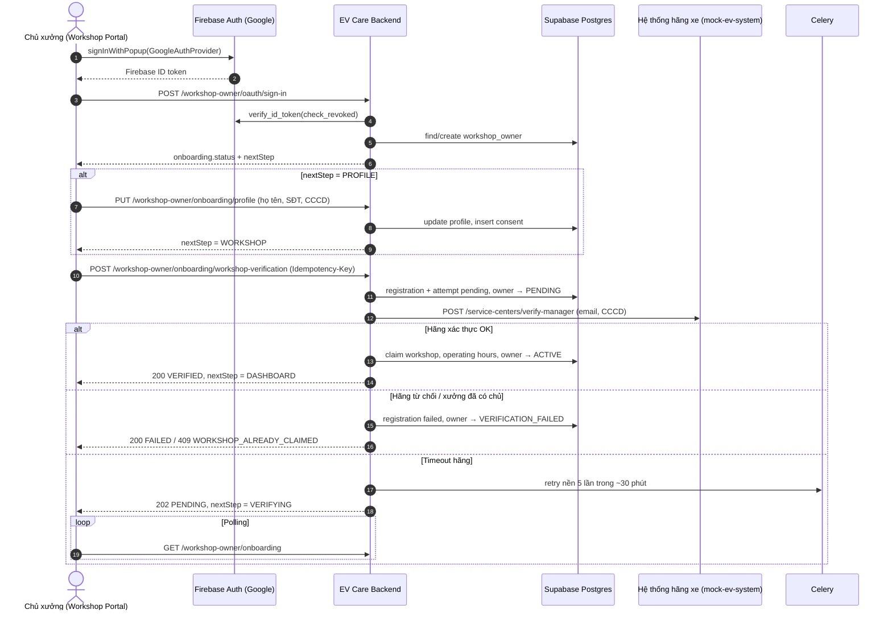
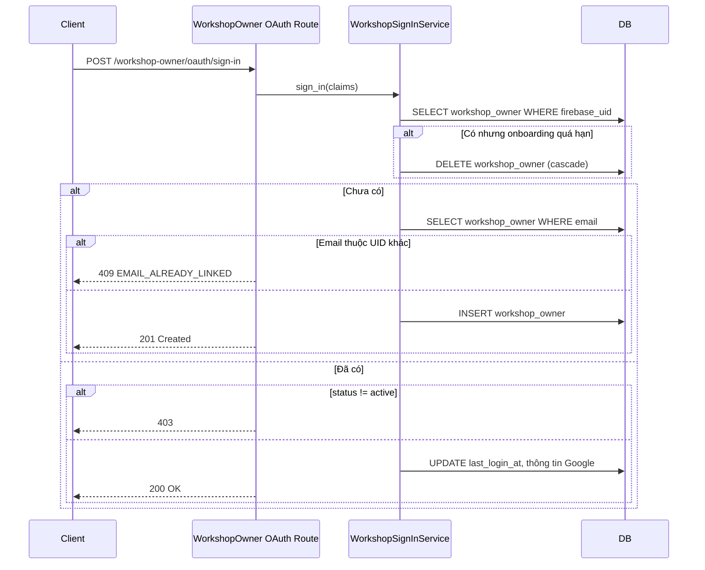
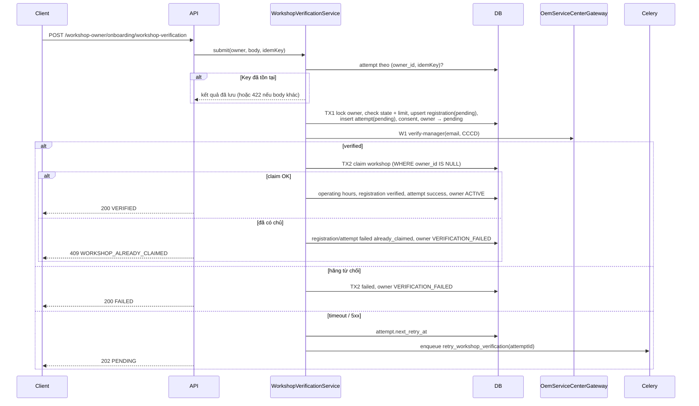

# API Technical Specification — Đăng ký & Onboarding Chủ xưởng dịch vụ qua Google OAuth

> Đặc tả API backend cho Feature `FEAT-AUTH-003` (US-009 → US-012).
>
> **Nguồn nghiệp vụ:** [Functional Spec](../feature-functional/us-009-sprint-1-spec.ff.md) · **Entity:** [Entity Spec](../entity/us-009-sprint-1-spec.entity.md) · **Core:** [core.entity.md](../../entity/core.entity.md)
>
> API Spec **tuân theo** Functional Spec, không định nghĩa lại nghiệp vụ. Envelope, quy ước lỗi, cơ chế xác thực **dùng lại** [API Spec chủ xe (API-SPEC-AUTH-001)](./us-001-sprint-1-spec.api.md) — chỗ giống được tham chiếu, chỗ khác được nêu rõ.

---

# 0. Document Information

| Field | Value |
| --- | --- |
| Document ID | `API-SPEC-AUTH-003` |
| Feature | `FEAT-AUTH-003` |
| Version | `v1.1` |
| Status | `Review` |
| Sprint | `Sprint 1` |
| Owner | Backend Team |
| Author | `[Cần điền]` |
| Base URL | `/api/v1` |
| Created Date | `2026-09-27` |
| Updated Date | `2026-09-27` |

## 0.1 API Catalog

| API ID | Method | Endpoint | Mục đích | FF | Màn hình |
| --- | --- | --- | --- | --- | --- |
| `API-201` | `POST` | `/api/v1/workshop-owner/oauth/sign-in` | Đồng bộ tài khoản chủ xưởng sau đăng nhập Google; tạo mới nếu chưa có; trả bước tiếp theo | US-009, `AC-201`, `AC-207`, `AF-201`→`AF-204`, `BR-201`, `BR-208`, `BR-209` | SCR-201 |
| `API-202` | `GET` | `/api/v1/workshop-owner/onboarding` | Trạng thái + dữ liệu onboarding đã lưu (resume, polling) | `AF-202`, `AF-203`, `EDGE-201`, `EDGE-203` | SCR-202 → SCR-206 |
| `API-203` | `PUT` | `/api/v1/workshop-owner/onboarding/profile` | Lưu họ tên, SĐT, CCCD + consent xử lý dữ liệu | `AC-202`, `BR-210` | SCR-202 |
| `API-204` | `POST` | `/api/v1/workshop-owner/onboarding/workshop-verification` | Lưu thông tin vận hành, gửi Gmail + CCCD sang hãng; thành công → tạo/claim `workshop`, `ACTIVE` | US-010→US-012, `AC-203`→`AC-206`, `AC-208`, `AC-209`, `BR-202`→`BR-207` | SCR-203 → SCR-206 |

> v1.1 bỏ API danh sách xưởng của hãng: chủ xưởng không chọn xưởng — hãng trả về xưởng tương ứng với (Gmail, CCCD).

## 0.2 End-to-end Sequence



---

# C. Common Specification (áp dụng cho API-201 → API-204)

## C.1 Authentication

Giống [API-SPEC-AUTH-001 C.1](./us-001-sprint-1-spec.api.md#c1-authentication): `Authorization: Bearer <firebase_id_token>`, verify bằng Firebase Admin SDK. API-201 verify với `check_revoked=True`; các API còn lại chỉ verify chữ ký + hạn.

> Workshop Portal và app chủ xe dùng **chung Firebase project**. Việc tách tài khoản do **endpoint** quyết định: `/workshop-owner/...` chỉ đọc/ghi `workshop_owner` (`BR-209`).

## C.2 Roles & Onboarding Guard

| Role | Access API-201 → API-204 |
| --- | --- |
| `WORKSHOP_OWNER` (bản ghi `workshop_owner`) | ✅ — chỉ dữ liệu của chính mình |
| Người có token nhưng chưa có `workshop_owner` | API-201 tạo tài khoản; API-202→204 ⇒ `404 WORKSHOP_OWNER_NOT_REGISTERED` |
| `ANONYMOUS` | ❌ `401` |

Giai đoạn này **không có** role ADMIN / Customer Support.

| Dependency | Dùng cho | Kiểm tra | Lỗi |
| --- | --- | --- | --- |
| `get_current_workshop_owner` | API-202 → API-204 | Token hợp lệ; `workshop_owner` tồn tại theo `firebase_uid`; `status = active` | `401`, `404 WORKSHOP_OWNER_NOT_REGISTERED`, `403 ACCOUNT_SUSPENDED/ACCOUNT_INACTIVE` |
| `require_active_workshop_owner` | Mọi API quản lý xưởng sau này | Như trên + `onboarding_status = active` | `403 ONBOARDING_REQUIRED` — `BR-203` |

Không nhận `ownerId` / `workshopId` từ path/body cho các API "của tôi".

## C.3 Response Envelope

Giống [API-SPEC-AUTH-001 C.3](./us-001-sprint-1-spec.api.md#c3-response-envelope): thành công `{ "data": {...} }`; lỗi `{ "error": { "code", "message", "details", "traceId" } }`; `message` tiếng Việt.

## C.4 Naming & Enum Conventions

JSON `camelCase`; enum API `UPPER_SNAKE_CASE` (DB lowercase); thời gian ISO-8601 UTC; giờ trong ngày `HH:mm` (giờ địa phương `Asia/Ho_Chi_Minh`).

| Enum | Values |
| --- | --- |
| `WorkshopOwnerOnboardingStatus` | `ONBOARDING_IN_PROGRESS`, `PENDING_WORKSHOP_VERIFICATION`, `VERIFICATION_FAILED`, `ACTIVE` |
| `WorkshopNextStep` | `PROFILE`, `WORKSHOP`, `VERIFYING`, `DASHBOARD` |
| `AccountStatus` | `ACTIVE`, `INACTIVE`, `SUSPENDED` |
| `WorkshopVerificationStatus` | `PENDING`, `VERIFIED`, `FAILED` |
| `WorkshopVerificationFailureReason` | `MANAGER_NOT_FOUND`, `NATIONAL_ID_MISMATCH`, `ALREADY_CLAIMED`, `OEM_UNAVAILABLE` |
| `ServiceCenterType` | `DEALER`, `SERVICE_ONLY` |
| `WorkshopStatus` | `ACTIVE`, `INACTIVE` |

**Quy tắc `nextStep`**

| Điều kiện | `nextStep` | Màn hình |
| --- | --- | --- |
| `status = ACTIVE` | `DASHBOARD` | Dashboard xưởng |
| `status = PENDING_WORKSHOP_VERIFICATION` | `VERIFYING` | SCR-204 |
| `profileCompleted = false` | `PROFILE` | SCR-202 |
| Còn lại | `WORKSHOP` | SCR-203 / SCR-206 |

## C.5 Shared Objects

### `WorkshopOnboardingState` — trả bởi API-201 → API-204

```json
{
  "status": "ONBOARDING_IN_PROGRESS",
  "nextStep": "PROFILE",
  "profileCompleted": false,
  "profileCompletedAt": null,
  "completedAt": null,
  "expiresAt": "2026-10-12T03:00:00Z"
}
```

| Field | Type | Nullable | Description |
| --- | --- | ---: | --- |
| `status` | `WorkshopOwnerOnboardingStatus` | No | |
| `nextStep` | `WorkshopNextStep` | No | |
| `profileCompleted` | `boolean` | No | Đã hoàn tất SCR-202 |
| `profileCompletedAt` | `datetime` | Yes | |
| `completedAt` | `datetime` | Yes | Thời điểm `ACTIVE` |
| `expiresAt` | `datetime` | Yes | Hạn huỷ onboarding (`BR-208`); `null` khi `ACTIVE` |

### `OperatingHour`

```json
{ "dayOfWeek": 1, "isClosed": false, "openTime": "08:00", "closeTime": "17:30" }
```

| Field | Type | Required | Nullable | Constraints |
| --- | --- | ---: | ---: | --- |
| `dayOfWeek` | `integer` | Yes | No | `1..7` (ISO: 1 = Thứ 2, 7 = Chủ nhật) |
| `isClosed` | `boolean` | Yes | No | |
| `openTime` | `string` | Cond. | Yes | `HH:mm`; bắt buộc khi `isClosed = false`, `null` khi `true` |
| `closeTime` | `string` | Cond. | Yes | Như trên; `> openTime` |

### `WorkshopSummary` — trả bởi API-201 / API-202 (khi `ACTIVE`) và API-204 (khi `VERIFIED`)

```json
{
  "workshopId": "7c1e2d3f-4a5b-4c6d-8e9f-0a1b2c3d4e5f",
  "centerId": "SC-01",
  "name": "VinFast Thăng Long",
  "region": "Hà Nội",
  "type": "DEALER",
  "status": "ACTIVE",
  "address": "Số 8 Phạm Hùng, Mễ Trì, Nam Từ Liêm, Hà Nội",
  "latitude": 21.017,
  "longitude": 105.781,
  "hotline": "02437654321",
  "totalTechnicians": 12,
  "emergencySlotsReserved": 2,
  "operatingHours": [ { "dayOfWeek": 1, "isClosed": false, "openTime": "08:00", "closeTime": "17:30" } ],
  "onboardedAt": "2026-09-27T03:06:12Z"
}
```

## C.6 Error Code Catalog

| Error Code | HTTP | API | Description | FF |
| --- | ---: | --- | --- | --- |
| `INVALID_REQUEST` | `400` | All | Thiếu field / sai kiểu / JSON lỗi | |
| `INVALID_FIELD_FORMAT` | `400` | 203, 204 | Sai định dạng (SĐT, CCCD, hotline, giờ, toạ độ, slot) — `details.field` | `EDGE-204`→`EDGE-206` |
| `CONSENT_REQUIRED` | `400` | 203, 204 | Chưa đồng ý điều khoản | `BR-210` |
| `UNAUTHORIZED` / `INVALID_TOKEN` | `401` | All | Thiếu / sai token | `EF-201` |
| `TOKEN_REVOKED` | `401` | 201 | Token bị thu hồi | `EF-201` |
| `UNSUPPORTED_SIGN_IN_PROVIDER` | `403` | 201 | Provider ≠ `google.com` | |
| `EMAIL_NOT_VERIFIED` | `403` | 201 | Email Google chưa xác minh | |
| `ACCOUNT_SUSPENDED` / `ACCOUNT_INACTIVE` | `403` | All | Tài khoản bị khoá / ngừng | `EF-205` |
| `ONBOARDING_REQUIRED` | `403` | API quản lý xưởng | Chưa `ACTIVE` | `BR-203` |
| `WORKSHOP_OWNER_NOT_REGISTERED` | `404` | 202–204 | Chưa gọi API-201 | |
| `EMAIL_ALREADY_LINKED` | `409` | 201 | Email thuộc chủ xưởng có UID khác | `BR-201` |
| `PHONE_ALREADY_IN_USE` | `409` | 203 | SĐT đã dùng bởi chủ xưởng khác | W-02 |
| `NATIONAL_ID_ALREADY_IN_USE` | `409` | 203 | CCCD đã dùng bởi chủ xưởng khác | W-02, `EDGE-208` |
| `ONBOARDING_ALREADY_COMPLETED` | `409` | 203, 204 | Đã `ACTIVE` | `AF-201` |
| `PROFILE_INCOMPLETE` | `409` | 204 | Chưa hoàn tất bước hồ sơ | |
| `VERIFICATION_IN_PROGRESS` | `409` | 203, 204 | Đang chờ hãng | `AF-203` |
| `WORKSHOP_ALREADY_CLAIMED` | `409` | 204 | Xưởng hãng trả về đã có chủ `ACTIVE` | `BR-202`, `EF-204` |
| `IDEMPOTENCY_KEY_REUSED` | `422` | 204 | Cùng key, body khác | |
| `VERIFICATION_ATTEMPTS_EXCEEDED` | `429` | 204 | Vượt 5 lượt thất bại/24h | `BR-207` |
| `DATABASE_ERROR` / `INTERNAL_SERVER_ERROR` | `500` | All | | |

> Hãng **từ chối** (`MANAGER_NOT_FOUND`, `NATIONAL_ID_MISMATCH`) **không** phải lỗi HTTP — API-204 trả `200` với `verification.status = FAILED`. `ALREADY_CLAIMED` trả `409` vì FE cần hướng tới liên hệ hãng thay vì cho sửa.

## C.7 External Dependency — Hệ thống hãng xe (OEM)

### C.7.1 Endpoint sử dụng

Cấu hình dùng chung với chủ xe: `OEM_API_BASE_URL`, `OEM_API_KEY`, `OEM_API_TIMEOUT_SECONDS=8`.

| # | OEM Endpoint | Có sẵn | Dùng ở | Mục đích |
| --- | --- | --- | --- | --- |
| W1 | `POST /service-centers/verify-manager` | ❌ **bổ sung** | API-204 | Xác thực (Gmail, CCCD) người quản lý, trả xưởng tương ứng |

Lời gọi đặt sau port `OemServiceCenterGateway` để thay bằng API thật mà không đổi service.

### C.7.2 Yêu cầu bổ sung `mock-ev-system`

**Model `ServiceCenter`** — thêm cột (không trả ra ở `GET /service-centers`):

| Field | Kiểu | Mô tả |
| --- | --- | --- |
| `manager_email` | string, unique | Email người quản lý xưởng (lowercase) — một email ↔ một xưởng |
| `manager_national_id` | string | CCCD 12 số của người quản lý |

**Seed** — mỗi xưởng một Gmail test do team kiểm soát (cấu hình được bằng env để đăng nhập Google thật khi test).

**Endpoint W1** (schema ở `shared/ev-contracts`):

```http
POST /service-centers/verify-manager
Content-Type: application/json
```

```json
{ "manager_email": "ha.tran.sc01@gmail.com", "manager_national_id": "001190000101" }
```

Response `200` (luôn `200` khi xử lý được):

```json
{
  "verified": true,
  "failure_reason": null,
  "service_center": { "center_id": "SC-01", "name": "VinFast Thăng Long", "region": "Hà Nội", "type": "dealer" }
}
```

Thất bại: `{"verified": false, "failure_reason": "MANAGER_NOT_FOUND" | "NATIONAL_ID_MISMATCH", "service_center": null}`. Thứ tự: tìm xưởng theo `manager_email` (không có ⇒ `MANAGER_NOT_FOUND`) → so CCCD (khác ⇒ `NATIONAL_ID_MISMATCH`). So sánh sau chuẩn hoá (email lowercase, CCCD chỉ chữ số).

## C.8 Observability (chung)

- Log: `traceId`, `firebaseUid`, `ownerId`, endpoint, status, latency, `attemptId`, `centerId`, latency lời gọi OEM.
- **Không log:** ID token, CCCD, email/SĐT đầy đủ (mask), `fullName`.

---

# API-201 — Sign-in chủ xưởng / Đồng bộ tài khoản

## 1. Overview

### 1.1 API Name

`Workshop Owner Sign-in with Firebase (Google)`

### 1.2 Purpose

Gọi ngay sau khi Workshop Portal đăng nhập Google thành công. Backend verify token, tìm `workshop_owner` theo `firebase_uid`, huỷ nếu onboarding quá hạn, tạo mới nếu chưa có (`ONBOARDING_IN_PROGRESS`), trả trạng thái + bước tiếp theo.

### 1.3 Endpoint

```http
POST /api/v1/workshop-owner/oauth/sign-in
```

### 1.4 HTTP Method

| Property | Value |
| --- | --- |
| Method | `POST` |
| Authentication | Required (Firebase ID token) |
| Authorization | Không yêu cầu role |

### 1.5 Scope

**In:** verify token, chặn provider khác Google & email chưa xác minh; tạo `workshop_owner`; cập nhật `last_login_at`; chặn tài khoản bị khoá; huỷ onboarding quá hạn; ghi log `login` / `login_denied` (FEAT-AUTH-004 — [us-013 API](./us-013-sprint-1-spec.api.md)). **Out:** `vehicle_user` (`BR-209`); đăng xuất ([us-013 API-301](./us-013-sprint-1-spec.api.md)).

## 2. Authentication & Authorization

`check_revoked=True`. `sign_in_provider == "google.com"`, `email_verified == true`; tài khoản đã tồn tại phải `status = active`.

## 3. Request

Header `Authorization`, `X-Request-ID` (tuỳ chọn). Không có body.

## 4. Request Validation

| Validation | Rule | Error |
| --- | --- | --- |
| Header | Có `Authorization: Bearer ...` | `401 UNAUTHORIZED` |
| Token | Chữ ký, hạn, audience | `401 INVALID_TOKEN` |
| Revocation | Chưa thu hồi | `401 TOKEN_REVOKED` |
| Provider | `google.com` | `403 UNSUPPORTED_SIGN_IN_PROVIDER` |
| Email | Có và đã xác minh | `403 EMAIL_NOT_VERIFIED` |

## 5. Internal Processing



1. **Load owner** theo `firebase_uid`.
2. **Huỷ quá hạn** (`BR-208`): `onboarding_status IN ('onboarding_in_progress','verification_failed') AND created_at < now() - ONBOARDING_RETENTION_DAYS` ⇒ `DELETE` cascade, đi tiếp như chủ xưởng mới.
3. **Chưa tồn tại:** email đã thuộc chủ xưởng khác ⇒ `409 EMAIL_ALREADY_LINKED`; ngược lại `INSERT` (`status='active'`, `onboarding_status='onboarding_in_progress'`, `last_login_at=now()`); race unique ⇒ đọc lại; `201`.
4. **Đã tồn tại:** `status ≠ active` ⇒ `403`; `UPDATE last_login_at, display_name, avatar_url, email_verified`; `200`.
5. **Response:** `nextStep` theo C.4; kèm `workshop` (tóm tắt) khi `ACTIVE`.

## 6. Database / Entity Interaction

| Entity / Table | Operation | Purpose |
| --- | --- | --- |
| `workshop_owner` | Read / Insert / Update / Delete | Tìm, tạo, cập nhật, huỷ quá hạn |
| `workshop`, `workshop_operating_hour` | Read | Xưởng của chủ xưởng `ACTIVE` |

## 7. Business Logic

`BR-201` (UID unique), `BR-ENT-202` (email thuộc UID khác ⇒ `409`), `EF-205` (khoá ⇒ `403`), `BR-209` (không đụng `vehicle_user`), `BR-208` (huỷ quá hạn).

## 8. Error Handling

| Case | Error Code | HTTP |
| --- | --- | ---: |
| Token | `UNAUTHORIZED` / `INVALID_TOKEN` / `TOKEN_REVOKED` | `401` |
| Provider / email | `UNSUPPORTED_SIGN_IN_PROVIDER` / `EMAIL_NOT_VERIFIED` | `403` |
| Tài khoản bị khoá / ngừng | `ACCOUNT_SUSPENDED` / `ACCOUNT_INACTIVE` | `403` |
| Email thuộc chủ xưởng khác | `EMAIL_ALREADY_LINKED` | `409` |
| Lỗi hệ thống | `DATABASE_ERROR` / `INTERNAL_SERVER_ERROR` | `500` |

## 9. HTTP Status Codes

`201 Created` (tạo mới) · `200 OK` (đã tồn tại) · `401` / `403` / `409` / `500`.

## 10. Response

```http
201 Created
```

```json
{
  "data": {
    "isNewOwner": true,
    "owner": {
      "ownerId": "3a7e9c10-2b4d-4f61-9a0e-5c8d7b6a1f20",
      "email": "ha.tran.sc01@gmail.com",
      "displayName": "Ha Tran",
      "avatarUrl": "https://lh3.googleusercontent.com/a/...",
      "fullName": null,
      "accountStatus": "ACTIVE",
      "roles": ["WORKSHOP_OWNER"]
    },
    "onboarding": {
      "status": "ONBOARDING_IN_PROGRESS",
      "nextStep": "PROFILE",
      "profileCompleted": false,
      "profileCompletedAt": null,
      "completedAt": null,
      "expiresAt": "2026-10-12T03:00:00Z"
    },
    "workshop": null
  }
}
```

## 11. Response Fields

| Field | Type | Nullable | Description |
| --- | --- | ---: | --- |
| `isNewOwner` | `boolean` | No | `true` nếu vừa tạo |
| `owner.ownerId` | `uuid` | No | ID tài khoản chủ xưởng |
| `owner.email` | `string` | No | Gmail |
| `owner.fullName` | `string` | Yes | `null` nếu chưa qua SCR-202 |
| `owner.accountStatus` | `AccountStatus` | No | Luôn `ACTIVE` khi `2xx` |
| `owner.roles` | `string[]` | No | Luôn `["WORKSHOP_OWNER"]` (suy ra từ bảng) |
| `onboarding` | `WorkshopOnboardingState` | No | C.5 |
| `workshop` | `WorkshopSummary` | Yes | Chỉ khi `ACTIVE` |

## 12. Error Response Examples

```json
{
  "error": {
    "code": "EMAIL_ALREADY_LINKED",
    "message": "Email này đã được liên kết với một tài khoản chủ xưởng khác.",
    "details": null,
    "traceId": "req-w201a"
  }
}
```

## 13–19

Idempotent tự nhiên (lần đầu `201`, sau `200`) · race tạo trùng: unique `firebase_uid`, request thua đọc lại · Firebase Admin SDK, Postgres · P95 `< 800 ms` · Firebase timeout `5s`, không retry · `/api/v1/workshop-owner/oauth/sign-in`.

---

# API-202 — Lấy trạng thái Onboarding chủ xưởng

## 1. Overview

Trả trạng thái và dữ liệu đã lưu để portal **khôi phục đúng bước** (`AF-202`) và **polling** khi chờ hãng (`AF-203`).

```http
GET /api/v1/workshop-owner/onboarding
```

| Property | Value |
| --- | --- |
| Method | `GET` |
| Authentication | Required |
| Authorization | `get_current_workshop_owner` — mọi trạng thái onboarding |

## 5. Internal Processing

1. `get_current_workshop_owner`.
2. Đọc bản nháp `workshop_registration` (`verification_status <> 'verified'`); nếu `ACTIVE` đọc `workshop` + giờ hoạt động.
3. Đọc attempt mới nhất và consent hiện hành.

## 6. Database / Entity Interaction

| Entity / Table | Operation |
| --- | --- |
| `workshop_owner`, `workshop_registration`, `workshop_verification_attempt`, `workshop_owner_consent`, `workshop`, `workshop_operating_hour` | Read |

## 8. Error Handling

`401`, `403 ACCOUNT_SUSPENDED/INACTIVE`, `404 WORKSHOP_OWNER_NOT_REGISTERED`, `500`.

## 10. Response

```http
200 OK
```

```json
{
  "data": {
    "onboarding": {
      "status": "VERIFICATION_FAILED",
      "nextStep": "WORKSHOP",
      "profileCompleted": true,
      "profileCompletedAt": "2026-09-27T03:02:00Z",
      "completedAt": null,
      "expiresAt": "2026-10-12T03:00:00Z"
    },
    "profile": {
      "email": "ha.tran.sc01@gmail.com",
      "fullName": "Trần Thu Hà",
      "phoneNumber": "+84912000101",
      "nationalIdMasked": "001******101"
    },
    "registration": {
      "registrationId": "b1c2d3e4-f5a6-4b7c-8d9e-0f1a2b3c4d5e",
      "address": "Số 8 Phạm Hùng, Mễ Trì, Nam Từ Liêm, Hà Nội",
      "latitude": 21.017,
      "longitude": 105.781,
      "hotline": "02437654321",
      "totalTechnicians": 12,
      "emergencySlotsReserved": 2,
      "operatingHours": [ { "dayOfWeek": 1, "isClosed": false, "openTime": "08:00", "closeTime": "17:30" } ],
      "verificationStatus": "FAILED",
      "failureReason": "NATIONAL_ID_MISMATCH"
    },
    "latestAttempt": {
      "attemptId": "d4e5f6a7-b8c9-4d0e-9f1a-2b3c4d5e6f70",
      "status": "FAILED",
      "failureReason": "NATIONAL_ID_MISMATCH",
      "retryCount": 0,
      "requestedAt": "2026-09-27T03:04:10Z",
      "respondedAt": "2026-09-27T03:04:11Z",
      "failedAttemptsLast24h": 1,
      "maxFailedAttempts": 5
    },
    "consents": {
      "personalDataProcessing": { "granted": true, "policyVersion": "WS-2026-09" },
      "oemDataSharing": { "granted": true, "policyVersion": "WS-2026-09" }
    },
    "workshop": null
  }
}
```

## 11. Response Fields

| Field | Type | Nullable | Description |
| --- | --- | ---: | --- |
| `onboarding` | `WorkshopOnboardingState` | No | C.5 |
| `profile.nationalIdMasked` | `string` | Yes | CCCD dạng mask; không bao giờ trả đầy đủ |
| `registration` | `object` | Yes | `null` khi chưa từng gửi xác thực |
| `latestAttempt` | `object` | Yes | Lượt gần nhất (≤ 15 ngày) |
| `consents` | `object` | No | Consent hiện hành; `null` từng loại nếu chưa có |
| `workshop` | `WorkshopSummary` | Yes | Chỉ khi `ACTIVE` |

## 13–19

`GET` idempotent · P95 `< 200 ms` · polling SCR-204: mỗi `3s` trong 60s đầu, sau đó `30s` · `/api/v1/workshop-owner/onboarding`.

---

# API-203 — Lưu thông tin chủ xưởng

## 1. Overview

Lưu SCR-202: họ tên, SĐT, **CCCD**, consent xử lý dữ liệu cá nhân. Thành công ⇒ hoàn tất bước hồ sơ, `nextStep = WORKSHOP`.

```http
PUT /api/v1/workshop-owner/onboarding/profile
```

## 2. Authentication & Authorization

| Onboarding status | Cho phép | Lỗi |
| --- | --- | --- |
| `ONBOARDING_IN_PROGRESS`, `VERIFICATION_FAILED` | ✅ | |
| `PENDING_WORKSHOP_VERIFICATION` | ❌ | `409 VERIFICATION_IN_PROGRESS` |
| `ACTIVE` | ❌ | `409 ONBOARDING_ALREADY_COMPLETED` |

## 3. Request

```json
{
  "fullName": "Trần Thu Hà",
  "phoneNumber": "0912 000 101",
  "nationalId": "001190000101",
  "personalDataConsent": { "granted": true, "policyVersion": "WS-2026-09" }
}
```

| Field | Type | Required | Constraints |
| --- | --- | ---: | --- |
| `fullName` | `string` | Yes | 2–150 ký tự sau trim; chữ cái Unicode, khoảng trắng, `'`, `-`, `.` |
| `phoneNumber` | `string` | Yes | `^(0\|\+84)(3\|5\|7\|8\|9)[0-9]{8}$` sau bỏ phân cách; lưu E.164 |
| `nationalId` | `string` | Yes | `^[0-9]{12}$` sau bỏ khoảng trắng |
| `personalDataConsent.granted` | `boolean` | Yes | Phải `true` |
| `personalDataConsent.policyVersion` | `string` | Yes | Thuộc danh sách hiện hành (config — do công ty quản lý) |

## 4. Request Validation

| Validation | Error |
| --- | --- |
| Thiếu field | `400 INVALID_REQUEST` |
| Sai định dạng tên/SĐT/CCCD | `400 INVALID_FIELD_FORMAT` |
| Consent | `400 CONSENT_REQUIRED` |
| Trạng thái | `409` (§2) |
| SĐT / CCCD trùng chủ xưởng khác | `409 PHONE_ALREADY_IN_USE` / `409 NATIONAL_ID_ALREADY_IN_USE` |

## 5. Internal Processing

1. `get_current_workshop_owner`; validate + chuẩn hoá.
2. `BEGIN`; `SELECT workshop_owner FOR UPDATE`; kiểm tra lại trạng thái.
3. Kiểm tra trùng SĐT/CCCD với chủ xưởng khác (unique index là chốt chặn cuối).
4. `UPDATE full_name, phone, national_id, profile_completed_at = COALESCE(profile_completed_at, now())`.
5. Ghi consent `personal_data_processing` nếu khác hiện hành.
6. `COMMIT`; trả state. Bước hồ sơ **không** đổi `onboardingStatus`.

## 6. Database / Entity Interaction

`workshop_owner` (Read lock / Update), `workshop_owner_consent` (Read / Insert) — một transaction.

## 10. Response

```json
{
  "data": {
    "onboarding": {
      "status": "ONBOARDING_IN_PROGRESS",
      "nextStep": "WORKSHOP",
      "profileCompleted": true,
      "profileCompletedAt": "2026-09-27T03:02:00Z",
      "completedAt": null,
      "expiresAt": "2026-10-12T03:00:00Z"
    },
    "profile": {
      "email": "ha.tran.sc01@gmail.com",
      "fullName": "Trần Thu Hà",
      "phoneNumber": "+84912000101",
      "nationalIdMasked": "001******101"
    }
  }
}
```

## 12. Error Response Examples

```json
{
  "error": {
    "code": "NATIONAL_ID_ALREADY_IN_USE",
    "message": "Số CCCD đã được sử dụng bởi tài khoản chủ xưởng khác.",
    "details": { "field": "nationalId" },
    "traceId": "req-w203a"
  }
}
```

## 13–19

`PUT` idempotent · lock `workshop_owner FOR UPDATE` tránh ghi đè khi API-204 đang chuyển `PENDING` · P95 `< 300 ms` · không log tên, SĐT, CCCD · `/api/v1/workshop-owner/onboarding/profile`.

---

# API-204 — Gửi xác thực chủ xưởng với hãng

## 1. Overview

### 1.1 API Name

`Submit Workshop Verification`

### 1.2 Purpose

Nhận thông tin vận hành SCR-203 + consent chia sẻ dữ liệu, gửi **Gmail + CCCD** sang hãng. Hãng xác nhận và trả xưởng tương ứng ⇒ claim/tạo `workshop` (core), ghi giờ hoạt động, chủ xưởng `ACTIVE`.

### 1.3 Endpoint

```http
POST /api/v1/workshop-owner/onboarding/workshop-verification
```

### 1.4 HTTP Method

| Property | Value |
| --- | --- |
| Method | `POST` |
| Authentication | Required |
| Authorization | `get_current_workshop_owner` + §2 |
| Idempotency | Required — header `Idempotency-Key` |

### 1.5 Scope

**In:** validate dữ liệu vận hành; giới hạn thất bại; bản nháp + attempt + consent; gọi W1; claim xưởng; retry nền khi hãng timeout. **Out:** chọn xưởng; sửa xưởng sau `ACTIVE`; nhân viên xưởng.

## 2. Authentication & Authorization

| Điều kiện | Lỗi |
| --- | --- |
| `onboardingStatus ∈ {ONBOARDING_IN_PROGRESS, VERIFICATION_FAILED}` | `PENDING_…` ⇒ `409 VERIFICATION_IN_PROGRESS`; `ACTIVE` ⇒ `409 ONBOARDING_ALREADY_COMPLETED` |
| `profileCompleted = true` | `409 PROFILE_INCOMPLETE` |
| `< 5` lượt `failed` trong 24h (không tính `OEM_UNAVAILABLE`) | `429 VERIFICATION_ATTEMPTS_EXCEEDED` + `Retry-After` |

## 3. Request

### Request Headers

| Field | Required | Description |
| --- | ---: | --- |
| `Authorization` | Yes | Bearer token |
| `Content-Type` | Yes | `application/json` |
| `Idempotency-Key` | Yes | UUID v4 — sinh mới mỗi lần user nhấn "Gửi xác thực" |

### Request Body

```json
{
  "address": "Số 8 Phạm Hùng, Mễ Trì, Nam Từ Liêm, Hà Nội",
  "latitude": 21.017,
  "longitude": 105.781,
  "hotline": "024 3765 4321",
  "totalTechnicians": 12,
  "emergencySlotsReserved": 2,
  "operatingHours": [
    { "dayOfWeek": 1, "isClosed": false, "openTime": "08:00", "closeTime": "17:30" },
    { "dayOfWeek": 2, "isClosed": false, "openTime": "08:00", "closeTime": "17:30" },
    { "dayOfWeek": 3, "isClosed": false, "openTime": "08:00", "closeTime": "17:30" },
    { "dayOfWeek": 4, "isClosed": false, "openTime": "08:00", "closeTime": "17:30" },
    { "dayOfWeek": 5, "isClosed": false, "openTime": "08:00", "closeTime": "17:30" },
    { "dayOfWeek": 6, "isClosed": false, "openTime": "08:00", "closeTime": "12:00" },
    { "dayOfWeek": 7, "isClosed": true,  "openTime": null,    "closeTime": null }
  ],
  "oemDataSharingConsent": { "granted": true, "policyVersion": "WS-2026-09" }
}
```

## 3.2 Request Fields

| Field | Type | Required | Nullable | Constraints |
| --- | --- | ---: | ---: | --- |
| `address` | `string` | Yes | No | 5–500 ký tự |
| `latitude` / `longitude` | `number` | No | Yes | `-90..90` / `-180..180`; cùng có hoặc cùng null |
| `hotline` | `string` | Yes | No | §3.3 |
| `totalTechnicians` | `integer` | Yes | No | `1..200` |
| `emergencySlotsReserved` | `integer` | No | No | `0..totalTechnicians`, mặc định `0` |
| `operatingHours` | `OperatingHour[]` | Yes | No | §3.3 |
| `oemDataSharingConsent.granted` | `boolean` | Yes | No | Phải `true` |
| `oemDataSharingConsent.policyVersion` | `string` | Yes | No | Hiện hành |

> Không có `centerId`, không có CCCD trong body: CCCD lấy từ hồ sơ (API-203), Gmail lấy từ token.

## 3.3 Field Technical Specification

### `hotline`

| Property | Value |
| --- | --- |
| Accepted input | Di động/cố định `0` hoặc `+84` + 9–10 số; tổng đài `1900`/`1800` + 4–6 số; cho phép khoảng trắng, `.`, `-` |
| Regex (sau bỏ phân cách) | `^((\+84\|0)[0-9]{9,10}\|(1900\|1800)[0-9]{4,6})$` |
| Stored | Di động → E.164; còn lại giữ chữ số |

### `operatingHours`

* Đúng 7 phần tử, `dayOfWeek` phủ đủ `1..7`, không trùng.
* `isClosed = false` ⇒ `openTime`, `closeTime` dạng `HH:mm`, `closeTime > openTime`. `isClosed = true` ⇒ cả hai `null`.
* Ít nhất 1 ngày mở cửa (`BR-206`).
* Lỗi ⇒ `400 INVALID_FIELD_FORMAT`, `details.field = "operatingHours[5].closeTime"`.

## 4. Request Validation

| Validation | Error |
| --- | --- |
| Thiếu field / header | `400 INVALID_REQUEST` |
| Sai định dạng hotline, toạ độ, giờ, số lượng, slot > KTV | `400 INVALID_FIELD_FORMAT` |
| Consent | `400 CONSENT_REQUIRED` |
| Trạng thái / hồ sơ | `409` (§2) |
| Retry limit | `429` |
| Key dùng lại với body khác | `422 IDEMPOTENCY_KEY_REUSED` |

## 5. Internal Processing

### 5.1 Processing Flow



### 5.2 Processing Steps

1. **Authenticate** — `get_current_workshop_owner`.
2. **Validate & normalize** — §3.3; `request_hash = sha256(canonical_json(normalized body))`.
3. **Idempotency** — attempt theo `(owner_id, idempotency_key)`: hash khớp ⇒ trả kết quả hiện tại; hash khác ⇒ `422`.
4. **TX1** — `SELECT workshop_owner FOR UPDATE`; kiểm tra trạng thái, hồ sơ, retry limit; upsert bản nháp `pending`; insert attempt `pending`; consent `oem_data_sharing` nếu khác hiện hành; owner → `pending_workshop_verification`. Commit trước khi gọi hãng. (Lock hàng `workshop_owner` + partial unique 1 attempt `pending` / owner thay cho Redis lock.)
5. **Gọi hãng** — W1 với `manager_email = owner.email`, `manager_national_id = owner.national_id`; timeout `OEM_API_TIMEOUT_SECONDS`.
6. **TX2 — ghi kết quả** (lock attempt `FOR UPDATE`, bỏ qua nếu không còn `pending`):
   * **VERIFIED** — claim/tạo `workshop` (§6.3): `external_center_id/name/region/type` từ hãng, vận hành từ bản nháp, `owner_id`, `status='active'`, `onboarded_at`, `oem_synced_at`. 0 dòng ⇒ nhánh `already_claimed` ⇒ `409`. Replace 7 dòng giờ hoạt động; registration `verified` (+`workshop_id`, `external_center_id`); attempt `success`; owner `active`, `onboarding_completed_at`.
   * **FAILED** — registration `failed` + reason; attempt `failed`; owner `verification_failed`.
   * **TIMEOUT / 5xx / lỗi mạng** — attempt giữ `pending`, set `next_retry_at`; enqueue job; trả `202`.

### 5.3 Background Job — `retry_workshop_verification`

| Property | Value |
| --- | --- |
| Runner | Celery (`backend/src/celery_tasks.py`) |
| Input | `attempt_id` |
| Lịch retry | `1m`, `2m`, `5m`, `10m`, `12m` sau lần trước — **5 lần, tổng ~30 phút** (`WORKSHOP_VERIFY_RETRY_DELAYS`) |
| Mỗi lần chạy | Attempt không còn `pending` ⇒ bỏ qua. Ngược lại chạy lại bước 5–6; `retry_count += 1` |
| Hết retry | attempt `failed / oem_unavailable`; registration `failed`; owner `verification_failed`. **Không** tính vào retry limit |
| Reconciler | Job 5 phút: attempt `pending` có `next_retry_at < now() - 5m` ⇒ enqueue lại |

## 6. Database / Entity Interaction

### 6.1 Entities Used

| Entity / Table | Operation | Purpose |
| --- | --- | --- |
| `workshop_owner` | Read (lock) / Update | Trạng thái onboarding; nguồn email + CCCD |
| `workshop_registration` | Read / Insert / Update | Bản nháp, kết quả |
| `workshop_verification_attempt` | Read / Insert / Update | Idempotency, retry limit, log |
| `workshop_owner_consent` | Read / Insert | Consent chia sẻ cho hãng |
| `workshop` (core) | Insert / Update | Claim xưởng |
| `workshop_operating_hour` | Delete / Insert | Giờ hoạt động |

### 6.2 Read Data

```sql
SELECT count(*) FROM workshop_verification_attempt
WHERE owner_id = :ownerId AND status = 'failed'
  AND failure_reason <> 'oem_unavailable'
  AND requested_at > now() - interval '24 hours';
```

### 6.3 Write Data

```sql
-- TX2 (VERIFIED): claim hoặc tạo workshop — chỉ thành công khi xưởng chưa có chủ
INSERT INTO workshop (id, external_center_id, name, region, type, address, total_technicians,
                      emergency_slots_reserved, status, owner_id, hotline, latitude, longitude,
                      onboarded_at, oem_synced_at)
VALUES (:id, :centerId, :oemName, :oemRegion, :oemType, :address, :tech, :emergency,
        'active', :ownerId, :hotline, :lat, :lng, now(), now())
ON CONFLICT (external_center_id) DO UPDATE
SET name = EXCLUDED.name, region = EXCLUDED.region, type = EXCLUDED.type,
    address = EXCLUDED.address, total_technicians = EXCLUDED.total_technicians,
    emergency_slots_reserved = EXCLUDED.emergency_slots_reserved, status = 'active',
    owner_id = EXCLUDED.owner_id, hotline = EXCLUDED.hotline,
    latitude = EXCLUDED.latitude, longitude = EXCLUDED.longitude,
    onboarded_at = now(), oem_synced_at = now(), updated_at = now()
WHERE workshop.owner_id IS NULL
RETURNING id;
```

## 7. Business Logic

| Rule | Nội dung |
| --- | --- |
| 1 — `BR-204` | `ACTIVE` chỉ set ở TX2 nhánh VERIFIED + claim OK |
| 2 — `BR-204` | Hãng quyết định: `MANAGER_NOT_FOUND` → `NATIONAL_ID_MISMATCH`; backend không tự đối chiếu |
| 3 — `BR-202` | Claim có điều kiện `WHERE workshop.owner_id IS NULL`; một chủ một xưởng (`ux_workshop_owner`) |
| 4 — `BR-205` | `name/region/type` luôn từ response W1, chỉ lúc onboarding |
| 5 — `BR-207` | 5 lượt `failed`/24h, không tính `OEM_UNAVAILABLE`; `Retry-After` = giây đến khi lượt cũ nhất trong cửa sổ hết hạn |
| 6 | Thất bại nghiệp vụ trả `200` (C.6) |

## 8. Error Handling

| Case | Error Code | HTTP |
| --- | --- | ---: |
| Thiếu field / header | `INVALID_REQUEST` | `400` |
| Sai định dạng | `INVALID_FIELD_FORMAT` | `400` |
| Chưa đồng ý chia sẻ | `CONSENT_REQUIRED` | `400` |
| Token / khoá | `401` / `403` | |
| Chưa sign-in | `WORKSHOP_OWNER_NOT_REGISTERED` | `404` |
| Chưa xong hồ sơ | `PROFILE_INCOMPLETE` | `409` |
| Đang chờ hãng | `VERIFICATION_IN_PROGRESS` | `409` |
| Đã `ACTIVE` | `ONBOARDING_ALREADY_COMPLETED` | `409` |
| Xưởng đã có chủ | `WORKSHOP_ALREADY_CLAIMED` | `409` |
| Key dùng lại với body khác | `IDEMPOTENCY_KEY_REUSED` | `422` |
| Vượt lượt thất bại | `VERIFICATION_ATTEMPTS_EXCEEDED` | `429` |

## 9. HTTP Status Codes

`200 OK` (`VERIFIED` / `FAILED`) · `202 Accepted` (`PENDING`, retry nền) · `400` / `401` / `403` / `404` / `409` / `422` / `429` / `500`.

## 10. Response

### 10.1 VERIFIED

```http
200 OK
```

```json
{
  "data": {
    "onboarding": {
      "status": "ACTIVE",
      "nextStep": "DASHBOARD",
      "profileCompleted": true,
      "profileCompletedAt": "2026-09-27T03:02:00Z",
      "completedAt": "2026-09-27T03:06:12Z",
      "expiresAt": null
    },
    "verification": {
      "attemptId": "d4e5f6a7-b8c9-4d0e-9f1a-2b3c4d5e6f70",
      "status": "VERIFIED",
      "failureReason": null,
      "failedAttemptsLast24h": 1,
      "maxFailedAttempts": 5
    },
    "workshop": {
      "workshopId": "7c1e2d3f-4a5b-4c6d-8e9f-0a1b2c3d4e5f",
      "centerId": "SC-01",
      "name": "VinFast Thăng Long",
      "region": "Hà Nội",
      "type": "DEALER",
      "status": "ACTIVE",
      "address": "Số 8 Phạm Hùng, Mễ Trì, Nam Từ Liêm, Hà Nội",
      "latitude": 21.017,
      "longitude": 105.781,
      "hotline": "02437654321",
      "totalTechnicians": 12,
      "emergencySlotsReserved": 2,
      "operatingHours": [ { "dayOfWeek": 1, "isClosed": false, "openTime": "08:00", "closeTime": "17:30" } ],
      "onboardedAt": "2026-09-27T03:06:12Z"
    }
  }
}
```

### 10.2 FAILED (hãng từ chối)

```json
{
  "data": {
    "onboarding": { "status": "VERIFICATION_FAILED", "nextStep": "WORKSHOP", "profileCompleted": true,
                    "profileCompletedAt": "2026-09-27T03:02:00Z", "completedAt": null,
                    "expiresAt": "2026-10-12T03:00:00Z" },
    "verification": { "attemptId": "e5f6a7b8-c9d0-4e1f-8a2b-3c4d5e6f7081", "status": "FAILED",
                      "failureReason": "MANAGER_NOT_FOUND", "failedAttemptsLast24h": 2, "maxFailedAttempts": 5 },
    "workshop": null
  }
}
```

### 10.3 PENDING (hãng timeout)

```http
202 Accepted
```

Cùng cấu trúc, `onboarding.status = PENDING_WORKSHOP_VERIFICATION`, `nextStep = VERIFYING`, `verification.status = PENDING`.

## 11. Response Fields

| Field | Type | Nullable | Description |
| --- | --- | ---: | --- |
| `onboarding` | `WorkshopOnboardingState` | No | C.5 |
| `verification.attemptId` | `uuid` | No | |
| `verification.status` | `WorkshopVerificationStatus` | No | |
| `verification.failureReason` | `WorkshopVerificationFailureReason` | Yes | Khi `FAILED` |
| `verification.failedAttemptsLast24h` / `maxFailedAttempts` | `integer` | No | |
| `workshop` | `WorkshopSummary` | Yes | Chỉ khi `VERIFIED` |

### 11.1 `failureReason` → thông điệp FE (SCR-206)

| Value | Gợi ý hiển thị | Hành động |
| --- | --- | --- |
| `MANAGER_NOT_FOUND` | Gmail đang đăng nhập chưa được hãng ghi nhận là người quản lý xưởng nào | Đăng nhập đúng Gmail / liên hệ hãng |
| `NATIONAL_ID_MISMATCH` | CCCD không khớp với người quản lý xưởng | Sửa CCCD (SCR-202) |
| `ALREADY_CLAIMED` | Xưởng đang được quản lý bởi tài khoản khác | Liên hệ hãng |
| `OEM_UNAVAILABLE` | Hệ thống hãng không phản hồi | Gửi lại sau |

## 12. Error Response Examples

```http
409 Conflict
```

```json
{
  "error": {
    "code": "WORKSHOP_ALREADY_CLAIMED",
    "message": "Xưởng này đang được quản lý bởi một tài khoản khác. Vui lòng liên hệ hãng.",
    "details": { "attemptId": "0a1b2c3d-4e5f-4a6b-8c7d-9e0f1a2b3c4d" },
    "traceId": "req-w204b"
  }
}
```

```http
429 Too Many Requests
Retry-After: 5400
```

```json
{
  "error": {
    "code": "VERIFICATION_ATTEMPTS_EXCEEDED",
    "message": "Bạn đã xác thực thất bại quá 5 lần trong 24 giờ. Vui lòng thử lại sau.",
    "details": { "retryAfterSeconds": 5400 },
    "traceId": "req-w204c"
  }
}
```

## 13. Idempotency

`Required: Yes` — `Idempotency-Key` (UUID v4), lưu ở `workshop_verification_attempt (owner_id, idempotency_key)` + `request_hash`. Cùng key + cùng body ⇒ trả kết quả hiện tại, không gọi hãng lại. Cùng key + body khác ⇒ `422`.

## 14. Concurrency / Race Condition

| Tình huống | Giải pháp |
| --- | --- |
| Double-submit | Lock `workshop_owner FOR UPDATE` trong TX1 + partial unique 1 attempt `pending`/owner |
| Hai chủ xưởng cùng được hãng trả một xưởng | Claim có điều kiện `WHERE workshop.owner_id IS NULL`; người thua `409` |
| Job retry và request cùng ghi | TX2 lock attempt, bỏ qua nếu không còn `pending` |

## 15–19

Hãng (W1), Postgres, Celery · C.8 · P95 `< 500 ms` (không tính chờ hãng) · API timeout `10s`, W1 `8s` · `/api/v1/workshop-owner/onboarding/workshop-verification`.

---

# 23. Change Log

| Version | Date | Author | Changes |
| --- | --- | --- | --- |
| `v1.0` | `2026-09-27` | `[Cần điền]` | Bản nháp: 5 API cho đăng ký & onboarding chủ xưởng |
| `v1.1` | `2026-09-27` | `[Cần điền]` | Xác thực Gmail + CCCD (API-203 thêm `nationalId`); bỏ API danh sách xưởng — hãng trả xưởng; `API-205` → `API-204`, bỏ `centerId`/MST; lỗi `NATIONAL_ID_ALREADY_IN_USE`; lý do `MANAGER_NOT_FOUND`, `NATIONAL_ID_MISMATCH`; retry hãng 5 lần/~30 phút; bỏ role ADMIN/CS |

---

# 24. Open Questions

| ID | Question | Status |
| --- | --- | --- |
| `Q-A201` | Rule xác thực | **Closed** — (Gmail, CCCD) ↔ đúng một xưởng |
| `Q-A202` | Gmail vừa chủ xe vừa chủ xưởng | **Closed** — được, 2 tài khoản riêng |
| `Q-A203` | Hợp nhất bảng tài khoản | **Closed** — không |
| `Q-A204` | Prefix endpoint | **Closed** — `/api/v1/workshop-owner/...` |
| `Q-A205` | Giờ hoạt động | **Closed** — 1 khung/ngày |
| `Q-A206` | Hãng timeout | **Closed** — retry 5 lần/~30 phút rồi trả lỗi |
| `Q-A207` | Điều khoản consent | **Closed** — công ty quản lý; backend giữ danh sách phiên bản bằng config |
| `Q-A208` | Phân trang danh sách xưởng | **Closed** — không còn API danh sách |

---

# 25. References

* Functional Spec: [us-009-sprint-1-spec.ff.md](../feature-functional/us-009-sprint-1-spec.ff.md)
* Entity Spec: [us-009-sprint-1-spec.entity.md](../entity/us-009-sprint-1-spec.entity.md)
* Core Entity: [core.entity.md](../../entity/core.entity.md)
* API Spec chủ xe: [us-001-sprint-1-spec.api.md](./us-001-sprint-1-spec.api.md), [us-005-sprint-1-spec.api.md](./us-005-sprint-1-spec.api.md)
* ERD hãng (mock): [proposed_erd.latest.md](../../mock-system/proposed_erd.latest.md)
* Mock OEM: `backend/mock-ev-system/src/mock_ev_system/routers/verify.py`
