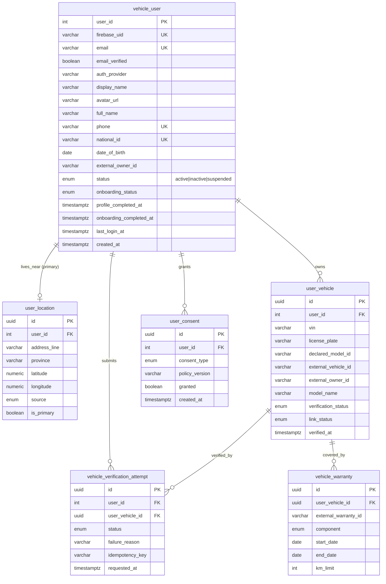
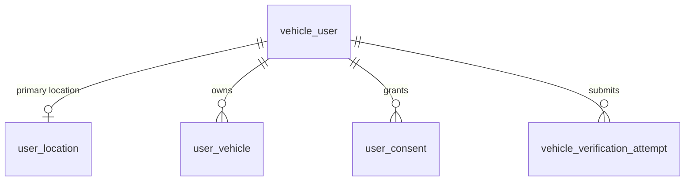
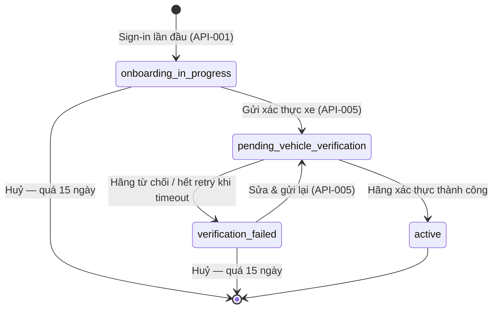
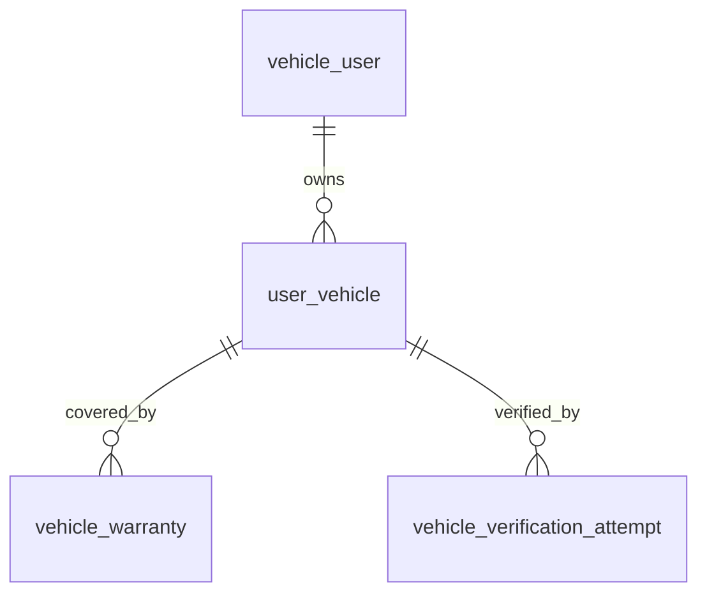
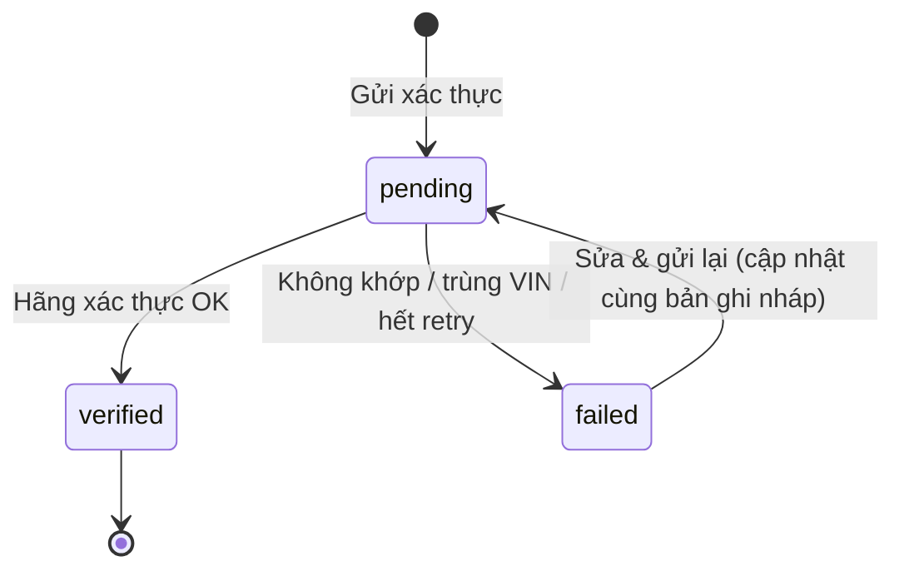
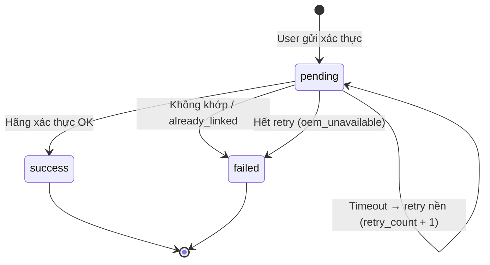

# Entity Specification — Đăng ký & Onboarding người dùng mới qua Google OAuth

> Đặc tả các entity phục vụ Feature `FEAT-AUTH-001` (US-001 → US-004).
>
> **Nguồn nghiệp vụ:** [Functional Spec](../feature-functional/us-001-sprint-1-spec.ff.md). Tài liệu này **không định nghĩa lại nghiệp vụ**; mọi rule ở đây đều trỏ về `BR-xxx` / `EF-xxx` / `EDGE-xxx` trong Functional Spec.
>
> **Quy ước đánh dấu:** `[Cần xác nhận]` = còn chờ Product/Stakeholder trả lời · `[Đề xuất v1.1]` = đề xuất kỹ thuật mới phát sinh ở v1.1, cần review. Các đề xuất ở v1.0 đã được duyệt.
>
> **API liên quan:** [API Spec](../api/us-001-sprint-1-spec.api.md)

---

# 0. Document Information

| Field            | Value                                                          |
| ---------------- | -------------------------------------------------------------- |
| Document ID      | `ENT-SPEC-AUTH-001`                                            |
| Feature          | `FEAT-AUTH-001` — Đăng ký & Onboarding qua Google OAuth        |
| Version          | `v1.1`                                                         |
| Status           | `Review`                                                       |
| Owner            | Backend Team                                                   |
| Author           | `[Cần điền]`                                                   |
| Database         | PostgreSQL (Supabase), schema `public`, migration bằng Alembic |
| Created Date     | `2026-09-27`                                                   |
| Updated Date     | `2026-09-27`                                                   |

## 0.1 Quyết định đã chốt (v1.1)

| # | Quyết định | Ảnh hưởng |
| --- | --- | --- |
| D-01 | Xác thực chủ xe dựa **hoàn toàn** vào hệ thống hãng (`mock-ev-system`): **Gmail đăng nhập** phải trùng email chủ xe đăng ký với hãng **và** **CCCD** người dùng nhập ở onboarding phải trùng CCCD chủ xe. SĐT làm lớp xác thực thứ 2 — **để sau**. | Thêm `vehicle_user.national_id`; lý do thất bại `owner_email_mismatch`, `national_id_mismatch`; mock cần bổ sung (API Spec C.7.2) |
| D-02 | Model người dùng khai báo khác model của hãng ⇒ **xác thực thất bại**. | Lý do thất bại `model_mismatch` |
| D-03 | Số điện thoại **unique** giữa các tài khoản. | Giữ unique index `phone` |
| D-04 | Onboarding dang dở và log xác thực được lưu **15 ngày**; quá hạn ⇒ **huỷ onboarding**. | Job dọn dữ liệu; `expiresAt` trong API |
| D-05 | Role hệ thống gồm chủ xe, xưởng, nhân viên xưởng — **triển khai ở phase 4**. Feature này chỉ tập trung onboarding cho chủ xe. | Bỏ `user_role` khỏi scope sprint này |
| D-06 | Một tài khoản **có thể có nhiều xe**; mọi xe đều phải thuộc **cùng một chủ xe bên hãng** — chủ xe được xác định bằng Gmail dùng để đăng nhập. | `user_vehicle` quan hệ 1:N; bỏ ràng buộc 1 xe/tài khoản |
| D-07 | Các đề xuất v1.0 (tách `onboarding_status`, retry nền khi hãng timeout, giới hạn 5 lần thất bại/24h, địa điểm bắt buộc, consent...) được duyệt. | Bỏ nhãn `[Đề xuất]` tương ứng |

---

# 1. Entity Catalog

| Entity ID | Entity                       | Table                          | Trạng thái           | Mục đích                                                                  |
| --------- | ---------------------------- | ------------------------------ | -------------------- | ------------------------------------------------------------------------- |
| `ENT-001` | `VehicleUser`                | `vehicle_user`                 | **Có sẵn — mở rộng** | Tài khoản chủ xe: định danh Firebase, hồ sơ cá nhân (gồm CCCD), trạng thái onboarding |
| `ENT-002` | `UserLocation`               | `user_location`                | **Mới**              | Địa điểm gần đó (khu vực sinh sống/hoạt động) — `BR-005`                  |
| `ENT-003` | `UserVehicle`                | `user_vehicle`                 | **Mới**              | Các xe của tài khoản + snapshot kỹ thuật lấy từ hãng sau xác thực         |
| `ENT-004` | `VehicleWarranty`            | `vehicle_warranty`             | **Mới**              | Thông tin bảo hành đồng bộ từ hãng sau xác thực thành công (`AC-003`)     |
| `ENT-005` | `VehicleVerificationAttempt` | `vehicle_verification_attempt` | **Mới**              | Nhật ký từng lần gửi xác thực xe sang hãng (retry, idempotency, audit)    |
| `ENT-006` | `UserConsent`                | `user_consent`                 | **Mới**              | Đồng ý xử lý dữ liệu cá nhân & chia sẻ dữ liệu xe cho hãng (mục 21 FF)    |
| —         | `Role`                       | `roles`                        | Có sẵn — **không dùng trong feature này** | Phân quyền chủ xe / xưởng / nhân viên xưởng — phase 4 (D-05) |

**Entity bên ngoài (không lưu trong app DB, chỉ đọc qua HTTP):** `Owner`, `Vehicle`, `VehicleModel`, `Warranty`, `WarrantyPolicy` của hệ thống hãng xe — xem [proposed_erd.md](../../entity/proposed_erd.md) và `backend/mock-ev-system`.

### Vì sao tách như vậy?

- **Trạng thái onboarding nằm trên `VehicleUser`**, không nằm trên `UserVehicle`: Functional Spec định nghĩa `ONBOARDING_IN_PROGRESS / PENDING_VEHICLE_VERIFICATION / VERIFICATION_FAILED / ACTIVE` là trạng thái **tài khoản** (mục 13). `UserVehicle` chỉ giữ trạng thái xác thực của **từng xe** (`PENDING / VERIFIED / FAILED` — `TERM-005`).
- **Không tạo bảng `UserProfile` riêng**: quan hệ 1–1, dữ liệu ít, luôn đọc cùng tài khoản → gộp vào `vehicle_user`.
- **CCCD nằm trên `VehicleUser`**, không nằm trên `UserVehicle`: CCCD định danh **người**, dùng chung để xác thực mọi xe của tài khoản (D-01, D-06).
- **`UserLocation` tách bảng**: có toạ độ phục vụ truy vấn gần nhất, dễ mở rộng nhiều địa điểm.
- **`VehicleVerificationAttempt` tách bảng**: cần cho retry limit (`BR-006`), timeout (`EF-002`), idempotency và tra cứu case kẹt onboarding.
- **`UserConsent` tách bảng, append-only**: yêu cầu pháp lý (NĐ 13/2023) cần lưu vết thời điểm và phiên bản điều khoản.

---

# 2. ER Diagram



---

# 3. Quy ước chung

| Chủ đề | Quy ước |
| --- | --- |
| Tên bảng / cột | `snake_case`, số ít (theo bảng có sẵn `vehicle_user`). |
| Tên field ở API | `camelCase` (xem API Spec). Mapping thực hiện ở Pydantic schema. |
| Primary key | `vehicle_user.user_id` giữ `integer` identity như hiện tại. Bảng mới dùng `uuid` (sinh ở app bằng `uuid4`, giống `roles.id`). |
| Enum | Lưu **lowercase** trong DB (theo convention hiện tại của `user_status_enum`). API trả **UPPER_SNAKE_CASE** theo Functional Spec (DB `pending_vehicle_verification` ↔ API `PENDING_VEHICLE_VERIFICATION`). |
| Thời gian | `timestamptz`, lưu UTC. `date` cho ngày sinh, ngày bảo hành. |
| Audit | Bảng thường có `created_at`, `updated_at` (`server_default now()`, `onupdate now()`); bảng append-only (`user_consent`, `vehicle_verification_attempt`) chỉ có mốc thời gian nghiệp vụ. |
| Chuẩn hoá dữ liệu | `email` lowercase; `phone` E.164 (`+84xxxxxxxxx`); `national_id` chỉ chữ số; `vin` uppercase; `license_plate` uppercase, bỏ khoảng trắng, `.` và `-` (`29A-444.44` → `29A44444`). Chuẩn hoá ở service **trước khi** lưu và so sánh. |
| Truy cập DB | Backend kết nối trực tiếp PostgreSQL (SQLModel/SQLAlchemy). Không dùng Supabase REST/PostgREST từ client cho các bảng này. Bật RLS và **không tạo policy** để chặn truy cập bằng `anon key`. |
| Xoá dữ liệu | Tài khoản onboarding quá hạn 15 ngày bị **hard delete** (cascade) — D-04. Tài khoản `active` không bị xoá trong scope này; `UserVehicle` gỡ liên kết bằng `link_status = unlinked`. |

---

# 4. Hiện trạng code & thay đổi cần thực hiện

## 4.1 Đã có

| Thành phần | Vị trí | Ghi chú |
| --- | --- | --- |
| Model `VehicleUser` | `backend/src/common/core/identity/vehicle_user.py` | `user_id`, `firebase_uid`, `email`, `phone`, `password_hash`, `external_owner_id`, `status`, `created_at`, `updated_at`, `last_login_at` |
| Model `Role` | `backend/src/modules/authorization/domain.py` | `roles` với `RoleCode` = `vehicle_user / workshop_owner / maintenance_staff` — dùng ở phase 4 |
| Migration | `backend/alembic/versions/272915ecc478_create_authorization_tables.py` | Tạo `roles`, `vehicle_user` |
| Seed | `backend/seed.sql` | 3 role, 5 user demo |
| Xác thực token | `backend/src/modules/oauth/dependency.py` | `verify_firebase_token` → `auth.verify_id_token()`; lỗi trả `401` |
| Endpoint | `GET /api/v1/oauth/profile` | Chỉ trả `uid`, `email` từ token, **chưa đọc/ghi DB** |
| Module rỗng | `backend/src/modules/user_vehicle/` | Chưa có code |
| Mock hãng | `backend/mock-ev-system` | `Owner` đã có `email`, `phone`, `national_id`; **chưa có** endpoint xác thực quyền sở hữu |

## 4.2 Gap so với Functional Spec

| # | Gap | Đề xuất |
| --- | --- | --- |
| G-01 | Không có trạng thái onboarding | Thêm cột `onboarding_status` (ENT-001) — tách biệt với `status` (trạng thái khoá tài khoản) |
| G-02 | Thiếu field hồ sơ | Thêm `full_name`, `date_of_birth`, `display_name`, `avatar_url`, **`national_id`** vào `vehicle_user` |
| G-03 | `external_owner_id` là `integer` | Đổi sang `varchar(64)` — `owner_id` của hãng là string (`OWN-001`) |
| G-04 | `password_hash` không còn ý nghĩa (chỉ đăng nhập Google) | Ngừng sử dụng, xoá ở migration sau |
| G-05 | Chưa có bảng xe / bảo hành / địa điểm / consent / log xác thực | Thêm ENT-002 → ENT-006 |
| G-06 | Chưa có cơ chế huỷ onboarding quá hạn | Job dọn dữ liệu hằng ngày (ENT-001 §16) |
| G-07 | Mock hãng chưa có API xác thực quyền sở hữu; email chủ xe trong seed là `@example.com` nên không đăng nhập Google để test được | Bổ sung mock — xem [API Spec C.7.2](../api/us-001-sprint-1-spec.api.md#c72-yêu-cầu-bổ-sung-mock-ev-system) |
| G-08 | Phân quyền theo role | **Không làm ở sprint này** (phase 4 — D-05). Mọi bản ghi `vehicle_user` mặc nhiên là chủ xe |

## 4.3 Kế hoạch migration

Một revision Alembic mới (`down_revision = 272915ecc478`), tên `add_onboarding_tables`:

1. `CREATE TYPE onboarding_status_enum`; `ALTER TABLE vehicle_user ADD COLUMN ...` (các cột mới ở ENT-001). `onboarding_status` có `server_default 'onboarding_in_progress'`.
2. `ALTER COLUMN external_owner_id TYPE varchar(64) USING external_owner_id::varchar`.
3. `CREATE UNIQUE INDEX ix_vehicle_user_national_id ON vehicle_user (national_id)`.
4. Tạo `user_location`, `user_vehicle`, `vehicle_warranty`, `vehicle_verification_attempt`, `user_consent` cùng enum và index (xem từng entity).
5. Cập nhật `seed.sql`: user demo `active` phải có `national_id` + ít nhất 1 `user_vehicle` đã verify, hoặc chuyển về `onboarding_in_progress`. Email/CCCD của user demo nên khớp `Owner` trong mock để test được luồng xác thực.

---

# 5. Mapping Data Requirements (FF mục 14.1) → Entity

| Data (FF) | Entity.field | Ghi chú |
| --- | --- | --- |
| `google_uid` | `VehicleUser.firebase_uid` | Firebase UID (claim `uid`) |
| `email` | `VehicleUser.email` | Claim `email`, lowercase — **cũng là khoá xác thực chủ xe với hãng** (D-01) |
| `display_name` | `VehicleUser.display_name` | Claim `name` |
| `full_name` | `VehicleUser.full_name` | User nhập ở SCR-002 |
| `phone_number` | `VehicleUser.phone` | User nhập, E.164, unique |
| `national_id` | `VehicleUser.national_id` | **Mới (v1.1)** — CCCD 12 số, user nhập ở SCR-002, đối chiếu với hãng |
| `date_of_birth` | `VehicleUser.date_of_birth` | Tuỳ chọn |
| `location` | `UserLocation.*` | Địa chỉ text + toạ độ tuỳ chọn |
| `license_plate` | `UserVehicle.license_plate` | Chuẩn hoá |
| `vin` | `UserVehicle.vin` | 17 ký tự |
| `vehicle_model` | `UserVehicle.declared_model_id` (user chọn) → phải khớp `external_model_id` (hãng) | Không khớp ⇒ thất bại (D-02) |
| `vehicle_year` | `UserVehicle.production_year` / `manufacture_date` | Từ hãng |
| `warranty_info` | `VehicleWarranty.*` | Mỗi component một bản ghi |
| `verification_status` | `UserVehicle.verification_status` + `VehicleUser.onboarding_status` | Hai cấp: xe và tài khoản |

---

# ENT-001 — VehicleUser

## 1. Entity Information

| Field         | Value                                             |
| ------------- | ------------------------------------------------- |
| Entity ID     | `ENT-001`                                         |
| Entity Name   | `VehicleUser`                                     |
| Business Name | Tài khoản chủ xe điện                             |
| Table         | `vehicle_user`                                    |
| Version       | `v1.1`                                            |
| Status        | `Review` (bảng đã tồn tại, bổ sung cột)           |
| Owner         | Backend Team                                      |

## 2. Entity Overview

### 2.1 Description

Tài khoản của chủ xe điện trong EV Care, được tạo lần đầu khi người dùng đăng nhập Google thành công qua Firebase. Chứa định danh Firebase, hồ sơ cá nhân (gồm CCCD) và trạng thái onboarding.

### 2.2 Business Purpose

- Liên kết 1–1 giữa tài khoản Google/Firebase và tài khoản hệ thống (`BR-001`).
- Là **danh tính dùng để xác thực với hãng**: Gmail + CCCD phải khớp chủ xe bên hãng (D-01).
- Quyết định điều hướng sau đăng nhập: Home / tiếp tục Onboarding / tạo mới (`AF-001`, `AF-002`, `AC-001`, `AC-005`).
- Chặn truy cập tính năng chính khi chưa `ACTIVE` (`BR-003`).

### 2.3 Scope

**In Scope**

* Định danh Firebase, email, thông tin hiển thị từ Google.
* Hồ sơ cá nhân nhập ở onboarding (họ tên, SĐT, CCCD, ngày sinh).
* Trạng thái onboarding, trạng thái khoá tài khoản, huỷ onboarding quá hạn.

**Out of Scope**

* Mật khẩu / đăng nhập email-password (mục 3.2 FF).
* Cập nhật hồ sơ sau onboarding (feature khác — `TERM-001`).
* Role / phân quyền (phase 4).

## 3. Business Meaning

### Definition

Một `VehicleUser` là một người đã đăng nhập ứng dụng ít nhất một lần bằng tài khoản Google. Tài khoản chỉ được xem là "đã đăng ký hoàn tất" khi `onboarding_status = active`. Tài khoản chưa `active` sau 15 ngày kể từ khi tạo sẽ bị huỷ.

### Example

Anh Phạm Minh Dũng đăng ký VF6 Plus với hãng bằng Gmail `dung.pham@gmail.com`, CCCD `079200001004`. Anh đăng nhập EV Care bằng đúng Gmail đó → hệ thống tạo `vehicle_user` (`onboarding_in_progress`). Anh nhập hồ sơ + CCCD, khai báo xe → hãng xác nhận Gmail và CCCD trùng chủ xe → `onboarding_status = active`, `external_owner_id = OWN-004`.

### Terminology

* Related term: `TERM-001` Onboarding, `TERM-004` Firebase Authentication.
* See glossary: [FF mục 22](../feature-functional/us-001-sprint-1-spec.ff.md#22-terminology--glossary)

## 4. Identity & Keys

### 4.1 Primary Key

| Field     | Type      | Description                    |
| --------- | --------- | ------------------------------ |
| `user_id` | `integer` | Định danh nội bộ, auto increment |

**Rules**

* Unique, not null, sinh bởi DB (identity/serial).
* Không dùng `user_id` làm định danh xác thực — định danh xác thực là `firebase_uid`.

### 4.2 Candidate / Unique Keys

| Field          | Unique | Description |
| -------------- | -----: | ----------- |
| `firebase_uid` |    Yes | Khoá tra cứu chính khi đăng nhập (`BR-001`) |
| `email`        |    Yes | Email Google, lowercase. Chặn 2 Firebase UID dùng chung email (`BR-001`) |
| `phone`        |    Yes | Unique giữa các tài khoản (D-03) |
| `national_id`  |    Yes | Một CCCD chỉ gắn một tài khoản `[Đề xuất v1.1]` — hệ quả của "một người một tài khoản" |

## 5. Attributes

| Field | Type | Required | Nullable | Default | Description | Constraints |
| --- | --- | ---: | ---: | --- | --- | --- |
| `user_id` | `integer` | Yes | No | identity | ID nội bộ | PK |
| `firebase_uid` | `varchar(128)` | Yes | No | - | Firebase UID | Unique · **có sẵn** |
| `email` | `varchar(255)` | Yes* | Yes | - | Email đăng nhập (Gmail) | Unique, lowercase · **có sẵn** |
| `email_verified` | `boolean` | Yes | No | `false` | Email đã được Google xác minh | **Mới** |
| `auth_provider` | `varchar(32)` | Yes | No | `'google.com'` | Provider đăng nhập (claim `firebase.sign_in_provider`) | **Mới** |
| `display_name` | `varchar(255)` | No | Yes | - | Tên hiển thị từ Google | **Mới** |
| `avatar_url` | `varchar(1024)` | No | Yes | - | Ảnh đại diện từ Google | **Mới** |
| `full_name` | `varchar(150)` | Yes** | Yes | - | Họ tên đầy đủ | **Mới** |
| `phone` | `varchar(20)` | Yes** | Yes | - | SĐT liên hệ, E.164 | Unique · **có sẵn** |
| `national_id` | `varchar(12)` | Yes** | Yes | - | Số CCCD | 12 chữ số, unique · **Mới** |
| `date_of_birth` | `date` | No | Yes | - | Ngày sinh | Quá khứ · **Mới** |
| `external_owner_id` | `varchar(64)` | No | Yes | - | `owner_id` bên hãng, gán ở lần xác thực xe thành công đầu tiên | **Đổi kiểu** từ `integer` |
| `status` | `user_status_enum` | Yes | No | `active` | Trạng thái tài khoản (khoá/mở) | `active / inactive / suspended` · **có sẵn** |
| `onboarding_status` | `onboarding_status_enum` | Yes | No | `onboarding_in_progress` | Trạng thái onboarding | Xem mục 8 · **Mới** |
| `profile_completed_at` | `timestamptz` | No | Yes | - | Thời điểm hoàn tất bước hồ sơ (SCR-002) | **Mới** |
| `onboarding_completed_at` | `timestamptz` | No | Yes | - | Thời điểm chuyển `active` | **Mới** |
| `password_hash` | `varchar(255)` | No | Yes | - | Không dùng | **Deprecated** (G-04) |
| `last_login_at` | `timestamptz` | No | Yes | - | Lần đăng nhập gần nhất | **có sẵn** |
| `created_at` | `timestamptz` | Yes | No | `now()` | Thời điểm tạo = bắt đầu onboarding | **có sẵn** — mốc tính hạn 15 ngày |
| `updated_at` | `timestamptz` | Yes | No | `now()` | Cập nhật gần nhất | **có sẵn** |

\* Luôn có với Google provider; để nullable ở DB để không chặn provider khác trong tương lai.
\** Nullable ở DB vì tài khoản được tạo trước khi user nhập hồ sơ; bắt buộc để hoàn tất bước hồ sơ.

## 6. Attribute Details

### `firebase_uid`

| Property   | Value          |
| ---------- | -------------- |
| Type       | `varchar(128)` |
| Format     | Firebase UID (claim `uid` trong ID token) |

**Constraints**

* Chỉ lấy từ ID token đã verify ở backend, **không** nhận từ request body.
* Bất biến sau khi tạo.

### `email`

**Business Meaning** — Vừa là định danh đăng nhập, vừa là **khoá xác thực chủ xe** với hãng: phải trùng `Owner.email` bên hãng (D-01). Người dùng phải đăng nhập bằng đúng Gmail đã đăng ký khi mua xe.

**Constraints** — Chỉ lấy từ ID token, không cho user sửa; lowercase.

### `national_id`

| Property   | Value |
| ---------- | ----- |
| Type       | `varchar(12)` |
| Format     | CCCD 12 chữ số `^[0-9]{12}$` |
| Required   | Để hoàn tất bước hồ sơ |

**Business Meaning** — Lớp xác thực thứ hai với hãng: phải trùng `Owner.national_id` của chủ xe (D-01).

**Constraints**

* Unique `[Đề xuất v1.1]`.
* Chỉ sửa được khi chưa `active` (qua API-003).
* Luôn trả về dạng **mask** (`079******004`) ở API và log.

### `status` (account status)

| Property       | Value                              |
| -------------- | ---------------------------------- |
| Allowed Values | `active`, `inactive`, `suspended`  |
| Default        | `active`                           |

**Business Meaning** — Trạng thái quản trị của tài khoản, **độc lập** với onboarding. Dùng cho `EDGE-004` (tài khoản bị khoá). `suspended` / `inactive` → từ chối đăng nhập.

### `onboarding_status`

| Property       | Value |
| -------------- | ----- |
| Allowed Values | `onboarding_in_progress`, `pending_vehicle_verification`, `verification_failed`, `active` |
| Default        | `onboarding_in_progress` |

**Business Meaning** — Trạng thái đăng ký/onboarding theo FF mục 13. Chỉ `active` mới được dùng tính năng chính (`BR-003`). Chỉ thay đổi theo transition ở mục 8; client không set trực tiếp.

### `phone`

| Property | Value |
| --- | --- |
| Format | E.164, ví dụ `+84901000004` |

* Input chấp nhận `0xxxxxxxxx` hoặc `+84xxxxxxxxx`, đầu số di động VN (`3, 5, 7, 8, 9`) → chuẩn hoá về `+84`.
* Unique giữa các tài khoản (D-03).
* Ở giai đoạn này SĐT **chưa** được dùng để xác thực với hãng (lớp xác thực thứ 2 — làm sau, D-01).

## 7. Relationships

### 7.1 Relationship Overview



### 7.2 Relationship Details

| Related Entity | Relationship | Cardinality | Description |
| --- | --- | --- | --- |
| `UserLocation` | has | 1:0..1 | Một địa điểm chính |
| `UserVehicle` | owns | 1:N | Nhiều xe (D-06) |
| `UserConsent` | grants | 1:N | Lịch sử đồng ý |
| `VehicleVerificationAttempt` | submits | 1:N | Mỗi lần gửi xác thực |
| Hãng: `Owner` | maps to | 1:1 | Qua `external_owner_id` |

### Relationship Rules

* Tài khoản `active` có **ít nhất 1** `UserVehicle` với `verification_status = verified` và `link_status = active`.
* Mọi `UserVehicle` đã verify của tài khoản phải có cùng chủ xe bên hãng = `vehicle_user.external_owner_id` (D-06).

## 8. Entity Lifecycle / State

### 8.1 States

| State (DB) | State (FF / API) | Meaning |
| --- | --- | --- |
| `onboarding_in_progress` | `ONBOARDING_IN_PROGRESS` | Đã đăng nhập Google, chưa gửi xác thực xe |
| `pending_vehicle_verification` | `PENDING_VEHICLE_VERIFICATION` | Đã gửi xác thực, chờ hãng phản hồi |
| `verification_failed` | `VERIFICATION_FAILED` | Hãng từ chối / không xác thực được |
| `active` | `ACTIVE` | Hoàn tất onboarding |
| _(bản ghi bị xoá)_ | — | Huỷ onboarding do quá 15 ngày (D-04) |

### 8.2 State Transition



### 8.3 Transition Rules

* `[*] → onboarding_in_progress`: tạo bản ghi ở API-001 khi `firebase_uid` chưa tồn tại.
* `onboarding_in_progress → pending_vehicle_verification`: `profile_completed_at IS NOT NULL` (đã có họ tên, SĐT, CCCD, địa điểm) **và** đã có consent `oem_data_sharing` (mục 21 FF).
* `pending_vehicle_verification → active`: `UserVehicle.verification_status = verified`; set `onboarding_completed_at`, `external_owner_id` trong **cùng transaction**.
* `pending_vehicle_verification → verification_failed`: hãng trả không khớp (`EF-003`), xe đã liên kết tài khoản khác (`EF-004`), hoặc hết số lần retry khi hãng timeout (`EF-002`).
* `verification_failed → pending_vehicle_verification`: user gửi lại, chưa vượt giới hạn số lần thất bại (`BR-006`).
* **Huỷ onboarding** (D-04): `onboarding_status IN ('onboarding_in_progress','verification_failed')` **và** `created_at < now() - 15 days` ⇒ xoá tài khoản cùng toàn bộ dữ liệu con. Tài khoản đang `pending_vehicle_verification` được bỏ qua cho tới khi có kết quả (retry nền tối đa ~13 phút). Lần đăng nhập sau người dùng bắt đầu lại từ đầu.
* Bước hồ sơ (SCR-002) **không** đổi `onboarding_status`; tiến độ được suy ra từ `profile_completed_at`.
* Thêm xe sau khi `active` **không** đổi `onboarding_status` (feature "Thêm xe" riêng).

### 8.4 Bước tiếp theo (`nextStep`) — suy ra, không lưu

| Điều kiện | `nextStep` | Màn hình |
| --- | --- | --- |
| `onboarding_status = active` | `HOME` | Home |
| `onboarding_status = pending_vehicle_verification` | `VERIFYING` | SCR-004 |
| `profile_completed_at IS NULL` | `PROFILE` | SCR-002 |
| còn lại (`onboarding_in_progress` / `verification_failed`) | `VEHICLE` | SCR-003 (SCR-006 nếu failed) |

### 8.5 Hạn onboarding (`expiresAt`) — suy ra, không lưu

`expires_at = created_at + 15 days` khi `onboarding_status <> 'active'`; `null` khi `active`. Cấu hình bằng env `ONBOARDING_RETENTION_DAYS` (mặc định `15`).

## 9. Business Rules & Constraints

### BR-ENT-001 — Một Firebase UID ↔ một tài khoản (`BR-001`)

`firebase_uid` unique; đăng nhập lại luôn trả về tài khoản hiện có, chỉ cập nhật `last_login_at`.

### BR-ENT-002 — Email không được gắn với 2 Firebase UID

`firebase_uid` mới nhưng `email` đã thuộc tài khoản khác → từ chối (`409 EMAIL_ALREADY_LINKED`), Customer Support xử lý thủ công.

### BR-ENT-003 — Tài khoản bị khoá không đăng nhập được (`EDGE-004`)

`status ∈ {inactive, suspended}` → từ chối đăng nhập.

### BR-ENT-004 — Chỉ `active` được dùng tính năng chính (`BR-003`)

Mọi API ngoài nhóm onboarding kiểm tra `status = active AND onboarding_status = active`.

### BR-ENT-005 — Danh tính xác thực với hãng (D-01)

`email` (từ Google) và `national_id` (người dùng nhập) là hai trường được gửi sang hãng để đối chiếu chủ xe. SĐT chưa tham gia xác thực ở giai đoạn này.

### BR-ENT-006 — Huỷ onboarding quá hạn (D-04)

Tài khoản chưa `active` quá 15 ngày kể từ `created_at` bị xoá (§8.3). Kiểm tra ở cả job nền hằng ngày **và** lúc sign-in (API-001) để không phụ thuộc thời điểm job chạy.

## 10. Data Integrity

**Referential Integrity** — Các bảng con tham chiếu `vehicle_user.user_id` với `ON DELETE CASCADE` (phục vụ huỷ onboarding).

**Uniqueness** — `firebase_uid`, `email`, `phone`, `national_id` unique.

**Validation**

* `CHECK (onboarding_status <> 'active' OR onboarding_completed_at IS NOT NULL)`
* `CHECK (onboarding_status <> 'active' OR external_owner_id IS NOT NULL)`
* `CHECK (profile_completed_at IS NULL OR (full_name IS NOT NULL AND phone IS NOT NULL AND national_id IS NOT NULL))`
* `CHECK (national_id IS NULL OR national_id ~ '^[0-9]{12}$')`
* `CHECK (date_of_birth IS NULL OR date_of_birth < CURRENT_DATE)`

## 11. Index & Query Requirements

| Query | Fields | Frequency | Required Index |
| --- | --- | --- | --- |
| Tìm user khi sign-in / mọi request có token | `firebase_uid` | Rất cao | Unique (có sẵn) |
| Kiểm tra trùng email / SĐT / CCCD | `email`, `phone`, `national_id` | Thấp | Unique |
| Job huỷ onboarding quá hạn | `onboarding_status`, `created_at` | Hằng ngày | `ix_vehicle_user_onboarding_created (onboarding_status, created_at) WHERE onboarding_status <> 'active'` |

**Important Query Patterns**

```text
1. SELECT ... FROM vehicle_user WHERE firebase_uid = :uid
2. DELETE FROM vehicle_user
   WHERE onboarding_status IN ('onboarding_in_progress','verification_failed')
     AND created_at < now() - interval '15 days'          -- job huỷ onboarding
```

## 12. Ownership & Authorization

| Actor / Role | Read | Create | Update | Delete |
| --- | ---: | ---: | ---: | ---: |
| Chủ xe (`USER`) | ✅ (của mình) | ✅ (qua sign-in) | ✅ (hồ sơ của mình, khi chưa `active`) | ❌ |
| Hệ thống (job nền) | ✅ | ❌ | ✅ | ✅ (huỷ onboarding quá hạn) |

> Role xưởng / nhân viên xưởng và thao tác quản trị: phase 4 (D-05). Trong giai đoạn này thao tác hỗ trợ (mở khoá, gỡ liên kết xe) thực hiện trực tiếp trên DB và phải ghi log thủ công.

**Authorization Rules**

* User chỉ truy cập bản ghi có `firebase_uid = token.uid`; không nhận `user_id` từ client cho các API "của tôi".
* `status`, `onboarding_status`, `external_owner_id` chỉ do hệ thống cập nhật.

## 13. Audit Fields

| Field | Description |
| --- | --- |
| `created_at` | Tạo tài khoản — mốc tính hạn 15 ngày |
| `updated_at` | Cập nhật gần nhất |
| `last_login_at` | Đăng nhập gần nhất |
| `profile_completed_at` | Hoàn tất bước hồ sơ |
| `onboarding_completed_at` | Hoàn tất onboarding |

## 14. Data Source & Ownership

| Data | Source System | Owner | Sync Type |
| --- | --- | --- | --- |
| `firebase_uid`, `email`, `email_verified`, `display_name`, `avatar_url`, `auth_provider` | Firebase ID token | Google/Firebase | Mỗi lần sign-in |
| `full_name`, `phone`, `national_id`, `date_of_birth` | User input | Người dùng | Real-time |
| `external_owner_id` | Hệ thống hãng xe | Đối tác hãng xe | Khi xác thực xe thành công lần đầu |
| `status`, `onboarding_status` | Backend | Backend Team | Real-time |

**Source of Truth** — Firebase: **danh tính đăng nhập**. Hệ thống hãng (`mock-ev-system`): **chủ xe là ai** (D-01). App DB (Supabase): hồ sơ và trạng thái onboarding.

## 15. Data Sensitivity & Security

| Field | Classification | Notes |
| --- | --- | --- |
| `national_id` | Personal Data — định danh | **Không bao giờ** log; API chỉ trả dạng mask `079******004`; chỉ gửi sang hãng khi xác thực |
| `email` | Personal Data | Mask trong log `du***@gmail.com` |
| `phone` | Personal Data | Mask trong log `+8490****004` |
| `full_name`, `date_of_birth` | Personal Data | Không log |
| `firebase_uid` | Identifier | Được log để trace |

**Security Rules**

* Không log ID token.
* Xử lý dữ liệu cá nhân theo NĐ 13/2023 — cần consent `personal_data_processing` (ENT-006).
* Supabase: bật RLS, không có policy cho `anon`/`authenticated`.
* `[Đề xuất v1.1]` Giai đoạn sau cân nhắc mã hoá cột `national_id` (pgcrypto + cột HMAC để giữ unique).

## 16. Retention & Deletion

* **Onboarding dang dở:** 15 ngày kể từ `created_at` (D-04). Quá hạn ⇒ **hard delete** tài khoản, cascade `user_location`, `user_vehicle`, `vehicle_warranty`, `vehicle_verification_attempt`, `user_consent`. Tài khoản Firebase **không** bị xoá; người dùng đăng nhập lại sẽ bắt đầu onboarding mới.
* **Job:** `purge_expired_onboarding` — Celery beat, chạy hằng ngày 02:00 (Asia/Ho_Chi_Minh), xoá theo batch 500 bản ghi, log số lượng xoá (không log PII). Cùng job xoá log xác thực quá 15 ngày (ENT-005 §16).
* **Tài khoản `active`:** giữ trong suốt vòng đời tài khoản; khoá bằng `status`.

## 17. Example Data

```json
{
  "user_id": 42,
  "firebase_uid": "Xk2P9bQwL1eYz3...",
  "email": "dung.pham@gmail.com",
  "email_verified": true,
  "auth_provider": "google.com",
  "display_name": "Dung Pham",
  "avatar_url": "https://lh3.googleusercontent.com/a/...",
  "full_name": "Phạm Minh Dũng",
  "phone": "+84901000004",
  "national_id": "079200001004",
  "date_of_birth": "1990-05-12",
  "external_owner_id": "OWN-004",
  "status": "active",
  "onboarding_status": "active",
  "profile_completed_at": "2026-09-27T02:10:00Z",
  "onboarding_completed_at": "2026-09-27T02:12:31Z",
  "last_login_at": "2026-09-27T02:05:00Z",
  "created_at": "2026-09-27T02:05:00Z",
  "updated_at": "2026-09-27T02:12:31Z"
}
```

## 18. API References

* `POST /api/v1/oauth/sign-in` (API-001) — Create / Read / Update `last_login_at` / huỷ nếu quá hạn
* `GET /api/v1/onboarding` (API-002) — Read
* `PUT /api/v1/onboarding/profile` (API-003) — Update hồ sơ + CCCD
* `POST /api/v1/onboarding/vehicle-verification` (API-005) — Update `onboarding_status`, `external_owner_id`

## 19. Related Entities

| Entity | Relationship | Reference |
| --- | --- | --- |
| `UserLocation` | has | ENT-002 |
| `UserVehicle` | owns | ENT-003 |
| `UserConsent` | grants | ENT-006 |
| `VehicleVerificationAttempt` | submits | ENT-005 |

---

# ENT-002 — UserLocation

## 1. Entity Information

| Field | Value |
| --- | --- |
| Entity ID | `ENT-002` |
| Entity Name | `UserLocation` |
| Business Name | Địa điểm gần đó của người dùng |
| Table | `user_location` |
| Status | `Review` — **Mới** |

## 2. Entity Overview

**Description** — Khu vực sinh sống/hoạt động chính mà người dùng khai báo ở SCR-002.

**Business Purpose** — Căn cứ gợi ý trung tâm bảo dưỡng gần nhất (US-003, `BR-005`).

**Scope** — In: một địa điểm chính (`is_primary = true`), **bắt buộc** để hoàn tất bước hồ sơ. Out: định vị GPS realtime, geocoding tự động, nhiều địa điểm.

## 3. Business Meaning

**Definition** — Địa chỉ/khu vực người dùng muốn dùng làm mốc tìm xưởng dịch vụ. Thiết kế hỗ trợ cả địa chỉ gõ tay và chọn trên bản đồ: `address_line` + `province` bắt buộc, toạ độ tuỳ chọn.

**Example** — "Số 1 Đại Cồ Việt, Hai Bà Trưng, Hà Nội" · `province = "Hà Nội"` · `(21.0070, 105.8430)` · `source = map_pick`.

## 4. Identity & Keys

| Field | Type | Description |
| --- | --- | --- |
| `id` | `uuid` | PK |

**Unique** — Partial unique `ux_user_location_primary (user_id) WHERE is_primary = true`.

## 5. Attributes

| Field | Type | Required | Nullable | Default | Description | Constraints |
| --- | --- | ---: | ---: | --- | --- | --- |
| `id` | `uuid` | Yes | No | `uuid4` | ID | PK |
| `user_id` | `integer` | Yes | No | - | Chủ sở hữu | FK → `vehicle_user.user_id` `ON DELETE CASCADE` |
| `location_type` | `location_type_enum` | Yes | No | `home` | Loại địa điểm | `home / work / other` |
| `address_line` | `varchar(500)` | Yes | No | - | Địa chỉ hiển thị | 5–500 ký tự |
| `ward` | `varchar(100)` | No | Yes | - | Phường/xã | |
| `district` | `varchar(100)` | No | Yes | - | Quận/huyện | |
| `province` | `varchar(100)` | Yes | No | - | Tỉnh/thành phố | Dùng khớp `ServiceCenter.region` |
| `latitude` | `numeric(9,6)` | No | Yes | - | Vĩ độ | `-90..90` |
| `longitude` | `numeric(9,6)` | No | Yes | - | Kinh độ | `-180..180` |
| `source` | `location_source_enum` | Yes | No | `manual` | Cách nhập | `manual / map_pick / gps` |
| `place_id` | `varchar(255)` | No | Yes | - | ID địa điểm của nhà cung cấp bản đồ | `[Cần xác nhận nhà cung cấp]` |
| `is_primary` | `boolean` | Yes | No | `true` | Địa điểm chính | |
| `created_at` | `timestamptz` | Yes | No | `now()` | | |
| `updated_at` | `timestamptz` | Yes | No | `now()` | | |

## 6. Attribute Details

### `latitude` / `longitude`

* Cùng có hoặc cùng null: `CHECK ((latitude IS NULL) = (longitude IS NULL))`.
* `source IN ('map_pick','gps')` ⇒ bắt buộc có toạ độ.
* Truy vấn "xưởng gần nhất" có thể dùng Redis GEO (`backend/src/infrastructure/redis/geo.py`) — ngoài scope feature này.

## 7. Relationships

| Related Entity | Relationship | Cardinality |
| --- | --- | --- |
| `VehicleUser` | belongs to | N:1 (1 primary / user) |

## 8. Entity Lifecycle / State

Không có state. Upsert địa điểm primary ở API-003.

## 9. Business Rules & Constraints

* **BR-ENT-010** (`BR-005`) — Bắt buộc có địa điểm để hoàn tất bước hồ sơ.
* **BR-ENT-011** — Trong onboarding chỉ ghi đè địa điểm primary, không tạo thêm bản ghi.

## 10. Data Integrity

FK cascade; partial unique primary; CHECK toạ độ như §6.

## 11. Index & Query Requirements

| Query | Fields | Frequency | Required Index |
| --- | --- | --- | --- |
| Lấy địa điểm chính của user | `user_id`, `is_primary` | Cao | `ux_user_location_primary` |

## 12. Ownership & Authorization

| Actor / Role | Read | Create | Update | Delete |
| --- | ---: | ---: | ---: | ---: |
| Chủ xe (`USER`) | ✅ (của mình) | ✅ | ✅ (khi chưa `active`) | ❌ |

## 13. Audit Fields

`created_at`, `updated_at`.

## 14. Data Source & Ownership

User input (FE có thể hỗ trợ bằng bản đồ); owner: người dùng; real-time.

## 15. Data Sensitivity & Security

| Field | Classification | Notes |
| --- | --- | --- |
| `address_line`, `latitude`, `longitude` | Personal Data (vị trí) | Không log; chỉ trả cho chính user |

## 16. Retention & Deletion

Theo vòng đời tài khoản; bị xoá cùng tài khoản khi huỷ onboarding (15 ngày).

## 17. Example Data

```json
{
  "id": "5b1d2f0e-8c0a-4d3e-9a51-2f3b8d7c6a10",
  "user_id": 42,
  "location_type": "home",
  "address_line": "Số 1 Đại Cồ Việt, Hai Bà Trưng, Hà Nội",
  "ward": "Bách Khoa",
  "district": "Hai Bà Trưng",
  "province": "Hà Nội",
  "latitude": 21.007000,
  "longitude": 105.843000,
  "source": "map_pick",
  "place_id": null,
  "is_primary": true
}
```

## 18. API References

* `PUT /api/v1/onboarding/profile` (API-003) — Upsert
* `GET /api/v1/onboarding` (API-002) — Read

## 19. Related Entities

`VehicleUser` (ENT-001).

---

# ENT-003 — UserVehicle

## 1. Entity Information

| Field | Value |
| --- | --- |
| Entity ID | `ENT-003` |
| Entity Name | `UserVehicle` |
| Business Name | Xe của người dùng |
| Table | `user_vehicle` |
| Status | `Review` — **Mới** |

## 2. Entity Overview

**Description** — Xe điện người dùng khai báo (SCR-003), kèm kết quả xác thực và snapshot thông tin kỹ thuật lấy từ hãng.

**Business Purpose** — Gắn xe với tài khoản (US-002), đảm bảo một VIN chỉ thuộc một tài khoản Active (`BR-002`) và mọi xe của tài khoản đều thuộc đúng chủ xe bên hãng (D-06); làm nền dữ liệu cho nhắc bảo dưỡng.

**Scope**

* In: khai báo, xác thực, snapshot thông số kỹ thuật; **một tài khoản nhiều xe** (D-06).
* Onboarding chỉ cần **1 xe** được xác thực để chuyển `ACTIVE`; thêm xe thứ 2 trở đi là feature "Thêm xe" riêng, dùng lại entity và logic xác thực này.
* Out: chuyển nhượng xe (mục 3.2 FF), odometer/usage realtime.

## 3. Business Meaning

**Definition** — Một bản ghi liên kết (tài khoản, VIN). Mỗi tài khoản có tối đa **một bản ghi nháp** (`pending`/`failed`) tại một thời điểm: gửi lại sau thất bại sẽ **cập nhật** bản ghi nháp đó thay vì tạo mới. Bản ghi `verified` không bị sửa.

**Example** — User 42 khai báo VIN `VF6PLUS2024000001`, biển `29A-444.44`, model `MDL-03` → hãng xác nhận VIN–biển số–model khớp, Gmail + CCCD trùng chủ `OWN-004` → `verification_status = verified`, `external_vehicle_id = VEH-006`, `model_name = VF6`, `trim = Plus`.

**Terminology** — `TERM-002` VIN, `TERM-005` Verification Status.

## 4. Identity & Keys

| Field | Type | Description |
| --- | --- | --- |
| `id` | `uuid` | PK |

| Field / Composite | Unique | Description |
| --- | ---: | --- |
| `vin` WHERE `verification_status = 'verified' AND link_status = 'active'` | Yes | **`BR-002`** — một VIN chỉ có một liên kết Active trên toàn hệ thống (`ux_user_vehicle_vin_active`) |
| `(user_id, vin)` WHERE `link_status = 'active'` | Yes | Một tài khoản không khai báo trùng một VIN (`ux_user_vehicle_user_vin`) |
| `user_id` WHERE `link_status = 'active' AND verification_status <> 'verified'` | Yes | Tối đa 1 bản ghi nháp / tài khoản (`ux_user_vehicle_user_draft`) |

## 5. Attributes

| Field | Type | Required | Nullable | Default | Description | Constraints |
| --- | --- | ---: | ---: | --- | --- | --- |
| `id` | `uuid` | Yes | No | `uuid4` | ID | PK |
| `user_id` | `integer` | Yes | No | - | Chủ tài khoản | FK → `vehicle_user` `ON DELETE CASCADE` |
| `vin` | `varchar(17)` | Yes | No | - | Số VIN (user nhập) | 17 ký tự chữ + số |
| `license_plate` | `varchar(20)` | Yes | No | - | Biển số, đã chuẩn hoá | Xem §6 |
| `declared_model_id` | `varchar(64)` | Yes | No | - | Model user chọn | Mã từ `GET /models` của hãng; phải khớp hãng (D-02) |
| `declared_manufacture_year` | `smallint` | No | Yes | - | Năm SX user nhập | `2015..năm hiện tại + 1` — chỉ tham khảo, không dùng để xác thực |
| `external_vehicle_id` | `varchar(64)` | No | Yes | - | `vehicle_id` bên hãng | Set khi verified |
| `external_owner_id` | `varchar(64)` | No | Yes | - | `owner_id` bên hãng tại thời điểm xác thực | Set khi verified; phải = `vehicle_user.external_owner_id` |
| `external_model_id` | `varchar(64)` | No | Yes | - | `model_id` bên hãng | Set khi verified |
| `model_name` | `varchar(100)` | No | Yes | - | VF6, VF8... | Từ hãng |
| `trim` | `varchar(50)` | No | Yes | - | Eco / Plus / Premium | Từ hãng |
| `color` | `varchar(50)` | No | Yes | - | Màu xe | Từ hãng |
| `manufacture_date` | `date` | No | Yes | - | Ngày xuất xưởng | Từ hãng |
| `production_year` | `smallint` | No | Yes | - | Năm sản xuất (`vehicle_year` FF) | Từ hãng |
| `battery_capacity_kwh` | `numeric(6,2)` | No | Yes | - | Dung lượng pin | Từ hãng |
| `motor_power_kw` | `numeric(7,2)` | No | Yes | - | Công suất động cơ | Từ hãng |
| `verification_status` | `vehicle_verification_status_enum` | Yes | No | `pending` | Trạng thái xác thực xe | `pending / verified / failed` |
| `verification_failure_reason` | `varchar(64)` | No | Yes | - | Lý do thất bại gần nhất | Xem ENT-005 §6 |
| `verified_at` | `timestamptz` | No | Yes | - | Thời điểm hãng xác thực | |
| `link_status` | `vehicle_link_status_enum` | Yes | No | `active` | Liên kết còn hiệu lực | `active / unlinked` |
| `oem_synced_at` | `timestamptz` | No | Yes | - | Lần đồng bộ dữ liệu hãng gần nhất | |
| `created_at` | `timestamptz` | Yes | No | `now()` | | |
| `updated_at` | `timestamptz` | Yes | No | `now()` | | |

## 6. Attribute Details

### `vin`

| Property | Value |
| --- | --- |
| Type | `varchar(17)` |
| Normalize | `trim()`, `upper()` |
| Format | `^[A-Z0-9]{17}$` |

**Constraints** — Validate ở API (`EDGE-005`) trước khi gọi hãng. **Không** áp chuẩn ISO 3779 (loại `I/O/Q`, check digit) vì dữ liệu của hãng (mock) có VIN chứa chữ `O` (ví dụ `VF6ECO20240000001`); hãng là nguồn đúng về VIN có tồn tại hay không.

### `license_plate`

| Property | Value |
| --- | --- |
| Stored format | Uppercase, bỏ khoảng trắng / `.` / `-` — `29A-444.44` → `29A44444` |
| Validation | `^[0-9]{2}[A-Z]{1,2}[0-9]?[0-9]{4,5}$` sau chuẩn hoá `[Cần xác nhận với FE Spec]` |

**Business Meaning** — Đối chiếu với `license_plate` bên hãng (hãng lưu dạng `29A-44444`; so sánh sau khi chuẩn hoá cả hai phía).

### `declared_model_id`

Mã model người dùng chọn từ danh sách của hãng (API-004). Khác `model_id` của xe bên hãng ⇒ xác thực **thất bại** với lý do `model_mismatch` (D-02).

### `verification_status`

| Value | Meaning |
| --- | --- |
| `pending` | Đã gửi, chờ hãng |
| `verified` | Hãng xác thực thành công, dữ liệu kỹ thuật đã được đồng bộ |
| `failed` | Không khớp / trùng liên kết / hết retry timeout |

### `link_status`

`active` = liên kết đang hiệu lực; `unlinked` = đã gỡ (xử lý case thủ công; chuyển nhượng — ngoài scope). Bản ghi `unlinked` giữ lại để audit.

## 7. Relationships



| Related Entity | Relationship | Cardinality | Description |
| --- | --- | --- | --- |
| `VehicleUser` | belongs to | N:1 | Một tài khoản nhiều xe (D-06) |
| `VehicleWarranty` | has | 1:N | Chỉ có khi `verified` |
| `VehicleVerificationAttempt` | has | 1:N | Lịch sử gửi xác thực (giữ 15 ngày) |
| Hãng: `Vehicle` | references | N:1 | Qua `external_vehicle_id` (không FK) |

**Relationship Rules**

* `VehicleWarranty` chỉ được ghi khi `verification_status = verified`.
* Mọi xe `verified` của một tài khoản có cùng `external_owner_id` = `vehicle_user.external_owner_id` (D-06).

## 8. Entity Lifecycle / State



**Transition Rules**

* Xe đầu tiên: `pending → verified` và `VehicleUser.onboarding_status → active` nằm trong **một transaction**.
* Gửi lại từ `failed`: ghi đè `vin`, `license_plate`, `declared_*`, xoá `verification_failure_reason`, đặt lại `pending`.
* `verified` không được sửa `vin`/`license_plate`.

## 9. Business Rules & Constraints

### BR-ENT-020 — Một VIN chỉ liên kết một tài khoản Active (`BR-002`, `EF-004`, `EDGE-002`)

Partial unique `ux_user_vehicle_vin_active`. Kiểm tra trước khi gọi hãng; nếu race condition lọt qua, index chặn lúc commit → rollback, đánh dấu `failed / already_linked`.

### BR-ENT-021 — Chỉ ghi nhận xe hợp lệ sau khi hãng xác thực (`BR-004`)

Các cột snapshot (`external_*`, `model_name`, `trim`, ...) chỉ được ghi từ response của hãng.

### BR-ENT-022 — Model khai báo phải khớp model của hãng (D-02)

`declared_model_id ≠ model_id` bên hãng ⇒ `failed / model_mismatch`.

### BR-ENT-023 — Mọi xe thuộc cùng một chủ xe bên hãng (D-06)

Chủ xe bên hãng được xác định bằng Gmail đăng nhập (+ CCCD). Xe đầu tiên xác thực thành công gán `vehicle_user.external_owner_id`; các xe sau phải có `owner_id` bên hãng trùng giá trị này. Vì hãng khớp theo Gmail, điều này thường tự đúng; backend vẫn kiểm tra lại để phòng dữ liệu hãng sai (vi phạm ⇒ `failed / owner_email_mismatch`, log error).

## 10. Data Integrity

* FK `user_id` cascade.
* `CHECK (verification_status <> 'verified' OR (external_vehicle_id IS NOT NULL AND external_owner_id IS NOT NULL AND verified_at IS NOT NULL))`
* `CHECK (vin ~ '^[A-Z0-9]{17}$')`
* Unique partial như §4.

## 11. Index & Query Requirements

| Query | Fields | Frequency | Required Index |
| --- | --- | --- | --- |
| Các xe active của user | `user_id`, `link_status` | Cao | `ix_user_vehicle_user (user_id) WHERE link_status = 'active'` |
| Bản ghi nháp của user | `user_id` + điều kiện | Mỗi lần gửi | `ux_user_vehicle_user_draft` |
| VIN đã được liên kết Active chưa | `vin` + điều kiện | Mỗi lần gửi | `ux_user_vehicle_vin_active` |
| Tra cứu theo biển số (hỗ trợ) | `license_plate` | Thấp | `ix_user_vehicle_license_plate` |

## 12. Ownership & Authorization

| Actor / Role | Read | Create | Update | Delete |
| --- | ---: | ---: | ---: | ---: |
| Chủ xe (`USER`) | ✅ (xe của mình) | ✅ (qua xác thực) | ✅ (chỉ bản ghi nháp) | ❌ |
| Hệ thống | ✅ | ✅ | ✅ | ✅ (huỷ onboarding) |

## 13. Audit Fields

`created_at`, `updated_at`, `verified_at`, `oem_synced_at`. Lịch sử chi tiết ở ENT-005 (giữ 15 ngày).

## 14. Data Source & Ownership

| Data | Source System | Owner | Sync Type |
| --- | --- | --- | --- |
| `vin`, `license_plate`, `declared_*` | User input | Người dùng | Real-time |
| `external_*`, `model_name`, `trim`, `color`, `manufacture_date`, `production_year`, `battery_capacity_kwh`, `motor_power_kw` | Hệ thống hãng (`mock-ev-system`) | Đối tác hãng xe | Khi xác thực (snapshot) |

**Source of Truth** — Hệ thống hãng xe. `user_vehicle` là **snapshot** tại thời điểm xác thực.

## 15. Data Sensitivity & Security

| Field | Classification | Notes |
| --- | --- | --- |
| `vin` | Business / Vehicle Data | Chỉ gửi cho hãng khi có consent `oem_data_sharing`. Log dạng mask `VF6PLU*******0001` |
| `license_plate` | Personal-linked Data | Không log đầy đủ |

## 16. Retention & Deletion

Xe của tài khoản `active`: không hard delete, gỡ bằng `link_status = unlinked`. Xe của tài khoản bị huỷ onboarding: xoá cascade.

## 17. Example Data

```json
{
  "id": "9f0c7a3e-1d2b-4c5a-8e6f-7a8b9c0d1e2f",
  "user_id": 42,
  "vin": "VF6PLUS2024000001",
  "license_plate": "29A44444",
  "declared_model_id": "MDL-03",
  "declared_manufacture_year": 2024,
  "external_vehicle_id": "VEH-006",
  "external_owner_id": "OWN-004",
  "external_model_id": "MDL-03",
  "model_name": "VF6",
  "trim": "Plus",
  "color": "Xám",
  "manufacture_date": "2024-05-12",
  "production_year": 2024,
  "battery_capacity_kwh": 59.60,
  "motor_power_kw": 150.00,
  "verification_status": "verified",
  "verification_failure_reason": null,
  "verified_at": "2026-09-27T02:12:31Z",
  "link_status": "active",
  "oem_synced_at": "2026-09-27T02:12:31Z"
}
```

## 18. API References

* `POST /api/v1/onboarding/vehicle-verification` (API-005) — Create / Update
* `GET /api/v1/onboarding` (API-002) — Read

## 19. Related Entities

`VehicleUser` (ENT-001), `VehicleWarranty` (ENT-004), `VehicleVerificationAttempt` (ENT-005).

---

# ENT-004 — VehicleWarranty

## 1. Entity Information

| Field | Value |
| --- | --- |
| Entity ID | `ENT-004` |
| Entity Name | `VehicleWarranty` |
| Business Name | Thông tin bảo hành của xe |
| Table | `vehicle_warranty` |
| Status | `Review` — **Mới** |

## 2. Entity Overview

**Description** — Bản sao các hợp đồng bảo hành theo từng hạng mục (pin, động cơ, khung gầm, điện tử) của xe, lấy từ hãng sau khi xác thực thành công.

**Business Purpose** — `AC-003`: "lưu thông tin bảo hành/kỹ thuật xe"; nền cho tra cứu bảo hành và nhắc bảo dưỡng.

**Scope** — In: snapshot tại thời điểm xác thực. Out: yêu cầu bảo hành (`WarrantyClaim`), đồng bộ định kỳ.

## 3. Business Meaning

Một bản ghi = một hợp đồng bảo hành của hãng áp cho một hạng mục của xe (tương ứng `Warranty` + `WarrantyPolicy` bên hãng). Ví dụ: pin VF6 bảo hành 96 tháng / 160.000 km.

## 4. Identity & Keys

| Field / Composite | Unique | Description |
| --- | ---: | --- |
| `id` (`uuid`) | Yes | PK |
| `(user_vehicle_id, external_warranty_id)` | Yes | Không lưu trùng một hợp đồng |

## 5. Attributes

| Field | Type | Required | Nullable | Default | Description | Constraints |
| --- | --- | ---: | ---: | --- | --- | --- |
| `id` | `uuid` | Yes | No | `uuid4` | ID | PK |
| `user_vehicle_id` | `uuid` | Yes | No | - | Xe | FK → `user_vehicle.id` `ON DELETE CASCADE` |
| `external_warranty_id` | `varchar(64)` | Yes | No | - | `warranty_id` bên hãng | |
| `external_policy_id` | `varchar(64)` | No | Yes | - | `policy_id` bên hãng | |
| `component` | `warranty_component_enum` | Yes | No | - | Hạng mục | `battery / motor / chassis / electronics` |
| `start_date` | `date` | Yes | No | - | Bắt đầu hiệu lực | |
| `end_date` | `date` | Yes | No | - | Hết hiệu lực | `>= start_date` |
| `km_limit` | `integer` | No | Yes | - | Giới hạn km | `> 0` |
| `duration_months` | `integer` | No | Yes | - | Thời hạn (tháng) — từ policy | `> 0` |
| `terms_description` | `text` | No | Yes | - | Điều khoản — từ policy | |
| `oem_status` | `warranty_status_enum` | Yes | No | - | Trạng thái hãng trả về lúc sync | `active / expired` |
| `synced_at` | `timestamptz` | Yes | No | `now()` | Thời điểm đồng bộ | |
| `created_at` | `timestamptz` | Yes | No | `now()` | | |
| `updated_at` | `timestamptz` | Yes | No | `now()` | | |

## 6. Attribute Details

### `oem_status`

Chỉ phản ánh trạng thái **tại thời điểm sync**. Khi hiển thị, trạng thái hiệu lực thực tế được tính lại theo `end_date >= today`.

## 7. Relationships

| Related Entity | Relationship | Cardinality |
| --- | --- | --- |
| `UserVehicle` | belongs to | N:1 |
| Hãng: `Warranty`, `WarrantyPolicy` | references | N:1 (qua external id) |

## 8. Entity Lifecycle / State

Không có state riêng. Khi xác thực thành công: xoá bản ghi cũ của `user_vehicle_id` và insert lại (replace-all) trong cùng transaction.

## 9. Business Rules & Constraints

* **BR-ENT-030** — Chỉ ghi khi `UserVehicle.verification_status = verified` (`BR-004`).
* **BR-ENT-031** — Hãng trả danh sách bảo hành rỗng ⇒ vẫn `verified`, log warning (bảo hành là `Required: No` trong FF 14.1).

## 10. Data Integrity

FK cascade; unique composite; `CHECK (end_date >= start_date)`.

## 11. Index & Query Requirements

| Query | Fields | Frequency | Required Index |
| --- | --- | --- | --- |
| Bảo hành của xe | `user_vehicle_id` | Cao | Nằm trong unique composite |

## 12. Ownership & Authorization

| Actor / Role | Read | Create | Update | Delete |
| --- | ---: | ---: | ---: | ---: |
| Chủ xe (`USER`) | ✅ (xe của mình) | ❌ | ❌ | ❌ |
| Hệ thống | ✅ | ✅ | ✅ | ✅ |

## 13. Audit Fields

`synced_at`, `created_at`, `updated_at`.

## 14. Data Source & Ownership

| Data | Source System | Owner | Sync Type |
| --- | --- | --- | --- |
| Hợp đồng | Hãng: `GET /vehicles/{vehicle_id}/warranties` | Đối tác hãng xe | Khi xác thực |
| Điều khoản, thời hạn | Hãng: `GET /warranty-policies/{model_id}` (join theo `policy_id`) | Đối tác hãng xe | Khi xác thực |

## 15. Data Sensitivity & Security

Dữ liệu nghiệp vụ; chỉ trả cho chủ xe.

## 16. Retention & Deletion

Theo vòng đời `UserVehicle`.

## 17. Example Data

```json
{
  "id": "0a8f5d8e-3b8f-4a6a-9c0b-1f2e3d4c5b6a",
  "user_vehicle_id": "9f0c7a3e-1d2b-4c5a-8e6f-7a8b9c0d1e2f",
  "external_warranty_id": "WAR-0045",
  "external_policy_id": "POL-MDL03-BAT",
  "component": "battery",
  "start_date": "2024-05-12",
  "end_date": "2032-05-12",
  "km_limit": 160000,
  "duration_months": 96,
  "terms_description": "Bảo hành pin 8 năm hoặc 160.000 km, tuỳ điều kiện nào đến trước",
  "oem_status": "active",
  "synced_at": "2026-09-27T02:12:31Z"
}
```

## 18. API References

* `POST /api/v1/onboarding/vehicle-verification` (API-005) — Insert (khi thành công)
* `GET /api/v1/onboarding` (API-002) — Read

## 19. Related Entities

`UserVehicle` (ENT-003).

---

# ENT-005 — VehicleVerificationAttempt

## 1. Entity Information

| Field | Value |
| --- | --- |
| Entity ID | `ENT-005` |
| Entity Name | `VehicleVerificationAttempt` |
| Business Name | Lượt xác thực xe với hãng |
| Table | `vehicle_verification_attempt` |
| Status | `Review` — **Mới** |

## 2. Entity Overview

**Description** — Mỗi lần người dùng gửi thông tin xe đi xác thực tạo một bản ghi; lưu dữ liệu đã gửi, kết quả, lý do thất bại, độ trễ.

**Business Purpose**

* Giới hạn số lần thử (`BR-006`).
* Xử lý timeout / retry nền (`EF-002`, `EDGE-003`).
* Idempotency cho request gửi xác thực.
* Tra cứu case kẹt onboarding (mục 4.2 FF).

**Scope** — Out: lưu payload của hãng (chứa PII chủ xe); lưu CCCD đã gửi.

## 3. Business Meaning

Một "lượt xác thực" bắt đầu khi user nhấn "Xác nhận & Xác thực" ở SCR-003 và kết thúc khi có kết quả `success` / `failed`. Retry nền do timeout **không** tạo lượt mới (tăng `retry_count`).

## 4. Identity & Keys

| Field / Composite | Unique | Description |
| --- | ---: | --- |
| `id` (`uuid`) | Yes | PK — trả cho client là `attemptId` |
| `(user_id, idempotency_key)` | Yes | Chống gửi trùng khi client retry |

## 5. Attributes

| Field | Type | Required | Nullable | Default | Description | Constraints |
| --- | --- | ---: | ---: | --- | --- | --- |
| `id` | `uuid` | Yes | No | `uuid4` | ID | PK |
| `user_id` | `integer` | Yes | No | - | Người gửi | FK → `vehicle_user` cascade |
| `user_vehicle_id` | `uuid` | Yes | No | - | Xe được xác thực | FK → `user_vehicle` cascade |
| `vin` | `varchar(17)` | Yes | No | - | VIN đã gửi (snapshot) | |
| `license_plate` | `varchar(20)` | Yes | No | - | Biển số đã gửi (snapshot) | |
| `declared_model_id` | `varchar(64)` | Yes | No | - | Model đã gửi (snapshot) | |
| `status` | `verification_attempt_status_enum` | Yes | No | `pending` | Kết quả | `pending / success / failed` |
| `failure_reason` | `varchar(64)` | No | Yes | - | Mã lý do | Xem §6 |
| `oem_http_status` | `smallint` | No | Yes | - | HTTP status cuối cùng từ hãng | |
| `oem_request_id` | `varchar(128)` | No | Yes | - | Request/trace id phía hãng (nếu có) | |
| `retry_count` | `smallint` | Yes | No | `0` | Số lần retry nền | `>= 0` |
| `idempotency_key` | `varchar(128)` | Yes | No | - | Header `Idempotency-Key` | |
| `request_hash` | `char(64)` | Yes | No | - | SHA-256 của body đã chuẩn hoá | Phát hiện dùng lại key với body khác |
| `trace_id` | `varchar(64)` | No | Yes | - | Trace id request gốc | |
| `requested_at` | `timestamptz` | Yes | No | `now()` | Thời điểm gửi | Mốc tính hạn lưu 15 ngày |
| `responded_at` | `timestamptz` | No | Yes | - | Thời điểm có kết quả cuối | |
| `latency_ms` | `integer` | No | Yes | - | Tổng thời gian chờ hãng | |

## 6. Attribute Details

### `failure_reason`

| Code (DB) | API | Nguồn | Ý nghĩa | FF |
| --- | --- | --- | --- | --- |
| `vin_not_found` | `VIN_NOT_FOUND` | Hãng | VIN không tồn tại tại hãng | `EF-003` |
| `plate_mismatch` | `PLATE_MISMATCH` | Hãng | Biển số không khớp VIN | `EF-003` |
| `model_mismatch` | `MODEL_MISMATCH` | Hãng | Model khai báo khác model của xe (D-02) | `EF-003` |
| `owner_email_mismatch` | `OWNER_EMAIL_MISMATCH` | Hãng | Gmail đăng nhập không trùng email chủ xe đăng ký với hãng (D-01) | `EF-003` |
| `national_id_mismatch` | `NATIONAL_ID_MISMATCH` | Hãng | CCCD không trùng CCCD chủ xe (D-01) | `EF-003` |
| `already_linked` | `ALREADY_LINKED` | Nội bộ | VIN đã gắn tài khoản Active khác | `EF-004` |
| `oem_unavailable` | `OEM_UNAVAILABLE` | Hãng | Timeout/lỗi, đã hết số lần retry nền | `EF-002` |

Thứ tự kiểm tra (dừng ở lỗi đầu tiên): `VIN_NOT_FOUND` → `PLATE_MISMATCH` → `MODEL_MISMATCH` → `OWNER_EMAIL_MISMATCH` → `NATIONAL_ID_MISMATCH`.

## 7. Relationships

| Related Entity | Relationship | Cardinality |
| --- | --- | --- |
| `VehicleUser` | belongs to | N:1 |
| `UserVehicle` | belongs to | N:1 |

## 8. Entity Lifecycle / State



`success` / `failed` là trạng thái cuối.

## 9. Business Rules & Constraints

* **BR-ENT-040** (`BR-006`) — Tối đa `VEHICLE_VERIFY_MAX_FAILED_ATTEMPTS = 5` lượt `failed` trong 24 giờ gần nhất, không tính `oem_unavailable`. Vượt ⇒ từ chối, hướng dẫn liên hệ hỗ trợ.
* **BR-ENT-041** — Mỗi user tối đa 1 lượt `pending` tại một thời điểm.
* **BR-ENT-042** — Không lưu thông tin chủ xe hãng trả về và không lưu CCCD đã gửi (CCCD đã có ở `vehicle_user`).
* **BR-ENT-043** (D-04) — Log xác thực chỉ lưu **15 ngày** kể từ `requested_at`.

## 10. Data Integrity

* Unique `(user_id, idempotency_key)`.
* Partial unique `ux_attempt_user_pending (user_id) WHERE status = 'pending'`.
* `CHECK (status = 'pending' OR responded_at IS NOT NULL)`; `CHECK (status <> 'failed' OR failure_reason IS NOT NULL)`.

## 11. Index & Query Requirements

| Query | Fields | Frequency | Required Index |
| --- | --- | --- | --- |
| Đếm lượt failed 24h / lượt gần nhất | `user_id`, `requested_at` | Mỗi lần gửi / poll | `ix_attempt_user_requested (user_id, requested_at DESC)` |
| Reconciler tìm pending treo | `status`, `requested_at` | Mỗi 5 phút | `ix_attempt_pending (requested_at) WHERE status = 'pending'` |
| Job xoá log quá 15 ngày | `requested_at` | Hằng ngày | `ix_attempt_requested_at (requested_at)` |
| Idempotency lookup | `user_id`, `idempotency_key` | Mỗi lần gửi | Unique composite |

## 12. Ownership & Authorization

| Actor / Role | Read | Create | Update | Delete |
| --- | ---: | ---: | ---: | ---: |
| Chủ xe (`USER`) | ✅ (lượt gần nhất, qua API-002) | ✅ (qua API-005) | ❌ | ❌ |
| Hệ thống | ✅ | ✅ | ✅ | ✅ (sau 15 ngày) |

## 13. Audit Fields

`requested_at`, `responded_at`, `trace_id`.

## 14. Data Source & Ownership

| Data | Source System | Owner | Sync Type |
| --- | --- | --- | --- |
| `vin`, `license_plate`, `declared_model_id` | User input | Người dùng | Real-time |
| `status`, `failure_reason`, `oem_*` | Backend + hãng | Backend Team | Real-time / retry nền |

## 15. Data Sensitivity & Security

| Field | Classification | Notes |
| --- | --- | --- |
| `vin`, `license_plate` | Vehicle / Personal-linked | Không log đầy đủ |

## 16. Retention & Deletion

* **15 ngày** kể từ `requested_at` (D-04). Job `purge_expired_onboarding` (ENT-001 §16) xoá luôn các attempt quá hạn của mọi tài khoản.
* Hệ quả: idempotency key cũ hơn 15 ngày không còn được nhận diện — chấp nhận được vì FE sinh key mới cho mỗi lần gửi.
* Cascade khi xoá tài khoản.

## 17. Example Data

```json
{
  "id": "c3d4e5f6-a7b8-4c9d-8e0f-1a2b3c4d5e6f",
  "user_id": 42,
  "user_vehicle_id": "9f0c7a3e-1d2b-4c5a-8e6f-7a8b9c0d1e2f",
  "vin": "VF6PLUS2024000001",
  "license_plate": "29A44444",
  "declared_model_id": "MDL-02",
  "status": "failed",
  "failure_reason": "model_mismatch",
  "oem_http_status": 200,
  "oem_request_id": null,
  "retry_count": 0,
  "idempotency_key": "6f1c1c56-2d7c-4d3e-b7e9-1a0e0c9b5a11",
  "request_hash": "b5d4…",
  "trace_id": "req-8f2a1c",
  "requested_at": "2026-09-27T02:11:02Z",
  "responded_at": "2026-09-27T02:11:03Z",
  "latency_ms": 812
}
```

## 18. API References

* `POST /api/v1/onboarding/vehicle-verification` (API-005) — Insert / Update
* `GET /api/v1/onboarding` (API-002) — Read lượt gần nhất

## 19. Related Entities

`VehicleUser` (ENT-001), `UserVehicle` (ENT-003).

---

# ENT-006 — UserConsent

## 1. Entity Information

| Field | Value |
| --- | --- |
| Entity ID | `ENT-006` |
| Entity Name | `UserConsent` |
| Business Name | Đồng ý của người dùng |
| Table | `user_consent` |
| Status | `Review` — **Mới** |

## 2. Entity Overview

**Description** — Bản ghi append-only mỗi lần người dùng đồng ý / rút lại đồng ý với một loại điều khoản.

**Business Purpose** — Mục 21 FF: tuân thủ NĐ 13/2023; chỉ chia sẻ VIN, biển số, **Gmail, CCCD** cho hãng khi có đồng ý.

**Scope** — In: `personal_data_processing` (SCR-002), `oem_data_sharing` (SCR-003). Out: marketing consent, UI quản lý consent sau onboarding.

## 3. Business Meaning

Đồng ý hiện hành của một user cho một `consent_type` = bản ghi mới nhất theo `created_at` của (user, type). `granted = false` nghĩa là đã rút lại. Nội dung điều khoản `oem_data_sharing` phải nêu rõ dữ liệu được gửi cho hãng: VIN, biển số, model, email, CCCD.

## 4. Identity & Keys

`id` (`uuid`) PK. Không có unique key nghiệp vụ (append-only).

## 5. Attributes

| Field | Type | Required | Nullable | Default | Description | Constraints |
| --- | --- | ---: | ---: | --- | --- | --- |
| `id` | `uuid` | Yes | No | `uuid4` | ID | PK |
| `user_id` | `integer` | Yes | No | - | Người đồng ý | FK → `vehicle_user` cascade |
| `consent_type` | `consent_type_enum` | Yes | No | - | Loại | `personal_data_processing / oem_data_sharing` |
| `policy_version` | `varchar(20)` | Yes | No | - | Phiên bản điều khoản | Ví dụ `2026-09` |
| `granted` | `boolean` | Yes | No | - | Đồng ý / rút lại | |
| `ip_address` | `inet` | No | Yes | - | IP client | |
| `user_agent` | `varchar(512)` | No | Yes | - | User agent | |
| `created_at` | `timestamptz` | Yes | No | `now()` | Thời điểm ghi nhận | |

## 6. Attribute Details

### `policy_version`

Phiên bản văn bản điều khoản FE hiển thị. Backend giữ danh sách phiên bản hợp lệ hiện hành (config); gửi phiên bản không hợp lệ → `400`.

## 7. Relationships

`VehicleUser` 1:N `UserConsent`.

## 8. Entity Lifecycle / State

Không update, không delete ở tầng ứng dụng — mỗi thay đổi là một bản ghi mới.

## 9. Business Rules & Constraints

* **BR-ENT-050** — Hoàn tất bước hồ sơ (API-003) yêu cầu `personal_data_processing` hiện hành = `granted`.
* **BR-ENT-051** — Gửi xác thực xe (API-005) yêu cầu `oem_data_sharing` hiện hành = `granted`. Chỉ ghi bản ghi mới khi khác trạng thái hiện hành.

## 10. Data Integrity

FK cascade.

## 11. Index & Query Requirements

| Query | Fields | Frequency | Required Index |
| --- | --- | --- | --- |
| Consent hiện hành | `user_id`, `consent_type`, `created_at DESC` | Mỗi bước onboarding | `ix_user_consent_latest` |

## 12. Ownership & Authorization

| Actor / Role | Read | Create | Update | Delete |
| --- | ---: | ---: | ---: | ---: |
| Chủ xe (`USER`) | ✅ (của mình) | ✅ | ❌ | ❌ |
| Hệ thống | ✅ | ❌ | ❌ | ✅ (chỉ khi huỷ onboarding) |

## 13. Audit Fields

`created_at`, `ip_address`, `user_agent`.

## 14. Data Source & Ownership

User input qua FE; owner: người dùng; nội dung `policy_version` do Legal quản lý.

## 15. Data Sensitivity & Security

| Field | Classification | Notes |
| --- | --- | --- |
| `ip_address`, `user_agent` | Personal Data | Chỉ phục vụ chứng minh consent |

## 16. Retention & Deletion

Tài khoản `active`: giữ theo vòng đời tài khoản. Tài khoản bị huỷ onboarding: xoá cùng tài khoản (dữ liệu đã thu thập cũng bị xoá nên không cần giữ bằng chứng consent). `[Cần xác nhận với Legal]` thời hạn giữ sau khi tài khoản `active` bị xoá.

## 17. Example Data

```json
{
  "id": "e1f2a3b4-c5d6-4e7f-8a9b-0c1d2e3f4a5b",
  "user_id": 42,
  "consent_type": "oem_data_sharing",
  "policy_version": "2026-09",
  "granted": true,
  "ip_address": "113.190.1.10",
  "user_agent": "EVCare/1.0 (Android 14)",
  "created_at": "2026-09-27T02:11:02Z"
}
```

## 18. API References

* `PUT /api/v1/onboarding/profile` (API-003), `POST /api/v1/onboarding/vehicle-verification` (API-005) — Insert
* `GET /api/v1/onboarding` (API-002) — Read

## 19. Related Entities

`VehicleUser` (ENT-001).

---

# 20. Related Functional Specifications

* [Functional Spec — FEAT-AUTH-001](../feature-functional/us-001-sprint-1-spec.ff.md)
* [API Spec — Đăng ký & Onboarding](../api/us-001-sprint-1-spec.api.md)
* [ERD hệ thống hãng xe (mock)](../../entity/proposed_erd.md)

---

# 21. Open Questions

| ID | Question | Owner | Status |
| --- | --- | --- | --- |
| `Q-E01` | Rule xác thực quyền sở hữu với hãng | Product | **Closed** — Gmail + CCCD khớp chủ xe bên hãng; SĐT làm lớp 2 sau (D-01) |
| `Q-E02` | Model khai báo khác model của hãng | Product | **Closed** — coi là thất bại (D-02) |
| `Q-E03` | SĐT unique giữa các tài khoản? | Product | **Closed** — unique (D-03) |
| `Q-E04` | Thời hạn lưu onboarding dở dang và log xác thực | Product | **Closed** — 15 ngày, quá hạn huỷ onboarding (D-04) |
| `Q-E05` | Role hệ thống | Product | **Closed** — chủ xe / xưởng / nhân viên xưởng, phase 4 (D-05) |
| `Q-E06` | CCCD có unique giữa các tài khoản không? | Product | Open — `[Đề xuất v1.1]` unique |
| `Q-E07` | Mốc tính 15 ngày là `created_at` (bắt đầu onboarding) hay lần hoạt động gần nhất? | Product | Open — `[Đề xuất v1.1]` `created_at` |
| `Q-E08` | Thời hạn giữ consent sau khi tài khoản `active` bị xoá | Legal | Open |
| `Q-E09` | Khi triển khai lớp xác thực SĐT: bắt buộc cùng lúc với Gmail + CCCD hay thay thế CCCD? | Product | Open (giai đoạn sau) |

---

# 22. Change Log

| Version | Date | Author | Changes |
| --- | --- | --- | --- |
| `v1.0` | `2026-09-27` | `[Cần điền]` | Bản nháp đầu tiên: mở rộng `vehicle_user`, thêm 6 entity mới cho onboarding |
| `v1.1` | `2026-09-27` | `[Cần điền]` | Áp dụng quyết định D-01 → D-07: thêm `national_id`; xác thực chủ xe bằng Gmail + CCCD; `model_mismatch` là thất bại; SĐT unique; huỷ onboarding + xoá log sau 15 ngày; hỗ trợ nhiều xe / tài khoản; bỏ `user_role` (phase 4); nới regex VIN theo dữ liệu hãng |

---

# 23. Approval

| Role | Name | Status | Date |
| --- | --- | --- | --- |
| Product / Business | `[Name]` | Pending | |
| Technical Owner | `[Name]` | Pending | |
| Data Owner | `[Name]` | Pending | |
