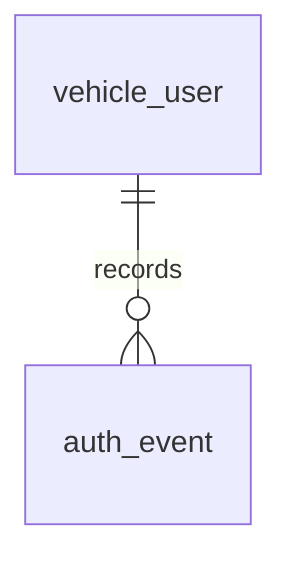

# Entity Specification — Đăng nhập & Đăng xuất (Chủ xe)

> Đặc tả entity cho Feature `FEAT-AUTH-002` (US-005 → US-008).
>
> **Nguồn nghiệp vụ:** [Functional Spec](../feature-functional/us-005-sprint-1-spec.ff.md). Tài liệu này không định nghĩa lại nghiệp vụ.
>
> **Tóm tắt:** Feature tái sử dụng `VehicleUser` (ENT-001), bổ sung `last_logout_at`, và triển khai `AuthEvent` (ENT-101) làm audit log bắt buộc cho đăng nhập/đăng xuất/thu hồi. `AuthEvent` không phải session store và không tham gia xác thực request.
>
> **Retention:** `AuthEvent` được giữ 60 ngày rồi purge.

---

# 0. Document Information

| Field | Value |
| --- | --- |
| Document ID | `ENT-SPEC-AUTH-002` |
| Feature | `FEAT-AUTH-002` — Đăng nhập & Đăng xuất |
| Version | `v1.0` |
| Status | `Draft` |
| Owner | Backend Team |
| Author | `[Cần điền]` |
| Database | PostgreSQL (Supabase), migration bằng Alembic |
| Created Date | `2026-09-27` |
| Updated Date | `2026-09-27` |

## 0.1 Entity Catalog

| Entity ID | Entity | Table | Trạng thái | Vai trò trong feature |
| --- | --- | --- | --- | --- |
| `ENT-001` | `VehicleUser` | `vehicle_user` | **Tái sử dụng** (định nghĩa ở FEAT-AUTH-001) | Nhận diện tài khoản khi đăng nhập, kiểm tra trạng thái khoá/onboarding, ghi mốc đăng nhập/đăng xuất |
| `ENT-101` | `AuthEvent` | `auth_event` | **Mới — bắt buộc** | Ghi vết sự kiện đăng nhập/đăng xuất/thu hồi phục vụ audit & hỗ trợ |

**Không lưu trong app DB:** ID token, refresh token — do Firebase quản lý; backend chỉ verify token và yêu cầu thu hồi qua Firebase Admin. Tuyệt đối không lưu token vào DB.

### Vì sao không có entity phiên (session) riêng?

Hệ thống **stateless theo token** (nhất quán FEAT-AUTH-001): phiên được biểu diễn bằng ID token (~1h) + refresh token do Firebase SDK giữ ở client. Backend không tạo bảng `session`. "Đăng xuất" = client xoá token + backend gọi `auth.revoke_refresh_tokens(uid)` (Firebase). Do đó chỉ cần vài trường mốc thời gian trên `VehicleUser` và (tuỳ chọn) một log audit.

---

# 1. Entity Information

| Field | Value |
| --- | --- |
| Entity ID | `ENT-001` (reuse) + `ENT-101` (new, optional) |
| Business Name | Tài khoản chủ xe / Sự kiện xác thực |
| Version | `v1.0` |
| Status | `Draft` |
| Owner | Backend Team |

---

# 2. Entity Overview

## 2.1 Description

- `VehicleUser` (ENT-001): tài khoản chủ xe — feature này dùng để **nhận diện** người đăng nhập (qua `firebase_uid`), **kiểm tra** `status` / `onboarding_status`, và **ghi mốc** `last_login_at` / `last_logout_at`.
- `AuthEvent` (ENT-101): bản ghi append-only về đăng nhập/đăng xuất/kết quả thu hồi, phục vụ audit bảo mật và điều tra sự cố. Nó không lưu session/token, không chứng minh phiên hiện còn hoạt động và không được dùng thay bước xác thực token.

## 2.2 Business Purpose

- Điều hướng sau đăng nhập (BR-102, BR-104) và chặn tài khoản khoá (BR-103).
- Audit và tra cứu lịch sử đăng nhập/đăng xuất/thu hồi khi có sự cố bảo mật (ENT-101; retention 60 ngày).

## 2.3 Scope

**In Scope**

- Trường của `VehicleUser` liên quan tới phiên (`firebase_uid`, `status`, `onboarding_status`, `last_login_at`, `last_logout_at`).
- Entity audit `AuthEvent` (tuỳ chọn).

**Out of Scope**

- Lưu token/refresh token (do Firebase quản lý — không lưu DB).
- Quản lý phiên đa thiết bị (Q-104).

---

# 3. Business Meaning

## Definition

`VehicleUser` là chủ thể được xác thực. `AuthEvent` là một lần xảy ra sự kiện xác thực (login/logout/revoke) của một `VehicleUser`.

## Example

Chủ xe `user_id=42` đăng nhập lúc 08:00 (`AuthEvent: login`), dùng dịch vụ, đăng xuất lúc 09:30 (`AuthEvent: logout`, `VehicleUser.last_logout_at=09:30`, refresh token bị thu hồi).

## Terminology

- Related term: `TERM-101` Session, `TERM-104` Revoke (FF glossary).

---

# 4. Identity & Keys

## 4.1 Primary Key

| Entity | Field | Type | Description |
| --- | --- | --- | --- |
| `VehicleUser` | `user_id` | `integer` | Đã định nghĩa ở ENT-001 |
| `AuthEvent` | `id` | `uuid` | `uuid4`, sinh ở app |

## 4.2 Candidate / Unique Keys

| Entity | Field | Unique | Description |
| --- | --- | ---: | --- |
| `VehicleUser` | `firebase_uid` | Yes | Khoá nhận diện khi đăng nhập (đã có) |
| `AuthEvent` | — | No | Append-only, không có unique nghiệp vụ |

---

# 5. Attributes

## 5.1 `VehicleUser` — trường liên quan feature (đã có, trừ chỗ ghi chú)

| Field | Type | Required | Nullable | Description | Ghi chú |
| --- | --- | ---: | ---: | --- | --- |
| `firebase_uid` | `varchar(128)` | Yes | No | Định danh Firebase để nhận diện tài khoản | Có sẵn (ENT-001) |
| `status` | `user_status_enum` | Yes | No | `active/inactive/suspended` — chặn đăng nhập nếu khoá | Có sẵn |
| `onboarding_status` | `onboarding_status_enum` | Yes | No | Điều hướng sau đăng nhập | Có sẵn |
| `last_login_at` | `timestamptz` | No | Yes | Mốc đăng nhập gần nhất (cập nhật ở sign-in) | Có sẵn |
| `last_logout_at` | `timestamptz` | No | Yes | Mốc đăng xuất gần nhất | **Mới `[Đề xuất]`** |

## 5.2 `AuthEvent` (ENT-101, `[Đề xuất]`)

| Field | Type | Required | Nullable | Default | Description | Constraints |
| --- | --- | ---: | ---: | --- | --- | --- |
| `id` | `uuid` | Yes | No | `uuid4` | ID | PK |
| `user_id` | `integer` | Yes | No | - | Chủ tài khoản | FK → `vehicle_user.user_id` `ON DELETE CASCADE` |
| `event_type` | `auth_event_type_enum` | Yes | No | - | Loại sự kiện | `login / logout / session_revoked / session_revoke_failed / login_denied` |
| `result` | `auth_event_result_enum` | Yes | No | - | Kết quả | `success / denied / failed` |
| `reason` | `varchar(64)` | No | Yes | - | Lý do khi `denied` (khoá, hết hạn...) | |
| `auth_provider` | `varchar(32)` | No | Yes | `google.com` | Provider | |
| `ip_address` | `varchar(64)` | No | Yes | - | IP client | Không bắt buộc |
| `user_agent` | `varchar(512)` | No | Yes | - | Thiết bị/UA | |
| `trace_id` | `varchar(64)` | No | Yes | - | Trace id request | |
| `created_at` | `timestamptz` | Yes | No | `now()` | Thời điểm sự kiện | |

> **Tuyệt đối không** lưu `id_token` / `refresh_token` trong `AuthEvent`.

---

# 6. Attribute Details

## `VehicleUser.last_logout_at`

| Property | Value |
| --- | --- |
| Type | `timestamptz` |
| Nullable | Yes |

**Business Meaning** — Thời điểm người dùng đăng xuất chủ động gần nhất; hỗ trợ audit và hiển thị "phiên gần nhất".

**Constraints** — Chỉ hệ thống ghi (khi xử lý đăng xuất). Không cho client set.

## `AuthEvent.event_type`

| Value | Ý nghĩa | FF |
| --- | --- | --- |
| `login` | Đăng nhập thành công | AC-101 |
| `logout` | Đăng xuất chủ động | AC-104 |
| `session_revoked` | Phiên bị thu hồi (đăng xuất/hệ thống) | BR-105 |
| `session_revoke_failed` | Tác vụ nền không thu hồi được refresh token | BR-105 |
| `login_denied` | Đăng nhập bị từ chối (khoá, provider sai, email chưa verify) | BR-103, EF-103 |

### Vai trò của `AuthEvent`

- Ghi lại sự kiện, thời điểm và kết quả để audit/điều tra; gồm yêu cầu logout và kết quả worker thu hồi nền.
- Không phải bảng session: không dùng để quyết định token hợp lệ, trạng thái đăng nhập hiện tại hoặc lifetime phiên.
- Không chứa ID token/refresh token. Bản ghi chỉ thêm mới; job retention purge sau 60 ngày.

---

# 7. Relationships

## 7.1 Relationship Overview



## 7.2 Relationship Details

| Related Entity | Relationship | Cardinality | Description |
| --- | --- | --- | --- |
| `VehicleUser` → `AuthEvent` | records | 1:N | Một tài khoản có nhiều sự kiện xác thực |

### Relationship Rules

- `AuthEvent` luôn thuộc đúng một `VehicleUser`; xoá tài khoản xoá luôn log (cascade).

---

# 8. Entity Lifecycle / State

`VehicleUser` không đổi vòng đời trong feature này (chỉ cập nhật `last_login_at` / `last_logout_at`). `AuthEvent` là append-only, không có state (không update/không delete ở tầng ứng dụng).

Vòng đời **phiên** (không phải entity) được mô tả ở FF mục 13 (`UNAUTHENTICATED → AUTHENTICATED → EXPIRED/REVOKED`).

---

# 9. Business Rules & Constraints

## BR-ENT-101 — Nhận diện tài khoản bằng `firebase_uid` (BR-102)

Đăng nhập ánh xạ về `VehicleUser` theo `firebase_uid`; không tạo mới nếu đã tồn tại.

## BR-ENT-102 — Không lưu token

Không có cột/bảng nào lưu `id_token`/`refresh_token`. Thu hồi phiên thực hiện qua Firebase Admin.

## BR-ENT-103 — `AuthEvent` append-only và retention

Chỉ INSERT; không UPDATE/DELETE ở tầng ứng dụng. Job retention purge bản ghi quá 60 ngày.

---

# 10. Data Integrity

- `AuthEvent.user_id` FK cascade tới `vehicle_user`.
- Không có ràng buộc unique nghiệp vụ trên `AuthEvent`.
- `last_logout_at` chỉ do hệ thống cập nhật.

---

# 11. Index & Query Requirements

| Query | Fields | Frequency | Required Index |
| --- | --- | --- | --- |
| Nhận diện tài khoản khi đăng nhập | `vehicle_user.firebase_uid` | Rất cao | Unique (đã có) |
| Lịch sử xác thực của user (audit) | `auth_event (user_id, created_at DESC)` | Thấp | `ix_auth_event_user_created` |
| Purge log quá hạn | `auth_event.created_at` | Định kỳ | `ix_auth_event_created_at` |

---

# 12. Ownership & Authorization

| Actor / Role | Read | Create | Update | Delete |
| --- | ---: | ---: | ---: | ---: |
| Chủ xe (`USER`) | ✅ (mốc của mình qua profile) | ✅ (gián tiếp qua login/logout) | ❌ | ❌ |
| Hệ thống | ✅ | ✅ (ghi `AuthEvent`, cập nhật mốc) | ✅ (`last_*_at`) | ✅ (purge) |
| `CUSTOMER_SUPPORT` | ✅ (audit — `[Cần xác nhận]`) | ❌ | ❌ | ❌ |

**Ownership Rule** — `AuthEvent` thuộc về `VehicleUser` tương ứng.

---

# 13. Audit Fields

| Field | Entity | Description |
| --- | --- | --- |
| `last_login_at` | VehicleUser | Đăng nhập gần nhất |
| `last_logout_at` | VehicleUser | Đăng xuất gần nhất `[Đề xuất]` |
| `created_at` | AuthEvent | Thời điểm sự kiện |

---

# 14. Data Source & Ownership

| Data | Source System | Owner | Sync Type |
| --- | --- | --- | --- |
| `firebase_uid` | Firebase ID token | Firebase/Google | Mỗi lần đăng nhập |
| `status`, `onboarding_status` | Backend | Backend Team | Real-time |
| `last_login_at`, `last_logout_at` | Backend | Backend Team | Real-time |
| `AuthEvent.*` | Backend | Backend Team | Real-time |

**Source of Truth** — Firebase cho danh tính & trạng thái phiên (token/thu hồi); app DB cho mốc thời gian & audit.

---

# 15. Data Sensitivity & Security

| Field | Classification | Notes |
| --- | --- | --- |
| `id_token` / `refresh_token` | Secret | **Không lưu DB, không log** |
| `AuthEvent.ip_address`, `user_agent` | Personal Data | Chỉ phục vụ audit/bảo mật; hạn chế truy cập |
| `firebase_uid` | Identifier | Được log để trace |

**Security Rules**

- Không log token dưới mọi hình thức.
- Truy cập `auth_event` giới hạn cho hệ thống/Support (theo `[Cần xác nhận]`).

---

# 16. Retention & Deletion

- `AuthEvent`: giữ **60 ngày** kể từ `created_at`, sau đó purge định kỳ.
- Xoá tài khoản → cascade xoá `AuthEvent`.
- `last_login_at` / `last_logout_at` theo vòng đời `VehicleUser`.

---

# 17. Example Data

```json
// AuthEvent (login)
{
  "id": "b7c1e2d3-4a5b-4c6d-8e9f-0a1b2c3d4e5f",
  "user_id": 42,
  "event_type": "login",
  "result": "success",
  "reason": null,
  "auth_provider": "google.com",
  "ip_address": "113.190.1.10",
  "user_agent": "EVCare/1.0 (Android 14)",
  "trace_id": "req-9a1b2c",
  "created_at": "2026-09-27T01:00:00Z"
}
```

---

# 18. API References

- `POST /api/v1/oauth/sign-in` (API-001, FEAT-AUTH-001) — đọc/ghi `VehicleUser`, ghi `AuthEvent(login/login_denied)`
- `POST /api/v1/oauth/logout` (API-101, tài liệu này) — cập nhật `last_logout_at`, ghi `AuthEvent(logout/session_revoked)`

---

# 19. Related Entities

| Entity | Relationship | Reference |
| --- | --- | --- |
| `VehicleUser` | records events | [ENT-001](../entity/us-001-sprint-1-spec.entity.md) |

---

# 20. Related Functional Specifications

- [FEAT-AUTH-002 — Đăng nhập & Đăng xuất](../feature-functional/us-005-sprint-1-spec.ff.md)
- [FEAT-AUTH-001 — Đăng ký & Onboarding](../feature-functional/us-001-sprint-1-spec.ff.md)

---

# 21. Open Questions

| ID | Question | Owner | Status |
| --- | --- | --- | --- |
| `Q-E101` | Có triển khai entity `AuthEvent` ở sprint này hay để phase sau? | Product/Security | Resolved — triển khai trong sprint này để ghi audit. |
| `Q-E102` | Có thêm cột `last_logout_at` vào `vehicle_user` không? | Backend | Resolved — có. |
| `Q-E103` | Thời hạn giữ `AuthEvent` (90 ngày?) và ai được xem? | Security | Resolved — giữ 60 ngày; quyền đọc giới hạn cho backend và nhân sự được ủy quyền theo chính sách bảo mật. |

---

# 22. Change Log

| Version | Date | Author | Changes |
| --- | --- | --- | --- |
| `v1.1` | `2026-09-27` | `[Cần điền]` | Chốt `last_logout_at`, audit `AuthEvent` bắt buộc và retention 60 ngày |

---

# 23. Approval

| Role | Name | Status | Date |
| --- | --- | --- | --- |
| Product / Business | `[Name]` | Pending | |
| Technical Owner | `[Name]` | Pending | |
| Data Owner | `[Name]` | Pending | |
