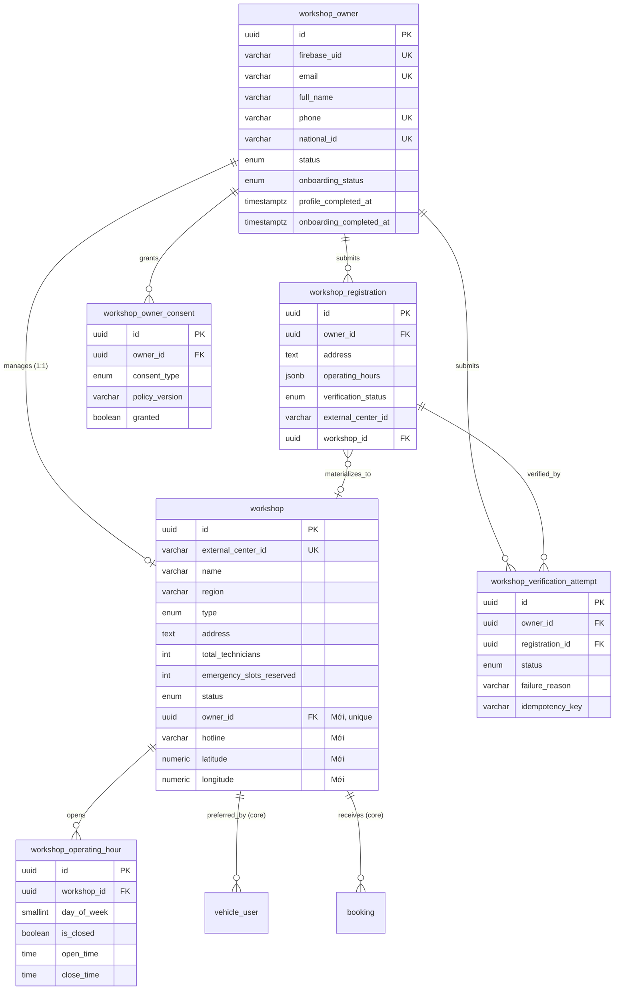
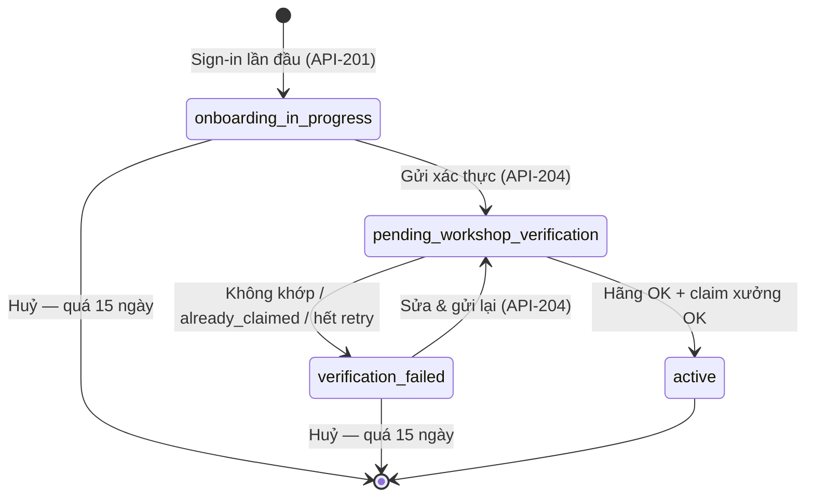
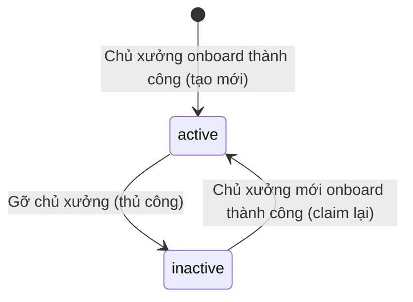
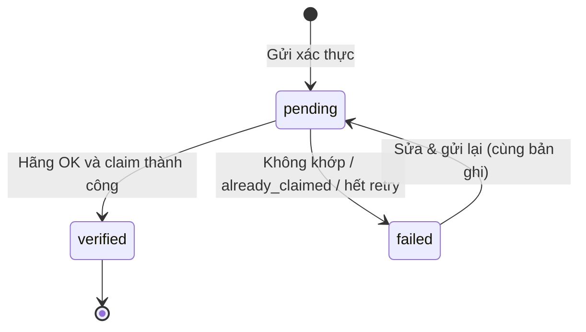

# Entity Specification — Đăng ký & Onboarding Chủ xưởng dịch vụ qua Google OAuth

> Đặc tả các entity phục vụ Feature `FEAT-AUTH-003` (US-009 → US-012).
>
> **Nguồn nghiệp vụ:** [Functional Spec](../feature-functional/us-009-sprint-1-spec.ff.md). Tài liệu này **không định nghĩa lại nghiệp vụ**; mọi rule đều trỏ về `BR-2xx` / `EF-2xx` / `EDGE-2xx`.
>
> **Nguồn lược đồ gốc:** [core.entity.md](../../entity/core.entity.md). Bảng `workshop` **giữ nguyên toàn bộ cột, kiểu, ràng buộc của core**, chỉ **bổ sung** cột và CHECK đã được duyệt. Quy ước đặt tên, kiểu, enum theo [core.entity.md §14.0](../../entity/core.entity.md) và [ENT-SPEC-AUTH-001 §3](./us-001-sprint-1-spec.entity.md#3-quy-ước-chung).
>
> **API liên quan:** [API Spec](../api/us-009-sprint-1-spec.api.md)

---

# 0. Document Information

| Field | Value |
| --- | --- |
| Document ID | `ENT-SPEC-AUTH-003` |
| Feature | `FEAT-AUTH-003` — Đăng ký & Onboarding Chủ xưởng |
| Version | `v1.1` |
| Status | `Review` |
| Sprint | `Sprint 1` |
| Owner | Backend Team |
| Author | `[Cần điền]` |
| Database | PostgreSQL (Supabase), schema `public`, migration bằng Alembic |
| Created Date | `2026-09-27` |
| Updated Date | `2026-09-27` |

## 0.1 Quyết định đã chốt (v1.1)

| # | Quyết định | Ảnh hưởng |
| --- | --- | --- |
| W-01 | Xác thực chủ xưởng dựa hoàn toàn vào hãng (`mock-ev-system`): **Gmail đăng nhập** = email người quản lý xưởng **và** **CCCD** = CCCD người quản lý. (Gmail, CCCD) ứng với **đúng một** xưởng; hãng trả về xưởng đó. Không thu mã số doanh nghiệp. | `workshop_owner.national_id`; bỏ khai báo `center_id` / MST; lý do thất bại `manager_not_found`, `national_id_mismatch`; mock bổ sung (API Spec C.7.2) |
| W-02 | SĐT và CCCD unique giữa các tài khoản chủ xưởng. | Unique `phone`, `national_id` trên `workshop_owner` |
| W-03 | Onboarding dang dở + log xác thực lưu **15 ngày**, quá hạn huỷ (như D-04). | Job `purge_expired_onboarding` mở rộng |
| W-04 | Tài khoản chủ xưởng là **bảng riêng** `workshop_owner`, **không hợp nhất** với `vehicle_user`; không dùng bảng `roles`. Một Gmail được có cả hai tài khoản. | ENT-007 |
| W-05 | **Một chủ xưởng ↔ một xưởng**. | Partial unique `workshop.owner_id` |
| W-06 | 5 lượt thất bại / 24h (không tính `oem_unavailable`) — như D-07. Hãng timeout ⇒ retry nền **5 lần trong ~30 phút**, sau đó `failed / oem_unavailable`. | ENT-011, API-204 §5.3 |
| W-07 | `workshop` chỉ được tạo/gắn chủ khi hãng xác thực thành công; dữ liệu khai báo trước đó nằm ở bản nháp `workshop_registration`. | ENT-010 |
| W-08 | Thêm `CHECK (emergency_slots_reserved <= total_technicians)` vào bảng core `workshop`. | ENT-008 §10 |
| W-09 | Xưởng bị gỡ chủ ⇒ `inactive`. Xưởng `active` bắt buộc có chủ. | ENT-008 §10 |
| W-10 | `name`, `region`, `type` đồng bộ từ hãng **chỉ lúc onboarding**. | `workshop.oem_synced_at` |
| W-11 | Chưa có role ADMIN / Customer Support; thao tác ngoại lệ làm trực tiếp trên DB, ghi log thủ công. | Bảng phân quyền chỉ có chủ xưởng / chủ xe / hệ thống |

---

# 1. Entity Catalog

| Entity ID | Entity | Table | Trạng thái | Mục đích |
| --- | --- | --- | --- | --- |
| `ENT-007` | `WorkshopOwner` | `workshop_owner` | **Mới** | Tài khoản chủ xưởng: định danh Firebase, hồ sơ (gồm CCCD), trạng thái onboarding |
| `ENT-008` | `Workshop` | `workshop` | **Core — mở rộng** | Xưởng dịch vụ (theo core), bổ sung chủ xưởng, hotline, toạ độ |
| `ENT-009` | `WorkshopOperatingHour` | `workshop_operating_hour` | **Mới** | Giờ hoạt động theo ngày trong tuần (1 khung/ngày) |
| `ENT-010` | `WorkshopRegistration` | `workshop_registration` | **Mới** | Bản nháp thông tin vận hành + kết quả xác thực |
| `ENT-011` | `WorkshopVerificationAttempt` | `workshop_verification_attempt` | **Mới** | Nhật ký từng lần gửi xác thực (retry, idempotency, giới hạn) |
| `ENT-012` | `WorkshopOwnerConsent` | `workshop_owner_consent` | **Mới** | Đồng ý xử lý dữ liệu & chia sẻ cho hãng (append-only) |

**Entity bên ngoài (chỉ đọc qua HTTP):** `ServiceCenter` của hãng (bổ sung `manager_email`, `manager_national_id`) — [proposed_erd.latest.md §3.8](../../mock-system/proposed_erd.latest.md), `backend/mock-ev-system`.

**Entity core liên quan, không đổi:** `vehicle_user.preferred_workshop_id` → `workshop.id` (`ON DELETE SET NULL`), `booking.workshop_id` → `workshop.id`.

### Vì sao tách như vậy?

- **`workshop_owner` tách khỏi `vehicle_user`** (W-04): `vehicle_user` mang ràng buộc riêng của chủ xe (`external_owner_id`, CHECK `active` ⇒ có xe verified). Hai loại tài khoản có vòng đời và dữ liệu khác nhau; cùng Gmail/CCCD có thể xuất hiện ở cả hai bảng.
- **CCCD nằm trên `workshop_owner`** (như ENT-001): CCCD định danh **người**; không lưu trên `workshop`.
- **Onboarding status nằm trên `workshop_owner`**; `workshop.status` (core) là trạng thái **vận hành** của xưởng.
- **`workshop_registration` tách khỏi `workshop`** (W-07): core đặt `address`, `total_technicians` NOT NULL và `external_center_id` unique; khi khai báo chưa biết xưởng nào (hãng trả về sau xác thực), nên không thể ghi thẳng vào `workshop`.
- **`workshop_operating_hour` tách bảng**: dùng kiểm tra `booking.time_slot` theo ngày trong tuần.
- **Consent & attempt tách bảng** như ENT-005/ENT-006 vì FK các bảng đó trỏ `vehicle_user.user_id`.

---

# 2. ER Diagram



---

# 3. Quy ước chung

Theo [core.entity.md §14.0](../../entity/core.entity.md), bổ sung:

| Chủ đề | Quy ước |
| --- | --- |
| Primary key | Mọi bảng mới dùng `uuid` (sinh ở app bằng `uuid4`). |
| Chuẩn hoá | `national_id`: chỉ chữ số (như ENT-001). `phone` chủ xưởng: E.164. `hotline`: bỏ khoảng trắng/`.`/`-`; di động → E.164; cố định/tổng đài giữ nguyên chữ số (`02437654321`, `19001234`). |
| Enum dùng lại | `user_status_enum`, `consent_type_enum`, `workshop_status_enum`, `service_center_type_enum` (core), `verification_attempt_status_enum` (ENT-005). |
| Enum mới | `workshop_owner_onboarding_status_enum`, `workshop_verification_status_enum`. |
| Truy cập DB | Như ENT-SPEC-AUTH-001: backend kết nối trực tiếp, bật RLS, không policy cho `anon`. |

---

# 4. Hiện trạng code & thay đổi cần thực hiện

## 4.1 Đã có

| Thành phần | Vị trí | Ghi chú |
| --- | --- | --- |
| `RoleCode.WORKSHOP_OWNER` | `backend/src/modules/authorization/domain.py` | Không dùng trong feature này (W-04) |
| Migration mới nhất | `backend/alembic/versions/b2e5d7f1a9c4_add_auth_event_and_last_logout.py` | Chưa có bảng `workshop` |
| Mock `ServiceCenter` | `backend/mock-ev-system/.../models.py` | Chỉ có `center_id`, `name`, `region`, `type` |
| `verify_firebase_token` | `backend/src/modules/oauth/dependency.py` | Dùng lại |

## 4.2 Gap

| # | Gap | Xử lý |
| --- | --- | --- |
| GW-01 | Chưa có bảng `workshop` (mới có trong core spec) | Tạo theo core + cột mở rộng (ENT-008) |
| GW-02 | Chưa có tài khoản chủ xưởng | ENT-007 |
| GW-03 | Mock hãng thiếu email + CCCD người quản lý và API xác thực | Bổ sung mock — [API Spec C.7.2](../api/us-009-sprint-1-spec.api.md#c72-yêu-cầu-bổ-sung-mock-ev-system) |
| GW-04 | Chưa có giờ hoạt động xưởng | ENT-009 |
| GW-05 | Job `purge_expired_onboarding` chỉ xử lý `vehicle_user` | Mở rộng cho `workshop_owner` + `workshop_verification_attempt` |

## 4.3 Kế hoạch migration

Revision Alembic `c3f8a1d2e4b7_add_workshop_owner_onboarding` (`down_revision = "b2e5d7f1a9c4"`):

1. `CREATE TYPE workshop_status_enum`, `service_center_type_enum` (nếu chưa có), `workshop_owner_onboarding_status_enum`, `workshop_verification_status_enum`.
2. `CREATE TABLE workshop_owner` (ENT-007).
3. `CREATE TABLE workshop` đúng cột core + cột mở rộng + CHECK (ENT-008).
4. `vehicle_user.preferred_workshop_id` (core) **chưa** thêm ở revision này — để feature đặt lịch thêm cùng model `VehicleUser`.
5. Tạo `workshop_operating_hour`, `workshop_registration`, `workshop_verification_attempt`, `workshop_owner_consent` + index.
6. Seed: 1 chủ xưởng demo `active` gắn `SC-01`; email/CCCD khớp dữ liệu mock mới.

Sau khi merge, cập nhật [core.entity.md](../../entity/core.entity.md): cột mới + CHECK của `workshop`, bảng mới ở §3.1 / ER diagram.

---

# 5. Mapping Data Requirements (FF §14.1) → Entity

| Data (FF) | Entity.field | Ghi chú |
| --- | --- | --- |
| `firebase_uid`, `email`, `display_name`, `avatar_url` | `WorkshopOwner.*` | Từ ID token |
| `full_name`, `phone_number`, `national_id` | `WorkshopOwner.full_name`, `.phone`, `.national_id` | SCR-202 |
| `center_id` | `WorkshopRegistration.external_center_id` → `Workshop.external_center_id` | Hãng trả về khi xác thực |
| `workshop_name`, `region`, `type` | `Workshop.name`, `.region`, `.type` | Từ hãng (BR-205) |
| `address`, `latitude`, `longitude`, `hotline` | `WorkshopRegistration.*` → `Workshop.*` | |
| `total_technicians`, `emergency_slots_reserved` | `WorkshopRegistration.*` → `Workshop.*` | Cột core |
| `operating_hours` | `WorkshopRegistration.operating_hours` (jsonb) → `WorkshopOperatingHour` | |
| `consents` | `WorkshopOwnerConsent` | |
| `verification_status` | `WorkshopRegistration.verification_status` + `WorkshopOwner.onboarding_status` | Hai cấp |

---

# ENT-007 — WorkshopOwner

## 1. Entity Information

| Field | Value |
| --- | --- |
| Entity ID | `ENT-007` |
| Entity Name | `WorkshopOwner` |
| Business Name | Tài khoản chủ xưởng |
| Table | `workshop_owner` |
| Version | `v1.1` |
| Status | `Review` — **Mới** |
| Owner | Backend Team |

## 2. Entity Overview

### 2.1 Description

Tài khoản của chủ xưởng trên Workshop Portal, tạo lần đầu khi đăng nhập Google thành công qua Firebase. Chứa định danh Firebase, hồ sơ (gồm CCCD), trạng thái onboarding.

### 2.2 Business Purpose

- 1 Firebase UID ↔ 1 tài khoản chủ xưởng (`BR-201`).
- **Gmail + CCCD** là định danh xác thực người quản lý xưởng với hãng (`BR-204`, W-01).
- Quyết định điều hướng sau đăng nhập (`AF-201`→`AF-203`) và chặn chức năng quản lý xưởng khi chưa `active` (`BR-203`).

### 2.3 Scope

**In:** định danh Firebase, hồ sơ người quản lý, trạng thái onboarding, huỷ onboarding quá hạn. **Out:** nhân viên xưởng, cập nhật hồ sơ sau onboarding, phân quyền role.

## 3. Business Meaning

**Definition** — Người đã đăng nhập Workshop Portal ít nhất một lần. Đăng ký hoàn tất khi `onboarding_status = active`.

**Example** — Chị Trần Thu Hà được hãng ghi nhận là người quản lý VinFast Thăng Long (`SC-01`) với Gmail `ha.tran.sc01@gmail.com`, CCCD `001190000101`. Chị đăng nhập Workshop Portal bằng Gmail đó → tạo `workshop_owner` (`onboarding_in_progress`) → nhập hồ sơ + CCCD, thông tin vận hành → hãng xác nhận và trả `SC-01` → `workshop` được tạo với `owner_id` = tài khoản của chị, tài khoản `active`.

## 4. Identity & Keys

| Field | Type | Description |
| --- | --- | --- |
| `id` | `uuid` | PK |

| Field | Unique | Description |
| --- | ---: | --- |
| `firebase_uid` | Yes | Khoá tra cứu khi đăng nhập (`BR-201`) |
| `email` | Yes | Lowercase; chặn 2 UID dùng chung email |
| `phone` | Yes | W-02 |
| `national_id` | Yes | W-02 — một người một tài khoản chủ xưởng |

> Unique chỉ trong phạm vi `workshop_owner`. Cùng Gmail/SĐT/CCCD có thể tồn tại ở `vehicle_user` (`BR-209`).

## 5. Attributes

| Field | Type | Required | Nullable | Default | Description | Constraints |
| --- | --- | ---: | ---: | --- | --- | --- |
| `id` | `uuid` | Yes | No | `uuid4` | ID | PK |
| `firebase_uid` | `varchar(128)` | Yes | No | - | Firebase UID | Unique |
| `email` | `varchar(255)` | Yes | No | - | Gmail đăng nhập | Unique, lowercase |
| `email_verified` | `boolean` | Yes | No | `false` | Google đã xác minh | |
| `auth_provider` | `varchar(32)` | Yes | No | `'google.com'` | Provider | |
| `display_name` | `varchar(255)` | No | Yes | - | Tên hiển thị Google | |
| `avatar_url` | `varchar(1024)` | No | Yes | - | Ảnh đại diện Google | |
| `full_name` | `varchar(150)` | Yes* | Yes | - | Họ tên | |
| `phone` | `varchar(20)` | Yes* | Yes | - | SĐT liên hệ | Unique, E.164 |
| `national_id` | `varchar(12)` | Yes* | Yes | - | Số CCCD | Unique, `^[0-9]{12}$` |
| `status` | `user_status_enum` | Yes | No | `active` | Khoá/mở tài khoản | `active / inactive / suspended` |
| `onboarding_status` | `workshop_owner_onboarding_status_enum` | Yes | No | `onboarding_in_progress` | Trạng thái onboarding | Xem §8 |
| `profile_completed_at` | `timestamptz` | No | Yes | - | Hoàn tất SCR-202 | |
| `onboarding_completed_at` | `timestamptz` | No | Yes | - | Thời điểm `active` | |
| `last_login_at` | `timestamptz` | No | Yes | - | Đăng nhập gần nhất | |
| `last_logout_at` | `timestamptz` | No | Yes | - | Đăng xuất gần nhất (chuẩn bị cho logout) | |
| `created_at` | `timestamptz` | Yes | No | `now()` | Mốc tính hạn 15 ngày | |
| `updated_at` | `timestamptz` | Yes | No | `now()` | | |

`*` Nullable ở DB vì tài khoản tạo trước khi nhập hồ sơ; bắt buộc để hoàn tất SCR-202.

## 6. Attribute Details

### `email`

Chỉ lấy từ ID token, không cho sửa. Gửi sang hãng làm `manager_email` (W-01). Mask trong log (`ha***@gmail.com`).

### `national_id`

| Property | Value |
| --- | --- |
| Format | `^[0-9]{12}$` |
| Required | Để hoàn tất bước hồ sơ |

* Gửi sang hãng làm `manager_national_id` (W-01).
* Chỉ sửa được khi chưa `active` (qua API-203).
* Luôn trả dạng **mask** (`001******101`) ở API và log; không bao giờ log đầy đủ.

### `onboarding_status`

| DB | API | Meaning |
| --- | --- | --- |
| `onboarding_in_progress` | `ONBOARDING_IN_PROGRESS` | Chưa gửi xác thực |
| `pending_workshop_verification` | `PENDING_WORKSHOP_VERIFICATION` | Chờ hãng |
| `verification_failed` | `VERIFICATION_FAILED` | Thất bại |
| `active` | `ACTIVE` | Hoàn tất |

Chỉ hệ thống cập nhật.

## 7. Relationships

| Related Entity | Relationship | Cardinality | Description |
| --- | --- | --- | --- |
| `Workshop` | manages | 1:0..1 | Qua `workshop.owner_id` unique (W-05) |
| `WorkshopRegistration` | submits | 1:N (tối đa 1 nháp) | |
| `WorkshopVerificationAttempt` | submits | 1:N | |
| `WorkshopOwnerConsent` | grants | 1:N | |

**Relationship Rules** — Tài khoản `active` có **đúng 1** `workshop` với `owner_id = id`.

## 8. Entity Lifecycle / State



**Transition Rules**

* `onboarding_in_progress → pending_workshop_verification`: `profile_completed_at IS NOT NULL` (có họ tên, SĐT, CCCD) **và** consent `oem_data_sharing` hiện hành = granted.
* `pending → active`: trong **cùng transaction** với tạo/claim `workshop`, ghi `workshop_operating_hour`, registration `verified`, set `onboarding_completed_at`.
* Bước hồ sơ không đổi `onboarding_status`.
* Huỷ (W-03): `onboarding_status IN ('onboarding_in_progress','verification_failed') AND created_at < now() - 15 days` ⇒ hard delete cascade. Bỏ qua `pending_workshop_verification` (retry nền tối đa ~30 phút).

**`nextStep` (suy ra, không lưu)**

| Điều kiện | `nextStep` | Màn hình |
| --- | --- | --- |
| `active` | `DASHBOARD` | Dashboard xưởng |
| `pending_workshop_verification` | `VERIFYING` | SCR-204 |
| `profile_completed_at IS NULL` | `PROFILE` | SCR-202 |
| còn lại | `WORKSHOP` | SCR-203 (SCR-206 nếu failed) |

`expiresAt = created_at + ONBOARDING_RETENTION_DAYS` khi chưa `active`; `null` khi `active`.

## 9. Business Rules & Constraints

* **BR-ENT-201** (`BR-201`) — `firebase_uid` unique; đăng nhập lại chỉ cập nhật `last_login_at` và thông tin Google.
* **BR-ENT-202** — UID mới nhưng `email` đã thuộc chủ xưởng khác ⇒ `409 EMAIL_ALREADY_LINKED`.
* **BR-ENT-203** (`EF-205`) — `status ∈ {inactive, suspended}` ⇒ từ chối đăng nhập.
* **BR-ENT-204** (`BR-203`) — API quản lý xưởng yêu cầu `status = active AND onboarding_status = active`.
* **BR-ENT-205** (`BR-208`) — Huỷ onboarding quá hạn; kiểm tra ở job nền **và** lúc sign-in.
* **BR-ENT-206** (`BR-204`) — `email` + `national_id` là hai trường gửi sang hãng; SĐT không tham gia xác thực.

## 10. Data Integrity

* `CHECK (onboarding_status <> 'active' OR onboarding_completed_at IS NOT NULL)`
* `CHECK (profile_completed_at IS NULL OR (full_name IS NOT NULL AND phone IS NOT NULL AND national_id IS NOT NULL))`
* `CHECK (national_id IS NULL OR national_id ~ '^[0-9]{12}$')`
* Bảng con FK `ON DELETE CASCADE`; riêng `workshop.owner_id` `ON DELETE SET NULL` (ENT-008).

## 11. Index & Query Requirements

| Query | Fields | Frequency | Required Index |
| --- | --- | --- | --- |
| Tìm khi sign-in / mọi request | `firebase_uid` | Rất cao | Unique |
| Trùng email / SĐT / CCCD | `email`, `phone`, `national_id` | Thấp | Unique |
| Job huỷ quá hạn | `onboarding_status`, `created_at` | Hằng ngày | `ix_workshop_owner_onboarding_created (onboarding_status, created_at) WHERE onboarding_status <> 'active'` |

## 12. Ownership & Authorization

| Actor / Role | Read | Create | Update | Delete |
| --- | ---: | ---: | ---: | ---: |
| Chủ xưởng | ✅ (của mình) | ✅ (qua sign-in) | ✅ (hồ sơ, khi chưa `active`) | ❌ |
| Hệ thống | ✅ | ❌ | ✅ | ✅ (huỷ quá hạn) |

`status`, `onboarding_status` chỉ hệ thống cập nhật. Không nhận `ownerId` từ client. Mở khoá tài khoản: thao tác DB thủ công, có log (W-11).

## 13. Audit Fields

`created_at`, `updated_at`, `last_login_at`, `last_logout_at`, `profile_completed_at`, `onboarding_completed_at`.

## 14. Data Source & Ownership

| Data | Source | Sync |
| --- | --- | --- |
| `firebase_uid`, `email`, `email_verified`, `display_name`, `avatar_url`, `auth_provider` | Firebase ID token | Mỗi lần sign-in |
| `full_name`, `phone`, `national_id` | User input | Real-time |
| `status`, `onboarding_status` | Backend | Real-time |

**Source of Truth** — Firebase: danh tính đăng nhập. Hãng: **ai là người quản lý xưởng nào**. App DB: hồ sơ và trạng thái onboarding.

## 15. Data Sensitivity & Security

| Field | Classification | Notes |
| --- | --- | --- |
| `national_id` | Personal Data — định danh | Không bao giờ log; API trả mask; chỉ gửi hãng khi xác thực |
| `email`, `phone` | Personal Data | Mask trong log |
| `full_name` | Personal Data | Không log |
| `firebase_uid` | Identifier | Được log |

## 16. Retention & Deletion

15 ngày cho onboarding dang dở (W-03), hard delete cascade `workshop_registration`, `workshop_verification_attempt`, `workshop_owner_consent`. Không xoá tài khoản Firebase. Job `purge_expired_onboarding` (ENT-001 §16) mở rộng xử lý bảng này.

## 17. Example Data

```json
{
  "id": "3a7e9c10-2b4d-4f61-9a0e-5c8d7b6a1f20",
  "firebase_uid": "Qw8Lm2...",
  "email": "ha.tran.sc01@gmail.com",
  "email_verified": true,
  "auth_provider": "google.com",
  "display_name": "Ha Tran",
  "full_name": "Trần Thu Hà",
  "phone": "+84912000101",
  "national_id": "001190000101",
  "status": "active",
  "onboarding_status": "active",
  "profile_completed_at": "2026-09-27T03:02:00Z",
  "onboarding_completed_at": "2026-09-27T03:06:12Z",
  "last_login_at": "2026-09-27T03:00:00Z",
  "created_at": "2026-09-27T03:00:00Z"
}
```

## 18. API References

API-201 (Create/Read/Update login/Delete quá hạn), API-202 (Read), API-203 (Update hồ sơ + CCCD), API-204 (Update `onboarding_status`).

---

# ENT-008 — Workshop (core — mở rộng)

## 1. Entity Information

| Field | Value |
| --- | --- |
| Entity ID | `ENT-008` |
| Entity Name | `Workshop` |
| Business Name | Xưởng dịch vụ |
| Table | `workshop` |
| Status | `Review` — **Core, bổ sung cột & CHECK** |
| Base Definition | [workshop.entity.md — Bảng `workshop`](../../entity/workshop/workshop.entity.md) (tổng quan: [core.entity.md](../../entity/core.entity.md)) |

## 2. Entity Overview

**Description** — Xưởng dịch vụ trong app, tương ứng 1–1 với `ServiceCenter` của hãng. Core định nghĩa cột từ hãng (`name`, `region`, `type`) và cột vận hành (`address`, công suất, `status`). Feature này bổ sung liên kết chủ xưởng, hotline, toạ độ.

**Business Purpose** — Đích cuối của onboarding chủ xưởng (`AC-204`); được chủ xe chọn khi đặt lịch và làm xưởng ưu tiên.

## 3. Business Meaning

Một bản ghi `workshop` tồn tại ⇔ xưởng đã được một chủ xưởng onboard thành công. Xưởng hiển thị cho chủ xe khi `status = active`; `active` luôn đi kèm có chủ (W-09).

## 4. Identity & Keys

| Field / Composite | Unique | Description |
| --- | ---: | --- |
| `id` (`uuid`) | Yes | PK (core) |
| `external_center_id` | Yes | **Core** — một xưởng hãng ↔ một bản ghi (`BR-202`) |
| `owner_id` WHERE `owner_id IS NOT NULL` | Yes | **Mới** — `ux_workshop_owner`: một chủ một xưởng (W-05) |

## 5. Attributes

**Cột core — giữ nguyên:**

| Field | Type | Required | Nullable | Default | Constraints | Nguồn giá trị trong feature này |
| --- | --- | ---: | ---: | --- | --- | --- |
| `id` | `uuid` | Yes | No | `uuid4` | PK | App |
| `external_center_id` | `varchar(64)` | Yes | No | - | Unique | Hãng trả về khi xác thực |
| `name` | `varchar(150)` | Yes | No | - | | Hãng |
| `region` | `varchar(50)` | Yes | No | - | Khớp `user_location.province` | Hãng |
| `type` | `service_center_type_enum` | Yes | No | - | `dealer / service_only` | Hãng |
| `address` | `text` | Yes | No | - | | Chủ xưởng |
| `total_technicians` | `integer` | Yes | No | - | `> 0` | Chủ xưởng |
| `emergency_slots_reserved` | `integer` | Yes | No | `0` | `>= 0`, **`<= total_technicians` (mới — W-08)** | Chủ xưởng |
| `status` | `workshop_status_enum` | Yes | No | `active` | `active / inactive` | Hệ thống |
| `created_at` | `timestamptz` | Yes | No | `now()` | | |
| `updated_at` | `timestamptz` | Yes | No | `now()` | | |

**Cột bổ sung — Mới:**

| Field | Type | Required | Nullable | Default | Description | Constraints |
| --- | --- | ---: | ---: | --- | --- | --- |
| `owner_id` | `uuid` | No | Yes | - | Chủ xưởng quản lý | FK → `workshop_owner.id` `ON DELETE SET NULL`; partial unique |
| `hotline` | `varchar(20)` | No | Yes | - | SĐT xưởng cho chủ xe | Đã chuẩn hoá (§3) |
| `latitude` | `numeric(9,6)` | No | Yes | - | Vĩ độ | `-90..90` |
| `longitude` | `numeric(9,6)` | No | Yes | - | Kinh độ | `-180..180` |
| `onboarded_at` | `timestamptz` | No | Yes | - | Thời điểm gắn chủ xưởng gần nhất | |
| `oem_synced_at` | `timestamptz` | No | Yes | - | Lần lấy `name/region/type` từ hãng (chỉ lúc onboarding — W-10) | |

> Cột mới nullable để bản ghi bị gỡ chủ (`owner_id = NULL`) vẫn hợp lệ. Ràng buộc "xưởng có chủ phải đủ thông tin" đảm bảo bằng CHECK ở §10.

## 6. Attribute Details

### `owner_id`

Set khi claim thành công (API-204). Gỡ chủ (thao tác DB thủ công — W-11) ⇒ `owner_id = NULL` **và** `status = 'inactive'` trong cùng câu lệnh (BR-211, W-09).

### `region` vs `address`

`region` lấy từ hãng; `address` do chủ xưởng nhập. Không ép `address` chứa `region`.

## 7. Relationships

| Related Entity | Relationship | Cardinality |
| --- | --- | --- |
| `WorkshopOwner` | managed by | 1:0..1 |
| `WorkshopOperatingHour` | has | 1:7 |
| `WorkshopRegistration` | materialized from | 1:N |
| `VehicleUser` (core) | preferred by | 1:N |
| `Booking` (core) | receives | 1:N |
| Hãng: `ServiceCenter` | maps to | 1:1 qua `external_center_id` |

## 8. Entity Lifecycle / State



## 9. Business Rules & Constraints

* **BR-ENT-210** (`BR-202`) — Claim bằng `INSERT ... ON CONFLICT (external_center_id) DO UPDATE ... WHERE workshop.owner_id IS NULL`; 0 dòng ⇒ xưởng đã có chủ ⇒ `failed / already_claimed`. Vi phạm `ux_workshop_owner` (chủ xưởng đã có xưởng) không xảy ra do trạng thái onboarding chặn trước; nếu xảy ra ⇒ rollback, log error.
* **BR-ENT-211** (`BR-205`, W-10) — `name`, `region`, `type` chỉ ghi từ response hãng lúc onboarding.
* **BR-ENT-212** (`BR-206`, W-08) — `emergency_slots_reserved <= total_technicians`.
* **BR-ENT-213** (`BR-211`, W-09) — `status = active` ⇒ có `owner_id`.

## 10. Data Integrity

* Giữ nguyên CHECK core: `total_technicians > 0`, `emergency_slots_reserved >= 0`.
* **Mới:** `CHECK (emergency_slots_reserved <= total_technicians)`.
* **Mới:** `CHECK (status <> 'active' OR owner_id IS NOT NULL)`.
* **Mới:** `CHECK (owner_id IS NULL OR (hotline IS NOT NULL AND onboarded_at IS NOT NULL))`.
* **Mới:** `CHECK ((latitude IS NULL) = (longitude IS NULL))`.

## 11. Index & Query Requirements

| Query | Fields | Frequency | Required Index |
| --- | --- | --- | --- |
| Claim theo mã hãng | `external_center_id` | Mỗi lần xác thực | Unique (core) |
| Xưởng của chủ xưởng | `owner_id` | Cao (portal) | `ux_workshop_owner (owner_id) WHERE owner_id IS NOT NULL` |
| Xưởng active theo khu vực (chủ xe chọn xưởng) | `status`, `region` | Cao | `ix_workshop_status_region (status, region)` |

## 12. Ownership & Authorization

| Actor / Role | Read | Create | Update | Delete |
| --- | ---: | ---: | ---: | ---: |
| Chủ xưởng | ✅ (xưởng của mình) | ✅ (qua xác thực) | ❌ trong feature này | ❌ |
| Chủ xe | ✅ (xưởng `active`, trường công khai) | ❌ | ❌ | ❌ |
| Hệ thống | ✅ | ✅ | ✅ | ❌ |

## 13–14. Audit & Data Source

`created_at`, `updated_at`, `onboarded_at`, `oem_synced_at`. Source of truth: hãng cho `external_center_id/name/region/type`; chủ xưởng cho dữ liệu vận hành.

## 15. Data Sensitivity & Security

`hotline`, `address`, toạ độ là thông tin công khai của xưởng.

## 16. Retention & Deletion

Không hard delete (booking tham chiếu). Ngừng hoạt động bằng `status = inactive`.

## 17. Example Data

```json
{
  "id": "7c1e2d3f-4a5b-4c6d-8e9f-0a1b2c3d4e5f",
  "external_center_id": "SC-01",
  "name": "VinFast Thăng Long",
  "region": "Hà Nội",
  "type": "dealer",
  "address": "Số 8 Phạm Hùng, Mễ Trì, Nam Từ Liêm, Hà Nội",
  "total_technicians": 12,
  "emergency_slots_reserved": 2,
  "status": "active",
  "owner_id": "3a7e9c10-2b4d-4f61-9a0e-5c8d7b6a1f20",
  "hotline": "02437654321",
  "latitude": 21.017000,
  "longitude": 105.781000,
  "onboarded_at": "2026-09-27T03:06:12Z",
  "oem_synced_at": "2026-09-27T03:06:12Z"
}
```

## 18. API References

API-204 (Insert/Update khi verified), API-201, API-202 (Read).

---

# ENT-009 — WorkshopOperatingHour

## 1. Entity Information

| Field | Value |
| --- | --- |
| Entity ID | `ENT-009` |
| Table | `workshop_operating_hour` |
| Status | `Review` — **Mới** |

## 2–3. Overview & Business Meaning

Một bản ghi = giờ hoạt động của xưởng trong một ngày trong tuần. Mỗi xưởng có đúng 7 bản ghi, **một khung giờ liên tục/ngày**; không có nghỉ trưa, ngày lễ. Dùng kiểm tra `booking.time_slot` nằm trong giờ mở cửa.

## 4. Identity & Keys

`id` (`uuid`) PK · Unique `(workshop_id, day_of_week)`.

## 5. Attributes

| Field | Type | Required | Nullable | Default | Description | Constraints |
| --- | --- | ---: | ---: | --- | --- | --- |
| `id` | `uuid` | Yes | No | `uuid4` | ID | PK |
| `workshop_id` | `uuid` | Yes | No | - | Xưởng | FK → `workshop.id` `ON DELETE CASCADE` |
| `day_of_week` | `smallint` | Yes | No | - | ISO: 1 = Thứ 2 … 7 = Chủ nhật | `1..7` |
| `is_closed` | `boolean` | Yes | No | `false` | Nghỉ cả ngày | |
| `open_time` | `time` | No | Yes | - | Giờ mở (giờ địa phương `Asia/Ho_Chi_Minh`) | |
| `close_time` | `time` | No | Yes | - | Giờ đóng | `> open_time` |
| `created_at` | `timestamptz` | Yes | No | `now()` | | |
| `updated_at` | `timestamptz` | Yes | No | `now()` | | |

## 9. Business Rules & Constraints

* **BR-ENT-220** (`BR-206`) — Đủ 7 ngày, ít nhất 1 ngày `is_closed = false`.
* **BR-ENT-221** — Chỉ ghi khi claim xưởng thành công (replace-all 7 dòng trong TX ghi kết quả).

## 10. Data Integrity

* `CHECK (day_of_week BETWEEN 1 AND 7)`
* `CHECK ((is_closed AND open_time IS NULL AND close_time IS NULL) OR (NOT is_closed AND open_time IS NOT NULL AND close_time IS NOT NULL AND close_time > open_time))`

## 11–16

Index: unique `(workshop_id, day_of_week)`. Chủ xưởng đọc (xưởng của mình); chủ xe đọc (xưởng `active`); hệ thống ghi. Retention theo `workshop`.

## 17. Example Data

```json
[
  { "day_of_week": 1, "is_closed": false, "open_time": "08:00", "close_time": "17:30" },
  { "day_of_week": 7, "is_closed": true,  "open_time": null,    "close_time": null }
]
```

## 18. API References

API-204 (Insert khi verified), API-202 (Read).

---

# ENT-010 — WorkshopRegistration

## 1. Entity Information

| Field | Value |
| --- | --- |
| Entity ID | `ENT-010` |
| Business Name | Hồ sơ khai báo xưởng (bản nháp) |
| Table | `workshop_registration` |
| Status | `Review` — **Mới** |

## 2. Entity Overview

**Description** — Thông tin vận hành chủ xưởng khai báo ở SCR-203 và kết quả xác thực với hãng. Là nguồn tạo/claim `workshop` khi thành công.

**Business Purpose** — Resume onboarding (`AF-202`), sửa & gửi lại (`BR-207`), giữ dữ liệu vận hành khi chưa biết xưởng nào (W-07).

## 3. Business Meaning

Mỗi chủ xưởng có **tối đa một bản nháp** (`pending` / `failed`). Gửi lại **cập nhật** bản nháp đó. Bản ghi `verified` giữ lại làm lịch sử, trỏ tới `workshop`.

## 4. Identity & Keys

| Field / Composite | Unique | Description |
| --- | ---: | --- |
| `id` (`uuid`) | Yes | PK |
| `owner_id` WHERE `verification_status <> 'verified'` | Yes | `ux_workshop_registration_owner_draft` |

## 5. Attributes

| Field | Type | Required | Nullable | Default | Description | Constraints |
| --- | --- | ---: | ---: | --- | --- | --- |
| `id` | `uuid` | Yes | No | `uuid4` | ID | PK |
| `owner_id` | `uuid` | Yes | No | - | Chủ xưởng | FK → `workshop_owner.id` `ON DELETE CASCADE` |
| `address` | `text` | Yes | No | - | Địa chỉ | 5–500 ký tự |
| `latitude` | `numeric(9,6)` | No | Yes | - | | `-90..90` |
| `longitude` | `numeric(9,6)` | No | Yes | - | | `-180..180` |
| `hotline` | `varchar(20)` | Yes | No | - | SĐT xưởng | Đã chuẩn hoá |
| `total_technicians` | `integer` | Yes | No | - | Số KTV/ca | `1..200` |
| `emergency_slots_reserved` | `integer` | Yes | No | `0` | Slot dự phòng | `0..total_technicians` |
| `operating_hours` | `jsonb` | Yes | No | - | 7 phần tử `{dayOfWeek, isClosed, openTime, closeTime}` | Validate ở service theo BR-ENT-220 |
| `verification_status` | `workshop_verification_status_enum` | Yes | No | `pending` | | `pending / verified / failed` |
| `verification_failure_reason` | `varchar(64)` | No | Yes | - | Lý do gần nhất | ENT-011 §6 |
| `external_center_id` | `varchar(64)` | No | Yes | - | `center_id` hãng trả về (kể cả khi `already_claimed`) | |
| `workshop_id` | `uuid` | No | Yes | - | Xưởng được tạo/claim | FK → `workshop.id` `ON DELETE SET NULL` |
| `verified_at` | `timestamptz` | No | Yes | - | | |
| `created_at` | `timestamptz` | Yes | No | `now()` | | |
| `updated_at` | `timestamptz` | Yes | No | `now()` | | |

## 8. Entity Lifecycle / State



`verified` là bất biến.

## 9. Business Rules & Constraints

* **BR-ENT-230** (`BR-204`) — Chỉ chuyển `verified` từ kết quả hãng + claim thành công.
* **BR-ENT-231** (`BR-206`) — Validate đủ dữ liệu vận hành trước khi tạo `pending`.

## 10. Data Integrity

* `CHECK (verification_status <> 'verified' OR (workshop_id IS NOT NULL AND external_center_id IS NOT NULL AND verified_at IS NOT NULL))`
* `CHECK (verification_status <> 'failed' OR verification_failure_reason IS NOT NULL)`
* `CHECK (emergency_slots_reserved BETWEEN 0 AND total_technicians)`
* `CHECK ((latitude IS NULL) = (longitude IS NULL))`

## 11–16

Index `ux_workshop_registration_owner_draft`. Chủ xưởng đọc/ghi bản nháp của mình qua API; hệ thống toàn quyền. Xoá cascade khi huỷ onboarding.

## 17. Example Data

```json
{
  "id": "b1c2d3e4-f5a6-4b7c-8d9e-0f1a2b3c4d5e",
  "owner_id": "3a7e9c10-2b4d-4f61-9a0e-5c8d7b6a1f20",
  "address": "Số 8 Phạm Hùng, Mễ Trì, Nam Từ Liêm, Hà Nội",
  "latitude": 21.017,
  "longitude": 105.781,
  "hotline": "02437654321",
  "total_technicians": 12,
  "emergency_slots_reserved": 2,
  "operating_hours": [
    { "dayOfWeek": 1, "isClosed": false, "openTime": "08:00", "closeTime": "17:30" }
  ],
  "verification_status": "failed",
  "verification_failure_reason": "national_id_mismatch",
  "external_center_id": null,
  "workshop_id": null
}
```

## 18. API References

API-204 (Insert/Update), API-202 (Read).

---

# ENT-011 — WorkshopVerificationAttempt

## 1. Entity Information

| Field | Value |
| --- | --- |
| Entity ID | `ENT-011` |
| Table | `workshop_verification_attempt` |
| Status | `Review` — **Mới** (cấu trúc theo ENT-005) |

## 2–3. Overview & Business Meaning

Mỗi lần chủ xưởng nhấn "Gửi xác thực" tạo một lượt; lưu kết quả, lý do, độ trễ. Retry nền do timeout **không** tạo lượt mới (tăng `retry_count`). **Không lưu CCCD** đã gửi (đã có ở `workshop_owner`) và không lưu dữ liệu người quản lý hãng trả về.

## 4. Identity & Keys

`id` PK (trả client là `attemptId`) · Unique `(owner_id, idempotency_key)` · Partial unique `ux_ws_attempt_owner_pending (owner_id) WHERE status = 'pending'`.

## 5. Attributes

| Field | Type | Required | Nullable | Default | Description |
| --- | --- | ---: | ---: | --- | --- |
| `id` | `uuid` | Yes | No | `uuid4` | PK |
| `owner_id` | `uuid` | Yes | No | - | FK → `workshop_owner.id` cascade |
| `registration_id` | `uuid` | Yes | No | - | FK → `workshop_registration.id` cascade |
| `status` | `verification_attempt_status_enum` | Yes | No | `pending` | `pending / success / failed` |
| `failure_reason` | `varchar(64)` | No | Yes | - | §6 |
| `external_center_id` | `varchar(64)` | No | Yes | - | Xưởng hãng trả về |
| `oem_http_status` | `smallint` | No | Yes | - | |
| `oem_request_id` | `varchar(128)` | No | Yes | - | |
| `retry_count` | `smallint` | Yes | No | `0` | `0..5` |
| `next_retry_at` | `timestamptz` | No | Yes | - | Lần retry nền kế tiếp |
| `idempotency_key` | `varchar(128)` | Yes | No | - | Header `Idempotency-Key` |
| `request_hash` | `char(64)` | Yes | No | - | SHA-256 body chuẩn hoá |
| `trace_id` | `varchar(64)` | No | Yes | - | |
| `requested_at` | `timestamptz` | Yes | No | `now()` | Mốc giữ 15 ngày |
| `responded_at` | `timestamptz` | No | Yes | - | |
| `latency_ms` | `integer` | No | Yes | - | |

## 6. Attribute Details — `failure_reason`

| Code (DB) | API | Nguồn | Ý nghĩa | FF |
| --- | --- | --- | --- | --- |
| `manager_not_found` | `MANAGER_NOT_FOUND` | Hãng | Gmail không phải email người quản lý của xưởng nào | `EF-203` |
| `national_id_mismatch` | `NATIONAL_ID_MISMATCH` | Hãng | CCCD không khớp người quản lý | `EF-203` |
| `already_claimed` | `ALREADY_CLAIMED` | Nội bộ | Xưởng hãng trả về đã có chủ `active` khác | `EF-204` |
| `oem_unavailable` | `OEM_UNAVAILABLE` | Hãng | Hết 5 lần retry nền (~30 phút) | `EF-202` |

Thứ tự kiểm tra phía hãng: `MANAGER_NOT_FOUND` → `NATIONAL_ID_MISMATCH`.

## 8. Lifecycle

`pending → success | failed`; `pending → pending` (retry nền, `retry_count + 1`, tối đa 5).

## 9. Business Rules & Constraints

* **BR-ENT-240** (`BR-207`) — Tối đa `WORKSHOP_VERIFY_MAX_FAILED_ATTEMPTS = 5` lượt `failed` / 24h, không tính `oem_unavailable`.
* **BR-ENT-241** — Tối đa 1 lượt `pending` / chủ xưởng.
* **BR-ENT-242** — Không lưu CCCD và dữ liệu người quản lý hãng trả về.
* **BR-ENT-243** (W-03) — Giữ 15 ngày kể từ `requested_at`.
* **BR-ENT-244** (W-06) — Retry nền tối đa `WORKSHOP_VERIFY_MAX_OEM_RETRIES = 5`, tổng thời gian ~30 phút.

## 10. Data Integrity

`CHECK (status = 'pending' OR responded_at IS NOT NULL)`; `CHECK (status <> 'failed' OR failure_reason IS NOT NULL)`; `CHECK (retry_count BETWEEN 0 AND 5)`.

## 11. Index

| Query | Index |
| --- | --- |
| Đếm failed 24h | `ix_ws_attempt_owner_requested (owner_id, requested_at DESC)` |
| Reconciler pending treo | `ix_ws_attempt_pending (next_retry_at) WHERE status = 'pending'` |
| Xoá quá 15 ngày | `ix_ws_attempt_requested_at (requested_at)` |

## 16. Retention

15 ngày; job `purge_expired_onboarding` xoá chung.

## 17. Example Data

```json
{
  "id": "d4e5f6a7-b8c9-4d0e-9f1a-2b3c4d5e6f70",
  "owner_id": "3a7e9c10-2b4d-4f61-9a0e-5c8d7b6a1f20",
  "registration_id": "b1c2d3e4-f5a6-4b7c-8d9e-0f1a2b3c4d5e",
  "status": "success",
  "failure_reason": null,
  "external_center_id": "SC-01",
  "oem_http_status": 200,
  "retry_count": 0,
  "next_retry_at": null,
  "idempotency_key": "a3f1c9d2-6b7e-4f10-9c2d-1e0f5b4a3c21",
  "requested_at": "2026-09-27T03:06:10Z",
  "responded_at": "2026-09-27T03:06:12Z",
  "latency_ms": 1320
}
```

## 18. API References

API-204 (Insert/Update), API-202 (Read lượt gần nhất).

---

# ENT-012 — WorkshopOwnerConsent

## 1. Entity Information

| Field | Value |
| --- | --- |
| Entity ID | `ENT-012` |
| Table | `workshop_owner_consent` |
| Status | `Review` — **Mới** (cấu trúc theo ENT-006) |

## 2–3. Overview & Business Meaning

Append-only. Consent hiện hành của (chủ xưởng, loại) = bản ghi mới nhất. Loại dùng lại `consent_type_enum`:

* `personal_data_processing` — bước hồ sơ (SCR-202).
* `oem_data_sharing` — trước khi gửi xác thực (SCR-203); điều khoản nêu rõ dữ liệu gửi hãng: **Gmail, CCCD**.

Nội dung và danh sách `policy_version` hợp lệ do **công ty (hãng)** quản lý; backend giữ danh sách phiên bản hiện hành bằng config.

## 5. Attributes

| Field | Type | Required | Nullable | Default | Constraints |
| --- | --- | ---: | ---: | --- | --- |
| `id` | `uuid` | Yes | No | `uuid4` | PK |
| `owner_id` | `uuid` | Yes | No | - | FK → `workshop_owner.id` cascade |
| `consent_type` | `consent_type_enum` | Yes | No | - | |
| `policy_version` | `varchar(20)` | Yes | No | - | Thuộc danh sách hiện hành (config) |
| `granted` | `boolean` | Yes | No | - | |
| `ip_address` | `inet` | No | Yes | - | |
| `user_agent` | `varchar(512)` | No | Yes | - | |
| `created_at` | `timestamptz` | Yes | No | `now()` | |

## 9. Business Rules

* **BR-ENT-250** (`BR-210`) — API-203 yêu cầu `personal_data_processing` = granted.
* **BR-ENT-251** (`BR-210`) — API-204 yêu cầu `oem_data_sharing` = granted. Chỉ ghi khi khác trạng thái hiện hành.

## 11. Index

`ix_workshop_owner_consent_latest (owner_id, consent_type, created_at DESC)`.

## 16. Retention

Như ENT-006.

## 18. API References

API-203, API-204 (Insert); API-202 (Read).

---

# 20. Related Documents

* [Functional Spec — FEAT-AUTH-003](../feature-functional/us-009-sprint-1-spec.ff.md)
* [API Spec — FEAT-AUTH-003](../api/us-009-sprint-1-spec.api.md)
* [Core Entity](../../entity/core.entity.md)
* [Entity Spec chủ xe — ENT-SPEC-AUTH-001](./us-001-sprint-1-spec.entity.md)
* [ERD hãng (mock)](../../mock-system/proposed_erd.latest.md)

---

# 21. Open Questions

| ID | Question | Owner | Status |
| --- | --- | --- | --- |
| `Q-E201` | Rule xác thực | Product | **Closed** — Gmail + CCCD người quản lý (W-01) |
| `Q-E202` | Hợp nhất tài khoản với `vehicle_user` + `roles`? | Product | **Closed** — không hợp nhất (W-04) |
| `Q-E203` | CHECK `emergency_slots_reserved <= total_technicians` trên bảng core | Backend | **Closed** — thêm (W-08) |
| `Q-E204` | Gỡ chủ thì xưởng thế nào? | Product | **Closed** — `inactive` (W-09) |
| `Q-E205` | Đồng bộ thông tin xưởng từ hãng | Backend | **Closed** — chỉ lúc onboarding (W-10) |

---

# 22. Change Log

| Version | Date | Author | Changes |
| --- | --- | --- | --- |
| `v1.0` | `2026-09-27` | `[Cần điền]` | Bản nháp: thêm `workshop_owner`, `workshop_operating_hour`, `workshop_registration`, `workshop_verification_attempt`, `workshop_owner_consent`; mở rộng `workshop` (core) |
| `v1.1` | `2026-09-27` | `[Cần điền]` | Chốt W-01 → W-11: thêm `workshop_owner.national_id`; bỏ MST và `center_id` khai báo; `workshop.owner_id` unique (1 chủ 1 xưởng); CHECK `active ⇒ owner_id`, `emergency <= total`; retry hãng 5 lần/~30 phút (`next_retry_at`); lý do thất bại `manager_not_found`, `national_id_mismatch`; bỏ role ADMIN/CS |

---

# 23. Approval

| Role | Name | Status | Date |
| --- | --- | --- | --- |
| Product / Business | `[Name]` | Pending | |
| Technical Owner | `[Name]` | Pending | |
| Data Owner | `[Name]` | Pending | |
