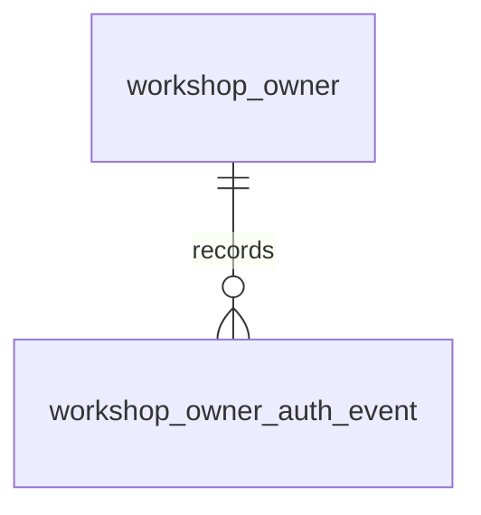

# Entity Specification — Đăng nhập & Đăng xuất (Chủ xưởng) kèm ghi log

> Đặc tả entity cho Feature `FEAT-AUTH-004` (US-013 → US-016).
>
> **Nguồn nghiệp vụ:** [Functional Spec](../feature-functional/us-013-sprint-1-spec.ff.md). Không định nghĩa lại nghiệp vụ.
>
> **Tóm tắt:** Tái sử dụng `WorkshopOwner` (ENT-007, FEAT-AUTH-003) — đã có `last_login_at`, `last_logout_at`. Thêm **ENT-301 `WorkshopAuthEvent`** — log audit append-only cho đăng nhập/đăng xuất/thu hồi của chủ xưởng, cấu trúc giống `AuthEvent` (ENT-101) của chủ xe nhưng **bảng riêng** (FK tới `workshop_owner`). Không có bảng session.

---

# 0. Document Information

| Field | Value |
| --- | --- |
| Document ID | `ENT-SPEC-AUTH-004` |
| Feature | `FEAT-AUTH-004` — Đăng nhập & Đăng xuất (Chủ xưởng) |
| Version | `v1.0` |
| Status | `Review` |
| Sprint | `Sprint 1` |
| Owner | Backend Team |
| Database | PostgreSQL (Supabase), migration bằng Alembic |
| Created Date | `2026-09-27` |
| Updated Date | `2026-09-27` |

## 0.1 Entity Catalog

| Entity ID | Entity | Table | Trạng thái | Vai trò |
| --- | --- | --- | --- | --- |
| `ENT-007` | `WorkshopOwner` | `workshop_owner` | **Tái sử dụng** ([ENT-SPEC-AUTH-003](./us-009-sprint-1-spec.entity.md)) | Nhận diện, kiểm tra khoá/onboarding, ghi `last_login_at` / `last_logout_at` |
| `ENT-301` | `WorkshopAuthEvent` | `workshop_owner_auth_event` | **Mới** | Log audit sự kiện xác thực của chủ xưởng |

**Không lưu:** ID token, refresh token (Firebase quản lý).

### Vì sao không dùng chung bảng `auth_event`?

`auth_event.user_id` là FK `integer` → `vehicle_user.user_id`; chủ xưởng có khoá `uuid` ở bảng khác (FEAT-AUTH-003 W-04 — không hợp nhất tài khoản). Tách bảng giữ FK thật + cascade khi huỷ tài khoản, và hai module độc lập.

---

# ENT-301 — WorkshopAuthEvent

## 1. Entity Information

| Field | Value |
| --- | --- |
| Entity ID | `ENT-301` |
| Entity Name | `WorkshopAuthEvent` |
| Business Name | Log xác thực chủ xưởng |
| Table | `workshop_owner_auth_event` |
| Status | `Review` — **Mới** |

## 2. Entity Overview

**Description** — Bản ghi append-only cho mỗi sự kiện: đăng nhập, đăng nhập bị từ chối, đăng xuất, thu hồi phiên thành công/thất bại.

**Business Purpose** — Audit & điều tra sự cố (`BR-305`, `US-016`).

**Scope** — In: 5 loại sự kiện ở §6. Out: lưu token; đại diện phiên đang hoạt động; UI xem log.

## 3. Business Meaning

Một bản ghi = "chủ xưởng X, lúc T, từ IP/UA Y, đã (đăng nhập | bị từ chối | đăng xuất | được thu hồi phiên)". Không dùng để xác thực request hay quyết định phiên còn hiệu lực.

**Example** — Chủ xưởng SC-01 đăng nhập 08:00 (`login/success`), đăng xuất 17:40 (`logout/success`), worker thu hồi 17:40:02 (`session_revoked/success`).

## 4. Identity & Keys

`id` (`uuid`) PK. Không có unique nghiệp vụ (append-only).

## 5. Attributes

| Field | Type | Required | Nullable | Default | Description | Constraints |
| --- | --- | ---: | ---: | --- | --- | --- |
| `id` | `uuid` | Yes | No | `uuid4` | ID | PK |
| `owner_id` | `uuid` | Yes | No | - | Chủ xưởng | FK → `workshop_owner.id` `ON DELETE CASCADE` |
| `event_type` | `auth_event_type_enum` | Yes | No | - | Loại sự kiện | Dùng lại enum của ENT-101 |
| `result` | `auth_event_result_enum` | Yes | No | - | Kết quả | Dùng lại enum của ENT-101 |
| `reason` | `varchar(64)` | No | Yes | - | Lý do (`account_suspended`, tên lỗi worker...) | Không chứa PII |
| `auth_provider` | `varchar(32)` | No | Yes | `google.com` | Provider | |
| `ip_address` | `varchar(64)` | No | Yes | - | IP client | |
| `user_agent` | `varchar(512)` | No | Yes | - | Trình duyệt | Cắt 512 ký tự |
| `trace_id` | `varchar(64)` | No | Yes | - | `X-Request-ID` | |
| `created_at` | `timestamptz` | Yes | No | `now()` | Thời điểm sự kiện | |

## 6. Attribute Details — `event_type` × `result`

| `event_type` | `result` | Khi nào | Ghi bởi | FF |
| --- | --- | --- | --- | --- |
| `login` | `success` | Sign-in thành công (kể cả tạo tài khoản mới) | API-201 | AC-301, AC-303 |
| `login_denied` | `denied` | Sign-in với tài khoản bị khoá; `reason` = `account_suspended` / `account_inactive` | API-201 | AC-302 |
| `logout` | `success` | Nhận yêu cầu đăng xuất | API-301 | AC-304 |
| `session_revoked` | `success` | Worker thu hồi xong | Worker | AC-305 |
| `session_revoke_failed` | `failed` | Worker thu hồi lỗi (mỗi lần thử); `reason` = tên lỗi | Worker | AC-305 |

Đăng nhập bị từ chối **trước khi** có tài khoản (provider sai, email chưa xác minh, email đã liên kết UID khác) **không** được ghi vì không có `owner_id` để gắn.

## 7. Relationships



`WorkshopOwner` 1:N `WorkshopAuthEvent`; xoá tài khoản (huỷ onboarding quá hạn) xoá log theo cascade.

## 8. Entity Lifecycle / State

Không có state; chỉ INSERT ở tầng ứng dụng. Job purge xoá bản ghi > 60 ngày.

## 9. Business Rules & Constraints

* **BR-ENT-301** (`BR-305`) — Append-only.
* **BR-ENT-302** — Không lưu token, email, CCCD; `reason` là mã ngắn.
* **BR-ENT-303** — `login` / `login_denied` ghi **cùng transaction** với cập nhật `last_login_at` / quyết định từ chối.
* **BR-ENT-304** — `logout` ghi cùng transaction với `last_logout_at`; chỉ commit khi tác vụ thu hồi đã được xếp hàng (lỗi xếp hàng ⇒ rollback, `503`).
* **BR-ENT-305** — Retention 60 ngày (`WORKSHOP_AUTH_EVENT_RETENTION_DAYS`).

## 10. Data Integrity

FK cascade. `CHECK ((event_type IN ('login','logout','session_revoked') AND result = 'success') OR (event_type = 'login_denied' AND result = 'denied') OR (event_type = 'session_revoke_failed' AND result = 'failed'))`.

## 11. Index & Query Requirements

| Query | Index |
| --- | --- |
| Lịch sử của một chủ xưởng | `ix_ws_auth_event_owner_created (owner_id, created_at DESC)` |
| Purge > 60 ngày | `ix_ws_auth_event_created_at (created_at)` |

## 12. Ownership & Authorization

| Actor | Read | Create | Update | Delete |
| --- | ---: | ---: | ---: | ---: |
| Chủ xưởng | ❌ (giai đoạn này) | ✅ gián tiếp (login/logout) | ❌ | ❌ |
| Hệ thống / Worker | ✅ | ✅ | ❌ | ✅ (purge) |

## 13–14. Audit & Data Source

`created_at`. Nguồn: backend (API) và worker; IP/UA từ request.

## 15. Data Sensitivity & Security

| Field | Classification | Notes |
| --- | --- | --- |
| `ip_address`, `user_agent` | Personal Data | Chỉ phục vụ audit; hạn chế quyền đọc |
| token | Secret | Không bao giờ lưu |

Bật RLS, không policy cho `anon`.

## 16. Retention & Deletion

60 ngày kể từ `created_at`; job `workshop_auth.purge_events` chạy hằng ngày 02:30. Cascade khi xoá tài khoản.

## 17. Example Data

```json
{
  "id": "5e6f7a8b-9c0d-4e1f-8a2b-3c4d5e6f7a8b",
  "owner_id": "3a7e9c10-2b4d-4f61-9a0e-5c8d7b6a1f20",
  "event_type": "logout",
  "result": "success",
  "reason": null,
  "auth_provider": "google.com",
  "ip_address": "113.190.1.10",
  "user_agent": "Mozilla/5.0 (Windows NT 10.0; Win64; x64) Chrome/129.0",
  "trace_id": "req-w301a",
  "created_at": "2026-09-27T10:40:00Z"
}
```

## 18. API References

* `POST /api/v1/workshop-owner/oauth/sign-in` (API-201) — ghi `login` / `login_denied`
* `POST /api/v1/workshop-owner/oauth/logout` (API-301) — ghi `logout`
* Worker `workshop_auth.revoke_session` — ghi `session_revoked` / `session_revoke_failed`

---

# ENT-007 — WorkshopOwner (tái sử dụng)

Các cột dùng trong feature (đã có ở [ENT-007](./us-009-sprint-1-spec.entity.md)):

| Field | Dùng để |
| --- | --- |
| `firebase_uid` | Nhận diện khi đăng nhập / đăng xuất |
| `status` | Chặn đăng nhập khi khoá (không chặn đăng xuất) |
| `onboarding_status` | Điều hướng sau đăng nhập |
| `last_login_at` | Cập nhật ở API-201 |
| `last_logout_at` | Cập nhật ở API-301 |

---

# 19. Migration

Revision `d4a9b2c5e6f1_add_workshop_owner_auth_event` (`down_revision = c3f8a1d2e4b7`): tạo `workshop_owner_auth_event`, dùng lại enum `auth_event_type_enum`, `auth_event_result_enum` (`create_type=False`), index ở §11, bật RLS.

---

# 20. Change Log

| Version | Date | Author | Changes |
| --- | --- | --- | --- |
| `v1.0` | `2026-09-27` | `[Cần điền]` | Thêm ENT-301 `WorkshopAuthEvent` |
