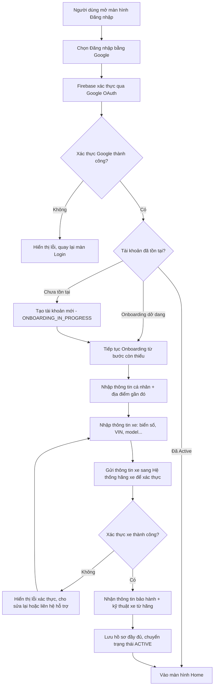
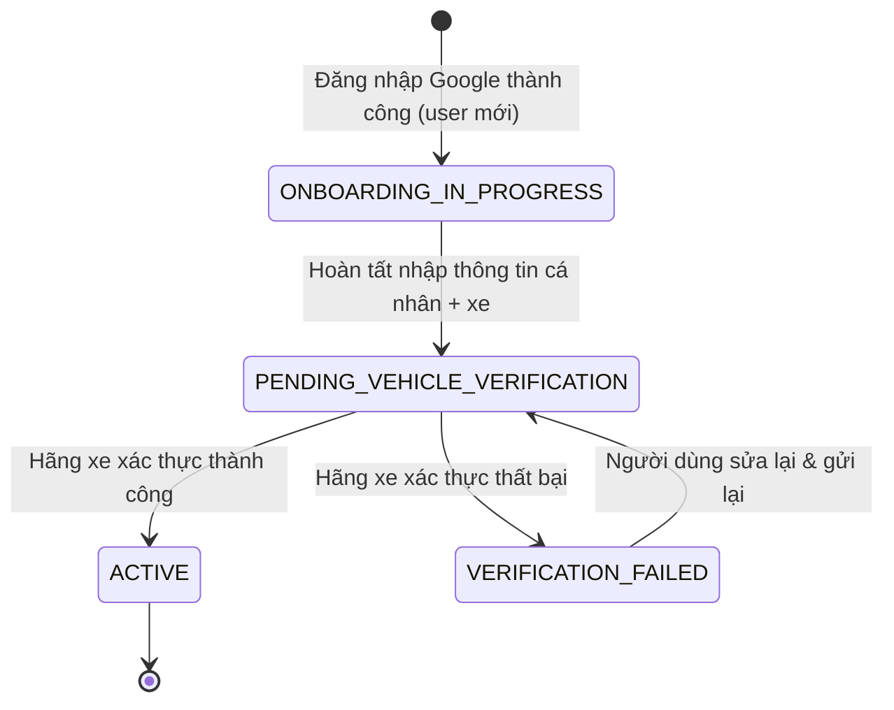

# Functional Specification — Đăng ký & Onboarding người dùng mới qua Google OAuth

> Tài liệu đặc tả chức năng/nghiệp vụ cho Feature "Đăng ký & Onboarding người dùng mới qua Google OAuth".
>
> **Ghi chú:** Các mục còn thiếu thông tin hành chính (tên người phụ trách, link tài liệu liên quan...) được để trống hoặc đánh dấu `[Cần điền]`. Các điểm nghiệp vụ chưa rõ ràng và cần Product/Stakeholder xác nhận được đánh dấu `[Cần xác nhận]` và liệt kê lại ở mục 24 — Open Questions.

---

# 1. Document Information

| Field | Value |
|---|---|
| Feature ID | `FEAT-AUTH-001` |
| Feature Name | `Đăng ký & Onboarding người dùng mới qua Google OAuth` |
| Document Version | `v1.0` |
| Status | `Draft` |
| Product / Project | `[Tên sản phẩm - cần điền]` |
| Business Owner | `[Cần điền]` |
| Author | `[Cần điền]` |
| Reviewer | `[Cần điền]` |
| Stakeholders | Product, Mobile/Frontend, Backend, Đối tác hãng xe, Customer Support |
| Created Date | `2026-09-25` |
| Updated Date | `2026-09-25` |
| Related PRD | `[Link]` |
| Related Frontend Spec | [us-001-sprint-1-spec.fe.md](../frontend/us-001-sprint-1-spec.fe.md) |
| Related API Spec | `[Link]` |
| Related Design / Figma | `[Link]` |
| Related GitHub Issue | `[Link]` |

---

# 2. Feature Overview

## 2.1 Feature Description

Feature cho phép **chủ xe điện** đăng ký tài khoản mới nhanh chóng bằng **Google OAuth** (thông qua Firebase Authentication) thay vì tạo tài khoản/mật khẩu riêng. Ngay sau khi đăng nhập Google lần đầu, người dùng được đưa vào luồng **Onboarding** để khai báo thông tin cá nhân, địa điểm sinh sống/hoạt động gần nhất, và thông tin xe (biển số, VIN, model...). Thông tin xe được hệ thống gửi sang **hệ thống của hãng xe** để xác thực quyền sở hữu; sau khi xác thực thành công, hệ thống lấy về thông tin bảo hành và thông tin kỹ thuật xe để làm nền tảng dữ liệu cho các tính năng bảo dưỡng định kỳ sau này.

## 2.2 Business Objective

Giảm rào cản đăng ký (không cần tạo/nhớ mật khẩu riêng), đảm bảo dữ liệu xe được xác thực chính xác với hãng xe ngay từ đầu, và tạo nền tảng dữ liệu sạch phục vụ các tính năng nhắc bảo dưỡng, đặt lịch, tra cứu bảo hành về sau.

## 2.3 User Objective

Người chủ xe điện có được tài khoản sử dụng ngay lập tức, xe của họ được ghi nhận và xác thực đúng với hãng, và nhận được thông tin bảo hành cùng gợi ý trung tâm bảo dưỡng gần nơi họ sinh sống/hoạt động.

## 2.4 Business Value

Tăng tỉ lệ hoàn tất đăng ký nhờ đăng nhập nhanh; giảm sai sót dữ liệu xe nhờ xác thực trực tiếp với hãng; tạo tiền đề dữ liệu để cá nhân hoá trải nghiệm bảo dưỡng (nhắc lịch, gợi ý trung tâm gần nhất).

---

# 3. Scope

## 3.1 In Scope

- Đăng nhập/đăng ký bằng Google OAuth thông qua Firebase Authentication
- Phát hiện người dùng mới và người dùng đã tồn tại (kể cả trường hợp onboarding dang dở)
- Onboarding: thu thập thông tin cá nhân
- Onboarding: thu thập địa điểm gần đó (khu vực sinh sống/hoạt động) của người dùng
- Onboarding: thu thập thông tin xe (biển số, VIN, model...)
- Gửi thông tin xe sang hệ thống hãng xe để xác thực quyền sở hữu
- Nhận và lưu thông tin bảo hành, thông tin kỹ thuật xe sau khi xác thực thành công
- Xử lý các trường hợp xác thực thất bại và onboarding dang dở

## 3.2 Out of Scope

- Đăng ký bằng email/password hoặc các OAuth provider khác (Facebook, Apple...)
- Chức năng đặt lịch bảo dưỡng (thuộc feature Appointment Booking riêng)
- Quản lý nhiều xe/chuyển nhượng xe giữa các tài khoản
- Chi tiết UI/UX, validate từng field cụ thể (thuộc Frontend Specification)
- Chi tiết endpoint, request/response, mã lỗi HTTP (thuộc API Specification)

---

# 4. Actors & Stakeholders

## 4.1 Actors

| Actor | Type | Responsibility |
|---|---|---|
| Chủ xe điện (End User) | User | Đăng nhập, khai báo thông tin cá nhân, địa điểm và xe |
| Firebase Authentication | System | Xác thực danh tính qua Google, cấp token đăng nhập |
| Google OAuth | System / Partner | Cung cấp cơ chế đăng nhập, xác nhận danh tính người dùng |
| Hệ thống hãng xe (OEM System) | System / Partner | Xác thực quyền sở hữu xe, trả về thông tin bảo hành & kỹ thuật |
| Backend Application | System | Điều phối luồng đăng ký, lưu dữ liệu, gọi hệ thống hãng xe |

## 4.2 Stakeholders

| Stakeholder | Organization / Team | Interest / Responsibility |
|---|---|---|
| Product Owner | Product Team | Định nghĩa yêu cầu nghiệp vụ, phê duyệt luồng |
| Mobile/Frontend Team | Engineering | Xây dựng màn hình đăng nhập & onboarding |
| Backend Team | Engineering | Xây dựng API đăng ký, tích hợp hệ thống hãng xe |
| Đối tác hãng xe | Partner | Cung cấp API xác thực xe & dữ liệu bảo hành |
| Customer Support | Business | Xử lý case người dùng bị kẹt ở onboarding |

---

# 5. User Story

## US-001

**As a** chủ xe điện chưa có tài khoản

**I want to** đăng ký/đăng nhập nhanh bằng tài khoản Google của mình

**So that** tôi không cần tạo và ghi nhớ mật khẩu riêng, và có thể bắt đầu sử dụng ứng dụng ngay

### Additional User Stories

- `US-002`: As a người dùng mới sau khi đăng nhập Google, I want to khai báo thông tin cá nhân và thông tin xe, so that hệ thống xác thực và liên kết đúng xe với tài khoản của tôi.
- `US-003`: As a người dùng mới, I want to cung cấp địa điểm/khu vực tôi đang sinh sống trong lúc onboarding, so that hệ thống gợi ý được các trung tâm bảo dưỡng gần nơi tôi ở.
- `US-004`: As a chủ xe điện, I want to được thông báo rõ ràng khi thông tin xe không xác thực được với hãng, so that tôi biết cách xử lý (kiểm tra lại VIN, liên hệ hỗ trợ...).

---

# 6. Use Case

## UC-001 — Đăng ký tài khoản mới & Onboarding thông tin xe qua Google OAuth

### 6.1 Use Case Description

Người dùng mới đăng nhập bằng Google, sau đó được dẫn qua luồng Onboarding để khai báo thông tin cá nhân, địa điểm và thông tin xe; hệ thống xác thực xe với hãng xe và kích hoạt tài khoản khi thành công.

### 6.2 Primary Actor

Chủ xe điện (End User)

### 6.3 Supporting Actors / Systems

- Firebase Authentication
- Google OAuth
- Hệ thống hãng xe (OEM System)

### 6.4 Trigger

Người dùng chưa có tài khoản chọn "Đăng nhập bằng Google" trên màn hình đăng nhập.

### 6.5 Preconditions

- Người dùng có tài khoản Google hợp lệ và đang hoạt động
- Ứng dụng đã cấu hình Firebase Authentication với Google Provider
- Người dùng có kết nối mạng ổn định

### 6.6 Postconditions

- **Thành công:** Tài khoản được tạo với trạng thái `ACTIVE`; thông tin cá nhân, địa điểm và xe đã được lưu; thông tin bảo hành/kỹ thuật xe đã được đồng bộ từ hãng xe
- **Thất bại:** Tài khoản ở trạng thái `ONBOARDING_IN_PROGRESS` hoặc `VERIFICATION_FAILED` tuỳ điểm dừng

---

# 7. User Flow

## 7.1 Main User Flow



## 7.2 Flow Description

| Step | Actor | Action / Event | System Response | Result |
|---|---|---|---|---|
| 1 | User | Chọn "Đăng nhập bằng Google" | Firebase mở popup/redirect Google OAuth | Người dùng thấy màn hình đăng nhập Google |
| 2 | User | Xác nhận đăng nhập bằng tài khoản Google | Firebase trả token; hệ thống kiểm tra email đã tồn tại chưa | Xác định user mới hay đã tồn tại |
| 3 | System | Phát hiện user mới | Điều hướng sang màn Onboarding | Người dùng vào luồng khai báo thông tin |
| 4 | User | Nhập thông tin cá nhân + địa điểm gần đó | Hệ thống validate và lưu tạm | Thông tin cá nhân được ghi nhận |
| 5 | User | Nhập thông tin xe (biển số, VIN, model...) | Hệ thống gửi thông tin lên hệ thống hãng xe để xác thực | Hiển thị trạng thái "Đang xác thực" |
| 6 | System | Nhận phản hồi xác thực từ hãng xe | Thành công: lấy thông tin bảo hành/kỹ thuật; thất bại: trả lỗi | Người dùng biết kết quả xác thực |
| 7 | System | Lưu hồ sơ hoàn chỉnh | Chuyển trạng thái tài khoản sang `ACTIVE` | Người dùng hoàn tất đăng ký, vào Home |

---

# 8. Screen / UI Flow

## 8.1 Screen Flow

```text
[SCR-001 Login]
    |
    v
[SCR-002 Onboarding: Thông tin cá nhân + Địa điểm]
    |
    v
[SCR-003 Onboarding: Thông tin xe]
    |
    v
[SCR-004 Đang xác thực xe]
    |
    +----> [SCR-005 Onboarding thành công -> Home]
    |
    +----> [SCR-006 Xác thực thất bại]
                |
                v
        (Quay lại SCR-003 để sửa)
```

## 8.2 Screen List

| Screen ID | Screen Name | Purpose | Entry From | Exit To |
|---|---|---|---|---|
| `SCR-001` | Login | Đăng nhập bằng Google | App launch | SCR-002 hoặc Home |
| `SCR-002` | Onboarding - Thông tin cá nhân & Địa điểm | Thu thập thông tin cá nhân, địa điểm gần đó | SCR-001 | SCR-003 |
| `SCR-003` | Onboarding - Thông tin xe | Thu thập thông tin xe | SCR-002 | SCR-004 |
| `SCR-004` | Đang xác thực xe | Chờ phản hồi xác thực từ hãng xe | SCR-003 | SCR-005 hoặc SCR-006 |
| `SCR-005` | Onboarding thành công | Xác nhận hoàn tất, chuyển vào Home | SCR-004 | Home |
| `SCR-006` | Xác thực thất bại | Thông báo lỗi, hướng dẫn xử lý | SCR-004 | SCR-003 hoặc hỗ trợ |

## 8.3 Screen / UI Reference

### SCR-002 — Onboarding: Thông tin cá nhân & Địa điểm

**Purpose:** Thu thập thông tin cá nhân và địa điểm gần đó của người dùng.

**Main UI**
- Form nhập họ tên, số điện thoại, ngày sinh (tuỳ chọn)
- Trường chọn/nhập địa điểm gần đó (địa chỉ hoặc vị trí trên bản đồ) `[Cần xác nhận cách nhập: gõ địa chỉ hay chọn trên bản đồ]`
- Nút "Tiếp tục"

**Business Meaning:** Đây là dữ liệu định danh cơ bản và là căn cứ để sau này gợi ý trung tâm bảo dưỡng gần người dùng.

**User Action:** Nhập/chỉnh sửa thông tin, xác nhận địa điểm, nhấn Tiếp tục.

**System Behavior:** Validate dữ liệu bắt buộc, lưu tạm hồ sơ, chuyển sang bước nhập thông tin xe.

**Design Reference:** `[Figma link]`

---

### SCR-003 — Onboarding: Thông tin xe

**Purpose:** Thu thập thông tin định danh xe để gửi xác thực với hãng xe.

**Main UI**
- Form nhập biển số xe, số VIN/số khung, model, năm sản xuất
- Nút "Xác nhận & Xác thực"

**Business Meaning:** Đây là bước gắn xe vào tài khoản người dùng; dữ liệu này sẽ được đối chiếu với hệ thống hãng xe.

**User Action:** Nhập thông tin xe, nhấn xác nhận để gửi xác thực.

**System Behavior:** Validate định dạng dữ liệu, gửi request xác thực sang hệ thống hãng xe, chuyển sang màn "Đang xác thực".

**Design Reference:** `[Figma link]`

---

### SCR-004 — Đang xác thực xe

**Purpose:** Thông báo hệ thống đang chờ phản hồi xác thực từ hãng xe.

**Main UI:** Trạng thái loading, thông điệp "Đang xác thực thông tin xe của bạn..."

**Business Meaning:** Phản ánh trạng thái trung gian `PENDING_VEHICLE_VERIFICATION`.

**User Action:** Chờ; có thể có tuỳ chọn thoát và xử lý sau `[Cần xác nhận]`.

**System Behavior:** Gọi API hãng xe, nhận phản hồi, điều hướng sang SCR-005 hoặc SCR-006 tương ứng.

**Design Reference:** `[Figma link]`

---

### SCR-006 — Xác thực thất bại

**Purpose:** Thông báo lỗi xác thực xe và hướng dẫn xử lý.

**Main UI:** Thông điệp lỗi, nút "Sửa lại thông tin xe", nút "Liên hệ hỗ trợ".

**Business Meaning:** Phản ánh trạng thái `VERIFICATION_FAILED`.

**User Action:** Sửa lại thông tin xe để gửi xác thực lại, hoặc liên hệ hỗ trợ.

**System Behavior:** Cho phép quay lại SCR-003 để nhập lại; ghi log số lần thử `[Cần xác nhận giới hạn số lần retry]`.

**Design Reference:** `[Figma link]`

---

# 9. Main Flow

## 9.1 Happy Path

1. Người dùng chọn "Đăng nhập bằng Google" và xác thực thành công qua Firebase.
2. Hệ thống phát hiện đây là người dùng mới, điều hướng sang Onboarding.
3. Người dùng nhập thông tin cá nhân và địa điểm gần đó.
4. Người dùng nhập thông tin xe; hệ thống gửi xác thực sang hệ thống hãng xe.
5. Hãng xe xác thực thành công, hệ thống lấy thông tin bảo hành/kỹ thuật xe, kích hoạt tài khoản (`ACTIVE`) và đưa người dùng vào Home.

---

# 10. Alternative Flow

## AF-001 — Người dùng đã có tài khoản Active

**Condition:** Email Google đã tồn tại trong hệ thống và tài khoản ở trạng thái `ACTIVE`.

**Flow**
1. Người dùng đăng nhập Google.
2. Hệ thống nhận diện tài khoản đã tồn tại và đã Active.
3. Điều hướng thẳng vào Home, bỏ qua Onboarding.

**Expected Result:** Người dùng vào ứng dụng ngay mà không phải nhập lại thông tin.

## AF-002 — Onboarding dang dở

**Condition:** Email Google đã tồn tại nhưng tài khoản đang ở trạng thái `ONBOARDING_IN_PROGRESS` hoặc `VERIFICATION_FAILED`.

**Flow**
1. Người dùng đăng nhập Google.
2. Hệ thống nhận diện onboarding chưa hoàn tất.
3. Điều hướng người dùng quay lại đúng bước còn dang dở (không bắt nhập lại từ đầu).

**Expected Result:** Người dùng tiếp tục onboarding mà không mất dữ liệu đã nhập trước đó.

---

# 11. Exception Flow

## EF-001 — Đăng nhập Google thất bại/bị huỷ

**Condition:** Người dùng huỷ đăng nhập hoặc Google/Firebase trả lỗi xác thực.

**System Behavior:** Không tạo tài khoản, không lưu dữ liệu.

**User Experience:** Thấy thông báo lỗi, được đưa về màn Login để thử lại.

**Recovery:** Người dùng thử đăng nhập lại.

## EF-002 — Timeout/lỗi kết nối tới hệ thống hãng xe

**Condition:** Hệ thống hãng xe không phản hồi trong thời gian quy định `[Cần xác nhận ngưỡng thời gian]`.

**System Behavior:** Giữ tài khoản ở trạng thái `PENDING_VEHICLE_VERIFICATION`, không chuyển ACTIVE.

**User Experience:** Thấy thông báo "Hệ thống đang xử lý lâu hơn dự kiến", có thể chờ hoặc thoát và kiểm tra lại sau.

**Recovery:** Retry tự động hoặc thủ công `[Cần xác nhận cơ chế]`.

## EF-003 — Thông tin xe không hợp lệ/không tồn tại tại hãng xe

**Condition:** VIN/biển số sai hoặc không khớp dữ liệu bên hãng xe.

**System Behavior:** Trả về trạng thái `VERIFICATION_FAILED`, không kích hoạt tài khoản.

**User Experience:** Thấy thông báo lỗi cụ thể, được hướng dẫn kiểm tra lại thông tin.

**Recovery:** Người dùng sửa lại và gửi xác thực lại (xem BR-006).

## EF-004 — Xe đã được liên kết với tài khoản khác

**Condition:** VIN/biển số đã tồn tại và đang gắn với một tài khoản khác đang `ACTIVE`.

**System Behavior:** Từ chối liên kết, không ghi đè dữ liệu.

**User Experience:** Thấy thông báo "Xe đã được đăng ký bởi tài khoản khác", được hướng dẫn liên hệ hỗ trợ.

**Recovery:** Xử lý thủ công qua Customer Support (chuyển nhượng xe nằm ngoài scope — xem mục 3.2).

---

# 12. Business Rules

## BR-001 — Một tài khoản Google chỉ liên kết với một tài khoản hệ thống

**Rule:** Mỗi email Google chỉ được phép tạo/liên kết với đúng một tài khoản người dùng.

**Condition:** Khi đăng nhập Google và email đã tồn tại trong hệ thống.

**Expected Behavior:** Đăng nhập vào tài khoản hiện có, không tạo tài khoản mới.

**Priority:** High

## BR-002 — Một xe (VIN) chỉ được liên kết với một tài khoản Active tại một thời điểm

**Rule:** Không cho phép hai tài khoản cùng sở hữu một VIN ở trạng thái Active.

**Condition:** VIN đã gắn với một tài khoản khác đang Active.

**Expected Behavior:** Từ chối liên kết, thông báo và hướng dẫn liên hệ hỗ trợ.

**Priority:** High

## BR-003 — Bắt buộc hoàn tất Onboarding trước khi dùng tính năng chính

**Rule:** Tài khoản chưa `ACTIVE` không được truy cập các tính năng chính (đặt lịch, nhắc bảo dưỡng...).

**Condition:** Trạng thái tài khoản khác `ACTIVE`.

**Expected Behavior:** Giới hạn truy cập, điều hướng về Onboarding.

**Priority:** High

## BR-004 — Xác thực xe với hãng xe là bắt buộc

**Rule:** Xe chỉ được ghi nhận hợp lệ sau khi hãng xe xác thực thành công.

**Condition:** Sau khi người dùng nhập xong thông tin xe.

**Expected Behavior:** Chỉ chuyển `ACTIVE` khi có phản hồi xác thực thành công từ hãng xe.

**Priority:** High

## BR-005 — Địa điểm gần đó là thông tin thu thập trong Onboarding

**Rule:** Người dùng cung cấp địa điểm/khu vực sinh sống hoặc hoạt động chính trong bước Onboarding, dùng để gợi ý trung tâm bảo dưỡng gần nhất.

**Condition:** Trong bước nhập thông tin cá nhân.

**Expected Behavior:** `[Cần xác nhận]` — bắt buộc hay tuỳ chọn; nếu bắt buộc thì không cho hoàn tất bước nếu thiếu.

**Priority:** Medium

## BR-006 — Cho phép sửa và xác thực lại khi thất bại

**Rule:** Khi xác thực xe thất bại, người dùng được quay lại sửa thông tin và gửi xác thực lại.

**Condition:** Trạng thái `VERIFICATION_FAILED`.

**Expected Behavior:** Cho phép quay lại SCR-003 để sửa & gửi lại; `[Cần xác nhận]` có giới hạn số lần retry hay không.

**Priority:** Medium

---

# 13. State / Status

## 13.1 State List

| State | Meaning | Entry Condition | Exit Condition |
|---|---|---|---|
| `ONBOARDING_IN_PROGRESS` | Đã đăng nhập Google, chưa hoàn tất khai báo thông tin | Đăng nhập Google thành công (user mới) | Hoàn tất nhập thông tin cá nhân + xe |
| `PENDING_VEHICLE_VERIFICATION` | Đang chờ hãng xe xác thực thông tin xe | Đã gửi thông tin xe đi xác thực | Nhận được phản hồi từ hãng xe |
| `ACTIVE` | Tài khoản hợp lệ, đã hoàn tất onboarding | Hãng xe xác thực thành công | — |
| `VERIFICATION_FAILED` | Xác thực xe thất bại | Hãng xe trả lỗi xác thực | Người dùng sửa & gửi lại thông tin |

## 13.2 State Transition



---

# 14. Data Requirements

## 14.1 Required Data

| Data | Type | Required | Description | Source |
|---|---|---:|---|---|
| `google_uid` | string | Yes | Định danh người dùng từ Firebase/Google | Firebase Authentication |
| `email` | string | Yes | Email Google dùng để đăng nhập | Firebase/Google |
| `display_name` | string | No | Tên hiển thị lấy từ Google | Firebase/Google |
| `full_name` | string | Yes | Họ tên đầy đủ | User input |
| `phone_number` | string | Yes | Số điện thoại liên hệ | User input |
| `date_of_birth` | date | No | Ngày sinh | User input |
| `location` | string/geo | Yes | Địa điểm/khu vực gần đó của người dùng | User input |
| `license_plate` | string | Yes | Biển số xe | User input |
| `vin` | string | Yes | Số khung/VIN xe | User input |
| `vehicle_model` | string | Yes | Dòng xe | User input / Hãng xe |
| `vehicle_year` | number | No | Năm sản xuất | Hãng xe |
| `warranty_info` | object | No | Thông tin bảo hành (thời hạn, điều kiện) | Hãng xe |
| `verification_status` | string | Yes | Trạng thái xác thực xe | System |

## 14.2 Data Dependency

| Data / Entity | Why Needed | Read / Write | Owner |
|---|---|---|---|
| Vehicle record (Hệ thống hãng xe) | Xác thực quyền sở hữu, lấy thông tin bảo hành/kỹ thuật | Read | Hãng xe (Partner) |
| User identity (Firebase Authentication) | Xác thực danh tính người dùng qua Google | Read | Firebase/Google |
| User Profile (nội bộ) | Lưu thông tin cá nhân, xe, trạng thái onboarding | Write | Backend Application |

---

# 15. Business Error & Edge Cases

| Case ID | Scenario | Expected Business Behavior | User Outcome |
|---|---|---|---|
| `EDGE-001` | Người dùng thoát app giữa chừng khi đang Onboarding | Giữ trạng thái `ONBOARDING_IN_PROGRESS`, cho tiếp tục từ bước dang dở khi đăng nhập lại | Không mất dữ liệu, tiếp tục đúng bước |
| `EDGE-002` | VIN/biển số đã gắn với tài khoản Active khác | Từ chối liên kết, không tạo bản ghi mới | Thấy lỗi rõ ràng, được hướng dẫn liên hệ hỗ trợ |
| `EDGE-003` | Hệ thống hãng xe không phản hồi/timeout | Giữ `PENDING_VEHICLE_VERIFICATION`, retry theo cơ chế `[Cần xác nhận]` | Thấy trạng thái "Đang xác thực", không bị treo |
| `EDGE-004` | Email Google trùng tài khoản đã bị khoá | Từ chối đăng nhập | Thấy thông báo tài khoản bị khoá, hướng dẫn liên hệ hỗ trợ |
| `EDGE-005` | VIN/biển số sai định dạng | Validate trước khi gửi hãng xe (chi tiết ở FE Spec) | Biết lỗi ngay, không cần chờ gọi hãng xe |

---

# 16. Permissions & Access

## 16.1 Access Matrix

| Role / Actor | View | Create | Update | Delete | Notes |
|---|---:|---:|---:|---:|---|
| `USER` | ✅ (hồ sơ của mình) | ✅ (lần đầu, khi onboarding) | ✅ (hồ sơ của mình) | ❌ | Chỉ thao tác trên hồ sơ và xe của chính mình |
| `CUSTOMER_SUPPORT` | ✅ | ❌ | ✅ (hỗ trợ xử lý case) | ❌ | Hỗ trợ case lỗi onboarding, không tạo hồ sơ hộ |
| `ADMIN` | ✅ | ✅ | ✅ | ✅ | Toàn quyền quản trị dữ liệu |

## 16.2 Business Authorization Rules

- Người dùng chỉ được xem/sửa thông tin cá nhân và xe của chính tài khoản mình.
- Liên kết một VIN với tài khoản mới bắt buộc phải qua xác thực thành công từ hãng xe; không tự ý gán thủ công trừ trường hợp ADMIN xử lý case đặc biệt (có log lại).

---

# 17. Acceptance Criteria

## AC-001 — Tạo tài khoản mới sau khi đăng nhập Google

**Given** người dùng chưa có tài khoản

**When** họ đăng nhập thành công bằng Google

**Then** hệ thống tạo tài khoản mới ở trạng thái `ONBOARDING_IN_PROGRESS` và điều hướng sang Onboarding

## AC-002 — Gửi xác thực xe sau khi nhập đủ thông tin

**Given** người dùng đang ở bước Onboarding

**When** họ nhập đầy đủ và hợp lệ thông tin cá nhân, địa điểm và thông tin xe

**Then** hệ thống gửi thông tin xe sang hãng xe để xác thực

## AC-003 — Kích hoạt tài khoản khi xác thực thành công

**Given** thông tin xe được hãng xe xác thực thành công

**When** hệ thống nhận phản hồi

**Then** hệ thống lưu thông tin bảo hành/kỹ thuật xe và chuyển trạng thái tài khoản sang `ACTIVE`

## AC-004 — Thông báo khi xác thực thất bại

**Given** thông tin xe xác thực thất bại

**When** hệ thống nhận phản hồi lỗi từ hãng xe

**Then** người dùng được thông báo lỗi rõ ràng và có thể sửa lại thông tin xe để gửi lại

## AC-005 — Bỏ qua Onboarding cho tài khoản đã Active

**Given** người dùng đã có tài khoản `ACTIVE`

**When** họ đăng nhập lại bằng Google

**Then** hệ thống đưa thẳng vào Home, không yêu cầu onboarding lại

---

# 18. Non-functional Expectations

| Requirement | Expected Behavior |
|---|---|
| Availability | Luồng đăng nhập/onboarding cần khả dụng tương đương SLA của Firebase Authentication; `[Cần xác nhận SLA hệ thống hãng xe]` |
| Response Experience | Cần hiển thị trạng thái loading rõ ràng khi chờ xác thực xe nếu quá ngưỡng thời gian `[Cần xác nhận ngưỡng]` |
| Notification Timing | Người dùng cần biết kết quả xác thực xe ngay khi hệ thống nhận được phản hồi |
| Duplicate Handling | Không tạo trùng tài khoản cho cùng một email Google; không cho phép trùng VIN Active giữa hai tài khoản |

---

# 19. Dependencies

| Dependency | Purpose | Owner | Required | Related Document |
|---|---|---|---:|---|
| Firebase Authentication (Google Provider) | Xác thực danh tính người dùng | Google/Firebase | Yes | `[Link]` |
| Hệ thống hãng xe (OEM API) | Xác thực xe, lấy thông tin bảo hành/kỹ thuật | Đối tác hãng xe | Yes | `[Link]` |
| Dịch vụ bản đồ/địa điểm | Hỗ trợ chọn/xác định địa điểm gần đó | `[Cần xác nhận nhà cung cấp]` | No | `[Link]` |

---

# 20. Assumptions

- "Địa điểm gần đó" được giả định là địa chỉ/khu vực sinh sống hoặc nơi hoạt động chính của người dùng, dùng để gợi ý trung tâm bảo dưỡng gần nhất — **cần Product/Stakeholder xác nhận lại**.
- Mỗi tài khoản ban đầu chỉ liên kết với một xe; hỗ trợ nhiều xe/tài khoản chưa nằm trong scope bản v1.0.
- Hệ thống hãng xe cung cấp API xác thực theo thời gian thực (đồng bộ); nếu là bất đồng bộ (webhook/queue) cần cập nhật lại luồng ở mục 7 và 11.
- Người dùng bắt buộc phải có xe đã đăng ký hợp lệ với hãng (VIN tồn tại trong hệ thống hãng) mới có thể hoàn tất onboarding.

---

# 21. Business Constraints

- Tuân thủ quy định pháp luật về bảo vệ dữ liệu cá nhân tại Việt Nam (Nghị định 13/2023/NĐ-CP) khi thu thập, xử lý thông tin cá nhân người dùng.
- Dữ liệu xe (VIN, biển số) chỉ được chia sẻ cho hệ thống hãng xe khi có sự đồng ý của người dùng (cần bước xin phép/consent trong Onboarding).
- Việc tích hợp với hệ thống hãng xe phải tuân theo thoả thuận API giữa hai bên (SLA, rate limit, bảo mật dữ liệu).

---

# 22. Terminology / Glossary

| Term ID | Term | Vietnamese Name | Definition | Example / Notes |
|---|---|---|---|---|
| `TERM-001` | Onboarding | Thiết lập tài khoản ban đầu | Quá trình thu thập thông tin cá nhân, địa điểm và xe ngay sau lần đăng nhập đầu tiên | Gồm các bước tại SCR-002, SCR-003 |
| `TERM-002` | VIN | Số khung/số VIN | Vehicle Identification Number — mã định danh duy nhất của xe do hãng cấp | Dùng để xác thực xe với hãng |
| `TERM-003` | OEM System | Hệ thống hãng xe | Hệ thống do hãng sản xuất/phân phối xe vận hành, lưu thông tin sở hữu và bảo hành | Đối tác bên ngoài |
| `TERM-004` | Firebase Authentication | Xác thực Firebase | Dịch vụ xác thực của Google, hỗ trợ đăng nhập qua nhiều provider (trong đó có Google OAuth) | |
| `TERM-005` | Verification Status | Trạng thái xác thực | Kết quả xác thực thông tin xe với hãng xe | `PENDING` / `SUCCESS` / `FAILED` |

### Important Terminology Rules

- "Onboarding" luôn chỉ quá trình thiết lập hồ sơ ban đầu, không dùng để chỉ các luồng cập nhật thông tin sau này.
- Không dùng "đăng ký" để thay thế cho "xác thực xe" — đây là hai khái niệm nghiệp vụ khác nhau.

---

# 23. Partner / Stakeholder Notes

## 23.1 Confirmed

- `[Cần điền sau khi họp thống nhất với đối tác hãng xe]`

## 23.2 Pending Confirmation

- Cơ chế xác thực xe với hãng xe là đồng bộ (real-time) hay bất đồng bộ (webhook/callback)?
- Hãng xe có giới hạn số lần gọi API xác thực (rate limit) không?
- Trường hợp xe mới mua, dữ liệu chưa cập nhật trên hệ thống hãng thì xử lý thế nào?

---

# 24. Open Questions

| ID | Question | Owner | Status | Decision / Due Date |
|---|---|---|---|---|
| `Q-001` | Trường "địa điểm gần đó" là địa chỉ cố định hay vị trí GPS hiện tại? Có sửa được sau không? | Product | Open | |
| `Q-002` | Có giới hạn số lần retry khi xác thực xe thất bại không? | Product/Backend | Open | |
| `Q-003` | Một tài khoản có được đăng ký nhiều xe trong tương lai không? | Product | Open | |
| `Q-004` | Khi hệ thống hãng xe timeout, có cho vào Home tạm với trạng thái "Chờ xác thực" hay bắt buộc chờ? | Product/Backend | Open | |
| `Q-005` | Trường thông tin cá nhân nào bắt buộc, trường nào tuỳ chọn (ngày sinh, giới tính...)? | Product/Design | Open | |

---

# 25. Traceability

| Item | Reference |
|---|---|
| PRD | `[Link]` |
| User Story | `US-001`, `US-002`, `US-003`, `US-004` |
| Use Case | `UC-001` |
| Business Rules | `BR-001` – `BR-006` |
| Acceptance Criteria | `AC-001` – `AC-005` |
| Frontend Specification | [us-001-sprint-1-spec.fe.md](../frontend/us-001-sprint-1-spec.fe.md) |
| API Specification | `[Link]` |
| Test Cases | `[Link]` |
| GitHub Issue / Epic | `[Link]` |

---

# 26. Related Documents

- [PRD](`[Link]`)
- [Frontend Specification](../frontend/us-001-sprint-1-spec.fe.md)
- [API Specification](`[Link]`)
- [Design / Figma](`[Link]`)
- [Test Specification](`[Link]`)

---

# 27. Change Log

| Version | Date | Author | Change |
|---|---|---|---|
| `v1.0` | `2026-09-25` | `[Author]` | Bản nháp đầu tiên, dựa trên mô tả nghiệp vụ ban đầu |

---

# 28. Approval

| Role | Name | Status | Date |
|---|---|---|---|
| Product Owner | `[Name]` | Pending | |
| Business Stakeholder | `[Name]` | Pending | |
| Technical Owner | `[Name]` | Pending | |