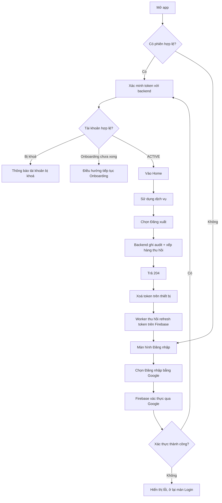
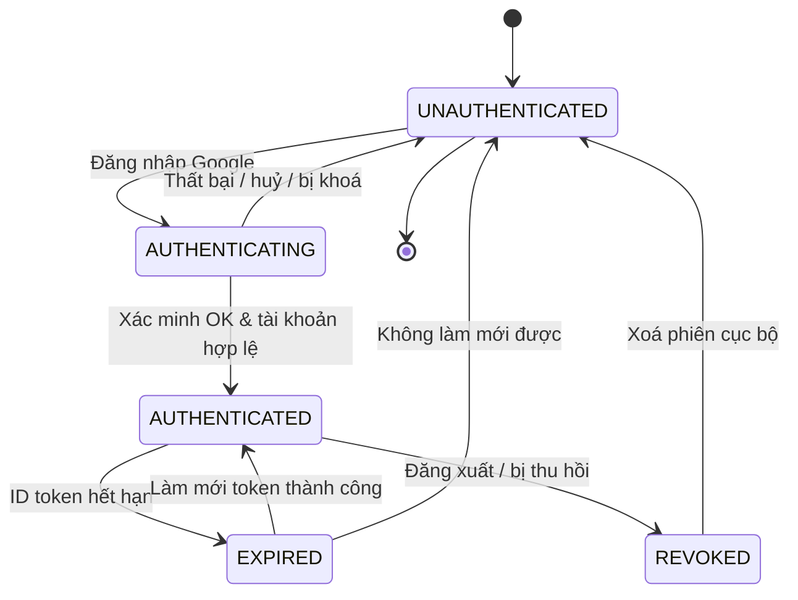

# Functional Specification — Đăng nhập & Đăng xuất (Chủ xe)

> Tài liệu đặc tả chức năng/nghiệp vụ cho Feature "Đăng nhập & Đăng xuất" dành cho **chủ xe điện** (người dùng cần tra cứu bảo hành, bảo dưỡng).
>
> **Quan hệ với FEAT-AUTH-001:** Feature đăng ký & onboarding ([us-001](./us-001-sprint-1-spec.ff.md)) đã định nghĩa hành vi lần **đăng nhập đầu tiên** (tạo tài khoản + onboarding). Tài liệu này tập trung vào vòng đời **phiên đăng nhập của người dùng đã có tài khoản** và **đăng xuất**. Phần khớp nhau (xác thực Google qua Firebase, điều hướng theo `onboarding_status`) được **tham chiếu**, không định nghĩa lại.
>
> **Ghi chú:** Các quyết định cho câu hỏi làm rõ Q-101–Q-105 được chốt tại mục 24 và áp dụng thống nhất trong tài liệu này.

---

# 1. Document Information

| Field | Value |
|---|---|
| Feature ID | `FEAT-AUTH-002` |
| Feature Name | `Đăng nhập & Đăng xuất (Chủ xe)` |
| Document Version | `v1.0` |
| Status | `Draft` |
| Product / Project | `EV Care` |
| Business Owner | `[Cần điền]` |
| Author | `[Cần điền]` |
| Reviewer | `[Cần điền]` |
| Stakeholders | Product, Mobile/Frontend, Backend, Customer Support, Security |
| Created Date | `2026-09-27` |
| Updated Date | `2026-09-27` |
| Related PRD | `[Link]` |
| Related Frontend Spec | [us-005-sprint-1-spec.fe.md](../frontend/us-005-sprint-1-spec.fe.md) |
| Related API Spec | [us-005-sprint-1-spec.api.md](../api/us-005-sprint-1-spec.api.md) |
| Related Design / Figma | `[Link]` |
| Related GitHub Issue | `[Link]` |

---

# 2. Feature Overview

## 2.1 Feature Description

Feature cho phép **chủ xe điện đã có tài khoản** đăng nhập lại vào ứng dụng EV Care bằng **Google OAuth** (qua Firebase Authentication), duy trì phiên đăng nhập giữa các lần mở app, và **đăng xuất** an toàn khi không muốn tiếp tục phiên. Sau khi đăng nhập thành công, người dùng ở trạng thái tài khoản hợp lệ (`ACTIVE`) được đưa thẳng vào Home để sử dụng các tính năng chính (tra cứu bảo hành, nhắc bảo dưỡng...). Đăng xuất chấm dứt phiên trên thiết bị ngay; backend ghi audit và xử lý thu hồi refresh token nền.

## 2.2 Business Objective

Cho phép người dùng quay lại sử dụng dịch vụ nhanh chóng và an toàn mà không cần nhập lại mật khẩu, đồng thời đảm bảo người dùng có thể chủ động kết thúc phiên (bảo vệ dữ liệu cá nhân, xe và bảo hành trên thiết bị dùng chung/thất lạc).

## 2.3 User Objective

Chủ xe mở app là vào được ngay dịch vụ (không phải onboarding lại), và khi cần thì đăng xuất để bảo vệ tài khoản của mình.

## 2.4 Business Value

Tăng mức độ quay lại và sự tin tưởng nhờ trải nghiệm đăng nhập liền mạch; giảm rủi ro lộ dữ liệu cá nhân/xe nhờ đăng xuất an toàn và cơ chế vô hiệu hoá phiên; giảm tải cho Customer Support nhờ luồng xử lý phiên hết hạn/khoá rõ ràng.

---

# 3. Scope

## 3.1 In Scope

- Đăng nhập bằng Google OAuth (qua Firebase) cho tài khoản đã tồn tại.
- Tự động khôi phục phiên khi mở lại app nếu phiên còn hiệu lực (auto-login).
- Điều hướng sau đăng nhập theo trạng thái tài khoản: `ACTIVE` → Home; onboarding chưa xong → tiếp tục onboarding (tham chiếu FEAT-AUTH-001).
- Xử lý phiên hết hạn / bị thu hồi → yêu cầu đăng nhập lại.
- Đăng xuất: kết thúc phiên trên thiết bị, ghi audit và đưa yêu cầu thu hồi refresh token lên xử lý nền.
- Các luồng đăng nhập, khôi phục/kiểm tra phiên và sử dụng tính năng được bảo vệ yêu cầu có mạng; không hỗ trợ chế độ dùng tính năng chính offline.
- Chặn đăng nhập với tài khoản bị khoá (`INACTIVE` / `SUSPENDED`).

## 3.2 Out of Scope

- Đăng ký tài khoản mới & onboarding (thuộc FEAT-AUTH-001).
- Đăng nhập bằng email/mật khẩu hoặc provider khác (Facebook, Apple...).
- Quản lý danh sách thiết bị hoặc cung cấp thao tác quản trị phiên theo từng thiết bị. Firebase revoke hiện tại có tác động tới refresh token của mọi thiết bị dùng cùng UID.
- Đổi/khoá tài khoản, chuyển nhượng xe (feature quản trị riêng).
- Xác thực 2 lớp (SĐT/OTP) — nằm ở giai đoạn sau (xem FEAT-AUTH-001 D-01).

---

# 4. Actors & Stakeholders

## 4.1 Actors

| Actor | Type | Responsibility |
|---|---|---|
| Chủ xe điện (End User) | User | Đăng nhập, sử dụng dịch vụ, đăng xuất |
| Firebase Authentication | System | Xác thực Google, cấp & làm mới ID token, thu hồi refresh token |
| Google OAuth | System / Partner | Xác nhận danh tính người dùng |
| Backend Application | System | Xác minh token, nhận diện tài khoản, điều hướng, ghi nhận đăng xuất, vô hiệu hoá phiên |

## 4.2 Stakeholders

| Stakeholder | Organization / Team | Interest / Responsibility |
|---|---|---|
| Product Owner | Product | Định nghĩa hành vi phiên đăng nhập & bảo mật trải nghiệm |
| Mobile/Frontend Team | Engineering | Tích hợp Firebase SDK, lưu/khôi phục phiên, xử lý hết hạn |
| Backend Team | Engineering | Xác minh token, logout, thu hồi phiên |
| Security | Business/Engineering | Chính sách phiên, thu hồi, bảo vệ dữ liệu cá nhân |
| Customer Support | Business | Hỗ trợ case không đăng nhập được / tài khoản bị khoá |

---

# 5. User Story

## US-005

**As a** chủ xe điện đã có tài khoản

**I want to** đăng nhập lại nhanh bằng tài khoản Google của mình

**So that** tôi vào được ứng dụng và tiếp tục tra cứu bảo hành/bảo dưỡng mà không cần thao tác lại từ đầu

### Additional User Stories

- `US-006`: As a chủ xe, I want to đăng xuất khỏi ứng dụng, so that không ai khác dùng thiết bị của tôi truy cập được tài khoản và dữ liệu xe của tôi.
- `US-007`: As a chủ xe đang mở lại app, I want to được tự động vào lại phiên nếu phiên còn hiệu lực, so that tôi không phải đăng nhập mỗi lần mở app.
- `US-008`: As a chủ xe có phiên đã hết hạn hoặc bị thu hồi, I want to được thông báo và đưa về màn đăng nhập, so that tôi biết cần đăng nhập lại thay vì gặp lỗi khó hiểu.

---

# 6. Use Case

## UC-005 — Đăng nhập lại bằng Google

### 6.1 Use Case Description

Người dùng đã có tài khoản mở app và đăng nhập bằng Google; hệ thống xác minh danh tính, nhận diện tài khoản và điều hướng theo trạng thái tài khoản.

### 6.2 Primary Actor

Chủ xe điện (End User)

### 6.3 Supporting Actors / Systems

- Firebase Authentication
- Google OAuth
- Backend Application

### 6.4 Trigger

Người dùng chọn "Đăng nhập bằng Google" trên màn hình đăng nhập, hoặc mở app khi phiên đã hết hạn.

### 6.5 Preconditions

- Tài khoản đã tồn tại trong hệ thống (đã đăng nhập/đăng ký ít nhất một lần).
- Có kết nối mạng.
- Ứng dụng đã cấu hình Firebase với Google Provider.

### 6.6 Postconditions

- **Thành công:** Có một phiên đăng nhập hợp lệ trên thiết bị; `last_login_at` được cập nhật; người dùng được điều hướng theo trạng thái (`ACTIVE` → Home).
- **Thất bại:** Không tạo phiên; người dùng ở màn đăng nhập kèm thông báo lỗi.

## UC-006 — Đăng xuất

### 6.1 Use Case Description

Người dùng chủ động kết thúc phiên đăng nhập trên thiết bị; hệ thống vô hiệu hoá khả năng làm mới phiên và ghi nhận thời điểm đăng xuất.

### 6.2 Primary Actor

Chủ xe điện (End User)

### 6.3 Supporting Actors / Systems

- Firebase Authentication
- Backend Application

### 6.4 Trigger

Người dùng chọn "Đăng xuất" trong ứng dụng.

### 6.5 Preconditions

- Người dùng đang có phiên đăng nhập hợp lệ.

### 6.6 Postconditions

- Phiên trên thiết bị bị xoá; token phía client bị huỷ.
- Yêu cầu thu hồi refresh token được ghi nhận để xử lý nền; sau khi Firebase xử lý, các refresh token hiện có của UID không thể làm mới phiên.
- `last_logout_at` và sự kiện audit được ghi nhận.
- Người dùng được đưa về màn đăng nhập.

---

# 7. User Flow

## 7.1 Main User Flow



## 7.2 Flow Description

| Step | Actor | Action / Event | System Response | Result |
|---|---|---|---|---|
| 1 | User | Mở app | Kiểm tra phiên lưu trên thiết bị | Có phiên → xác minh; không → màn Login |
| 2 | User | Chọn "Đăng nhập bằng Google" | Firebase mở luồng Google OAuth | Người dùng chọn tài khoản Google |
| 3 | System | Firebase trả token; backend xác minh | Nhận diện tài khoản qua định danh Firebase | Xác định trạng thái tài khoản |
| 4 | System | Điều hướng theo trạng thái | `ACTIVE` → Home; onboarding dở → onboarding; khoá → lỗi | Người dùng vào đúng màn |
| 5 | User | Dùng dịch vụ, sau đó chọn "Đăng xuất" | Backend ghi audit và xếp hàng thu hồi nền; trả `204` khi yêu cầu đã được nhận | Yêu cầu logout được chấp nhận |
| 6 | System | Xoá token trên thiết bị; worker gọi Firebase để thu hồi refresh token | Về màn Login; worker ghi nhận kết quả thu hồi | Phiên cục bộ kết thúc, phiên Firebase được thu hồi nền |

---

# 8. Screen / UI Flow

## 8.1 Screen Flow

```text
[SCR-101 Login]
    |
    v
[SCR-102 Đang đăng nhập / Splash]
    |
    +----> [Home]  (ACTIVE)
    |
    +----> [Onboarding]  (onboarding chưa xong — FEAT-AUTH-001)
    |
    +----> [SCR-103 Lỗi đăng nhập / Tài khoản bị khoá]

[Home]
    |
    v
[SCR-104 Xác nhận đăng xuất] --> [SCR-101 Login]
```

## 8.2 Screen List

| Screen ID | Screen Name | Purpose | Entry From | Exit To |
|---|---|---|---|---|
| `SCR-101` | Login | Đăng nhập bằng Google | App launch / sau đăng xuất / phiên hết hạn | SCR-102 |
| `SCR-102` | Đang đăng nhập (Splash) | Kiểm tra/khôi phục phiên, xác minh token | SCR-101 / App launch | Home / Onboarding / SCR-103 |
| `SCR-103` | Lỗi đăng nhập / Tài khoản bị khoá | Thông báo lỗi & hướng dẫn | SCR-102 | SCR-101 / Hỗ trợ |
| `SCR-104` | Xác nhận đăng xuất | Xác nhận trước khi đăng xuất | Home / Settings | Home / SCR-101 |

## 8.3 Screen / UI Reference

### SCR-101 — Login

**Purpose:** Điểm vào xác thực bằng Google.

**Main UI**
- Logo/brand, mô tả ngắn.
- Nút "Đăng nhập bằng Google".
- Liên kết hỗ trợ (tuỳ chọn).

**Business Meaning:** Trạng thái chưa xác thực (`UNAUTHENTICATED`).

**User Action:** Nhấn đăng nhập bằng Google.

**System Behavior:** Mở luồng Google OAuth qua Firebase; khi có token → chuyển SCR-102.

**Design Reference:** `[Figma link]`

---

### SCR-104 — Xác nhận đăng xuất

**Purpose:** Tránh đăng xuất nhầm.

**Main UI:** Thông điệp xác nhận, nút "Đăng xuất", nút "Huỷ".

**Business Meaning:** Chuyển từ `AUTHENTICATED` về `UNAUTHENTICATED`.

**User Action:** Xác nhận hoặc huỷ.

**System Behavior:** Khi xác nhận: gọi backend đăng xuất để ghi audit và xếp hàng thu hồi nền; sau đó xoá token thiết bị và về SCR-101. Nếu không có mạng hoặc backend lỗi, vẫn xoá phiên cục bộ; việc thu hồi phía Firebase chưa được xác nhận (xem EF-104).

**Design Reference:** `[Figma link]`

---

# 9. Main Flow

## 9.1 Happy Path

1. Chủ xe (đã có tài khoản `ACTIVE`) mở app và chọn "Đăng nhập bằng Google".
2. Firebase xác thực Google thành công và trả token.
3. Backend xác minh token, nhận diện tài khoản, thấy `ACTIVE`.
4. Hệ thống cập nhật `last_login_at` và đưa người dùng vào Home.
5. Người dùng dùng dịch vụ; khi muốn kết thúc, chọn "Đăng xuất".
6. Backend ghi `last_logout_at`, `AuthEvent` và xếp hàng tác vụ thu hồi refresh token; trả `204` khi đã nhận tác vụ. App xoá token cục bộ và về màn Login; worker hoàn tất việc thu hồi trên Firebase.

---

# 10. Alternative Flow

## AF-101 — Tự động khôi phục phiên (auto-login)

**Condition:** Mở lại app khi phiên trên thiết bị còn hiệu lực.

**Flow**
1. App phát hiện có phiên hợp lệ (Firebase còn phiên).
2. App lấy token hợp lệ (tự làm mới nếu cần) và xác minh với backend.
3. Điều hướng theo trạng thái tài khoản.

**Expected Result:** Người dùng vào thẳng Home mà không thao tác đăng nhập.

## AF-102 — Đăng nhập nhưng onboarding chưa hoàn tất

**Condition:** Tài khoản tồn tại nhưng `onboarding_status ≠ active`.

**Flow**
1. Người dùng đăng nhập thành công.
2. Backend trả trạng thái onboarding chưa xong.
3. App điều hướng người dùng vào đúng bước onboarding còn thiếu (tham chiếu FEAT-AUTH-001).

**Expected Result:** Không cho vào các tính năng chính; tiếp tục onboarding.

---

# 11. Exception Flow

## EF-101 — Đăng nhập Google thất bại / bị huỷ

**Condition:** Người dùng huỷ chọn tài khoản Google hoặc Firebase/Google trả lỗi.

**System Behavior:** Không tạo phiên, không gọi backend.

**User Experience:** Thấy thông báo, ở lại màn Login để thử lại.

**Recovery:** Thử đăng nhập lại.

## EF-102 — Phiên hết hạn khi đang dùng

**Condition:** Token hết hạn và không làm mới được (mạng lỗi hoặc refresh token đã bị thu hồi).

**System Behavior:** Từ chối yêu cầu cần xác thực; báo phiên hết hạn.

**User Experience:** Thấy thông báo "Phiên đã hết hạn, vui lòng đăng nhập lại" và được đưa về màn Login (không mất dữ liệu chưa lưu nếu có thể `[Cần xác nhận]`).

**Recovery:** Đăng nhập lại.

## EF-103 — Tài khoản bị khoá / ngừng hoạt động

**Condition:** `status ∈ {inactive, suspended}` (xem FEAT-AUTH-001 EDGE-004).

**System Behavior:** Từ chối đăng nhập; không tạo phiên hợp lệ để dùng dịch vụ.

**User Experience:** Thông báo tài khoản bị khoá, hướng dẫn liên hệ hỗ trợ.

**Recovery:** Liên hệ Customer Support.

## EF-104 — Backend lỗi khi đăng xuất

**Condition:** Người dùng chọn đăng xuất nhưng thiết bị offline, backend không phản hồi, hoặc worker không thu hồi được phiên.

**System Behavior:** App vẫn **xoá phiên cục bộ**. Nếu API đã nhận yêu cầu, worker retry việc thu hồi nền và ghi kết quả; nếu thiết bị offline hoặc API không nhận yêu cầu, hệ thống không thể khẳng định refresh token đã bị thu hồi và người dùng cần thử lại thao tác khi online.

**User Experience:** Người dùng vẫn được đưa về màn Login (đăng xuất "mềm" thành công trên thiết bị).

**Recovery:** Kết nối mạng và thử đăng xuất lại nếu yêu cầu chưa được backend nhận. Nếu chỉ logout cục bộ, refresh token cũ vẫn có thể làm mới token cho tới khi được thu hồi hoặc Firebase vô hiệu hoá.

---

# 12. Business Rules

## BR-101 — Chỉ đăng nhập bằng Google

**Rule:** Hệ thống chỉ chấp nhận danh tính từ Google OAuth (qua Firebase); không lưu và không dùng mật khẩu riêng.

**Condition:** Mọi lần đăng nhập.

**Expected Behavior:** Provider khác Google bị từ chối.

**Priority:** High

## BR-102 — Một danh tính Google ↔ một tài khoản

**Rule:** Đăng nhập luôn ánh xạ về đúng tài khoản đã có theo định danh Firebase (không tạo tài khoản mới khi đã tồn tại) — nhất quán với FEAT-AUTH-001 BR-001.

**Condition:** Định danh Firebase đã tồn tại.

**Expected Behavior:** Trả về tài khoản hiện có, cập nhật `last_login_at`.

**Priority:** High

## BR-103 — Tài khoản bị khoá không được đăng nhập

**Rule:** `status ∈ {inactive, suspended}` → từ chối đăng nhập.

**Condition:** Sau khi xác minh danh tính.

**Expected Behavior:** Không cấp phiên sử dụng; hiển thị thông báo khoá.

**Priority:** High

## BR-104 — Chỉ tài khoản ACTIVE mới dùng tính năng chính

**Rule:** Truy cập bảo hành/bảo dưỡng yêu cầu `status = active AND onboarding_status = active` (tham chiếu FEAT-AUTH-001 BR-003).

**Condition:** Sau đăng nhập.

**Expected Behavior:** Chưa `ACTIVE` → điều hướng onboarding; không cho vào tính năng chính.

**Priority:** High

## BR-105 — Đăng xuất phải vô hiệu hoá khả năng làm mới phiên

**Rule:** Khi người dùng đăng xuất, backend ghi nhận yêu cầu và xử lý thu hồi refresh token nền. API trả `204 No Content` khi đã nhận yêu cầu, không chờ Firebase hoàn tất.

**Condition:** Người dùng chọn đăng xuất.

**Expected Behavior:** Sau khi Firebase hoàn tất revoke, refresh token không thể làm mới ID token. ID token đã cấp có thể còn hiệu lực đến `exp`; endpoint `/profile` kiểm tra revoke tức thời, còn các endpoint được bảo vệ khác xác thực chữ ký/hạn token theo quy trình thường.

**Priority:** High

## BR-106 — Phiên hết hạn/bị thu hồi buộc đăng nhập lại

**Rule:** Mọi endpoint được bảo vệ phải yêu cầu Firebase ID token hợp lệ. Endpoint `/profile` kiểm tra thêm trạng thái revoke; endpoint khác không bắt buộc gọi kiểm tra revoke với Firebase cho từng request.

**Condition:** Token hết hạn hoặc đã bị thu hồi.

**Expected Behavior:** Từ chối truy cập; điều hướng về Login.

**Priority:** High

## BR-107 — Đăng xuất luôn thành công trên thiết bị

**Rule:** Người dùng luôn có thể kết thúc phiên cục bộ kể cả khi backend tạm lỗi.

**Condition:** Người dùng chọn đăng xuất.

**Expected Behavior:** App xoá phiên cục bộ ngay; việc thu hồi phía máy chủ có thể retry.

**Priority:** Medium

---

# 13. State / Status

> Trạng thái **phiên đăng nhập trên thiết bị** (không thay đổi trạng thái tài khoản — thuộc FEAT-AUTH-001).

## 13.1 State List

| State | Meaning | Entry Condition | Exit Condition |
|---|---|---|---|
| `UNAUTHENTICATED` | Chưa có phiên | App mới cài / sau đăng xuất / phiên bị thu hồi | Đăng nhập thành công |
| `AUTHENTICATING` | Đang xác thực | Bắt đầu luồng Google/đang xác minh token | Có kết quả xác minh |
| `AUTHENTICATED` | Có phiên hợp lệ | Xác minh token thành công, tài khoản không bị khoá | Đăng xuất / phiên hết hạn / bị thu hồi |
| `EXPIRED` | Token hết hạn, có thể làm mới | ID token quá hạn | Làm mới thành công → `AUTHENTICATED`; thất bại → `UNAUTHENTICATED` |
| `REVOKED` | Phiên bị thu hồi | Đăng xuất / bị thu hồi phía máy chủ | Đăng nhập lại → `AUTHENTICATED` |

## 13.2 State Transition



---

# 14. Data Requirements

## 14.1 Required Data

| Data | Type | Required | Description | Source |
|---|---|---:|---|---|
| `firebase_uid` | string | Yes | Định danh người dùng để nhận diện tài khoản | Firebase |
| `id_token` | string | Yes | Token xác thực gửi kèm request | Firebase (client) |
| `account_status` | string | Yes | Trạng thái tài khoản (khoá/mở) | Backend |
| `onboarding_status` | string | Yes | Quyết định điều hướng sau đăng nhập | Backend |
| `last_login_at` | datetime | No | Thời điểm đăng nhập gần nhất | Backend |
| `last_logout_at` | datetime | No | Thời điểm nhận yêu cầu đăng xuất gần nhất | Backend |
| `AuthEvent` | record | Yes | Lịch sử audit đăng nhập, đăng xuất và kết quả thu hồi; lưu 60 ngày | Backend |

## 14.2 Data Dependency

| Data / Entity | Why Needed | Read / Write | Owner |
|---|---|---|---|
| `VehicleUser` (ENT-001) | Nhận diện tài khoản, kiểm tra trạng thái, ghi mốc đăng nhập/đăng xuất | Read / Write | Backend |
| User identity (Firebase) | Xác thực danh tính, thu hồi phiên | Read | Firebase |

---

# 15. Business Error & Edge Cases

| Case ID | Scenario | Expected Business Behavior | User Outcome |
|---|---|---|---|
| `EDGE-101` | Người dùng huỷ chọn tài khoản Google | Không tạo phiên | Ở lại màn Login |
| `EDGE-102` | Mở app khi mất mạng, có phiên cũ | Không cho dùng tính năng cần xác thực; yêu cầu kết nối mạng để xác minh phiên | Biết lý do, thử lại khi có mạng |
| `EDGE-103` | Token hết hạn giữa chừng | Tự làm mới; nếu không được → về Login | Đăng nhập lại, không gặp lỗi khó hiểu |
| `EDGE-104` | Tài khoản bị khoá sau khi đã đăng nhập | Chặn thao tác cần xác thực, buộc đăng xuất | Thông báo khoá, hướng dẫn hỗ trợ |
| `EDGE-105` | Đăng xuất khi đang offline | Xoá phiên cục bộ; thông báo chưa xác nhận thu hồi phía máy chủ và yêu cầu thử lại khi online | Thiết bị về trạng thái chưa đăng nhập; không cam kết refresh token đã bị thu hồi |
| `EDGE-106` | Tài khoản chưa từng tồn tại nhưng đăng nhập Google hợp lệ | Coi như người dùng mới → sang luồng đăng ký/onboarding (FEAT-AUTH-001) | Vào onboarding |

---

# 16. Permissions & Access

## 16.1 Access Matrix

| Role / Actor | View | Create | Update | Delete | Notes |
|---|---:|---:|---:|---:|---|
| `USER` (chủ xe) | ✅ (phiên của mình) | ✅ (đăng nhập) | ✅ (đăng xuất phiên của mình) | ❌ | Chỉ thao tác trên phiên/tài khoản của chính mình |
| `CUSTOMER_SUPPORT` | ✅ (trạng thái tài khoản) | ❌ | ✅ (khoá/mở — ngoài scope này) | ❌ | Xử lý case bị khoá |
| `ADMIN` | ✅ | ✅ | ✅ | ✅ | Quản trị (ngoài scope này) |

## 16.2 Business Authorization Rules

- Người dùng chỉ có thể đăng xuất phiên của chính mình.
- Không nhận định danh người dùng (`user_id`) từ client cho các thao tác "của tôi" — luôn xác định từ token.
- Chi tiết cơ chế token/thu hồi: xem API Specification & Security Specification.

---

# 17. Acceptance Criteria

## AC-101 — Đăng nhập thành công cho tài khoản ACTIVE

**Given** người dùng đã có tài khoản `ACTIVE`

**When** họ đăng nhập bằng Google thành công

**Then** hệ thống cập nhật `last_login_at` và đưa họ vào Home

## AC-102 — Auto-login khi phiên còn hiệu lực

**Given** người dùng còn phiên hợp lệ trên thiết bị

**When** họ mở lại app

**Then** hệ thống đưa họ vào Home mà không yêu cầu thao tác đăng nhập lại

## AC-103 — Chặn tài khoản bị khoá

**Given** tài khoản ở trạng thái `SUSPENDED` hoặc `INACTIVE`

**When** người dùng đăng nhập

**Then** hệ thống từ chối và hiển thị thông báo tài khoản bị khoá

## AC-104 — Đăng xuất vô hiệu hoá phiên

**Given** người dùng đang đăng nhập

**When** họ đăng xuất

**Then** phiên trên thiết bị bị xoá, API trả `204` sau khi ghi nhận/xếp hàng yêu cầu thu hồi nền, và lần mở app sau yêu cầu đăng nhập lại. Firebase revoke làm mất hiệu lực refresh token trên mọi thiết bị cùng UID khi worker hoàn tất.

## AC-105 — Phiên hết hạn buộc đăng nhập lại

**Given** phiên của người dùng đã hết hạn và không làm mới được

**When** họ thực hiện thao tác cần xác thực

**Then** hệ thống từ chối và đưa họ về màn đăng nhập với thông báo rõ ràng

## AC-106 — Điều hướng onboarding khi chưa hoàn tất

**Given** tài khoản tồn tại nhưng `onboarding_status ≠ active`

**When** người dùng đăng nhập

**Then** hệ thống điều hướng vào bước onboarding còn thiếu, không cho vào tính năng chính

---

# 18. Non-functional Expectations

| Requirement | Expected Behavior |
|---|---|
| Availability | Đăng nhập và endpoint được bảo vệ cần kết nối mạng; revoke chạy nền sau khi API nhận yêu cầu |
| Response Experience | Đăng nhập/khôi phục phiên cần nhanh; hiển thị trạng thái loading rõ ràng ở SCR-102 |
| Notification Timing | Thông báo phiên hết hạn/khoá phải xuất hiện ngay khi phát hiện |
| Security | Không lưu mật khẩu/token; mọi endpoint được bảo vệ xác thực token; `/profile` kiểm tra revoke; audit không chứa token |

---

# 19. Dependencies

| Dependency | Purpose | Owner | Required | Related Document |
|---|---|---|---:|---|
| Firebase Authentication (Google Provider) | Xác thực, cấp/làm mới token, thu hồi phiên | Google/Firebase | Yes | `[Link]` |
| FEAT-AUTH-001 (Đăng ký & Onboarding) | Trạng thái onboarding & điều hướng người dùng chưa hoàn tất | Backend/Product | Yes | [us-001](./us-001-sprint-1-spec.ff.md) |

---

# 20. Assumptions

- ID token theo thời hạn Firebase (thường khoảng 1 giờ); thời điểm hết hạn cụ thể lấy từ claim `exp`. Firebase SDK quản lý refresh token; luồng hiện tại không có TTL phiên tùy chỉnh và backend không cấp session/JWT riêng.
- Không hỗ trợ offline cho đăng nhập, kiểm tra phiên hoặc tính năng được bảo vệ. Logout cục bộ vẫn có thể thực hiện offline nhưng không đồng nghĩa Firebase đã revoke token.
- Người dùng của feature này là chủ xe đã có tài khoản; người dùng mới sẽ rơi vào luồng FEAT-AUTH-001.
- Điều hướng sau đăng nhập dựa trên `status` + `onboarding_status` của `VehicleUser`.

---

# 21. Business Constraints

- Tuân thủ NĐ 13/2023/NĐ-CP về bảo vệ dữ liệu cá nhân khi xử lý thông tin phiên/đăng nhập.
- Không lưu trữ mật khẩu Google của người dùng.
- Thao tác đăng xuất và thu hồi phiên phải được ghi log an toàn (không chứa token/PII nhạy cảm).

---

# 22. Terminology / Glossary

| Term ID | Term | Vietnamese Name | Definition | Example / Notes |
|---|---|---|---|---|
| `TERM-101` | Session | Phiên đăng nhập | Trạng thái đã xác thực trên thiết bị, biểu diễn bằng token còn hiệu lực | Hết hạn khi token hết hạn & không làm mới |
| `TERM-102` | ID Token | Token định danh | Token ngắn hạn (~1h) do Firebase cấp, gửi kèm request để xác thực | Verify bằng Firebase Admin |
| `TERM-103` | Refresh Token | Token làm mới | Token dài hạn do Firebase SDK giữ để cấp lại ID token | Bị thu hồi khi đăng xuất |
| `TERM-104` | Revoke | Thu hồi phiên | Vô hiệu hoá refresh token để không thể làm mới phiên | `auth.revoke_refresh_tokens` |
| `TERM-105` | Auto-login | Tự đăng nhập | Khôi phục phiên khi mở lại app nếu còn hiệu lực | Không cần thao tác |

### Session Lifetime and Audit

- Firebase ID token có thời hạn ngắn do Firebase quy định (thường khoảng 1 giờ); claim `exp` là thời điểm hết hạn của token đang dùng. Ứng dụng không tự sửa `exp`.
- Refresh token do Firebase SDK quản lý và không có TTL phiên tùy chỉnh trong kiến trúc client hiện tại; token có thể được làm mới cho tới khi bị revoke hoặc Firebase vô hiệu hoá.
- Nếu tương lai cần giới hạn tuổi phiên riêng, cần thêm chính sách phía backend (ví dụ kiểm tra `auth_time` và buộc xác thực lại) hoặc chuyển sang cơ chế session do server quản lý. Đây là thay đổi kiến trúc, không phải chỉnh một field expiry trong cấu hình hiện tại.
- `AuthEvent` là nhật ký append-only để audit/điều tra (login, logout, revoke và kết quả); **không** xác thực request, không lưu token, không đại diện cho session đang hoạt động và không quyết định lifetime.
- Giữ `AuthEvent` 60 ngày rồi purge; quyền đọc giới hạn cho backend và nhân sự được ủy quyền theo chính sách bảo mật.

### Important Terminology Rules

- "Đăng xuất" xoá phiên cục bộ và gửi yêu cầu thu hồi refresh token cho backend; thu hồi Firebase được xử lý nền và có thể chưa hoàn tất tại thời điểm API trả `204`.
- Không dùng "phiên" (session) để chỉ session phía server — hệ thống không có server session, chỉ có token.
- "Đăng nhập lần đầu" (tạo tài khoản) thuộc FEAT-AUTH-001, không đồng nghĩa với "đăng nhập lại" ở tài liệu này.

---

# 23. Partner / Stakeholder Notes

## 23.1 Confirmed

- Đăng nhập/đăng xuất dựa trên Firebase; backend stateless (nhất quán với FEAT-AUTH-001).

## 23.2 Confirmed Decisions

- Không xây chức năng quản lý danh sách thiết bị. Firebase revoke refresh token theo UID vốn áp dụng cho các thiết bị của UID đó.
- Tất cả endpoint được bảo vệ yêu cầu token; chỉ `/profile` kiểm tra `check_revoked` để phát hiện revoke tức thời.
- Yêu cầu logout được xử lý nền; API trả `204` khi đã nhận yêu cầu.
- Cần online để đăng nhập, xác minh phiên và dùng tính năng cần xác thực; offline logout chỉ xóa phiên cục bộ.

---

# 24. Open Questions

| ID | Question | Owner | Status | Decision / Due Date |
|---|---|---|---|---|
| `Q-101` | Thời gian sống của phiên (ngoài mặc định Firebase) có cần tuỳ chỉnh không? | Product/Security | Resolved | Dùng expiry do Firebase cấp; không tùy chỉnh trong kiến trúc hiện tại. Xem Session Lifetime and Audit. |
| `Q-102` | Sau đăng xuất, có bắt buộc mọi endpoint verify token với `check_revoked` (chặn token còn hạn) hay chỉ endpoint nhạy cảm? | Backend/Security | Resolved | Mọi endpoint được bảo vệ yêu cầu token hợp lệ; chỉ `/profile` dùng `check_revoked`. |
| `Q-103` | Có ghi `last_logout_at` và/hoặc log sự kiện đăng nhập/đăng xuất để audit không? | Product/Security | Resolved | Có; ghi `last_logout_at` và `AuthEvent`. |
| `Q-104` | Có hỗ trợ "đăng xuất khỏi tất cả thiết bị" / quản lý phiên đa thiết bị không? | Product | Resolved | Không có chức năng quản lý thiết bị; Firebase revoke refresh token vốn áp dụng toàn UID. |
| `Q-105` | Hành vi khi offline + có phiên cũ: cho dùng chế độ hạn chế hay buộc online? | Product | Resolved | Buộc online cho xác thực và tính năng được bảo vệ; offline logout chỉ xóa phiên cục bộ, chưa đảm bảo revoke. |

---

# 25. Traceability

| Item | Reference |
|---|---|
| PRD | `[Link]` |
| User Story | `US-005`, `US-006`, `US-007`, `US-008` |
| Use Case | `UC-005`, `UC-006` |
| Business Rules | `BR-101` – `BR-107` |
| Acceptance Criteria | `AC-101` – `AC-106` |
| Entity Specification | [us-005-sprint-1-spec.entity.md](../entity/us-005-sprint-1-spec.entity.md) |
| API Specification | [us-005-sprint-1-spec.api.md](../api/us-005-sprint-1-spec.api.md) |
| Related Feature | `FEAT-AUTH-001` ([us-001](./us-001-sprint-1-spec.ff.md)) |

---

# 26. Related Documents

- [FEAT-AUTH-001 — Đăng ký & Onboarding](./us-001-sprint-1-spec.ff.md)
- [Entity Specification](../entity/us-005-sprint-1-spec.entity.md)
- [API Specification](../api/us-005-sprint-1-spec.api.md)

---

# 27. Change Log

| Version | Date | Author | Change |
|---|---|---|---|
| `v1.0` | `2026-09-27` | `[Author]` | Bản nháp đầu tiên cho feature đăng nhập/đăng xuất chủ xe |

---

# 28. Approval

| Role | Name | Status | Date |
|---|---|---|---|
| Product Owner | `[Name]` | Pending | |
| Business Stakeholder | `[Name]` | Pending | |
| Technical Owner | `[Name]` | Pending | |
