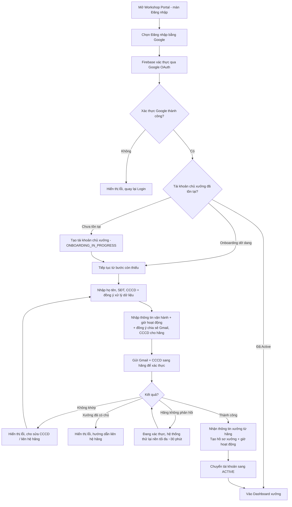
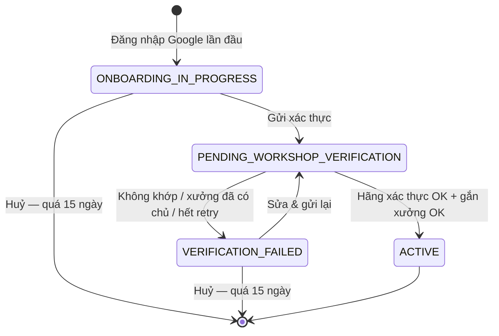

# Functional Specification — Đăng ký & Onboarding Chủ xưởng dịch vụ qua Google OAuth

> Tài liệu đặc tả chức năng/nghiệp vụ cho Feature "Đăng ký & Onboarding Chủ xưởng dịch vụ".
>
> **Quan hệ với FEAT-AUTH-001:** Luồng này **dựng song song** với luồng đăng ký & onboarding của chủ xe ([us-001](./us-001-sprint-1-spec.ff.md)): cùng cơ chế đăng nhập Google qua Firebase, cùng mô hình trạng thái onboarding, cùng nguyên tắc "hãng xe là nguồn sự thật" và cùng cách xác thực danh tính (**Gmail + CCCD**). Điểm khác: thứ được hãng xác nhận là **người quản lý một xưởng dịch vụ (ServiceCenter)** thay vì chủ một chiếc xe; kết quả là tài khoản chủ xưởng được liên kết với một bản ghi `workshop` (xem [core.entity.md](../../entity/core.entity.md) — bảng `workshop`).
>
> **Quy ước đánh dấu:** `[Cần điền]` = thông tin hành chính còn thiếu. Các câu hỏi nghiệp vụ đã được chốt ở v1.1 — xem mục 24.
>
> **Đánh số:** Tài liệu dùng dải `2xx` (`US-009`…, `BR-201`…, `AC-201`…, `SCR-201`…) để không trùng với FEAT-AUTH-001 (`US-001`–`US-004`) và FEAT-AUTH-002 (`US-005`–`US-008`, dải `1xx`).

---

# 1. Document Information

| Field | Value |
|---|---|
| Feature ID | `FEAT-AUTH-003` |
| Feature Name | `Đăng ký & Onboarding Chủ xưởng dịch vụ qua Google OAuth` |
| Document Version | `v1.1` |
| Status | `Review` |
| Sprint | `Sprint 1` |
| Product / Project | `EV Care — AI Agent Chăm sóc sau bán & lịch bảo dưỡng xe điện` |
| Business Owner | `[Cần điền]` |
| Author | `[Cần điền]` |
| Reviewer | `[Cần điền]` |
| Stakeholders | Product, Web/Frontend (Workshop Portal), Backend, Đối tác hãng xe |
| Created Date | `2026-09-27` |
| Updated Date | `2026-09-27` |
| Related PRD | `AI MVP PRD - TEAM 4 NGƯỜI` |
| Related Frontend Spec | [us-009-sprint-1-spec.fe.md](../frontend/us-009-sprint-1-spec.fe.md) |
| Related API Spec | [us-009-sprint-1-spec.api.md](../api/us-009-sprint-1-spec.api.md) |
| Related Entity Spec | [us-009-sprint-1-spec.entity.md](../entity/us-009-sprint-1-spec.entity.md) |
| Related Core Entity | [core.entity.md](../../entity/core.entity.md) |
| Related Design / Figma | `[Link]` |
| Related GitHub Issue | `[Link]` |

---

# 2. Feature Overview

## 2.1 Feature Description

Feature cho phép **chủ xưởng dịch vụ** (người quản lý một xưởng thuộc mạng lưới của hãng xe) đăng ký tài khoản trên **Workshop Portal** của EV Care bằng **Google OAuth** (qua Firebase Authentication). Sau lần đăng nhập đầu tiên, chủ xưởng được dẫn qua luồng **Onboarding** để:

1. Khai báo thông tin cá nhân: họ tên, số điện thoại, **CCCD**.
2. Khai báo thông tin vận hành của xưởng: địa chỉ, toạ độ, hotline, số kỹ thuật viên khả dụng mỗi ca, số slot dự phòng khẩn cấp, giờ hoạt động trong tuần.

Chủ xưởng **không chọn xưởng**. Hệ thống gửi **Gmail đăng nhập + CCCD** sang **hệ thống hãng xe**; hãng xác nhận đây là người quản lý đã đăng ký và trả về **đúng một xưởng** gắn với định danh đó. Xác thực thành công ⇒ hệ thống tạo hồ sơ **xưởng dịch vụ** (`workshop`) gắn với tài khoản (tên, khu vực, loại xưởng lấy từ hãng; thông tin vận hành lấy từ chủ xưởng), kích hoạt tài khoản (`ACTIVE`), và xưởng bắt đầu có thể nhận lịch hẹn của chủ xe.

## 2.2 Business Objective

- Đưa xưởng dịch vụ lên nền tảng nhanh (không cần tạo/nhớ mật khẩu), tạo **nguồn cung slot** cho luồng đặt lịch của chủ xe.
- Đảm bảo **chỉ người quản lý đã đăng ký với hãng** mới điều hành được xưởng trên hệ thống (chống mạo danh, chống chiếm xưởng).
- Thu thập ngay từ đầu dữ liệu vận hành tối thiểu phục vụ gợi ý xưởng gần nhất và kiểm tra slot khi đặt lịch.

## 2.3 User Objective

Chủ xưởng có tài khoản sử dụng ngay, xưởng của họ được hãng xác nhận chính chủ và hiển thị cho chủ xe để nhận lịch hẹn, với thông tin vận hành đúng thực tế.

## 2.4 Business Value

Tăng số xưởng tham gia; giảm rủi ro gian lận nhờ xác thực trực tiếp với hãng; dữ liệu công suất và giờ hoạt động chuẩn hoá giúp đặt lịch chính xác, giảm quá tải xưởng.

---

# 3. Scope

## 3.1 In Scope

- Đăng nhập/đăng ký Workshop Portal bằng Google OAuth qua Firebase Authentication.
- Phát hiện chủ xưởng mới / đã tồn tại / đang onboarding dở dang.
- Onboarding bước 1: thông tin cá nhân (họ tên, SĐT, CCCD) + đồng ý xử lý dữ liệu cá nhân.
- Onboarding bước 2: thông tin vận hành & giờ hoạt động của xưởng + đồng ý chia sẻ Gmail và CCCD cho hãng.
- Gửi Gmail + CCCD sang hãng để xác thực người quản lý và nhận thông tin xưởng tương ứng.
- Tạo hồ sơ xưởng (`workshop`) và giờ hoạt động sau khi xác thực thành công.
- Xử lý xác thực thất bại, hãng không phản hồi, xưởng đã có chủ, onboarding dang dở, onboarding quá hạn.

## 3.2 Out of Scope

- Đăng ký bằng email/password hoặc OAuth provider khác.
- Xưởng **độc lập, không thuộc mạng lưới hãng** — không được tham gia.
- Một chủ xưởng quản lý **nhiều xưởng**: mỗi tài khoản chỉ có **một** xưởng. Muốn quản lý xưởng khác, người quản lý phải khai báo với hãng bằng một định danh khác (Gmail khác) và đăng ký một tài khoản chủ xưởng khác.
- Duyệt thủ công bởi ADMIN — giai đoạn này **chưa có role ADMIN**; hãng xác thực là đủ.
- Mời/quản lý **nhân viên xưởng** (role `maintenance_staff`).
- Cập nhật thông tin xưởng, giờ hoạt động sau khi `ACTIVE` (feature "Quản lý xưởng" riêng).
- Giờ nghỉ trưa, nhiều ca/ngày, lịch nghỉ lễ — MVP chỉ **1 khung giờ/ngày**.
- Đồng bộ định kỳ thông tin xưởng từ hãng — chỉ đồng bộ **lúc onboarding**.
- Đăng xuất Workshop Portal (tái sử dụng cơ chế FEAT-AUTH-002 — đặc tả riêng khi triển khai).
- Chi tiết UI/validate từng field (Frontend Spec) và chi tiết endpoint/mã lỗi (API Spec).

---

# 4. Actors & Stakeholders

## 4.1 Actors

| Actor | Type | Responsibility |
|---|---|---|
| Chủ xưởng (Workshop Owner) | User | Đăng nhập, khai báo thông tin cá nhân (gồm CCCD) và thông tin vận hành xưởng |
| Firebase Authentication | System | Xác thực danh tính qua Google, cấp ID token |
| Google OAuth | System / Partner | Cung cấp cơ chế đăng nhập Google |
| Hệ thống hãng xe (OEM System — `mock-ev-system`) | System / Partner | Lưu email + CCCD người quản lý của từng xưởng; xác thực và trả thông tin xưởng tương ứng |
| Backend Application | System | Điều phối luồng, lưu dữ liệu, gọi hệ thống hãng xe |

## 4.2 Stakeholders

| Stakeholder | Organization / Team | Interest / Responsibility |
|---|---|---|
| Product Owner | Product Team | Định nghĩa yêu cầu nghiệp vụ, phê duyệt luồng |
| Web/Frontend Team | Engineering | Xây dựng Workshop Portal: đăng nhập & onboarding |
| Backend Team | Engineering | API đăng ký, tích hợp hãng xe, lưu `workshop` |
| Đối tác hãng xe | Partner | Cung cấp dữ liệu người quản lý xưởng, điều khoản chia sẻ dữ liệu, API xác thực |

---

# 5. User Story

## US-009

**As a** chủ xưởng dịch vụ chưa có tài khoản

**I want to** đăng ký/đăng nhập Workshop Portal nhanh bằng tài khoản Google của mình

**So that** tôi không cần tạo mật khẩu riêng và có thể bắt đầu đưa xưởng lên hệ thống ngay

### Additional User Stories

- `US-010`: As a chủ xưởng mới, I want to khai báo CCCD và được hệ thống xác thực với hãng bằng Gmail + CCCD của tôi, so that tài khoản của tôi được gắn đúng xưởng tôi đang quản lý mà không phải tự tìm chọn.
- `US-011`: As a chủ xưởng mới, I want to khai báo địa chỉ, số kỹ thuật viên, slot dự phòng và giờ hoạt động của xưởng, so that chủ xe tìm thấy xưởng và đặt lịch đúng khả năng phục vụ thực tế.
- `US-012`: As a chủ xưởng, I want to được thông báo rõ ràng khi xác thực thất bại hoặc xưởng đã có người khác quản lý, so that tôi biết cách xử lý.

---

# 6. Use Case

## UC-201 — Đăng ký tài khoản chủ xưởng & Onboarding xưởng dịch vụ

### 6.1 Use Case Description

Chủ xưởng đăng nhập Workshop Portal bằng Google, khai báo thông tin cá nhân (gồm CCCD) và thông tin vận hành; hệ thống xác thực Gmail + CCCD với hãng, nhận về xưởng tương ứng, tạo hồ sơ xưởng và kích hoạt tài khoản.

### 6.2 Primary Actor

Chủ xưởng (Workshop Owner)

### 6.3 Supporting Actors / Systems

- Firebase Authentication / Google OAuth
- Hệ thống hãng xe (OEM System)

### 6.4 Trigger

Người dùng chưa có tài khoản chủ xưởng chọn "Đăng nhập bằng Google" trên màn hình đăng nhập của Workshop Portal.

### 6.5 Preconditions

- Tài khoản Google hợp lệ, email đã được Google xác minh.
- Hãng đã ghi nhận **Gmail** và **CCCD** của người quản lý cho một xưởng trong mạng lưới (`ServiceCenter`). Một cặp (Gmail, CCCD) ứng với **đúng một** xưởng.

### 6.6 Postconditions

- **Thành công:** Tài khoản chủ xưởng `ACTIVE`; bản ghi `workshop` (theo core) được tạo/gắn với tài khoản, `workshop.status = active`; giờ hoạt động được lưu.
- **Thất bại:** Tài khoản ở `ONBOARDING_IN_PROGRESS`, `PENDING_WORKSHOP_VERIFICATION` hoặc `VERIFICATION_FAILED` tuỳ điểm dừng; không có `workshop` nào gắn với tài khoản.

---

# 7. User Flow

## 7.1 Main User Flow



## 7.2 Flow Description

| Step | Actor | Action / Event | System Response | Result |
|---|---|---|---|---|
| 1 | Chủ xưởng | Chọn "Đăng nhập bằng Google" | Firebase mở popup/redirect Google | Thấy màn hình đăng nhập Google |
| 2 | Chủ xưởng | Xác nhận tài khoản Google | Backend kiểm tra tài khoản chủ xưởng theo Firebase UID | Xác định mới / đã tồn tại / dang dở |
| 3 | System | Phát hiện chủ xưởng mới | Tạo tài khoản `ONBOARDING_IN_PROGRESS` | Vào SCR-202 |
| 4 | Chủ xưởng | Nhập họ tên, SĐT, CCCD, đồng ý điều khoản | Validate, lưu hồ sơ | Hoàn tất bước hồ sơ |
| 5 | Chủ xưởng | Nhập địa chỉ, hotline, số KTV, slot dự phòng, giờ hoạt động; đồng ý chia sẻ Gmail + CCCD cho hãng | Validate; gửi Gmail + CCCD sang hãng | Hiển thị "Đang xác thực" |
| 6 | System | Nhận phản hồi của hãng | Thành công: nhận xưởng tương ứng, kiểm tra xưởng chưa có chủ, tạo `workshop`; thất bại: lưu lý do | Chủ xưởng biết kết quả |
| 7 | System | Kích hoạt | Tài khoản `ACTIVE`, xưởng `active` | Vào Dashboard xưởng |

---

# 8. Screen / UI Flow

## 8.1 Screen Flow

```text
[SCR-201 Login - Workshop Portal]
    |
    v
[SCR-202 Onboarding: Thông tin chủ xưởng (gồm CCCD)]
    |
    v
[SCR-203 Onboarding: Thông tin vận hành xưởng]
    |
    v
[SCR-204 Đang xác thực]
    |
    +----> [SCR-205 Onboarding thành công (hiển thị xưởng hãng trả về) -> Dashboard xưởng]
    |
    +----> [SCR-206 Xác thực thất bại]
                |
                v
        (Quay lại SCR-202 sửa CCCD / SCR-203 / Liên hệ hãng)
```

## 8.2 Screen List

| Screen ID | Screen Name | Purpose | Entry From | Exit To |
|---|---|---|---|---|
| `SCR-201` | Login (Workshop Portal) | Đăng nhập bằng Google | Mở portal | SCR-202 / SCR-203 / SCR-204 / Dashboard |
| `SCR-202` | Onboarding — Thông tin chủ xưởng | Họ tên, SĐT, CCCD | SCR-201, SCR-206 | SCR-203 |
| `SCR-203` | Onboarding — Thông tin vận hành xưởng | Địa chỉ, hotline, công suất, giờ hoạt động | SCR-202, SCR-206 | SCR-204 |
| `SCR-204` | Đang xác thực | Chờ phản hồi của hãng | SCR-203 | SCR-205 / SCR-206 |
| `SCR-205` | Onboarding thành công | Hiển thị xưởng hãng xác nhận | SCR-204 | Dashboard xưởng |
| `SCR-206` | Xác thực thất bại | Thông báo lỗi, hướng dẫn xử lý | SCR-204 | SCR-202 / SCR-203 |

## 8.3 Screen / UI Reference

### SCR-202 — Onboarding: Thông tin chủ xưởng

**Main UI**
- Họ tên đầy đủ, số điện thoại liên hệ, **số CCCD** (bắt buộc).
- Email Google hiển thị sẵn, **không cho sửa** — kèm ghi chú "Dùng đúng Gmail đã đăng ký với hãng làm người quản lý xưởng".
- Checkbox đồng ý điều khoản xử lý dữ liệu cá nhân.
- Nút "Tiếp tục".

**Business Meaning:** Gmail + CCCD là định danh để hãng xác nhận người quản lý xưởng (BR-204).

**System Behavior:** Validate, lưu hồ sơ; không đổi trạng thái onboarding.

---

### SCR-203 — Onboarding: Thông tin vận hành xưởng

**Main UI**
- **Vị trí & liên hệ:** địa chỉ xưởng, vị trí trên bản đồ (tuỳ chọn), hotline xưởng.
- **Công suất:** số kỹ thuật viên khả dụng mỗi ca, số slot dự phòng khẩn cấp.
- **Giờ hoạt động:** 7 ngày trong tuần, mỗi ngày: đóng cửa hoặc **một** khung giờ mở – đóng.
- Checkbox đồng ý chia sẻ Gmail và CCCD cho hãng để xác thực.
- Nút "Gửi xác thực".

**Business Meaning:** Dữ liệu vận hành là đầu vào cho gợi ý xưởng gần nhất và kiểm tra slot khi đặt lịch. Tên/khu vực/loại xưởng **không** nhập ở đây — lấy từ hãng.

**System Behavior:** Validate, gửi xác thực sang hãng, chuyển SCR-204.

---

### SCR-204 — Đang xác thực

**Main UI:** Loading "Đang xác thực thông tin của bạn với hãng...". Nếu hãng chậm: "Hệ thống hãng phản hồi chậm, chúng tôi sẽ tiếp tục xác thực trong khoảng 30 phút. Bạn có thể quay lại sau."

**Business Meaning:** `PENDING_WORKSHOP_VERIFICATION`.

---

### SCR-205 — Onboarding thành công

**Main UI:** Tên xưởng, khu vực, loại xưởng do hãng trả về; tóm tắt thông tin vận hành; nút "Vào Dashboard".

---

### SCR-206 — Xác thực thất bại

**Main UI:** Lý do cụ thể (Gmail không phải người quản lý xưởng nào tại hãng / CCCD không khớp / xưởng đã có tài khoản quản lý khác / hãng không phản hồi), nút "Sửa thông tin", nút "Liên hệ hãng".

**Business Meaning:** `VERIFICATION_FAILED`.

**System Behavior:** Giữ dữ liệu đã nhập; đếm số lần thất bại (BR-207).

---

# 9. Main Flow

## 9.1 Happy Path

1. Chủ xưởng đăng nhập Workshop Portal bằng Google; hệ thống tạo tài khoản `ONBOARDING_IN_PROGRESS`.
2. Chủ xưởng nhập họ tên, SĐT, CCCD và đồng ý xử lý dữ liệu cá nhân.
3. Chủ xưởng nhập thông tin vận hành, giờ hoạt động và đồng ý chia sẻ Gmail + CCCD cho hãng.
4. Hãng xác nhận Gmail là email người quản lý đã đăng ký, CCCD khớp, và trả về xưởng tương ứng.
5. Hệ thống kiểm tra xưởng chưa có chủ, tạo hồ sơ xưởng (tên, khu vực, loại từ hãng; vận hành từ chủ xưởng), lưu giờ hoạt động, kích hoạt tài khoản `ACTIVE`, đưa chủ xưởng vào Dashboard.

---

# 10. Alternative Flow

## AF-201 — Chủ xưởng đã có tài khoản Active

Đăng nhập Google → vào thẳng Dashboard xưởng, không onboarding lại.

## AF-202 — Onboarding dang dở

Tài khoản `ONBOARDING_IN_PROGRESS` / `VERIFICATION_FAILED` → điều hướng đúng bước còn thiếu, dữ liệu đã nhập được điền sẵn.

## AF-203 — Đang chờ hãng xác thực

Tài khoản `PENDING_WORKSHOP_VERIFICATION` → vào SCR-204; portal cập nhật khi có kết quả; không gửi trùng yêu cầu.

## AF-204 — Gmail đã là tài khoản chủ xe

Người dùng đã có tài khoản chủ xe với cùng Gmail vẫn được tạo tài khoản chủ xưởng riêng (BR-209); hai tài khoản độc lập.

---

# 11. Exception Flow

## EF-201 — Đăng nhập Google thất bại/bị huỷ

Không tạo tài khoản; thông báo lỗi, quay về Login.

## EF-202 — Hãng xe không phản hồi / timeout

**System Behavior:** Giữ `PENDING_WORKSHOP_VERIFICATION`; thử lại nền **5 lần trong khoảng 30 phút**. Hết số lần thử mà vẫn không có phản hồi ⇒ `VERIFICATION_FAILED` với lý do "hãng không phản hồi" (không tính vào giới hạn thất bại — BR-207).

**User Experience:** SCR-204 với thông điệp phản hồi chậm; có thể rời đi và quay lại.

**Recovery:** Tự động; nếu vẫn thất bại, chủ xưởng gửi lại sau.

## EF-203 — Định danh không khớp với hãng

**Condition:** Gmail đăng nhập không phải email người quản lý của xưởng nào tại hãng, hoặc CCCD không khớp.

**System Behavior:** `VERIFICATION_FAILED`, lưu lý do; không tạo `workshop`.

**User Experience:** SCR-206: hướng dẫn kiểm tra CCCD, đăng nhập bằng đúng Gmail đã đăng ký với hãng, hoặc liên hệ hãng để cập nhật.

## EF-204 — Xưởng đã có tài khoản quản lý khác

**Condition:** Xưởng hãng trả về đã gắn với tài khoản chủ xưởng `ACTIVE` khác (ví dụ hãng đã đổi người quản lý nhưng tài khoản cũ vẫn còn hiệu lực).

**System Behavior:** Từ chối, không ghi đè.

**User Experience:** "Xưởng này đang được quản lý bởi một tài khoản khác", hướng dẫn liên hệ hãng/hỗ trợ.

**Recovery:** Xử lý thủ công ngoài hệ thống (thao tác DB có ghi log) — giai đoạn này chưa có role ADMIN.

## EF-205 — Tài khoản bị khoá

Từ chối đăng nhập; thông báo tài khoản bị khoá.

---

# 12. Business Rules

## BR-201 — Một tài khoản Google ↔ một tài khoản chủ xưởng

Mỗi Firebase UID/email Google chỉ tạo/liên kết đúng một tài khoản chủ xưởng; đăng nhập lại luôn vào tài khoản hiện có. **Priority:** High

## BR-202 — Một chủ xưởng ↔ một xưởng

- Mỗi tài khoản chủ xưởng quản lý **đúng một** xưởng.
- Mỗi xưởng của hãng tương ứng tối đa **một** bản ghi `workshop` và tối đa **một** chủ xưởng tại một thời điểm.
- Xưởng hãng trả về đã có chủ khác ⇒ từ chối (EF-204).

**Priority:** High

## BR-203 — Bắt buộc hoàn tất onboarding trước khi quản lý xưởng

Tài khoản chưa `ACTIVE` không được dùng các chức năng quản lý xưởng; điều hướng về bước còn thiếu. **Priority:** High

## BR-204 — Xác thực người quản lý xưởng bằng Gmail + CCCD

Tài khoản chỉ được gắn với xưởng khi hãng xác nhận: (1) Gmail đăng nhập là email người quản lý đã đăng ký của một xưởng, (2) CCCD khớp với người quản lý đó. Cặp (Gmail, CCCD) ứng với **đúng một** xưởng; hãng trả về xưởng đó — chủ xưởng không tự chọn. **Priority:** High

## BR-205 — Thông tin chuẩn của xưởng lấy từ hãng

Tên xưởng, khu vực, loại xưởng lấy từ hãng tại thời điểm onboarding (không đồng bộ định kỳ). Thông tin vận hành do chủ xưởng khai báo. **Priority:** High

## BR-206 — Thông tin vận hành tối thiểu

Để gửi xác thực phải có: địa chỉ, hotline, số KTV khả dụng mỗi ca (> 0), số slot dự phòng (≥ 0 và **không vượt số KTV**), giờ hoạt động đủ 7 ngày — mỗi ngày là "đóng cửa" hoặc **một** khung giờ mở < đóng — và ít nhất 1 ngày mở cửa. **Priority:** High

## BR-207 — Sửa và gửi lại khi thất bại, có giới hạn

Khi `VERIFICATION_FAILED`, chủ xưởng được sửa và gửi lại. Tối đa **5 lần thất bại trong 24 giờ**; không tính thất bại do hãng không phản hồi (áp dụng như D-07 của chủ xe). **Priority:** Medium

## BR-208 — Huỷ onboarding quá hạn

Tài khoản chưa `ACTIVE` sau **15 ngày** kể từ khi tạo bị huỷ (xoá dữ liệu onboarding); lần đăng nhập sau bắt đầu lại (áp dụng như D-04 của chủ xe). **Priority:** Medium

## BR-209 — Tài khoản chủ xưởng độc lập với tài khoản chủ xe

Đăng nhập Workshop Portal chỉ tạo/đọc tài khoản chủ xưởng; app chủ xe chỉ tạo/đọc tài khoản chủ xe. Một Gmail **được phép** có đồng thời cả hai tài khoản; dữ liệu hai tài khoản không dùng chung. **Priority:** Medium

## BR-210 — Đồng ý điều khoản

Bắt buộc đồng ý xử lý dữ liệu cá nhân (bước hồ sơ) và đồng ý chia sẻ Gmail + CCCD cho hãng (trước khi gửi xác thực) — NĐ 13/2023. Nội dung và phiên bản điều khoản do **công ty (hãng)** quản lý. **Priority:** High

## BR-211 — Xưởng mất chủ thì ngừng hoạt động

Khi một xưởng bị gỡ liên kết khỏi chủ xưởng (xử lý thủ công), xưởng chuyển `inactive` và không nhận lịch hẹn mới cho tới khi có chủ xưởng mới onboard thành công. **Priority:** Medium

---

# 13. State / Status

## 13.1 State List — Tài khoản chủ xưởng

| State | Meaning | Entry Condition | Exit Condition |
|---|---|---|---|
| `ONBOARDING_IN_PROGRESS` | Đã đăng nhập, chưa gửi xác thực | Đăng nhập lần đầu | Gửi xác thực |
| `PENDING_WORKSHOP_VERIFICATION` | Đang chờ hãng xác thực | Gửi xác thực | Có kết quả / hết retry nền |
| `VERIFICATION_FAILED` | Xác thực thất bại | Hãng từ chối / xưởng đã có chủ / hết retry | Sửa & gửi lại |
| `ACTIVE` | Hoàn tất onboarding, đang quản lý xưởng | Hãng xác thực thành công và gắn xưởng thành công | — |

> Bước hồ sơ (SCR-202) **không** đổi trạng thái; tiến độ suy ra từ việc đã hoàn tất hồ sơ hay chưa.

## 13.2 State Transition



## 13.3 Trạng thái xưởng

| State | Meaning |
|---|---|
| `active` | Có chủ xưởng, nhận lịch hẹn — set khi onboarding thành công |
| `inactive` | Không nhận lịch hẹn — khi xưởng bị gỡ chủ (BR-211) |

---

# 14. Data Requirements

## 14.1 Required Data

| Data | Type | Required | Description | Source |
|---|---|---:|---|---|
| `firebase_uid` | string | Yes | Định danh Firebase | Firebase |
| `email` | string | Yes | Gmail đăng nhập — định danh xác thực với hãng | Firebase/Google |
| `display_name`, `avatar_url` | string | No | Thông tin hiển thị Google | Firebase/Google |
| `full_name` | string | Yes | Họ tên chủ xưởng | User input |
| `phone_number` | string | Yes | SĐT liên hệ của chủ xưởng | User input |
| `national_id` | string | Yes | CCCD 12 số — định danh xác thực với hãng | User input |
| `center_id` | string | Yes | Mã xưởng của hãng | Hãng (trả về khi xác thực) |
| `workshop_name`, `region`, `type` | string | Yes | Tên, khu vực, loại xưởng | Hãng |
| `address` | string | Yes | Địa chỉ xưởng | User input |
| `latitude`, `longitude` | number | No | Toạ độ xưởng | User input (bản đồ) |
| `hotline` | string | Yes | SĐT xưởng | User input |
| `total_technicians` | integer | Yes | Số KTV khả dụng mỗi ca | User input |
| `emergency_slots_reserved` | integer | Yes | Slot dự phòng khẩn cấp | User input (mặc định 0) |
| `operating_hours` | list | Yes | 7 ngày, 1 khung/ngày | User input |
| `consents` | list | Yes | Xử lý dữ liệu / chia sẻ cho hãng | User input |
| `verification_status` | string | Yes | Kết quả xác thực | System |

## 14.2 Data Dependency

| Data / Entity | Why Needed | Read / Write | Owner |
|---|---|---|---|
| ServiceCenter + người quản lý (hãng) | Xác thực Gmail + CCCD; trả xưởng tương ứng | Read | Đối tác hãng xe |
| Firebase identity | Danh tính đăng nhập | Read | Google/Firebase |
| Tài khoản chủ xưởng (nội bộ) | Hồ sơ, trạng thái onboarding | Write | Backend |
| `workshop` (core) | Hồ sơ xưởng dùng chung cho đặt lịch, gợi ý xưởng | Write | Backend |

---

# 15. Business Error & Edge Cases

| Case ID | Scenario | Expected Business Behavior | User Outcome |
|---|---|---|---|
| `EDGE-201` | Thoát giữa chừng khi onboarding | Giữ trạng thái & dữ liệu | Tiếp tục đúng bước |
| `EDGE-202` | Xưởng hãng trả về đã có chủ `ACTIVE` khác | Từ chối, không ghi đè | Thông báo, hướng dẫn liên hệ hãng |
| `EDGE-203` | Hãng timeout | Giữ `PENDING`, thử lại 5 lần trong ~30 phút | Thấy "Đang xác thực" |
| `EDGE-204` | CCCD sai định dạng | Chặn trước khi gửi hãng | Biết lỗi ngay |
| `EDGE-205` | Giờ hoạt động không hợp lệ (đóng ≤ mở, thiếu ngày, cả tuần đóng cửa) | Chặn trước khi gửi hãng | Biết lỗi ngay |
| `EDGE-206` | Slot dự phòng lớn hơn số KTV | Chặn trước khi gửi hãng | Biết lỗi ngay |
| `EDGE-207` | Người quản lý muốn đăng ký xưởng thứ hai | Không hỗ trợ trên cùng tài khoản; phải có Gmail khác được khai báo với hãng cho xưởng đó | Hướng dẫn liên hệ hãng |
| `EDGE-208` | CCCD đã dùng bởi tài khoản chủ xưởng khác | Từ chối lưu hồ sơ | Thông báo, hướng dẫn liên hệ hãng |
| `EDGE-209` | Tài khoản bị khoá | Từ chối đăng nhập | Thông báo tài khoản bị khoá |

---

# 16. Permissions & Access

## 16.1 Access Matrix

| Role / Actor | View | Create | Update | Delete | Notes |
|---|---:|---:|---:|---:|---|
| `WORKSHOP_OWNER` | ✅ (hồ sơ & xưởng của mình) | ✅ (khi onboarding) | ✅ (khi chưa `ACTIVE`) | ❌ | Không xem được dữ liệu của chủ xưởng khác |
| `VEHICLE_USER` | ✅ (thông tin công khai của xưởng `active`: tên, địa chỉ, hotline, giờ hoạt động) | ❌ | ❌ | ❌ | Dùng khi chọn xưởng đặt lịch |

> Giai đoạn này **chưa có role ADMIN / Customer Support**. Các thao tác ngoại lệ (mở khoá tài khoản, gỡ chủ xưởng) thực hiện trực tiếp trên DB và phải ghi log thủ công — giống ENT-SPEC-AUTH-001 §12.

## 16.2 Business Authorization Rules

- Chủ xưởng chỉ thao tác trên tài khoản và xưởng của chính mình.
- Gắn chủ xưởng với xưởng **chỉ** qua xác thực thành công của hãng.
- Gmail và CCCD chỉ được gửi cho hãng khi có đồng ý (BR-210).

---

# 17. Acceptance Criteria

## AC-201 — Tạo tài khoản chủ xưởng sau đăng nhập Google

**Given** người dùng chưa có tài khoản chủ xưởng
**When** đăng nhập Workshop Portal bằng Google thành công
**Then** hệ thống tạo tài khoản `ONBOARDING_IN_PROGRESS` và điều hướng sang SCR-202

## AC-202 — Lưu thông tin chủ xưởng

**Given** tài khoản đang onboarding
**When** chủ xưởng nhập đủ họ tên, SĐT, CCCD hợp lệ và đồng ý xử lý dữ liệu
**Then** hệ thống lưu hồ sơ, điều hướng sang SCR-203; trạng thái vẫn `ONBOARDING_IN_PROGRESS`

## AC-203 — Gửi xác thực

**Given** chủ xưởng đã hoàn tất hồ sơ
**When** nhập đầy đủ, hợp lệ thông tin vận hành, giờ hoạt động và đồng ý chia sẻ dữ liệu
**Then** hệ thống gửi Gmail + CCCD sang hãng và chuyển `PENDING_WORKSHOP_VERIFICATION`

## AC-204 — Kích hoạt khi xác thực thành công

**Given** hãng xác nhận người quản lý và trả về xưởng chưa có chủ
**When** hệ thống nhận kết quả
**Then** hồ sơ `workshop` được tạo/gắn với tên, khu vực, loại từ hãng và thông tin vận hành từ chủ xưởng, `workshop.status = active`; giờ hoạt động được lưu; tài khoản `ACTIVE`; SCR-205 hiển thị tên xưởng

## AC-205 — Thông báo khi thất bại

**Given** hãng trả không khớp
**When** hệ thống nhận kết quả
**Then** tài khoản `VERIFICATION_FAILED`, chủ xưởng thấy lý do cụ thể và có thể sửa rồi gửi lại

## AC-206 — Chặn xưởng đã có chủ

**Given** xưởng hãng trả về đã gắn với chủ xưởng `ACTIVE` khác
**When** hệ thống xử lý kết quả xác thực
**Then** hệ thống không gắn xưởng, tài khoản `VERIFICATION_FAILED` với lý do "xưởng đã có chủ"

## AC-207 — Bỏ qua onboarding khi đã Active

**Given** tài khoản chủ xưởng `ACTIVE`
**When** đăng nhập lại
**Then** vào thẳng Dashboard xưởng

## AC-208 — Giới hạn số lần thất bại

**Given** chủ xưởng đã thất bại 5 lần trong 24 giờ (không tính hãng không phản hồi)
**When** gửi xác thực lần tiếp theo
**Then** hệ thống từ chối và cho biết thời điểm có thể thử lại

## AC-209 — Hãng không phản hồi

**Given** hãng không phản hồi
**When** hệ thống đã thử lại 5 lần trong khoảng 30 phút mà vẫn không có kết quả
**Then** tài khoản chuyển `VERIFICATION_FAILED` với lý do "hãng không phản hồi" và lượt này không bị tính vào giới hạn thất bại

---

# 18. Non-functional Expectations

| Requirement | Expected Behavior |
|---|---|
| Availability | Tương đương SLA Firebase; phụ thuộc SLA hãng |
| Response Experience | Loading rõ ràng khi chờ hãng; quá ngưỡng chuyển xử lý nền (tối đa ~30 phút) |
| Duplicate Handling | Không trùng tài khoản cho một Gmail; một chủ một xưởng; không có 2 bản ghi `workshop` cho một xưởng hãng |
| Security | Không hiển thị/log đầy đủ CCCD, email, SĐT |

---

# 19. Dependencies

| Dependency | Purpose | Owner | Required | Related Document |
|---|---|---|---:|---|
| Firebase Authentication (Google) | Xác thực danh tính | Google/Firebase | Yes | [us-001 FF](./us-001-sprint-1-spec.ff.md) |
| Hệ thống hãng xe (`mock-ev-system`) — xác thực người quản lý xưởng | Xác thực Gmail + CCCD, trả xưởng | Đối tác hãng / Backend (mock) | Yes | [proposed_erd.latest.md §3.8](../../mock-system/proposed_erd.latest.md) |
| Dịch vụ bản đồ | Chọn toạ độ xưởng | `[Cần xác nhận]` | No | |
| Bảng `workshop` (core) | Hồ sơ xưởng dùng chung | Backend | Yes | [core.entity.md](../../entity/core.entity.md) |

---

# 20. Assumptions

- Chỉ xưởng thuộc mạng lưới hãng (có trong `ServiceCenter`) mới đăng ký được.
- Hãng lưu **email + CCCD người quản lý** cho mỗi xưởng; một email người quản lý chỉ gắn một xưởng. Mock hiện chưa có — sẽ bổ sung (API Spec C.7.2).
- Workshop Portal là web app riêng, tách khỏi app chủ xe, dùng chung Firebase project.

---

# 21. Business Constraints

- Tuân thủ NĐ 13/2023/NĐ-CP về bảo vệ dữ liệu cá nhân (CCCD là dữ liệu định danh).
- Chỉ chia sẻ Gmail, CCCD cho hãng khi có đồng ý; nội dung điều khoản do công ty quản lý.
- Tích hợp hãng theo thoả thuận API (SLA, rate limit, bảo mật).

---

# 22. Terminology / Glossary

| Term ID | Term | Vietnamese Name | Definition | Example / Notes |
|---|---|---|---|---|
| `TERM-201` | Workshop Owner | Chủ xưởng | Người quản lý một xưởng dịch vụ chính hãng, sở hữu tài khoản Workshop Portal | Role `workshop_owner` |
| `TERM-202` | Workshop | Xưởng dịch vụ | Bản ghi `workshop` trong app, tương ứng một `ServiceCenter` của hãng | `VinFast Thăng Long` |
| `TERM-203` | ServiceCenter | Xưởng của hãng | Đại lý/xưởng trong hệ thống hãng, định danh bằng `center_id` | `SC-01` |
| `TERM-204` | Manager Identity | Định danh người quản lý | Cặp (Gmail, CCCD) hãng lưu cho người quản lý một xưởng | Ứng với đúng một xưởng |
| `TERM-205` | Workshop Verification | Xác thực chủ xưởng | Hãng xác nhận định danh người quản lý và trả xưởng tương ứng | `PENDING` / `VERIFIED` / `FAILED` |
| `TERM-206` | Operating Hours | Giờ hoạt động | 1 khung giờ mở/đóng cho mỗi ngày trong tuần | Thứ 2: 08:00–17:30 |
| `TERM-207` | Workshop Portal | Cổng quản lý xưởng | Ứng dụng web dành cho chủ xưởng | |

### Important Terminology Rules

- "Onboarding" chỉ quá trình thiết lập ban đầu, không dùng cho cập nhật thông tin xưởng sau này.
- "Xác thực chủ xưởng" ≠ "đăng ký": đăng ký tạo tài khoản; xác thực gắn tài khoản với xưởng.
- "Xưởng" trong tài liệu luôn là xưởng chính hãng (có `center_id`).

---

# 23. Partner / Stakeholder Notes

## 23.1 Confirmed

- Xác thực dựa hoàn toàn vào dữ liệu hãng (`mock-ev-system`): Gmail + CCCD người quản lý.
- (Gmail, CCCD) ↔ đúng một xưởng; chủ xưởng không tự chọn xưởng.
- Nội dung, phiên bản điều khoản do công ty quản lý.

## 23.2 Pending Confirmation

- Hãng có thông báo khi đổi người quản lý / xưởng ngừng hợp tác không (để gỡ chủ và chuyển `inactive`)?

---

# 24. Open Questions

| ID | Question | Owner | Status | Decision |
|---|---|---|---|---|
| `Q-201` | Rule xác thực chủ xưởng | Product | **Closed** | Gmail + CCCD người quản lý lưu ở hãng (`mock-ev-system`); (Gmail, CCCD) ứng với đúng một xưởng |
| `Q-202` | Một Gmail vừa chủ xe vừa chủ xưởng? | Product | **Closed** | Được — hai tài khoản độc lập (BR-209) |
| `Q-203` | Chủ xưởng quản lý nhiều xưởng? | Product | **Closed** | Không — một chủ một xưởng; xưởng khác cần Gmail khác khai báo với hãng |
| `Q-204` | Xưởng độc lập có được tham gia? | Product | **Closed** | Không |
| `Q-205` | Bước ADMIN duyệt thủ công? | Product | **Closed** | Không — chưa có role ADMIN, giữ tối giản |
| `Q-206` | Thu CCCD và MST? | Product | **Closed** | Thu CCCD; không thu mã số doanh nghiệp |
| `Q-207` | Giờ hoạt động | Product | **Closed** | 1 khung/ngày |
| `Q-208` | Hãng timeout | Product / Backend | **Closed** | Retry nền 5 lần trong ~30 phút, sau đó trả lỗi |
| `Q-209` | Sprint | PO | **Closed** | Sprint 1 |

---

# 25. Traceability

| Item | Reference |
|---|---|
| User Story | `US-009`, `US-010`, `US-011`, `US-012` |
| Use Case | `UC-201` |
| Business Rules | `BR-201` – `BR-211` |
| Acceptance Criteria | `AC-201` – `AC-209` |
| Entity Specification | [us-009 entity](../entity/us-009-sprint-1-spec.entity.md) |
| API Specification | [us-009 API](../api/us-009-sprint-1-spec.api.md) |
| Core Entity | [core.entity.md — `workshop`](../../entity/core.entity.md) |

---

# 26. Related Documents

- [Functional Spec — Đăng ký & Onboarding chủ xe (FEAT-AUTH-001)](./us-001-sprint-1-spec.ff.md)
- [Functional Spec — Đăng nhập & Đăng xuất chủ xe (FEAT-AUTH-002)](./us-005-sprint-1-spec.ff.md)
- [Core Entity](../../entity/core.entity.md)
- [ERD hệ thống hãng (mock)](../../mock-system/proposed_erd.latest.md)

---

# 27. Change Log

| Version | Date | Author | Change |
|---|---|---|---|
| `v1.0` | `2026-09-27` | `[Cần điền]` | Bản nháp đầu tiên, dựng song song FEAT-AUTH-001 cho đối tượng chủ xưởng |
| `v1.1` | `2026-09-27` | `[Cần điền]` | Chốt Q-201 → Q-209: xác thực bằng Gmail + CCCD (bỏ MST), hãng trả xưởng — bỏ bước chọn xưởng; một chủ một xưởng; bỏ role ADMIN/CS; retry hãng 5 lần/~30 phút; giờ hoạt động 1 khung/ngày; thêm BR-211 (xưởng mất chủ ⇒ `inactive`), AC-209 |

---

# 28. Approval

| Role | Name | Status | Date |
|---|---|---|---|
| Product Owner | `[Name]` | Pending | |
| Business Stakeholder | `[Name]` | Pending | |
| Technical Owner | `[Name]` | Pending | |
