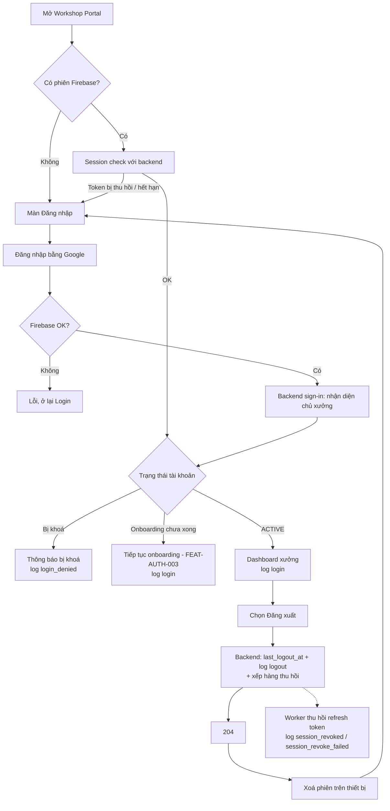

# Functional Specification — Đăng nhập & Đăng xuất (Chủ xưởng) kèm ghi log

> Tài liệu đặc tả chức năng/nghiệp vụ cho Feature "Đăng nhập & Đăng xuất" dành cho **chủ xưởng** trên Workshop Portal.
>
> **Quan hệ với các feature khác:**
> - **FEAT-AUTH-003** ([us-009](./us-009-sprint-1-spec.ff.md)) đã định nghĩa **lần đăng nhập đầu tiên** (tạo tài khoản chủ xưởng + onboarding). Tài liệu này tập trung vào **phiên đăng nhập của chủ xưởng đã có tài khoản**, **đăng xuất** và **ghi log (audit) đăng nhập/đăng xuất**. Phần trùng (xác thực Google qua Firebase, điều hướng theo trạng thái onboarding) được **tham chiếu**, không định nghĩa lại.
> - **FEAT-AUTH-002** ([us-005](./us-005-sprint-1-spec.ff.md)) là feature tương đương của chủ xe. Tài liệu này dựng **song song** và giữ cùng quyết định (logout thu hồi nền, `204`, audit 60 ngày, chỉ endpoint session check kiểm tra revoke tức thời), nhưng dữ liệu và endpoint **tách riêng** cho chủ xưởng.
>
> **Đánh số:** dải `3xx` (`US-013`…, `BR-301`…, `AC-301`…, `SCR-301`…).

---

# 1. Document Information

| Field | Value |
|---|---|
| Feature ID | `FEAT-AUTH-004` |
| Feature Name | `Đăng nhập & Đăng xuất (Chủ xưởng) kèm ghi log` |
| Document Version | `v1.0` |
| Status | `Review` |
| Sprint | `Sprint 1` |
| Product / Project | `EV Care` |
| Business Owner | `[Cần điền]` |
| Author | `[Cần điền]` |
| Reviewer | `[Cần điền]` |
| Stakeholders | Product, Web/Frontend (Workshop Portal), Backend, Security |
| Created Date | `2026-09-27` |
| Updated Date | `2026-09-27` |
| Related Frontend Spec | [us-013-sprint-1-spec.fe.md](../frontend/us-013-sprint-1-spec.fe.md) |
| Related API Spec | [us-013-sprint-1-spec.api.md](../api/us-013-sprint-1-spec.api.md) |
| Related Entity Spec | [us-013-sprint-1-spec.entity.md](../entity/us-013-sprint-1-spec.entity.md) |
| Related Feature | [FEAT-AUTH-003](./us-009-sprint-1-spec.ff.md), [FEAT-AUTH-002](./us-005-sprint-1-spec.ff.md) |

---

# 2. Feature Overview

## 2.1 Feature Description

Feature cho phép **chủ xưởng đã có tài khoản** đăng nhập lại Workshop Portal bằng **Google OAuth** (qua Firebase), duy trì phiên giữa các lần mở portal, và **đăng xuất** an toàn. Mọi lần đăng nhập, đăng nhập bị từ chối, đăng xuất và kết quả thu hồi phiên đều được **ghi log audit** riêng cho chủ xưởng. Sau đăng nhập, chủ xưởng `ACTIVE` vào thẳng Dashboard xưởng; chủ xưởng chưa xong onboarding được đưa về đúng bước còn thiếu (FEAT-AUTH-003).

## 2.2 Business Objective

- Chủ xưởng quay lại portal nhanh, an toàn, không cần mật khẩu riêng.
- Chủ xưởng chủ động kết thúc phiên để bảo vệ dữ liệu xưởng, lịch hẹn và thông tin khách hàng trên máy dùng chung tại quầy.
- Có **lịch sử đăng nhập/đăng xuất** của từng chủ xưởng để điều tra khi có sự cố (ai truy cập xưởng, lúc nào, từ đâu).

## 2.3 User Objective

Mở portal là vào được Dashboard xưởng; đăng xuất khi rời máy mà không lo người khác dùng tiếp phiên.

## 2.4 Business Value

Tăng tin cậy của xưởng với nền tảng; giảm rủi ro lộ dữ liệu khách hàng tại xưởng; có bằng chứng audit phục vụ xử lý sự cố.

---

# 3. Scope

## 3.1 In Scope

- Đăng nhập lại bằng Google cho chủ xưởng đã có tài khoản (tái sử dụng API sign-in của FEAT-AUTH-003).
- Tự khôi phục phiên khi mở lại portal nếu phiên còn hiệu lực.
- Kiểm tra phiên (session check) có phát hiện phiên đã bị thu hồi.
- Điều hướng sau đăng nhập theo trạng thái tài khoản chủ xưởng.
- Chặn đăng nhập với tài khoản chủ xưởng bị khoá.
- Đăng xuất: kết thúc phiên trên thiết bị, ghi `last_logout_at`, ghi audit, xếp hàng thu hồi refresh token nền.
- **Ghi log audit**: đăng nhập thành công, đăng nhập bị từ chối, đăng xuất, thu hồi phiên thành công/thất bại. Lưu 60 ngày.

## 3.2 Out of Scope

- Đăng ký & onboarding chủ xưởng (FEAT-AUTH-003).
- Đăng nhập bằng email/mật khẩu hoặc provider khác.
- Quản lý danh sách thiết bị / đăng xuất từng thiết bị.
- Giao diện xem lịch sử đăng nhập cho chủ xưởng hoặc quản trị (giai đoạn này chưa có role ADMIN — log chỉ tra cứu trực tiếp trên DB).
- Đăng nhập/đăng xuất của nhân viên xưởng.

---

# 4. Actors & Stakeholders

## 4.1 Actors

| Actor | Type | Responsibility |
|---|---|---|
| Chủ xưởng (Workshop Owner) | User | Đăng nhập, dùng portal, đăng xuất |
| Firebase Authentication | System | Xác thực Google, cấp/làm mới ID token, thu hồi refresh token |
| Backend Application | System | Xác minh token, nhận diện tài khoản chủ xưởng, điều hướng, ghi log, xếp hàng thu hồi |
| Background Worker | System | Gọi Firebase thu hồi refresh token, ghi kết quả vào log |

## 4.2 Stakeholders

| Stakeholder | Organization / Team | Interest / Responsibility |
|---|---|---|
| Product Owner | Product | Hành vi phiên của portal |
| Web/Frontend Team | Engineering | Firebase SDK, lưu/khôi phục phiên, xử lý hết hạn |
| Backend Team | Engineering | Sign-in audit, logout, session check, worker |
| Security | Business/Engineering | Chính sách phiên, audit, bảo vệ dữ liệu |

---

# 5. User Story

## US-013

**As a** chủ xưởng đã có tài khoản
**I want to** đăng nhập lại Workshop Portal bằng tài khoản Google
**So that** tôi vào Dashboard xưởng và tiếp tục quản lý lịch hẹn ngay

### Additional User Stories

- `US-014`: As a chủ xưởng, I want to đăng xuất khỏi portal, so that người khác dùng máy tại xưởng không truy cập được dữ liệu xưởng.
- `US-015`: As a chủ xưởng mở lại portal, I want to được tự động vào lại phiên nếu còn hiệu lực, and được đưa về màn đăng nhập khi phiên đã hết hạn hoặc bị thu hồi.
- `US-016`: As a người phụ trách bảo mật, I want to có log đăng nhập/đăng xuất của từng chủ xưởng, so that tôi điều tra được khi có truy cập bất thường.

---

# 6. Use Case

## UC-301 — Đăng nhập lại Workshop Portal

**Primary Actor:** Chủ xưởng · **Supporting:** Firebase, Backend

**Trigger:** Chọn "Đăng nhập bằng Google" hoặc mở portal khi phiên hết hạn.

**Preconditions:** Tài khoản chủ xưởng đã tồn tại; có mạng.

**Postconditions:**
- **Thành công:** Có phiên hợp lệ; `last_login_at` cập nhật; log `login / success`; điều hướng theo trạng thái (`ACTIVE` → Dashboard).
- **Bị khoá:** Không cấp phiên sử dụng; log `login_denied / denied` kèm lý do.

## UC-302 — Đăng xuất

**Primary Actor:** Chủ xưởng · **Supporting:** Firebase, Backend, Worker

**Trigger:** Chọn "Đăng xuất" trên portal.

**Preconditions:** Đang có phiên hợp lệ.

**Postconditions:**
- Phiên trên thiết bị bị xoá.
- `last_logout_at` + log `logout / success` được ghi; tác vụ thu hồi refresh token được xếp hàng.
- Worker thu hồi xong ⇒ log `session_revoked / success`; lỗi ⇒ log `session_revoke_failed / failed` và thử lại.

---

# 7. User Flow

## 7.1 Main User Flow



## 7.2 Flow Description

| Step | Actor | Action | System Response | Result |
|---|---|---|---|---|
| 1 | Chủ xưởng | Mở portal | Có phiên → session check; không → Login | |
| 2 | Chủ xưởng | Đăng nhập Google | Firebase trả token; backend nhận diện chủ xưởng | Ghi log `login` hoặc `login_denied` |
| 3 | System | Điều hướng | `ACTIVE` → Dashboard; dở → onboarding; khoá → lỗi | |
| 4 | Chủ xưởng | Đăng xuất | Ghi `last_logout_at` + log `logout`, xếp hàng thu hồi, trả `204` | Portal xoá phiên, về Login |
| 5 | Worker | Thu hồi refresh token | Ghi log kết quả | Phiên không làm mới được nữa |

---

# 8. Screen / UI Flow

## 8.1 Screen Flow

```text
[SCR-301 Login - Workshop Portal]
    |
    v
[SCR-302 Đang đăng nhập / Splash]
    |
    +----> [Dashboard xưởng]          (ACTIVE)
    +----> [Onboarding FEAT-AUTH-003]  (chưa xong)
    +----> [SCR-303 Lỗi / Bị khoá]

[Dashboard xưởng] --> [SCR-304 Xác nhận đăng xuất] --> [SCR-301]
```

## 8.2 Screen List

| Screen ID | Screen Name | Purpose | Entry From | Exit To |
|---|---|---|---|---|
| `SCR-301` | Login | Đăng nhập Google (dùng chung với SCR-201) | Mở portal / sau đăng xuất / phiên hết hạn | SCR-302 |
| `SCR-302` | Đang đăng nhập (Splash) | Session check / sign-in | SCR-301, mở portal | Dashboard / Onboarding / SCR-303 |
| `SCR-303` | Lỗi đăng nhập / Bị khoá | Thông báo lỗi | SCR-302 | SCR-301 |
| `SCR-304` | Xác nhận đăng xuất | Tránh đăng xuất nhầm | Dashboard | Dashboard / SCR-301 |

**SCR-304 — System Behavior:** khi xác nhận, gọi backend đăng xuất, sau đó **luôn** xoá phiên cục bộ và về SCR-301 (kể cả khi backend lỗi — EF-303). Nếu Gmail này cũng dùng app chủ xe, hiển thị lưu ý "Bạn cũng có thể phải đăng nhập lại ứng dụng chủ xe" (BR-306).

---

# 9. Main Flow

## 9.1 Happy Path

1. Chủ xưởng `ACTIVE` mở portal, đăng nhập Google.
2. Backend nhận diện tài khoản chủ xưởng, cập nhật `last_login_at`, ghi log `login / success`, trả `nextStep = DASHBOARD`.
3. Chủ xưởng làm việc; khi rời máy chọn "Đăng xuất".
4. Backend ghi `last_logout_at`, log `logout / success`, xếp hàng thu hồi; trả `204`.
5. Portal xoá phiên, về Login. Worker thu hồi refresh token, ghi log `session_revoked / success`.

---

# 10. Alternative Flow

## AF-301 — Tự khôi phục phiên

Mở lại portal khi phiên còn hiệu lực → portal lấy token (tự làm mới nếu cần) → gọi session check → hợp lệ thì gọi sign-in để lấy `nextStep` → vào đúng màn. Không thao tác đăng nhập.

## AF-302 — Onboarding chưa xong

Đăng nhập thành công nhưng `onboarding_status ≠ active` → điều hướng bước onboarding còn thiếu (FEAT-AUTH-003). Vẫn ghi log `login / success`.

## AF-303 — Gmail chưa có tài khoản chủ xưởng

Đăng nhập Google hợp lệ nhưng chưa có tài khoản chủ xưởng → luồng đăng ký FEAT-AUTH-003 (tạo tài khoản mới). Ghi log `login / success` cho tài khoản vừa tạo.

---

# 11. Exception Flow

## EF-301 — Đăng nhập Google thất bại / bị huỷ

Không tạo phiên, không gọi backend, không ghi log (chưa có danh tính đã xác minh).

## EF-302 — Tài khoản chủ xưởng bị khoá

`status ∈ {inactive, suspended}` → từ chối; ghi log `login_denied / denied` với lý do `account_suspended` / `account_inactive`; hiển thị thông báo bị khoá.

## EF-303 — Backend lỗi khi đăng xuất

Portal **vẫn xoá phiên cục bộ**. Nếu backend không nhận được yêu cầu, không đảm bảo refresh token đã bị thu hồi; hướng dẫn thử lại khi có mạng.

## EF-304 — Phiên bị thu hồi / hết hạn khi đang dùng

Session check hoặc request trả `401` → portal về Login với thông báo "Phiên đã hết hạn, vui lòng đăng nhập lại".

---

# 12. Business Rules

## BR-301 — Chỉ đăng nhập bằng Google

Chỉ chấp nhận danh tính Google qua Firebase (như BR-101). **Priority:** High

## BR-302 — Đăng nhập ánh xạ đúng tài khoản chủ xưởng

Nhận diện theo Firebase UID trong bảng tài khoản chủ xưởng; không đụng tới tài khoản chủ xe (FEAT-AUTH-003 BR-209). **Priority:** High

## BR-303 — Tài khoản bị khoá không được đăng nhập, và phải được ghi log

Từ chối đăng nhập và ghi log `login_denied`. **Priority:** High

## BR-304 — Đăng xuất thu hồi nền, trả `204`

Backend ghi nhận + xếp hàng thu hồi rồi trả `204`, không chờ Firebase (như BR-105). Tài khoản bị khoá **vẫn được** đăng xuất. **Priority:** High

## BR-305 — Ghi log audit bắt buộc

Mỗi sự kiện sau tạo **một** bản ghi log, append-only:

| Sự kiện | `event_type` | `result` |
|---|---|---|
| Đăng nhập thành công (kể cả lần đầu) | `login` | `success` |
| Đăng nhập bị từ chối vì tài khoản bị khoá | `login_denied` | `denied` |
| Đăng xuất | `logout` | `success` |
| Worker thu hồi phiên thành công | `session_revoked` | `success` |
| Worker thu hồi phiên thất bại (mỗi lần thử) | `session_revoke_failed` | `failed` |

Log gồm: thời điểm, IP, user agent, trace id, provider, lý do (nếu có). **Không** chứa token, email, CCCD. Lưu **60 ngày**. **Priority:** High

## BR-306 — Thu hồi theo UID ảnh hưởng mọi ứng dụng dùng cùng Gmail

Chủ xe và chủ xưởng dùng chung Firebase project; một Gmail có cả hai tài khoản (FEAT-AUTH-003 BR-209) có **cùng UID**. Thu hồi refresh token khi đăng xuất portal cũng khiến app chủ xe phải đăng nhập lại khi token hiện tại hết hạn (và ngược lại). Chấp nhận ở MVP vì ưu tiên an toàn; portal hiển thị lưu ý ở SCR-304. **Priority:** Medium

## BR-307 — Session check phát hiện phiên bị thu hồi

Endpoint session check của portal kiểm tra revoke tức thời; các endpoint khác chỉ kiểm tra chữ ký/hạn token (như BR-106). **Priority:** High

## BR-308 — Đăng xuất luôn thành công trên thiết bị

Portal xoá phiên cục bộ kể cả khi backend lỗi (như BR-107). **Priority:** Medium

---

# 13. State / Status

Trạng thái **phiên trên thiết bị** giống FEAT-AUTH-002 §13 (`UNAUTHENTICATED → AUTHENTICATING → AUTHENTICATED → EXPIRED / REVOKED`). Feature này không thay đổi trạng thái tài khoản chủ xưởng.

---

# 14. Data Requirements

## 14.1 Required Data

| Data | Type | Required | Description | Source |
|---|---|---:|---|---|
| `firebase_uid` | string | Yes | Nhận diện tài khoản chủ xưởng | Firebase |
| `id_token` | string | Yes | Token gửi kèm request (không lưu) | Firebase (client) |
| `account_status`, `onboarding_status` | string | Yes | Chặn khoá / điều hướng | Backend |
| `last_login_at`, `last_logout_at` | datetime | No | Mốc đăng nhập/đăng xuất gần nhất | Backend |
| Log audit chủ xưởng | record | Yes | Sự kiện đăng nhập/đăng xuất/thu hồi; lưu 60 ngày | Backend |

## 14.2 Data Dependency

| Data / Entity | Why Needed | Read / Write | Owner |
|---|---|---|---|
| `WorkshopOwner` (ENT-007) | Nhận diện, kiểm tra trạng thái, ghi mốc | Read / Write | Backend |
| Log audit chủ xưởng (ENT-301) | Ghi sự kiện | Write | Backend |
| Firebase identity | Xác thực, thu hồi | Read | Firebase |

---

# 15. Business Error & Edge Cases

| Case ID | Scenario | Expected Behavior | User Outcome |
|---|---|---|---|
| `EDGE-301` | Huỷ chọn tài khoản Google | Không tạo phiên, không log | Ở lại Login |
| `EDGE-302` | Đăng xuất khi offline | Xoá phiên cục bộ; không đảm bảo đã thu hồi | Về Login, được nhắc thử lại khi online |
| `EDGE-303` | Tài khoản bị khoá gọi đăng xuất | Vẫn cho đăng xuất, ghi log `logout` | Về Login |
| `EDGE-304` | Gọi đăng xuất khi chưa có tài khoản chủ xưởng (vd sign-in bị từ chối vì email đã liên kết) | Vẫn xếp hàng thu hồi theo UID; không ghi log (không có tài khoản để gắn) | Về Login |
| `EDGE-305` | Worker thu hồi lỗi tạm thời | Ghi `session_revoke_failed`, thử lại | Không ảnh hưởng người dùng |
| `EDGE-306` | Cùng Gmail đang dùng app chủ xe | Sau khi thu hồi, app chủ xe phải đăng nhập lại khi token hết hạn | Theo BR-306 |

---

# 16. Permissions & Access

| Role / Actor | View | Create | Update | Delete | Notes |
|---|---:|---:|---:|---:|---|
| `WORKSHOP_OWNER` | ✅ (phiên của mình) | ✅ (đăng nhập) | ✅ (đăng xuất phiên của mình) | ❌ | Không xem được log audit qua API ở giai đoạn này |
| Hệ thống | ✅ | ✅ (ghi log) | ✅ (`last_*_at`) | ✅ (purge log > 60 ngày) | |

- Chủ xưởng chỉ đăng xuất phiên của chính mình; danh tính luôn lấy từ token.
- Giai đoạn này chưa có ADMIN; tra cứu log trực tiếp trên DB bởi người được uỷ quyền.

---

# 17. Acceptance Criteria

## AC-301 — Đăng nhập thành công được ghi log

**Given** chủ xưởng `ACTIVE` · **When** đăng nhập Google · **Then** vào Dashboard, `last_login_at` cập nhật, có đúng 1 log `login / success` kèm IP, user agent, trace id

## AC-302 — Tài khoản bị khoá bị từ chối và ghi log

**Given** tài khoản `SUSPENDED` · **When** đăng nhập · **Then** bị từ chối `ACCOUNT_SUSPENDED` và có log `login_denied / denied` lý do `account_suspended`

## AC-303 — Onboarding chưa xong

**Given** `onboarding_status ≠ active` · **When** đăng nhập · **Then** điều hướng bước onboarding còn thiếu và vẫn ghi log `login / success`

## AC-304 — Đăng xuất

**Given** đang đăng nhập · **When** đăng xuất · **Then** API trả `204`, `last_logout_at` cập nhật, có log `logout / success`, tác vụ thu hồi được xếp hàng; portal về Login

## AC-305 — Kết quả thu hồi được ghi log

**Given** tác vụ thu hồi đã xếp hàng · **When** worker gọi Firebase · **Then** ghi `session_revoked / success`, hoặc `session_revoke_failed / failed` và thử lại khi lỗi

## AC-306 — Session check phát hiện phiên đã thu hồi

**Given** refresh token đã bị thu hồi · **When** portal gọi session check với token cũ · **Then** trả `401 TOKEN_REVOKED`, portal về Login

## AC-307 — Không ghi dữ liệu nhạy cảm vào log

**Given** bất kỳ sự kiện nào · **Then** log không chứa ID token, refresh token, email, CCCD

---

# 18. Non-functional Expectations

| Requirement | Expected Behavior |
|---|---|
| Availability | Đăng nhập cần mạng; thu hồi chạy nền |
| Security | Không lưu/log token; session check dùng kiểm tra revoke |
| Audit | Log append-only, giữ 60 ngày, purge hằng ngày |
| Performance | Ghi log không làm chậm đăng nhập đáng kể (cùng transaction với cập nhật `last_login_at`) |

---

# 19. Dependencies

| Dependency | Purpose | Required | Related Document |
|---|---|---:|---|
| Firebase Authentication | Xác thực, thu hồi | Yes | |
| FEAT-AUTH-003 | Tài khoản chủ xưởng, sign-in, điều hướng onboarding | Yes | [us-009](./us-009-sprint-1-spec.ff.md) |
| Hàng đợi nền (Celery + Redis) | Thu hồi refresh token, purge log | Yes | |

---

# 20. Assumptions

- ID token ~1 giờ; Firebase SDK quản lý refresh token; backend không có session riêng (như FEAT-AUTH-002).
- Workshop Portal là web app; "thiết bị" là trình duyệt.

---

# 21. Business Constraints

- NĐ 13/2023: log chứa IP/user agent là dữ liệu cá nhân — chỉ dùng cho audit, giới hạn quyền đọc, giữ 60 ngày.

---

# 22. Terminology / Glossary

| Term ID | Term | Vietnamese Name | Definition |
|---|---|---|---|
| `TERM-301` | Workshop Auth Event | Log xác thực chủ xưởng | Bản ghi append-only một sự kiện đăng nhập/đăng xuất/thu hồi của chủ xưởng |
| `TERM-302` | Session Check | Kiểm tra phiên | Endpoint xác minh token có kiểm tra revoke tức thời |

Các thuật ngữ Session, ID Token, Refresh Token, Revoke: xem FEAT-AUTH-002 §22.

---

# 23. Partner / Stakeholder Notes

## 23.1 Confirmed

- Dựng song song FEAT-AUTH-002: logout nền trả `204`, audit 60 ngày, không quản lý thiết bị.
- Tài khoản chủ xưởng tách riêng tài khoản chủ xe; một Gmail được có cả hai (FEAT-AUTH-003).

---

# 24. Open Questions

| ID | Question | Owner | Status | Decision |
|---|---|---|---|---|
| `Q-301` | Đăng xuất portal có nên thu hồi refresh token khi Gmail cũng dùng app chủ xe (BR-306)? | Product / Security | Open | Đề xuất: có (ưu tiên an toàn), portal hiển thị lưu ý |
| `Q-302` | Có cần màn hình cho chủ xưởng xem lịch sử đăng nhập của mình? | Product | Open | Đề xuất: giai đoạn sau |

---

# 25. Traceability

| Item | Reference |
|---|---|
| User Story | `US-013` – `US-016` |
| Use Case | `UC-301`, `UC-302` |
| Business Rules | `BR-301` – `BR-308` |
| Acceptance Criteria | `AC-301` – `AC-307` |
| Entity Specification | [us-013 entity](../entity/us-013-sprint-1-spec.entity.md) |
| API Specification | [us-013 API](../api/us-013-sprint-1-spec.api.md) |
| Frontend Specification | [us-013 FE](../frontend/us-013-sprint-1-spec.fe.md) |

---

# 26. Change Log

| Version | Date | Author | Change |
|---|---|---|---|
| `v1.0` | `2026-09-27` | `[Cần điền]` | Bản đầu tiên: đăng nhập/đăng xuất chủ xưởng + ghi log audit, dựng song song FEAT-AUTH-002 |

---

# 27. Approval

| Role | Name | Status | Date |
|---|---|---|---|
| Product Owner | `[Name]` | Pending | |
| Technical Owner | `[Name]` | Pending | |
