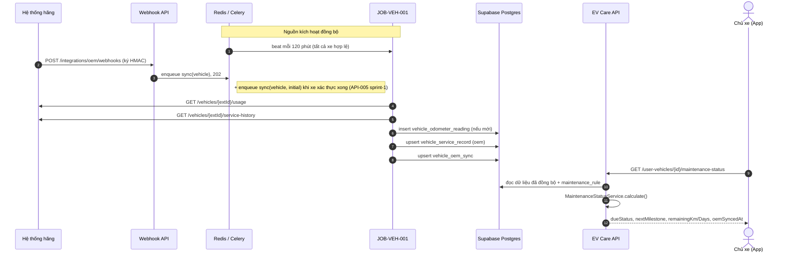

# API Technical Specification — Hồ sơ xe & Trạng thái đến hạn bảo dưỡng

> Đặc tả API backend cho Feature `FEAT-VEH-001` (PRD F3, US-017 → US-020).
>
> **Nguồn nghiệp vụ:** [Functional Spec](../feature-functional/us-017-sprint-2-spec.ff.md) · **Entity:** [Entity Spec](../entity/us-017-sprint-2-spec.entity.md)
>
> API Spec **tuân theo** Functional Spec, không định nghĩa lại nghiệp vụ. Quyết định kỹ thuật chưa chốt được đánh dấu `[Đề xuất]`.

---

# 0. Document Information

| Field | Value |
| --- | --- |
| Document ID | `API-SPEC-VEH-001` |
| Feature | `FEAT-VEH-001` |
| Version | `v1.1` |
| Status | `Draft` |
| Owner | Backend Team |
| Base URL | `/api/v1` |
| Module | `backend/src/modules/user_vehicle/` (API chủ xe), `backend/src/modules/oem_integration/` (webhook + job đồng bộ) |
| Created Date | `2026-09-28` |
| Updated Date | `2026-09-28` |

## 0.1 API Catalog

| ID | Method | Endpoint / Name | Caller | Mục đích | FF |
| --- | --- | --- | --- | --- | --- |
| `API-VEH-001` | `GET` | `/api/v1/user-vehicles` | App chủ xe | Danh sách xe đang liên kết (MVP: 1 xe) | US-017, `BR-010` |
| `API-VEH-002` | `GET` | `/api/v1/user-vehicles/{userVehicleId}` | App chủ xe | Hồ sơ xe: định danh, thông số, bảo hành, ODO, lần bảo dưỡng gần nhất | US-018 |
| `API-VEH-003` | `GET` | `/api/v1/user-vehicles/{userVehicleId}/maintenance-status` | App chủ xe | Trạng thái đến hạn + mốc tiếp theo | US-017, `BR-001`→`BR-009`, `AC-001`→`AC-004`, `AC-006`, `AC-007`, `AC-011` |
| `API-VEH-004` | `POST` | `/api/v1/integrations/oem/webhooks` | Hệ thống hãng | Nhận tín hiệu có dữ liệu mới, xếp hàng đồng bộ | US-019, `BR-011`, `BR-012`, `AC-010` |
| `JOB-VEH-001` | — | `sync_vehicle_oem_data` (Celery) | Beat / webhook / onboarding | Kéo ODO + lịch sử bảo dưỡng từ hãng, lưu vào DB | US-019, `BR-003`, `BR-004`, `BR-011` |
| `TOOL-VEH-001` | — | Agent tool `get_maintenance_status` | AI Agent | Đọc trạng thái đến hạn | US-020, `BR-008`, `AC-009` |

**Không có** API ghi ODO hay lịch sử bảo dưỡng cho chủ xe (FF BR-003, AC-005).

## 0.2 End-to-end Sequence



---

# C. Common Specification

## C.1 Authentication

- **API-VEH-001 → 003:** như [API-SPEC-AUTH-001 §C.1](../../sprint-1/api/us-001-sprint-1-spec.api.md#c1-authentication) — `Authorization: Bearer <firebase_id_token>`.
- **API-VEH-004:** không dùng Firebase; xác thực bằng chữ ký HMAC của hãng (API-VEH-004 §2).

## C.2 Roles & Guard (API-VEH-001 → 003)

| Role | Access |
| --- | --- |
| Chủ xe (`onboarding_status = active`) | ✅ — chỉ xe của mình, **chỉ đọc** |
| Chủ xưởng | ❌ `403 FORBIDDEN` |
| `ANONYMOUS` | ❌ `401` |

- Dependency `require_active_user` (API-SPEC-AUTH-001 §C.2).
- Dependency mới `get_owned_active_vehicle(userVehicleId)`:
  - Không tồn tại **hoặc** thuộc người khác ⇒ `404 VEHICLE_NOT_FOUND` (AC-008).
  - `verification_status ≠ verified` hoặc `link_status ≠ active` ⇒ `409 VEHICLE_NOT_ACTIVE`.

## C.3 Response Envelope

Như API-SPEC-AUTH-001 §C.3: `{ "data": … }` / `{ "error": { "code", "message", "details", "traceId" } }`.

## C.4 Naming & Enum Conventions

JSON `camelCase`; enum API `UPPER_SNAKE_CASE`; thời gian ISO-8601 UTC; ngày `YYYY-MM-DD` theo Asia/Ho_Chi_Minh.

| Enum | Values |
| --- | --- |
| `DueStatus` | `NORMAL`, `DUE_SOON`, `OVERDUE`, `UNKNOWN` |
| `DueReason` | `KM`, `TIME`, `BOTH` |
| `CalculationBasis` | `KM_AND_TIME`, `TIME_ONLY` |
| `UnknownReason` | `OEM_DATA_NOT_SYNCED`, `NO_MAINTENANCE_RULE` |
| `LastServiceType` | `OEM_SERVICE_RECORD`, `EV_CARE_SERVICE_RECORD`, `PURCHASE_DATE` |
| `WarrantyComponent` | `BATTERY`, `MOTOR`, `CHASSIS`, `ELECTRONICS` |

## C.5 Shared Object: `Odometer`

```json
{ "odoKm": 11600, "recordedAt": "2026-09-28T01:00:00Z", "isStale": false, "dataSource": "OEM" }
```

| Field | Type | Nullable | Description |
| --- | --- | ---: | --- |
| `odoKm` | `integer` | No | ODO hiện tại (BR-ENT-430) |
| `recordedAt` | `datetime` | No | Thời điểm **hãng** đo |
| `isStale` | `boolean` | No | `recordedAt` quá 30 ngày (FF BR-009) |
| `dataSource` | `string` | No | Luôn `OEM` — để FE hiển thị "Dữ liệu do hãng cung cấp" |

Hãng chưa có ODO ⇒ object là `null`.

## C.6 Shared Object: `MaintenanceStatus`

Trả bởi API-VEH-003 và TOOL-VEH-001; map 1-1 với read model RM-401.

```json
{
  "userVehicleId": "3f6c2c8e-9a7b-4d0e-8f7a-2b1c4d5e6f70",
  "dueStatus": "DUE_SOON",
  "dueReason": "KM",
  "calculationBasis": "KM_AND_TIME",
  "unknownReason": null,
  "nextMilestone": {
    "odoMilestoneKm": 12000,
    "monthMilestone": 12,
    "label": "12,000 km / 12 months",
    "dueDate": "2026-10-15",
    "isRecurring": false,
    "items": [
      { "itemCode": "BRAKE_INSPECTION", "itemName": "Kiểm tra hệ thống phanh", "isCoveredByWarranty": false },
      { "itemCode": "BATTERY_CHECK", "itemName": "Kiểm tra pin cao áp", "isCoveredByWarranty": true }
    ]
  },
  "remainingKm": 400,
  "remainingDays": 17,
  "odometer": { "odoKm": 11600, "recordedAt": "2026-09-28T01:00:00Z", "isStale": false, "dataSource": "OEM" },
  "lastService": { "type": "PURCHASE_DATE", "date": "2025-10-15", "odoKm": 0 },
  "thresholds": { "dueSoonKm": 500, "dueSoonDays": 14 },
  "oemSyncedAt": "2026-09-28T01:05:12Z",
  "calculatedAt": "2026-09-28T02:00:05Z"
}
```

| Field | Type | Nullable | Description |
| --- | --- | ---: | --- |
| `dueStatus` | `DueStatus` | No | FF BR-002 |
| `dueReason` | `DueReason` | Yes | `null` khi `NORMAL` / `UNKNOWN` |
| `calculationBasis` | `CalculationBasis` | Yes | `TIME_ONLY` khi hãng chưa có ODO (AC-002) |
| `unknownReason` | `UnknownReason` | Yes | Chỉ khi `UNKNOWN` |
| `nextMilestone` | object | Yes | `null` khi `UNKNOWN`; `label` là chuỗi tiếng Anh trung tính (`12,000 km / 12 months`, theo quy ước code English-only) — FE tự hiển thị tiếng Việt từ `odoMilestoneKm` / `monthMilestone`; `items[]` **không có giá** |
| `remainingKm` | `integer` | Yes | Âm khi đã vượt; `null` khi không có ODO |
| `remainingDays` | `integer` | Yes | Âm khi đã quá |
| `odometer` | `Odometer` | Yes | |
| `lastService` | object | Yes | Mốc gốc (FF BR-005) |
| `oemSyncedAt` | `datetime` | Yes | Lần đồng bộ ODO thành công gần nhất (`vehicle_oem_sync.usage_synced_at`) |
| `calculatedAt` | `datetime` | No | |

## C.7 Error Code Catalog

| Error Code | HTTP | API | Description | FF |
| --- | ---: | --- | --- | --- |
| `INVALID_REQUEST` | `400` | All | Body / path / query sai | |
| `UNAUTHORIZED` / `INVALID_TOKEN` | `401` | 001–003 | | |
| `ONBOARDING_REQUIRED` | `403` | 001–003 | | BR-010 |
| `FORBIDDEN` | `403` | 001–003 | Token chủ xưởng | |
| `VEHICLE_NOT_FOUND` | `404` | 002–003 | Không tồn tại hoặc không thuộc user | AC-008 |
| `VEHICLE_NOT_ACTIVE` | `409` | 002–003 | Chưa `verified` / đã `unlinked` | EF-004 |
| `WEBHOOK_SIGNATURE_INVALID` | `401` | 004 | Thiếu / sai chữ ký | EF-002 |
| `WEBHOOK_TIMESTAMP_EXPIRED` | `401` | 004 | Lệch quá 300 giây | EF-002 |
| `UNSUPPORTED_EVENT_TYPE` | `422` | 004 | `eventType` không hỗ trợ | |
| `DATABASE_ERROR` / `INTERNAL_SERVER_ERROR` | `500` | All | | |

> API-VEH-003 **không** trả lỗi khi hãng lỗi (chỉ đọc DB). "Chưa đồng bộ" và "model chưa có định mức" trả `200` với `dueStatus = UNKNOWN`.

## C.8 External Dependency — Hệ thống hãng

Dùng chung cấu hình và port `OemVehicleGateway` của API-SPEC-AUTH-001 §C.7. Thêm:

| # | OEM Endpoint | Dùng ở | Dữ liệu |
| --- | --- | --- | --- |
| O6 | `GET /vehicles/{vehicle_id}/usage` | JOB-VEH-001 | `current_km`, `data_source`, `last_updated_at` |
| O7 | `GET /vehicles/{vehicle_id}/service-history` | JOB-VEH-001 | `order_id`, `service_center_id`, `service_date`, `km_at_service`, `items_done`, `is_periodic` (thiếu ⇒ `true`; Q-304) |

- O6 trả `404 "No usage data"` ⇒ hãng **chưa có ODO** — đồng bộ vẫn tính là thành công.
- O6/O7 trả `404 "Vehicle not found"` ⇒ lỗi `OEM_VEHICLE_NOT_FOUND`, ghi vào `vehicle_oem_sync`.
- Không dùng `GET /vehicles/{id}/next-maintenance` và `GET /vehicles/{id}/usage/stream` (SSE) của mock: định mức và quy tắc tính thuộc EV Care; SSE giữ kết nối lâu theo từng xe, không phù hợp làm cơ chế đồng bộ.
- **Mock gửi webhook (Q-310 — đã chốt).** `mock-ev-system` ký và gửi webhook đúng hợp đồng API-VEH-004; tên sự kiện, header và hàm ký/kiểm chữ ký dùng chung ở `ev_contracts` (`WebhookEventType`, `sign_webhook`, `verify_webhook_signature`):
  - `vehicle.usage.updated` — simulator ODO, tối đa 1 lần / xe / `MOCK_WEBHOOK_USAGE_MIN_INTERVAL_SECONDS` (mặc định 300 s).
  - `vehicle.service_history.updated` — sau `POST /vehicles/{vehicle_id}/service-history` của mock (ghi một lần bảo dưỡng, dùng để demo AC-010).
  - `POST /webhooks/test-events` — bắn một sự kiện thủ công; `GET /webhooks/config` — xem cấu hình.
  - Cấu hình mock: `MOCK_WEBHOOK_URL` (trống = tắt), `MOCK_WEBHOOK_SECRET` (= `OEM_WEBHOOK_SECRET` của backend). Retry 3 lần (1 s, 4 s) với lỗi mạng / 5xx; không retry 4xx.

Cấu hình `[Đề xuất]`:

```text
OEM_SYNC_INTERVAL_SECONDS=7200
OEM_SYNC_ALERT_FAILURES=3
OEM_WEBHOOK_SECRET=<secret>
OEM_WEBHOOK_TOLERANCE_SECONDS=300
DUE_SOON_KM=500
DUE_SOON_DAYS=14
MAINTENANCE_RECURRING_KM=12000
MAINTENANCE_RECURRING_MONTHS=12
ODO_STALE_DAYS=30
```

## C.9 Shared Service

`MaintenanceStatusService.calculate(user_vehicle, today) -> MaintenanceStatus` — thuật toán Entity Spec RM-401 §4, **chỉ đọc DB**. Dùng bởi API-VEH-003, TOOL-VEH-001 và job nhắc F7.

`OemVehicleSyncService.sync(user_vehicle, trigger)` — logic JOB-VEH-001; job định kỳ, webhook và onboarding đều gọi service này.

## C.10 Observability

- Log: `traceId`, `userVehicleId`, trigger, latency O6/O7, số bản ghi thêm/cập nhật, `odometer_decrease`, lỗi đồng bộ.
- **Không log:** ID token, VIN, biển số đầy đủ, secret, body webhook đầy đủ.
- Metrics: `maintenance_status_total{dueStatus, basis}`, `oem_sync_total{trigger, result}`, `oem_sync_lag_seconds` (now − `usage_synced_at`), `oem_sync_consecutive_failures`, `oem_webhook_total{eventType, result}`, `odometer_decrease_total`.

---

# API-VEH-001 — Danh sách xe của tôi

| Property | Value |
| --- | --- |
| Method | `GET` |
| Endpoint | `/api/v1/user-vehicles` |
| Authorization | `require_active_user` |

**Processing:** đọc `user_vehicle` WHERE `user_id = :currentUserId AND verification_status = 'verified' AND link_status = 'active'` ORDER BY `created_at`. Không gọi hãng.

**Response `200`:**

```json
{
  "data": [
    { "userVehicleId": "3f6c2c8e-9a7b-4d0e-8f7a-2b1c4d5e6f70", "modelName": "VF6", "trim": "Plus", "licensePlate": "30A12345", "color": "Trắng" }
  ]
}
```

**Errors:** `401`, `403`, `500`. **Performance:** p90 ≤ 200 ms.

---

# API-VEH-002 — Hồ sơ xe

| Property | Value |
| --- | --- |
| Method | `GET` |
| Endpoint | `/api/v1/user-vehicles/{userVehicleId}` |
| Authorization | `require_active_user` + `get_owned_active_vehicle` |

## Processing

1. Guard (C.2).
2. `vehicle_warranty` của xe; `isActive = endDate >= hôm nay AND (kmLimit IS NULL OR odo IS NULL OR odo <= kmLimit)`.
3. ODO hiện tại (ENT-414, BR-ENT-430); lần bảo dưỡng gần nhất (ENT-415, BR-ENT-434); `vehicle_oem_sync`.
4. VIN che: 6 ký tự đầu + `******` + 5 ký tự cuối.

| Entity | Operation |
| --- | --- |
| `user_vehicle`, `vehicle_warranty`, `vehicle_odometer_reading`, `vehicle_service_record`, `vehicle_oem_sync` | Read |

## Response `200`

```json
{
  "data": {
    "userVehicleId": "3f6c2c8e-9a7b-4d0e-8f7a-2b1c4d5e6f70",
    "vinMasked": "LVVDB1******00001",
    "licensePlate": "30A12345",
    "modelId": "VF6",
    "modelName": "VF6",
    "trim": "Plus",
    "color": "Trắng",
    "productionYear": 2025,
    "manufactureDate": "2025-08-20",
    "batteryCapacityKwh": 59.6,
    "motorPowerKw": 150.0,
    "warranties": [
      { "component": "BATTERY", "startDate": "2025-10-15", "endDate": "2033-10-15", "kmLimit": 200000, "isActive": true }
    ],
    "odometer": { "odoKm": 11600, "recordedAt": "2026-09-28T01:00:00Z", "isStale": false, "dataSource": "OEM" },
    "lastService": {
      "serviceDate": "2026-03-10",
      "odoKm": 6100,
      "source": "OEM",
      "centerName": "VinFast Smart City"
    },
    "oemSyncedAt": "2026-09-28T01:05:12Z"
  }
}
```

| Field | Type | Nullable | Description |
| --- | --- | ---: | --- |
| `vinMasked` | `string` | No | Không trả VIN đầy đủ |
| `warranties[]` | array | No | `isActive` tính khi đọc |
| `odometer` | `Odometer` | Yes | `null` khi hãng chưa có ODO |
| `lastService` | object | Yes | `null` khi chưa bảo dưỡng; `source` = `OEM` / `EV_CARE`; `centerName` từ `workshop.name` nếu map được, không thì `null` |
| `oemSyncedAt` | `datetime` | Yes | `null` khi chưa đồng bộ lần nào |

**Errors:** `400`, `401`, `403`, `404 VEHICLE_NOT_FOUND`, `409 VEHICLE_NOT_ACTIVE`, `500`. **Performance:** p90 ≤ 300 ms.

---

# API-VEH-003 — Trạng thái đến hạn bảo dưỡng

| Property | Value |
| --- | --- |
| Method | `GET` |
| Endpoint | `/api/v1/user-vehicles/{userVehicleId}/maintenance-status` |
| Authorization | `require_active_user` + `get_owned_active_vehicle` |

## Request

| Param | In | Type | Required |
| --- | --- | --- | ---: |
| `userVehicleId` | path | `uuid` | Yes |

Không có tham số làm mới: dữ liệu hãng được đồng bộ tự động (FF §3.2).

## Processing

1. Guard (C.2).
2. `MaintenanceStatusService.calculate(vehicle, today)` — RM-401 §4:
   - Chưa sẵn sàng (BR-ENT-436) ⇒ `UNKNOWN` / `OEM_DATA_NOT_SYNCED`. Nếu `vehicle_oem_sync` chưa có dòng **hoặc** `last_attempt_at` cũ hơn 5 phút, enqueue `sync(vehicle, trigger=initial)` (tự phục hồi khi lần đồng bộ ban đầu bị mất).
   - Không có định mức ⇒ `UNKNOWN` / `NO_MAINTENANCE_RULE`.
   - Còn lại ⇒ tính trạng thái.
3. Trả `MaintenanceStatus`.

| Entity | Operation | Purpose |
| --- | --- | --- |
| `user_vehicle`, `vehicle_warranty` | Read | Model, ngày mua |
| `maintenance_rule` | Read | Định mức |
| `vehicle_odometer_reading` | Read | ODO hiện tại |
| `vehicle_service_record` | Read | Mốc gốc |
| `vehicle_oem_sync` | Read | Sẵn sàng, `oemSyncedAt` |

```sql
SELECT odo_milestone, month_milestone, item_code, item_name, is_covered_by_warranty
FROM maintenance_rule
WHERE model_id = :modelId
ORDER BY odo_milestone, item_code;

SELECT service_date, odo_km, source
FROM vehicle_service_record
WHERE user_vehicle_id = :userVehicleId
ORDER BY service_date DESC, odo_km DESC NULLS LAST
LIMIT 1;
```

## Response `200`

`{ "data": MaintenanceStatus }` — C.6.

**Chưa đồng bộ (AC-011):**

```json
{
  "data": {
    "userVehicleId": "3f6c2c8e-9a7b-4d0e-8f7a-2b1c4d5e6f70",
    "dueStatus": "UNKNOWN",
    "dueReason": null,
    "calculationBasis": null,
    "unknownReason": "OEM_DATA_NOT_SYNCED",
    "nextMilestone": null,
    "remainingKm": null,
    "remainingDays": null,
    "odometer": null,
    "lastService": null,
    "thresholds": { "dueSoonKm": 500, "dueSoonDays": 14 },
    "oemSyncedAt": null,
    "calculatedAt": "2026-09-28T02:00:05Z"
  }
}
```

**Hãng chưa có ODO (AC-002):** `dueStatus` theo thời gian, `calculationBasis = TIME_ONLY`, `remainingKm = null`, `odometer = null`.

**Errors:** `400`, `401`, `403`, `404`, `409`, `500`.

**Idempotency:** `GET`, không ghi dữ liệu nghiệp vụ (chỉ có thể enqueue job đồng bộ).

**Performance:** p90 ≤ 500 ms (PRD §8) — không phụ thuộc latency hãng.

---

# API-VEH-004 — Webhook dữ liệu xe từ hãng

## 1. Overview

| Property | Value |
| --- | --- |
| Method | `POST` |
| Endpoint | `/api/v1/integrations/oem/webhooks` |
| Caller | Hệ thống hãng |
| Authentication | HMAC-SHA256 (không dùng Firebase) |

**Purpose:** Hãng báo có dữ liệu mới của một xe; EV Care xếp hàng đồng bộ xe đó (FF BR-011, BR-012).

**Nguyên tắc:** webhook chỉ là **tín hiệu**. EV Care không ghi dữ liệu từ body webhook mà luôn đọc lại O6/O7 ⇒ không phụ thuộc thứ tự webhook, không tin dữ liệu chưa kiểm chứng.

## 2. Authentication

| Header | Required | Description |
| --- | ---: | --- |
| `X-OEM-Event-Id` | Yes | ID duy nhất của sự kiện (idempotency) |
| `X-OEM-Timestamp` | Yes | Unix seconds lúc gửi; lệch ≤ 300 giây so với server |
| `X-OEM-Signature` | Yes | `sha256=` + hex(HMAC-SHA256(`OEM_WEBHOOK_SECRET`, `{timestamp}.{raw_body}`)) |

- So sánh chữ ký bằng constant-time compare.
- Secret qua biến môi trường; hỗ trợ 2 secret song song khi xoay vòng `[Đề xuất]`.

## 3. Request Body

```json
{
  "eventType": "vehicle.usage.updated",
  "vehicleId": "VEH-0001",
  "occurredAt": "2026-09-28T03:10:00Z"
}
```

| Field | Type | Required | Constraints |
| --- | --- | ---: | --- |
| `eventType` | `string` | Yes | `vehicle.usage.updated`, `vehicle.service_history.updated` |
| `vehicleId` | `string` | Yes | `vehicle_id` của hãng, ≤ 64 ký tự |
| `occurredAt` | `datetime` | Yes | ISO-8601 |

Field khác trong body (nếu hãng gửi kèm dữ liệu) bị bỏ qua.

## 4. Processing

1. Kiểm tra timestamp ⇒ `401 WEBHOOK_TIMESTAMP_EXPIRED`.
2. Kiểm tra chữ ký trên raw body ⇒ `401 WEBHOOK_SIGNATURE_INVALID`.
3. Validate body ⇒ `400 INVALID_REQUEST` / `422 UNSUPPORTED_EVENT_TYPE`.
4. Idempotency: `SET oem:webhook:event:{eventId} 1 NX EX 604800` (7 ngày). Đã tồn tại ⇒ `202` với `duplicate = true`, không xử lý lại (EDGE-310).
5. Tìm `user_vehicle` WHERE `external_vehicle_id = vehicleId AND verification_status = 'verified' AND link_status = 'active'`. Không có ⇒ `202` với `ignored = true` (EDGE-312) — không trả `404` để không tiết lộ xe nào đang dùng EV Care.
6. Enqueue `sync(vehicle, trigger=webhook)` với debounce 10 giây theo xe (nhiều webhook liền nhau ⇒ một lần đồng bộ).
7. Trả `202` trong ≤ 200 ms; không gọi hãng trong request.

## 5. Response `202 Accepted`

```json
{ "data": { "eventId": "evt_01J9ZK3", "accepted": true, "duplicate": false, "ignored": false } }
```

## 6. Errors

| HTTP | Code | Hãng nên retry? |
| ---: | --- | --- |
| `400` | `INVALID_REQUEST` | Không |
| `401` | `WEBHOOK_SIGNATURE_INVALID`, `WEBHOOK_TIMESTAMP_EXPIRED` | Không (sửa cấu hình) |
| `422` | `UNSUPPORTED_EVENT_TYPE` | Không |
| `500` / `503` | `INTERNAL_SERVER_ERROR` | Có — backoff của hãng |

## 7. Security

- Rate limit theo IP nguồn: 100 request/phút `[Đề xuất]`.
- Không log body và chữ ký; log `eventId`, `eventType`, `vehicleId`, kết quả.
- Endpoint không nằm trong CORS của FE.

---

# JOB-VEH-001 — Đồng bộ dữ liệu xe từ hãng

## 1. Triggers

| Trigger | Cơ chế | Phạm vi |
| --- | --- | --- |
| `poll` | Celery beat mỗi `OEM_SYNC_INTERVAL_SECONDS` (3600) | Mọi xe `verified` + `active`: beat gửi **một task `oem.sync_vehicle` cho mỗi xe**; mức song song = concurrency của Celery worker |
| `webhook` | API-VEH-004 | Một xe |
| `initial` | Cuối API-005 sprint-1 khi xác thực `VERIFIED`; hoặc API-VEH-003 tự phục hồi | Một xe |

## 2. Processing — `OemVehicleSyncService.sync(vehicle, trigger)`

1. Khoá theo xe: Redis `SET oem:sync:lock:{userVehicleId} NX EX 60`. Đang bị khoá ⇒ bỏ qua (một lần đồng bộ khác đang chạy).
2. Ghi `vehicle_oem_sync.last_attempt_at = now()`, `last_trigger`.
3. **O6 usage:**
   - Có dữ liệu ⇒ nếu `last_updated_at` > `MAX(recorded_at)` của xe ⇒ `INSERT vehicle_odometer_reading` (`odo_km`, `recorded_at`, `oem_data_source`, `received_via = trigger`) `ON CONFLICT DO NOTHING`. `odo_km` < ODO hiện tại ⇒ log `odometer_decrease` (BR-ENT-432).
   - `No usage data` ⇒ không ghi.
   - Thành công (kể cả không có dữ liệu) ⇒ `usage_synced_at = now()`.
4. **O7 service-history:** với mỗi bản ghi ⇒ upsert `vehicle_service_record` (`source = oem`) theo `external_order_id` (BR-ENT-433); map `external_center_id` → `workshop.id` qua `workshop.external_center_id`. Thành công ⇒ `service_history_synced_at = now()`.
5. O6 và O7 độc lập: một bên lỗi không chặn bên kia.
6. Thành công cả hai ⇒ `consecutive_failures = 0`, `last_error_code = null`. Có lỗi ⇒ `consecutive_failures += 1`, `last_error_code`; `≥ 3` ⇒ log `error` + metric (BR-ENT-437).
7. Mỗi bước ghi DB là transaction ngắn riêng.

## 3. Retry & Timeout

| Dependency | Timeout | Retry | Backoff |
| --- | --- | ---: | --- |
| O6, O7 | `OEM_API_TIMEOUT_SECONDS` (8 s) | 2 | 1 s, 4 s |
| Celery task (webhook / initial) | — | 3 | 30 s, 2 phút, 10 phút |
| Poll | — | 0 | Lần poll sau là retry |

## 4. Concurrency

- Lock Redis theo xe (bước 1) + unique `ux_odometer_vehicle_recorded_at` và upsert theo `external_order_id` ⇒ chạy trùng không tạo dữ liệu trùng.
- Không khoá bảng; API đọc (API-VEH-002/003) không bị chặn.

## 5. Performance

- Một xe: ≤ 2 lời gọi hãng.
- Poll 1.000 xe với worker concurrency 5 và latency hãng 300 ms: ~2 phút/chu kỳ.

---

# TOOL-VEH-001 — Agent tool `get_maintenance_status`

| Property | Value |
| --- | --- |
| Name | `get_maintenance_status` |
| Side effect | Không |
| Input từ LLM | Không — `user_vehicle_id` lấy từ ngữ cảnh phiên chat |
| Output | `MaintenanceStatus` (C.6), bỏ `userVehicleId` |

**Quy tắc cho Agent:**

- Dùng đúng `dueStatus`, `remainingKm`, `remainingDays`, `label`; không tự tính.
- Nêu số km kèm thời điểm hãng cập nhật (`odometer.recordedAt`).
- `TIME_ONLY` ⇒ nói hãng chưa có dữ liệu số km, trạng thái tính theo thời gian.
- Chủ xe nói số km khác ⇒ **không** ghi nhận, không tính lại theo số đó; giải thích số km lấy từ hãng (FF BR-003, EDGE-313).
- `UNKNOWN` + `OEM_DATA_NOT_SYNCED` ⇒ "đang lấy dữ liệu từ hãng, vui lòng thử lại sau ít phút"; `NO_MAINTENANCE_RULE` ⇒ gợi ý liên hệ xưởng.

---

# 19. Versioning

Mọi endpoint thuộc `/api/v1`. Thêm giá trị enum là non-breaking; FE xử lý giá trị lạ như `UNKNOWN`.

# 23. Change Log

| Version | Date | Author | Changes |
| --- | --- | --- | --- |
| `v1.0` | `2026-09-28` | Team 4 Người | API-VEH-001 → 004 (004 = chủ xe cập nhật ODO), TOOL-VEH-001 |
| `v1.3` | `2026-09-28` | Team 4 Người | Đồng bộ với code: `label` tiếng Anh; poll gửi 1 task/xe (bỏ `OEM_SYNC_BATCH_SIZE`, `OEM_SYNC_MAX_CONCURRENCY`) |
| `v1.2` | `2026-09-28` | Team 4 Người | Q-310: mock gửi webhook ký HMAC; hợp đồng webhook chuyển vào `ev_contracts` |
| `v1.1` | `2026-09-28` | Team 4 Người | Bỏ API chủ xe cập nhật ODO; API-VEH-003 chỉ đọc DB (bỏ `refresh`, bỏ `503`); thêm API-VEH-004 webhook hãng, JOB-VEH-001 đồng bộ định kỳ / webhook / initial |

# 24. Open Questions

- [x] Q-309: chu kỳ poll 120 phút — đã chốt
- [x] Q-310: bổ sung webhook vào mock — đã làm (C.8). Còn mở: hãng thật có hỗ trợ webhook và định dạng chữ ký như §API-VEH-004.2 không.
- [ ] Nghiệp vụ: [FF §24](../feature-functional/us-017-sprint-2-spec.ff.md#24-open-questions)

# 25. References

- PRD: [PRD_EV_Care_MVP.md §F3](../../../product/PRD_EV_Care_MVP.md)
- Functional Spec: [us-017-sprint-2-spec.ff.md](../feature-functional/us-017-sprint-2-spec.ff.md)
- Entity Spec: [us-017-sprint-2-spec.entity.md](../entity/us-017-sprint-2-spec.entity.md)
- Common conventions: [API-SPEC-AUTH-001](../../sprint-1/api/us-001-sprint-1-spec.api.md)
- Mock OEM: `backend/mock-ev-system/src/mock_ev_system/routers/usage.py`, `maintenance.py`
