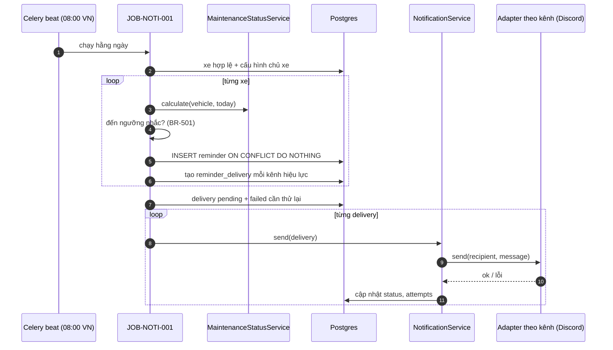

# API Technical Specification — Nhắc mốc bảo dưỡng & cấu hình thông báo

> **Cập nhật phạm vi (02/10/2026):** các phần dưới đây trong tài liệu này không còn áp dụng.
>
> - Kết nối Discord (`user_discord_link`, ENT-417): **đã bỏ**. Nhắc bảo dưỡng, nhắc lịch hẹn và hỏi thăm hiện trong mục **Thông báo** của app; danh sách kênh ngoài (Zalo / Telegram / SMS / Email) vẫn có nhưng đều "Sắp có", bật nhắc không bắt buộc chọn kênh.

> Đặc tả API backend cho Feature `FEAT-NOTI-001` (PRD F7 phần nhắc mốc + NOTI-01, US-021 → US-024).
>
> **Nguồn nghiệp vụ:** [Functional Spec](../feature-functional/us-021-sprint-2-spec.ff.md) · **Entity:** [Entity Spec](../entity/us-021-sprint-2-spec.entity.md)
>
> API Spec **tuân theo** Functional Spec, không định nghĩa lại nghiệp vụ. Quyết định kỹ thuật chưa chốt đánh dấu `[Đề xuất]`.

---

# 0. Document Information

| Field | Value |
| --- | --- |
| Document ID | `API-SPEC-NOTI-001` |
| Feature | `FEAT-NOTI-001` |
| Version | `v1.0` |
| Status | `Draft` |
| Owner | Backend Team |
| Base URL | `/api/v1` |
| Module | `backend/src/modules/notification/` (API cấu hình, `NotificationService`, adapter), job trong `backend/src/infrastructure/celery/tasks/` |
| Created Date | `2026-09-28` |

## 0.1 API Catalog

| ID | Method | Endpoint / Name | Caller | Mục đích | FF |
| --- | --- | --- | --- | --- | --- |
| `API-NOTI-001` | `GET` | `/api/v1/notification-settings` | App chủ xe | Xem cấu hình nhắc và kênh | US-022, US-023, `AC-509` |
| `API-NOTI-002` | `PUT` | `/api/v1/notification-settings` | App chủ xe | Lưu cấu hình nhắc và kênh | US-022, US-023, `BR-504`→`BR-506`, `AC-502`, `AC-506`, `AC-510` |
| `JOB-NOTI-001` | — | `send_maintenance_reminders` (Celery beat) | Beat hằng ngày | Tạo nhắc và gửi | US-021, `BR-501`→`BR-511`, `AC-501`→`AC-508` |

Không có API để chủ xe tạo hay xoá nhắc thủ công.

## 0.2 End-to-end Sequence



---

# C. Common Specification

## C.1 Authentication

`Authorization: Bearer <firebase_id_token>` như [API-SPEC-AUTH-001 §C.1](../../sprint-1/api/us-001-sprint-1-spec.api.md#c1-authentication).

## C.2 Roles & Guard

| Role | Access |
| --- | --- |
| Chủ xe (`onboarding_status = active`) | ✅ — chỉ cấu hình của mình |
| Chủ xưởng | ❌ `403 FORBIDDEN` |
| `ANONYMOUS` | ❌ `401` |

Dùng lại dependency `require_active_vehicle_owner` của module `user_vehicle`.

## C.3 Response Envelope

`{ "data": … }` / `{ "error": { "code", "message", "details", "traceId" } }`.

## C.4 Naming & Enum Conventions

JSON `camelCase`; enum API `UPPER_SNAKE_CASE`.

| Enum | Values |
| --- | --- |
| `NotificationChannel` | `DISCORD`, `ZALO`, `TELEGRAM`, `SMS`, `EMAIL` |
| `ChannelStatus` | `CONNECTED`, `NOT_CONNECTED`, `COMING_SOON` |
| `ReminderLevel` | `EARLY`, `EXPIRED` |
| `DeliveryStatus` | `PENDING`, `SENT`, `FAILED`, `NO_RECIPIENT` |

## C.5 Shared Object: `NotificationSettings`

| Field | Type | Description |
| --- | --- | --- |
| `remindersEnabled` | `boolean` | Bật nhắc bảo dưỡng |
| `reminderLeadDays` | `integer` | `0..30`, số ngày nhắc trước hạn |
| `defaultReminderLeadDays` | `integer` | Giá trị mặc định của hệ thống (để FE hiện "Mặc định: 2 ngày") |
| `channels[]` | array | Mọi kênh của hệ thống |
| `channels[].channel` | `NotificationChannel` | |
| `channels[].enabled` | `boolean` | Chủ xe đã bật |
| `channels[].available` | `boolean` | Hệ thống đã hỗ trợ kênh này (`false` ⇒ `COMING_SOON`) |
| `channels[].status` | `ChannelStatus` | `CONNECTED` khi đã có nơi nhận (Discord `active`); `NOT_CONNECTED`; `COMING_SOON` khi `available = false` |

```json
{
  "data": {
    "remindersEnabled": true,
    "reminderLeadDays": 2,
    "defaultReminderLeadDays": 2,
    "channels": [
      { "channel": "DISCORD",  "enabled": true,  "available": true,  "status": "NOT_CONNECTED" },
      { "channel": "ZALO",     "enabled": false, "available": false, "status": "COMING_SOON" },
      { "channel": "TELEGRAM", "enabled": false, "available": false, "status": "COMING_SOON" },
      { "channel": "SMS",      "enabled": false, "available": false, "status": "COMING_SOON" },
      { "channel": "EMAIL",    "enabled": false, "available": false, "status": "COMING_SOON" }
    ]
  }
}
```

## C.6 Error Code Catalog

| Error Code | HTTP | API | Description | FF |
| --- | ---: | --- | --- | --- |
| `INVALID_REQUEST` | `400` | All | Body sai | |
| `UNAUTHORIZED` / `INVALID_TOKEN` | `401` | 001–002 | | |
| `ONBOARDING_REQUIRED` | `403` | 001–002 | | |
| `FORBIDDEN` | `403` | 001–002 | Token chủ xưởng | |
| `INVALID_LEAD_DAYS` | `422` | 002 | `reminderLeadDays` ngoài `0..30` | BR-504 |
| `CHANNEL_NOT_AVAILABLE` | `422` | 002 | Bật kênh chưa có adapter | BR-506, AC-510 |
| `NO_CHANNEL_ENABLED` | `422` | 002 | Bật nhắc nhưng không kênh nào bật | BR-505 |
| `DATABASE_ERROR` / `INTERNAL_SERVER_ERROR` | `500` | All | | |

---

# API-NOTI-001 — Xem cấu hình

## Processing

1. Đọc `user_notification_setting`; không có ⇒ mặc định `remindersEnabled = true`, `reminderLeadDays = REMINDER_DEFAULT_LEAD_DAYS`.
2. Đọc `user_notification_channel`; không có dòng nào ⇒ Discord `enabled = true`, còn lại `false` (BR-ENT-451).
3. `status`: Discord `CONNECTED` khi `user_discord_link.status = active`, ngược lại `NOT_CONNECTED`; kênh `available = false` ⇒ `COMING_SOON`.

## Response `200`

`{ "data": NotificationSettings }` — C.5. Chỉ đọc, không tạo dòng.

---

# API-NOTI-002 — Lưu cấu hình

## Request

```json
{
  "remindersEnabled": true,
  "reminderLeadDays": 5,
  "channels": [
    { "channel": "DISCORD", "enabled": true }
  ]
}
```

| Field | Type | Required | Rule |
| --- | --- | ---: | --- |
| `remindersEnabled` | `boolean` | No | Bỏ qua = giữ nguyên |
| `reminderLeadDays` | `integer` | No | `0..30` |
| `channels` | array | No | Chỉ các kênh gửi lên bị thay đổi; kênh không gửi giữ nguyên |
| `channels[].channel` | `NotificationChannel` | Yes | |
| `channels[].enabled` | `boolean` | Yes | `true` chỉ cho kênh `available` (BR-506) |

Ít nhất một trường phải có, nếu không `400 INVALID_REQUEST`.

## Processing

1. Validate theo bảng trên; kênh `enabled = true` mà chưa `available` ⇒ `422 CHANNEL_NOT_AVAILABLE`. Tắt kênh chưa `available` được chấp nhận (idempotent).
2. Tính kênh hiệu lực sau thay đổi (BR-ENT-451); `remindersEnabled` (sau thay đổi) là `true` mà tập rỗng ⇒ `422 NO_CHANNEL_ENABLED`.
3. Upsert `user_notification_setting` và các dòng `user_notification_channel` trong **một transaction**.
4. Trả cấu hình mới.

## Response `200`

`{ "data": NotificationSettings }`.

Áp dụng từ lần chạy job kế tiếp; không sinh nhắc bù (BR-504).

---

# JOB-NOTI-001 — Nhắc mốc bảo dưỡng

## 1. Trigger

Celery beat, `crontab(hour=REMINDER_JOB_HOUR, minute=0)` theo Asia/Ho_Chi_Minh (mặc định 08:00). Gọi `send_maintenance_reminders`, xếp mỗi xe một task con `remind_vehicle(user_vehicle_id)` để xe lỗi không chặn xe khác.

## 2. Processing — `MaintenanceReminderService.remind(vehicle, today)`

1. Bỏ qua nếu xe không hợp lệ (BR-510) hoặc `remindersEnabled = false` (AF-504).
2. Gọi `MaintenanceStatusService.calculate`; `UNKNOWN` ⇒ dừng (EF-504).
3. Có booking chưa hoàn tất/huỷ từ hôm nay ⇒ đóng nhắc đang mở (`is_resolved = true`), dừng (BR-503).
4. Xác định mức (BR-501): `OVERDUE` ⇒ `expired`; `remaining_days ≤ lead_days` hoặc `remaining_km ≤ DUE_SOON_KM` ⇒ `early`; ngược lại dừng.
5. `INSERT reminder (user_vehicle_id, target_odo_milestone, level) ON CONFLICT DO NOTHING`. Không chèn được (đã có) ⇒ dừng bước tạo (delivery cũ được xử lý ở bước 7).
6. Tạo `reminder_delivery` `pending` cho mỗi kênh hiệu lực (BR-505).
7. Gửi mọi delivery `pending` của xe, cộng delivery `failed` còn lượt thử với lỗi tạm thời (BR-ENT-454).

## 3. `NotificationService`

```text
class NotificationChannelAdapter(ABC):
    channel: ReminderChannel
    async def send(recipient: Recipient, message: NotificationMessage) -> DeliveryResult

class NotificationService:
    def register(adapter)                      # đăng ký theo kênh
    def available_channels() -> set[Channel]   # dùng cho BR-506
    async def deliver(delivery) -> DeliveryResult
```

- `Recipient` do adapter tự phân giải từ user (Discord: `user_discord_link`); không có/không `active` ⇒ `NO_RECIPIENT`.
- `DeliveryResult`: `sent` | `failed(error_code, retryable)` | `no_recipient`.
- MVP đăng ký duy nhất `DiscordAdapter`. Thêm kênh: viết adapter và `register`; job, luật nhắc, API không đổi.
- `[Đề xuất]` Trước khi bot Discord thật có mặt, `DiscordAdapter` có bản `LoggingDiscordAdapter` (dev) chỉ ghi log không nội dung nhạy cảm.

## 4. Nội dung (`NotificationMessage`)

Backend dựng từ kết quả F3 (BR-509): tên model, biển số che một phần, tên mốc, số ngày/km còn lại hoặc đã quá, ngày đến hạn, link mở app. Nội dung tiếng Việt; không có VIN, SĐT, email, CCCD.

## 5. Retry

Không backoff trong lần chạy. Delivery lỗi tạm thời được thử lại ở lần chạy hằng ngày kế tiếp, tối đa `REMINDER_MAX_ATTEMPTS` (3). Lỗi `DELIVERY_FORBIDDEN` (Discord 403/404): không thử lại và đặt `user_discord_link.status = revoked` (BR-ENT-442).

## 6. Concurrency & Idempotency

- Khoá nhắc: unique `ux_reminder_vehicle_milestone_level` (BR-ENT-453).
- Khoá delivery: unique (`reminder_id`, `channel`). Trước khi gửi, chuyển `pending → sending`-tương-đương bằng cập nhật có điều kiện `attempts` để hai worker không gửi cùng một delivery `[Đề xuất]`.

## 7. Observability

- Log: `traceId`, `userVehicleId`, `level`, `channel`, `status`, `attempts`. **Không log** nội dung, địa chỉ nhận, VIN.
- Metrics: `reminder_total{level, result}`, `notification_delivery_total{channel, status}`, `reminder_job_duration_seconds`.
- Log `error` + metric khi delivery `failed` cuối (hết lượt thử).

---

# Cấu hình

```text
REMINDER_DEFAULT_LEAD_DAYS=2
REMINDER_JOB_HOUR=8
REMINDER_MAX_ATTEMPTS=3
```

Dùng lại `DUE_SOON_KM` của F3 cho điều kiện theo km.

---

# 19. Versioning

Mọi endpoint thuộc `/api/v1`. Thêm kênh (`NotificationChannel`) là non-breaking; FE xử lý kênh lạ như `COMING_SOON`.

# 23. Change Log

| Version | Date | Author | Changes |
| --- | --- | --- | --- |
| `v1.0` | `2026-09-28` | Team 4 Người | API-NOTI-001/002, JOB-NOTI-001, `NotificationService` |

# 24. Open Questions

- [ ] Nghiệp vụ: [FF §24](../feature-functional/us-021-sprint-2-spec.ff.md#24-open-questions) (Q-501 → Q-506)
- [ ] Bot Discord + OAuth2 (ENT-417) chưa có code: adapter chạy thật cần phần này; trước đó dùng `LoggingDiscordAdapter`.

# 25. References

- [F3 API — us-017](us-017-sprint-2-spec.api.md) (`MaintenanceStatusService`)
- [reminder.entity.md](../../entity/maintenance/reminder.entity.md) · [user_discord_link.entity.md](../../entity/identity/user_discord_link.entity.md)
