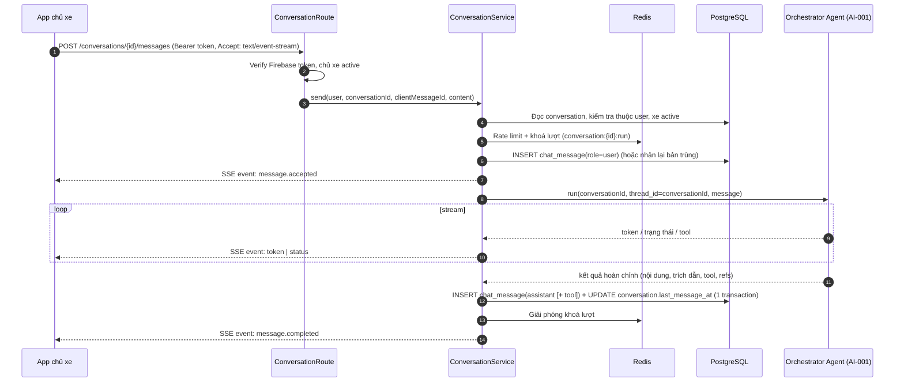

# API Technical Specification — Chat RAG & hội thoại

> Đặc tả API backend cho Feature `FEAT-CHAT-001` (PRD F4, US-025 → US-030).
>
> **Nguồn nghiệp vụ:** [Functional Spec](../feature-functional/us-025-sprint-2-spec.ff.md) · **Entity:** [Entity Spec](../entity/us-025-sprint-2-spec.entity.md) · **Agent:** [AI-001](../../ai-agent/ai-001-sprint-2-spec.agent.md), [AI-002](../../ai-agent/ai-002-sprint-2-spec.agent.md)
>
> API Spec **tuân theo** Functional Spec, không định nghĩa lại nghiệp vụ. Quyết định kỹ thuật chưa chốt đánh dấu `[Đề xuất]`.
>
> **Nền tảng dùng chung:** tạo/liệt kê/tải/tìm/xoá hội thoại, WebSocket realtime, `MessageService` và lập chỉ mục vector nằm ở [conversation-messaging.api.md](../../platform/conversation-messaging.api.md). Tài liệu này chỉ còn phần **riêng của F4**: gửi tin nhắn + stream câu trả lời (SSE), đoạn hội thoại cho chủ xưởng, xuất ẩn danh cho eval.
>
> **Thay thế** route PROVISIONAL `backend/src/modules/conversation/route.py` — xem [§12 của nền tảng](../../platform/conversation-messaging.api.md#12-chuyển-đổi-từ-code-provisional).

---

# 0. Document Information

| Field | Value |
| --- | --- |
| Document ID | `API-SPEC-CHAT-001` |
| Feature | `FEAT-CHAT-001` |
| Version | `v1.0` |
| Status | `Draft` |
| Owner | Backend Team |
| Base URL | `/api/v1` |
| Module | `backend/src/modules/conversation/` (route, service, schemas, dependency); Agent gọi qua AI-001; job trong `backend/src/infrastructure/celery/tasks/` |
| Created Date | `2026-09-28` |

## 0.0 Cấu trúc module (theo quy ước codebase)

Theo mẫu các module hiện có (ví dụ `modules/user_vehicle/`: `route.py`, `service.py`, `schemas.py`, `dependency.py`, `errors.py`):

```text
backend/src/modules/conversation/
├── route.py        # API-CHAT-004 (SSE) + API-CHAT-007/008; router FastAPI
├── ws.py           # API-MSG-001 (WebSocket) — nền tảng
├── service.py      # ChatService.stream_turn(...) điều phối lượt chat (F4)
├── schemas.py      # Pydantic: request/response, MessageDto, CitationDto, SSE events
├── dependency.py   # require_active_vehicle_owner, get_owned_conversation, get_chat_service
└── errors.py       # ConversationNotFound, ConversationBusy, RateLimited, …
```

- Repository (`ConversationRepository`, `ChatMessageRepository`) kế thừa `SQLModelRepository` ở [`common/core/conversation/`](../../../../backend/src/common/core/conversation/) (đã có, sẽ chỉnh theo entity spec).
- Xác thực dùng lại dependency có sẵn `require_active_vehicle_owner` (`modules/user_vehicle/dependency.py`) và `require_active_workshop_owner` (`modules/workshop_owner_onboarding/dependency.py`).
- `MessageService` (đổi tên từ `RealtimeMessageService`) và các built-in Redis/LLM/vectorstore lấy qua DI đã có (`get_redis_toolkit`, `get_llm_provider`, `get_knowledge_vector_store`, `get_session`).

## 0.1 API Catalog

| ID | Method | Endpoint / Name | Caller | Mục đích | FF |
| --- | --- | --- | --- | --- | --- |
| `API-CHAT-001` | `POST` | `/api/v1/conversations` | App chủ xe | Tạo hội thoại mới | US-027, AF-604, AF-605, `BR-601` — định nghĩa tại nền tảng: `API-CONV-001` |
| `API-CHAT-002` | `GET` | `/api/v1/conversations` | App chủ xe | Danh sách hội thoại theo xe, theo thời gian | US-027, US-028, UC-602 — định nghĩa tại nền tảng: `API-CONV-002` |
| `API-CHAT-003` | `GET` | `/api/v1/conversations/{conversationId}/messages` | App chủ xe | Tải tin nhắn (mới nhất trước, phân trang) | US-027, `BR-604`, `AC-604`, `AC-609` — định nghĩa tại nền tảng: `API-CONV-003` |
| `API-CHAT-004` | `POST` | `/api/v1/conversations/{conversationId}/messages` | App chủ xe | Gửi tin nhắn, nhận câu trả lời **SSE** | US-025, US-026, `BR-602`, `BR-603`, `BR-610`→`BR-614`, `AC-601`→`AC-603`, `AC-611`→`AC-613` |
| `API-CHAT-005` | `GET` | `/api/v1/conversations/search` | App chủ xe | Tìm từ khoá trong lịch sử của mình | US-028, `BR-615`, `AC-610` — định nghĩa tại nền tảng: `API-CONV-004` |
| `API-CHAT-006` | `DELETE` | `/api/v1/conversations/{conversationId}` | App chủ xe | Xoá hội thoại và trạng thái Agent | US-028, `BR-608`, `AC-608` — định nghĩa tại nền tảng: `API-CONV-005` |
| `API-CHAT-007` | `GET` | `/api/v1/workshop/bookings/{bookingId}/conversation-excerpt` | Workshop Portal | Đoạn hội thoại dẫn tới booking (chỉ đọc) | US-029, `BR-606`, `BR-607`, `AC-606`, `AC-607` |
| `API-CHAT-008` | `GET` | `/api/v1/workshop/quotes/{quoteId}/conversation-excerpt` | Workshop Portal | Đoạn hội thoại dẫn tới báo giá (chỉ đọc) | US-029, `BR-606`, `BR-607` |
| `JOB-CHAT-001` | — | `purge_expired_conversations` (Celery beat) | Beat hằng ngày | Xoá hội thoại quá 180 ngày | `BR-609` — định nghĩa tại nền tảng: `JOB-CONV-001` |
| `JOB-CHAT-002` | — | `export_conversations_anonymized` (script/CLI nội bộ) | AI Team / PO | Xuất bản ẩn danh cho eval | US-030, `BR-616`, `BR-617` |

Không có API để sửa/xoá lẻ tin nhắn hoặc để client ghi tin nhắn trợ lý.

## 0.2 End-to-end Sequence (API-CHAT-004)



---

# 1. Quy ước chung

## 1.1 Authentication & Authorization

```http
Authorization: Bearer <Firebase ID token>
```

| Endpoint | Dependency (`backend/src/modules/...`) | Ai được gọi |
| --- | --- | --- |
| `API-CHAT-001` → `006` | `require_active_vehicle_owner` (`vehicle_owner_onboarding`/`user_vehicle`) | Chủ xe đã onboarding, xe `active` |
| `API-CHAT-007`, `008` | `require_active_workshop_owner` (`workshop_owner_onboarding`) | Chủ xưởng đã onboarding |

Không có role Admin/nhân viên (PRD §4). Token thiếu/sai → `401 UNAUTHORIZED`.

**Quy tắc sở hữu (BR-605):** đọc/ghi hội thoại phải có `conversation.user_id = user.user_id`. Hội thoại không tồn tại **hoặc** thuộc người khác → cùng một phản hồi `404 CONVERSATION_NOT_FOUND` (không lộ sự tồn tại).

## 1.2 Định dạng chung

- Tên trường JSON: `camelCase`. Thời gian: ISO-8601 UTC (`2026-09-28T02:14:06Z`).
- Thành công: `{ "data": ... }`. Danh sách phân trang: `{ "data": [...], "page": { "nextCursor": "…" | null, "hasMore": true|false } }`.
- Lỗi:

```json
{
  "error": {
    "code": "CONVERSATION_NOT_FOUND",
    "message": "Conversation was not found.",
    "details": null,
    "traceId": "tr-20260928-0214-abc123"
  }
}
```

- `traceId` cũng có trong header `X-Trace-Id` của mọi phản hồi và được lưu vào `chat_message.trace_id`.

## 1.3 Đối tượng dùng chung

### `MessageDto`

| Field | Type | Nullable | Description |
| --- | --- | ---: | --- |
| `id` | `uuid` | No | ID tin nhắn |
| `seq` | `integer` | No | Thứ tự tăng dần; dùng làm cursor |
| `role` | `string` | No | `user` / `assistant` (API không trả `tool` cho client) |
| `content` | `string` | No | Nội dung |
| `citations` | `CitationDto[]` | No | Trích dẫn (rỗng với `user` và từ chối) |
| `refs` | `object` | No | `{ "bookingId"?: uuid, "quoteId"?: uuid }` |
| `card` | `object` | Yes | Thẻ UI có cấu trúc (F5/F6) `[Đề xuất]` |
| `createdAt` | `datetime` | No | |

### `CitationDto`

| Field | Type | Nullable | Description |
| --- | --- | ---: | --- |
| `title` | `string` | No | Tên tài liệu |
| `version` | `string` | No | Phiên bản |
| `documentType` | `string` | No | `owner_manual` / `maintenance_manual` / `warranty_policy` / `service_bulletin` |
| `pageNumber` | `integer` | Yes | Trang |
| `snippet` | `string` | No | Đoạn trích ≤ 500 ký tự |

> `chunkId`, `documentId`, `score`, `tool_calls`, `trace_id`, `agent_run_id`, `intent` **không** trả cho client — dùng nội bộ/eval.

### `ConversationDto`

| Field | Type | Nullable | Description |
| --- | --- | ---: | --- |
| `id` | `uuid` | No | |
| `userVehicleId` | `uuid` | No | |
| `title` | `string` | Yes | |
| `lastMessageAt` | `datetime` | No | |
| `createdAt` | `datetime` | No | |
| `lastMessagePreview` | `string` | Yes | 100 ký tự đầu của tin nhắn cuối (chỉ ở danh sách) |

---

# API-CHAT-001, 002, 003 — Tạo, liệt kê, tải tin nhắn

Các endpoint này là **nền tảng dùng chung**, định nghĩa tại [conversation-messaging.api.md](../../platform/conversation-messaging.api.md). F4 dùng nguyên hợp đồng đó, không thêm quy tắc riêng ngoài các BR của [FF](../feature-functional/us-025-sprint-2-spec.ff.md).

| ID trong F4 | ID nền tảng | Endpoint |
| --- | --- | --- |
| `API-CHAT-001` | `API-CONV-001` | `POST /api/v1/conversations` — định nghĩa tại nền tảng: `API-CONV-001` |
| `API-CHAT-002` | `API-CONV-002` | `GET /api/v1/conversations` — định nghĩa tại nền tảng: `API-CONV-002` |
| `API-CHAT-003` | `API-CONV-003` | `GET /api/v1/conversations/{conversationId}/messages` (`BR-604`, `AC-604`, `AC-609`) — định nghĩa tại nền tảng: `API-CONV-003` |

---


# API-CHAT-004 — Gửi tin nhắn và nhận câu trả lời (SSE)

```http
POST /api/v1/conversations/{conversationId}/messages
Authorization: Bearer <token>
Content-Type: application/json
Accept: text/event-stream
```

> `EventSource` của trình duyệt chỉ hỗ trợ GET và không gửi header `Authorization`. FE dùng `fetch` + đọc `ReadableStream` (hoặc thư viện `fetch-event-source`).

## 1. Request Body

| Field | Type | Required | Constraints |
| --- | --- | ---: | --- |
| `clientMessageId` | `uuid` | Yes | Do client sinh cho mỗi tin nhắn mới; dùng lại khi "Gửi lại" (BR-611) |
| `content` | `string` | Yes | Sau `trim`: 1 … `CHAT_MESSAGE_MAX_CHARS` `[Đề xuất: 2000]` (BR-614) |

```json
{
  "clientMessageId": "3f0d9c1e-6d7e-4f8a-9d0b-2a2b3c4d5e6f",
  "content": "Mốc 12.000 km cần làm gì, cái nào được miễn phí?"
}
```

Không nhận `userVehicleId`, model, ODO từ client — lấy từ hội thoại và dữ liệu đã đồng bộ (AC-603).

## 2. Kiểm tra trước khi mở luồng (trả JSON thường, **không** phải SSE)

| # | Kiểm tra | Lỗi | HTTP |
| --- | --- | --- | ---: |
| 1 | Token hợp lệ, chủ xe active | `UNAUTHORIZED` / `FORBIDDEN` | 401 / 403 |
| 2 | Body hợp lệ (`clientMessageId` là UUID, `content` 1..max) | `INVALID_REQUEST` | 400 |
| 3 | Hội thoại thuộc chủ xe | `CONVERSATION_NOT_FOUND` | 404 |
| 4 | Xe của hội thoại còn `active` (BR-601, EDGE-608) | `VEHICLE_NOT_ACTIVE` | 409 |
| 5 | Rate limit theo chủ xe (BR-613) | `RATE_LIMITED` + header `Retry-After` | 429 |
| 6 | Không có lượt khác đang chạy (BR-612) | `CONVERSATION_BUSY` | 409 |

Thứ tự 3 → 4 → 5 → 6. Tin bị từ chối **không** được lưu.

## 3. Processing

`ChatService.stream_turn(...)` (trong `backend/src/modules/conversation/service.py`) điều phối, dùng các built-in ở [`backend/src/infrastructure/`](../../../../backend/src/infrastructure/) — xem bảng ánh xạ §3.1.

1. **Rate limit** (sliding window, Redis sorted set): `toolkit.sorted_set(f"chat:rl:{user_id}:min")` — `ZADD now→now`, `remove_by_score(-inf, now-60s)`, `count()`; tương tự cửa sổ ngày. Vượt `CHAT_RATE_LIMIT_PER_MINUTE`/`_PER_DAY` → `429 RATE_LIMITED` + `Retry-After`. Chưa giữ khoá lượt nên bị từ chối không ảnh hưởng lượt đang chạy.
2. **Khoá lượt** (một lượt/hội thoại — BR-612): `lock = toolkit.locks.critical_section(f"conversation-run:{conversation_id}", ttl=CHAT_RUN_LOCK_TTL_SECONDS, auto_renew=True)`, `await lock.acquire(blocking=False)`; `False` → `409 CONVERSATION_BUSY`. `auto_renew` giữ khoá suốt lượt dài; TTL bảo đảm tự nhả khi tiến trình chết. Nhả trong `finally`.
3. **Lưu tin chủ xe** — `await message_service.append(conversation_id, role=USER, content, client_message_id=...)` ([SVC-MSG-001](../../platform/conversation-messaging.api.md#svc-msg-001--messageservice-hợp-đồng-nội-bộ)). Service lưu (commit) rồi **publish** qua `PubSubBroker` để thiết bị khác nhận qua `API-MSG-001`, và trả `AppendResult{message, created}`:
   - `created = False` (trùng `client_message_id`, BR-611): nếu đã có tin `assistant` trả lời → phát lại `message.accepted` + `message.completed` với `replayed: true`, **không** chạy lại Agent; nếu chưa có → chạy lại Agent với tin user cũ.
   - `MessageService` tự đặt `title` (nếu trống) và cập nhật `last_message_at` cùng transaction.
4. **Chạy Agent (AI-001):** gọi orchestrator với `thread_id = conversation_id` (LangGraph Postgres checkpointer, cùng DB `get_session`/`engine`); Agent nạp ngữ cảnh xe (model, ODO, bảo hành, trạng thái đến hạn từ F3), truy hồi qua `get_knowledge_vector_store()` (RAG trên `document_chunk`), sinh câu trả lời bằng `get_llm_provider().chat_stream(...)`. Diễn giải/từ chối theo AI-002 (AC-601, AC-602). `trace_id` lấy từ `RequestContext` ([`common/request_context.py`](../../../../backend/src/common/request_context.py)).
5. **Stream:** `async for delta in provider.chat_stream(...)` → phát SSE `token`; các mốc bước phát `status` (§4).
6. **Lưu kết quả hoàn chỉnh** — `await message_service.append_many(conversation_id, [<tool...>, <assistant>])` (publish chỉ tin `assistant`), một transaction:
   - Tin `assistant` (`content`, `citations`, `tool_calls`, `refs`, `card`, `intent`, `agent_run_id`, `trace_id`) + các tin `tool` của lượt (nếu có), đứng trước theo `seq`.
   - Nếu lượt tạo booking/báo giá: service nghiệp vụ (F6/F5b) nhận `source_message_id` = id tin `user` xác nhận và ghi `booking`/`quote` **trong cùng khoá `TransactionLock`** để atomic (BR-607). Xem AI-004/005.
7. **Client ngắt giữa chừng:** `await request.is_disconnected()` (Starlette) → huỷ task Agent, **không** ghi tin assistant (EF-601, AI-EDGE-106), nhả khoá lượt. Tin user giữ nguyên.
8. **Lỗi Agent/LLM/timeout:** bắt `LLMProviderError`/`asyncio.TimeoutError` → SSE `error`, không lưu tin assistant, log kèm trace (EF-602).

> Nội dung `content` của tin nhắn, `args` của tool **không** ghi vào log; chỉ id, độ dài, trace (PRD §8 Riêng tư).

## 3.1 Ánh xạ built-in hạ tầng

| Bước | Built-in | Vị trí |
| --- | --- | --- |
| Rate limit | `RedisToolkit.sorted_set(...)` (sliding window) | [`infrastructure/redis/sorted_set.py`](../../../../backend/src/infrastructure/redis/sorted_set.py), `get_redis_toolkit()` |
| Khoá lượt | `RedisToolkit.locks.critical_section(...).acquire(blocking=False)` | [`infrastructure/redis/lock/`](../../../../backend/src/infrastructure/redis/lock/) |
| Ghi + phát tin | `MessageService.append` / `append_many` (đổi tên từ `RealtimeMessageService`) | [`infrastructure/messaging/`](../../../../backend/src/infrastructure/messaging/) |
| Phát realtime | `PubSubBroker.topic(conversation.{id})` | [`infrastructure/redis/pubsub.py`](../../../../backend/src/infrastructure/redis/pubsub.py) |
| Sinh câu trả lời (stream) | `LLMProvider.chat_stream(...)`, `get_llm_provider()` | [`infrastructure/llm/`](../../../../backend/src/infrastructure/llm/) |
| RAG truy hồi | `get_knowledge_vector_store()` + `EmbeddingEngine` | [`infrastructure/vectorstore/`](../../../../backend/src/infrastructure/vectorstore/), `embedding/` |
| Đọc/ghi DB | `SQLModelRepository`, `get_session`/`engine` | [`common/data_access/`](../../../../backend/src/common/data_access/), `infrastructure/supabase/db.py` |
| Atomic booking từ chat | `RedisToolkit.locks.transaction(...)` (`TransactionLock`) | [`infrastructure/redis/lock/`](../../../../backend/src/infrastructure/redis/lock/) |
| Trace id | `RequestContext.trace_id` | [`common/request_context.py`](../../../../backend/src/common/request_context.py) |
| Lập chỉ mục vector (tuỳ chọn) | `index_message_task` (Celery) | [`infrastructure/celery/tasks/embedding_tasks.py`](../../../../backend/src/infrastructure/celery/tasks/embedding_tasks.py) |

## 4. Response — `200 OK`, `Content-Type: text/event-stream`

Header: `Cache-Control: no-cache`, `X-Accel-Buffering: no`, `X-Trace-Id`. Gửi comment keep-alive `: ping` mỗi 15 s.

| Event | Khi nào | `data` |
| --- | --- | --- |
| `message.accepted` | Ngay sau khi lưu tin user | `{ "userMessage": MessageDto, "replayed": false }` |
| `status` | Agent đổi bước (tuỳ chọn) | `{ "stage": "retrieving", "tool": "search_official_documents" }` — `stage` ∈ `retrieving`, `calling_tool`, `generating` |
| `token` | Mỗi đoạn chữ | `{ "delta": "Theo sổ tay…" }` |
| `message.completed` | Đã lưu tin assistant | `{ "message": MessageDto }` |
| `error` | Lỗi sau khi luồng đã mở | `{ "code": "AGENT_FAILED", "message": "…", "traceId": "…" }` |

Luồng kết thúc sau `message.completed` hoặc `error`. Nội dung ghép từ `token` chỉ để hiển thị; **`message.completed.message` là bản chuẩn** (đã lưu, có `citations`, `refs`, `card`).

```text
event: message.accepted
data: {"userMessage":{"id":"a1a1…0001","seq":1001,"role":"user","content":"Mốc 12.000 km …","citations":[],"refs":{},"card":null,"createdAt":"2026-09-28T02:14:02Z"},"replayed":false}

event: status
data: {"stage":"retrieving"}

event: token
data: {"delta":"Theo sổ tay bảo dưỡng VF6, "}

event: token
data: {"delta":"mốc 12.000 km gồm: …"}

event: message.completed
data: {"message":{"id":"a1a1…0002","seq":1004,"role":"assistant","content":"Theo sổ tay bảo dưỡng VF6, mốc 12.000 km gồm: …","citations":[{"title":"Sổ tay bảo dưỡng VF6","version":"2.1","documentType":"maintenance_manual","pageNumber":42,"snippet":"Mốc 12.000 km: …"}],"refs":{},"card":null,"createdAt":"2026-09-28T02:14:06Z"}}
```

Trường hợp từ chối do không có nguồn: vẫn `200`, `message.completed.message.citations = []`, nội dung theo AI-002 (AC-602).

## 5. Error Codes trong luồng (`error` event)

| Code | Khi nào | FE nên |
| --- | --- | --- |
| `AGENT_FAILED` | Agent/LLM lỗi | Hiện "Gửi lại" (dùng lại `clientMessageId`) |
| `AGENT_TIMEOUT` | Quá `CHAT_RUN_TIMEOUT_SECONDS` `[Đề xuất: 30]` | Như trên |
| `LLM_UNAVAILABLE` | Nhà cung cấp LLM lỗi/hết quota | Như trên |

## 6. Idempotency

`clientMessageId` là khoá idempotency (§3 bước 3). Không dùng header `Idempotency-Key`. Phạm vi: trong một hội thoại, vĩnh viễn cho đến khi hội thoại bị xoá.

## 7. Concurrency

- Một lượt/hội thoại nhờ `critical_section` của `LockManager` (BR-612); TTL + `auto_renew` nên không kẹt khi tiến trình chết.
- Hai request cùng `clientMessageId` đồng thời: unique một phần `ux_chat_message_client_id` bảo đảm một dòng; request thua nhận `CONVERSATION_BUSY` (vì khoá lượt) hoặc phát lại kết quả nếu đã xong.
- `seq` do database cấp (`GENERATED ALWAYS AS IDENTITY`) nên thứ tự tin nhắn luôn xác định.
- Booking tạo từ chat (F6) dùng `LockManager.transaction(...)` (`TransactionLock`) để kiểm sức chứa + tạo booking + ghi `source_message_id` atomic, dùng chung service với UI (PRD F6, AC-F6-01).

## 8. Timeout & Retry

| Thành phần | Giá trị `[Đề xuất]` |
| --- | --- |
| Toàn lượt | 30 s (p90 mục tiêu ≤ 8 s) |
| Token đầu | mục tiêu ≤ 1,5 s p50 |
| Khoá lượt TTL | 60 s |
| LLM | Retry 1 lần với lỗi tạm thời trước khi phát token đầu; sau đó không retry |
| Database | Không retry trong transaction lưu kết quả; lỗi → `error` event, không lưu |

---

# API-CHAT-005, API-CHAT-006 — Tìm từ khoá, xoá hội thoại

Các endpoint này là **nền tảng dùng chung**, định nghĩa tại [conversation-messaging.api.md](../../platform/conversation-messaging.api.md). F4 dùng nguyên hợp đồng đó, không thêm quy tắc riêng ngoài các BR của [FF](../feature-functional/us-025-sprint-2-spec.ff.md).

| ID trong F4 | ID nền tảng | Endpoint |
| --- | --- | --- |
| `API-CHAT-005` | `API-CONV-004` | `GET /api/v1/conversations/search` (`BR-615`, `AC-610`) — định nghĩa tại nền tảng: `API-CONV-004` |
| `API-CHAT-006` | `API-CONV-005` | `DELETE /api/v1/conversations/{conversationId}` (`BR-608`, `AC-608`) — định nghĩa tại nền tảng: `API-CONV-005` |

---


# API-CHAT-007 / API-CHAT-008 — Đoạn hội thoại liên quan cho chủ xưởng

```http
GET /api/v1/workshop/bookings/{bookingId}/conversation-excerpt
GET /api/v1/workshop/quotes/{quoteId}/conversation-excerpt
```

Chỉ đọc, chỉ cho chủ xưởng (BR-606).

## Processing

1. Xác thực chủ xưởng active (§1.1) qua `require_active_workshop_owner`; lấy `workshop_id` của họ.
2. Đọc `booking` (hoặc `quote`) qua repository, lọc `id` **và** `workshop_id = xưởng của chủ xưởng`; không thấy → `404 BOOKING_NOT_FOUND` / `QUOTE_NOT_FOUND` (không lộ đối tượng của xưởng khác).
3. `source_message_id IS NULL` → `404 CONVERSATION_EXCERPT_NOT_AVAILABLE` (tạo từ UI, hoặc hội thoại đã bị xoá — EDGE-607, BR-608).
4. Đọc `chat_message` nguồn → `conversation_id`, `seq`. `ChatMessageRepository.search(filters={conversation_id, role IN (user,assistant), seq <= seq_nguồn}, order_by=("-seq",), limit=CHAT_EXCERPT_MAX_MESSAGES)` (mặc định **20** — Q-601), đảo thứ tự (BR-ENT-464).
5. Trả `citations` rút gọn; **không** trả `tool_calls`, tin `tool`, `traceId`. Áp `VectorMetadataPolicy.mask` để che PII còn sót trong `content` (Q-601, Q-607). Bổ sung tên chủ xe hiển thị (họ tên trên booking, không thêm SĐT/email/VIN).

## Response — `200 OK`

```json
{
  "data": {
    "source": { "type": "booking", "id": "c3c3c3c3-…", "confirmedMessageId": "a1a1a1a1-0000-4000-8000-000000000010" },
    "messages": [
      { "id": "…0008", "seq": 1010, "role": "user", "content": "Đặt lịch 9h sáng thứ 7 ở Smart City", "createdAt": "2026-09-28T03:00:00Z" },
      { "id": "…0010", "seq": 1016, "role": "user", "content": "Xác nhận", "createdAt": "2026-09-28T03:02:10Z" }
    ]
  }
}
```

## Errors

| Case | Code | HTTP |
| --- | --- | ---: |
| Chưa đăng nhập / không phải chủ xưởng | `UNAUTHORIZED` / `FORBIDDEN` | 401 / 403 |
| Booking/báo giá không tồn tại hoặc của xưởng khác | `BOOKING_NOT_FOUND` / `QUOTE_NOT_FOUND` | 404 |
| Không có hội thoại nguồn | `CONVERSATION_EXCERPT_NOT_AVAILABLE` | 404 |

---

# JOB-CHAT-001 — Dọn hội thoại quá hạn

Các endpoint này là **nền tảng dùng chung**, định nghĩa tại [conversation-messaging.api.md](../../platform/conversation-messaging.api.md). F4 dùng nguyên hợp đồng đó, không thêm quy tắc riêng ngoài các BR của [FF](../feature-functional/us-025-sprint-2-spec.ff.md).

| ID trong F4 | ID nền tảng | Endpoint |
| --- | --- | --- |
| `JOB-CHAT-001` | `JOB-CONV-001` | `purge_expired_conversations` (`BR-609`, PQ-09) — định nghĩa tại nền tảng: `JOB-CONV-001` |

---


# JOB-CHAT-002 — `export_conversations_anonymized`

| Property | Value |
| --- | --- |
| Loại | Script/CLI nội bộ, **không** có endpoint HTTP (BR-616) |
| Người chạy | AI Team / PO |
| Tham số | `--from`, `--to` (theo `chat_message.created_at`), `--out` (JSONL) |

## Processing

1. Đọc `chat_message` (`role IN ('user','assistant')`) theo khoảng thời gian, kèm `citations`, `intent`.
2. Ẩn danh: bỏ `user_id`, `user_vehicle_id`, `title`, `trace_id`, `agent_run_id`; băm một chiều `conversation_id`/`message_id` với muối cấu hình; che VIN/SĐT/email/CCCD trong `content` bằng regex (BR-617, Q-607).
3. Ghi JSONL: `{convHash, msgHash, role, content, citations[{title,version,pageNumber}], intent, createdAt (làm tròn đến giờ)}`.
4. Bản xuất lưu ngoài bảng `chat_message` (kho eval của AI Team) và không bị job `JOB-CHAT-001` xoá (PQ-09).

---

# 9. Database / Entity Interaction

> Các dòng về CRUD hội thoại và tìm kiếm thuộc nền tảng — xem [§9 nền tảng](../../platform/conversation-messaging.api.md#9-database--entity-interaction).

| Entity / Table | API | Operation |
| --- | --- | --- |
| `conversation` (ENT-421) | 001, 002, 004, 005, 006, JOB-001 | Read / Insert / Update `title`, `last_message_at` / Delete |
| `chat_message` (ENT-422) | 003, 004, 005, 006, 007, 008, JOB-001, JOB-002 | Read / Insert (chỉ backend) / Delete (cascade) |
| `user_vehicle`, `vehicle_user` | 001, 004 | Read (sở hữu, `active`) |
| `booking` (ENT-402), `quote` (ENT-410) | 004 (ghi `source_message_id`), 006 (SET NULL), 007, 008 | Read / Write cột liên kết |
| `document_chunk`, `official_document` | 004 (qua Agent) | Read |
| LangGraph checkpointer tables | 004, 006, JOB-001 | Read / Write / Delete qua API thư viện |

## 9.1 Transaction

- **Lưu tin user** (bước 3) và **lưu kết quả lượt** (bước 6) là hai transaction riêng. Không giữ transaction mở trong lúc Agent chạy/stream.
- Bước 6 ghi `chat_message` và (nếu có) `booking`/`quote` cùng transaction để BR-607 luôn nhất quán.
- Xoá (API-006): `adelete_thread` + `DELETE conversation` cùng một transaction/connection.

---

# 10. Observability

**Log** (mỗi request): `traceId`, `userId`, `conversationId`, `agentRunId`, endpoint, status, thời gian; với SSE: thời gian token đầu, tổng thời gian, số token, kết quả (`completed` / `client_disconnected` / `error`). Tool call: tên, thời gian, thành công/lỗi.

**Không log:** nội dung tin nhắn, `args`/kết quả tool, VIN, CCCD, token.

**Metrics:** số lượt/phút; p50/p90 thời gian token đầu và tổng; tỉ lệ `error`; tỉ lệ từ chối do rate limit; tỉ lệ trả lời không có trích dẫn; độ trễ tải lịch sử; số hội thoại bị dọn.

**Trace:** `traceId` sinh ở middleware, truyền vào Agent (LangGraph config) và lưu `chat_message.trace_id` để đối chiếu log ↔ tin nhắn (PRD §8 Quan sát).

---

# 11. Cấu hình (`backend/src/config.py` / `.env`)

| Biến | Mặc định `[Đề xuất]` | Dùng ở |
| --- | --- | --- |
| `CHAT_MESSAGE_MAX_CHARS` | `2000` | API-004 |
| `CHAT_RATE_LIMIT_PER_MINUTE` | `10` | API-004 |
| `CHAT_RATE_LIMIT_PER_DAY` | `200` | API-004 |
| `CHAT_RUN_TIMEOUT_SECONDS` | `30` | API-004 |
| `CHAT_RUN_LOCK_TTL_SECONDS` | `60` | API-004 |
| `CHAT_HISTORY_PAGE_SIZE` | `50` | API-003 |
| `CHAT_EXCERPT_MAX_MESSAGES` | `20` | API-007/008 |
| `CHAT_RETENTION_DAYS` | `180` | JOB-001 (PQ-09) |
| `CHAT_PURGE_BATCH` | `200` | JOB-001 |

---

# 12. Chuyển đổi từ route PROVISIONAL

Bảng chuyển đổi route/service hiện có (REST, WebSocket, `RealtimeMessageService`, task embedding) nằm ở [§12 của tài liệu nền tảng](../../platform/conversation-messaging.api.md#12-chuyển-đổi-từ-code-provisional). Phần riêng của F4: **endpoint gửi tin (`API-CHAT-004`) thay cho `POST /{id}/messages` cũ** và các endpoint chủ xưởng `API-CHAT-007/008` là mới hoàn toàn.

---

# 13. Test tối thiểu (map tới AC)

| Kiểm thử | AC |
| --- | --- |
| Hỏi có nguồn → `message.completed.citations` ≥ 1, lưu DB đúng | AC-601 |
| Hỏi ngoài kho → `citations = []`, không số liệu | AC-602 |
| Không truyền model/ODO nhưng trả lời đúng model | AC-603 |
| Gửi → đóng kết nối → tải lại: chỉ thấy tin hoàn tất; gửi "Xác nhận" đúng ngữ cảnh | AC-604 |
| Chủ xe A gọi 003/004/005/006 với hội thoại của B → `404` | AC-605 |
| Booking từ chat có `source_message_id`; xưởng đúng xem được đoạn, xưởng khác `404` | AC-606, AC-607 |
| Xoá hội thoại: tin nhắn + checkpoint mất, booking còn, excerpt `404` | AC-608 |
| 200 tin, phân trang `before` không trùng/sót | AC-609 |
| Tìm `phanh` / `Phanh` / `phảnh`... chỉ của mình | AC-610 |
| Gửi lại cùng `clientMessageId` → một tin user, một câu trả lời | AC-611 |
| Vượt hạn mức → `429` + `Retry-After`, không lưu | AC-612 |
| Đo p50 token đầu, p90 tổng, p90 tải 50 tin | AC-613 |
| Hai request đồng thời cùng hội thoại → một `409 CONVERSATION_BUSY` | BR-612 |

Hướng dẫn chạy Swagger/Firebase Emulator: [testing-swagger-onboarding.md](../../../../backend/guide/testing-swagger-onboarding.md). SSE không test được trên Swagger UI — dùng `curl -N` hoặc test client httpx stream.

---

# 14. Open Questions

**Đã chốt** (theo đề xuất — xem [FF §24](../feature-functional/us-025-sprint-2-spec.ff.md#24-open-questions)):

- Q-601 excerpt 20 tin, gồm trợ lý, không gồm tool; Q-602 rate limit qua sorted set; Q-603 ngắt giữa chừng thì không lưu; Q-604 embed/semantic search gông sau cờ mặc định tắt; Q-605 nhiều hội thoại/xe; Q-606 giữ cả SSE + WebSocket; Q-607 mask bằng regex.
- Ghi `source_message_id` khi booking/báo giá tạo từ chat: service dùng chung UI/Agent nhận tham số `sourceMessageId` (F6/F5b), ghi trong `TransactionLock` (§7).

**Hoãn** → [pending-questions.md](../pending-questions.md): siết vai trò ghi tin (Q-620), auth route/WS (Q-621), hội thoại bắt buộc gắn xe (Q-622).

**Còn mở (kỹ thuật, nhỏ):**

* [ ] `POST /conversations` bắt buộc gọi trước khi gửi tin đầu, hay cho phép tạo ngầm? `[Đề xuất]` giữ hai bước cho rõ ràng.
* [ ] API đổi tên hội thoại (`PATCH`)? `[Đề xuất]` chưa — ngoài MVP.
* [ ] Q-611 … Q-617 (entity) — xem [conversation](../../entity/conversation/conversation.entity.md), [chat_message](../../entity/conversation/chat_message.entity.md), [vector_embedding](../../entity/conversation/vector_embedding.entity.md).

---

# 15. Change Log

| Version | Date | Author | Changes |
| --- | --- | --- | --- |
| `v1.0` | `2026-09-28` | Team 4 Người | Initial version — API-CHAT-001 … 008, JOB-CHAT-001 … 002 |
| `v1.1` | `2026-09-29` | Team 4 Người | Chốt Q-601…607; ánh xạ built-in `infrastructure/` (Redis toolkit lock + sorted-set rate limit, `MessageService`, `LLMProvider.chat_stream`, vectorstore, `TransactionLock`); thêm §0.0 cấu trúc module; tách CRUD/WS sang platform |

# 16. References

* PRD: [PRD_EV_Care_MVP.md](../../../product/PRD_EV_Care_MVP.md) — F4, §7, §8, §9.1
* FF: [us-025-sprint-2-spec.ff.md](../feature-functional/us-025-sprint-2-spec.ff.md)
* Nền tảng: [conversation-messaging.api.md](../../platform/conversation-messaging.api.md)
* Entity: [conversation](../../entity/conversation/conversation.entity.md), [chat_message](../../entity/conversation/chat_message.entity.md), [vector_embedding](../../entity/conversation/vector_embedding.entity.md), [us-025 entity (phần riêng F4)](../entity/us-025-sprint-2-spec.entity.md)
* Agent: [AI-001](../../ai-agent/ai-001-sprint-2-spec.agent.md), [AI-002](../../ai-agent/ai-002-sprint-2-spec.agent.md), [AI-008](../../ai-agent/ai-008-sprint-2-spec.agent.md)
* Built-in hạ tầng: [`backend/src/infrastructure/`](../../../../backend/src/infrastructure/) (redis, messaging, llm, vectorstore, embedding, celery), [`backend/guide/redis.md`](../../../../backend/guide/redis.md)
* API liên quan: [us-017](us-017-sprint-2-spec.api.md) (trạng thái đến hạn), [us-021](us-021-sprint-2-spec.api.md)
