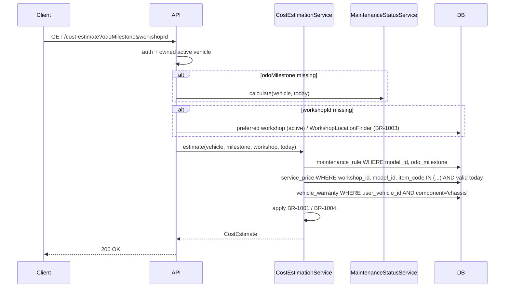

# API Technical Specification — Dự toán chi phí bảo dưỡng

> Backend cho Feature `FEAT-COST-001` — PRD F5 (US-045 → US-048).
>
> **Nguồn nghiệp vụ:** [Functional Spec](../feature-functional/us-045-sprint-2-spec.ff.md) là chuẩn; API **không** định nghĩa lại nghiệp vụ, chỉ trỏ `BR-10xx` / `EF-10xx` / `EDGE-10xx`.
>
> **Entity:** chỉ đọc — [Entity Spec](../entity/us-045-sprint-2-spec.entity.md). Không tạo bảng mới.
>
> **Dùng chung:** `CostEstimationService.estimate(...)` là service duy nhất; API dưới đây và tool `estimate_maintenance_cost` (AI-003 TOOL-301) đều gọi nó (FF US-048, BR-1006).

---

# 0. Document Information

| Field | Value |
|---|---|
| Document ID | `API-SPEC-COST-001` |
| Feature | `FEAT-COST-001` — F5 |
| Version | `v1.0` |
| Status | `Draft` |
| Owner | Backend Team |
| Author | Team 4 Người |
| Base URL | `/api/v1` |
| Auth | Firebase ID token (Bearer) |
| Created Date | `2026-09-30` |
| Updated Date | `2026-09-30` |
| Related Functional Spec | [us-045-sprint-2-spec.ff.md](../feature-functional/us-045-sprint-2-spec.ff.md) |
| Related Frontend Spec | [us-045-sprint-2-spec.fe.md](../frontend/us-045-sprint-2-spec.fe.md) |
| Related Agent Spec | [AI-003](../../ai-agent/ai-003-sprint-2-spec.agent.md) |

---

# 1. Overview

## 1.1 API Group

| API ID | Method | Endpoint / Trigger | Mục đích | FF |
|---|---|---|---|---|
| `API-EST-01` | `GET` | `/api/v1/user-vehicles/{userVehicleId}/maintenance-milestones` | Danh sách mốc có định mức cho model của xe (bộ chọn mốc) | UC-1002, BR-1002 |
| `API-EST-02` | `GET` | `/api/v1/user-vehicles/{userVehicleId}/cost-estimate` | Dự toán một mốc tại một xưởng | UC-1001, UC-1002, BR-1001 → BR-1009 |
| `API-EST-03` | `GET` | `/api/v1/user-vehicles/{userVehicleId}/cost-estimate/compare` | Dự toán cùng mốc tại tối đa 3 xưởng `[Đề xuất — Q-1003]` | UC-1003 |
| `TOOL-301` | Agent tool | `estimate_maintenance_cost(model_id, odo_milestone, workshop_id)` | Như API-EST-02, gọi trong phiên chat | AF-1003 |

> Chọn xưởng trên UI dùng lại [us-029 `API-BK-01`](../../sprint-3/api/us-029-sprint-3-spec.api.md) (`GET /api/v1/workshops/nearby`). Nếu F5 lên trước F6, backend triển khai `API-BK-01` ở mức tối thiểu (không có `availability`).

## 1.2 Scope

**In Scope** — đọc định mức, bảng giá, bảo hành; tính dự toán tất định.

**Out of Scope** — tạo báo giá (F5b); quản lý bảng giá (Q-1005); lưu dự toán (FF BR-1007).

---

# 2. Authentication & Authorization

## 2.1 Authentication

```http
Authorization: Bearer <firebase_id_token>
```

Verify bằng Firebase Admin SDK; suy ra `vehicle_user` theo `firebase_uid`.

## 2.2 Allowed Roles

| Role | Access |
|---|---|
| `VEHICLE_USER` (chủ xe `active`) | ✅ Allowed — chỉ xe của mình |
| `WORKSHOP_OWNER` | ❌ Denied |
| `ANONYMOUS` | ❌ Denied |

## 2.3 Authorization Rules

- Dependency `require_active_user` + `get_owned_active_vehicle` (như [us-017 API-VEH-003](us-017-sprint-2-spec.api.md)).
- Xe không thuộc user / chưa `verified` / `link_status ≠ active` ⇒ `404 VEHICLE_NOT_FOUND` (không lộ tồn tại — FF BR-1008, AC-1005).

---

# 3. API-EST-01 — `GET /api/v1/user-vehicles/{userVehicleId}/maintenance-milestones`

## 3.1 Purpose

Trả các mốc có định mức cho model của xe, kèm đánh dấu mốc tiếp theo (F3), để FE dựng bộ chọn mốc (SCR-1002) và để Agent liệt kê mốc hợp lệ (FF BR-1002).

## 3.2 Internal Processing

```text
1. Auth → vehicle_user; load user_vehicle (owned, active) → model_id.
2. SELECT DISTINCT odo_milestone, month_milestone, COUNT(*) AS item_count
     FROM maintenance_rule WHERE model_id = :model_id
    GROUP BY odo_milestone, month_milestone ORDER BY odo_milestone.
3. next = MaintenanceStatusService.calculate(vehicle, today).nextMilestone?.odoMilestone (có thể null).
4. Trả danh sách; isNext = (odo_milestone == next).
```

## 3.3 Success Response `200 OK`

```json
{
  "data": {
    "modelId": "VF6",
    "nextOdoMilestone": 12000,
    "milestones": [
      { "odoMilestone": 12000, "monthMilestone": 12, "itemCount": 5, "isNext": true },
      { "odoMilestone": 24000, "monthMilestone": 24, "itemCount": 7, "isNext": false }
    ]
  }
}
```

`milestones = []` khi model chưa có định mức ⇒ FE hiển thị trạng thái `NO_RULE` (FF EDGE-1001). **Không** trả lỗi.

---

# 4. API-EST-02 — `GET /api/v1/user-vehicles/{userVehicleId}/cost-estimate`

## 4.1 Purpose

Tính dự toán một mốc tại một xưởng theo FF BR-1001. Chỉ đọc, không ghi DB (FF BR-1007).

## 4.2 Query Parameters

| Field | Type | Required | Description | Constraints |
|---|---|---:|---|---|
| `userVehicleId` (path) | `uuid` | Yes | Xe | Thuộc user, active |
| `odoMilestone` | `integer` | No | Mốc; bỏ trống ⇒ mốc tiếp theo (F3) | Phải có trong `maintenance_rule` của model (BR-1002) |
| `workshopId` | `uuid` | No | Xưởng; bỏ trống ⇒ xưởng mặc định (BR-1003) | `workshop.status = active` |

## 4.3 Validation

| Validation | Rule | Error |
|---|---|---|
| Xe thuộc user | BR-1008 | `404 VEHICLE_NOT_FOUND` |
| Mốc tồn tại | `EXISTS maintenance_rule(model_id, odo_milestone)` | `422 MILESTONE_NOT_FOUND` + `details.validMilestones[]` |
| Không có mốc tiếp theo và không truyền `odoMilestone` | F3 `UNKNOWN` | `422 MILESTONE_REQUIRED` + `details.validMilestones[]` |
| Model không có định mức | BR-1009 | `200` với `status = NO_RULE` (không phải lỗi) |
| Xưởng active | `workshop.status = active` | `404 WORKSHOP_NOT_FOUND` (EF-1002) |
| Không xác định được xưởng mặc định | BR-1003 | `422 WORKSHOP_REQUIRED` (EDGE-1005) |

## 4.4 Internal Processing — `CostEstimationService.estimate(vehicle, odo_milestone, workshop, today)`



**Truy vấn giá hiệu lực (BR-1004):**

```sql
SELECT DISTINCT ON (item_code) item_code, price
  FROM service_price
 WHERE workshop_id = :ws AND model_id = :model AND item_code = ANY(:codes)
   AND (valid_from IS NULL OR valid_from <= :today)
   AND (valid_to   IS NULL OR valid_to   >= :today)
 ORDER BY item_code, valid_from DESC NULLS LAST;   -- chồng lấn ⇒ lấy dòng mới nhất + log WARN
```

**Bảo hành (FF AF-1004, Q-1001):** `under_warranty = NOT EXISTS vehicle_warranty(component='chassis') OR chassis.end_date >= today`. Khi `under_warranty = false`: `covered = false` cho mọi dòng; `warrantyStatus = EXPIRED`.

**Tổng:** `chargeableTotal = Σ price WHERE covered = false`, tính bằng `Decimal`, không làm tròn ở backend.

## 4.5 Success Response `200 OK`

```json
{
  "data": {
    "status": "READY",
    "userVehicleId": "b2c3d4e5-0000-4000-8000-000000000001",
    "modelId": "VF6",
    "milestone": { "odoMilestone": 12000, "monthMilestone": 12, "isNext": true },
    "workshop": { "workshopId": "3f1e2d3c-4b5a-6978-8a9b-0c1d2e3f4a5b", "name": "VinFast Smart City", "selectedBy": "PREFERRED" },
    "warrantyStatus": "ACTIVE",
    "items": [
      { "maintenanceRuleId": "…01", "itemCode": "BATTERY_CHECK", "itemName": "Kiểm tra pin cao áp", "covered": true, "price": 0, "priceSource": null },
      { "maintenanceRuleId": "…02", "itemCode": "BRAKE_INSPECTION", "itemName": "Kiểm tra hệ thống phanh", "covered": false, "price": 300000, "priceSource": "WORKSHOP_PRICE" },
      { "maintenanceRuleId": "…03", "itemCode": "CABIN_FILTER_REPLACE", "itemName": "Thay lọc gió điều hoà", "covered": false, "price": 450000, "priceSource": "WORKSHOP_PRICE" },
      { "maintenanceRuleId": "…04", "itemCode": "COOLANT_CHECK", "itemName": "Kiểm tra nước làm mát", "covered": false, "price": 200000, "priceSource": "WORKSHOP_PRICE" },
      { "maintenanceRuleId": "…05", "itemCode": "BRAKE_FLUID_REPLACE", "itemName": "Thay dầu phanh", "covered": false, "price": 350000, "priceSource": "REFERENCE_PRICE" }
    ],
    "coveredCount": 1,
    "chargeableTotal": 1300000,
    "hasReferencePrice": true,
    "currency": "VND",
    "estimateLabel": "Chi phí ước tính",
    "computedAt": "2026-09-30T03:45:00Z"
  }
}
```

**Model/mốc chưa có định mức (BR-1009):**

```json
{ "data": { "status": "NO_RULE", "modelId": "VF3", "milestone": null, "items": [], "chargeableTotal": null, "estimateLabel": "Chi phí ước tính" } }
```

## 4.6 Response Fields

| Field | Type | Nullable | Description |
|---|---|---:|---|
| `status` | `string` | No | `READY` / `NO_RULE` |
| `workshop.selectedBy` | `string` | No | `REQUEST` / `PREFERRED` / `NEAREST` (FF AF-1002 — FE phải nói rõ khi `NEAREST`) |
| `warrantyStatus` | `string` | No | `ACTIVE` / `EXPIRED` / `UNKNOWN` (không có dữ liệu bảo hành) |
| `items[].covered` | `boolean` | No | Miễn phí theo bảo hành tại ngày tính |
| `items[].price` | `number` | No | VNĐ; `0` khi `covered = true` |
| `items[].priceSource` | `string` | Yes | `WORKSHOP_PRICE` / `REFERENCE_PRICE`; `null` khi `covered` |
| `chargeableTotal` | `number` | Yes | Σ price mục không covered; `null` khi `NO_RULE` |
| `hasReferencePrice` | `boolean` | No | Có ít nhất một mục giá tham khảo ⇒ FE hiện chú thích `*` |
| `estimateLabel` | `string` | No | Luôn `"Chi phí ước tính"` (BR-1005) |
| `computedAt` | `datetime` | No | UTC |

---

# 5. API-EST-03 — `GET /api/v1/user-vehicles/{userVehicleId}/cost-estimate/compare` `[Đề xuất — Q-1003]`

| Field | Type | Required | Constraints |
|---|---|---:|---|
| `odoMilestone` | `integer` | No | Như API-EST-02 |
| `workshopIds` | `uuid[]` (lặp query) | Yes | 2–3 xưởng `active`, không trùng |

Trả `data.estimates[]` — mỗi phần tử có cấu trúc `data` của API-EST-02 — sắp theo `chargeableTotal` tăng dần (xưởng lỗi/không active trả `{ workshopId, error: { code } }` thay vì làm hỏng cả response). Quá 3 xưởng ⇒ `400 INVALID_REQUEST`.

---

# 6. Error Handling

## 6.1 Standard Error Format

```json
{ "error": { "code": "MILESTONE_NOT_FOUND", "message": "Mốc bảo dưỡng không có trong định mức của xe.", "details": { "validMilestones": [12000, 24000] }, "traceId": "abc-123" } }
```

## 6.2 Error Cases

| Case | Error Code | HTTP | Ref |
|---|---|---:|---|
| Query sai kiểu | `INVALID_REQUEST` | `400` | |
| Chưa xác thực | `UNAUTHORIZED` | `401` | |
| Tài khoản chưa `active` | `FORBIDDEN` | `403` | |
| Xe không thuộc user | `VEHICLE_NOT_FOUND` | `404` | BR-1008 |
| Xưởng không tồn tại / không active | `WORKSHOP_NOT_FOUND` | `404` | EF-1002 |
| Mốc không có trong định mức | `MILESTONE_NOT_FOUND` | `422` | BR-1002, EDGE-1007 |
| Cần chọn mốc (F3 `UNKNOWN`) | `MILESTONE_REQUIRED` | `422` | AF-1001 |
| Không xác định được xưởng | `WORKSHOP_REQUIRED` | `422` | EDGE-1005 |
| DB timeout | `SERVICE_UNAVAILABLE` | `503` | EF-1001 |
| Lỗi hệ thống | `INTERNAL_SERVER_ERROR` | `500` | |

---

# 7. Database / Entity Interaction

| Entity / Table | Operation | Purpose |
|---|---|---|
| `user_vehicle` (ENT-003) | Read | Sở hữu, `external_model_id` |
| `maintenance_rule` (ENT-401) | Read | Hạng mục mốc, cờ bảo hành, giá tham khảo |
| `service_price` (ENT-409) | Read | Giá xưởng hiệu lực |
| `workshop` (ENT-008) | Read | Trạng thái, xưởng ưa thích |
| `vehicle_warranty` (ENT-004) | Read | Bảo hành (`chassis`) |
| `vehicle_user`, `user_location` | Read | Xưởng mặc định (BR-1003) |

Không có write. Không cần transaction.

---

# 8. Tool Contract — `estimate_maintenance_cost` (TOOL-301)

| Item | Value |
|---|---|
| Input | `model_id` (từ vehicle context, không lấy từ tin nhắn), `odo_milestone`, `workshop_id` |
| Output | `items[]` (`item_code`, `item_name`, `is_covered_by_warranty` = `covered`, `price`, `price_source`, `maintenance_rule_id`), `chargeable_total`, `covered_count`, `currency`, `computed_at`, `status` |
| Service | `CostEstimationService.estimate(...)` — cùng hàm với API-EST-02 |
| Lưu kết quả | Orchestrator ghi vào `chat_message.meta.estimate` của tin trợ lý (us-025) để F5b (`create_draft_quote`) dùng lại nguyên văn |
| Lỗi | Như §6; tool trả `error.code`, Agent xử lý theo AI-003 §10.3 |

---

# 9. Observability

- Log `estimate.computed` với `trace_id`, `user_vehicle_id`, `workshop_id`, `odo_milestone`, `status`, `item_count`, `has_reference_price`, `duration_ms`. Không log giá từng dòng.
- Log `WARN service_price.overlap` khi BR-1004 gặp dòng chồng lấn.
- Metric: `cost_estimate_requests_total{source=ui|agent,status}`, `cost_estimate_duration_ms`.

---

# 10. Performance Requirements

| API | Target |
|---|---|
| `API-EST-01`, `API-EST-02` (p90) | `< 500 ms` (PRD §8) |
| `API-EST-03` (p90) | `< 800 ms` |

Index cần: `maintenance_rule(model_id, odo_milestone)`; `service_price(workshop_id, model_id, item_code)` — đã có theo entity spec.

---

# 11. Idempotency / Concurrency

GET chỉ đọc — idempotent. Không có race condition. Giá có thể đổi giữa hai lần gọi; `computedAt` cho biết thời điểm tính.

---

# 12. Example

```http
GET /api/v1/user-vehicles/b2c3d4e5-0000-4000-8000-000000000001/cost-estimate?odoMilestone=12000&workshopId=3f1e2d3c-4b5a-6978-8a9b-0c1d2e3f4a5b
Authorization: Bearer <token>
```

→ `200` như §4.5.

---

# 13. Test Checklist

- [ ] Tổng = Σ mục không covered (AC-1001); mục covered không cộng.
- [ ] Mục thiếu giá xưởng ⇒ `REFERENCE_PRICE` (AC-1002); giá `valid_to` hôm qua bị bỏ qua (AC-1006).
- [ ] `NO_RULE` không có số (AC-1004).
- [ ] Xe người khác ⇒ `404` (AC-1005).
- [ ] `chassis.end_date < today` ⇒ mọi mục tính phí, `warrantyStatus = EXPIRED`.
- [ ] TOOL-301 và API-EST-02 trả cùng `chargeable_total` cho cùng đầu vào.

---

# 14. Change Log

| Version | Date | Author | Change |
|---|---|---|---|
| `v1.0` | `2026-09-30` | Team 4 Người | Bản đầu |

---

# 15. Open Questions

| ID | Question | Status |
|---|---|---|
| `Q-1001` → `Q-1005` | Xem [FF §24](../feature-functional/us-045-sprint-2-spec.ff.md#24-open-questions) | Open |
| `Q-1006` | `API-EST-02` có nên nhận `date` để tính theo giá tương lai (ngày hẹn) thay vì hôm nay? | Open — `[Đề xuất]` MVP dùng hôm nay |

---

# 16. References

- [FF us-045](../feature-functional/us-045-sprint-2-spec.ff.md) · [FE us-045](../frontend/us-045-sprint-2-spec.fe.md) · [Entity us-045](../entity/us-045-sprint-2-spec.entity.md)
- [AI-003](../../ai-agent/ai-003-sprint-2-spec.agent.md) · [us-017 API](us-017-sprint-2-spec.api.md) · [us-029 API](../../sprint-3/api/us-029-sprint-3-spec.api.md)
