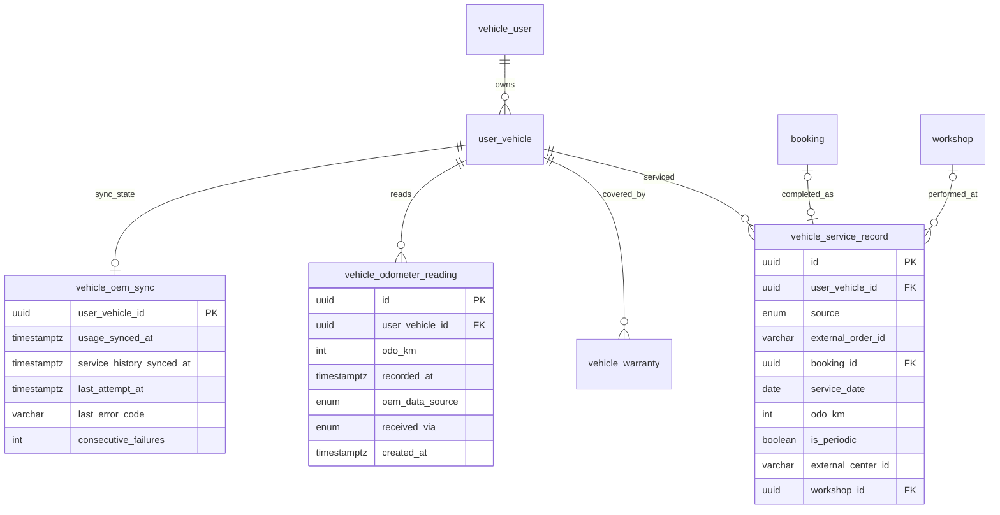

# Entity Specification — Hồ sơ xe & Trạng thái đến hạn bảo dưỡng

> Đặc tả dữ liệu cho Feature `FEAT-VEH-001` (PRD F3, US-017 → US-020).
>
> **Nguồn nghiệp vụ:** [Functional Spec](../feature-functional/us-017-sprint-2-spec.ff.md) · **API:** [API Spec](../api/us-017-sprint-2-spec.api.md) · **Tổng quan lược đồ:** [core.entity.md](../../entity/core.entity.md)
>
> Quy ước theo [core.entity.md §14.0](../../entity/core.entity.md#140-quy-ước-chung). Entity mới dùng dải `ENT-4xx`, business rule dùng dải `BR-ENT-4xx`.

---

# 0. Document Information

| Field | Value |
| --- | --- |
| Document ID | `ENT-SPEC-VEH-001` |
| Feature | `FEAT-VEH-001` |
| Version | `v1.1` |
| Status | `Draft` |
| Owner | Backend Team |
| Created Date | `2026-09-28` |
| Updated Date | `2026-09-28` |

## 0.1 Entity Catalog

| Entity ID | Entity | Table | Trạng thái | Dùng trong F3 |
| --- | --- | --- | --- | --- |
| `ENT-003` | `UserVehicle` | `user_vehicle` | Có sẵn — **không đổi** | Hồ sơ xe, `external_model_id`, `external_vehicle_id`, `manufacture_date` |
| `ENT-004` | `VehicleWarranty` | `vehicle_warranty` | Có sẵn — **không đổi** | Bảo hành; `start_date` sớm nhất = ngày mua |
| `ENT-401` | `MaintenanceRule` | `maintenance_rule` | Có sẵn — **không đổi** | Định mức |
| `ENT-402` | `Booking` | `booking` | Có sẵn — **không đổi** | Được ENT-415 tham chiếu (nguồn `ev_care`) |
| **`ENT-414`** | `VehicleOdometerReading` | `vehicle_odometer_reading` | **Mới** | ODO đồng bộ từ hãng |
| **`ENT-415`** | `VehicleServiceRecord` | `vehicle_service_record` | **Mới** | Lịch sử bảo dưỡng: đồng bộ từ hãng + hoàn tất qua EV Care |
| **`ENT-416`** | `VehicleOemSync` | `vehicle_oem_sync` | **Mới** | Trạng thái đồng bộ dữ liệu hãng theo xe |
| `RM-401` | `MaintenanceDueStatus` | — (không lưu) | **Read model mới** | Kết quả tính trạng thái đến hạn |

### Vì sao cần lưu dữ liệu hãng ở EV Care

- **Nguồn dữ liệu:** ODO do hãng thu thập từ xe; lịch sử bảo dưỡng do hãng ghi nhận. Chủ xe **không** nhập hai loại dữ liệu này (FF BR-003).
- **Cách nhận:** job đồng bộ định kỳ, webhook của hãng, đồng bộ ban đầu sau xác thực (FF BR-011). Màn hình và AI Agent **chỉ đọc bản đã lưu**, không gọi hãng lúc xem ⇒ nhanh và không lỗi khi hãng lỗi.
- **Không thêm cột vào bảng core** (`user_vehicle`) vì core §21 yêu cầu thay đổi mới nằm ở bảng mới, và vì ODO là chuỗi giá trị theo thời gian (cần lịch sử để đảm bảo ODO không giảm — FF BR-004).

### Vì sao trạng thái đến hạn không lưu

Trạng thái phụ thuộc **ngày hiện tại**; tính khi đọc (1 xe, vài chục dòng định mức) luôn đúng và không cần job cập nhật. Job nhắc F7 gọi cùng service.

## 0.2 ER Diagram



`maintenance_rule` ghép với `user_vehicle` bằng logic `maintenance_rule.model_id = user_vehicle.external_model_id`, không có FK (ENT-401 §6).

---

# ENT-414 — VehicleOdometerReading

## 1. Entity Information

| Field | Value |
| --- | --- |
| Entity ID | `ENT-414` |
| Entity Name | `VehicleOdometerReading` |
| Business Name | Lịch sử ODO của xe (từ hãng) |
| Table | `vehicle_odometer_reading` |
| Domain | Vehicle |
| Version | `v1.1` |
| Status | `Draft` |
| Owner | Backend Team |

## 2. Entity Overview

Mỗi dòng là **một số ODO hãng đã ghi nhận** cho xe (snapshot `VehicleUsage` của hãng), kèm thời điểm hãng đo. Append-only: chỉ thêm, không sửa, không xoá dòng.

**Business Purpose:** xác định ODO hiện tại (FF BR-004), hiển thị thời điểm hãng cập nhật (FF BR-009), phát hiện bất thường khi hãng gửi số nhỏ hơn.

**Out of Scope:** ODO do chủ xe nhập (không có trong sản phẩm); SOH pin.

## 3. Business Meaning

"Hãng ghi nhận xe V có ODO `odo_km` km tại thời điểm `recorded_at`."

| `odo_km` | `recorded_at` | `received_via` | Ý nghĩa |
| ---: | --- | --- | --- |
| 11600 | 2026-09-28T01:00:00Z | `poll` | Job định kỳ lấy về |
| 12300 | 2026-09-28T03:10:00Z | `webhook` | Hãng báo qua webhook |
| 12100 | 2026-09-28T05:00:00Z | `poll` | Hãng trả số nhỏ hơn — vẫn lưu, ODO hiện tại vẫn 12.300 |

## 4. Identity & Keys

| Field / Composite | Unique | Description |
| --- | ---: | --- |
| `id` | PK | `uuid4` |
| (`user_vehicle_id`, `recorded_at`) | Yes | `ux_odometer_vehicle_recorded_at` — không lưu trùng một snapshot của hãng |

## 5. Attributes

| Tên trường (Field) | Kiểu dữ liệu (Data Type) | Required | Nullable | Default | Ràng buộc (Constraints) | Mô tả (Description) |
| --- | --- | ---: | ---: | --- | --- | --- |
| `id` | `uuid` | Yes | No | `uuid4` | PK | ID bản ghi |
| `user_vehicle_id` | `uuid` | Yes | No | - | FK → `user_vehicle.id` `ON DELETE CASCADE` | Xe |
| `odo_km` | `integer` | Yes | No | - | `0..999999` | ODO hãng ghi nhận (`VehicleUsage.current_km`) |
| `recorded_at` | `timestamptz` | Yes | No | - | | Thời điểm hãng đo (`VehicleUsage.last_updated_at`) |
| `oem_data_source` | `oem_usage_source_enum` | Yes | No | - | `telematics / manual` | Cách **hãng** thu thập số này (`manual` = hãng/đại lý ghi, **không** phải chủ xe nhập trên EV Care) |
| `received_via` | `oem_sync_trigger_enum` | Yes | No | - | `poll / webhook / initial` | Cơ chế EV Care nhận về |
| `created_at` | `timestamptz` | Yes | No | `now()` | | Thời điểm EV Care lưu |

## 9. Business Rules & Constraints

### BR-ENT-430 — ODO hiện tại là giá trị lớn nhất

**Rule:** ODO hiện tại = `MAX(odo_km)` của xe; nhiều dòng cùng giá trị lớn nhất ⇒ lấy `recorded_at` muộn nhất để hiển thị. Không có dòng nào ⇒ xe **không có ODO** (FF EDGE-301).

### BR-ENT-431 — Chỉ lưu snapshot mới

**Rule:** Khi đồng bộ, chỉ `INSERT` nếu `recorded_at` của hãng **mới hơn** `recorded_at` lớn nhất đã lưu cho xe. Ghi trùng do chạy đồng thời ⇒ `ON CONFLICT DO NOTHING`.

### BR-ENT-432 — Số giảm là bất thường

**Rule:** Snapshot mới có `odo_km` nhỏ hơn ODO hiện tại ⇒ vẫn lưu, log cảnh báo `odometer_decrease` (kèm `user_vehicle_id`, hai giá trị), tăng metric; không ảnh hưởng ODO hiện tại (BR-ENT-430).

## 10. Data Integrity

```sql
CHECK (odo_km BETWEEN 0 AND 999999)
UNIQUE (user_vehicle_id, recorded_at)
```

## 11. Index & Query Requirements

| Query | Fields | Frequency | Required Index |
| --- | --- | --- | --- |
| ODO hiện tại | `user_vehicle_id`, `odo_km DESC`, `recorded_at DESC` | Cao | `ix_odometer_vehicle_odo` |
| Snapshot mới nhất (so sánh khi đồng bộ) | `user_vehicle_id`, `recorded_at DESC` | Mỗi lần đồng bộ | Unique index ở §4 |

```sql
SELECT odo_km, recorded_at
FROM vehicle_odometer_reading
WHERE user_vehicle_id = :user_vehicle_id
ORDER BY odo_km DESC, recorded_at DESC
LIMIT 1;
```

## 12. Ownership & Authorization

| Actor / Role | Read | Create | Update | Delete |
| --- | ---: | ---: | ---: | ---: |
| Chủ xe | ✅ (qua API, xe của mình) | ❌ | ❌ | ❌ |
| Job đồng bộ | ✅ | ✅ | ❌ | ❌ |
| AI Agent | ✅ (qua service) | ❌ | ❌ | ❌ |

## 14. Data Source

| Data | Source System | Sync Type |
| --- | --- | --- |
| Toàn bộ bảng | Hãng — `GET /vehicles/{vehicle_id}/usage` | Poll 120 phút + webhook + initial |

**Source of Truth:** hãng. EV Care chỉ giữ bản sao có lịch sử.

## 16. Retention & Deletion

Giữ suốt vòng đời `user_vehicle`; cascade khi `user_vehicle` bị xoá. Gỡ liên kết không xoá lịch sử. `[Đề xuất]` sau này có thể gộp bớt snapshot cũ (giữ 1 dòng/ngày sau 90 ngày) — không làm trong MVP.

---

# ENT-415 — VehicleServiceRecord

## 1. Entity Information

| Field | Value |
| --- | --- |
| Entity ID | `ENT-415` |
| Entity Name | `VehicleServiceRecord` |
| Business Name | Lịch sử bảo dưỡng của xe |
| Table | `vehicle_service_record` |
| Domain | Vehicle |
| Version | `v1.0` |
| Status | `Draft` |
| Owner | Backend Team |

## 2. Entity Overview

Mỗi dòng là **một lần bảo dưỡng** của xe, từ một trong hai nguồn:

- `oem` — bản sao `ServiceHistory` của hãng, đồng bộ về.
- `ev_care` — booking hoàn tất qua Workshop Board (F8, S3).

**Business Purpose:** xác định mốc gốc (FF BR-005) để tính mốc tiếp theo; hiển thị lần bảo dưỡng gần nhất trên hồ sơ xe.

**Out of Scope:** chi tiết hạng mục đã làm ở mức tính toán (chỉ lưu thô để hiển thị); chi phí thực tế (thuộc `booking.actual_cost` với nguồn `ev_care`).

## 3. Business Meaning

"Xe V được bảo dưỡng ngày `service_date` tại `odo_km` km, theo nguồn `source`."

## 4. Identity & Keys

| Field / Composite | Unique | Description |
| --- | ---: | --- |
| `id` | PK | `uuid4` |
| (`user_vehicle_id`, `external_order_id`) WHERE `source = 'oem'` | Yes | `ux_service_record_oem_order` — upsert khi đồng bộ |
| `booking_id` WHERE `source = 'ev_care'` | Yes | `ux_service_record_booking` — mỗi booking một bản ghi |

## 5. Attributes

| Tên trường (Field) | Kiểu dữ liệu (Data Type) | Required | Nullable | Default | Ràng buộc (Constraints) | Mô tả (Description) |
| --- | --- | ---: | ---: | --- | --- | --- |
| `id` | `uuid` | Yes | No | `uuid4` | PK | |
| `user_vehicle_id` | `uuid` | Yes | No | - | FK → `user_vehicle.id` `ON DELETE CASCADE` | Xe |
| `source` | `service_record_source_enum` | Yes | No | - | `oem / ev_care` | Nguồn |
| `external_order_id` | `varchar(64)` | No | Yes | - | Bắt buộc khi `oem` | `ServiceHistory.order_id` của hãng |
| `is_periodic` | `boolean` | Yes | No | `true` | | Bảo dưỡng định kỳ (`true`) hay sửa chữa ngoài định kỳ (`false`). `oem`: từ `ServiceHistory.is_periodic` của hãng (thiếu ⇒ `true`); `ev_care`: luôn `true`. Chỉ `true` được làm mốc gốc (Q-304) |
| `booking_id` | `uuid` | No | Yes | - | FK → `booking.id` `ON DELETE SET NULL`; bắt buộc khi `ev_care` (lúc tạo) | Booking hoàn tất |
| `service_date` | `date` | Yes | No | - | | Ngày bảo dưỡng |
| `odo_km` | `integer` | No | Yes | - | `0..999999` | Km lúc bảo dưỡng (`km_at_service`); `ev_care`: ODO hiện tại lúc hoàn tất, có thể null nếu hãng chưa có ODO |
| `external_center_id` | `varchar(64)` | No | Yes | - | | `service_center_id` của hãng |
| `workshop_id` | `uuid` | No | Yes | - | FK → `workshop.id` `ON DELETE SET NULL` | Xưởng EV Care (map từ `external_center_id` nếu có) |
| `items_done` | `text` | No | Yes | - | ≤ 2000 ký tự | Hạng mục đã làm — chuỗi mô tả của hãng (`ServiceHistory.items_done`), chỉ để hiển thị |
| `synced_at` | `timestamptz` | No | Yes | - | | Lần đồng bộ gần nhất (chỉ `oem`) |
| `created_at` | `timestamptz` | Yes | No | `now()` | | |
| `updated_at` | `timestamptz` | Yes | No | `now()` | | |

## 9. Business Rules & Constraints

### BR-ENT-433 — Upsert theo mã đơn của hãng

**Rule:** Đồng bộ `oem` là upsert theo (`user_vehicle_id`, `external_order_id`): chưa có ⇒ insert; đã có ⇒ cập nhật `service_date`, `odo_km`, `items_done`, `is_periodic`, `synced_at` nếu khác. **EV Care không bao giờ xoá** bản ghi `oem` và không cần phát hiện bản ghi hãng đã xoá/đổi mã: chỉ có insert và update (Q-311). Hãng đổi `order_id` ⇒ coi là bản ghi mới; bản cũ giữ nguyên, hai bản cùng ngày không đổi kết quả (BR-ENT-434).

### BR-ENT-434 — Lần bảo dưỡng gần nhất

**Rule:** Mốc gốc = bản ghi **định kỳ** (`is_periodic = true`) có `service_date` lớn nhất (không phân biệt nguồn); cùng ngày ⇒ lấy `odo_km` lớn hơn. Bản ghi `oem` và `ev_care` của cùng một lần bảo dưỡng có thể cùng tồn tại — không ảnh hưởng kết quả (FF EDGE-314).

### BR-ENT-435 — Bản ghi `ev_care` do F8 ghi

**Rule:** Tạo trong cùng transaction chuyển `booking.status → completed`; `service_date = booking_date`, `odo_km` = ODO hiện tại (BR-ENT-430) tại thời điểm hoàn tất. F3 chỉ đọc.

## 10. Data Integrity

```sql
CHECK (odo_km IS NULL OR odo_km BETWEEN 0 AND 999999)
CHECK (source <> 'oem'     OR external_order_id IS NOT NULL)
CHECK (source =  'oem'     OR external_order_id IS NULL)
CHECK (source =  'ev_care' OR booking_id IS NULL)
```

- Unique partial ở §4. `booking_id` bắt buộc khi tạo `ev_care`: kiểm tra ở service (FK có `ON DELETE SET NULL` nên không đặt CHECK NOT NULL).

## 11. Index & Query Requirements

| Query | Fields | Frequency | Required Index |
| --- | --- | --- | --- |
| Lần bảo dưỡng gần nhất | `user_vehicle_id`, `service_date DESC`, `odo_km DESC` | Cao | `ix_service_record_vehicle_date` |
| Upsert khi đồng bộ | `user_vehicle_id`, `external_order_id` | Mỗi lần đồng bộ | Unique partial §4 |

## 12. Ownership & Authorization

| Actor / Role | Read | Create | Update | Delete |
| --- | ---: | ---: | ---: | ---: |
| Chủ xe | ✅ (qua API, xe của mình) | ❌ | ❌ | ❌ |
| Chủ xưởng | ❌ trong F3 | ✅ gián tiếp (hoàn tất booking F8) | ❌ | ❌ |
| Job đồng bộ | ✅ | ✅ (`oem`) | ✅ (`oem`) | ❌ |

## 14. Data Source

| Data | Source System | Sync Type |
| --- | --- | --- |
| `source = oem` | Hãng — `GET /vehicles/{vehicle_id}/service-history` | Poll 120 phút + webhook + initial |
| `source = ev_care` | EV Care — F8 | Real-time |

## 16. Retention & Deletion

Giữ suốt vòng đời `user_vehicle`; cascade khi xoá xe.

---

# ENT-416 — VehicleOemSync

## 1. Entity Information

| Field | Value |
| --- | --- |
| Entity ID | `ENT-416` |
| Entity Name | `VehicleOemSync` |
| Business Name | Trạng thái đồng bộ dữ liệu hãng |
| Table | `vehicle_oem_sync` |
| Domain | Vehicle |
| Version | `v1.0` |
| Status | `Draft` |
| Owner | Backend Team |

## 2. Entity Overview

Một dòng / xe, ghi lần đồng bộ thành công và lỗi gần nhất.

**Business Purpose:**

- Phân biệt "chưa đồng bộ lần nào" với "đã đồng bộ nhưng hãng không có lịch sử" ⇒ không hiển thị trạng thái sai ngay sau onboarding (FF AF-005, AC-011).
- Chọn xe cần đồng bộ ở job định kỳ; theo dõi lỗi liên tiếp để cảnh báo vận hành (FF EF-001).

Không dùng `user_vehicle.oem_synced_at` vì cột đó ghi lần đồng bộ **thông tin xe** lúc xác thực (ENT-003), không phải ODO/lịch sử bảo dưỡng.

## 5. Attributes

| Tên trường (Field) | Kiểu dữ liệu (Data Type) | Required | Nullable | Default | Ràng buộc (Constraints) | Mô tả (Description) |
| --- | --- | ---: | ---: | --- | --- | --- |
| `user_vehicle_id` | `uuid` | Yes | No | - | PK, FK → `user_vehicle.id` `ON DELETE CASCADE` | Xe |
| `usage_synced_at` | `timestamptz` | No | Yes | - | | Lần đọc ODO từ hãng thành công gần nhất (kể cả khi hãng trả "không có dữ liệu") |
| `service_history_synced_at` | `timestamptz` | No | Yes | - | | Lần đọc lịch sử bảo dưỡng thành công gần nhất |
| `last_attempt_at` | `timestamptz` | No | Yes | - | | Lần thử gần nhất |
| `last_trigger` | `oem_sync_trigger_enum` | No | Yes | - | `poll / webhook / initial` | Nguồn kích hoạt lần thử gần nhất |
| `last_error_code` | `varchar(64)` | No | Yes | - | | `OEM_TIMEOUT`, `OEM_5XX`, `OEM_VEHICLE_NOT_FOUND`…; `null` khi thành công |
| `consecutive_failures` | `integer` | Yes | No | `0` | `>= 0` | Reset về 0 khi thành công |
| `created_at` | `timestamptz` | Yes | No | `now()` | | |
| `updated_at` | `timestamptz` | Yes | No | `now()` | | |

## 9. Business Rules & Constraints

### BR-ENT-436 — Đã sẵn sàng để tính

**Rule:** Xe **đủ dữ liệu để tính trạng thái** khi `service_history_synced_at IS NOT NULL` **hoặc** xe đã có ít nhất một `vehicle_service_record`. Ngược lại RM-401 trả `unknown` với lý do `oem_data_not_synced`.

### BR-ENT-437 — Cảnh báo lỗi liên tiếp

**Rule:** `consecutive_failures ≥ OEM_SYNC_ALERT_FAILURES` (mặc định 3, Q-312) ⇒ log mức `error` và tăng metric cảnh báo cho vận hành. Không thông báo cho chủ xe.

## 11. Index & Query Requirements

| Query | Fields | Frequency | Required Index |
| --- | --- | --- | --- |
| Theo xe | `user_vehicle_id` | Cao | PK |
| Xe lỗi liên tiếp (giám sát) | `consecutive_failures` | Thấp | Không cần |

## 16. Retention & Deletion

Cascade khi xoá `user_vehicle`.

---

# Enums mới

| Enum | Giá trị (DB) | Dùng ở |
| --- | --- | --- |
| `oem_usage_source_enum` | `telematics / manual` | ENT-414 — khớp `VehicleUsage.data_source` của hãng |
| `oem_sync_trigger_enum` | `poll / webhook / initial` | ENT-414, ENT-416 |
| `service_record_source_enum` | `oem / ev_care` | ENT-415 |

# Migration

1. Tạo 3 enum trên.
2. Tạo `vehicle_odometer_reading`, `vehicle_service_record`, `vehicle_oem_sync` với FK, CHECK, unique, index.
3. Model code: `backend/src/common/core/vehicle/{vehicle_odometer_reading,vehicle_service_record,vehicle_oem_sync}.py`, đăng ký trong `src.common.core`.
4. Không backfill: lần đồng bộ định kỳ đầu tiên sau deploy tạo dữ liệu cho các xe đã xác thực trước đó.

---

# RM-401 — MaintenanceDueStatus (read model, không lưu)

## 1. Description

Kết quả tính trạng thái đến hạn của một xe tại một thời điểm, do `MaintenanceStatusService` sinh ra. Dùng chung cho API-VEH-003, tool `get_maintenance_status` và job nhắc F7. **Chỉ đọc DB, không gọi hãng.**

## 2. Inputs

| Input | Nguồn |
| --- | --- |
| `model_id` | `user_vehicle.external_model_id` |
| Sẵn sàng | ENT-416 (BR-ENT-436) |
| ODO hiện tại | ENT-414 (BR-ENT-430) |
| Lần bảo dưỡng gần nhất | ENT-415 (BR-ENT-434) |
| Ngày mua | `MIN(vehicle_warranty.start_date)`, fallback `user_vehicle.manufacture_date` |
| Định mức | `maintenance_rule` WHERE `model_id` |
| Ngày hiện tại | Server, Asia/Ho_Chi_Minh |
| Cấu hình (`.env`, truyền vào service qua tham số; sau này có thể ghi đè theo xưởng / gói bảo hành) | `DUE_SOON_KM = 500`, `DUE_SOON_DAYS = 14`, `MAINTENANCE_RECURRING_KM = 12000`, `MAINTENANCE_RECURRING_MONTHS = 12`, `ODO_STALE_DAYS = 30` |

## 3. Attributes

| Field | Type | Nullable | Description |
| --- | --- | ---: | --- |
| `user_vehicle_id` | `uuid` | No | |
| `due_status` | `normal / due_soon / overdue / unknown` | No | FF BR-002 |
| `due_reason` | `km / time / both` | Yes | `null` khi `normal` / `unknown` |
| `calculation_basis` | `km_and_time / time_only` | Yes | `time_only` khi không có ODO |
| `unknown_reason` | `oem_data_not_synced / no_maintenance_rule` | Yes | Chỉ khi `unknown` |
| `next_milestone` | object | Yes | `odo_milestone`, `month_milestone`, `due_date`, `is_recurring`, `items[]` (`item_code`, `item_name`, `is_covered_by_warranty`) |
| `remaining_km` | `integer` | Yes | Âm khi đã vượt; `null` khi không có ODO |
| `remaining_days` | `integer` | Yes | Âm khi đã quá |
| `odometer` | object | Yes | `odo_km`, `recorded_at`, `is_stale` |
| `last_service` | object | Yes | Mốc gốc: `type` (`oem_service_record / ev_care_service_record / purchase_date`), `date`, `odo_km` |
| `oem_synced_at` | `timestamptz` | Yes | `vehicle_oem_sync.usage_synced_at` |
| `calculated_at` | `timestamptz` | No | |

## 4. Algorithm

```text
0. IF NOT ready (BR-ENT-436) -> due_status = unknown, unknown_reason = oem_data_not_synced, STOP

1. rules = maintenance_rule WHERE model_id = vehicle.external_model_id
   IF rules is empty -> due_status = unknown, unknown_reason = no_maintenance_rule, STOP

2. milestones = DISTINCT (odo_milestone, month_milestone) FROM rules ORDER BY odo_milestone
   purchase_date = MIN(vehicle_warranty.start_date) ?? vehicle.manufacture_date
   due_date(M) = add_months(purchase_date, M.month_milestone)   -- clamp to month end

3. last = vehicle_service_record WHERE is_periodic ORDER BY service_date DESC, odo_km DESC LIMIT 1
   IF last is null -> next = milestones[0]
   ELSE
     done = milestones WHERE (last.odo_km IS NOT NULL AND last.odo_km >= M.odo_milestone)
                          OR last.service_date >= due_date(M)     -- no early window (Q-302 deferred)
     IF done is empty                      -> next = milestones[0]
     ELSE IF max(done) != last milestone   -> next = milestone right after max(done)
     ELSE -> next = recurring milestone:
             odo   = max(done).odo_milestone   + RECURRING_KM      -- fixed step (Q-301, temporary)
             month = max(done).month_milestone + RECURRING_MONTHS
             items = items of milestones[0]; is_recurring = true
             (repeat while the recurring milestone is also done)

4. odo = effective ODO (BR-ENT-430) or null
   remaining_days = due_date(next) - today
   remaining_km   = next.odo_milestone - odo   (null if odo is null)

5. overdue_km   = remaining_km is not null AND remaining_km < 0
   overdue_time = remaining_days < 0
   soon_km      = remaining_km is not null AND remaining_km <= DUE_SOON_KM
   soon_time    = remaining_days <= DUE_SOON_DAYS
   IF overdue_km OR overdue_time -> overdue,  reason from (overdue_km, overdue_time)
   ELSE IF soon_km OR soon_time  -> due_soon, reason from (soon_km, soon_time)
   ELSE                          -> normal,   reason = null

6. odometer.is_stale = odo is not null AND today - odometer.recorded_at > ODO_STALE_DAYS
```

## 5. Worked Example (AC-001)

| Input | Giá trị |
| --- | --- |
| Model | VF6 — mốc đầu 12.000 km / 12 tháng |
| Ngày mua | 2025-10-15 |
| Lần bảo dưỡng gần nhất | Không có (đã đồng bộ lịch sử: rỗng) |
| ODO | 11.600 (hãng) |
| Hôm nay | 2026-09-28 |

`due_date = 2026-10-15`, `remaining_km = 400`, `remaining_days = 17` ⇒ `due_soon`, `due_reason = km`.

---

# Q. Open Questions

| ID | Question | Owner | Status |
| --- | --- | --- | --- |
| `Q-311` | Bản ghi `ServiceHistory` bị hãng xoá/sửa mã: EV Care có xoá theo không? | Backend | **Resolved** — không xoá; chỉ insert/update (BR-ENT-433), bỏ luôn việc phát hiện bản ghi hãng đã xoá |
| `Q-312` | Cách xử lý khi đồng bộ hãng lỗi liên tiếp | Backend | **Resolved** | Không dùng exponential backoff / circuit breaker vì chu kỳ cron dài (120 phút), lần thử sau đã là "backoff" tự nhiên. Chỉ ghi log mức `error` + tăng metric cho dev/vận hành khi lỗi ≥ `OEM_SYNC_ALERT_FAILURES` (mặc định 3) lần liên tiếp (BR-ENT-437) |

Câu hỏi nghiệp vụ khác: [FF §24](../feature-functional/us-017-sprint-2-spec.ff.md#24-open-questions).

---

# Change Log

| Version | Date | Author | Changes |
| --- | --- | --- | --- |
| `v1.0` | `2026-09-28` | Team 4 Người | ENT-414 (ODO hãng / nhập tay / sau dịch vụ), RM-401 |
| `v1.2` | `2026-09-28` | Team 4 Người | ENT-415 thêm `is_periodic` (Q-304); Q-311: không xoá bản ghi hãng; Q-312 chốt (chỉ log error + metric); Q-301 bước lặp cố định, bỏ cửa sổ làm sớm (Q-302 hoãn); poll 120 phút; ngưỡng RM-401 đọc từ `.env` |
| `v1.1` | `2026-09-28` | Team 4 Người | Bỏ ODO nhập tay: ENT-414 chỉ chứa ODO đồng bộ từ hãng (`oem_data_source`, `received_via`); thêm ENT-415 `vehicle_service_record` (thay cache lịch sử bảo dưỡng + nguồn `service` cũ), ENT-416 `vehicle_oem_sync`; RM-401 chỉ đọc DB, thêm `unknown_reason = oem_data_not_synced` |

---

# Approval

| Role | Name | Status | Date |
| --- | --- | --- | --- |
| Product / Business | Lê Đức Tùng | Pending | |
| Technical Owner | Tech Lead | Pending | |
