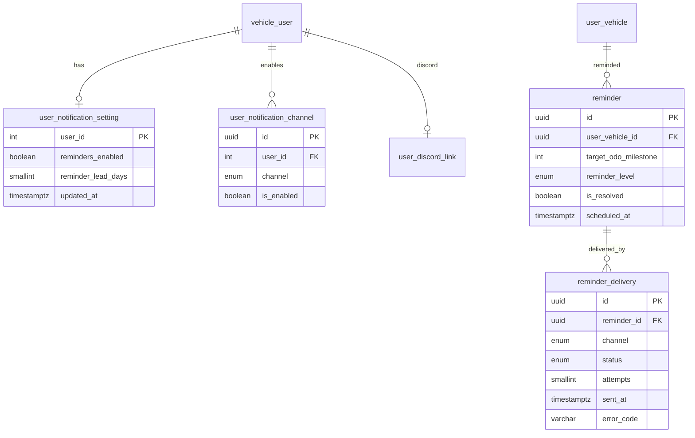

# Entity Specification — Nhắc mốc bảo dưỡng & cấu hình thông báo

> **Cập nhật phạm vi (02/10/2026):** các phần dưới đây trong tài liệu này không còn áp dụng.
>
> - Kết nối Discord (`user_discord_link`, ENT-417): **đã bỏ**. Nhắc bảo dưỡng, nhắc lịch hẹn và hỏi thăm hiện trong mục **Thông báo** của app; danh sách kênh ngoài (Zalo / Telegram / SMS / Email) vẫn có nhưng đều "Sắp có", bật nhắc không bắt buộc chọn kênh.

> Đặc tả dữ liệu cho `FEAT-NOTI-001` (US-021 → US-024).
>
> **Nguồn nghiệp vụ:** [Functional Spec](../feature-functional/us-021-sprint-2-spec.ff.md) · **API:** [API Spec](../api/us-021-sprint-2-spec.api.md) · **Tổng quan lược đồ:** [core.entity.md](../../entity/core.entity.md)
>
> Entity mới dùng `ENT-418` → `ENT-420`, business rule dùng dải `BR-ENT-45x`.

---

# 0. Document Information

| Field | Value |
| --- | --- |
| Document ID | `ENT-SPEC-NOTI-001` |
| Feature | `FEAT-NOTI-001` |
| Version | `v1.0` |
| Status | `Draft` |
| Owner | Backend Team |
| Created Date | `2026-09-28` |

## 0.1 Entity Catalog

| Entity ID | Entity | Table | Trạng thái | Vai trò |
| --- | --- | --- | --- | --- |
| `ENT-405` | `Reminder` | `reminder` | Có sẵn — **mở rộng** | Nhắc theo (xe, mốc, mức) |
| `ENT-417` | `UserDiscordLink` | `user_discord_link` | Có sẵn (spec) — **không đổi** | Nơi nhận Discord |
| **`ENT-418`** | `UserNotificationSetting` | `user_notification_setting` | **Mới** | Bật/tắt nhắc, số ngày nhắc trước |
| **`ENT-419`** | `UserNotificationChannel` | `user_notification_channel` | **Mới** | Kênh chủ xe đã bật/tắt |
| **`ENT-420`** | `ReminderDelivery` | `reminder_delivery` | **Mới** | Kết quả gửi theo kênh |

### Vì sao tách `reminder` và `reminder_delivery`

Một nhắc có thể gửi qua nhiều kênh, mỗi kênh có kết quả và số lần thử riêng. `reminder` trả lời "nhắc gì cho xe nào"; `reminder_delivery` trả lời "gửi tới đâu, kết quả ra sao". Nhờ vậy thêm kênh không đổi bảng `reminder`.

### Vì sao `user_notification_channel` không bắt buộc có dòng

Chủ xe chưa từng cấu hình ⇒ **không có dòng nào** ⇒ hệ thống hiểu là chỉ Discord (FF BR-505). Dòng chỉ được tạo khi chủ xe thay đổi lựa chọn. Người dùng mới và cũ đều có hành vi mặc định đúng mà không cần backfill.

## 0.2 ER Diagram



---

# ENT-418 — UserNotificationSetting

## 1. Entity Information

| Field | Value |
| --- | --- |
| Entity ID | `ENT-418` |
| Table | `user_notification_setting` |
| Domain | Identity / Notification |
| Version | `v1.0` · `Draft` |

## 2. Entity Overview

Một dòng / chủ xe, chỉ tạo khi chủ xe lưu cấu hình. Không có dòng ⇒ dùng mặc định (`reminders_enabled = true`, `reminder_lead_days` từ `.env`).

## 5. Attributes

| Field | Type | Required | Nullable | Default | Constraints | Description |
| --- | --- | ---: | ---: | --- | --- | --- |
| `user_id` | `integer` | Yes | No | - | PK, FK → `vehicle_user.user_id` `ON DELETE CASCADE` | Chủ xe |
| `reminders_enabled` | `boolean` | Yes | No | `true` | | Bật nhắc mốc bảo dưỡng |
| `reminder_lead_days` | `smallint` | Yes | No | `2` | `0..30` | Số ngày nhắc trước ngày đến hạn |
| `created_at` / `updated_at` | `timestamptz` | Yes | No | `now()` | | |

## 9. Business Rules

### BR-ENT-450 — Mặc định lấy từ cấu hình

**Rule:** Khi không có dòng, `reminder_lead_days = REMINDER_DEFAULT_LEAD_DAYS` (`.env`, mặc định 2). Giá trị lưu trong DB là lựa chọn của chủ xe, không đổi theo `.env` sau khi đã lưu.

## 10. Data Integrity

```sql
CHECK (reminder_lead_days BETWEEN 0 AND 30)
```

## 12. Ownership

Chủ xe đọc/ghi dòng của mình; job chỉ đọc.

---

# ENT-419 — UserNotificationChannel

## 1. Entity Information

| Field | Value |
| --- | --- |
| Entity ID | `ENT-419` |
| Table | `user_notification_channel` |
| Domain | Identity / Notification |
| Version | `v1.0` · `Draft` |

## 2. Entity Overview

Lựa chọn bật/tắt kênh của chủ xe. **Không** lưu địa chỉ nhận trong MVP: Discord lấy từ `user_discord_link`. Khi thêm kênh cần địa chỉ (email, SMS, Telegram, Zalo), thêm cột địa chỉ đã xác minh ở phase đó (xem §Q).

## 4. Keys

| Field | Unique | Description |
| --- | ---: | --- |
| `id` | PK | `uuid4` |
| (`user_id`, `channel`) | Yes | Mỗi kênh một dòng / chủ xe |

## 5. Attributes

| Field | Type | Required | Nullable | Default | Constraints | Description |
| --- | --- | ---: | ---: | --- | --- | --- |
| `id` | `uuid` | Yes | No | `uuid4` | PK | |
| `user_id` | `integer` | Yes | No | - | FK → `vehicle_user.user_id` `ON DELETE CASCADE` | Chủ xe |
| `channel` | `reminder_channel_enum` | Yes | No | - | `discord / zalo / telegram / sms / email` (không nhận `slack`, `in_app`, `push`, `sms_zalo`) | Kênh |
| `is_enabled` | `boolean` | Yes | No | `true` | | Đang bật |
| `created_at` / `updated_at` | `timestamptz` | Yes | No | `now()` | | |

## 9. Business Rules

### BR-ENT-451 — Kênh hiệu lực

**Rule:** Kênh hiệu lực của chủ xe = tập `channel` có `is_enabled = true`. Không có dòng nào ⇒ `{discord}`. Có dòng nhưng không dòng nào `is_enabled` ⇒ tập rỗng (chỉ hợp lệ khi `reminders_enabled = false`).

### BR-ENT-452 — Chỉ kênh khả dụng được bật

**Rule:** `is_enabled = true` chỉ được ghi cho kênh có adapter đăng ký (`NotificationService.available_channels()`). MVP: `{discord}`. Kiểm tra ở service; DB không ràng buộc để thêm kênh không cần migration.

## 10. Data Integrity

```sql
UNIQUE (user_id, channel)
```

---

# ENT-405 — Reminder (mở rộng)

Cấu trúc hiện có xem [reminder.entity.md](../../entity/maintenance/reminder.entity.md). Thay đổi:

| Thay đổi | Chi tiết |
| --- | --- |
| Unique | `UNIQUE (user_vehicle_id, target_odo_milestone, reminder_level)` — `ux_reminder_vehicle_milestone_level` (FF BR-502) |
| Enum `reminder_level_enum` | Dùng `early`, `expired`; `warning`, `urgent` giữ lại chưa dùng |
| Cột `channel` | Giữ để tương thích, luôn ghi `discord`; **kênh thực tế xem `reminder_delivery`** |
| `scheduled_at` | Thời điểm job tạo nhắc (không còn là thời điểm dự kiến trong tương lai) |
| `is_resolved` | `true` khi xe đã có booking (FF BR-503) |

## Business Rules

### BR-ENT-453 — Khoá nhắc

**Rule:** Tạo nhắc bằng `INSERT ... ON CONFLICT DO NOTHING` theo khoá ở trên; chỉ khi chèn được dòng mới thì gửi. Đảm bảo hai lần chạy job (hoặc hai worker) không gửi trùng.

---

# ENT-420 — ReminderDelivery

## 1. Entity Information

| Field | Value |
| --- | --- |
| Entity ID | `ENT-420` |
| Table | `reminder_delivery` |
| Domain | Notification |
| Version | `v1.0` · `Draft` |

## 2. Entity Overview

Kết quả gửi một nhắc qua một kênh. Tạo cùng lúc với nhắc, mỗi kênh hiệu lực một dòng, ở trạng thái `pending`.

## 4. Keys

| Field | Unique | Description |
| --- | ---: | --- |
| `id` | PK | `uuid4` |
| (`reminder_id`, `channel`) | Yes | Mỗi kênh một dòng / nhắc |

## 5. Attributes

| Field | Type | Required | Nullable | Default | Constraints | Description |
| --- | --- | ---: | ---: | --- | --- | --- |
| `id` | `uuid` | Yes | No | `uuid4` | PK | |
| `reminder_id` | `uuid` | Yes | No | - | FK → `reminder.id` `ON DELETE CASCADE` | Nhắc |
| `channel` | `reminder_channel_enum` | Yes | No | - | | Kênh |
| `status` | `notification_delivery_status_enum` | Yes | No | `pending` | `pending / sent / failed / no_recipient` | Trạng thái |
| `attempts` | `smallint` | Yes | No | `0` | `>= 0` | Số lần đã thử gửi |
| `last_attempt_at` | `timestamptz` | No | Yes | - | | Lần thử gần nhất |
| `sent_at` | `timestamptz` | No | Yes | - | Có khi `sent` | Gửi thành công lúc |
| `error_code` | `varchar(64)` | No | Yes | - | `TIMEOUT`, `RATE_LIMITED`, `DELIVERY_FORBIDDEN`, `NO_RECIPIENT`… | Lỗi cuối |
| `created_at` / `updated_at` | `timestamptz` | Yes | No | `now()` | | |

## 9. Business Rules

### BR-ENT-454 — Thử lại

**Rule:** Job tìm delivery `status = failed AND attempts < REMINDER_MAX_ATTEMPTS` và `error_code` là lỗi tạm thời (`TIMEOUT`, `RATE_LIMITED`, `UNAVAILABLE`) để thử lại. `DELIVERY_FORBIDDEN` và `NO_RECIPIENT` không thử lại.

### BR-ENT-455 — Không lưu nội dung

**Rule:** Không lưu nội dung thông báo đã gửi; dựng lại từ dữ liệu khi cần. Không lưu địa chỉ nhận.

## 10. Data Integrity

```sql
UNIQUE (reminder_id, channel)
CHECK (attempts >= 0)
CHECK (status <> 'sent' OR sent_at IS NOT NULL)
```

## 11. Index & Query

| Query | Fields | Index |
| --- | --- | --- |
| Delivery cần thử lại | `status`, `attempts` | `ix_reminder_delivery_retry` (partial `status = 'failed'`) |
| Delivery của một nhắc | `reminder_id` | Unique ở §4 |

## 16. Retention

Cascade theo `reminder`. Giữ tối thiểu 90 ngày `[Đề xuất]`.

---

# Enums

| Enum | Giá trị (DB) | Thay đổi |
| --- | --- | --- |
| `reminder_channel_enum` | `discord, email, sms, telegram, slack, in_app, push, sms_zalo` | **Thêm `zalo`** (`ALTER TYPE ... ADD VALUE`). `sms_zalo` (cũ) vẫn deprecated, không dùng |
| `notification_delivery_status_enum` | `pending, sent, failed, no_recipient` | **Mới** |

`slack` tồn tại từ trước nhưng chưa thuộc danh sách kênh của tính năng này (FF BR-506).

---

# Cấu hình (`.env`)

| Biến | Mặc định | Ý nghĩa |
| --- | --- | --- |
| `REMINDER_DEFAULT_LEAD_DAYS` | `2` | Ngày nhắc trước khi chủ xe chưa cấu hình |
| `REMINDER_JOB_HOUR` | `8` | Giờ chạy job hằng ngày (Asia/Ho_Chi_Minh) |
| `REMINDER_MAX_ATTEMPTS` | `3` | Số lần gửi tối đa mỗi delivery |

---

# Migration

1. `ALTER TYPE reminder_channel_enum ADD VALUE IF NOT EXISTS 'zalo'`.
2. Tạo enum `notification_delivery_status_enum`.
3. Tạo `user_notification_setting`, `user_notification_channel`, `reminder_delivery`.
4. Thêm unique `ux_reminder_vehicle_milestone_level` trên `reminder`. Trước khi tạo, xoá/gộp dòng trùng nếu có (hiện chưa có luồng nào ghi `reminder`).
5. Model code: `backend/src/common/core/notification/`, đăng ký trong `src.common.core`.
6. Không backfill.

---

# Q. Open Questions

| ID | Question | Owner | Status |
| --- | --- | --- | --- |
| `Q-510` | Khi thêm kênh cần địa chỉ (email/SMS/Telegram/Zalo): thêm cột `address` + `verified_at` vào `user_notification_channel` hay bảng riêng theo kênh? | Backend | Open — quyết khi làm kênh đầu tiên |
| `Q-511` | `ux_reminder_vehicle_milestone_level` có cần thêm `booking_id`/chu kỳ để nhắc lại mốc đã lặp (mốc recurring cùng km)? Mốc recurring luôn có km khác nhau nên hiện đủ | Backend | Open |

Câu hỏi nghiệp vụ: [FF §24](../feature-functional/us-021-sprint-2-spec.ff.md#24-open-questions).

---

# Change Log

| Version | Date | Author | Changes |
| --- | --- | --- | --- |
| `v1.0` | `2026-09-28` | Team 4 Người | ENT-418, ENT-419, ENT-420; mở rộng ENT-405 |

---

# Approval

| Role | Name | Status | Date |
| --- | --- | --- | --- |
| Product / Business | Lê Đức Tùng | Pending | |
| Technical Owner | Tech Lead | Pending | |
